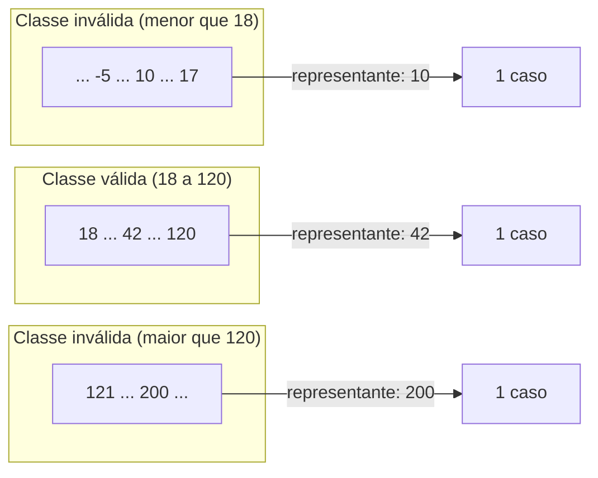
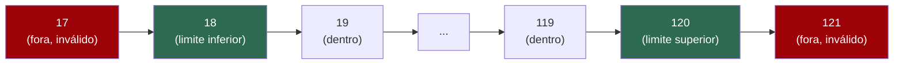
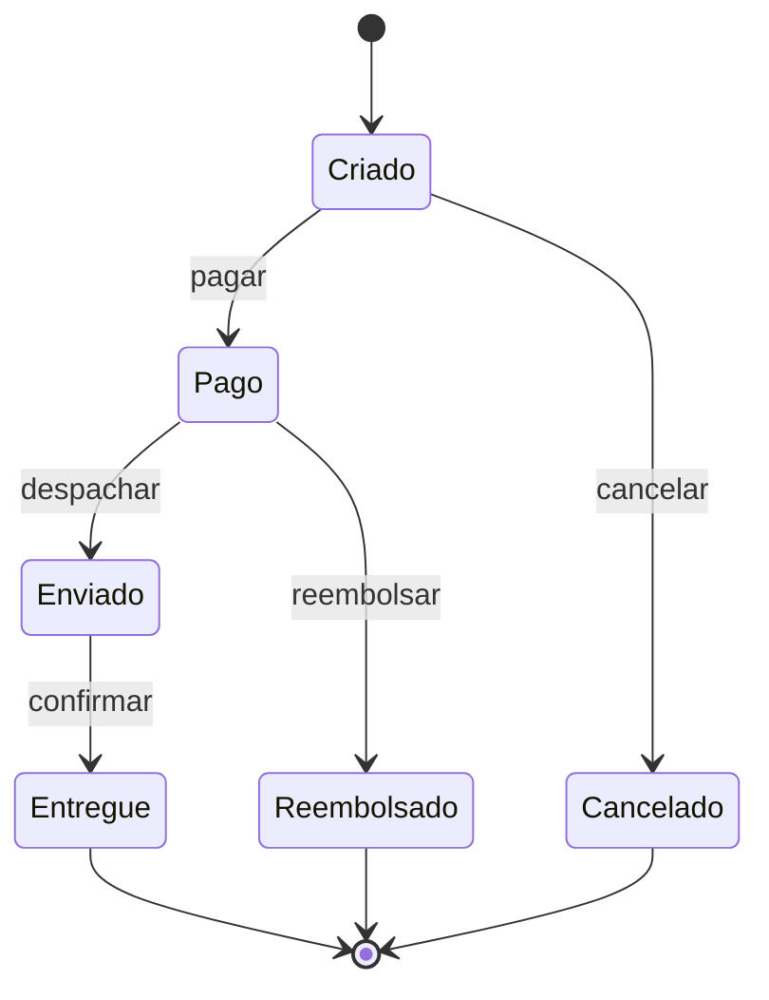
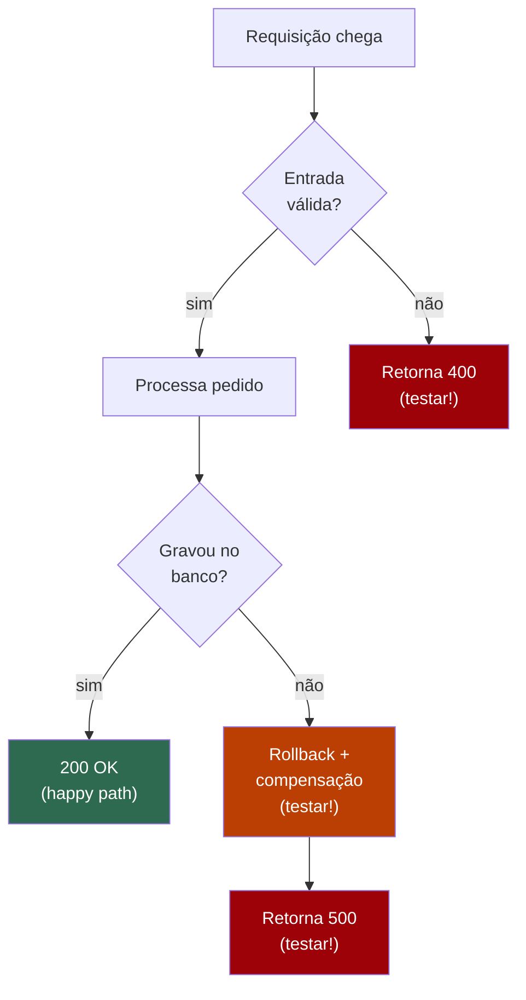

# Técnicas de teste e edge cases

> [!abstract] Resumo em uma linha
> Bom teste não nasce de inspiração — nasce de método: parta o domínio em classes, ataque as fronteiras, mapeie as combinações de regras e os estados, e rode o checklist de casos extremos como um adversário procurando a brecha.

A pergunta que trava todo mundo na frente do editor não é "como eu testo isso?" — é **"que casos eu escrevo?"**. Sem método, você cai num de dois extremos: ou escreve três testes do caminho feliz e dá por encerrado, ou tenta testar valores infinitos e nunca termina. As duas saídas são ruins.

Esta nota é o catálogo de técnicas que transforma um espaço de entradas potencialmente infinito num **conjunto pequeno e justificável** de casos. A ideia central é velha e provada: você não consegue testar tudo, então teste de forma a maximizar a chance de pegar um bug por caso escrito.

> [!tip] A mentalidade certa
> O bom testador não pensa como o autor do código ("será que funciona?"). Pensa como um **adversário** procurando a brecha ("onde isso quebra?"). Cada técnica abaixo é uma maneira sistemática de fazer essa pergunta hostil.

## Caixa-preta × caixa-branca

Antes de escolher casos, decida de onde você os deriva.

- **Caixa-preta (black-box):** você deriva os casos do **contrato/spec** — o que a função promete fazer, dadas quais entradas. Não olha o código por dentro. Equivalence partitioning, boundary value analysis, decision tables e state-transition são todas técnicas black-box.
- **Caixa-branca (white-box):** você deriva os casos da **estrutura interna** — quais ramos (`if`/`else`), laços e caminhos existem no código. O objetivo é exercer os caminhos. É aqui que mora a conversa de cobertura, que aprofundo em [[12 - Coverage e mutation testing]].

> [!note] As duas se complementam
> Black-box pega o que o código **deveria** fazer e esqueceu. White-box pega o que o código **faz** e não deveria (um `if` a mais, um caminho não testado). Um time maduro usa as duas: deriva casos da spec e depois checa quais ramos ficaram descobertos.

Na prática do dia a dia (e da maioria das notas desta trilha), você trabalha majoritariamente black-box. As técnicas a seguir são o coração disso.

## Equivalence Partitioning — partição de equivalência

A premissa: o sistema trata grupos inteiros de entradas **exatamente do mesmo jeito**. Se a faixa `1..17` é tratada como "menor de idade" e `18..120` como "adulto", não adianta testar `5`, `6`, `7`, `8`... — eles caem todos na mesma classe. Testar um representante de cada classe é, por hipótese, equivalente a testar qualquer outro valor dela.

> [!info] A definição ISTQB
> Partição de equivalência divide os dados em partições com base na expectativa de que **todos os elementos de uma dada partição são processados da mesma forma** pelo objeto sob teste. Se um caso que testa um valor da partição detecta um defeito, esse defeito deveria ser detectado por qualquer outro valor da mesma partição.

O método tem três passos:

1. Identifique o domínio de entrada.
2. Particione-o em classes de equivalência — incluindo as **inválidas** (entradas que o sistema deve rejeitar).
3. Escolha **um representante** de cada classe.

> [!example] Cadastro com campo "idade" aceitando 18 a 120
> | Classe | Faixa | Representante | Esperado |
> | --- | --- | --- | --- |
> | Inválida (baixa) | menor que 18 | 10 | rejeita |
> | Válida | 18 a 120 | 42 | aceita |
> | Inválida (alta) | maior que 120 | 200 | rejeita |
> | Inválida (não-número) | "abc" | "abc" | rejeita |
>
> Quatro casos cobrem um domínio de bilhões de valores possíveis. Esse é o ganho.

Lead-in: o diagrama mostra três classes de equivalência do campo "idade" e o representante escolhido de cada uma.

Leitura do diagrama: o domínio inteiro (de menos infinito a mais infinito) colapsa em três grupos. Dentro de cada grupo, qualquer valor é "tão bom quanto" outro para o teste — então pegamos um só. Repare que **a classe válida é uma só, mas as inválidas são duas** (abaixo e acima): erro comum é testar só uma borda do válido e esquecer que existe inválido dos dois lados.

> [!warning] A armadilha da partição de equivalência
> Ela assume que o sistema **de fato** trata a classe inteira igual. Se houver um ramo escondido — digamos, uma regra especial para idade exatamente `65` (aposentadoria) dentro da faixa "válida" — a partição grossa não pega. Por isso você combina com as próximas técnicas e, eventualmente, espia a cobertura.

## Boundary Value Analysis — análise de valor limite

Partição de equivalência diz **onde** testar. Análise de valor limite diz **que bugs moram nas bordas**. E moram mesmo: o programador escreve `if (idade >= 18)` ou `if (idade > 18)`? `<=` ou `<`? É na fronteira entre duas classes que o **off-by-one** se esconde.

> [!quote] Myers, *The Art of Software Testing*
> "Test cases that explore boundary conditions have a higher payoff than cases that do not." Myers vai além: BVA "requer um grau de criatividade" e "é mais um estado de espírito do que qualquer outra coisa". Não é receita de bolo — é o hábito de sempre olhar para a beira do precipício.

A receita de Myers para uma faixa: teste o **mínimo**, logo **acima do mínimo**, um valor **nominal**, logo **abaixo do máximo**, o **máximo**, e os valores **logo fora** dos dois extremos. Na prática condensada: para um limite `N`, teste `N-1`, `N` e `N+1`.

Lead-in: a mesma faixa de idade (18 a 120), agora vista pela lente das fronteiras.

Leitura do diagrama: os valores em verde são os limites válidos (`18`, `120`); os em vermelho são os vizinhos inválidos (`17`, `121`). É exatamente nesse vai-e-vem `17 → 18 → 19` e `119 → 120 → 121` que `>=` vira `>` por descuido. **Off-by-one mora aqui.** Repare: BVA não substitui a partição de equivalência — ela mira nas **bordas das classes que a partição já desenhou**.

> [!tip] Bordas não-óbvias
> Limite não é só número. Para uma **string**: vazia, 1 caractere, tamanho máximo, máximo+1. Para uma **lista**: vazia, 1 elemento, no limite de capacidade. Para uma **data**: virada de mês, virada de ano, 29/fev. Toda dimensão tem uma borda — caçá-las é o estado de espírito do Myers.

## Decision Tables — tabelas de decisão

Quando o comportamento depende de **combinações de condições**, partição e fronteira não dão conta sozinhas. É o território de regras de negócio: "se cliente premium E pedido acima de 500 E primeira compra → frete grátis + cupom". Três condições booleanas geram 2³ = 8 combinações. A tabela de decisão lista as condições, as combinações e a ação resultante de cada uma.

> [!info] ISTQB
> Tabelas de decisão testam a implementação de requisitos que especificam como **diferentes combinações de condições** resultam em diferentes desfechos. São uma forma eficaz de registrar lógica complexa, como regras de negócio.

> [!example] Comissão de vendas (gancho com [[09 - TDD na prática]])
> Regra: comissão de 10% se vendeu acima da meta; +5% de bônus se o cliente é novo; nada se a venda foi cancelada.
>
> | # | Acima da meta? | Cliente novo? | Cancelada? | Ação |
> | --- | --- | --- | --- | --- |
> | 1 | sim | sim | não | 15% |
> | 2 | sim | não | não | 10% |
> | 3 | não | sim | não | 0% (só bônus não vale sem base) |
> | 4 | não | não | não | 0% |
> | 5 | * | * | sim | 0% (cancelada zera tudo) |
>
> A linha 5 usa `*` ("don't care"): quando a venda é cancelada, as outras condições não importam. Isso colapsa 4 combinações em uma só regra — exatamente o que a tabela revela e o que um teste cego por amostragem perderia.

A tabela é também uma **ferramenta de descoberta de requisito**: ao preenchê-la, você costuma achar combinações que ninguém especificou ("e se for cliente novo numa venda cancelada?"). Cada linha vira um caso de teste; cada combinação não-coberta vira uma pergunta para o PO.

## State-Transition Testing — teste de transição de estado

Sistemas com **memória** — um pedido, uma sessão de login, um caixa eletrônico — não dependem só da entrada atual, mas do **estado em que estão**. A mesma ação ("pagar") tem efeito diferente se o pedido está `criado` ou já está `enviado`. Aqui a técnica é modelar os estados e testar as transições — as **válidas** e, principalmente, as **inválidas**.

> [!info] ISTQB
> Um diagrama de estados modela o comportamento de um sistema mostrando seus estados possíveis e as transições válidas. Uma transição é iniciada por um evento, que pode ser qualificado por uma condição de guarda.

Lead-in: ciclo de vida de um pedido, com os estados e as transições legítimas.

Leitura do diagrama: cada seta é uma transição que **deve** funcionar — teste todas. Mas o ouro do state-transition está no que **não** aparece no diagrama: as transições **inválidas**. "Despachar um pedido `Criado` (ainda não pago)" não tem seta — então o sistema deve **recusar** essa ação. "Cancelar um pedido `Entregue`" também não existe. Cada transição ausente é um caso de teste negativo.

> [!warning] O erro clássico
> Testar só as transições felizes (`criado → pago → enviado → entregue`) e esquecer as inválidas. O bug que pega produção é justamente o pedido que aceitou "despachar" sem ter sido pago — porque ninguém testou a transição proibida. Para cada estado, pergunte: **quais eventos NÃO deveriam funcionar aqui?**

## O checklist de edge cases

As técnicas acima são o esqueleto. O checklist abaixo é o músculo — a lista que você roda mentalmente sobre **cada entrada** do código. Não é decoreba; é a memória institucional de tudo que já quebrou em produção. Cada categoria vem com o **por quê**.

| Categoria | Exemplo | Por quê pega bug |
| --- | --- | --- |
| Input vazio | `""`, `[]`, `{}` | Código que faz `lista[0]` ou divide por `len` estoura no vazio |
| Null / undefined | `null`, `None`, `nil` | O NPE mais caro da história; "bilhão de dólares de erro" |
| Valores no limite | `0`, `-1`, `MAX_INT`, `MIN_INT` | Off-by-one e o zero que zera a divisão |
| Overflow | `MAX_INT + 1`, soma de saldos | Inteiro estoura e vira negativo silenciosamente |
| Unicode | emoji, RTL (árabe/hebraico), combining chars | `length` mente; `"👨‍👩‍👧"` tem 1 "caractere" e 11 code units |
| Timezone / horário de verão | `23:30` na virada do DST | Uma hora some ou repete; agendamentos disparam errado |
| Datas | 29/fev, fim de mês, ano bissexto | `31 + 1 mês` não é "32"; fevereiro tem 28 ou 29 |
| Duplicatas | mesmo item duas vezes na lista | `Set` engole, regra de negócio talvez não |
| Ordem inversa / aleatória | entrada já ordenada, ao contrário, embaralhada | Algoritmo que assumiu ordem quebra; pior caso de sort |
| Tamanhos extremos | 1 elemento × milhões | O que passa com 10 estoura memória com 10 milhões |
| Caracteres especiais | aspas, `'; DROP TABLE`, `<script>` | Injection (SQL/HTML); escaping mal feito |
| Erros de rede | timeout, HTTP 500, conexão fechada | O happy path da rede é mentira; ela falha sempre |
| Recursos esgotados | pool de conexão cheio, disco/memória cheios | Sob carga, o que sobra acaba — e o erro vem feio |
| Concorrência + falha parcial | duas threads, falha no meio da transação | Race condition; estado meio-gravado sem rollback |

> [!tip] Como usar o checklist
> Não aplique os 14 itens cegamente a tudo. Para cada **parâmetro** da função, pergunte: "ele é string? então: vazia, null, unicode, longa demais. É número? então: zero, negativo, MAX, overflow. É data? então: 29/fev, fim de mês, timezone." O checklist é um gerador de perguntas, não uma cota de testes.

## Testar o caminho de erro — não só o happy path

Aqui está o conselho que mais economiza noites de plantão: **o caminho de erro é código que também roda — e quase ninguém testa.** O happy path é o que você imagina ao escrever a função. O caminho de erro é o `catch`, o `rollback`, a compensação, o retry. É justamente onde o código foi escrito com menos atenção e exercitado com menos frequência.

Lead-in: o fluxo de uma requisição, com o caminho feliz (verde) e os caminhos de erro (vermelho/laranja) lado a lado.

Leitura do diagrama: o caminho verde é o único que a maioria testa. Mas para chegar nele, a requisição passou por uma validação (que pode rejeitar) e por uma gravação (que pode falhar). Cada losango é uma bifurcação, e o ramo "não" é um caso de teste que costuma faltar. O nó laranja — **rollback e compensação** — é o mais crítico e o menos testado: é onde o sistema decide se uma falha parcial deixa lixo no banco ou volta limpo.

> [!warning] O esquecido que pega em produção
> Testar a exceção não é só "verificar que lança". É verificar **o que acontece depois**: a transação reverteu? O e-mail de confirmação NÃO foi enviado? O contador NÃO incrementou? A falha do caminho feliz dá erro 500 e alguém percebe. A falha do caminho de erro dá **dado corrompido silencioso** — e ninguém percebe até a auditoria.

> [!note] Conexão com property-based
> Quando o espaço de casos é grande demais para enumerar à mão, dá para fazer a máquina gerar os edge cases por você — é o que faz o property-based testing, que cobro em [[13 - Além do básico - property-based, snapshot, contract, smoke]]. As técnicas desta nota continuam valendo: elas dizem ao gerador **onde** olhar (fronteiras, classes, estados).

## Em entrevista

Senior interviewers don't want a list of happy-path cases — they want to see your **method** for choosing cases. Open by naming the techniques: "I start black-box, deriving cases from the contract. I use equivalence partitioning to group inputs the system treats the same, then boundary value analysis on the edges of those partitions, because that's where off-by-one bugs live." For anything with combined business rules, mention decision tables; for anything stateful, mention state-transition testing and stress that you test the **invalid transitions**, not just the valid ones. Then run the edge-case checklist out loud — empty, null, boundaries, overflow, unicode, dates, concurrency — and frame it as "thinking like an adversary looking for the crack." Finish strong with the line that signals seniority: "and I always test the error paths, not just the happy path — the rollback and compensation logic is where the expensive production bugs hide." If they push on white-box, connect it to coverage: structure-derived cases catch the branches the spec forgot.

### Vocabulário

- partição de equivalência → equivalence partitioning
- classe de equivalência → equivalence class
- análise de valor limite → boundary value analysis (BVA)
- valor limite / fronteira → boundary value
- erro de um a mais → off-by-one error
- tabela de decisão → decision table
- transição de estado → state transition
- transição inválida → invalid transition
- condição de guarda → guard condition
- caso extremo → edge case / corner case
- caminho feliz → happy path
- caminho de erro → error path / sad path / unhappy path
- caixa-preta → black-box
- caixa-branca → white-box
- estouro (de inteiro) → overflow
- valor representante → representative value
- caso de teste negativo → negative test case

> [!info] Lastro
> - ISTQB Foundation Level Syllabus, seção 4.2 "Black-Box Test Techniques" — definições oficiais de equivalence partitioning, boundary value analysis, decision table testing e state transition testing. [astqb.org/4-2-black-box-test-techniques](https://astqb.org/4-2-black-box-test-techniques/)
> - Glenford J. Myers, *The Art of Software Testing*, cap. 4 — origem do "test cases that explore boundary conditions have a higher payoff" e da ideia de equivalence partitioning. [cs.purdue.edu/.../MyersChap04.htm](https://www.cs.purdue.edu/homes/xyzhang/cs408spring16/MyersChap04.htm)
> - ISTQB Boundary Value Analysis white paper (2025) — aprofundamento de BVA segundo o syllabus Foundation. [istqb.org/.../Boundary-Value-Analysis-white-paper.pdf](https://istqb.org/wp-content/uploads/2025/10/Boundary-Value-Analysis-white-paper.pdf)

## Veja também

- [[03 - Anatomia de um bom teste]] — o que cada caso escolhido aqui deve parecer por dentro
- [[04 - Testes unitários]] — onde a maioria desses casos vive
- [[09 - TDD na prática]] — a regra da comissão que vira tabela de decisão
- [[12 - Coverage e mutation testing]] — a lente caixa-branca: quais ramos seus casos cobriram
- [[13 - Além do básico - property-based, snapshot, contract, smoke]] — quando a máquina gera os edge cases por você
- [[16 - Estratégia de testes em entrevista]] — como narrar tudo isso sob pressão
- [[03-Dominios/Engenharia/Testes/index|Testes]]
