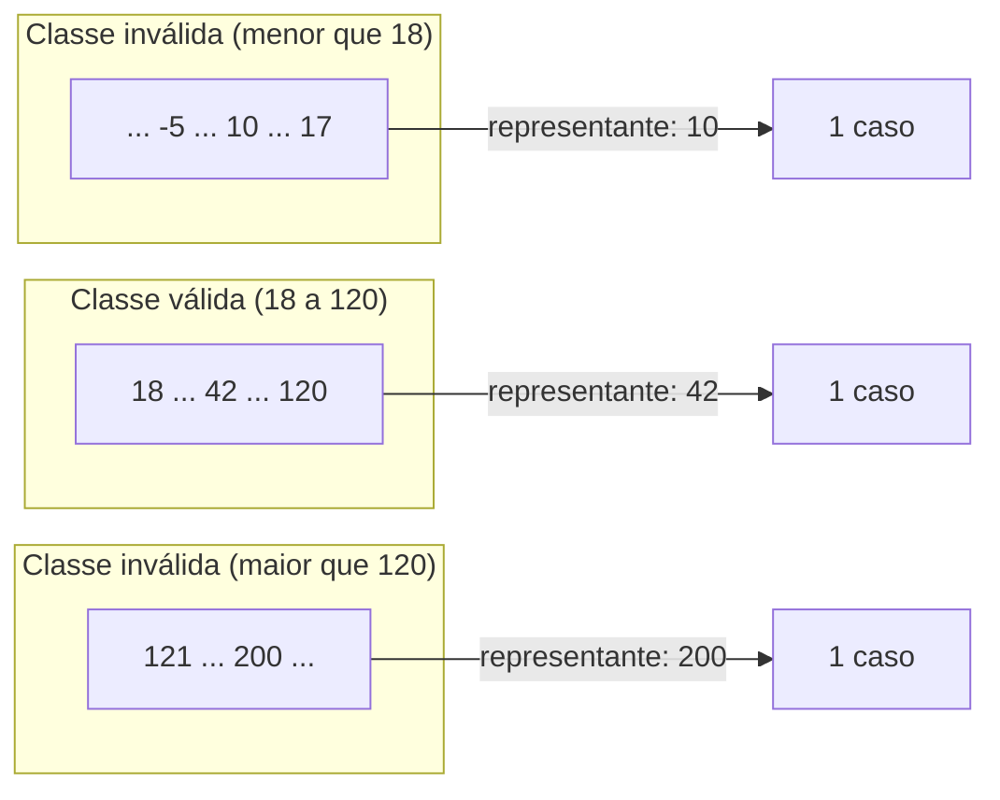
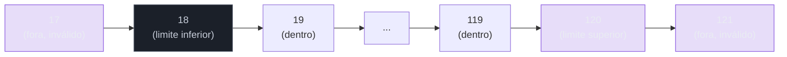
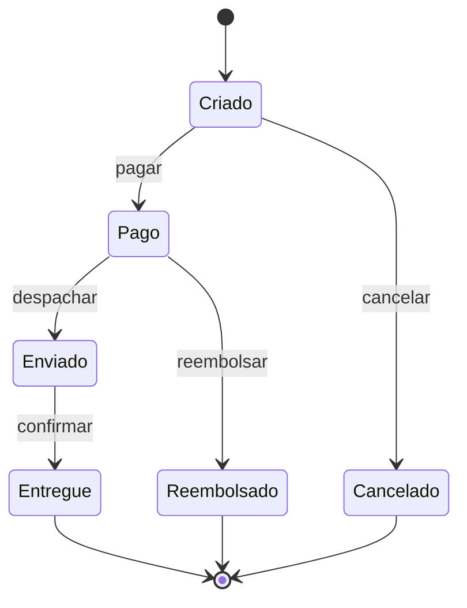
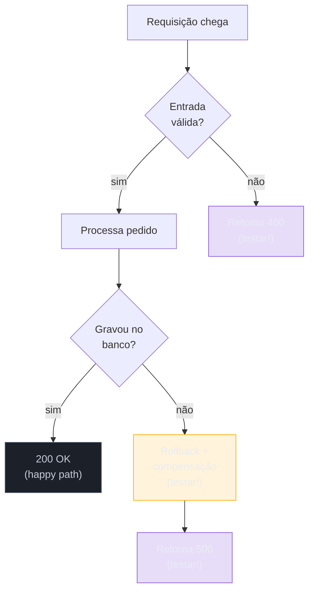
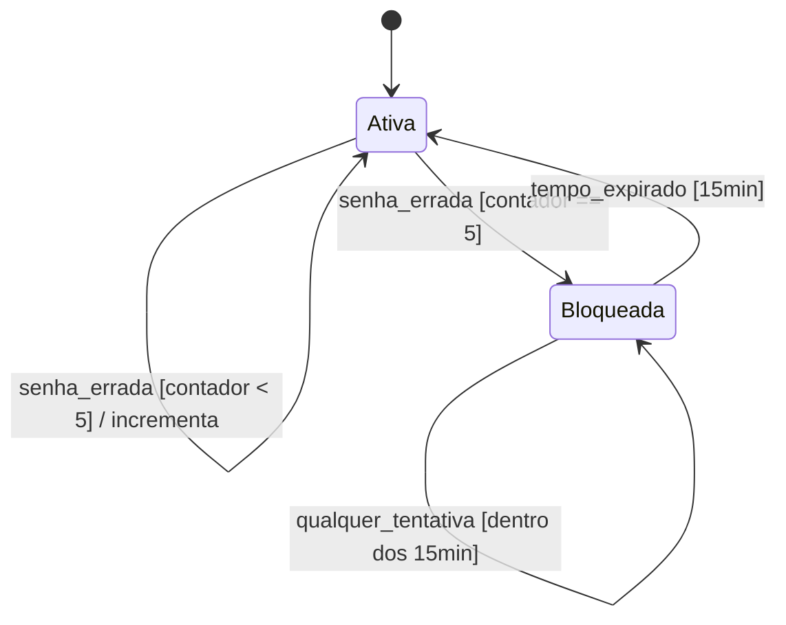

# Técnicas de teste e edge cases

> [!abstract] Resumo
> Bom teste não nasce de inspiração — nasce de método. **Equivalence partitioning** divide o domínio de entrada em classes que o sistema trata do mesmo jeito, para que um representante de cada classe baste. **Boundary value analysis** ataca as fronteiras dessas classes, porque é ali — no `>=` que devia ser `>` — que o off-by-one se esconde. **Decision tables** e **state-transition testing** cobrem o que a partição sozinha não alcança: combinações de regras de negócio e sistemas com memória, onde a mesma entrada produz efeitos diferentes conforme o estado. Por cima de tudo isso roda o **checklist de edge cases** — vazio, null, overflow, unicode, timezone, concorrência — a lista de tudo que já quebrou em produção, aplicada a cada parâmetro como uma pergunta hostil: "onde isso quebra?"

A pergunta que trava todo mundo na frente do editor não é "como eu testo isso?" — é **"que casos eu escrevo?"**. Sem método, você cai num de dois extremos: ou escreve três testes do caminho feliz e dá por encerrado, ou tenta testar valores infinitos e nunca termina. As duas saídas são ruins.

Esta nota é o catálogo de técnicas que transforma um espaço de entradas potencialmente infinito num **conjunto pequeno e justificável** de casos. A ideia central é velha e provada: você não consegue testar tudo, então teste de forma a maximizar a chance de pegar um bug por caso escrito.

> [!tip] Vídeo — Boundary Value Analysis, Equivalence Partitioning e Decision Table
> [Test-o-blog: "05: Boundary Value Analysis, Equivalence class Partitioning and Decision Table"](https://www.youtube.com/watch?v=b2EZifZtFi8) (6:31) — percorre as três técnicas em sequência com exemplos numéricos, reforçando por que decision table entra quando EP/BVA sozinhas não bastam.

> [!tip] A mentalidade certa
> O bom testador não pensa como o autor do código ("será que funciona?"). Pensa como um **adversário** procurando a brecha ("onde isso quebra?"). Cada técnica abaixo é uma maneira sistemática de fazer essa pergunta hostil.

## Caixa-preta × caixa-branca

Antes de escolher casos, decida de onde você os deriva.

- **Caixa-preta (black-box):** você deriva os casos do **contrato/spec** — o que a função promete fazer, dadas quais entradas. Não olha o código por dentro. Equivalence partitioning, boundary value analysis, decision tables e state-transition são todas técnicas black-box.
- **Caixa-branca (white-box):** você deriva os casos da **estrutura interna** — quais ramos (`if`/`else`), laços e caminhos existem no código. O objetivo é exercer os caminhos. É aqui que mora a conversa de cobertura, que aprofundo em [[12 - Coverage e mutation testing]].

> [!note] As duas se complementam
> Black-box pega o que o código **deveria** fazer e esqueceu. White-box pega o que o código **faz** e não deveria (um `if` a mais, um caminho não testado). Um time maduro usa as duas: deriva casos da spec e depois checa quais ramos ficaram descobertos.

Na prática do dia a dia (e da maioria das notas desta trilha), você trabalha majoritariamente black-box. As técnicas a seguir são o coração disso.

## Equivalence Partitioning — partição de equivalência

A premissa: o sistema trata grupos inteiros de entradas **exatamente do mesmo jeito**. Se a faixa `1..17` é tratada como "menor de idade" e `18..120` como "adulto", não adianta testar `5`, `6`, `7`, `8`... — eles caem todos na mesma classe. Testar um representante de cada classe é, por hipótese, equivalente a testar qualquer outro valor dela.

> [!info] A definição ISTQB
> Partição de equivalência divide os dados em partições com base na expectativa de que **todos os elementos de uma dada partição são processados da mesma forma** pelo objeto sob teste. Se um caso que testa um valor da partição detecta um defeito, esse defeito deveria ser detectado por qualquer outro valor da mesma partição.

O método tem três passos:

1. Identifique o domínio de entrada.
2. Particione-o em classes de equivalência — incluindo as **inválidas** (entradas que o sistema deve rejeitar).
3. Escolha **um representante** de cada classe.

> [!example] Cadastro com campo "idade" aceitando 18 a 120
> | Classe | Faixa | Representante | Esperado |
> | --- | --- | --- | --- |
> | Inválida (baixa) | menor que 18 | 10 | rejeita |
> | Válida | 18 a 120 | 42 | aceita |
> | Inválida (alta) | maior que 120 | 200 | rejeita |
> | Inválida (não-número) | "abc" | "abc" | rejeita |
>
> Quatro casos cobrem um domínio de bilhões de valores possíveis. Esse é o ganho.

Lead-in: o diagrama mostra três classes de equivalência do campo "idade" e o representante escolhido de cada uma.

Leitura do diagrama: o domínio inteiro (de menos infinito a mais infinito) colapsa em três grupos. Dentro de cada grupo, qualquer valor é "tão bom quanto" outro para o teste — então pegamos um só. Repare que **a classe válida é uma só, mas as inválidas são duas** (abaixo e acima): erro comum é testar só uma borda do válido e esquecer que existe inválido dos dois lados.

### Partição multidimensional: quando há mais de um parâmetro

O exemplo acima particiona **um** parâmetro. Uma função real quase sempre tem vários — e aí a pergunta muda: você particiona **cada parâmetro separadamente** (e testa um representante de cada classe, isoladamente) ou **as combinações entre parâmetros** (produto cartesiano das classes)?

A resposta prática do ISTQB syllabus é: comece particionando cada parâmetro de forma independente — é o que o `4n` de BVA também assume (hipótese de falha única, uma variável de cada vez). Combinações entre partições só entram quando há **motivo de negócio** para achar que elas interagem (como no exemplo de bloqueio de login mais abaixo, em que "senha correta" e "conta bloqueada" interagem de propósito). Combinar partições sem motivo é a mesma armadilha do worst-case testing: o número de casos explode (`k` classes em `n` parâmetros dão `k^n` combinações) muito mais rápido do que o número de bugs reais de interação.

## Boundary Value Analysis — análise de valor limite

Partição de equivalência diz **onde** testar. Análise de valor limite diz **que bugs moram nas bordas**. E moram mesmo: o programador escreve `if (idade >= 18)` ou `if (idade > 18)`? `<=` ou `<`? É na fronteira entre duas classes que o **off-by-one** se esconde.

> [!quote] Myers, *The Art of Software Testing*
> "Test cases that explore boundary conditions have a higher payoff than cases that do not." Myers vai além: BVA "requer um grau de criatividade" e "é mais um estado de espírito do que qualquer outra coisa". Não é receita de bolo — é o hábito de sempre olhar para a beira do precipício.

A receita de Myers para uma faixa: teste o **mínimo**, logo **acima do mínimo**, um valor **nominal**, logo **abaixo do máximo**, o **máximo**, e os valores **logo fora** dos dois extremos. Na prática condensada: para um limite `N`, teste `N-1`, `N` e `N+1`.

Lead-in: a mesma faixa de idade (18 a 120), agora vista pela lente das fronteiras.

Leitura do diagrama: os valores em verde são os limites válidos (`18`, `120`); os em vermelho são os vizinhos inválidos (`17`, `121`). É exatamente nesse vai-e-vem `17 → 18 → 19` e `119 → 120 → 121` que `>=` vira `>` por descuido. **Off-by-one mora aqui.** Repare: BVA não substitui a partição de equivalência — ela mira nas **bordas das classes que a partição já desenhou**.

> [!tip] Bordas não-óbvias
> Limite não é só número. Para uma **string**: vazia, 1 caractere, tamanho máximo, máximo+1. Para uma **lista**: vazia, 1 elemento, no limite de capacidade. Para uma **data**: virada de mês, virada de ano, 29/fev. Toda dimensão tem uma borda — caçá-las é o estado de espírito do Myers.

### Worst-case testing: quando uma fronteira não basta

BVA simples assume a **hipótese de falha única**: testa uma variável no limite de cada vez, mantendo as outras em valor nominal. Para uma função com `n` variáveis, isso gera `4n + 1` casos. Mas e se o bug só aparecer quando **duas fronteiras falham ao mesmo tempo** — por exemplo, o desconto máximo aplicado no mesmo pedido que atinge o limite de itens do carrinho?

Essa é a pergunta que o **worst-case testing** responde: em vez de variar uma fronteira por vez, ele combina os cinco valores de BVA (mínimo, logo-acima-do-mínimo, nominal, logo-abaixo-do-máximo, máximo) de **cada** variável com os de todas as outras, gerando `5^n` casos. É caro — cresce exponencial com o número de variáveis — mas pega a classe de bug que a hipótese de falha única esconde.

Existe um meio-termo mais usado na prática: o **robustness testing** (ou "robust worst-case"), que soma às fronteiras válidas os valores **fora** do domínio (logo abaixo do mínimo, logo acima do máximo) para verificar que o sistema rejeita com uma mensagem de erro decente, em vez de travar. Combinado ponto a ponto, isso produz `7^n` casos no worst-case robusto — geralmente demais para rodar à mão, mas é exatamente o espaço de casos que **fuzzing orientado por fronteira** cobre de forma automática (mais sobre isso adiante).

> [!example] Quando vale o esforço extra
> Para uma função com 2-3 variáveis, `worst-case testing` completo é viável manualmente. Acima disso, o custo de escrever e manter `5^n`/`7^n` casos supera o ganho — a resposta prática é combinar BVA simples nas fronteiras mais críticas com **pairwise testing** (cobrir toda combinação de pares de valores, não todas as combinações) para reduzir o espaço sem abrir mão de pegar interações de duas variáveis, que são a maioria dos bugs de combinação segundo estudos de interação de falhas.

> [!summary] Em uma linha
> BVA simples testa uma fronteira por vez; worst-case e robustness testing combinam fronteiras de várias variáveis — use-os quando houver motivo real para achar que elas interagem, não por padrão.

## Decision Tables — tabelas de decisão

Quando o comportamento depende de **combinações de condições**, partição e fronteira não dão conta sozinhas. É o território de regras de negócio: "se cliente premium E pedido acima de 500 E primeira compra → frete grátis + cupom". Três condições booleanas geram 2³ = 8 combinações. A tabela de decisão lista as condições, as combinações e a ação resultante de cada uma.

> [!info] ISTQB
> Tabelas de decisão testam a implementação de requisitos que especificam como **diferentes combinações de condições** resultam em diferentes desfechos. São uma forma eficaz de registrar lógica complexa, como regras de negócio.

> [!example] Comissão de vendas (gancho com [[09 - TDD na prática]])
> Regra: comissão de 10% se vendeu acima da meta; +5% de bônus se o cliente é novo; nada se a venda foi cancelada.
>
> | # | Acima da meta? | Cliente novo? | Cancelada? | Ação |
> | --- | --- | --- | --- | --- |
> | 1 | sim | sim | não | 15% |
> | 2 | sim | não | não | 10% |
> | 3 | não | sim | não | 0% (só bônus não vale sem base) |
> | 4 | não | não | não | 0% |
> | 5 | * | * | sim | 0% (cancelada zera tudo) |
>
> A linha 5 usa `*` ("don't care"): quando a venda é cancelada, as outras condições não importam. Isso colapsa 4 combinações em uma só regra — exatamente o que a tabela revela e o que um teste cego por amostragem perderia.

A tabela é também uma **ferramenta de descoberta de requisito**: ao preenchê-la, você costuma achar combinações que ninguém especificou ("e se for cliente novo numa venda cancelada?"). Cada linha vira um caso de teste; cada combinação não-coberta vira uma pergunta para o PO.

### Como colapsar a tabela sem perder cobertura

O exemplo acima já nasceu colapsado — mas vale ver o processo, porque é isso que separa uma tabela de decisão de uma lista de casos qualquer. Comece pela tabela **completa**: três condições booleanas dão `2³ = 8` linhas, uma para cada combinação de sim/não. Depois, procure linhas cuja **ação é idêntica independente de uma das condições** — essa condição vira `*`. No exemplo da comissão, as quatro combinações com "Cancelada = sim" (`sim/sim`, `sim/não`, `não/sim`, `não/não` para as duas primeiras condições) dão sempre a mesma ação (`0%`), então colapsam nas 4 → 1 linha. O algoritmo é mecânico: agrupe linhas idênticas exceto por uma condição, substitua a condição divergente por `*`, repita até não haver mais grupo para colapsar. O ganho não é só menos digitação — é a **prova visual** de que uma condição realmente não influencia o resultado; se ao tentar colapsar você descobrir que duas linhas do "grupo" na verdade têm ações diferentes, achou uma regra de negócio que o requisito original não deixou clara.

> [!summary] Em uma linha
> Colapsar uma tabela de decisão não é atalho — é a prova de que uma condição não importa; quando o colapso falha, você achou uma regra escondida.

## State-Transition Testing — teste de transição de estado

Sistemas com **memória** — um pedido, uma sessão de login, um caixa eletrônico — não dependem só da entrada atual, mas do **estado em que estão**. A mesma ação ("pagar") tem efeito diferente se o pedido está `criado` ou já está `enviado`. Aqui a técnica é modelar os estados e testar as transições — as **válidas** e, principalmente, as **inválidas**.

> [!info] ISTQB
> Um diagrama de estados modela o comportamento de um sistema mostrando seus estados possíveis e as transições válidas. Uma transição é iniciada por um evento, que pode ser qualificado por uma condição de guarda.

Lead-in: ciclo de vida de um pedido, com os estados e as transições legítimas.

Leitura do diagrama: cada seta é uma transição que **deve** funcionar — teste todas. Mas o ouro do state-transition está no que **não** aparece no diagrama: as transições **inválidas**. "Despachar um pedido `Criado` (ainda não pago)" não tem seta — então o sistema deve **recusar** essa ação. "Cancelar um pedido `Entregue`" também não existe. Cada transição ausente é um caso de teste negativo.

### Quanto é "suficiente"? N-switch coverage

Testar cada seta do diagrama uma vez cobre as transições **individuais** — mas não pega o bug que só aparece numa **sequência**. Um pedido pago-e-reembolsado-no-mesmo-segundo pode deixar o estoque inconsistente mesmo que `pagar` e `reembolsar` funcionem perfeitamente isolados. Chow formalizou os níveis de cobertura de sequência como **n-switch coverage**, onde `n` é o número de transições consecutivas testadas menos um:

- **0-switch coverage:** cada transição individual é testada pelo menos uma vez — é o que o diagrama acima já cobre.
- **1-switch coverage:** todo par de transições consecutivas válidas é testado — por exemplo, `pagar → despachar` e `despachar → confirmar` como sequências, não isoladas.
- **N-switch coverage:** sequências de `n+1` transições consecutivas. Na prática, o syllabus raramente exige além de 1-switch ou 2-switch — o custo de enumerar sequências cresce rápido.

> [!question]- Por que 0-switch não é suficiente sozinho?
> Porque estado é memória, e memória tem efeito colateral entre chamadas. Testar `pagar` isoladamente (a partir de um pedido fabricado já em estado `Criado`) não garante que o sistema se comporta igual quando `pagar` é a **segunda** ação de uma sequência real, depois de outro evento ter deixado resíduo (um lock não liberado, um contador não zerado). 1-switch é o primeiro nível que pega esse tipo de interação.

> [!summary] Em uma linha
> 0-switch testa cada seta do diagrama; 1-switch testa pares de setas em sequência — a maioria dos bugs de "estado sujo" só aparece na sequência, nunca na transição isolada.

## O checklist de edge cases

As técnicas acima são o esqueleto. O checklist abaixo é o músculo — a lista que você roda mentalmente sobre **cada entrada** do código. Não é decoreba; é a memória institucional de tudo que já quebrou em produção. Cada categoria vem com o **por quê**.

| Categoria | Exemplo | Por quê pega bug |
| --- | --- | --- |
| Input vazio | `""`, `[]`, `{}` | Código que faz `lista[0]` ou divide por `len` estoura no vazio |
| Null / undefined | `null`, `None`, `nil` | O NPE mais caro da história; "bilhão de dólares de erro" |
| Valores no limite | `0`, `-1`, `MAX_INT`, `MIN_INT` | Off-by-one e o zero que zera a divisão |
| Overflow | `MAX_INT + 1`, soma de saldos | Inteiro estoura e vira negativo silenciosamente |
| Unicode | emoji, RTL (árabe/hebraico), combining chars | `length` mente; `"👨‍👩‍👧"` tem 1 "caractere" e 11 code units |
| Timezone / horário de verão | `23:30` na virada do DST | Uma hora some ou repete; agendamentos disparam errado |
| Datas | 29/fev, fim de mês, ano bissexto | `31 + 1 mês` não é "32"; fevereiro tem 28 ou 29 |
| Duplicatas | mesmo item duas vezes na lista | `Set` engole, regra de negócio talvez não |
| Ordem inversa / aleatória | entrada já ordenada, ao contrário, embaralhada | Algoritmo que assumiu ordem quebra; pior caso de sort |
| Tamanhos extremos | 1 elemento × milhões | O que passa com 10 estoura memória com 10 milhões |
| Caracteres especiais | aspas, `'; DROP TABLE`, `<script>` | Injection (SQL/HTML); escaping mal feito |
| Erros de rede | timeout, HTTP 500, conexão fechada | O happy path da rede é mentira; ela falha sempre |
| Recursos esgotados | pool de conexão cheio, disco/memória cheios | Sob carga, o que sobra acaba — e o erro vem feio |
| Concorrência + falha parcial | duas threads, falha no meio da transação | Race condition; estado meio-gravado sem rollback |

> [!tip] Como usar o checklist
> Não aplique os 14 itens cegamente a tudo. Para cada **parâmetro** da função, pergunte: "ele é string? então: vazia, null, unicode, longa demais. É número? então: zero, negativo, MAX, overflow. É data? então: 29/fev, fim de mês, timezone." O checklist é um gerador de perguntas, não uma cota de testes.

> [!example] Aplicando o checklist a um parâmetro `email: string`
> Passe o parâmetro pelas categorias que se aplicam a string e veja quantos casos relevantes o checklist já sugere sem nenhuma criatividade extra:
>
> | Categoria do checklist | Valor de teste | O que verifica |
> | --- | --- | --- |
> | Input vazio | `""` | Rejeita, ou trata como "sem e-mail"? |
> | Null / undefined | `null` | Não estoura NPE antes da validação |
> | Unicode | `"tëst@exämple.com"`, domínio com IDN | Normalização/validação não quebra em acento |
> | Caracteres especiais | `"'; DROP TABLE--@x.com"` | Escaping correto na camada de persistência |
> | Tamanhos extremos | e-mail com 300+ caracteres | Respeita o limite do RFC 5321 (254 chars) ou trunca silenciosamente? |
> | Duplicatas | mesmo e-mail cadastrado 2x, com maiúsculas diferentes | `Foo@x.com` e `foo@x.com` colidem ou não? |
>
> Seis linhas, um parâmetro, nenhuma delas inventada — cada uma é uma categoria do checklist aplicada literalmente. É esse mapeamento mecânico que transforma "tenta lembrar dos edge cases" em "roda a lista".

## Testar o caminho de erro — não só o happy path

Aqui está o conselho que mais economiza noites de plantão: **o caminho de erro é código que também roda — e quase ninguém testa.** O happy path é o que você imagina ao escrever a função. O caminho de erro é o `catch`, o `rollback`, a compensação, o retry. É justamente onde o código foi escrito com menos atenção e exercitado com menos frequência.

Lead-in: o fluxo de uma requisição, com o caminho feliz (verde) e os caminhos de erro (vermelho/laranja) lado a lado.

Leitura do diagrama: o caminho verde é o único que a maioria testa. Mas para chegar nele, a requisição passou por uma validação (que pode rejeitar) e por uma gravação (que pode falhar). Cada losango é uma bifurcação, e o ramo "não" é um caso de teste que costuma faltar. O nó laranja — **rollback e compensação** — é o mais crítico e o menos testado: é onde o sistema decide se uma falha parcial deixa lixo no banco ou volta limpo.

Um caso de erro específico merece destaque à parte: **o retry depois de falha parcial**. Se o cliente reenvia a mesma requisição porque não recebeu resposta (timeout, conexão caiu), o servidor pode ter processado a primeira tentativa e não ter conseguido responder — o retry chega num sistema que já mudou de estado. Testar isso é perguntar: a operação é **idempotente**? Rodar `pagar()` duas vezes com o mesmo `idempotency_key` cobra o cliente uma vez ou duas? Esse é o edge case que junta duas linhas do checklist ("Erros de rede" + "Concorrência e falha parcial") com o pensamento de state-transition: o segundo `pagar()` chega num pedido que já não está mais em `Criado`.

> [!note] Conexão com property-based
> Quando o espaço de casos é grande demais para enumerar à mão, dá para fazer a máquina gerar os edge cases por você — é o que faz o property-based testing, que cobro em [[13 - Além do básico - property-based, snapshot, contract, smoke]]. As técnicas desta nota continuam valendo: elas dizem ao gerador **onde** olhar (fronteiras, classes, estados).

## Como escolher a técnica certa

As quatro técnicas não competem — respondem perguntas diferentes sobre o mesmo sistema. A tabela abaixo é o resumo que eu uso pra decidir por onde começar diante de uma função nova (categorização segundo o ISTQB Foundation Level Syllabus, seção 4.2):

| Técnica | Pergunta que responde | Pega este tipo de bug | Não pega |
| --- | --- | --- | --- |
| Equivalence partitioning | "Que grupos de entrada o sistema trata igual?" | Categoria inteira tratada errado (ex.: todo `null` derruba a função) | Bug que só aparece na borda exata de uma classe |
| Boundary value analysis | "O que acontece bem na fronteira?" | Off-by-one, `<=` vs `<`, limite mal calculado | Bug de combinação entre duas variáveis diferentes |
| Decision tables | "O que acontece quando regras se combinam?" | Regra de negócio esquecida numa combinação específica | Comportamento que depende de estado anterior |
| State-transition | "O que acontece dependendo de onde o sistema está?" | Transição proibida aceita, sequência inválida ignorada | Bug de valor de entrada isolado (sem estado) |

A pergunta que cada técnica responde também indica **quem** costuma lembrar de aplicá-la: EP e BVA vêm naturalmente pra quem já pensa em tipos e limites; decision tables exigem alguém falando a língua do negócio (analista, PO, ou o próprio dev lendo a regra com atenção); state-transition exige enxergar o sistema como máquina de estados, o que nem todo mundo faz por hábito — é a técnica mais frequentemente esquecida das quatro.

Na prática, uma função real combina as quatro camadas: primeiro particione o domínio, depois vá às bordas de cada partição, depois combine as partições que interagem via tabela de decisão e, se houver estado envolvido, sobreponha state-transition. Cada técnica reduz o espaço de casos que a próxima precisa cobrir.

Note também a ordem de custo crescente: EP é a mais barata (poucos representantes, sem combinação), BVA soma pouco por cima (as mesmas partições, olhando as bordas), decision table já exige mapear regras de negócio explicitamente, e state-transition exige modelar o sistema inteiro como máquina de estados. Comece sempre pelas duas primeiras — elas sozinhas já capturam a maioria dos bugs de entrada isolada — e só suba para tabela/estado quando o domínio realmente tiver regras combinadas ou memória.

### Exemplo trabalhado: bloqueio de conta por tentativas de login

> [!info] Sobre este exemplo
> Este é um exemplo **ilustrativo e construído** para amarrar as quatro técnicas — não é um caso extraído de um sistema real. Uso a mesma convenção do exemplo de cadastro de idade e da comissão de vendas acima: uma regra simples o bastante para caber numa nota, complexa o bastante para exercitar as quatro camadas juntas.
>
> Nenhum dos casos usados nesta nota vem de um sistema em produção específico — todos são construções pedagógicas no mesmo espírito dos exemplos clássicos de Myers e do syllabus ISTQB, escolhidos por serem reconhecíveis (idade, comissão, pedido, login) sem depender de contexto de negócio que o leitor não tenha.

Regra: uma conta aceita até 5 tentativas de senha errada. Na 5ª tentativa errada, a conta trava por 15 minutos. Durante o bloqueio, qualquer tentativa — mesmo com a senha certa — é recusada.

**1. Equivalence partitioning** no parâmetro `senha`: classe "correta" e classe "incorreta" (qualquer senha errada é tratada igual, não importa quão errada).

**2. Boundary value analysis** no parâmetro `failed_attempts`: o limite é 5, então os casos que importam são `4` (ainda permite tentar), `5` (trava) e `6` (já deveria estar bloqueado antes de chegar aqui — indica bug se a tentativa 6 for processada normalmente).

**3. Decision table** para cruzar "senha correta?" com "conta bloqueada?":

| # | Senha correta? | Conta bloqueada? | Resultado |
| --- | --- | --- | --- |
| 1 | sim | não | login aceito |
| 2 | não | não | login recusado, `failed_attempts += 1` |
| 3 | sim | sim | login recusado (bloqueio ignora senha correta) |
| 4 | não | sim | login recusado |

A linha 3 é a que mais gente esquece de testar: **senha certa não desbloqueia a conta antes da hora**. Sem a tabela, é fácil testar só "senha errada + bloqueado" (linha 4) e achar que cobriu o cenário de bloqueio.

**4. State-transition** para o ciclo de vida da conta:

Lead-in: o ciclo de vida da conta, com as condições de guarda entre colchetes controlando cada transição.

Leitura do diagrama: repare que `Bloqueada --> Bloqueada` é uma transição que consome **qualquer** tentativa sem mudar de estado — é exatamente a linha 3 da tabela de decisão, agora modelada como estado. E a transição `Bloqueada --> Ativa` só dispara por **tempo**, não por ação do usuário: é um edge case de state-transition que BVA sozinho nunca acharia, porque `15min` não é fronteira de um parâmetro de entrada, é fronteira de **tempo decorrido** — categoria que está no checklist ("Timezone / horário de verão") mas que aqui aparece como gatilho de transição.

As quatro técnicas, juntas, geram um conjunto pequeno e justificável: ~3 casos de EP, ~3 de BVA, 4 linhas de decision table e as transições do diagrama (incluindo as ausentes) — cobrindo o comportamento completo sem enumerar as combinações de `failed_attempts` (0 a 5) × `senha` (certa/errada) × `bloqueada` (sim/não) uma a uma.

> [!summary] Em uma linha
> Nenhuma técnica sozinha teria achado o caso "senha certa não desbloqueia antes da hora" — ele mora exatamente na interseção entre decision table e state-transition, e é esse tipo de interseção que separa um catálogo de técnicas de um método de teste de verdade.

## Armadilhas comuns

Cada técnica desta nota tem um jeito característico de dar falso senso de cobertura — parece que você testou o suficiente, mas o bug que passa é sempre da mesma família. As quatro abaixo são as que mais aparecem em code review, e não por coincidência: cada uma corresponde a uma das quatro técnicas cobertas acima, na mesma ordem em que apareceram.

> [!warning] A armadilha da partição de equivalência
> Ela assume que o sistema **de fato** trata a classe inteira igual. Se houver um ramo escondido — digamos, uma regra especial para idade exatamente `65` (aposentadoria) dentro da faixa "válida" — a partição grossa não pega. Por isso você combina com as próximas técnicas e, eventualmente, espia a cobertura.

> [!warning] O erro clássico (state-transition)
> Testar só as transições felizes (`criado → pago → enviado → entregue`) e esquecer as inválidas. O bug que pega produção é justamente o pedido que aceitou "despachar" sem ter sido pago — porque ninguém testou a transição proibida. Para cada estado, pergunte: **quais eventos NÃO deveriam funcionar aqui?**

> [!warning] O esquecido que pega em produção (caminho de erro)
> Testar a exceção não é só "verificar que lança". É verificar **o que acontece depois**: a transação reverteu? O e-mail de confirmação NÃO foi enviado? O contador NÃO incrementou? A falha do caminho feliz dá erro 500 e alguém percebe. A falha do caminho de erro dá **dado corrompido silencioso** — e ninguém percebe até a auditoria.

> [!warning] O exagero também é armadilha
> Worst-case testing (`5^n`), robustness testing (`7^n`) e 2-switch coverage existem — mas aplicá-los por padrão, em toda função, é trocar um problema (poucos casos) por outro (suíte lenta demais pra rodar, ninguém entende por que cada caso existe). Regra prática: comece com EP + BVA simples + 0-switch em tudo; suba pra worst-case/1-switch só onde a combinação de variáveis tem motivo de negócio pra interagir — exatamente o critério usado no exemplo de bloqueio de login acima.

O padrão comum às quatro armadilhas: todas nascem de parar cedo demais. Testar a classe válida mas não as duas inválidas; testar as transições felizes mas não as proibidas; testar que a exceção foi lançada mas não o que sobrou depois; escalar pra `7^n` casos achando que mais é sempre melhor. O antídoto é o mesmo em todos os quatro casos — perguntar explicitamente "o que eu **não** testei aqui, e por quê?" antes de considerar a suíte pronta.

## Em entrevista

Senior interviewers don't want a list of happy-path cases — they want to see your **method** for choosing cases. Open by naming the techniques: "I start black-box, deriving cases from the contract. I use equivalence partitioning to group inputs the system treats the same, then boundary value analysis on the edges of those partitions, because that's where off-by-one bugs live." For anything with combined business rules, mention decision tables; for anything stateful, mention state-transition testing and stress that you test the **invalid transitions**, not just the valid ones. Then run the edge-case checklist out loud — empty, null, boundaries, overflow, unicode, dates, concurrency — and frame it as "thinking like an adversary looking for the crack." Finish strong with the line that signals seniority: "and I always test the error paths, not just the happy path — the rollback and compensation logic is where the expensive production bugs hide." If they push on white-box, connect it to coverage: structure-derived cases catch the branches the spec forgot.

### Vocabulário

| PT | EN |
| --- | --- |
| partição de equivalência | equivalence partitioning |
| classe de equivalência | equivalence class |
| análise de valor limite | boundary value analysis (BVA) |
| valor limite / fronteira | boundary value |
| erro de um a mais | off-by-one error |
| tabela de decisão | decision table |
| transição de estado | state transition |
| transição inválida | invalid transition |
| condição de guarda | guard condition |
| caso extremo | edge case / corner case |
| caminho feliz | happy path |
| caminho de erro | error path / sad path / unhappy path |
| caixa-preta | black-box |
| caixa-branca | white-box |
| estouro (de inteiro) | overflow |
| valor representante | representative value |
| caso de teste negativo | negative test case |
| cobertura por sequência | n-switch coverage |
| teste do pior caso | worst-case testing |

## Fontes

- ISTQB Foundation Level Syllabus, seção 4.2 "Black-Box Test Techniques" — definições oficiais de equivalence partitioning, boundary value analysis, decision table testing e state transition testing. [astqb.org/4-2-black-box-test-techniques](https://astqb.org/4-2-black-box-test-techniques/)
- Glenford J. Myers, *The Art of Software Testing*, cap. 4 — origem do "test cases that explore boundary conditions have a higher payoff" e da ideia de equivalence partitioning. [cs.purdue.edu/.../MyersChap04.htm](https://www.cs.purdue.edu/homes/xyzhang/cs408spring16/MyersChap04.htm)
- ISTQB Boundary Value Analysis white paper (2025) — aprofundamento de BVA segundo o syllabus Foundation. [istqb.org/.../Boundary-Value-Analysis-white-paper.pdf](https://istqb.org/wp-content/uploads/2025/10/Boundary-Value-Analysis-white-paper.pdf)
- GeeksforGeeks, "Boundary Value Test Cases, Robust Cases and Worst Case Test Cases" — fórmulas de `4n+1`, `5n` e `7n` casos para BVA simples, worst-case e robust worst-case. [geeksforgeeks.org/boundary-value-test-cases-robust-cases-and-worst-case-test-cases](https://www.geeksforgeeks.org/dsa/boundary-value-test-cases-robust-cases-and-worst-case-test-cases/)
- TMap, "State Transition Testing" — definição de n-switch coverage (0-switch, 1-switch) segundo Chow. [tmap.net/wiki/state-transition-testing](https://www.tmap.net/wiki/state-transition-testing/)

## O que vem a seguir

As quatro técnicas desta nota derivam casos de teste de uma **descrição do comportamento esperado** — partições, fronteiras, regras, estados. Isso é engenharia de teste na prática, mas a pergunta por trás ("como eu sei que cobri os casos que importam, e não só os que pensei primeiro?") tem uma resposta mais formal do lado da matemática: [[03-Dominios/Ciência/Matemática para Computação/05 - Técnicas de prova]] mostra como se prova que uma propriedade vale para **todos** os elementos de um domínio — inclusive infinito — em vez de amostrar representantes. Equivalence partitioning é, no fundo, uma versão prática e barata da mesma ideia: agrupar por uma relação de equivalência para não precisar checar caso a caso.

E quando o espaço de casos é grande demais até para o worst-case testing enumerar à mão — a combinatória `7^n` deste texto cresce rápido — a saída é deixar a máquina gerar as entradas por você. [[03-Dominios/Tecnologia/Go/15 - Testes/07 - Fuzzing]] mostra a versão automatizada e orientada por cobertura dessa ideia: um motor de fuzzing explora o espaço de entradas mutando bytes e observando quais caminhos de código cada mutação alcança, achando os edge cases que o checklist desta nota não previu.

Os dois destinos não competem entre si nem com esta nota: prova formal dá a certeza matemática que nenhuma quantidade de casos de teste dá; fuzzing dá a escala que a enumeração manual não dá; as técnicas catalogadas aqui são o meio-termo prático que roda em qualquer PR, todo dia, sem exigir nem um teorema nem um motor de mutação.

## Veja também

- [[03 - Anatomia de um bom teste]] — o que cada caso escolhido aqui deve parecer por dentro
- [[04 - Testes unitários]] — onde a maioria desses casos vive
- [[09 - TDD na prática]] — a regra da comissão que vira tabela de decisão
- [[12 - Coverage e mutation testing]] — a lente caixa-branca: quais ramos seus casos cobriram
- [[13 - Além do básico - property-based, snapshot, contract, smoke]] — quando a máquina gera os edge cases por você
- [[16 - Estratégia de testes em entrevista]] — como narrar tudo isso sob pressão
- [[03-Dominios/Engenharia/Testes/index|Testes]]
