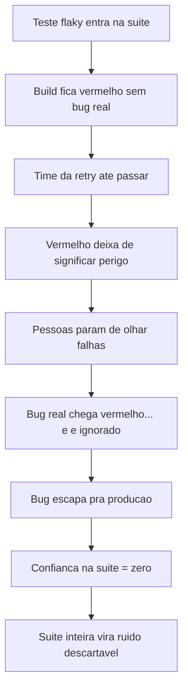
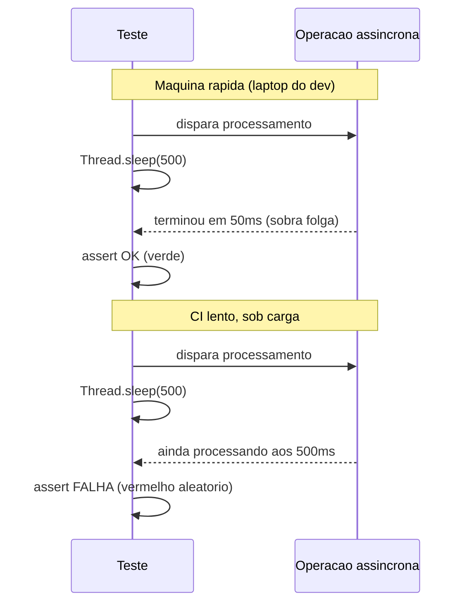
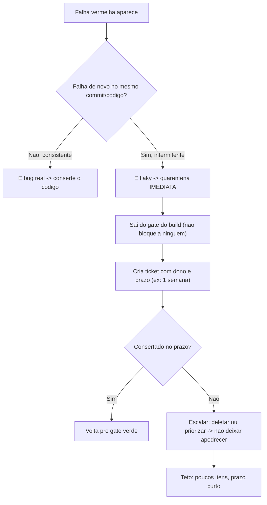
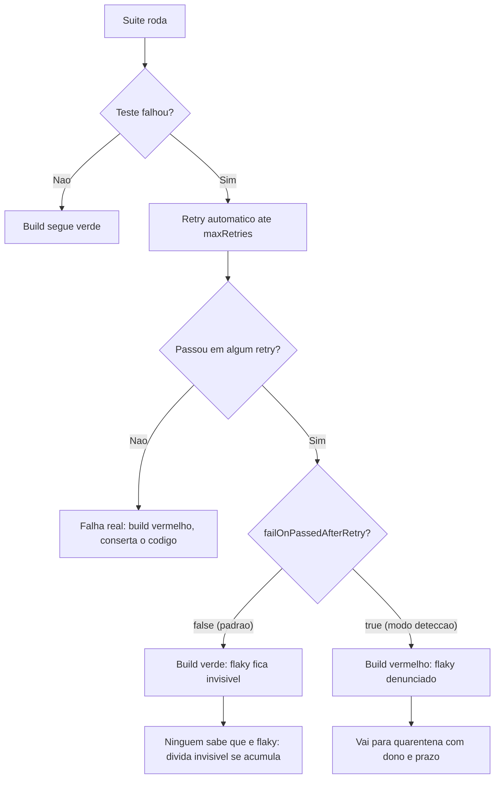

# Testes flaky

> [!abstract] Resumo em uma linha
> Teste flaky é o que passa às vezes e falha às vezes contra o **mesmo código, mesma versão e mesmo ambiente** — o resultado depende de algo que ninguém controlou (ordem, relógio, rede, uma *thread* que não terminou), não de o código ter quebrado.
> O dano real não é o CI perder minutos em *retry*: é a erosão de confiança. Cada falso vermelho treina o time a desconfiar do sinal, e no dia em que o vermelho for um bug de verdade, ninguém vai olhar — a suíte inteira vira ruído descartável.
> Por isso a regra de ouro deste capítulo é dura e sem exceção: **nunca `sleep` em teste**. Um `sleep` aposta num prazo fixo; a cura de quase toda causa de flaky é trocar a aposta por uma espera pela condição real.

Imagine um alarme de incêndio que dispara sozinho, sem fogo, três vezes por semana. No começo todo mundo corre. Depois de um mês, ninguém levanta da cadeira — "é só o alarme de novo". No dia em que houver fogo de verdade, o prédio inteiro vai ignorar o som.

É exatamente isso que um teste flaky faz com sua suíte. Ele dispara vermelho sem motivo, você dá *retry*, fica verde, e a vida segue. Mas a cada falso alarme você treina o time inteiro a desconfiar do sinal. E o dia em que o vermelho for um bug de verdade, ninguém vai olhar.

## O que é (e o que não é)

Um teste **flaky** (ou **não-determinístico**, ou **intermitente**) é aquele que, rodando contra o **mesmo código**, **mesma versão dos testes** e **mesmo ambiente**, ora passa, ora falha. Não é um teste que falhou porque você quebrou o código — esse está fazendo o trabalho dele. Flaky é o teste cujo resultado depende de algo que você não controlou: a ordem em que ele rodou, o relógio, a rede, um *thread* que ainda não terminou.

Martin Fowler resume a gravidade numa frase que vale tatuar:

> [!quote] Martin Fowler — *Eradicating Non-Determinism in Tests*
> "Non-deterministic tests have two problems: firstly they are useless, secondly they are a virulent infection that can completely ruin your entire test suite."
>
> (Testes não-determinísticos têm dois problemas: primeiro, são inúteis; segundo, são uma infecção virulenta capaz de arruinar a suíte inteira.)

Inútil porque um teste que falha aleatoriamente não te diz mais nada — não distingue bug de ruído. Infeccioso porque um único flaky muda o comportamento das pessoas diante de TODA a suíte. É a peça que define este capítulo.

## Por que flaky é a pior praga

Pense no que uma suíte de testes te dá: **confiança**. Verde significa "pode entregar". Vermelho significa "tem bug, pare". O valor inteiro da suíte depende dessa correspondência ser confiável.

O flaky quebra a correspondência. Agora vermelho às vezes significa bug e às vezes significa nada. E aí começa a erosão cultural — que é o dano real, mais do que o teste em si.



Leitura do diagrama: repare que o estrago não está no passo B (um falso vermelho). Está na cadeia que ele dispara. Cada *retry* que "resolve" treina o reflexo de ignorar. Quando o passo F acontece — um bug real chega vermelho — a reação aprendida já é "é o flaky de novo, dá retry". O bug passa. A partir daí a suíte não protege ninguém; ela só consome tempo de CI.

A contaminação é desproporcional ao número de testes ruins — ver [[#Armadilhas comuns]] para o porquê. O Google mediu isso em escala: cerca de **1,5% das execuções de teste** produzem resultado inconsistente, e isso afeta perto de **16% dos testes** ao longo do tempo. Não é um problema de borda — é endêmico em qualquer suíte grande. A diferença entre uma suíte saudável e uma morta é o que a equipe **faz** quando o flaky aparece.

## As causas comuns (e o mecanismo de cada uma)

Flaky não é mágica. É sempre uma dependência escondida em algo que varia entre execuções. As famílias mais comuns:

**Dependência de ordem.** O teste A cria um registro e não limpa. O teste B só passa porque aquele registro existe. Rodando A→B, verde. Rodando B sozinho (ou B→A com paralelismo embaralhando), vermelho. O teste B mente: ele não testa o que diz, testa o resíduo de A.

**Timing / race condition.** Você dispara uma operação assíncrona e verifica o resultado "logo depois". No seu laptop rápido, a operação terminou em 50ms e o teste vê o resultado. No CI lento, sob carga, a operação ainda não acabou quando você verificou — vermelho. O `Thread.sleep` é o sintoma clássico disso (mais abaixo).

**Estado compartilhado.** Variáveis estáticas, *singletons*, caches em memória, banco não limpo entre testes. Um teste muta o estado global e o próximo herda a mutação. O resultado depende de quem rodou antes.

**Datas e timezones.** O teste usa `LocalDate.now()` ou `Instant.now()`. Passa o dia inteiro, falha à meia-noite quando o "hoje" muda. Ou passa no seu fuso e falha no CI em UTC. O teste depende do relógio da máquina, que muda a cada execução por definição.

**Ordem de iteração não garantida.** Você faz `assertEquals(esperado, mapa.values())` esperando uma ordem. Mas `HashMap` não garante ordem de iteração — ela pode variar entre versões da JVM ou até entre execuções. Verde por sorte, vermelho quando a sorte acaba.

**Rede externa.** Qualquer chamada a um serviço de verdade — uma API HTTP, um DNS, um endpoint de terceiro — é flaky **por natureza**. A rede tem latência variável, o serviço tem *downtime*, o *rate limit* dispara. Você não controla nada disso. Um teste que toca a rede real terceiriza seu resultado para a internet.

**Paralelismo.** Testes que assumem execução serial quebram quando o *runner* roda 8 em paralelo: dois disputam a mesma porta, o mesmo arquivo, a mesma linha de banco. Sozinhos passam; em paralelo, colisão.

**Dependências de sistema.** Arquivos temporários com nome fixo (dois testes brigam pelo mesmo `/tmp/test.txt`), portas *hardcoded* (8080 já está em uso), *locale* da máquina (formatação de número com vírgula vs. ponto), *encoding* default.



Leitura do diagrama: o mesmo `sleep(500)` que dá folga no laptop é insuficiente no CI lento. O número 500 foi um chute calibrado para uma máquina específica. Como o tempo real da operação varia com carga, hardware e GC, **qualquer** valor fixo está errado em algum ambiente — alto demais (lento) ou baixo demais (flaky). O `sleep` não espera a condição; ele aposta num prazo.

## A regra de ouro: nunca `sleep` em teste

Um `sleep` não espera que algo aconteça — ele aposta que vai acontecer dentro de N milissegundos. Se você acertar o prazo, o teste fica lento à toa em todo ambiente rápido; se você errar, o teste fica flaky no ambiente lento. Não existe valor certo, porque o tempo real varia com carga, hardware e coletor de lixo. A alternativa correta é **esperar a condição**, não o relógio (o enunciado completo da regra, como callout, está em [[#Armadilhas comuns]]).

Esta é a heurística mais útil deste capítulo — o caso real que a ensinou está formalizado em [[#Casos práticos]]. A lição em uma frase: **`sleep` mascara o problema, esperar-condição resolve.** O `sleep` empurra a aposta para um prazo fixo; o `await().until(...)` faz *polling* na condição real e segue assim que ela for verdade — rápido quando dá, paciente quando precisa, e só falha (com `ConditionTimeoutException`) se o prazo máximo estourar de verdade.

```java
// FRAGIL: aposta num prazo. Lento no laptop, flaky no CI.
service.processAsync(pedido);
Thread.sleep(500);
assertThat(repo.status(pedido.id())).isEqualTo(PROCESSADO);

// CORRETO: espera a condicao. Retorna assim que ficar verde,
// so falha se estourar o teto de 5s.
service.processAsync(pedido);
await().atMost(5, SECONDS)
       .until(() -> repo.status(pedido.id()) == PROCESSADO);
```

Por padrão o Awaitility espera 10 segundos e lança `ConditionTimeoutException` se a condição não for satisfeita. Você ajusta o teto (`atMost`), o intervalo de *polling* (`pollInterval`) e a forma de avaliar (`until`, `untilAsserted`). O ponto não é a biblioteca específica — é o princípio: **assíncrono se testa esperando a condição ficar verdadeira, não dormindo um tempo e torcendo.**

## Causa → mitigação

Cada família de flaky tem um antídoto direto. A tabela é o mapa de bolso:

| Causa | Mecanismo do flaky | Mitigação |
|---|---|---|
| Dependência de ordem | B só passa pelo resíduo de A | Isolar: cada teste limpa o que cria; `@BeforeEach`/`@AfterEach` resetam estado |
| Timing / race condition | `sleep` aposta num prazo fixo | Esperar condição: `await().atMost(...).until(...)` em vez de dormir |
| Estado compartilhado | estático/singleton/banco sujo herdado | Sem estado mutável global; transação por teste com *rollback*, ou banco limpo |
| Datas / timezones | `now()` muda a cada execução | Injetar `Clock`; fixar fuso e relógio no teste |
| Ordem de iteração | `HashMap` não garante ordem | Ordenar antes de comparar, ou usar `LinkedHashMap`/asserção sem ordem |
| Rede externa | latência/downtime fora do seu controle | Mockar: WireMock, MockWebServer; nunca tocar serviço real em teste |
| Paralelismo | dois testes disputam recurso | Tornar cada teste *self-contained*; recursos únicos por teste (porta/arquivo aleatórios) |
| Dependências de sistema | porta/arquivo/locale fixos | Porta efêmera (`0`), `@TempDir`, locale/encoding explícitos no teste |

Repare no fio condutor de todas as mitigações: **remover a variável escondida da equação**. Ou você controla o que variava (injeta o relógio, fixa a seed, ordena a coleção), ou você isola o teste para que nada externo o alcance (limpa o estado, mocka a rede, usa recurso próprio).

> [!tip] Determinismo é o objetivo, não o efeito colateral
> Esses antídotos são as letras **I** e **R** do F.I.R.S.T. de `[[03 - Anatomia de um bom teste]]`: **I**ndependent (não depende de outro teste nem de ordem) e **R**epeatable (mesmo resultado toda vez, em qualquer ambiente). O determinismo de `[[04 - Testes unitários]]` — sem relógio real, sem rede, sem aleatório com seed solta — não é zelo estético; é a vacina contra o flaky.

### Controlar o tempo: injetar `Clock`

A causa "datas/timezones" merece destaque porque a cura é elegante e mostra o padrão geral. Em vez de o código chamar `Instant.now()` direto (impossível de fixar no teste), ele recebe um `Clock`:

```java
// Codigo de producao recebe o relogio por injecao.
class FaturaService {
    private final Clock clock;
    FaturaService(Clock clock) { this.clock = clock; }

    boolean venceuHoje(Fatura f) {
        return f.vencimento().equals(LocalDate.now(clock)); // usa o clock, nao o relogio do SO
    }
}

// Em producao: Clock.systemDefaultZone(). No teste: relogio congelado e deterministico.
var clockFixo = Clock.fixed(Instant.parse("2026-06-18T10:00:00Z"), ZoneOffset.UTC);
var service = new FaturaService(clockFixo);
// Agora "hoje" e sempre 2026-06-18, rode a que horas rodar.
```

O `Clock` injetável transforma uma dependência incontrolável (o relógio do sistema) numa dependência que você fornece. É o mesmo movimento de mockar a rede: trocar o que varia por algo que você comanda.

### Banco limpo por teste: container descartável

Para a causa "estado compartilhado" no banco, a resposta de `[[07 - Testes de integração]]` é o **Testcontainers**: um container de Postgres real, novo, por classe (ou por teste, quando você precisa de isolamento absoluto). Cada execução começa com um banco em estado conhecido, sem resíduo de execução anterior. Combine com transação-por-teste com *rollback* quando der, e o estado nunca vaza entre testes.

## A política de quarentena

E quando um flaky aparece — porque vai aparecer? A pior resposta é a omissão: deixar o flaky vermelho e ir dando *retry*. Isso é literalmente o passo B→C→D do primeiro diagrama. A segunda pior é normalizar: "ah, a suíte é vermelha às vezes". Essa frase é o atestado de óbito da suíte.

A resposta certa é a **quarentena**: tire o flaky do caminho crítico **imediatamente** (ele para de reprovar o build de todo mundo), mas com **prazo curto e responsável definido** para consertar. Quarentena não é cemitério — é UTI com alta marcada.



Leitura do diagrama: o primeiro losango (B) é o triagem essencial — distinguir bug consistente de flaky intermitente, normalmente rodando a falha algumas vezes. Bug vai consertar o código; flaky vai para quarentena *na hora*, saindo do *gate* para não envenenar o sinal verde dos outros. Mas o passo F é o que separa quarentena de abandono: **ticket, dono, prazo**. Sem isso, a quarentena vira um depósito de testes podres, e o problema só mudou de lugar.

Fowler é explícito sobre o teto: a quarentena deve ter **limite rígido** — ele sugeria no máximo poucos testes (8) e prazo de uma semana. O limite é proposital: se a quarentena pode crescer sem freio, ela deixa de ser pressão para consertar e vira o tapete embaixo do qual se varre tudo (o custo real dessa negligência está detalhado em [[#Armadilhas comuns]]).

O Google opera quarentena **automatizada**: um monitor mede a taxa de *flakiness* de cada teste e coloca em quarentena os que passam de um limiar, ao mesmo tempo em que detecta *mudanças* na flakiness para pegar regressões. Onde a esteira de `[[15 - Testes em CI-CD]]` aplica essa política, ela junta o melhor dos dois mundos: o gate fica confiável (flaky não bloqueia) e nenhum flaky some do radar (todo quarentenado tem dono e prazo).

## Retry automatizado: paliativo, não cura

Antes de existir processo de quarentena manual, toda equipe descobre o mesmo atalho: fazer o CI rodar o teste de novo quando ele falha. Ferramentas de build oficializam esse atalho — e vale entender exatamente o que elas fazem, porque o atalho é útil como *instrumento de detecção* e perigoso como *muleta permanente*.

O **Gradle Test Retry Plugin** reexecuta, dentro da mesma *task*, só os testes que falharam, até um teto configurável:

```groovy
test {
    retry {
        maxRetries = 2
        maxFailures = 20
        failOnPassedAfterRetry = true
    }
}
```

O parâmetro que decide se o plugin vira instrumento ou muleta é `failOnPassedAfterRetry`. Com `false` (o padrão), um teste que falhou e depois passou no retry deixa o build **verde** — o flaky fica invisível, escondido atrás do retry. Com `true`, o mesmo cenário deixa o build **vermelho**: o retry passou, mas o build denuncia que aquele teste é instável, empurrando-o para quarentena com dono e prazo em vez de deixá-lo se esconder indefinidamente. O Maven Surefire tem o equivalente via `rerunFailingTestsCount`, suportado em JUnit 4.12+, JUnit 5.x e TestNG, com os resultados de cada tentativa registrados no XML como `flakyFailure`/`flakyError` — dado que alimenta a mesma decisão de contabilizar ou esconder a instabilidade.



Leitura do diagrama: os dois ramos de "passou no retry" (G) levam a destinos opostos com a mesma configuração de retry — a diferença é uma flag booleana. É por isso que a documentação oficial do plugin é taxativa: "*retrying tests alone is not a viable flaky test mitigation strategy*" (reexecutar testes sozinho não é uma estratégia viável de mitigação de flaky). Retry sem `failOnPassedAfterRetry=true` (ou processo equivalente de rastreio) não reduz flaky — só o maquia, e o caminho H é exatamente a "confiança zero disfarçada de verde" que a suíte não pode se dar ao luxo de ter.

## Armadilhas comuns

> [!danger] O envenenamento é coletivo
> Um flaky não estraga só a si mesmo. Ele estraga a leitura que o time faz de *qualquer* falha vermelha. Por isso a contaminação é desproporcional ao número de testes ruins: 3 flaky numa suíte de 2000 já bastam para alguém dizer "ah, a suíte falha às vezes, é normal". E "é normal" é a frase que mata a suíte.

> [!danger] Nunca `Thread.sleep` num teste. Nunca.
> Um `sleep` não espera que algo aconteça — ele aposta que vai acontecer dentro de N milissegundos. Se você acertar o prazo, o teste fica lento à toa em todo ambiente rápido. Se você errar, o teste fica flaky no ambiente lento. Não existe valor certo, porque o tempo real varia. A alternativa correta é **esperar a condição**, não o relógio.

> [!warning] O custo cultural é o custo real
> O dinheiro do flaky não está nos minutos de CI desperdiçados em *retry*. Está na confiança. Uma suíte em que "vermelho às vezes é normal" não dá mais nenhuma garantia — você poderia desligá-la e o efeito prático seria o mesmo, com a vantagem de não gastar CI. Defender a confiança da suíte é defender a quarentena com prazo e o "zero flaky no gate" como regra inegociável.

## Casos práticos

Só há um caso registrado nesta nota até agora — não fabricado para preencher espaço. Conforme mais casos aparecerem (e forem resolvidos com o mesmo rigor), entram aqui.

> [!example] Os três flaky por race condition (caso real)
> Tive uma suíte com 3 testes flaky por race condition em código assíncrono. A primeira reação foi adicionar `Thread.sleep(500)`. Funcionou... até o CI lento falhar de novo. A solução certa foi `Awaitility.await().atMost(5, SECONDS).until(() -> condição)`. Regra que criei: nunca `sleep` em teste. Nunca.

O padrão do caso é o padrão da causa "timing / race condition" descrito em [[#As causas comuns (e o mecanismo de cada uma)]]: o `sleep(500)` era rápido demais para nada no laptop e lento demais para o CI sob carga — não existia prazo fixo certo, porque o tempo real da operação variava com o ambiente. Trocar a aposta por `await().atMost(...).until(...)` resolveu porque deixou de apostar: passou a fazer *polling* na condição real até ela ficar verdadeira, com um teto apenas para não travar para sempre.

> [!tip] Assista: Flaky tests — Andrei Solntsev
> **Canal/Evento:** Jfokus | **Duração:** ~50min | **Idioma:** EN
>
> Palestra de conferência dedicada inteiramente a flaky tests em Java, com exemplos tirados de "projetos reais" (a frase do próprio palestrante) — cobre as mesmas causas raiz desta nota (timing, ordem, estado compartilhado) e reforça o mesmo diagnóstico: retry esconde o sintoma, a cura é eliminar a dependência escondida.
>
> 🎬 [Assistir no YouTube](https://www.youtube.com/watch?v=18J2_4a4Cl4)

## Em entrevista

A flaky test passes sometimes and fails sometimes against the same code, version, and environment — so its result depends on something you didn't control: ordering, timing, the clock, shared state, or the network. The danger isn't the wasted CI minute; it's that one flaky test teaches the whole team to distrust *every* red, so a real bug eventually slips through ignored. My hard rule is "never `sleep` in a test" — a sleep bets on a fixed deadline, which is too slow on fast machines and flaky on slow CI; I wait for the condition instead, with something like Awaitility's `await().atMost(5, SECONDS).until(...)`. I make the hidden variable controllable: inject a `Clock` instead of calling `now()`, mock external services with WireMock or MockWebServer, give each test its own clean database with Testcontainers, and sort collections before asserting. When a flaky does show up, it goes straight into quarantine — out of the build gate so it stops blocking everyone — but with a named owner and a short deadline, never an open-ended dumping ground. The line I refuse to accept is "the suite is red sometimes, that's normal," because that sentence is where a test suite goes to die.

### Vocabulário

| PT | EN |
|---|---|
| teste flaky / intermitente | flaky test / intermittent test |
| teste não-determinístico | non-deterministic test |
| condição de corrida | race condition |
| dependência de ordem | order dependency |
| estado compartilhado | shared state |
| relógio injetável | injectable clock |
| esperar a condição | wait for the condition / poll |
| dormir / atraso fixo | sleep / fixed delay |
| quarentena | quarantine |
| portão do build / gate | build gate |
| nova tentativa | retry |
| limpar o estado | tear down / clean up state |
| serviço externo (mockar) | external service (to mock / stub) |
| confiança na suíte | trust in the suite |

## Fontes

- [Martin Fowler — *Eradicating Non-Determinism in Tests*](https://martinfowler.com/articles/nonDeterminism.html) — causas: isolamento, assíncrono, serviços remotos, tempo, *resource leaks*; quarentena com teto e prazo
- [Google Testing Blog — *Flaky Tests at Google and How We Mitigate Them*](https://testing.googleblog.com/2016/05/flaky-tests-at-google-and-how-we.html) — 1,5% das execuções flaky; ~16% dos testes; quarentena automatizada
- [Awaitility — DSL Java para sincronizar operações assíncronas](https://github.com/awaitility/awaitility) — `await().atMost(...).until(...)`; timeout default 10s; `ConditionTimeoutException`
- [Gradle Test Retry Plugin — README](https://github.com/gradle/test-retry-gradle-plugin) — `maxRetries`/`maxFailures`/`failOnPassedAfterRetry`; "retrying tests alone is not a viable flaky test mitigation strategy"
- [Apache Maven Surefire — Rerun failing tests](https://maven.apache.org/surefire/maven-surefire-plugin/examples/rerun-failing-tests.html) — `rerunFailingTestsCount`; suporte JUnit 4.12+, JUnit 5.x, TestNG; relatório `flakyFailure`/`flakyError`

## O que vem a seguir

Tudo até aqui foi pensado com testes de backend (JVM, majoritariamente) como pano de fundo — `Thread.sleep`, `Clock` injetável, Testcontainers, Awaitility. Mas a doença é a mesma em qualquer stack assíncrona, e o front-end JS/TS tem sua própria versão dela: promises não aguardadas, `act()` do React, timers de fake que escapam, requisições de rede que resolvem numa ordem diferente a cada corrida. `[[03-Dominios/Tecnologia/Testes JS/16 - Testes flaky em JS]]` retoma exatamente esses mecanismos — mesma regra de ouro (nunca dormir, sempre esperar a condição), ferramental diferente.

## Veja também

- `[[03 - Anatomia de um bom teste]]` — F.I.R.S.T.: o **I**ndependent e o **R**epeatable são a vacina contra flaky
- `[[04 - Testes unitários]]` — determinismo: sem relógio real, sem rede, sem aleatório solto
- `[[07 - Testes de integração]]` — Testcontainers: banco limpo e descartável por teste
- `[[15 - Testes em CI-CD]]` — onde a política de quarentena vive na esteira
- `[[16 - Estratégia de testes em entrevista]]` — como falar de flaky e confiança na suíte
- `[[Testes em Java]]` — JUnit, Awaitility, WireMock, Testcontainers no ecossistema Java
- `[[03-Dominios/Engenharia/Testes/index|Testes]]` — índice do galho
