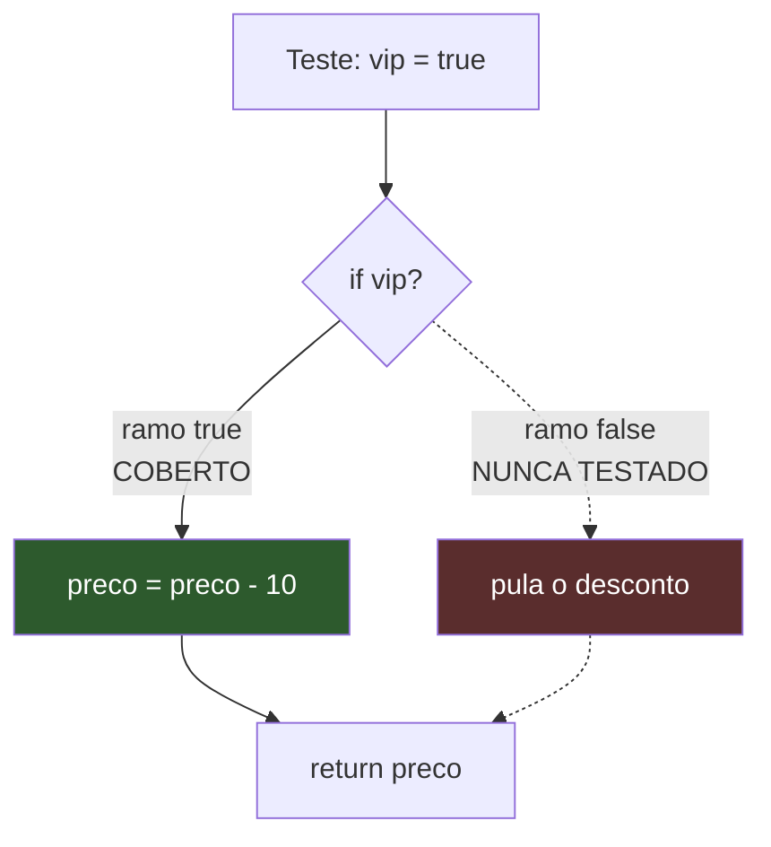
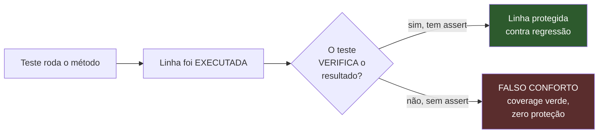
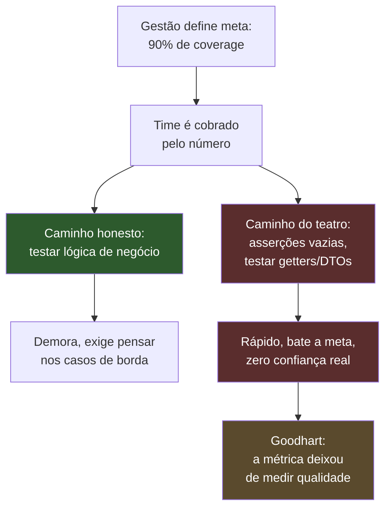
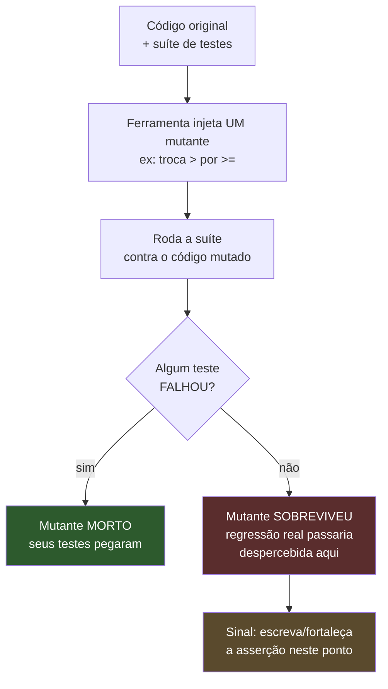
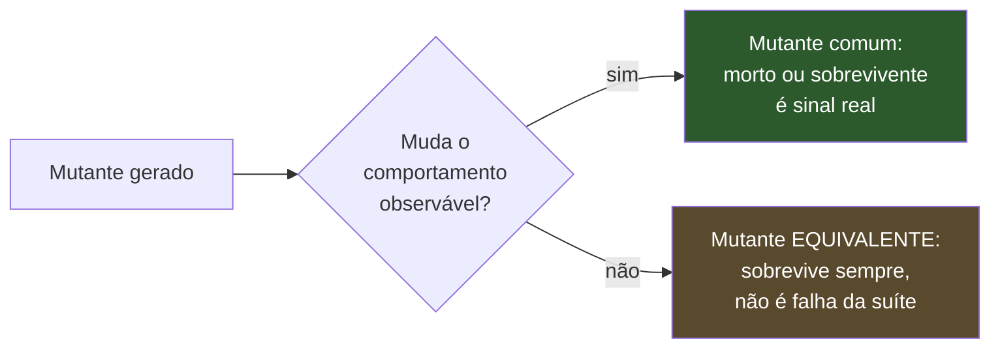
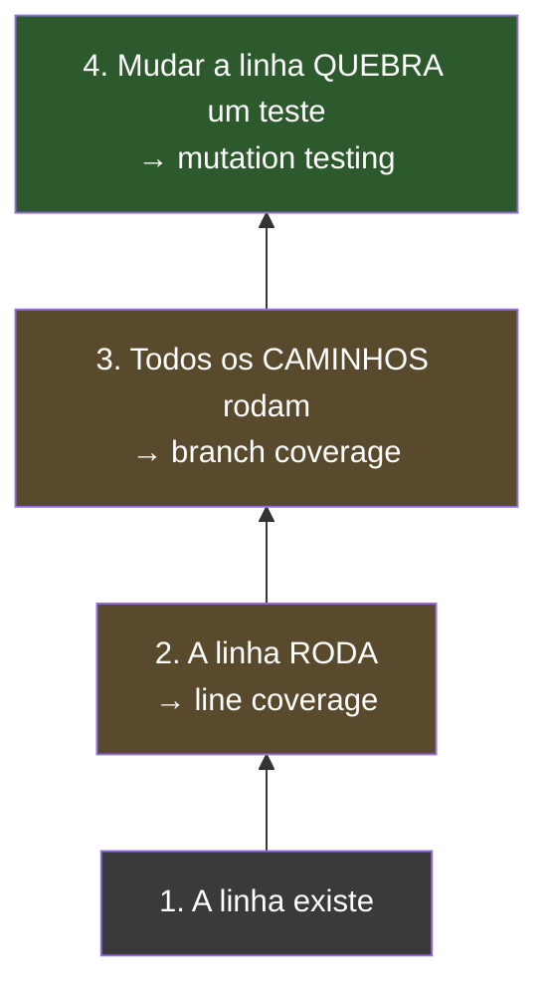

# Coverage e mutation testing

> [!abstract] Resumo em uma linha
> Coverage mede quanto código os testes *rodaram*; mutation testing mede se os testes de fato *pegariam* uma mudança — o primeiro detecta o que não foi tocado, o segundo prova se o que foi tocado está realmente protegido. Existem vários tipos de coverage (linha, ramo, condição, MC-DC) com força crescente e custo crescente, mas nenhum deles enxerga se uma asserção existe — só se a linha executou. Mutation testing fecha esse buraco sabotando o código de produção com pequenos bugs deliberados e medindo quantos a suíte pega: o resultado é o **mutation score**, uma métrica sobre a qualidade dos testes, não sobre a quantidade de código tocado — mas ela também tem seu próprio limite teórico, os **mutantes equivalentes**, que nenhuma ferramenta consegue detectar de forma decidível.

Imagine duas formas de avaliar uma turma. A primeira é a chamada: quem estava presente na aula? A segunda é a prova: quem realmente aprendeu? Presença não é aprendizado. Um aluno pode ter passado o semestre inteiro sentado na última fileira, fisicamente presente em 100% das aulas, e não ter aprendido nada.

Coverage é a chamada. Mutation testing é a prova.

Essa é a tensão central desta nota. Senior que confunde as duas — que apresenta "92% de cobertura" como prova de qualidade — entrega uma métrica de presença fingindo ser uma métrica de aprendizado. Vamos desfazer essa confusão.

## O que é coverage

**Coverage** (cobertura de código) é a porcentagem do código de produção que foi *exercitada* durante a execução dos testes. A ferramenta instrumenta o bytecode (ou o source), roda a suíte e registra: esta linha rodou, aquele `if` foi avaliado, este método foi chamado.

O número sai como percentual. "85% de cobertura de linha" significa que 85% das linhas executáveis foram tocadas por pelo menos um teste durante a suíte.

Existem vários *tipos* de coverage, e a diferença entre eles é o que separa quem entende o assunto de quem só lê o número final.

| Tipo | O que conta | O que garante | Força |
|------|-------------|---------------|-------|
| **Line coverage** | Linhas executadas / linhas totais | A linha rodou ao menos uma vez | Fraca |
| **Branch coverage** | Ramos (`if`/`else`, `switch`) percorridos | Cada caminho de decisão foi tomado | Média |
| **Method/function coverage** | Métodos invocados | A função foi chamada | Muito fraca |
| **Condition coverage** | Cada condição booleana avaliada como `true` e `false` | Subexpressões testadas isoladamente | Forte |
| **MC-DC** | Cada condição afeta o resultado independentemente | Padrão de aviônica/automotivo (DO-178C) | Muito forte (caro) |

A diferença entre **condition coverage** e **MC-DC** raramente aparece em entrevista, mas separa quem decorou a tabela de quem entende o motivo dela existir. Considere `if (A && B)`. Condition coverage exige que `A` seja testado `true` e `false`, e que `B` seja testado `true` e `false` — mas não exige que essas variações sejam *independentes*. Um par de casos `(A=T, B=T)` e `(A=F, B=F)` já satisfaz condition coverage (as duas variáveis passaram por `true` e por `false` em algum teste), mas nenhum dos dois casos isola o efeito de uma variável mudando sozinha o resultado da decisão. **MC-DC** exige mais: cada condição precisa, em algum par de casos, ser a *única* variável que muda e ainda assim mudar o resultado final — prova que aquela condição especificamente importa, não só que ela foi exercitada. Por isso MC-DC é o padrão exigido em software de aviônica e automotivo pela norma DO-178C: garante que nenhuma condição de uma decisão complexa é, na prática, morta (ignorada) sem que ninguém perceba. É caro — precisa de N+1 casos de teste para N condições, contra 2 casos de condition coverage — e por isso é raro fora de software crítico de segurança.

Para o dia a dia, a regra prática é: **branch coverage vale mais que line coverage**. Por quê? Porque uma linha pode rodar sem que todos os seus caminhos sejam testados.

Veja o caso clássico. Um `if` sem `else`:

```java
public int aplicarDesconto(int preco, boolean vip) {
    if (vip) {
        preco = preco - 10; // <- esta linha
    }
    return preco;
}
```

Um único teste com `vip = true` faz **line coverage de 100%** — todas as linhas rodaram. Mas o caminho `vip = false` (pular o desconto) nunca foi testado. **Branch coverage** flagra isso: você cobriu 1 de 2 ramos = 50%.



Lead-in: o diagrama mostra o mesmo `if` sob a ótica dos dois tipos de cobertura.

Leitura do diagrama: o ramo `true` (verde) foi percorrido — line coverage feliz. O ramo `false` (vermelho, tracejado) jamais rodou. Line coverage diz 100%; branch coverage diz 50%. O bug mora exatamente no ramo que line coverage não consegue enxergar.

> [!tip] Configure a ferramenta para branch
> JaCoCo (Java), por padrão, mostra os dois. Quando alguém cita "cobertura" sem qualificar, geralmente é line — o número mais bonito e menos honesto. Em revisão, pergunte: *line ou branch?*

## A grande mentira: 100% coverage não é igual a código testado

Aqui está o ponto que derruba a métrica como prova de qualidade.

**Coverage mede o que rodou, não o que foi verificado.**

Um teste pode *executar* uma linha sem *afirmar* nada sobre ela. Considere:

```java
@Test
void deveCalcular() {
    service.calcularJuros(1000, 0.05); // chama, e... só.
}
```

Esse teste roda o método inteiro. A ferramenta de coverage registra cada linha de `calcularJuros` como coberta. **Line coverage: 100%.** Quantas asserções? **Zero.** O método poderia retornar `-999`, lançar lógica errada, corromper estado — o teste passaria igual, porque ele nunca olha para o resultado.



Lead-in: o caminho de uma linha "coberta" até saber se ela está, de fato, protegida.

Leitura do diagrama: executar a linha é só metade do caminho. Sem uma asserção que reclame quando o resultado muda, a linha verde no relatório é puro teatro — ela aparece coberta, mas não há ninguém de guarda. Coverage para no segundo nó; ele nunca chega ao losango.

A nota [[03 - Anatomia de um bom teste]] insiste nisso por outro ângulo: um teste sem asserção significativa não é um teste, é uma invocação. Coverage não distingue os dois.

## Coverage theater

Quando você transforma coverage na *única* métrica — ou pior, na meta — algo previsível acontece: as pessoas otimizam o número, não a qualidade.

Isso tem nome. **Lei de Goodhart**: *"quando uma medida vira meta, ela deixa de ser uma boa medida"*. A cobertura era um bom *diagnóstico* (mostra o que ninguém testou). No momento em que o time é cobrado por bater 90%, ela vira um *alvo* — e times produzem testes inúteis só para preencher a barra.

O sintoma é o que chamo de **coverage theater**: testes que existem para o relatório, não para a confiança. Asserções vazias. Testes que chamam getters. Testes gerados automaticamente sobre DTOs. Tudo verde, nada protegido.



Lead-in: como uma meta de coverage gera incentivos perversos.

Leitura do diagrama: a meta cria pressão (B), e diante de pressão o caminho barato (D, vermelho) vence o caminho caro (C, verde) na média de um time apressado. O resultado (G) é a Lei de Goodhart em ação: você ainda tem o número, mas ele não mede mais o que prometia medir.

## Uso sensato

Coverage não é inútil — é uma ferramenta de diagnóstico excelente *quando usada como ferramenta, não como meta*. Como Martin Fowler resume: coverage serve para **encontrar código que não foi testado**, não para afirmar quão bons são os seus testes.

A postura sensata:

- **70–85% como faixa de equilíbrio.** Acima disso, retorno decrescente; abaixo, provavelmente há lógica importante descoberta. Não é regra cósmica, é heurística.
- **Olhe branch, não line.** Branch coverage de 80% é muito mais informativo que line coverage de 95%.
- **Cubra o que importa.** Lógica de negócio, regras de cálculo, casos de borda — veja [[10 - Técnicas de teste e edge cases]] para *o que* perseguir (limites, nulos, vazios, overflow). Não persiga DTOs e getters.
- **Use o relatório como mapa de buracos.** O valor real do relatório não é o número no topo — são as linhas vermelhas no meio. Elas dizem "ninguém testou isto". Pergunte: *isto importa?* Se sim, escreva o teste; se não (código trivial), ignore com consciência.
- **Coverage gate em CI faz sentido como piso, não teto.** "Não deixe cair abaixo de X" previne erosão; "atinja Y a todo custo" gera teatro. Veja [[15 - Testes em CI-CD]].

> [!info] Diagnóstico, não nota
> Pense no relatório de coverage como um raio-X: ele mostra onde não há tecido testado. O médico não trata "deixar o raio-X branco" como objetivo — ele usa a imagem para decidir onde olhar. Coverage é o raio-X. A decisão clínica (testar ou não) continua sua.

## Mutation testing — o complemento honesto

Se coverage não consegue ver asserções, existe alguma técnica que consiga? Sim. **Mutation testing.**

A ideia é deliciosamente simples e um pouco perversa: a ferramenta **sabota o seu código de produção** — introduz pequenos bugs deliberados, um de cada vez — e roda a sua suíte. Se algum teste **falha**, ótimo: o sabotador foi pego, o **mutante foi morto** (*killed*). Se *nenhum* teste falha, mau sinal: você plantou um bug e ninguém percebeu — o **mutante sobreviveu** (*survived*).

A analogia: imagine um detetive (sua suíte de testes) e um sabotador (a ferramenta de mutação). O sabotador injeta um bug por vez no código. Se o detetive nunca percebe, ele não é tão bom quanto o relatório de presença sugeria.

Cada mutação é uma alteração mínima, plausível, do tipo que um humano cometeria por engano:

| Mutação | Original | Mutante |
|---------|----------|---------|
| Trocar condição de borda | `a > b` | `a >= b` |
| Negar condicional | `if (x)` | `if (!x)` |
| Trocar operador aritmético | `a + b` | `a - b` |
| Remover chamada / `return` | `return x;` | (removido / `return 0;`) |
| Trocar booleano | `return true;` | `return false;` |

Esses cinco são os que mais aparecem em relatório, mas o PITest — a ferramenta de referência no mundo Java — roda um conjunto maior de mutadores por padrão. Vale conhecer os nomes porque eles aparecem literalmente no relatório HTML:

| Mutador PITest (default) | O que faz |
|---|---|
| `CONDITIONALS_BOUNDARY` | Troca operadores de fronteira (`<` ↔ `<=`, `>` ↔ `>=`) |
| `NEGATE_CONDITIONALS` | Inverte o resultado de uma condicional (`==` ↔ `!=`, `<` ↔ `>=`) |
| `MATH` | Troca operador aritmético binário por outro (`+` ↔ `-`, `*` ↔ `/`) |
| `INCREMENTS` | Troca incremento por decremento (`i++` → `i--`) e vice-versa |
| `INVERT_NEGS` | Inverte negações numéricas (`-a` → `a`) |
| `VOID_METHOD_CALLS` | Remove chamadas a métodos void (simula "esqueci de chamar isso") |
| `RETURN_VALS` | Troca o valor de retorno por um "vizinho" (`true`→`false`, `n`→`n+1`, objeto→`null`) |

Fonte: [pitest.org — Mutation operators](https://pitest.org/quickstart/mutators/). Note que `NEGATE_CONDITIONALS` e `CONDITIONALS_BOUNDARY` juntos cobrem exatamente os dois primeiros exemplos da tabela anterior — não é coincidência, é o mesmo catálogo de bugs plausíveis, só com nome de classe Java.

Nem todo mutador vem ligado por padrão. `REMOVE_CONDITIONALS` — que apaga a checagem de um `if` inteiro, fazendo o bloco protegido sempre executar — fica desligado por padrão porque gera um volume alto de mutantes e de falsos positivos em código com guardas defensivas legítimas. A documentação recomenda ligá-lo manualmente quando o objetivo é garantir cobertura completa de statements condicionais, ciente do custo adicional.



Lead-in: o ciclo de uma única mutação, repetido para cada mutante gerado.

Leitura do diagrama: a ferramenta planta o bug (B), roda tudo (C) e pergunta no losango se a suíte reagiu. Mutante morto (E, verde) é uma boa notícia — significa que aquela linha está de fato protegida por uma asserção. Mutante sobrevivente (F, vermelho) é o ouro do método: aponta exatamente onde uma regressão real escaparia, mesmo que o coverage daquela linha esteja verde.

O número resultante é o **mutation score**: mutantes mortos / mutantes totais. Diferente do coverage, ele mede **a qualidade dos testes**, não a quantidade de linhas tocadas. Um mutante sobrevivente que rodou em linha 100% coberta é a prova viva de que coverage e proteção são coisas distintas — o exemplo da asserção vazia, agora *medido*.

A ferramenta de referência no mundo Java é o **PIT (PITest)** — veja [[Testes em Java]] para integração com Maven/Gradle. PITest mostra precisamente qual linha foi mutada, qual mutador foi aplicado, e qual teste executou aquela linha sem falhar.

### Fazendo a conta: mutation score na prática

Um exemplo pequeno deixa a aritmética concreta. Suponha o método `aplicarDesconto` visto acima, agora com um teste que cobre os dois ramos (`vip = true` e `vip = false`) mas só verifica um deles:

```java
@Test
void vipRecebeDesconto() {
    assertEquals(90, aplicarDesconto(100, true));
}

@Test
void naoVipNaoRecebeDesconto() {
    aplicarDesconto(100, false); // roda, mas não afirma nada
}
```

Branch coverage: **100%** — os dois ramos executaram. Agora rode o PITest sobre esse método. Ele gera mutantes como:

| # | Mutador aplicado | Mutante | Resultado |
|---|---|---|---|
| 1 | `NEGATE_CONDITIONALS` | `if (!vip)` | **Morto** — `vipRecebeDesconto` esperava 90, recebeu 100 |
| 2 | `MATH` | `preco - 10` → `preco + 10` | **Morto** — mesma asserção pega a troca de sinal |
| 3 | `CONDITIONALS_BOUNDARY` | não aplicável (não há `<`/`>` aqui) | — |
| 4 | `RETURN_VALS` no ramo `false` | `return preco;` → `return preco + 1;` | **Sobrevivente** — `naoVipNaoRecebeDesconto` não afirma nada, ninguém percebe |

Mutation score = mortos / total = **2/3 ≈ 67%**, mesmo com branch coverage de 100%. O mutante sobrevivente (#4) aponta com precisão cirúrgica para o mesmo buraco que o `[!warning]` sobre asserções descreveu de forma abstrata: o segundo teste executa a linha, mas não afirma nada sobre ela. A correção é direta — trocar a linha 2 do teste por `assertEquals(100, aplicarDesconto(100, false));` — e o mutante #4 passaria a morrer.

### Como o PITest paga a conta: três otimizações, não mágica

O `[!warning]` sobre custo diz que PITest "aplica otimizações" sem detalhar quais. Vale abrir a caixa, porque cada uma delas mapeia diretamente em algo já visto nesta nota:

1. **Coverage-first.** Antes de gerar um único mutante, o PITest roda a suíte uma vez com instrumentação de coverage (o mesmo mecanismo do JaCoCo) para descobrir quais linhas *têm* algum teste passando por elas. Mutantes só são gerados em linhas cobertas — o que é exatamente a consequência prática de "mutation testing pressupõe coverage" (seção "Coverage e mutation juntos"): não faz sentido sabotar uma linha que nenhum teste sequer visita, o resultado já é `NO_COVERAGE` garantido.
2. **Seleção de testes por mutante.** Para cada mutante, o PITest não roda a suíte inteira — roda só os testes que, pela análise de coverage do passo 1, tocam a linha mutada. Isso reduz drasticamente o número de execuções por mutante em bases de código grandes, onde a maioria dos testes não passa perto da linha em questão.
3. **Análise incremental (`historyInputFile`/`historyOutputFile`).** O PITest pode gravar em disco o resultado de uma rodada anterior e, na próxima, pular a reavaliação de mutantes cujo código e testes relevantes não mudaram desde então. O trade-off documentado é explícito: ganho grande de velocidade, ao custo de alguma imprecisão quando a análise de "o que mudou" erra por excesso de cautela ou de otimismo.

Nenhuma das três otimizações resolve o custo assintótico (ainda é ordem de "uma execução por mutante coberto"), mas juntas explicam por que projetos reais conseguem rodar PITest em CI periódico em vez de a cada commit — o padrão maduro que o `[!warning]` recomenda.

Fonte: [pitest.org — Basic concepts](https://pitest.org/quickstart/basic_concepts/) e [ArcMutate — Incremental Analysis and History Files](https://docs.arcmutate.com/docs/history.html) — mecanismo de coverage-first, seleção de testes por mutante e análise incremental via arquivo de histórico.

### Lendo o relatório: um mutante tem mais de dois estados

Até aqui esta nota simplificou para "morto" ou "sobrevivente" — didaticamente correto, mas o relatório real do PITest reporta mais estados que isso, e cada um significa uma coisa diferente para quem está investigando:

```
=============== - Mutators ===============
> org.pitest.mutationtest.engine.gregor.mutators.NegateConditionalsMutator
>> Generated 3 Killed 2 (66%)
> KILLED 2  SURVIVED 1  TIMED_OUT 0  NON_VIABLE 0
> MEMORY_ERROR 0  NOT_STARTED 0  STARTED 0  RUN_ERROR 0
> NO_COVERAGE 0
```

- **`KILLED`** — o caso comum: algum teste falhou contra o mutante. Sinal bom.
- **`SURVIVED`** — nenhum teste falhou. É o estado que interessa investigar: mutante equivalente ou asserção fraca?
- **`NO_COVERAGE`** — a linha mutada não foi sequer *executada* por nenhum teste. Isso não é "sobrevivente" no sentido de "asserção fraca" — é o caso mais simples de todos: line coverage zero naquele ponto. PITest reporta separado de `SURVIVED` porque a causa raiz e a ação corretiva são diferentes (escrever um teste que sequer chegue ali, não fortalecer uma asserção existente). É a prova mais direta de que "mutation testing pressupõe coverage": sem cobertura, o mutante nem chega a ser desafiado.
- **`TIMED_OUT`** — a suíte não terminou dentro do limite de tempo contra esse mutante; tratado como morto (ver seção anterior sobre flaky tests e loops infinitos causados por mutação).
- **`NON_VIABLE`** — o mutante gerado nem compila (ex.: uma mutação que quebra invariantes do bytecode); descartado antes de rodar qualquer teste.

Separar esses estados é o que transforma um número solto em plano de ação: `NO_COVERAGE` manda escrever um teste novo; `SURVIVED` manda fortalecer uma asserção existente; `TIMED_OUT` manda revisar se a suíte está lenta ou se o mutante virou loop infinito de fato. Tratar tudo como "sobrevivente genérico" é perder exatamente a informação que faz o relatório valer o custo computacional.

Fonte: [pitest.org — Basic concepts](https://pitest.org/quickstart/basic_concepts/) e formato de saída documentado em execuções reais do plugin Maven (estados `KILLED`/`SURVIVED`/`NO_COVERAGE`/`TIMED_OUT`/`NON_VIABLE`).

### Configurando o gate: `mutationThreshold`, não 100

O `[!warning]` sobre custo diz "mutation testing nos módulos críticos, e/ou periódico". Na prática, isso vira configuração de plugin. O PITest Maven plugin aceita um `mutationThreshold` — um percentual que, se o mutation score cair abaixo dele, **quebra o build**:

```xml
<plugin>
  <groupId>org.pitest</groupId>
  <artifactId>pitest-maven</artifactId>
  <configuration>
    <targetClasses>
      <param>com.empresa.dominio.*</param>
    </targetClasses>
    <targetTests>
      <param>com.empresa.dominio.*Test</param>
    </targetTests>
    <mutationThreshold>70</mutationThreshold>
  </configuration>
</plugin>
```

Três decisões de design escondidas nesse trecho, todas coerentes com o resto da nota:

- **`targetClasses` restringe o escopo** ao pacote de domínio, não ao projeto inteiro — o mesmo princípio de "cubra o que importa" da seção de coverage, aplicado a mutation testing. Rodar PITest sobre DTOs e configuração é queimar CI para nada.
- **`mutationThreshold` é um piso, não uma meta de 100%** — a mesma lição do `[!danger]` sobre coverage, reaplicada. Um valor inicial de 60–65% para um módulo legado, subindo aos poucos conforme sobreviventes reais são consertados, é mais honesto que mirar 85% no primeiro dia e gerar teatro de mutação.
- **O comando roda via `mvn org.pitest:pitest-maven:mutationCoverage`** (ou amarrado à fase `verify`) — tipicamente num job separado do build principal, porque o custo por mutante (visto na seção anterior) torna inviável rodar a cada push. É o mesmo encaixe que [[15 - Testes em CI-CD]] descreve para gates caros: job periódico ou gatilho manual, não parte do pipeline síncrono de PR.

Fonte: [pitest.org — Quickstart for Maven users](https://pitest.org/quickstart/maven/) e [Baeldung, Mutation Testing with PITest](https://www.baeldung.com/java-mutation-testing-with-pitest) — parâmetros `targetClasses`, `targetTests` e `mutationThreshold` do plugin oficial.

## Mutantes equivalentes — o limite teórico do mutation score

Mutation testing tem um segredo que os relatórios bonitos escondem: nem todo mutante *pode* ser morto — não porque a suíte é fraca, mas porque o mutante não muda o comportamento do programa. Isso se chama **mutante equivalente**.

Um mutante é equivalente quando é sintaticamente diferente do código original, mas semanticamente idêntico — produz exatamente a mesma saída para *toda* entrada possível. Exemplo clássico:

```java
for (int i = 0; i < n; i++) { ... }
```

Um mutador de fronteira pode trocar `i < n` por `i <= n - 1`. Matematicamente, para inteiros, as duas expressões são sempre iguais. Nenhum teste — por melhor que seja — jamais vai distinguir esse mutante do original, porque não há diferença de comportamento a ser observada. O mutante está condenado a "sobreviver" para sempre, e isso não é falha da suíte.

O problema é que **detectar automaticamente se dois programas são semanticamente equivalentes é, em geral, indecidível** — a mesma barreira teórica do problema da parada. Não existe algoritmo que resolva isso para todo caso; ferramentas como o PITest usam heurísticas (timeouts, análise estática limitada) mas não eliminam o problema. Pesquisas empíricas encontram taxas de mutantes equivalentes entre **4% e 39%** dos mutantes gerados, dependendo do código e do conjunto de mutadores usado.



Lead-in: nem todo mutante sobrevivente é sinal de teste fraco.

Leitura do diagrama: antes de tratar um mutante sobrevivente como "buraco na suíte", pergunte se ele é sequer capaz de ser morto. Se a mutação não altera comportamento observável (D), ela é ruído estatístico — infla o denominador do mutation score sem que exista teste possível que a mate.

Consequência prática: um mutation score de 70% não diz "30% dos comportamentos estão desprotegidos". Diz "30% dos mutantes gerados sobreviveram" — e uma fração desconhecida desses 30% pode ser matematicamente impossível de matar. A leitura sênior do número, então, não é "persiga 100%", é "investigue os sobreviventes, um a um, e separe os equivalentes (ignore) dos reais (conserte o teste)". Times maduros também restringem o conjunto de mutadores aos que geram menos equivalentes (ex.: evitar mutadores de código morto), reduzindo o ruído em vez de tentar eliminá-lo por completo.

A aritmética do ajuste é direta uma vez que a triagem manual identifica quais sobreviventes são equivalentes. Suponha 20 mutantes gerados, 14 mortos e 6 sobreviventes; o score bruto que a ferramenta reporta é 14/20 = 70%. Depois da triagem, o time confirma que 2 dos 6 sobreviventes são equivalentes (mudanças de fronteira em loops que não afetam nenhuma entrada possível, como o exemplo `i < n` vs. `i <= n - 1`). O **score ajustado** exclui os equivalentes do denominador: 14/(20-2) = 14/18 ≈ 78%. A diferença entre 70% e 78% não veio de escrever um único teste novo — veio de reconhecer que parte do denominador nunca poderia ter sido morta. É por isso que comparar mutation score bruto entre dois módulos diferentes, sem saber a proporção de equivalentes de cada um, é uma comparação enganosa por construção — o mesmo aviso de "70–85% não é regra cósmica" que a seção de coverage já fez, agora com uma segunda camada de incerteza embutida no denominador.

Fontes: [pitest.org — FAQ sobre mutantes equivalentes](https://pitest.org/faq/) e a literatura de engenharia de software sobre o *equivalent mutant problem* (EMP), que trata a indecidibilidade da equivalência semântica de programas como barreira estrutural, não como bug de ferramenta.

### Mitigando o problema na prática, já que não dá para resolvê-lo

Se detectar equivalência é indecidível em geral, o que um time faz de fato? A literatura e as ferramentas convergem em três táticas, nenhuma delas uma solução completa:

- **Excluir mutadores propensos a gerar equivalentes.** Alguns mutadores — em especial os que mexem em código morto, logging ou `toString()` — geram uma fração desproporcional de mutantes equivalentes (mudar a mensagem de um log não muda comportamento observável nenhum). Restringir o conjunto de mutadores ativos (a lista de sete operadores default do PITest vista acima já é uma curadoria nesse sentido) reduz o ruído sem eliminar cobertura de bugs plausíveis.
- **Triagem manual dos sobreviventes, não do score.** Em vez de perseguir "aumentar o score de 70% para 85%", um sobrevivente por vez: abrir o mutante no relatório, ler a linha mutada, perguntar "isso é um bug real que meus testes deveriam pegar, ou é matematicamente impossível de detectar?". É trabalho humano, mas é o único método confiável — ferramentas de detecção automática (análise de restrições, comparação via compilador) existem na pesquisa acadêmica, mas não são parte do fluxo padrão de PITest em produção.
- **Tratar a taxa de equivalentes como propriedade do código, não do time.** Código com muitas condições redundantes ou de fronteiras numéricas (loops, comparações `<` vs `<=`) tende a produzir mais mutantes equivalentes que código com lógica de negócio "assimétrica". Isso é sinal para leitura, não motivo de vergonha: um mutation score "baixo" em um módulo assim pode reflitir mais equivalência estrutural do que fragilidade real de teste.
- **Documentar o veredito da triagem, não só aplicá-lo.** Um mutante marcado como equivalente hoje pode deixar de ser equivalente amanhã, se o código ao redor mudar. Registrar o porquê (comentário no PR, anotação no relatório) evita que o próximo desenvolvedor refaça a mesma investigação do zero — ou pior, ignore um sobrevivente real por assumir, sem checar, que "provavelmente é equivalente".

Fonte: [Using Constraints for Equivalent Mutant Detection (arXiv)](https://arxiv.org/pdf/1207.2234) — panorama das abordagens de detecção automática e por que nenhuma é adotada como padrão de indústria; e [pitest.org — Mutation operators](https://pitest.org/quickstart/mutators/) sobre a curadoria de mutadores default.

### Mutação fraca vs. forte: onde o custo realmente mora

A tabela de mutadores do PITest dá a impressão de que "matar um mutante" é sempre a mesma operação. Não é — existem duas definições diferentes de "matar", e a distância entre elas é a origem prática do custo computacional que o `[!warning]` sobre custo menciona.

- **Strong mutation** (o padrão, o que ferramentas como PITest medem): um mutante só é morto se o **output final** do programa mudar em relação ao original. É a definição intuitiva — "o teste falhou porque a resposta mudou".
- **Weak mutation**, proposta por Howden em 1982 para baratear a técnica: um mutante é considerado morto se o **estado interno do programa** diverge do original em *algum ponto* durante a execução — mesmo que essa divergência nunca se propague até o output observável. Weak mutation não precisa rodar o programa até o fim nem comparar o resultado; basta instrumentar o ponto da mutação e comparar o estado ali.

A troca é velocidade por precisão: weak mutation é mais barata (você para de executar assim que capturar o estado no ponto mutado), mas pode marcar como "morto" um mutante cuja divergência de estado nunca chegaria a afetar nada observável — o oposto do problema do mutante equivalente, mas na mesma família de distorção do score. Ferramentas de produção como o PITest usam, na prática, strong mutation (rodar a suíte e comparar o resultado observável, incluindo exceções lançadas), porque é o que corresponde à pergunta que importa para você: "um bug real aqui quebraria algum teste?".

### Mutantes de ordem superior: bugs que se escondem atrás de outros bugs

Todo exemplo desta nota até aqui usa **first-order mutants** — uma mutação por vez. Mas bugs reais às vezes só aparecem quando duas mudanças pequenas se combinam (um `off-by-one` que só importa porque outra condição também mudou). **Higher-order mutants** (HOM), formalizados por Offutt em 1992 e explorados por Jia e Harman, combinam duas ou mais mutações de primeira ordem no mesmo mutante.

O resultado interessante — e a razão de a técnica ter virado linha de pesquisa própria — é o conceito de **subsuming higher-order mutant**: um HOM que é *mais difícil de matar* que qualquer um dos mutantes simples que o compõem. Duas mutações que, isoladas, seriam facilmente pegas pela suíte podem se cancelar parcialmente e produzir um mutante combinado que sobrevive — um teste melhor de robustez do que qualquer mutante de primeira ordem sozinho ofereceria. O efeito colateral é positivo para o custo: gerar e rodar um HOM que combina 2-3 mutações substitui rodar 2-3 mutantes separados, reduzindo o número total de execuções da suíte sem necessariamente perder poder de detecção — e reduz também a proporção de mutantes equivalentes, porque combinações aleatórias de mutações têm menos chance de se cancelar exatamente até a equivalência semântica completa.

Nenhuma das ferramentas mainstream de Java (PITest incluso) gera HOMs por padrão — é majoritariamente território de pesquisa acadêmica hoje. Mas o conceito vale para calibrar expectativa: mesmo um mutation score de 100% em mutantes de primeira ordem não é uma prova formal de que a suíte pega *qualquer* combinação de bugs, só que pega cada bug plausível *isoladamente*.

Fontes: Howden, *Weak Mutation Testing and Completeness of Test Sets* (1982), citado em [Rahul Gopinath — Weak, Firm, and Strong Mutation](https://rahul.gopinath.org/post/2015/07/18/weak-and-strong-mutation/); Jia & Harman, [Higher Order Mutation Testing (ScienceDirect)](https://www.sciencedirect.com/science/article/abs/pii/S0950584909000688) — introdução dos subsuming higher-order mutants e seu efeito sobre custo e taxa de mutantes equivalentes.

### O ponto cego que a suíte flaky herda para o mutation score

Toda a aritmética desta nota — mortos/total, o exemplo de 2/3 ≈ 67% — pressupõe implicitamente que rodar a suíte contra o mesmo mutante duas vezes dá o mesmo veredito. **Teste flaky quebra essa premissa.** Um teste que falha de forma não-determinística (dependência de tempo, ordem, rede, concorrência) pode marcar um mutante como "morto" numa rodada e "sobrevivente" na próxima — sem que nada tenha mudado no código.

Pesquisa empírica sobre o efeito mede isso diretamente: mutation score variou em média 4 pontos percentuais entre execuções repetidas do mesmo mutation testing, e cerca de 9% dos pares mutante-teste ficaram com veredito indefinido, atribuível a flakiness. Há também uma armadilha simétrica no sentido oposto: um mutante pode ser marcado "morto" só porque um teste flaky falhou por acaso naquela rodada — um falso positivo que esconde um buraco real de proteção.

Timeouts agravam o problema por um motivo estrutural: algumas mutações (por exemplo, inverter a condição de parada de um loop) produzem um **loop infinito** no mutante. A ferramenta não tem como distinguir "esse mutante trava porque foi morto por um teste lento" de "esse mutante trava porque virou loop infinito" — ela usa um limite de tempo (tipicamente um múltiplo do tempo de execução original) e trata estouro de tempo como morte do mutante. Isso é razoável na maioria dos casos, mas é mais uma fonte de ruído que se soma à dos mutantes equivalentes: nem todo score reportado é uma contagem limpa de "protegido" vs. "desprotegido".

A implicação prática de sênior: antes de tratar um mutation score como número confiável — e principalmente antes de usá-lo como gate de CI (`mutationThreshold`) — a suíte de base precisa ser estável. Rodar mutation testing sobre uma suíte flaky não corrige a flakiness; propaga a incerteza para dentro de uma métrica que promete ser mais rigorosa que coverage, e produz exatamente o tipo de número bonito e enganoso que esta nota inteira argumenta contra.

Fonte: Shi et al., [*Mitigating the Effects of Flaky Tests on Mutation Testing*](https://mir.cs.illinois.edu/marinov/publications/ShiETAL19FlakyMutation.pdf) (ISSTA 2019) — medição empírica da variação do mutation score sob flakiness; e [Stryker Mutator — Mutant states and metrics](https://stryker-mutator.io/docs/mutation-testing-elements/mutant-states-and-metrics/) sobre o tratamento de timeout como estado de mutante.

### Mutation testing como feedback de disciplina de TDD

Vale fechar o ciclo teórico com uma aplicação concreta que costuma surpreender quem só conhece mutation testing como "auditoria pós-hoc". Quem pratica TDD escreve o teste antes do código de produção — e a promessa do ciclo *red-green-refactor* é que cada linha nasce exigida por uma asserção. Na teoria, isso deveria produzir mutation score alto quase de graça, porque não existiria linha "acidental" sem teste puxando-a para existir.

Na prática, TDD mal disciplinado ainda produz mutantes sobreviventes — normalmente por dois motivos recorrentes: (1) o "green" do ciclo foi alcançado com uma asserção fraca demais (`assertNotNull` onde caberia `assertEquals`), satisfazendo o compilador sem de fato travar o comportamento; ou (2) o passo de *refactor* introduziu um caminho novo (um `if` de guarda, um caso de borda tratado "porque parecia certo") sem um teste correspondente que o exigisse — coverage sobe, mas nenhum teste nasceu para proteger especificamente aquele ramo. Nos dois casos, mutation testing funciona como um segundo par de olhos que audita a própria disciplina do praticante: um mutante sobrevivente em código feito com TDD não é sinal de que TDD "não funciona" — é sinal de que um dos dois ciclos (red-green ou refactor) pulou uma etapa.

Isso reforça a leitura desta nota inteira sob outro ângulo: mutation testing não compete com TDD nem com coverage — audita ambos. Ele não te diz *como* escrever testes melhores; te aponta *onde* a proteção prometida pela disciplina de testes (seja ela TDD, seja ela "escrevo teste depois") não se materializou de fato.

Fonte: [opensource.com — Mutation testing by example: Evolving from fragile TDD](https://opensource.com/article/19/9/mutation-testing-example-definition) — mutation testing usado como diagnóstico de asserções fracas produzidas mesmo sob disciplina de TDD.

## Coverage e mutation juntos

A forma mais nítida de guardar a diferença:

- **Coverage diz: "essa linha rodou."**
- **Mutation diz: "se essa linha mudar, algum teste reclama?"**

O segundo é uma pergunta muito mais forte. Mutation testing *pressupõe* coverage (só faz sentido mutar linha coberta) e vai além: prova que a cobertura tem dentes.

Pense numa pirâmide de garantias sobre uma linha de código:

1. A linha **existe** (óbvio).
2. A linha **roda** nos testes → line coverage.
3. Todos os **caminhos** da linha rodam → branch coverage.
4. Mudar a linha **quebra** um teste → mutation testing.

Cada degrau é uma afirmação mais forte. Coverage te leva até o degrau 3. Só mutation testing te leva ao degrau 4 — o único que de fato fala sobre *proteção contra regressão*, que é o motivo de existirem testes em primeiro lugar.



Lead-in: a mesma pirâmide de garantias, agora como degraus visuais.

Leitura do diagrama: cada nível de baixo para cima é uma afirmação estritamente mais forte sobre a mesma linha de código — e nenhuma ferramenta de coverage, por mais tipos que combine (linha + ramo + condição), consegue pular do degrau 3 para o 4 sozinha. É um salto de categoria, não de grau: coverage pergunta "isso rodou?"; mutation testing pergunta "isso importa?". Só o topo (verde) responde à pergunta que motiva a existência de testes.

> [!example] O ciclo virtuoso
> Use coverage para *encontrar* o que não está testado (rápido, barato, roda a cada commit). Use mutation testing para *validar* se o que está testado realmente protege (caro, periódico, nos pontos críticos). Coverage acha os buracos; mutation testing testa se os tampões aguentam peso.

### A Lei de Goodhart não poupa o mutation score

Feche o círculo com a pergunta desconfortável: se a Lei de Goodhart corrompeu o coverage assim que virou meta, por que o mutation score estaria imune? Não está. A mesma pressão se aplica: um time cobrado por "mutation score de 80%" pode escrever asserções desenhadas especificamente para matar os mutantes conhecidos do PITest (`assertEquals` genérico o bastante para pegar `NEGATE_CONDITIONALS` e `MATH`, sem de fato validar a regra de negócio por trás) — o equivalente em mutation testing do teste que chama um getter só para inflar coverage.

A defesa não é abandonar a métrica, é a mesma disciplina já estabelecida para coverage nesta nota, reaplicada: mutation score é diagnóstico, não meta; a análise recai sobre a *lista de sobreviventes específicos*, não sobre o número agregado subindo; e nenhum limiar único (nem 100%, nem "80% é o certo") vale para todo código, porque a proporção de mutantes equivalentes e a criticidade do módulo mudam de caso a caso. Pesquisa sobre a relação entre mutation score e detecção real de defeitos (*fault revelation*) reforça o ponto: o ganho de proteção contra bugs reais não é linear com o score — melhora pouco na faixa intermediária e só acelera perto do topo — o que é mais um argumento para ler os sobreviventes individualmente do que para perseguir o percentual.

Fonte: [Codecov — Mutation Testing: How to Ensure Code Coverage Isn't a Vanity Metric](https://about.codecov.io/blog/mutation-testing-how-to-ensure-code-coverage-isnt-a-vanity-metric/) — aplicação explícita da Lei de Goodhart ao mutation score e a relação não-linear entre score e fault revelation.

## Armadilhas comuns

> [!warning] Coverage não vê asserções
> A ferramenta de cobertura instrumenta a *execução*, não a *verificação*. Ela não sabe se você escreveu `assertEquals(...)` ou se apenas chamou o método e jogou o retorno fora. Um teste sem nenhuma asserção contribui exatamente os mesmos pontos de cobertura que um teste que valida cada caso de borda. Por isso 100% de coverage **não** significa "código testado" — significa "código executado durante a suíte". São coisas diferentes.

> [!danger] A meta de 100% é desperdício
> Buscar 100% força você a testar código trivial — getters, setters, DTOs, `toString()`, código gerado, branches defensivos que nunca acontecem. O custo marginal dispara perto do topo (os últimos 10% custam mais que os primeiros 70%) e o valor marginal despenca. Você gasta tempo escrevendo testes de getter enquanto a lógica de negócio crítica fica subtestada. É otimização do número, não do risco.

> [!warning] Mutation testing é caro
> O custo computacional é a grande desvantagem. Conceitualmente, a suíte roda *uma vez por mutante* — e um projeto gera milhares de mutantes. Por isso PITest aplica otimizações (só roda os testes que cobrem a linha mutada, rodada incremental sobre o diff) e raramente se executa a suíte de mutação inteira a cada commit. O padrão maduro: mutation testing nos módulos críticos, e/ou periódico no CI, não a cada push.

## Em entrevista

> [!quote] Como explicar em inglês
> "Code coverage measures which lines or branches the test suite *executes* — not whether anything is actually *verified*. A test with zero assertions can still produce 100% line coverage, so coverage is a poor proxy for test quality. I prefer branch coverage over line coverage and treat 70–85% as a reasonable range, using the report to *find* untested logic rather than as a target — because when coverage becomes a goal, you get coverage theater: empty assertions written just to hit the number (Goodhart's Law). The honest complement is mutation testing: a tool injects small bugs — flipping `>` to `>=`, removing a `return` — and checks whether any test fails. A surviving mutant means a real regression would slip through, even on a fully-covered line. Tools like PITest report a mutation score, which measures the *strength* of the tests, not the quantity of lines touched — at a real computational cost, since the suite effectively runs once per mutant. And not every survivor is a weak test: some mutants are semantically equivalent to the original code and can never be killed."

### Vocabulário PT ↔ EN

| PT | EN |
|---|---|
| cobertura de código | code coverage |
| cobertura de linha | line coverage |
| cobertura de ramo | branch coverage |
| cobertura de condição | condition coverage |
| teste de mutação | mutation testing |
| mutante | mutant |
| mutante sobrevivente | surviving mutant |
| mutante morto | killed mutant |
| mutante equivalente | equivalent mutant |
| pontuação de mutação | mutation score |
| asserção vazia / sem asserção | empty / missing assertion |
| meta de cobertura | coverage target |
| piso de cobertura (em CI) | coverage floor / gate |
| retorno decrescente | diminishing returns |
| código trivial | boilerplate / trivial code |
| regressão | regression |
| proteção contra regressão | regression safety net |

## Fontes

- Martin Fowler, [*Test Coverage* (bliki)](https://martinfowler.com/bliki/TestCoverage.html) — coverage serve para achar código não testado; é de pouca utilidade como afirmação numérica de qualidade dos testes; uma meta de cobertura é facilmente atingida com testes de baixa qualidade.
- hcoles, [PITest — *State of the art mutation testing system for the JVM*](https://github.com/hcoles/pitest) e [Baeldung, *Mutation Testing with PITest*](https://www.baeldung.com/java-mutation-testing-with-pitest) — definição de mutante morto vs. sobrevivente, mutation score, e o que o relatório aponta (linha mutada, mutador, teste que rodou sem falhar).
- [JAVAPRO, *Test Your Tests: Mutation Testing in Java with PIT*](https://javapro.io/2026/01/21/test-your-tests-mutation-testing-in-java-with-pit/) — mutation testing mede qualidade dos testes (não quantidade) e expõe falsos positivos das métricas de coverage.
- [pitest.org — Mutation operators](https://pitest.org/quickstart/mutators/) — catálogo oficial dos mutadores padrão (`CONDITIONALS_BOUNDARY`, `NEGATE_CONDITIONALS`, `MATH`, `INCREMENTS`, `INVERT_NEGS`, `VOID_METHOD_CALLS`, `RETURN_VALS`).
- [pitest.org — FAQ](https://pitest.org/faq/) e literatura sobre o *equivalent mutant problem* — indecidibilidade da equivalência semântica de programas e taxas empíricas de mutantes equivalentes (4%–39%).

> [!tip] Vídeo — passo a passo de PITest num projeto Spring Boot
> [Mutation Testing in Spring Boot Using PITest: A Complete Step-By-Step Guide](https://www.youtube.com/watch?v=46fRzKLPXNI) (7min40s) mostra na prática o fluxo desta nota: rodar o plugin Maven do PITest sobre um projeto Spring Boot real, ler o relatório HTML gerado (mutantes por classe, mutador aplicado, morto vs. sobrevivente) e usar os sobreviventes como lista de tarefas para fortalecer asserções — o mesmo raciocínio do exemplo de `aplicarDesconto` acima, só que em escala de projeto.

## O que vem a seguir

Esta nota fica no nível de *conceito* — a distinção coverage×mutation, os tipos de cobertura, a aritmética do mutation score, o limite dos mutantes equivalentes. Nenhum desses conceitos é específico de Java, apesar de os exemplos usarem PITest: line/branch/condition coverage e a ideia de "sabotar o código e ver se um teste reclama" existem em qualquer linguagem com um framework de testes.

Cada ecossistema implementa essas ideias com ferramentas e trade-offs próprios, e vale a pena ver como elas mudam de roupa:

- Em JavaScript/TypeScript, coverage historicamente é mais barato de configurar (Istanbul/V8 embutido em Vitest e Jest) mas mutation testing é bem menos difundido que no Java — veja [[03-Dominios/Tecnologia/Testes JS/12 - Cobertura no ecossistema JS]] para o ferramental específico e por que a cultura de mutation testing no front-end ainda é incipiente.
- Em Python, `pytest-cov` tem particularidades próprias sobre o que conta como "linha executável" (decorators, type hints, `if TYPE_CHECKING`) que geram falsos positivos e negativos de cobertura — veja [[03-Dominios/Tecnologia/Python/Testes/07 - Coverage — pytest-cov e o que ele não mede]] para os detalhes.
- Em Java, o PIT (PITest) mencionado aqui merece uma nota própria de aplicação prática — configuração Maven/Gradle, `mutationThreshold`, integração com JaCoCo e leitura do relatório HTML linha a linha — veja [[03-Dominios/Tecnologia/Java/Testes/17 - Mutation testing — PIT e cobertura honesta]].

## Veja também

- [[03 - Anatomia de um bom teste]] — por que um teste sem asserção significativa não é teste; coverage não distingue os dois
- [[10 - Técnicas de teste e edge cases]] — *o que* cobrir: limites, nulos, vazios — a lógica que merece os pontos de coverage
- [[13 - Além do básico - property-based, snapshot, contract, smoke]] — outras técnicas que reforçam a confiança além da contagem de linhas
- [[15 - Testes em CI-CD]] — coverage gate como piso, não teto; onde encaixar mutation testing periódico
- [[16 - Estratégia de testes em entrevista]] — como falar de métricas de teste sem cair na armadilha do número único
- [[Testes em Java]] — JaCoCo e PITest na prática (Maven/Gradle)
- [[03-Dominios/Engenharia/Testes/index|Testes]] — índice da trilha
- [[03-Dominios/Tecnologia/Java/Testes/17 - Mutation testing — PIT e cobertura honesta]] — aplicação prática do PIT em projetos Java (configuração, relatório, integração com CI)
