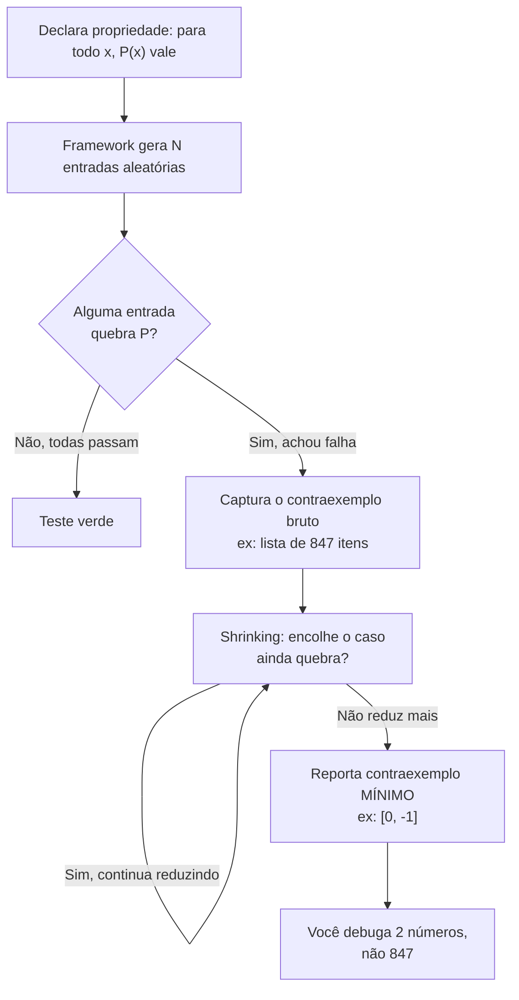
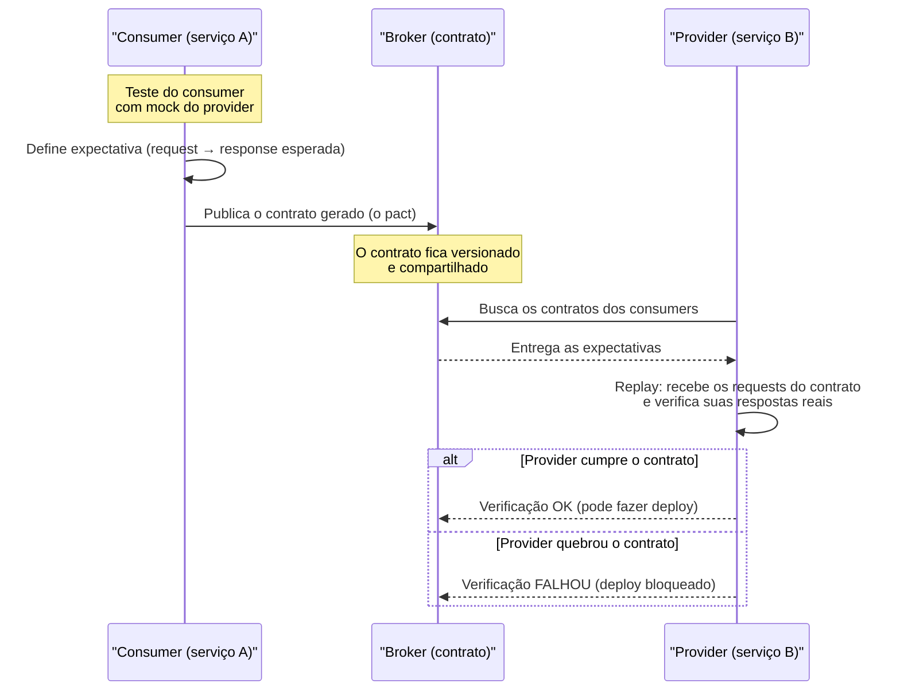
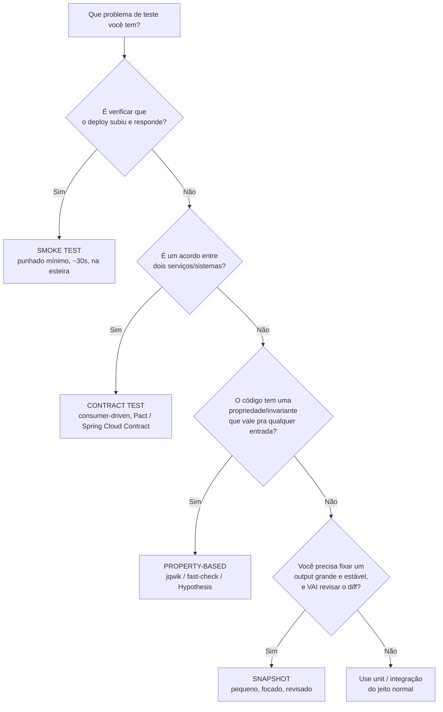

# Além do básico: property-based, snapshot, contract, smoke

> [!abstract] Resumo
> Quatro técnicas de nicho que não substituem unit/integração, mas rendem muito no contexto certo.
> **Property-based** inverte a lógica do teste de exemplo: em vez de você escolher a entrada, declara uma propriedade que vale pra qualquer entrada e o framework caça o contraexemplo que você não imaginou.
> **Snapshot** congela o output inteiro numa foto e compara — rápido de escrever, mas só protege se alguém realmente olhar o diff.
> **Contract** faz consumer e provider concordarem sobre a forma da mensagem sem precisar subir os dois juntos, matando o e2e caro entre microserviços.
> **Smoke** é o pulso pós-deploy: um punhado de checagens em segundos que respondem só "o sistema acordou?", antes de qualquer suite mais cara rodar.

A [[02 - A pirâmide de testes e suas variações|pirâmide]] te deu os andares principais: unit, integração, e2e. Mas existe uma **long tail** de tipos de teste que raramente aparece em tutorial e que, num nível senior, separa quem decora a pirâmide de quem sabe escolher a ferramenta certa pro problema certo.

Esta nota cobre quatro delas. A regra que costura tudo: **são especialistas, não generalistas.** Você não substitui seus testes de unidade por property-based; você adiciona property-based onde a lógica tem invariantes. Cada bloco aqui responde duas perguntas — *o que resolve?* e *quando vale?*.

---

## Property-based testing

Você escreve um teste de exemplo assim: "pra entrada `[3, 1, 2]`, `sort` devolve `[1, 2, 3]`". Bom. Mas você escolheu esse exemplo. E os exemplos que você **não** escolheu? A lista vazia, a lista com um elemento só, a lista já ordenada, a lista com dez mil duplicatas, a lista com `NaN`?

O property-based testing inverte a pergunta. Em vez de afirmar o resultado pra uma entrada específica, você declara uma **propriedade** que deve valer pra *qualquer* entrada — e o framework gera centenas de entradas aleatórias tentando te derrubar.

> [!tip] Analogia
> Teste de exemplo é você apontar o dedo num ponto do mapa e dizer "aqui funciona". Property-based é soltar mil macacos no teclado, cada um digitando uma entrada diferente, todos procurando o ponto onde sua propriedade quebra. Você não escolhe os exemplos — você descreve a *lei*, e a máquina busca o contraexemplo.

A propriedade clássica de uma ordenação: *o resultado tem o mesmo tamanho da entrada, está em ordem não-decrescente, e é uma permutação da entrada original.* Repare que isso vale pra `[3,1,2]`, pra `[]`, pra `[5,5,5]` — pra tudo. Você nunca menciona uma entrada concreta.

### A propriedade de ouro: round-trip

A propriedade mais valiosa na prática é a **ida-e-volta** (round-trip). Se você tem um par `encode`/`decode`, `serialize`/`deserialize`, `compress`/`decompress`, então pra qualquer `x`:

```
decode(encode(x)) == x
```

Isso é ouro pra parsers, serializadores JSON/protobuf, codecs, conversores de formato. Uma única propriedade de três linhas exercita o que mil casos manuais não pegariam.

```java
// jqwik (Java)
@Property
void roundTripPreservaValor(@ForAll @AlphaChars String original) {
    String codificado = Base64.getEncoder()
        .encodeToString(original.getBytes(UTF_8));
    String decodificado = new String(
        Base64.getDecoder().decode(codificado), UTF_8);
    assertThat(decodificado).isEqualTo(original);
}
```

```javascript
// fast-check (JS)
import fc from 'fast-check';

test('round-trip JSON preserva o objeto', () => {
  fc.assert(
    fc.property(fc.object(), (obj) => {
      expect(JSON.parse(JSON.stringify(obj))).toEqual(obj);
    })
  );
});
```

```python
# Hypothesis (Python)
from hypothesis import given, strategies as st

@given(st.lists(st.integers()))
def test_sort_idempotente(xs):
    once = sorted(xs)
    assert sorted(once) == once   # ordenar de novo não muda nada
```

### Shrinking: o contraexemplo mínimo

Aqui mora a mágica que distingue property-based de "rodar com input aleatório". Quando um dos mil macacos acha uma entrada que quebra — digamos uma lista de 847 números — você não quer debugar 847 números. Você quer o **menor** caso possível que ainda falha.

O framework faz isso sozinho. Chama-se **shrinking** (redução): achou a falha, ele começa a encolher o contraexemplo — remove elementos, diminui números, esvazia strings — e a cada passo verifica se *ainda* quebra. Quando não dá mais pra reduzir, te entrega o mínimo irredutível.



Lead-in: o ciclo vai de cima (a lei que você declarou) até o fundo (o contraexemplo enxuto que aterrissa no seu console).

Leitura do diagrama: a entrada bruta que quebrou (`E`) quase nunca é a que você vê — o laço de `F` mastiga ela até `G`, o caso mínimo. É por isso que property-based é prático e não só "fuzzing chique": o relatório vem mastigado.

> [!info] QuickCheck, a origem
> O property-based testing nasceu no Haskell com o **QuickCheck**. O **Hypothesis** (Python, desde 2015) popularizou a ideia fora do mundo funcional. Há uma diferença sutil entre eles: no QuickCheck o shrinking é definido **por tipo** (qualquer valor daquele tipo encolhe do mesmo jeito), enquanto o Hypothesis usa shrinking **integrado** à geração. Pra você usuário, o efeito é o mesmo: contraexemplo mínimo de graça.

### Geradores e o tipo `Arbitrary`

De onde vêm as centenas de entradas aleatórias? De um **gerador** — em jqwik chamado `Arbitrary<T>`, em Hypothesis `strategy`, em fast-check `Arbitrary` também. É um objeto que sabe produzir valores de um tipo, e cada framework já vem com geradores prontos pros tipos comuns (inteiro, string, lista, data). O trabalho de quem escreve o teste costuma ser **compor** geradores prontos, não escrevê-los do zero: "uma lista de inteiros entre 0 e 100", "uma string só de letras", "um objeto com estes três campos". Quando o domínio é mais estrito que os tipos primitivos — um CPF válido, um e-mail bem formado — você filtra ou mapeia o gerador base em vez de gerar às cegas e descartar o que não serve (descartar demais deixa o teste lento e a cobertura rala).

Isso também explica por que a propriedade round-trip é o exemplo favorito de todo tutorial: ela não exige *nenhum* gerador customizado. Qualquer gerador do tipo de entrada já basta, porque a propriedade não impõe uma forma específica de dado — só que ida e volta preserve o valor.

### Outras propriedades clássicas, além do round-trip

Round-trip é a mais citada, mas não a única forma de propriedade que vale a pena conhecer:

- **Invariante** — algo que permanece verdadeiro depois da operação, independente da entrada. "Depois de ordenar, o tamanho da lista não muda." Já apareceu nesta nota.
- **Idempotência** — aplicar a operação duas vezes dá o mesmo resultado que aplicar uma vez: `f(f(x)) == f(x)`. O teste `sort_idempotente` do bloco Hypothesis acima é esse caso: ordenar uma lista já ordenada não faz nada.
- **Metamórfica** — quando você não sabe o resultado exato, mas sabe como o resultado *deveria mudar* se a entrada mudar de um jeito controlado. Não dá pra prever o output de um mecanismo de busca pra uma query qualquer, mas dá pra afirmar que restringir a query nunca **aumenta** o número de resultados. A propriedade não descreve o valor — descreve a relação entre duas execuções.
- **Oráculo** — comparar contra uma segunda implementação, mais lenta ou mais simples, que você já confia. Útil quando otimiza um algoritmo: a versão rápida e a versão ingênua (força bruta) devem concordar pra qualquer entrada, mesmo que nenhuma das duas seja a "propriedade" no sentido matemático.

```python
# Metamórfica: restringir a busca nunca aumenta o total de resultados
@given(st.text(), st.text())
def test_busca_restrita_nao_aumenta(termo, sufixo):
    resultado_amplo = buscar(termo)
    resultado_restrito = buscar(termo + sufixo)
    assert len(resultado_restrito) <= len(resultado_amplo)
```

Não dá pra afirmar quantos resultados `buscar(termo)` devolve — depende do índice, do dia, dos dados. Mas dá pra afirmar a *relação* entre duas chamadas relacionadas, e é exatamente isso que a propriedade metamórfica declara. É a saída padrão quando round-trip e invariante simples não se aplicam: sistemas de ML, motores de busca, otimizadores — qualquer coisa onde o resultado exato é difícil de prever, mas a direção da mudança não é.

> [!info] As quatro categorias, lado a lado
> Round-trip é um caso particular de invariante (a "lei" é que a composição `decode ∘ encode` seja a identidade). Idempotência é outro caso particular (a lei é `f ∘ f == f`). Metamórfica e oráculo são as duas saídas quando você não consegue formular uma lei fechada sobre uma única execução — uma compara duas execuções relacionadas, a outra compara contra uma segunda implementação. Nomear qual categoria você está usando ajuda a comunicar a propriedade pro time revisando o PR.

### Stateful testing: quando a ordem das operações importa

Todo exemplo até aqui testa uma função pura: entrada vai, saída volta, fim. Mas e um `Stack`, um banco de dados, um sistema de arquivos — onde o que uma operação faz depende do que as operações *anteriores* deixaram? Property-based comum não alcança isso, porque cada chamada de `@given` é independente.

A resposta é o **stateful testing** (também chamado *model-based testing*): em vez de gerar um valor, o framework gera uma **sequência de operações** — `push`, `pop`, `push`, `push`, `pop` — e depois de cada passo verifica um **invariante** que precisa segurar o tempo todo (a pilha nunca fica com tamanho negativo; um `pop` sempre devolve o último `push` que ainda não foi consumido). O Hypothesis chama isso de `RuleBasedStateMachine`: você declara `@rule` pra cada operação possível, `@invariant` pra cada checagem contínua, e opcionalmente `@precondition` pra dizer quando uma regra faz sentido ser tentada (não adianta gerar `pop` numa pilha vazia). Quando falha, o framework faz o mesmo shrinking de sempre — só que agora encolhendo a *sequência*, te entregando os três passos mínimos que reproduzem o bug, não os trezentos que ele gerou.

```python
# Hypothesis — stateful testing de uma pilha
from hypothesis import strategies as st
from hypothesis.stateful import RuleBasedStateMachine, rule, invariant, precondition

class PilhaStateMachine(RuleBasedStateMachine):
    def __init__(self):
        super().__init__()
        self.pilha = []
        self.modelo = []   # a "pilha ingênua" que serve de oráculo

    @rule(valor=st.integers())
    def push(self, valor):
        self.pilha.append(valor)
        self.modelo.append(valor)

    @precondition(lambda self: len(self.pilha) > 0)
    @rule()
    def pop(self):
        assert self.pilha.pop() == self.modelo.pop()

    @invariant()
    def tamanhos_batem(self):
        assert len(self.pilha) == len(self.modelo)

TestPilha = PilhaStateMachine.TestCase
```

Repare que este exemplo já mistura duas ideias desta nota: `@precondition` evita gerar `pop` numa pilha vazia, e o `assert` dentro de `pop` é um **teste oráculo** — compara a pilha real contra `self.modelo`, uma implementação trivial (uma lista Python) que você já confia.

### Quando vale property-based

Vale quando existe uma **invariante** que você consegue declarar sem reescrever a implementação:

- Lógica matemática e algorítmica (ordenação, busca, estruturas de dados).
- Parsers e serializadores (a propriedade round-trip).
- Invariantes de domínio: "o saldo nunca fica negativo", "o total da fatura é a soma dos itens".
- Funções puras em geral.

Não vale quando você não consegue formular a propriedade sem copiar a lógica do código (aí o teste só repete o bug). E se a propriedade é "o resultado é exatamente Y", você já tem um teste de exemplo — não precisa de gerador.

Esta técnica é a parceira natural de [[10 - Técnicas de teste e edge cases]]: ela **gera** os edge cases que você não pensou. A lista vazia, o overflow, o caractere unicode estranho — a máquina acha pra você.

---

## Snapshot testing

Você renderiza um componente, ou serializa uma estrutura grande, ou pega a resposta de uma API. Como escrever a asserção? Comparar campo por campo de um objeto com cinquenta propriedades é tedioso e frágil.

O snapshot testing resolve por **fotografia**. Na primeira execução, ele grava o output num arquivo (`.snap`). Nas próximas, compara o output atual com a foto guardada. Igual? Passa. Diferente? Falha e te mostra o diff.

> [!tip] Analogia
> Snapshot é a foto "antes/depois" da reforma da casa. Você não descreve cada parede — você compara duas imagens e olha o que mudou. O problema é o mesmo da foto: ela só vale se alguém *olhou* o "depois" e confirmou que era a casa que queria, não a parede caindo.

```javascript
// Jest
test('renderiza o card do usuário', () => {
  const tree = render(<UserCard name="Ada" role="admin" />);
  expect(tree).toMatchSnapshot();
});
```

Na primeira vez, o Jest grava a árvore renderizada num `.snap`. Mudou o componente? O teste falha e mostra o que diferiu.

### O risco que define o destino do snapshot

Aqui está a armadilha senior — grave o suficiente pra ganhar seção própria em [[#Armadilhas comuns]].

O agravante: capturar uma árvore de componente inteira gera snapshots de centenas de linhas. Ninguém revisa um diff de 500 linhas com atenção, e o snapshot muda por motivos não relacionados (renomeou uma classe CSS lá longe → metade dos snapshots viram vermelho).

### Bom candidato, mau candidato

Nem todo output merece virar snapshot. O teste de triagem é sempre o mesmo — "se isto mudar, eu vou ler o diff?" — mas vale nomear o que costuma passar e o que costuma falhar nesse teste:

- **Bom candidato:** determinístico (mesma entrada sempre produz o mesmo output byte a byte), pequeno o bastante pra caber num diff que cabe na tela, e muda **raramente e de propósito** — a forma de um DTO serializado, a saída de um formatador, a árvore de um componente folha sem estado.
- **Mau candidato:** qualquer coisa com dado volátil embutido (timestamp de agora, UUID gerado, ordem de iteração de um `Set`/`Map` sem `sort`), árvores de componente com dúzias de filhos, ou output que muda a cada refactor cosmético sem relação com o comportamento testado.

### Normalizando o que muda sempre

Quando o candidato é bom *menos* por um ou dois campos voláteis, a saída não é descartar o snapshot — é **normalizar** antes de comparar. Duas táticas cobrem a maioria dos casos:

1. **Property matchers** (Jest/Vitest): você passa um objeto com o formato esperado pros campos voláteis — `expect(obj).toMatchSnapshot({ id: expect.any(String), createdAt: expect.any(Date) })` — o framework valida o *tipo* desses campos e ainda assim tira a foto normal do resto.
2. **Serializer customizado**: uma função que roda antes de gravar, substituindo cada UUID por um placeholder fixo (`{{uuid}}`) e cada timestamp por outro (`{{now}}`). O `.snap` fica estável porque o que varia nunca chega a ser gravado.

```javascript
// Jest — normalizando timestamp e id antes do snapshot
expect(pedido).toMatchSnapshot({
  id: expect.any(String),
  criadoEm: expect.any(String),
});
```

Sem essa disciplina, um campo volátil transforma todo snapshot num teste flaky disfarçado — falha a cada execução, o time acostuma a apertar `u`, e você caiu direto na armadilha de [[#Armadilhas comuns|snapshot fatigue]].

### Snapshot não é approval testing — mas é o mesmo gene

Vale marcar a diferença com [[03-Dominios/Engenharia/Arqueologia e Restauração de Software/11 - Approval e Golden Master testing]], já linkada em [[#O que vem a seguir]]: as duas técnicas fotografam o output inteiro em vez de fazer asserção campo a campo, mas nascem em contextos opostos. Snapshot testing é uma ferramenta do dia a dia — você escreve o teste junto com o código novo, sabendo o que está gravando. Approval/Golden Master nasce em **legado sem cobertura**: você aprova o comportamento *atual*, bugs inclusos, só pra ter uma rede de segurança antes de refatorar. O mecanismo — gravar, comparar, revisar o diff — é o mesmo; a intenção por trás é que muda.

### Quando vale snapshot

Vale **com critério**, e o critério é: o diff tem que ser revisável por um humano.

- Snapshots **pequenos e focados** — uma estrutura de dados, um componente folha, um pedaço de resposta de API. Não a página inteira.
- Output que muda raramente e de forma intencional.
- Sempre acompanhado da disciplina de **revisar cada diff de snapshot como revisa código**. Se o time não revisa, o snapshot é pior que nenhum teste, porque dá falsa sensação de cobertura.

A pergunta de triagem antes de gravar um snapshot: *"se isto mudar, eu vou olhar o diff ou vou apertar `u`?"* Se a resposta honesta é `u`, não escreva o snapshot.

---

## Contract testing

Cenário de microserviços: o serviço **A** (consumer) chama o serviço **B** (provider) por HTTP. Você quer garantir que os dois concordam sobre a forma da mensagem — os campos, os tipos, o status code. A solução ingênua é subir os dois juntos e testar de ponta a ponta. Lento, frágil, e exige coordenar dois deploys.

O contract testing resolve testando **cada lado em isolamento** contra um **contrato** compartilhado — um documento que descreve "quando você me mandar isto, eu te respondo aquilo".

> [!tip] Analogia
> Contract testing é o aperto de mão antes da reunião. Em vez de A e B descobrirem na hora da chamada real que falam línguas diferentes, eles combinam **antes** o protocolo: "você me manda o CPF como string de 11 dígitos, eu te devolvo `{ nome, status }`". Cada um treina sozinho contra o combinado. Ninguém precisa estar na sala ao mesmo tempo.

### Consumer-driven: quem manda na forma é quem consome

A variante mais útil é o **consumer-driven contract** (contrato dirigido pelo consumidor). A ideia: quem define a expectativa é o **consumer**, porque é ele que sabe o que realmente usa da resposta. O provider só verifica que cumpre.

O fluxo com Pact:



Lead-in: leia de cima pra baixo seguindo o contrato (no meio) como o documento que os dois lados consultam sem nunca se falarem diretamente.

Leitura do diagrama: o consumer roda primeiro e *gera* o contrato a partir das suas próprias expectativas (não o provider). O provider depois pega esse contrato e faz **replay** — reexecuta os requests e checa as próprias respostas. Repare que A e B nunca sobem juntos; o broker no meio é o único ponto de encontro.

> [!info] A definição de Fowler
> Martin Fowler define contract test como "uma técnica para testar um ponto de integração checando cada aplicação em isolamento, garantindo que as mensagens que ela envia ou recebe conformam a um entendimento compartilhado documentado num contrato". O **Pact** é o padrão de fato pra consumer-driven contracts; no ecossistema Spring, o **Spring Cloud Contract** cumpre o mesmo papel.

### Consumer-driven × provider-driven

Tudo até aqui descreveu o fluxo **consumer-driven** — Pact, onde o consumer escreve a expectativa e o provider verifica contra ela. Existe uma segunda variante, **provider-driven**, onde é o **producer** quem escreve o contrato — o **Spring Cloud Contract** é o exemplo canônico no ecossistema JVM.

O fluxo se inverte: o time do provider escreve os contratos numa DSL (Groovy, YAML ou Kotlin) descrevendo request/response, guarda isso junto do código do próprio provider, e o plugin gera automaticamente os testes de verificação que rodam contra uma `baseClassForTests` (uma classe base que sobe o sistema sob teste, normalmente com RestAssured MockMvc). O mesmo build empacota um **stub jar** a partir desses contratos; consumers baixam esse jar e rodam testes de integração reais contra o stub via `@AutoConfigureStubRunner`, sem precisar subir o provider de verdade.

A diferença prática de decisão:

- **Consumer-driven** (Pact) é melhor quando o provider tem **muitos** consumers com necessidades distintas — cada um define só o que usa, e o provider nunca precisa adivinhar o que ninguém consome de verdade.
- **Provider-driven** (Spring Cloud Contract) é melhor quando o provider quer manter controle centralizado da própria API e publicar um contrato único que todo mundo consome — mais parecido com "aqui está minha API, aqui está o stub pra você testar contra ela".

### O broker e a pergunta "posso fazer deploy?"

O **broker** do diagrama acima não é só um repositório passivo de contratos — ele guarda também o **resultado** de cada verificação: qual versão do consumer foi testada contra qual versão do provider, e se passou. Essa matriz é o que responde, em CI, a pergunta que interessa de verdade antes de um deploy: *"a versão que eu quero subir é compatível com o que já está rodando no ambiente de destino?"*

O comando que faz essa pergunta chama `can-i-deploy`:

```
pact-broker can-i-deploy \
  --pacticipant servico-a \
  --version a3f92c1 \
  --to-environment production
```

Ele olha a matriz de verificações no broker e responde sim/não. Sim: o deploy prossegue. Não: o pipeline barra, porque em algum lugar consumer e provider divergem — antes que isso vire um 500 em produção. Depois do deploy bem-sucedido, um segundo comando (`record-deployment`) avisa o broker que aquela versão agora está no ar naquele ambiente, atualizando a matriz pra a próxima checagem.

### Provider states: simulando a precondição, não só a request

Um detalhe que o diagrama simplifica: o provider não recebe só "este request, esta resposta esperada" — ele recebe também uma **provider state**, um rótulo tipo `"existe um usuário com id 42"` ou `"o carrinho está vazio"`. É a precondição necessária pra aquele cenário fazer sentido. Do lado do consumer, o teste declara essa state no bloco `given(...)`; do lado do provider, durante a verificação, um setup correspondente prepara os dados reais antes de disparar o request gravado no contrato.

Sem provider states, contract testing teria o mesmo problema de qualquer suite com dependência de dados pré-existentes: um teste que só passa se rodar depois de outro, ou que precisa de um banco populado numa ordem específica. Com elas, cada interação do contrato roda **isolada** — o provider monta exatamente o estado que aquele cenário pede e descarta depois — o que é a mesma disciplina de isolamento que já aparece em [[07 - Testes de integração]] pra fixtures de banco.

### Quando vale contract testing

Vale quando você tem **vários serviços com evolução coordenada** e quer matar o medo de quebrar um consumer ao mudar um provider:

- Microserviços onde times diferentes donos de A e B precisam evoluir em ritmos diferentes.
- Substituir e2e caros e instáveis pela combinação "contrato + teste isolado de cada lado".
- APIs internas com muitos consumidores — o contrato vira a documentação executável da fronteira.

Não vale pra um monolito, nem pra uma integração pontual com terceiro que você não controla (você não consegue fazer o provider deles rodar seu contrato).

Isto fecha a fronteira que [[07 - Testes de integração]] abre: a integração testa que A fala com B *de verdade*; o contrato testa que A e B *concordam sobre a forma* sem precisar estar no ar ao mesmo tempo. Pra como isso entra na esteira, veja [[15 - Testes em CI-CD]].

---

## Smoke testing

Acabou o deploy. O artefato subiu. A pergunta mais básica do mundo, antes de qualquer suite cara: **o sistema acordou e responde?**

O smoke test é um punhado mínimo de verificações pós-deploy que dão **sinal de vida** em segundos. A home carrega? O `/health` retorna 200? O login aceita um usuário? Não é profundidade — é o pulso.

> [!tip] Analogia
> O nome vem do hardware: você liga a placa de circuito e olha se sai fumaça. Saiu fumaça? Falhou, nem adianta testar o resto. Em software é igual — se o build "está fumegando", você rejeita antes de gastar a QA pesada em cima de algo que nem sobe.

```javascript
// Smoke test pós-deploy — roda em ~30s
test('sistema responde', async () => {
  const res = await fetch(`${BASE_URL}/health`);
  expect(res.status).toBe(200);
});

test('home renderiza', async () => {
  const res = await fetch(`${BASE_URL}/`);
  expect(res.status).toBe(200);
  expect(await res.text()).toContain('<title>');
});
```

O ponto não é a riqueza das asserções — é a **velocidade** e o **posicionamento**. Smoke roda imediatamente depois do deploy (em staging ou direto em produção), e se ele falha, o build é rejeitado / o deploy é revertido antes que QA mais profunda gaste tempo num sistema instável.

> [!warning] Smoke não é a suite, é o disjuntor
> Um erro comum é inflar o smoke test até ele virar uma suite e2e completa. Não. Se passa de ~30s, deixou de ser smoke. O valor é justamente ser rápido o bastante pra rodar a cada deploy sem ninguém reclamar. Profundidade fica pros outros andares da pirâmide. Detalhe em [[#Armadilhas comuns]].

### Três primos que se confundem: smoke, health check e synthetic monitoring

Os três respondem "está funcionando?", mas em momentos e granularidades diferentes — vale distinguir pra não usar o nome errado numa entrevista:

- **Health check** é o processo se auto-atestando: um endpoint (`/health`) que responde 200 se o processo subiu, conectou no banco, tem memória disponível. Roda *dentro* do sistema, continuamente, e é o que o orquestrador (Kubernetes, load balancer) consulta pra decidir se aquele pod recebe tráfego.
- **Smoke test** é externo e pontual: dispara **uma vez**, logo depois de um deploy específico, fazendo um punhado de requests reais (não só bater no `/health` — também renderizar a home, talvez logar um usuário). Health check passando não é garantia de smoke passando: o processo pode estar de pé e saudável e ainda assim servir uma página quebrada.
- **Synthetic monitoring** é o mesmo tipo de checagem do smoke, mas **contínua**: os mesmos scripts (login, busca, checkout) rodando em loop contra produção, minuto a minuto, não só no instante do deploy. Onde o smoke é o gate de entrada, o synthetic é o sensor permanente — [[15 - Testes em CI-CD]] aprofunda essa continuidade e cita a mesma origem.

Os três moram na fronteira entre teste e observabilidade; o lado de operar esse pulso continuamente — SLIs, alerting, o que fazer quando o synthetic acusa degradação — é território de [[03-Dominios/Engenharia/Operação/4 - Observar e responder/01 - Observabilidade como prática]], não desta nota.

### Quando vale smoke

Sempre que houver deploy automatizado. É o último portão da esteira: passou pelo build, pelos testes, fez deploy → smoke confirma que o que está no ar respira. Em produção, vira também a primeira camada de monitoramento de releases.

Conecta direto com [[15 - Testes em CI-CD]] (é um estágio da pipeline) e tem primo distante em [[14 - Performance, carga, caos e segurança]] — onde a pergunta deixa de ser "responde?" e passa a ser "aguenta?".

---

## Quando cada um vale

A mensagem central, antes da tabela: **nenhum destes substitui unit ou integração.** São ferramentas de nicho. Você adiciona onde o nicho aparece.

| Técnica | Resolve | Use quando | Cuidado |
|---|---|---|---|
| **Property-based** | Casos que você não imaginou | Lógica com invariantes, parsers, round-trip | Propriedade fraca = teste inútil |
| **Snapshot** | Asserção sobre output grande | Output estável, diff revisável | Snapshot fatigue: carimbar `u` sem ler |
| **Contract** | Acordo entre serviços sem subir os dois | Microserviços, evolução coordenada | Inútil pra monolito ou terceiro |
| **Smoke** | "O sistema acordou?" | Todo deploy automatizado | Não vire suite e2e disfarçada |

E o fluxograma de decisão:



Lead-in: entre por cima com o problema em mãos e desça pelas perguntas — a primeira que der "sim" é a sua ferramenta.

Leitura do diagrama: a ordem das perguntas não é aleatória. Smoke e contract são decisões de *arquitetura de teste* (onde, entre quê), por isso vêm primeiro; property e snapshot são decisões sobre a *natureza do código sob teste*. Se nenhuma casa, a resposta honesta é o caixote final: você não precisava de técnica de nicho, precisava de um unit test bem-feito.

---

## Armadilhas comuns

As quatro técnicas desta nota têm em comum um perfil de risco: são baratas de adotar e caras de adotar mal, porque o sintoma de "adotou errado" não é o teste vermelho — é o teste verde que não protege nada.

> [!danger] Snapshot fatigue: o carimbo automático
> O snapshot empurra **toda** a carga cognitiva pro revisor. O teste é fácil de criar — `toMatchSnapshot()` e pronto. Mas quando ele falha, o Jest te oferece um atalho fatal: aperte `u` e *todos* os snapshots se atualizam. Depois de algumas semanas, o engenheiro entra em **snapshot fatigue** e começa a apertar `u` sem ler o diff. Nesse ponto o teste não testa mais nada — ele carimba qualquer mudança como "esperada". Você tem coverage no relatório e zero proteção na prática.

> [!warning] Propriedade fraca: o teste que só repete o bug
> Property-based só rende se a propriedade for uma lei de verdade independente da implementação. Se você não consegue formular a propriedade sem copiar a lógica do código, o "teste" apenas reimplementa a função ao lado dela — quando o código erra, o teste erra do mesmo jeito, e os dois concordam. Isso já aparece na tabela-resumo acima (linha Property-based, coluna Cuidado) e na seção "[[#Quando vale property-based|Quando vale property-based]]": gerador mal definido produz entradas que não exercitam o invariante real, e a "cobertura" gerada é ilusória — parece rigor estatístico, mas não pega nada que um exemplo fixo não pegasse.

> [!warning] Contract testing fora do lugar: esforço sem retorno
> A técnica presume que você consegue fazer os dois lados — consumer e provider — rodarem o contrato. Aplicada a um monolito, não há fronteira de rede pra testar: é overhead puro. Aplicada a uma integração com um terceiro que você não controla, o problema é pior — você não convence o time deles a rodar seu Pact broker, então o "contrato" vira documentação que ninguém verifica automaticamente e apodrece na primeira mudança silenciosa do outro lado.

> [!warning] Smoke não é a suite, é o disjuntor
> Inflar o smoke test até ele virar uma suite e2e completa mata a razão dele existir: a velocidade. Um smoke de 5 minutos não roda a cada deploy sem alguém reclamar — e quando ele deixa de rodar a cada deploy, você perdeu o sinal de vida rápido que justificava separá-lo do resto da pirâmide. (Callout gêmeo em [[#Smoke testing|Smoke testing]].)

---

## O que vem a seguir

Estas quatro técnicas têm parentes diretos em outros galhos do vault que valem a pena visitar em seguida.

Se snapshot testing te interessou, [[03-Dominios/Tecnologia/Testes JS/11 - Snapshot testing]] aprofunda a mecânica específica do Jest/Vitest — como o `.snap` é gerado, versionado e revisado no ecossistema JS. Em legado sem cobertura, a mesma ideia de "fotografar o output" aparece sob outro nome em [[03-Dominios/Engenharia/Arqueologia e Restauração de Software/11 - Approval e Golden Master testing]]: aprovar o comportamento atual como baseline antes de refatorar, o parente arqueológico do snapshot.

Se contract testing te interessou, [[03-Dominios/Tecnologia/Java/Testes/20 - Contract testing — Pact]] mostra o Pact na prática — publish, broker, replay — no ecossistema onde consumer-driven contracts são mais comuns.

E se você trabalha com acessibilidade, vale ver como uma variação do "checar sem subir tudo junto" aparece em [[03-Dominios/Tecnologia/Acessibilidade/Auditar e Testar/14 - Testes de a11y no código]]: testes automatizados de a11y rodando isolados, antes do e2e completo.

---

## Em entrevista

These four are "differentiator" answers — most candidates stop at unit, integration, and e2e. Mentioning them signals breadth, as long as you frame them as niche tools, not replacements. The cleanest one-liner for **property-based testing**: instead of asserting one example, you declare a property that holds for any input, the framework generates hundreds of random inputs to break it, and **shrinking** reduces the failing case to a minimal counterexample. For **contract testing**, the key phrase is **consumer-driven**: the consumer defines its expectations, the provider verifies them, and neither has to be running at the same time — perfect for microservices that evolve independently. On **snapshot testing**, show maturity by naming the trap: snapshot fatigue, where engineers blindly accept the diff and the test stops protecting anything. And **smoke testing** is your post-deploy sign of life — a handful of checks in seconds, not depth.

### Vocabulário

| PT-BR | EN |
|---|---|
| teste baseado em propriedades | property-based testing |
| redução / encolhimento | shrinking |
| contraexemplo mínimo | minimal counterexample |
| ida-e-volta | round-trip |
| teste de snapshot | snapshot testing |
| carimbo automático (apertar "aceitar" sem revisar) | snapshot fatigue |
| teste de contrato | contract testing |
| contrato dirigido pelo consumidor | consumer-driven contract |
| teste de fumaça | smoke test |
| sinal de vida | sign of life / health check |
| invariante | invariant |

> [!tip] Vídeo — John Hughes, o criador do QuickCheck
> [John Hughes — "Don't Write Tests"](https://www.youtube.com/watch?v=hXnS_Xjwk2Y) — o próprio autor do QuickCheck defendendo a tese que dá nome à técnica: em vez de escrever casos de teste um a um, você declara a propriedade e deixa o gerador achar (e encolher) o contraexemplo. Bom complemento pra quem quer ver a motivação original antes de ir direto pro `jqwik`/`fast-check`/`Hypothesis`.

---

## Fontes

- [Martin Fowler — ContractTest](https://martinfowler.com/bliki/ContractTest.html) — define contract test como checar cada aplicação em isolamento contra um entendimento compartilhado documentado num contrato.
- [Hypothesis — Integrated vs type based shrinking](https://hypothesis.works/articles/integrated-shrinking/) — diferença entre o shrinking por tipo (QuickCheck) e o integrado (Hypothesis).
- [The Perils of Jest Snapshot Testing — Peter Hrynkow](https://peterhrynkow.com/testing/2019/01/07/the-perils-of-snapshot-testing.html) — snapshot fatigue e o carimbo automático de diffs.
- [What is Consumer-Driven Contract Testing — Pactflow](https://pactflow.io/what-is-consumer-driven-contract-testing/) — o consumer expressa expectativas, o provider verifica; Pact como padrão de fato.
- [Smoke testing (software) — Wikipedia](https://en.wikipedia.org/wiki/Smoke_testing_(software)) — origem do termo no hardware e papel de build verification.
- [Hypothesis — Stateful testing](https://hypothesis.readthedocs.io/en/latest/stateful.html) — `RuleBasedStateMachine`, `@rule`, `@invariant` e `@precondition` pra testar sequências de operações.
- [Jest — Snapshot Testing, Property Matchers](https://jestjs.io/docs/snapshot-testing#property-matchers) — normalizar campos voláteis (timestamp, id) antes de gravar o snapshot.
- [Pact — Provider states](https://docs.pact.io/getting_started/provider_states) — a precondição necessária pra cada interação do contrato rodar isolada.
- [Pact Broker — can-i-deploy](https://docs.pact.io/pact_broker/can_i_deploy) — a checagem de compatibilidade entre versões antes do deploy.
- [Spring Cloud Contract — Verifier Setup](https://cloud.spring.io/spring-cloud-contract/2.0.x/multi/multi__spring_cloud_contract_verifier_setup.html) — `baseClassForTests`, stub jar e o fluxo provider-driven.

---

## Veja também

- [[02 - A pirâmide de testes e suas variações]] — os andares principais; estas quatro são a long tail fora da pirâmide.
- [[07 - Testes de integração]] — a fronteira que o contract testing cobre por outro ângulo.
- [[10 - Técnicas de teste e edge cases]] — property-based gera os edge cases que você não pensou.
- [[14 - Performance, carga, caos e segurança]] — quando "responde?" vira "aguenta?".
- [[15 - Testes em CI-CD]] — onde smoke e contract entram na esteira.
- [[16 - Estratégia de testes em entrevista]] — como posicionar estas técnicas numa resposta.
- [[Testes em Java]] e [[Testes em JavaScript]] — jqwik, fast-check, Pact e snapshot na prática.
- [[03-Dominios/Engenharia/Testes/index|Testes]] — índice do galho.
