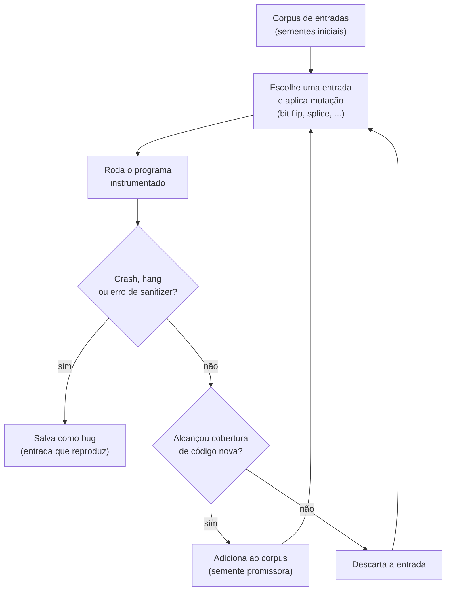
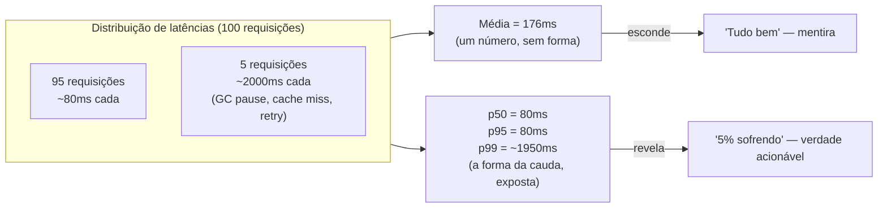
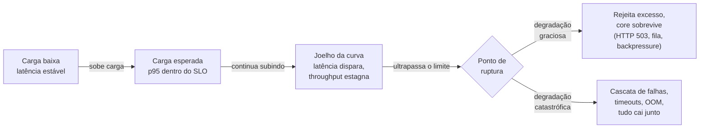
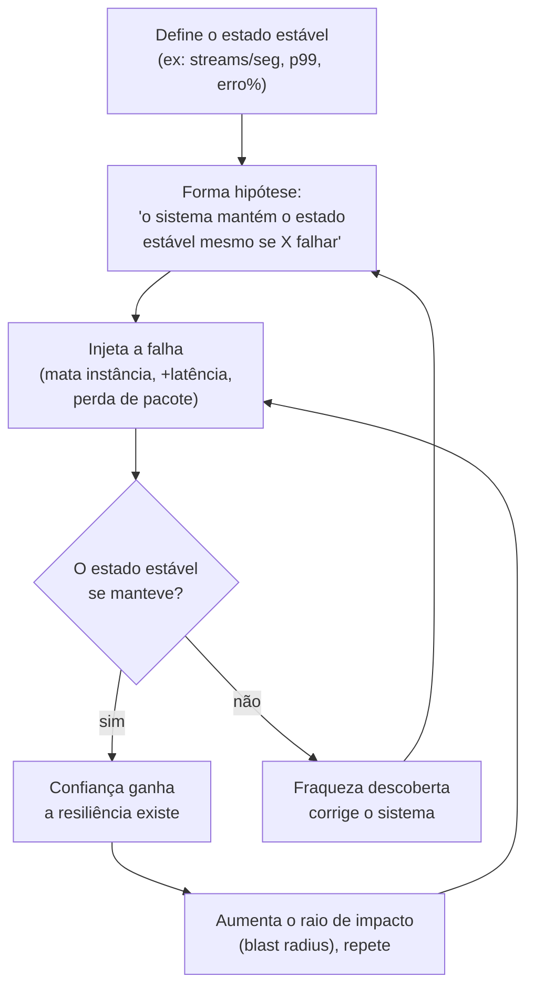
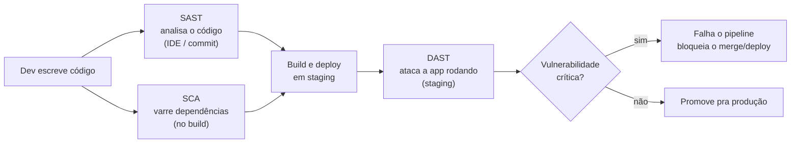

# Performance, carga, caos e segurança

> [!abstract] Resumo em uma linha
> Testes funcionais perguntam "está correto?"; estes perguntam "aguenta?", "quão rápido?", "sobrevive à falha?" e "é seguro?" — e cada pergunta tem sua própria ferramenta e seu próprio momento de maturidade.
>
> **Microbenchmark** mede nanossegundos de um trecho isolado de código (JMH). **Load test** mede latência e throughput sob a carga *esperada*, validando um SLO (k6, Gatling, JMeter). **Stress test** empurra além do esperado até achar o ponto de ruptura e — mais importante — observar *como* o sistema quebra (graciosamente ou em cascata). **Chaos engineering** injeta falhas reais no sistema rodando para provar, com experimento controlado, que a resiliência prometida existe de fato. **Security testing** (SAST/DAST/SCA + pentest) caça vulnerabilidades exploráveis, não bugs de lógica.
>
> Nenhum desses cinco é substituto do outro — eles atacam camadas diferentes (função isolada → sistema sob carga normal → sistema sob carga extrema → sistema sob falha real → sistema sob ataque), e a ordem em que um time os adota é, ela mesma, um sinal de maturidade de engenharia.

Toda a [[02 - A pirâmide de testes e suas variações|pirâmide de testes]] que vimos até aqui responde a uma única pergunta: **o código faz a coisa certa?** Unit, integração, e2e — todos checam *correção*. Mas um sistema pode estar 100% correto e ainda assim cair na Black Friday, vazar dados ou levar 8 segundos pra carregar.

Existe uma família inteira de testes que **não olha pra correção**. Olha pra *qualidade não-funcional*: velocidade, capacidade, resiliência, segurança. São testes que medem **limites** e **comportamento sob estresse**, não saídas esperadas.

A analogia que cola: pense no **crash test de carro**. Ninguém bate um carro contra a parede pra descobrir se o motor liga — isso é teste funcional. Bate-se de propósito pra descobrir *o que acontece quando o pior acontece*: o chassi amassa do jeito certo? O airbag dispara? A coluna de direção recua em vez de empalar o motorista? Você quebra a coisa de propósito, num ambiente controlado, **pra aprender antes que aconteça de verdade**.

## A diferença-chave

| Pergunta | Tipo de teste | O que mede |
|---|---|---|
| Está correto? | Funcional (unit/integração/e2e) | Saída == esperado |
| Quão rápido é este trecho? | **Microbenchmark** | Latência de uma função |
| Aguenta a carga esperada? | **Load test** | Latência e throughput sob N usuários |
| Onde quebra, e como? | **Stress test** | Ponto de ruptura e tipo de degradação |
| Sobrevive a falhas reais? | **Chaos engineering** | Resiliência sob injeção de falha |
| É seguro? | **Security testing** | Vulnerabilidades no código e nas deps |

> [!tip] A regra mental
> Se o teste tem um `assert resultado == esperado`, é funcional. Se o teste tem um *gráfico* (latência ao longo do tempo, requisições por segundo, p99), é não-funcional. Funcional dá verde ou vermelho; não-funcional dá uma **curva** que você interpreta.

## Microbenchmark — medir um trecho com precisão cirúrgica

Você quer saber: esta função de parsing leva 12ns ou 120ns? Esta troca de `ArrayList` por `LinkedList` ajudou? Microbenchmark mede **um trecho minúsculo de código**, isolado, com precisão de nanossegundos.

E aqui mora um campo minado. Medir tempo na JVM ingenuamente — `long t = System.nanoTime(); foo(); System.nanoTime() - t;` — produz **números que mentem**. Por quê?

Três armadilhas clássicas — JIT warmup, dead-code elimination e constant folding — fazem esses números mentirem sistematicamente (a lista completa está em [[#Armadilhas comuns]], mais abaixo).

### Quatro modos de medir, quatro perguntas diferentes

Antes mesmo de warmup ou Blackhole, o JMH pede uma decisão anterior: **o que exatamente você quer medir?** O `@BenchmarkMode` tem quatro opções, e cada uma responde uma pergunta diferente:

| Modo | O que reporta | Pergunta que responde |
|---|---|---|
| `Throughput` | operações por unidade de tempo (ops/s) | "Quantas vezes por segundo esse código roda?" |
| `AverageTime` | tempo médio por chamada | "Em média, quanto tempo uma chamada leva?" |
| `SampleTime` | amostra os tempos e reporta p50/p90/p99/min/max | "Qual é a *distribuição* dos tempos — tem cauda?" |
| `SingleShotTime` | tempo de uma única execução, sem warmup | "Quanto custa a *primeira* chamada (cold start)?" |

`Throughput` e `AverageTime` são inversos um do outro e servem pra comparação simples ("essa versão é mais rápida?"). `SampleTime` é o modo que importa quando o código tem variância — igual o load test, ele expõe percentis em vez de esconder a cauda numa média. `SingleShotTime` existe porque nem todo código roda em steady state: uma função chamada uma vez por request numa Lambda se importa mais com o cold start do que com o desempenho depois de 10.000 iterações de warmup — o oposto do que os outros três modos medem.

Escolher o modo errado produz o mesmo tipo de mentira que uma média mal escolhida num load test: medir `AverageTime` de uma função com variância alta esconde exatamente a cauda que `SampleTime` existiria pra expor. O paralelo com percentis de load test não é coincidência — é a mesma estatística, em escala de nanossegundos.

A resposta para isso é o **JMH** (Java Microbenchmark Harness), parte do projeto OpenJDK. Ele resolve cada armadilha:

- Roda iterações de **warmup** descartadas antes de medir, garantindo que o JIT já compilou tudo.
- Oferece o **`Blackhole`**: você passa o resultado para `blackhole.consume(x)`, e o JIT *não pode* eliminar o cálculo, porque o resultado "escapa". Mata o DCE.
- Roda múltiplos **forks** (JVMs separadas) pra evitar que o perfil de compilação de um benchmark contamine o outro, e reporta com desvio.

```java
@Benchmark
@Warmup(iterations = 5)
@Measurement(iterations = 10)
@Fork(3)
public void medeParse(Blackhole bh) {
    bh.consume(parser.parse(ENTRADA)); // consume() impede o JIT de apagar o parse
}
```

Detalhes de como o JMH resolve cada armadilha na prática estão em [[Testes em Java]]. Em outras linguagens o nome muda (Google Benchmark em C++, `criterion` em Rust/Python, `BenchmarkDotNet` em .NET), mas as três armadilhas são universais.

## Fuzzing — jogar lixo na entrada até algo quebrar

Antes de medir velocidade ou carga, vale uma técnica que mora na fronteira entre teste e segurança: o **fuzzing**. A ideia é quase boba de tão direta — em vez de escrever entradas cuidadosas, você **bombardeia a função com entradas malformadas, aleatórias, gigantes, vazias, com caracteres estranhos**, milhões delas, e vê o que faz o programa *crashar*, travar, vazar memória ou se comportar errado. Não há `assert resultado == esperado`; o oráculo é mais cru: **o programa não devia morrer com nenhuma entrada, por mais idiota que ela seja**.

A versão ingênua — gerar bytes aleatórios e torcer — é fraca. A entrada aleatória quase sempre é rejeitada logo no primeiro `if` de validação e nunca alcança o código profundo onde mora o bug. A evolução que mudou o jogo é o **coverage-guided fuzzing** (fuzzing guiado por cobertura): o programa é **instrumentado** pra reportar quais caminhos cada entrada exercita, e o fuzzer trata isso como um **algoritmo genético**. A "seleção natural" é a cobertura — quando uma entrada mutada alcança um trecho de código *novo*, o fuzzer a guarda no corpus e a usa como base pra novas mutações. Aos poucos, ele "aprende" a forma da entrada e penetra fundo no código, sem nunca ter visto a gramática do formato.

Lead-in: o diagrama abaixo mostra esse laço de retroalimentação que separa o fuzzing moderno do aleatório burro.



Leitura do diagrama: o coração é o losango F — *alcançou cobertura nova?*. Entradas que abrem caminhos inéditos viram sementes (G) e se reproduzem; as que não rendem nada são descartadas (H). É o que torna o fuzzing **direcionado** em vez de cego: ele não busca o bug, busca *código ainda não explorado*, e o bug aparece como subproduto. Quando casa com um **sanitizer** (AddressSanitizer detecta acesso fora dos limites, leak de memória), o losango D dispara em corrupções que nem chegariam a crashar sozinhas.

As ferramentas canônicas: **AFL / AFL++** (instrumentação em tempo de compilação, processo externo) e **libFuzzer** (in-process, integrado ao LLVM e aos sanitizers). O ponto de entrada do libFuzzer é minúsculo — você só escreve a função que recebe os bytes e os joga no código sob teste:

```cpp
// libFuzzer: o harness é só isto. O fuzzer cuida das mutações e da cobertura.
extern "C" int LLVMFuzzerTestOneInput(const uint8_t *data, size_t size) {
    minha_funcao_de_parse(data, size); // crash/leak aqui vira um bug reportado
    return 0;
}
```

Por cima dessas engines, o **OSS-Fuzz** do Google roda fuzzing *contínuo* em centenas de projetos open-source críticos — e já encontrou **dezenas de milhares** de bugs e vulnerabilidades em coisas como OpenSSL, SQLite e curl. Fuzzing não é um teste que roda uma vez; é uma infraestrutura que roda pra sempre.

O fuzzing puramente aleatório, mesmo guiado por cobertura, ainda esbarra num teto quando a entrada tem uma **gramática rígida** — um JSON, um binário Protobuf, um formato de arquivo com checksum. Mutar bytes cegamente quase nunca produz um JSON sintaticamente válido, então o fuzzer nunca alcança o código que só roda *depois* do parse bem-sucedido. É aí que entra o **fuzzing estrutural** (structure-aware fuzzing): em vez de mutar bytes crus, o fuzzer muta a **árvore da gramática** — troca um campo por outro do mesmo tipo, duplica um nó, altera um valor — e só *depois* serializa de volta pra bytes. O `libFuzzer` suporta isso via `FuzzedDataProvider` (consome os bytes aleatórios como se fossem parâmetros tipados) e via mutadores customizados (como o `libprotobuf-mutator`, que entende a gramática de um `.proto` inteiro). O ganho é dramático: o fuzzer passa a gerar entradas *estruturalmente válidas* desde a primeira geração, em vez de esperar a sorte de uma mutação aleatória acertar a sintaxe.

```cpp
// FuzzedDataProvider: consome os bytes brutos como valores tipados,
// então o parser recebe um JSON estruturalmente plausível, não lixo puro.
extern "C" int LLVMFuzzerTestOneInput(const uint8_t *data, size_t size) {
    FuzzedDataProvider fdp(data, size);
    std::string chave = fdp.ConsumeRandomLengthString();
    int32_t valor = fdp.ConsumeIntegral<int32_t>();
    monta_e_testa_json(chave, valor); // gramática respeitada por construção
    return 0;
}
```

| Engine | Instrumentação | Processo | Melhor uso |
|---|---|---|---|
| **AFL / AFL++** | tempo de compilação, via wrapper do compilador | processo externo, isolado a cada execução | binários já compilados, CLIs, formatos de arquivo |
| **libFuzzer** | integrada ao LLVM (`-fsanitize=fuzzer`) | in-process, mesma memória a cada iteração | código C/C++ com sanitizers, alta taxa de execuções/segundo |

> [!tip] Fuzzing é primo do property-based testing — e do crash test de carro
> Repare o parentesco com o [[13 - Além do básico - property-based, snapshot, contract, smoke|property-based testing]]: ambos *geram* entradas em vez de você escrevê-las à mão. A diferença é o oráculo. No property-based, você afirma uma **propriedade** ("ordenar e reverter == reverter e ordenar") e a entrada gerada respeita uma gramática. No fuzzing, a propriedade implícita é mais humilde — "**não crashe**" — e a entrada é caótica de propósito, pra estressar o parser. Por isso o fuzzing pende pro lado da **segurança**: as entradas malformadas que ele encontra são exatamente os payloads que um atacante usaria pra causar um buffer overflow ou um DoS. É o crash test do carro aplicado à camada de entrada: bater de propósito, com lixo, pra descobrir onde o chassi do parser amassa.

## Load testing — simular a carga esperada

Microbenchmark olha uma função. **Load testing** olha o sistema inteiro de fora, simulando **usuários concorrentes** batendo na API como bateriam em produção num dia normal.

A pergunta é: com 500 usuários simultâneos (a carga que esperamos no pico), **a latência continua aceitável?** O throughput segura? Aqui você não olha média — olha **percentis**, exatamente como discutimos em [[03-Dominios/Ciência/Redes e Protocolos/12 - Latência, throughput e os números|latência e throughput]]. A média esconde o sofrimento; o **p95 e o p99** revelam a experiência da cauda — aqueles 1% de requisições que travam e geram tickets.

Ferramentas: **k6** (scripts em JavaScript, ótimo pra CI), **Gatling** (Scala/DSL), **JMeter** (GUI clássico, Java). O script descreve um perfil de carga: rampa de subida, platô no nível esperado, descida.

| Ferramenta | Linguagem do script | Modelo de execução | Onde brilha |
|---|---|---|---|
| **k6** | JavaScript | linha de comando, "test as code" | CI/CD, threshold como asserção de SLO |
| **Gatling** | Scala (DSL) | linha de comando + relatório HTML rico | cenários complexos, relatórios pra stakeholder |
| **JMeter** | GUI (XML por baixo) | interface gráfica, plugins vastos | equipe já acostumada com GUI, protocolos não-HTTP (JDBC, JMS) |

Nenhuma das três é "a melhor" isolada — a escolha depende de quem mantém o teste (dev que já escreve JS/TS tende a k6; QA especializado tende a JMeter pela curva de entrada visual) e de onde o teste roda (CI headless favorece k6/Gatling).

```javascript
// k6: rampa até 500 VUs, segura 5min, com SLO no p95
export const options = {
  stages: [
    { duration: '2m', target: 500 },  // sobe
    { duration: '5m', target: 500 },  // platô na carga esperada
    { duration: '2m', target: 0 },    // desce
  ],
  thresholds: { http_req_duration: ['p(95)<400'] }, // SLO: p95 abaixo de 400ms
};
```

> [!note] Load test valida um SLO, não acha o limite
> O objetivo do load test é confirmar que, **na carga que você espera**, o sistema cumpre seus acordos de nível de serviço. Ele não te diz onde o sistema quebra — pra isso é o próximo.

### O load test valida um orçamento, não um número redondo

O júnior pensa em load test como "aguenta 1000 RPS?". O sênior reformula: load test **não é sobre throughput, é sobre o contrato de latência**. A pergunta certa não é "aguenta X requisições por segundo?", e sim "**o p99 fica abaixo de Y ms enquanto serve X RPS?**". Throughput sozinho é vaidade — um sistema que serve 5.000 RPS com p99 de 9 segundos está, na prática, fora do ar.

É aqui que o load test encosta na disciplina de SRE. Um **SLO** (Service Level Objective) é o alvo interno: "99% das requisições abaixo de 300ms, medido sobre 30 dias". Dele nasce o **orçamento de erro** (error budget): se a meta é 99,9% de disponibilidade, o orçamento é 0,1% — algo como ~43 minutos de degradação por mês que você *pode gastar* sem violar o acordo. Acima do SLO está o **SLA** (Service Level Agreement), a promessa contratual ao cliente, com multa se quebrar — sempre mais frouxo que o SLO interno, pra dar margem.

E por que **percentis**, nunca média? Porque média esconde a cauda. Como vimos em [[03-Dominios/Ciência/Redes e Protocolos/12 - Latência, throughput e os números|os números de latência]], um serviço com média de 100ms pode ter 5% das requisições em 2 segundos — e esses 5% são justamente os usuários que abrem ticket. O p99 mostra o pior caso plausível; a média mostra um caso que talvez não exista. Por isso o `threshold` do k6 lá em cima é `p(95)<400`, não `avg<400`: o teste de carga **codifica o SLO como uma asserção** e o pipeline falha se a cauda estourar o orçamento.

> [!tip] O load test é o guardião do orçamento de latência
> Toda vez que você sobe uma versão nova, o load test responde: "essa mudança gastou orçamento de erro?". Se o p99 subiu de 280ms pra 350ms num SLO de 300ms, você acabou de estourar o budget num teste — antes de estourar em produção e queimar a confiança do cliente.

### Por que a média mente: um exemplo com números

A afirmação "média esconde a cauda" fica abstrata sem números. Pegue 100 requisições hipotéticas de um endpoint: 95 delas respondem em 80ms, e 5 delas — vítimas de uma pausa de GC, um cache miss, ou uma conexão de banco que precisou ser recriada — respondem em 2.000ms. A **média** desse conjunto é `(95×80 + 5×2000) / 100 = 176ms`. Parece ótimo. Mas o **p95** (o valor abaixo do qual estão 95% das amostras) já é 80ms, e o **p99** — que na prática corresponde a "1 em cada 100 usuários" — captura exatamente a cauda de 2.000ms. Um dashboard que só mostra a média relataria "176ms, tudo bem"; um dashboard que mostra p99 relataria "2.000ms, alguém está sofrendo".

Lead-in: o diagrama mostra a mesma distribuição vista pelos dois lados — a média como um único ponto cego, os percentis como uma régua ao longo da cauda.



Leitura do diagrama: a média colapsa duas populações completamente diferentes (a maioria rápida e a minoria lenta) num único número que não representa nenhuma das duas de verdade. Os percentis preservam a forma da distribuição — é por isso que todo SLO sério (inclusive o `threshold: p(95)<400` do k6 lá em cima) é expresso em percentil, nunca em média.

Mecanicamente, calcular um percentil é simples: **ordene** as N amostras de latência do menor pro maior, e o p99 é o valor na posição `ceil(0,99 × N)`. Com as 100 amostras do exemplo acima, `ceil(0,99 × 100) = 99` — a 99ª amostra ordenada, que já cai dentro do grupo lento de 2.000ms.

É por isso que amostras pequenas mentem sobre percentis altos: com só 50 requisições, o "p99" seria só a segunda pior amostra, quase indistinguível do máximo — a estatística só ganha estabilidade com volume real de tráfego.

### Coordinated omission — quando o próprio load tester mente

Mesmo medindo em percentil, existe um jeito clássico do load tester **subestimar a cauda que ele mesmo deveria estar medindo** — o problema batizado de **coordinated omission** por Gil Tene (Azul Systems), autor do `wrk2`. A armadilha: um load tester "ingênuo" dispara a próxima requisição só depois que a anterior *terminou* — um laço fechado (*closed-loop*). Se o serviço trava por 5 segundos, esse gerador não manda nenhuma requisição nova durante o travamento (porque está esperando a anterior responder) e registra **um único outlier de 5s** — quando na realidade, se estivesse mandando tráfego num ritmo constante, teriam se acumulado dezenas ou centenas de requisições atrasadas durante aquela janela.

O efeito prático: o load tester "coordena" silenciosamente com o sistema sob teste pra *evitar* medir justo os piores casos — os únicos que interessam pro p99. Um p99 "medido" assim pode estar subestimado em uma ou duas ordens de grandeza frente ao que os usuários reais sentem, porque usuários reais continuam mandando requisições (via múltiplas abas, retries, múltiplos clientes) durante o travamento, e o load tester de laço fechado não.

A correção é usar um **gerador de carga aberto** (*open workload model*): dispara requisições num ritmo *constante*, independente de as anteriores já terem terminado, e credita o atraso acumulado à requisição atrasada — em vez de simplesmente pular o intervalo. É a lógica por trás do `wrk2` e adotada por ferramentas como Vegeta e `autocannon`. Isso conecta diretamente com [[03-Dominios/Ciência/Redes e Protocolos/12 - Latência, throughput e os números|latência e throughput]]: a métrica só é confiável se o método de medição não filtra, silenciosamente, exatamente os piores casos.

## Stress testing — empurrar até quebrar

Aqui muda a intenção. Load test pergunta "aguenta o esperado?". **Stress test pergunta "qual é o esperado *máximo*? Onde quebra? E como quebra?"**. Você empurra carga *além* do normal, subindo até o sistema ceder, pra achar o **ponto de ruptura** e — crucialmente — observar o **tipo de degradação**.

Lead-in: o diagrama abaixo mostra a carga subindo continuamente e os três regimes que o sistema atravessa até o colapso.



Leitura do diagrama: enquanto a carga é baixa ou esperada (A → B), a latência fica plana. No **joelho da curva** (C), cada usuário a mais faz a latência disparar e o throughput parar de crescer — o sistema está saturado. Passado o **ponto de ruptura** (D), há dois destinos possíveis. A bifurcação E × F é o que o stress test existe pra revelar:

- **Degradação graciosa** (E): o sistema *sabe* que está sobrecarregado e rejeita o excesso de forma controlada — retorna 503, aplica backpressure, enfileira. O núcleo continua de pé. Esse é o comportamento que você *quer*.
- **Degradação catastrófica** (F): uma falha derruba a próxima numa **cascata** — um pool de conexões esgota, timeouts em cadeia, `OutOfMemoryError`, e o sistema inteiro cai. Esse é o comportamento que você quer *descobrir num teste*, não numa madrugada de produção.

### Degradação graciosa é uma propriedade testável

O insight que separa o stress test maduro do amador: o **ponto de ruptura** (a curva D) importa muito menos que o **modo de ruptura**. Saber que o sistema cede em 8.000 RPS é um número; saber *como* ele cede é uma propriedade de design — e essa propriedade pode (e deve) ser asserida.

A **degradação graciosa** é precisamente isso: a capacidade de, ao saturar, **rejeitar trabalho de forma controlada em vez de derreter**. Na prática significa devolver `503 Service Unavailable` com um header `Retry-After` (dizendo ao cliente "volte em 5s") em vez de aceitar a requisição, segurá-la numa fila infinita e estourar o pool de threads. Significa **load shedding** — descartar deliberadamente o excesso pra proteger o núcleo — em vez de tratar todo mundo igual e cair com todo mundo junto.

Aqui o stress test encosta diretamente nos padrões de [[03-Dominios/Ciência/Redes e Protocolos/14 - Resiliência de rede|Resiliência de rede]]. O **circuit breaker** que abre quando um dependente engasga, o **bulkhead** que isola pools pra que a saturação de um não afunde os outros, o **load shedding** que sacrifica requisições não-essenciais — todos esses mecanismos só *existem* pra produzir degradação graciosa sob estresse. E o stress test é o juiz: ele não pergunta apenas "quebrou?", pergunta "**ao quebrar, devolveu 503 limpo ou entrou em colapso em cascata?**". Você pode literalmente escrever a asserção: "acima do ponto de ruptura, a taxa de 503 deve subir mas o p99 das requisições *aceitas* deve permanecer abaixo do SLO". Isso transforma resiliência de uma promessa de arquitetura num resultado mensurável.

Duas variações de stress test que aparecem de passagem:

> [!example] Spike e soak
> - **Spike test**: em vez de subir a carga em rampa, você *dispara* um pico gigante e instantâneo (de 50 pra 5.000 usuários em segundos) e vê se o sistema sobrevive e se *recupera*. Simula o tweet viral, o post que bombou.
> - **Soak test** (endurance): mantém uma carga moderada por *horas*. Existe pra caçar problemas que só aparecem com tempo — **vazamento de memória**, conexões que não fecham, logs enchendo o disco. Um sistema pode passar no load test de 10 minutos e morrer no soak de 8 horas.

### O joelho da curva tem nome: Little's Law

O diagrama do stress test mostrou um "joelho" onde a latência dispara. Isso não é um comportamento misterioso do seu sistema específico — é **teoria de filas**, e tem uma lei simples por trás: a **Lei de Little**, `L = λ × W`. Em português: o número médio de requisições *em trânsito* dentro do sistema (`L`) é igual à taxa de chegada (`λ`, requisições/segundo) multiplicada pelo tempo médio que cada uma passa lá dentro (`W`, latência).

Repare a implicação: se `λ` sobe e `W` (latência) começa a subir *também*, `L` explode — porque os dois fatores crescem juntos. É exatamente o que acontece no joelho da curva: perto da capacidade máxima de um recurso (thread pool, conexões de banco, CPU), cada requisição nova que chega demora mais pra ser atendida, o que aumenta quantas requisições estão simultaneamente "em voo", o que satura ainda mais o recurso — um ciclo que se retroalimenta. Na prática, a saturação costuma começar bem antes dos 100% de utilização: a fila cresce de forma não-linear a partir de ~70-80% de uso de um recurso, porque a variabilidade nos tempos de serviço (uma query mais lenta, uma pausa de GC) já não tem mais folga pra ser absorvida.

É por isso que o stress test não é só "achar o número onde cai" — é encontrar **em qual recurso a fila começa a crescer sem parar** (`λ` supera a capacidade de atendimento). Esse recurso é o gargalo real, e é ele que o `503` gracioso deveria proteger primeiro.

Com números: um serviço recebe `λ = 200` requisições/segundo, e enquanto a latência (`W`) se mantém em 50ms, `L = 200 × 0,050 = 10` — dez requisições em trânsito ao mesmo tempo, tranquilamente dentro de um pool de 50 threads. Perto da saturação de um recurso (digamos, o pool de conexões de banco), `W` sobe pra 500ms — dez vezes mais lento — e `L = 200 × 0,500 = 100`: cem requisições simultâneas competindo pelas mesmas 50 threads. O pool esgota, novas requisições esperam numa fila que só cresce, e o sistema entra exatamente no "joelho" do diagrama acima. O stress test existe pra encontrar esse `λ` crítico *antes* que ele apareça, sem aviso, num pico de tráfego real.

A implicação prática pra quem dimensiona um pool de threads ou conexões: dobrar `λ` sem folga nenhuma na latência dobra `L` na mesma proporção — mas se a latência *também* degrada com a carga (o comportamento típico perto da saturação), `L` cresce mais que proporcionalmente, e o pool esgota bem antes do número "ingênuo" que uma conta linear sugeriria.

É por isso que dimensionar capacidade só olhando o throughput médio esperado, sem rodar o stress test pra achar onde a curva de latência começa a subir, é a receita clássica pro incidente "funcionou no load test, caiu na Black Friday".

## Chaos engineering — quebrar de propósito, em produção

Os testes acima rodam num ambiente controlado, contra carga sintética. **Chaos engineering** vira a mesa: injeta falhas reais — mata uma instância, adiciona latência de rede, descarta pacotes — **no sistema rodando**, às vezes em produção, pra validar que ele realmente aguenta o que você *jura* que ele aguenta.

A Netflix, que cunhou a prática, define como "a disciplina de experimentar num sistema distribuído pra construir confiança na sua capacidade de suportar condições turbulentas em produção". A ferramenta seminal é o **Chaos Monkey** (2012), parte da *Simian Army*: ele **mata instâncias aleatoriamente** durante o horário comercial.

> [!quote] Por que matar máquinas no horário comercial?
> A lógica é brilhante e contraintuitiva: a falha *vai* acontecer um dia. A pergunta é só *quando* você descobre que seu sistema não a tolera. Melhor descobrir às 14h de uma terça, com toda a equipe acordada e cafeinada, do que às 3h de um domingo. Chaos engineering força a falha para o horário comercial.

O método é experimental, não aleatório. Você forma uma **hipótese sobre o estado estável** (steady state) — para a Netflix, "streams por segundo" (SPS). Mede esse estado por throughput, taxa de erro e percentis de latência. Injeta a falha. Vê se a métrica de steady state se desvia. Se não desviou, ganhou confiança. Se desviou, achou uma fraqueza pra corrigir.

Lead-in: o ciclo do chaos é um loop de aprendizado, não um teste de aprovar/reprovar.



Leitura do diagrama: o coração é o losango D — *o estado estável se manteve?*. Se sim, você aumenta o **raio de impacto** (blast radius) e testa algo mais agressivo. Se não, você corrige e volta a hipotetizar. Nunca é "passou/falhou": é um ciclo que **expande a confiança** enquanto controla o dano potencial.

Repare a conexão direta com o que vimos em redes. Chaos engineering é o teste *prático* dos padrões de [[03-Dominios/Ciência/Redes e Protocolos/14 - Resiliência de rede|Resiliência de rede]] — circuit breaker, retry com backoff, timeout, bulkhead. De que adianta ter um circuit breaker no código se ninguém nunca verificou que ele *abre* quando o dependente cai? O chaos injeta a falha pra provar que a resiliência configurada funciona de verdade.

Chaos exige um pré-requisito de maturidade que vale a pena isolar — ver [[#Armadilhas comuns]] mais abaixo.

### O método importa mais que a ferramenta

A confusão fatal é tratar chaos engineering como "quebrar coisas pra ver o que acontece". Isso é vandalismo, não engenharia. A disciplina é **rigorosamente científica** — os *Principles of Chaos Engineering* a definem como um experimento controlado com quatro passos: (1) defina o estado estável por métricas de negócio; (2) **hipotetize** que esse estado se mantém tanto no grupo de controle quanto no experimental; (3) injete eventos do mundo real (crash de servidor, partição de rede, falha de disco); (4) tente *refutar* a hipótese comparando o estado estável entre controle e experimento. Sem hipótese antes do experimento, você não tem chaos engineering — tem um incidente autoinfligido.

Dois conceitos operacionais governam a maturidade:

- **Game day.** É o chaos engineering feito como *evento planejado*: uma janela agendada, uma hipótese escrita, um blast radius decidido de antemão, **critério de aborto** definido ("se o p99 dobrar, paramos") e a equipe inteira de prontidão observando. O game day é o oposto do Chaos Monkey rodando solto — é o ensaio deliberado de um cenário de falha, com toda a sala assistindo, pra exercitar tanto o sistema *quanto* a resposta humana (runbooks, alertas, on-call).

  | Fase | O que acontece |
  |---|---|
  | Antes | Hipótese escrita, blast radius definido, critério de aborto combinado, equipe avisada, dashboards abertos |
  | Durante | Falha injetada de forma controlada; observadores comparam o estado estável em tempo real; qualquer um pode invocar o critério de aborto |
  | Depois | Compara-se estado estável (controle × experimento); documenta-se a hipótese confirmada ou refutada; ajustes viram itens de backlog, não "aprendemos e esquecemos" |

  A parte que mais separa o game day maduro do amador é a *terceira* linha: sem registro do que foi aprendido, o exercício vira teatro que não muda nada no sistema.
- **Blast radius (raio de explosão).** A regra de ouro: **comece pequeno e expanda só com confiança**. Um shard, uma célula, uma zona, ou 1% do tráfego primeiro. Só depois de várias execuções verdes você amplia o raio. Isso é o que separa o experimento responsável da roleta russa: você controla *quanto dano* o experimento pode causar antes de saber se o sistema aguenta. O loop do diagrama acima já mostra isso — só se aumenta o blast radius (G) depois que a hipótese se confirma (E).

Repare que estado estável, hipótese e blast radius reaproveitam exatamente o vocabulário do método científico: observação → hipótese → experimento controlado → comparação. A diferença é que o laboratório é o seu sistema de produção, e o controle de variáveis é o blast radius.

| Ferramenta | Origem | Controle de blast radius | Ambiente típico |
|---|---|---|---|
| **Chaos Monkey** | Netflix, 2012, open-source | grosseiro — mata instância dentro de um grupo | AWS/cloud, times já maduros em observabilidade |
| **Gremlin** | comercial (SaaS) | fino — por host, container, região, % de tráfego | empresas que querem governança e botão de pânico central |
| **Litmus** | CNCF, open-source | fino — nativo de Kubernetes (CRDs de experimento) | clusters K8s, GitOps |
| **AWS Fault Injection Service** | AWS, gerenciado | fino — integrado a IAM, CloudWatch alarms como critério de aborto automático | workloads inteiramente na AWS |

O denominador comum de todos: nenhum é "chaos engineering" por si só — são só o mecanismo de *injetar* a falha. A disciplina (hipótese, estado estável, blast radius crescente) mora em quem opera a ferramenta, não na ferramenta.

Trocar de ferramenta sem trocar de método é só trocar o controle de injeção; continua sendo vandalismo se ninguém escreveu a hipótese antes de apertar o botão.

### Uma taxonomia dos experimentos de caos

"Chaos engineering" soa monolítico, mas na prática as falhas injetadas se agrupam em três camadas — a mesma classificação que ferramentas comerciais como a Gremlin usam pra organizar seu catálogo de ataques:

| Camada | O que injeta | Exemplos | Ferramentas |
|---|---|---|---|
| **Recurso** | Exaustão de um recurso de máquina | CPU a 100%, memória cheia, disco cheio, I/O saturado | Gremlin, `stress-ng` |
| **Rede** | Degradação da comunicação entre serviços | Latência artificial, perda de pacote, partição de rede, DNS falhando, blackhole | Toxiproxy, Gremlin, Chaos Mesh |
| **Estado** | Mudança abrupta no estado de um processo/nó | Mata instância (Chaos Monkey), derruba processo, desliga a máquina, simula "viagem no tempo" do relógio | Chaos Monkey, AWS Fault Injection Service |

A progressão natural de um game day segue essa tabela de cima pra baixo em maturidade: primeiro se prova que o sistema aguenta um recurso saturado (o mais previsível), depois que aguenta a rede degradada (mais sutil — timeouts e retries em cascata), e só por último que aguenta perder um nó inteiro sem aviso (o cenário mais realista de falha de produção, e o que o Chaos Monkey original ataca). Cada camada bate diretamente num dos padrões de [[03-Dominios/Ciência/Redes e Protocolos/14 - Resiliência de rede|Resiliência de rede]]: bulkhead protege contra exaustão de recurso, circuit breaker e timeout protegem contra degradação de rede, e redundância/failover protege contra perda de estado.

> [!tip] Vídeo — Principles of Chaos Engineering (SREcon2017)
> Casey Rosenthal, um dos autores dos *Principles of Chaos Engineering*, apresenta a disciplina do jeito rigoroso descrito acima: estado estável, hipótese, blast radius controlado — não "quebrar coisas por diversão". Reforça com a voz de quem cunhou o vocabulário o que esta seção descreve em texto.
> [Principles of Chaos Engineering — Netflix, SREcon2017 (YouTube)](https://www.youtube.com/watch?v=6ilMZqKdMMU)

## Security testing — caçar vulnerabilidades, não bugs

A última pergunta não-funcional: **é seguro?** Aqui não se mede tempo nem carga — se procura **vulnerabilidades** que um atacante exploraria. Há três famílias complementares, e a confusão entre elas é clássica em entrevista.

| Sigla | O que é | Quando age | Acha |
|---|---|---|---|
| **SAST** | Static Application Security Testing | No código, sem rodar | Falhas no código que *você* escreveu (injeção, lógica, overflow) |
| **DAST** | Dynamic Application Security Testing | Na app *rodando* | Falhas visíveis de fora, atacando como um hacker |
| **SCA** | Software Composition Analysis / dependency scanning | Nas dependências | Vulnerabilidades nas libs que você *importou* |

- **SAST** analisa o código-fonte linha por linha, *antes* de compilar ou rodar, contra um banco de padrões perigosos (frequentemente alinhado ao **OWASP Top 10** e ao CWE). É o mais "shift-left" de todos — roda no IDE e no commit.
- **DAST** ataca a aplicação *em execução*, de fora pra dentro, como faria um invasor: injeta payloads, testa endpoints, sonda respostas. Roda assim que a app sobe em staging.
- **SCA / dependency scanning** monta o **bill of materials** (lista de pacotes) e cruza cada um com bases de CVEs conhecidos. É aqui que vivem **Dependabot**, **Snyk** e o **OWASP Dependency-Check**. Lembre que a maioria das brechas modernas vem de uma lib transitiva desatualizada, não do seu código — daí o peso do SCA.

### O que o SAST/DAST realmente procuram: o OWASP Top 10:2025

"Padrões perigosos" fica vago sem um alvo concreto. O **OWASP Top 10:2025** — a lista de referência do setor, atualizada em janeiro de 2026 — dá esse alvo:

| # | Categoria | O que costuma achar |
|---|---|---|
| A01 | Broken Access Control | Usuário acessa recurso de outro usuário (IDOR), rota admin sem checagem — inclui SSRF, que era categoria própria em 2021 |
| A02 | Security Misconfiguration | Headers ausentes, CORS aberto demais, debug mode em produção |
| A03 | Software Supply Chain Failures | Dependência comprometida, build pipeline sem integridade verificada — categoria nova em 2025 |
| A04 | Cryptographic Failures | Dado sensível sem criptografia, algoritmo fraco, chave hardcoded |
| A05 | Injection | SQL injection, XSS, command injection — o clássico dos clássicos |
| A06 | Insecure Design | Falha de *arquitetura* (não de código) — a categoria que só um humano, raramente um scanner, enxerga |
| A07 | Authentication Failures | Sessão previsível, senha fraca aceita, MFA ausente |
| A08 | Software and Data Integrity Failures | Deserialização insegura, atualização sem assinatura verificada |
| A09 | Security Logging and Alerting Failures | Ataque acontece e ninguém é alertado — falha de observabilidade de segurança |
| A10 | Mishandling of Exceptional Conditions | Erro tratado errado vaza stack trace, estado inconsistente, ou abre brecha — categoria nova em 2025 |

Repare o padrão: **SAST e DAST cobrem bem A02, A04, A05, A07** (padrões de código e configuração, mecânicos de detectar). **A06 (Insecure Design)** é o outlier da lista — nenhum scanner acha "o fluxo de checkout deixa pular a etapa de pagamento", porque não há padrão de sintaxe errada pra buscar. É exatamente aí que o pentest humano da seção seguinte compensa o teto dos scanners automáticos.

Ferramentas concretas de cada família, pra fixar o mapa:

| Família | Exemplos de ferramenta |
|---|---|
| SAST | SonarQube, Semgrep, Checkmarx |
| DAST | OWASP ZAP, Burp Suite |
| SCA | Dependabot, Snyk, OWASP Dependency-Check |

O fio condutor é o **shift-left**: empurrar a segurança pra *cedo* no ciclo, dentro do CI, pra pegar o problema antes de chegar à produção (onde corrigir custa muito mais). Veremos a mecânica no pipeline em [[15 - Testes em CI-CD]].

Lead-in: o diagrama posiciona cada análise no momento certo do pipeline.



Leitura do diagrama: SAST e SCA agem **cedo e sem rodar a app** (análise estática do código e das deps), em paralelo, no commit/build. DAST age **depois**, porque precisa da app *de pé* pra atacá-la. O losango F é o portão: vulnerabilidade crítica **quebra o build**, exatamente como um teste vermelho. Segurança vira parte do gate de qualidade, não um checklist manual no fim do trimestre.

### Scanner automático × teste de invasão humano

SAST, DAST e SCA são todos **scanners automáticos**: rápidos, repetíveis, rodando a cada commit, lançando uma rede ampla sobre vulnerabilidades *conhecidas* — padrões catalogados no OWASP Top 10, CVEs publicados, configurações erradas comuns. São excelentes naquilo em que máquinas brilham: cobertura e consistência. Mas têm um teto fundamental — **não pensam**.

O **teste de invasão** (penetration test, ou pentest) preenche essa lacuna. É **humano, periódico e criativo**: um especialista (red team) ataca o sistema como um adversário real ataparia. A diferença não é só "manual em vez de automático" — é qualitativa. O pentester **encadeia** falhas de baixa severidade que cada scanner reporta isoladamente como ruído, transformando três achados "médios" numa cadeia de exploração crítica. Ele descobre **falhas de lógica de negócio** — "e se eu pular a etapa de pagamento e chamar direto o endpoint de confirmação?" — que nenhum scanner detecta, porque não há padrão de código errado: o código está *correto*, a *lógica* é que está furada. Pentest é caro e lento (tipicamente trimestral ou anual), exatamente porque depende de criatividade humana, que não escala como CPU.

> [!tip] Shift-left E shift-right — segurança nas duas pontas
> O **shift-left** empurra a segurança pra *cedo*: SAST no IDE, SCA no build, DAST em staging — tudo no CI, pegando o problema antes do deploy, quando corrigir é barato. Mas segurança madura também faz **shift-right**: vigilância *em produção*, depois do deploy. Pentests periódicos contra o ambiente real, monitoramento de runtime, bug bounty, detecção de anomalias. A razão é simples — nem toda ameaça é visível no código ou em staging; algumas só emergem com tráfego real, dados reais e atacantes reais. O scanner automático é o radar que varre o tempo todo; o pentest é o detetive que entra de vez em quando e pensa como o ladrão. Você precisa dos dois, em pontos diferentes do ciclo.

## Onde cada um entra — uma questão de maturidade

Você não faz tudo isso de uma vez. A ordem natural de adoção segue a maturidade do time e do sistema:

> [!summary] A escada de maturidade
> 1. **Comece pelo básico que dá retorno imediato**: load test do *caminho crítico* (o checkout, o login), com o p99 amarrado a um SLO, e **dependency scanning (SCA)** no CI. Baixo custo, alto valor — pega a maioria dos sustos.
> 2. **Adicione microbenchmark** quando tiver um hotspot específico pra otimizar com dados, não com achismo; e **fuzzing** se você mantém parsers ou processa entrada não-confiável.
> 3. **Adicione SAST e stress test** conforme a base de código e o tráfego crescem — e use o stress test pra asserir *degradação graciosa*, não só o ponto de ruptura.
> 4. **Evolua pra DAST e pentest periódico** quando a superfície de ataque justificar; e pra **chaos engineering** só quando tiver infra *distribuída* e observabilidade madura — antes disso, custo alto e retorno baixo.

A armadilha do júnior em entrevista é dizer "a gente faz chaos engineering" num sistema que é um monólito num servidor. O sênior sabe que **cada teste não-funcional tem um pré-requisito de maturidade** — e que aplicar o avançado cedo demais é desperdício, não sofisticação. Conecta com a [[16 - Estratégia de testes em entrevista|estratégia de testes]]: escolher o teste certo pro contexto certo. Os tipos mais exóticos de teste funcional (property-based, contract) ficam em [[13 - Além do básico - property-based, snapshot, contract, smoke]].

## Armadilhas comuns

> [!warning] Três armadilhas clássicas do microbenchmark na JVM
> - **JIT warmup.** O código roda interpretado no começo; só depois de ~10.000 invocações o JIT compila pra código de máquina otimizado. Se você mede *antes* do steady state, mistura modos de execução numa média sem sentido — mede o interpretador, não o código real de produção.
> - **Dead-code elimination (DCE).** Se o resultado do cálculo nunca é usado, o compilador é livre pra *apagar o cálculo inteiro*. Você mede uma função que o JIT deletou — e cronometra um loop vazio. É a armadilha mais perigosa, porque o número parece ótimo (e é zero útil).
> - **Constant folding.** Se a entrada é constante, o JIT pré-computa o resultado em tempo de compilação. Você mede uma leitura de constante, não a computação.

> [!warning] Não confie em `System.nanoTime()` ingênuo
> Microbenchmark feito à mão na JVM é quase sempre errado — e o pior é que ele *parece* funcionar. Detalhes na nota [[Testes em Java]]. Em outras linguagens o nome muda (Google Benchmark em C++, `criterion` em Rust/Python, `BenchmarkDotNet` em .NET), mas as três armadilhas são universais: warmup, eliminação de código morto, e medir o que não importa.

> [!warning] Chaos é pra quem tem maturidade — e infra distribuída
> Não comece por aqui. Matar instâncias em produção só faz sentido quando você já tem: observabilidade decente (pra detectar o desvio), redundância (pra sobreviver à falha injetada), e um sistema *distribuído* onde a falha de um nó deveria ser absorvida. Em um monólito sem réplica, chaos engineering só causa downtime. Times maduros têm ferramentas modernas (Gremlin, Litmus, AWS Fault Injection Service) com controle fino de blast radius e botão de pânico.

## Em entrevista

Non-functional tests answer different questions than functional ones: not "is it correct?" but "is it fast, does it scale, does it survive failure, is it secure?". I always distinguish **load testing** — and I frame it not as "can it handle X RPS?" but as "does the p99 stay under Y ms *while* serving X RPS?", because throughput without a latency budget is vanity; the load test really validates an SLO and guards the error budget. **Stress testing** pushes past that limit to find the breaking point and, more importantly, whether degradation is graceful — shedding load with a clean 503 and Retry-After — or catastrophic, cascading into OOM and timeouts. I treat graceful degradation as a *testable property*, not an architectural hope. **Fuzzing** is something I bring up for parsers and anything touching untrusted input: coverage-guided fuzzers like libFuzzer and AFL++ mutate inputs toward new code paths, and OSS-Fuzz runs that continuously — it's the security-leaning cousin of property-based testing, where the implicit property is just "don't crash". For microbenchmarks I reach for JMH precisely because hand-rolled timers fall into JIT warmup, dead-code elimination, and constant-folding traps. **Chaos engineering** I'd only recommend for mature teams with distributed infra and good observability — and I'm careful to describe it as a scientific method (steady state, hypothesis, controlled blast radius, abort criteria, game days), not "breaking things for fun". On security I'd combine SAST, SCA, and DAST shifted left into CI with periodic human penetration testing shifted right into production, since automated scanners catch known patterns at scale but only a creative human chains low-severity findings and spots business-logic flaws. The honest senior answer is that most teams should start with load-testing the critical path and dependency scanning, and only graduate to chaos once the infrastructure justifies it.

### Vocabulário

| PT | EN |
|---|---|
| teste de carga | load testing |
| teste de estresse | stress testing |
| engenharia do caos | chaos engineering |
| ponto de ruptura | breaking point |
| degradação graciosa | graceful degradation |
| teste de invasão | penetration testing |
| fuzzing (busca de bugs por entrada aleatória guiada) | fuzzing |
| guiado por cobertura | coverage-guided (fuzzing) |
| orçamento de erro | error budget |
| raio de explosão | blast radius |
| descarte de carga | load shedding |
| análise estática | static analysis (SAST) |
| análise dinâmica | dynamic analysis (DAST) |
| varredura de dependências | dependency scanning (SCA) |
| vazamento de memória | memory leak |
| joelho da curva | knee of the curve |
| taxa de chegada / taxa de atendimento | arrival rate / service rate |

## Fontes

- [Netflix's Principles of Chaos Engineering — InfoQ](https://www.infoq.com/news/2015/09/netflix-chaos-engineering/) e [Chaos engineering — Wikipedia](https://en.wikipedia.org/wiki/Chaos_engineering) (definição da Netflix, steady state, Chaos Monkey / Simian Army, 2012)
- [Microbenchmarking in Java with JMH: Common Flaws — Daniel Mitterdorfer](https://daniel.mitterdorfer.name/posts/2014-05-20-benchmarking-flaws/) e [Avoiding Benchmarking Pitfalls on the JVM — Oracle](https://www.oracle.com/technical-resources/articles/java/architect-benchmarking.html) (JIT warmup, dead-code elimination, Blackhole, forks)
- [JMHSample_02_BenchmarkModes — OpenJDK/jmh](https://github.com/openjdk/jmh/blob/master/jmh-samples/src/main/java/org/openjdk/jmh/samples/JMHSample_02_BenchmarkModes.java) (os quatro `@BenchmarkMode`: Throughput, AverageTime, SampleTime, SingleShotTime)
- [Load testing Grafana k6: Peak, spike, and soak tests — Grafana Labs](https://grafana.com/blog/2023/02/14/load-testing-grafana-k6-peak-spike-and-soak-tests/) (load × stress × spike × soak)
- [Understanding SAST, DAST, and SCA — Ajay Monga](https://medium.com/@ajay.monga73/understanding-sast-dast-and-sca-essential-layers-of-application-security-e4a06d3e7f75) e [Differences between AppSec testing types — OpsMx](https://www.opsmx.com/blog/differences-between-sast-dast-sca-comparing-appsec-strategies/) (SAST × DAST × SCA, shift-left, OWASP)
- [Focus on Fuzzing: Coverage-Guided Fuzzing — SAFECode](https://safecode.org/blog/focus-on-fuzzing-a-closer-look-at-coverage-guided-fuzzing/) e [libFuzzer and AFL++ — Google ClusterFuzz](https://google.github.io/clusterfuzz/setting-up-fuzzing/libfuzzer-and-afl/) (algoritmo genético guiado por cobertura, AFL/libFuzzer, OSS-Fuzz, sanitizers)
- [Defining SLOs — Google SRE Book](https://sre.google/sre-book/service-level-objectives/) e [Error Budgets — Nobl9](https://www.nobl9.com/resources/a-complete-guide-to-error-budgets-setting-up-slos-slis-and-slas-to-maintain-reliability) (SLI/SLO/SLA, orçamento de erro, percentis p50/p95/p99, média mente)
- [DAST vs Penetration Testing — Snyk](https://snyk.io/articles/dast-vs-penetration-testing/) e [Penetration Testing vs Vulnerability Scanning — StackHawk](https://www.stackhawk.com/blog/penetration-testing-vs-vulnerability-scanning-differences-use-cases/) (scanner automático × pentest humano, encadeamento de falhas, lógica de negócio, shift-left/shift-right)
- [Little's law — Wikipedia](https://en.wikipedia.org/wiki/Little%27s_law) (L = λW, relação entre concorrência, taxa de chegada e latência, base do joelho da curva no stress test)
- [Chaos Engineering — Gremlin](https://www.gremlin.com/chaos-engineering) (taxonomia de ataques em recurso/rede/estado)
- [OWASP Top 10:2025 — Introduction](https://owasp.org/Top10/2025/0x00_2025-Introduction/) (categorias A01-A10, Broken Access Control no topo, novas categorias Supply Chain e Exceptional Conditions)
- [Your Load Generator is Probably Lying to You — Gil Tene, High Scalability](http://highscalability.com/blog/2015/10/5/your-load-generator-is-probably-lying-to-you-take-the-red-pi.html) e [wrk2 — giltene/GitHub](https://github.com/giltene/wrk2) (coordinated omission, closed-loop × open workload model)
- [Principles of Chaos Engineering — SREcon2017, Casey Rosenthal](https://www.youtube.com/watch?v=6ilMZqKdMMU) (a mesma disciplina apresentada em vídeo — ver Mídia abaixo)

## O que vem a seguir

Esta nota fica no nível de *disciplina de teste*: como cada tipo mede o que mede, e como escolher a ferramenta certa pro momento certo. Três fronteiras ficam de fora de propósito, porque cada uma é a casa canônica de um pedaço maior:

A **observabilidade e o chaos engineering em produção de verdade** — dashboards, alerting, runbooks, game days executados com uma equipe inteira de prontidão — não moram aqui; moram em [[03-Dominios/Engenharia/Operação/index|Operação]], que é onde SRE trata "manter o sistema vivo" como disciplina completa, não como um teste isolado. Esta nota te dá o *método* do experimento de caos; Operação te dá o *contexto operacional* onde ele roda de verdade, com a equipe de plantão observando o dashboard.

A **performance especificamente de front-end web** — Core Web Vitals, LCP/INP/CLS, o que o usuário *sente* ao carregar uma página — é uma lente diferente da que esta nota cobre (que é de backend/sistema). Ela mora em [[03-Dominios/Tecnologia/Web Performance/index|Web Performance]], com sua própria régua de medição orientada a produto e SEO.

E o **JMH na prática, com todo o ferramental Java** (anotações, `@State`, modos de benchmark, JMH Visualizer) — que aqui só apareceu no nível de "por que o `nanoTime()` ingênuo mente" — está detalhado em [[03-Dominios/Tecnologia/Java/Testes/18 - Performance — JMH e microbenchmarks]].

## Veja também
- [[02 - A pirâmide de testes e suas variações]] — o universo funcional do qual estes testes são o complemento
- [[13 - Além do básico - property-based, snapshot, contract, smoke]] — tipos exóticos de teste *funcional*
- [[15 - Testes em CI-CD]] — onde SAST, SCA, DAST e load tests entram no pipeline
- [[16 - Estratégia de testes em entrevista]] — escolher o teste certo pro contexto certo
- [[03-Dominios/Ciência/Redes e Protocolos/14 - Resiliência de rede|Resiliência de rede]] — os padrões que o chaos engineering valida na prática
- [[03-Dominios/Ciência/Redes e Protocolos/12 - Latência, throughput e os números|Latência, throughput e os números]] — os percentis que o load test mede
- [[Testes em Java]] — JMH e microbenchmark no ecossistema Java
- [[03-Dominios/Engenharia/Operação/index]] — observabilidade e chaos engineering em produção de verdade
- [[03-Dominios/Tecnologia/Web Performance/index]] — Core Web Vitals e performance de front-end
- [[03-Dominios/Tecnologia/Java/Testes/18 - Performance — JMH e microbenchmarks]] — JMH a fundo, no ecossistema Java
- [[03-Dominios/Engenharia/Testes/index|Testes]]
