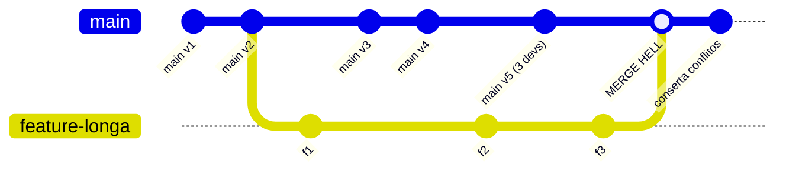
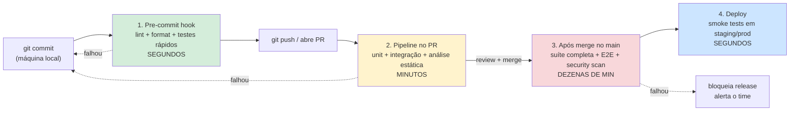
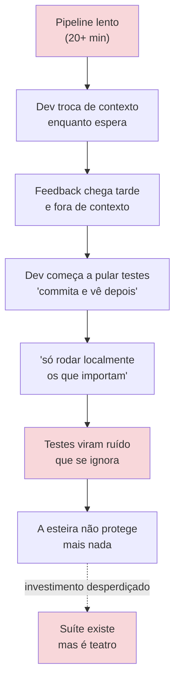
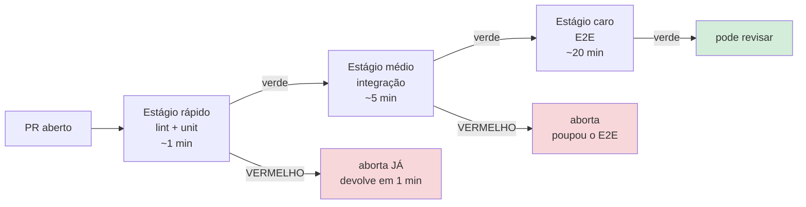
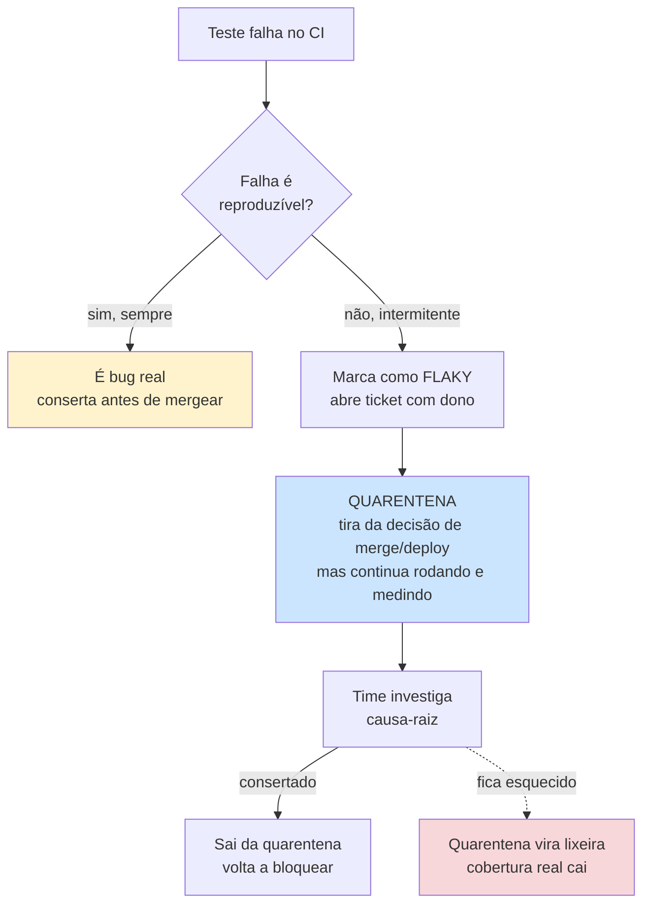
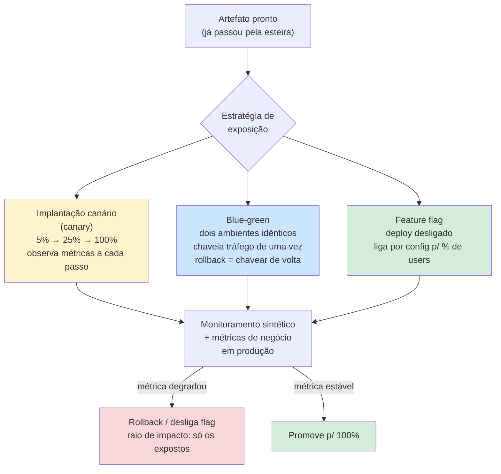

# Testes em CI/CD

> [!abstract] Resumo em uma linha
> Um teste só vale alguma coisa quando roda sozinho, em todo commit — e rápido o bastante pra ninguém querer desligá-lo.

Imagine uma linha de montagem de carros. A carroceria não vai direto da prensa pro showroom: ela passa por postos de inspeção sucessivos. No primeiro posto, um operário confere a solda à mão em segundos. Mais adiante, uma estação automatizada testa a elétrica em minutos. Lá no fim, antes do carro sair, alguém dá uma volta no quarteirão pra ver se anda. Cada posto pega uma classe de defeito, e quanto mais cedo o defeito aparece, mais barato é consertar.

A esteira de CI/CD é exatamente isso pro código. Você tem uma suíte de testes linda — mas se ela só roda quando alguém lembra de digitar `mvn test` na própria máquina, ela não está protegendo nada. O valor do teste não está no arquivo `.java` que o contém; está em *rodar automaticamente, em todo commit, antes que o defeito chegue em quem não devia*.

Essa é a tese desta nota: **testes só entregam valor quando estão na esteira**. O resto é detalhe de como manter essa esteira rápida, confiável e com dentes.

## O que "CI" realmente significa

Aqui mora o mal-entendido mais comum da indústria. Pergunte a dez devs o que é Continuous Integration e nove vão responder: "é ter um pipeline no GitHub Actions". Errado — ou, no máximo, metade da história. Ter um pipeline é a *ferramenta*; CI é a *prática*. Você pode ter o pipeline mais lindo do mundo rodando em cima de uma branch que ficou três semanas sem ver o `main`, e isso não é integração contínua de jeito nenhum.

Martin Fowler é cirúrgico aqui. Para ele, CI é uma prática em que **cada dev integra seu trabalho na mainline com frequência — idealmente todo dia, no mínimo**. O "integrar" é o verbo que importa: trazer seu código pra linha principal e provar, com a suíte verde, que ele convive com o de todo mundo. O pipeline é só o mecanismo que executa essa prova automaticamente. Sem a frequência de integração, o pipeline está verificando uma ilusão de integração que não aconteceu.

Os três testes que Fowler usa pra saber se um time *de fato* faz CI são reveladores: (1) todo mundo empurra pra `main`/trunk diariamente, **não** pra feature branches de vida longa? (2) todo commit dispara a suíte? (3) quando o build quebra, ele é consertado em ~10 minutos? Repare que dois dos três critérios são sobre *comportamento humano*, não sobre tooling.

> [!warning] O mito do "temos CI porque temos pipeline"
> Ter um YAML de pipeline não é fazer integração contínua. GoCD cunhou o termo *CI Theatre* pra isso: o time roda testes a cada push, sente que "faz CI", mas integra na mainline a cada duas semanas via PRs gigantes. A ferramenta está lá; a prática, não. CI é uma prática de *frequência de integração* — o pipeline só automatiza a verificação dela. Se você integra raramente, você não faz CI, faz teatro de CI.

### Trunk-based × feature branches de vida longa

A consequência prática disso é a guerra entre dois modelos de branching. No **desenvolvimento baseado em tronco** (*trunk-based development*), todo mundo commita numa única linha principal várias vezes ao dia; branches, quando existem, vivem horas, não semanas. No modelo de **feature branches longas**, cada feature mora isolada por dias ou semanas e só volta pro `main` no fim — o famoso *merge hell*.

A diferença não é estética. Quanto mais tempo um galho fica separado do tronco, mais o tronco anda sem ele, e maior o delta a reconciliar no merge. O esforço de integração não cresce linear com o tempo — cresce com o *quadrado* dele, porque conflitos interagem entre si. Integrar diariamente mantém cada delta pequeno e barato; segurar duas semanas transforma o merge num evento de risco que ninguém quer fazer numa sexta-feira.

**Leitura do diagrama:** enquanto a `feature-longa` evoluiu sozinha em três commits, o `main` avançou cinco vezes com o trabalho de vários devs. O merge no fim (o nó "MERGE HELL") tem que reconciliar todo esse delta de uma vez — e o commit seguinte é só consertar o estrago. No trunk-based, cada um daqueles `f1`, `f2`, `f3` teria ido direto pro `main` no mesmo dia, e nunca existiria um delta grande pra reconciliar. A pesquisa do *State of DevOps* (DORA) associa trunk-based development a maior throughput e mais estabilidade — não é preferência de gosto, é o que os dados de alto desempenho mostram.

> [!tip] Como conciliar trunk-based com features incompletas
> "Mas como faço CI diário se a feature não está pronta?" Com [[13 - Além do básico - property-based, snapshot, contract, smoke|feature flags]]: você integra o código no `main` todo dia, mas mantém a feature *desligada* por configuração até estar pronta. Deploy desacopla de release. Isso é o que permite trunk-based sem expor coisa pela metade.

## A esteira por estágios

Não dá pra rodar tudo o tempo todo. Uma suíte E2E completa pode levar 40 minutos; rodar isso a cada `git commit` local seria insuportável. A solução, como Martin Fowler descreve no [pipeline de implantação](https://martinfowler.com/articles/continuousIntegration.html), é **quebrar a verificação em estágios**: os primeiros são rápidos e pegam a maioria dos problemas; os últimos são lentos mas mais minuciosos.

Essa ideia tem nome e autores: o **pipeline de implantação** (*deployment pipeline*), de Jez Humble e David Farley em *Continuous Delivery*. A metáfora central é elegante: cada estágio é um **portão de confiança crescente**. O artefato entra cru no primeiro portão e, a cada teste de aptidão que passa, a confiança nele sobe — e por isso o time fica disposto a gastar mais recursos e ambientes mais parecidos com produção pra testá-lo. Confiança baixa no começo (ambiente barato, teste rápido); confiança alta no fim (ambiente igual ao de produção, teste minucioso).

Dois princípios de Humble & Farley são fáceis de esquecer e caros de violar. O primeiro: **build uma vez, promova o mesmo artefato**. Você compila e empacota *uma* vez, no início, e é exatamente *aquele binário* que atravessa todos os estágios — staging, homologação, produção. Recompilar por ambiente é convidar o "na minha máquina funciona" pra dentro do pipeline: você estaria testando um artefato em staging e *deployando outro* em prod. O segundo: **fail fast no estágio mais barato**. Se algo vai reprovar, que reprove no commit/unit, que custa segundos, e não no E2E, que custa meia hora.

São quatro postos de inspeção, cada um com um trade-off diferente entre velocidade, profundidade e momento.

**Leitura do diagrama:** quanto mais à esquerda, mais rápido e mais frequente — o pre-commit roda em todo commit e custa segundos. Quanto mais à direita, mais lento, mais caro e mais raro — o E2E completo só roda depois do merge. As setas pontilhadas de volta são o *fail fast*: se um estágio cedo falha, você nem chega a gastar os estágios caros.

> [!note] Estágio 1 — Pre-commit hook (segundos)
> Roda na sua máquina, antes do commit existir. Linter, formatador automático e os testes mais rápidos (uns poucos unit que cobrem o que você acabou de tocar). É a primeira inspeção, à mão. Tem que ser *instantâneo*, senão você desativa o hook na primeira vez que ele te atrasar. Ferramentas: Husky/lint-staged no front, Spotless/pre-commit no back.

> [!note] Estágio 2 — Pipeline no PR (minutos)
> Roda no servidor de CI quando você abre/atualiza o Pull Request. Suíte unit completa, testes de [[07 - Testes de integração]] e análise estática (SonarQube, type-check, security lint). É o posto que decide se o PR pode ser revisado. Tem que caber na regra dos dez minutos do Fowler — passar disso e as pessoas começam a fazer outra coisa enquanto esperam, perdendo o feedback rápido.

> [!note] Estágio 3 — Após merge no main (dezenas de minutos)
> Aqui rodam os testes caros que não cabem no PR: suíte E2E completa, testes de carga, security scan profundo (SCA/DAST). Como já passou pelo PR, a probabilidade de quebrar é baixa — mas se quebrar, o main está vermelho e isso é prioridade número um do time. Muitas equipes empurram a parte mais pesada pra uma execução *nightly*.

> [!note] Estágio 4 — Deploy (segundos)
> Depois que o artefato sobe pra staging ou produção, um punhado de [[13 - Além do básico - property-based, snapshot, contract, smoke|smoke tests]] confere se o sistema *liga*: a home responde 200? o health check passa? o login funciona? Não é cobertura — é detecção de catástrofe. Se o smoke falha em prod, o rollback é automático.

| Estágio | O que roda | Quando | Tempo-alvo |
|---|---|---|---|
| 1. Pre-commit | lint, format, unit rápido | todo commit local | < 10 s |
| 2. PR | unit completo, integração, análise estática | abrir/atualizar PR | < 10 min |
| 3. Pós-merge / nightly | E2E, carga, security scan | merge no main | < 30-40 min |
| 4. Deploy | smoke tests | após deploy | segundos |

> [!tip] A pergunta de calibração
> "Quão caro é esse teste, e quão cedo eu preciso saber que ele falhou?" Teste barato e crítico → o mais cedo possível. Teste caro e raro de quebrar → o mais tarde possível. Essa única pergunta resolve a maioria das decisões de *onde* colocar cada teste na esteira.

## Rapidez é requisito, não luxo

Fowler é direto: *"nada suga mais o sangue da integração contínua do que um build que demora."* Por quê? Porque o ser humano que espera 25 minutos por um pipeline aprende, em poucos dias, a não esperar. Ele abre outra branch, troca de contexto, e quando o build vermelho volta ele já esqueceu o que fez. O feedback rápido — a razão de existir do CI — evaporou.

E tem um efeito pior, quase psicológico:

**Leitura do diagrama:** a lentidão não causa só atraso — causa *abandono*. Um pipeline lento treina o time a contornar os testes, e a partir daí a suíte vira decoração. Velocidade não é uma otimização opcional; é o que mantém a esteira viva.

Como manter rápido? As alavancas, da mais barata pra mais cirúrgica:

- **Paralelização.** Rodar testes em várias threads/máquinas ao mesmo tempo. JUnit 5 tem execução paralela (`junit.jupiter.execution.parallel.enabled`), Jest e Vitest paralelizam por padrão por arquivo. Exige testes independentes — testes que compartilham estado global brigam entre si.
- **Test splitting / sharding.** Dividir a suíte em N pedaços e rodar cada pedaço numa máquina separada do CI. 800 testes em 4 shards ≈ 4× mais rápido (na teoria).
- **Ordenar os rápidos primeiro.** Se um unit de 5 ms vai quebrar, deixe ele quebrar *antes* do E2E de 30 s começar. Falha cedo = ciclo curto.
- **Cache de dependências.** Não baixar o mundo (Maven, npm, Gradle) em todo run. O cache de dependências do CI costuma cortar minutos.
- **Test impact analysis.** Rodar só os testes *afetados* pelo diff. Se você mexeu num módulo de pagamento, por que rodar os testes de relatório? Ferramentas comerciais (e o `--changed` do Vitest) fazem isso. É a alavanca mais poderosa e a mais difícil de acertar.

> [!warning] Fail fast
> A regra é: o pipeline deve te dizer que você errou *o mais rápido possível*. Isso significa colocar os testes rápidos e os que mais quebram na frente, e configurar o CI pra abortar no primeiro estágio que falha — não gastar 30 minutos de E2E quando um lint já reprovou o PR.

**Leitura do diagrama:** o pipeline não roda tudo em bloco. Ele encadeia estágios do mais barato pro mais caro, e qualquer reprovação corta a fila ali mesmo. Se o lint reprova, você recebe a notícia em um minuto, não em vinte e seis.

### Quando a suíte fica grande demais: seleção de teste

As alavancas acima escalam até um ponto. Numa suíte com 50 mil testes — pense num monorepo de uma empresa grande — nem paralelizar em 100 máquinas te dá feedback em dez minutos. A pergunta muda de "como rodo tudo mais rápido?" pra "**por que estou rodando tudo?**". Se eu mexi numa linha do módulo de pagamento, qual o sentido de reexecutar os testes do módulo de relatório, que não tocam nada do que mudei?

Essa é a ideia da **análise de impacto de teste** (*test impact analysis*, TIA): a partir do diff, descobrir quais testes são *afetados* pela mudança e rodar só eles. Como Fowler descreve, isso depende de saber o **grafo de dependências** do código — quais testes exercitam quais módulos. A versão determinística mapeia cobertura: "este teste tocou esta linha, logo se a linha mudou o teste é candidato". Em monorepos, ferramentas como o Nx ou o Bazel (Google) constroem um grafo dirigido de pacotes: se você muda o pacote A, e B e C dependem de A, roda-se A, B e C — mas não D, E, F.

Há uma variante mais nova, **seleção preditiva de teste** (*predictive test selection*, PTS), que Meta e Google usam internamente: em vez de mapear cobertura de forma determinística, um modelo de ML treinado no histórico de execuções estima a *probabilidade* de cada teste falhar dado este diff, e roda só os de risco alto. A vantagem é pegar dependências cruzadas que a cobertura pura não enxerga; na prática os dois compõem bem — TIA pra delimitar o conjunto candidato, PTS pra ranquear e cortar.

> [!warning] O trade-off honesto da seleção de teste
> TIA e PTS são apostas estatísticas, não garantias. Se o grafo de dependências está incompleto (reflexão, injeção dinâmica, config externa, efeitos colaterais via banco), você pode *pular um teste que era relevante* e deixar passar um bug que a suíte completa pegaria. Por isso o padrão maduro é híbrido: seleção no PR, pra feedback rápido; suíte **completa** no `main` ou no nightly, como rede de segurança. Você troca um pouco de garantia por muito tempo de feedback — mas mantém uma execução completa em algum ponto da esteira, justamente pra cobrir o que a heurística pulou.

Repare na conexão com a [[02 - A pirâmide de testes e suas variações|pirâmide]]: TIA brilha na base (unit, com fronteiras de dependência claras) e é traiçoeira no topo (E2E, onde um clique mexe em meio sistema). É mais uma razão pra base ser larga — testes pequenos e isolados são exatamente os que a seleção consegue mapear com confiança.

## A pirâmide na esteira

A [[02 - A pirâmide de testes e suas variações|pirâmide de testes]] não é só sobre *quantos* testes de cada tipo escrever — ela mapeia diretamente em *quando* cada tipo roda na esteira.

- **Base (unit):** muitos, rápidos, baratos. Rodam *cedo e sempre* — pre-commit e PR. São o grosso da inspeção.
- **Meio (integração):** menos, mais lentos. Rodam no PR, mas já contam pra o tempo do estágio.
- **Topo (E2E):** poucos, lentos, frágeis. Caros demais pra rodar em todo PR — vão pro main ou pro nightly.

> [!example] O cone de sorvete na esteira
> Quando a pirâmide está invertida (muito E2E, pouco unit), a esteira sofre exatamente onde dói: os testes lentos e frágeis dominam, o pipeline arrasta, e o time começa a contorná-lo. A forma da pirâmide e a saúde da esteira são o mesmo problema visto de dois ângulos.

## Flaky na esteira

Um teste [[11 - Testes flaky|flaky]] é aquele que passa e falha sem nenhuma mudança no código. Na esteira, ele é veneno: corrói a confiança. Quando o build fica vermelho e a primeira reação do time é *"ah, deve ser flaky, manda rodar de novo"*, você perdeu — porque na próxima vez que for um bug *de verdade*, a reação vai ser a mesma. O build verde precisa significar algo.

**Leitura do diagrama:** ao primeiro sinal de intermitência, o teste sai do caminho crítico (quarentena) mas *não* desaparece — ele continua rodando pra você medir a taxa de falha, e ganha um dono e um ticket. A seta pontilhada é a armadilha: se a quarentena não tem prazo, vira uma lixeira onde testes morrem e a cobertura real despenca sem ninguém perceber.

Sobre **retry** — é a estratégia mais tentadora e a mais perigosa:

> [!danger] Retry mascara, não cura
> Reexecutar um teste que falhou *mantém o CI verde, mas esconde o problema*. Times que dependem só de retry veem a flakiness *crescer*, porque ninguém investiga a causa-raiz. A regra de ouro (Harness, GitLab): **use retry pra desbloquear, não pra fechar o ticket**. O retry te tira do bloqueio agora; o ticket de causa-raiz é que resolve. Um estudo industrial estima que flaky tests consomem ~2,5% do tempo produtivo dos devs — não é ruído desprezível.

Os quatro pilares de quem leva flaky a sério: **Detectar** (medir taxa de falha por teste no histórico do CI; investigar acima de ~2%), **Notificar** (cada teste tem dono; alerta quando passa do limite), **Triar** (capturar artefatos em toda falha, reproduzir com retry desligado) e **Quarentenar** enquanto conserta.

## Quality gates — e quando eles mentem

Uma **porta de qualidade** (*quality gate*) é uma condição que o pipeline impõe pra deixar o código passar: cobertura mínima, *mutation score* mínimo, zero vulnerabilidades críticas, zero issues bloqueantes no SonarQube. É o mecanismo que dá *dentes* à esteira — sem gate, os testes rodam mas não impedem nada.

O problema é que gate é uma métrica, e métrica vira alvo (Lei de Goodhart). O exemplo clássico é exigir **cobertura de 100%**:

> [!warning] Coverage theater
> Cobertura mede quais linhas *executaram*, não quais foram *verificadas*. Um gate de coverage cego incentiva testes que chamam o código e não asseguram nada — *theater*. O time bate a meta e a suíte continua deixando bugs passar. Por isso [[12 - Coverage e mutation testing|mutation testing]] é o complemento honesto: ele mede se os testes de fato *pegam* defeitos, não só se tocam as linhas. Um gate de *mutation score* é muito mais difícil de fraudar do que um gate de coverage.

Gates úteis tendem a ser: **não deixar a cobertura cair** (delta, não absoluto), **mutation score mínimo nos módulos críticos**, **zero CVE crítico** no scan de dependências. Gates contraproducentes: **coverage absoluto alto e uniforme** (vira theater) e **qualquer gate que o time aprendeu a contornar**.

## Não ignore os warnings

Um detalhe que separa esteira séria de esteira decorativa: **warnings de lint e de tipos no CI não são ignoráveis**. Se o build passa com 200 warnings de TypeScript ou de compilador, esses 200 warnings são ruído onde o 201º — que é um bug real — vai se esconder. A regra é tratar warnings novos como falha (ou ao menos travar a contagem pra não crescer). O build verde tem que significar *"está tudo certo"*, não *"está tudo certo, fora aquelas coisas que a gente convencionou ignorar"*.

> [!example] No MedEspecialista
> No MedEspecialista, o stack padrão de testes é JUnit 5 + AssertJ + Mockito + Testcontainers. O CI/CD roda no GitHub Actions e executa tudo em paralelo — a suíte de ~800 testes leva cerca de 3 minutos. A regra do time é simples e inegociável: **PR sem teste não é revisado**.
>
> Esses 3 minutos não são sorte; são consequência de paralelizar. Sem paralelização, 800 testes (vários subindo containers via Testcontainers) levariam muito mais, e aí a pressão pra "pular o teste nesse PR" cresce. Manter rápido é o que permite manter a regra de PR. As duas coisas se sustentam: a esteira é rápida *porque* paraleliza, e o teste é parte do contrato de PR *porque* a esteira é rápida o bastante pra isso não doer. (Mais sobre o ferramental em [[Testes em Java]].)

## O orçamento de tempo do build

Vale tratar isso como o que é: um **orçamento**, com um número. A regra prática que vem do Fowler é que o feedback do PR deve chegar em **menos de dez minutos**. Por que dez? Não é mágico — é o limite empírico abaixo do qual o dev *fica esperando* o resultado em vez de trocar de contexto. Passou disso, ele abre outra branch, e o feedback chega fora de contexto, valendo metade. Dez minutos é o ponto em que o ciclo de CI continua sendo um *ciclo*, e não uma notificação que te interrompe mais tarde.

O orçamento é finito e a suíte só cresce. Então cada minuto novo gasta de um cofre que esvazia. Quando a suíte estoura os dez minutos, a sequência de respostas é mais ou menos esta, da mais barata pra mais estrutural:

1. **Paralelizar e fazer sharding** — primeira alavanca, já discutida. Comprar máquinas é mais barato que reescrever testes.
2. **Mover o caro pra fora do PR** — E2E e carga vão pro nightly ou pro pós-merge; o PR fica só com o que dá feedback rápido (unit, integração leve).
3. **Seleção de teste (TIA/PTS)** — quando nem o sharding salva, rodar só o afetado no PR e a suíte completa no `main`.
4. **Rebalancear a pirâmide** — se o gargalo é E2E demais, o problema não é o CI, é a [[02 - A pirâmide de testes e suas variações|forma da pirâmide]]. Esteira lenta crônica costuma ser um cone de sorvete pedindo socorro: mova cobertura pra baixo, pra unit e integração rápidas.

Repare que (4) fecha o círculo com a pirâmide: o orçamento de tempo do build e o formato da suíte são **a mesma restrição vista de dois ângulos**. Você não consegue manter dez minutos com uma suíte top-heavy, e não consegue ter uma pirâmide saudável sem que ela caiba no orçamento. Otimizar CI sem olhar a pirâmide é enxugar gelo.

## Testar em produção (shift-right)

Há uma verdade incômoda: **nem todo defeito dá pra pegar antes do deploy**. Tráfego real, dados reais em volume real, a combinação específica de configs do ambiente de produção, condições de carga que nenhum teste sintético reproduz fielmente — essas coisas só aparecem *em produção*. Todo o esforço desta nota foi *shift-left*: empurrar a detecção pra mais cedo, pra mais barato. Mas existe o complemento, o *shift-right*: detectar e conter defeitos *depois* do deploy, em produção, com baixo risco. Os dois não competem; se completam. Shift-left pega o que dá pra pegar barato; shift-right cobre o que só a realidade revela.

A chave do shift-right é **limitar o raio de impacto** (*blast radius*) de uma mudança ruim. Em vez de soltar a nova versão pra 100% dos usuários e rezar, você expõe aos poucos e observa. É a ideia da **entrega progressiva** (*progressive delivery*), e ela tem algumas formas:

**Leitura do diagrama:** o artefato que saiu da esteira não vai direto pra todos. A **implantação canário** solta pra uma fração (tipo 5%) e sobe degrau a degrau só se as métricas seguram; o **blue-green** mantém dois ambientes idênticos e chaveia o tráfego de um pro outro (rollback é chavear de volta, instantâneo); a **feature flag** deploya o código desligado e liga por configuração pra uma fatia de usuários. Os três desembocam no mesmo lugar: você **observa produção** — e aqui entram os smoke/[[13 - Além do básico - property-based, snapshot, contract, smoke|synthetic tests]] rodando contra prod de verdade, mais métricas de negócio. Se algo degrada, o rollback atinge só quem foi exposto; se segura, promove pra 100%.

O **monitoramento sintético** (*synthetic monitoring*) é o teste que não para no deploy: scripts que exercitam os caminhos críticos em produção continuamente — faz login, busca um produto, finaliza um pedido — e disparam alerta se algum quebra. É a fronteira onde "teste" e "observabilidade" se encontram: o mesmo smoke test do estágio 4 da esteira, agora rodando em loop contra prod, vira sensor de saúde.

> [!tip] Shift-left e shift-right não são rivais
> Não é "ou testo antes ou testo depois". O time maduro faz os dois: uma esteira rápida e densa que pega o barato cedo (shift-left), *e* entrega progressiva com observabilidade que contém o que escapou (shift-right). Quem só faz shift-left acha que CI verde = produção segura, e toma susto. Quem só faz shift-right transforma os usuários em suíte de teste. O equilíbrio é a esteira filtrar o máximo barato, e a produção ser instrumentada pra que o que passar tenha raio de impacto pequeno e rollback rápido.

## O ângulo arquitetural

Vale lembrar que a velocidade da esteira não depende só do CI — depende de quão testável é o código. Um sistema bem desenhado (ver [[Arquitetura de Software]]), com dependências invertidas e camadas isoladas, permite testar a lógica de negócio sem subir banco nem rede, e isso é o que mantém a base da pirâmide rápida. Esteira lenta é, muitas vezes, sintoma de acoplamento — você é *forçado* a integração/E2E porque não consegue testar nada em isolamento.

## Em entrevista

Talk about CI/CD as where testing actually delivers value, not as an afterthought. **"A test only protects you if it runs automatically on every commit — a suite that runs only when someone remembers to run it locally protects nothing."** Be ready to correct the most common misconception: **CI is not "having a pipeline" — it's the practice of integrating into the mainline frequently, ideally daily, with a green suite proving the integration is safe.** That's why I favor **trunk-based development over long-lived feature branches**: small daily merges avoid the merge hell you get when a branch drifts from `main` for weeks. Explain the staged pipeline: fast pre-commit hooks in seconds, unit and integration on the PR in minutes, expensive E2E and security scans after merge or nightly. Stress that **fast feedback is a requirement, not a luxury** — a slow pipeline trains the team to bypass tests, so the suite becomes theater. Mention concrete levers: parallelization, sharding, dependency caching, and running only the impacted tests. **When a suite gets too large to fit the ten-minute budget, I reach for test impact analysis — running only the tests affected by the diff via the dependency graph — while keeping a full run on `main` as the safety net for whatever the heuristic skipped.** Add that not everything can be caught before deploy: **I pair shift-left with shift-right — canary or blue-green rollouts, feature flags, and synthetic monitoring testing in production — so the blast radius of a bad change stays small and rollback is fast.** On flaky tests, say you **quarantine and assign an owner rather than blindly retry**, because retries keep the build green while hiding the rot. On quality gates, note that a blind 100% coverage gate becomes coverage theater, and that **mutation score is a far harder gate to game.** Close with the contract idea: in my current team, a PR without tests isn't reviewed, and the ~800-test suite runs in about three minutes precisely because it runs in parallel.

### Vocabulário

| Português | English |
|---|---|
| integração contínua | continuous integration |
| entrega contínua | continuous delivery |
| esteira / pipeline | pipeline |
| desenvolvimento baseado em tronco | trunk-based development |
| pipeline de implantação | deployment pipeline |
| análise de impacto de teste | test impact analysis |
| seleção preditiva de teste | predictive test selection |
| entrega progressiva | progressive delivery |
| implantação canário | canary deployment |
| implantação azul-verde | blue-green deployment |
| monitoramento sintético | synthetic monitoring |
| deslocar pra esquerda / direita | shift-left / shift-right |
| raio de impacto | blast radius |
| gancho de pré-commit | pre-commit hook |
| porta de qualidade | quality gate |
| falha rápida | fail fast |
| build vermelho | red build / broken build |
| teste instável | flaky test |
| quarentena | quarantine |
| análise estática | static analysis |
| reexecução / nova tentativa | retry |

> [!info] Lastro
> - Martin Fowler, [*Continuous Integration*](https://martinfowler.com/articles/continuousIntegration.html) — "self-testing code", a regra dos dez minutos, "nada suga mais o sangue do CI do que um build lento", e o pipeline de implantação em estágios (rápido cedo, minucioso depois).
> - Martin Fowler, [*Patterns for Managing Source Code Branches*](https://martinfowler.com/articles/branching-patterns.html) — CI como prática de integrar na mainline com frequência (não como ferramenta); trunk-based × feature branches longas e o custo do atraso de integração.
> - GoCD, [*It's not CI, it's just CI Theatre*](https://www.gocd.org/2017/05/16/its-not-CI-its-CI-theatre.html) — os três testes do CI de verdade (integra diário na trunk? todo commit roda a suíte? build quebrado conserta em 10 min?) e o mito do "temos pipeline logo fazemos CI".
> - Jez Humble & David Farley, *Continuous Delivery* (Addison-Wesley, 2010) — o *deployment pipeline*: estágios como portões de confiança crescente, *build uma vez e promova o mesmo artefato*, *fail fast* no estágio mais barato; ambientes progressivamente mais parecidos com produção.
> - Martin Fowler, [*The Rise of Test Impact Analysis*](https://martinfowler.com/articles/rise-test-impact-analysis.html) e CloudBees, [*Predictive Test Selection vs. Test Impact Analysis*](https://www.cloudbees.com/blog/predictive-test-selection-vs-test-impact-analysis) — TIA determinística por grafo de dependência/cobertura, PTS probabilística por ML (Meta/Google), e o trade-off de pular um teste relevante.
> - Octopus Deploy, [*Blue/green Versus Canary Deployments*](https://octopus.com/devops/software-deployments/blue-green-vs-canary-deployments/) e Unleash, [*Blue-green deployment vs progressive delivery*](https://www.getunleash.io/blog/blue-green-deployment-vs-progressive-delivery) — entrega progressiva, canário, blue-green, feature flags e raio de impacto como o complemento *shift-right* do *shift-left*.
> - Harness, [*Flaky Tests: How to Find, Fix, and Prevent Them*](https://www.harness.io/blog/flaky-tests-the-quiet-killer-of-productivity-in-your-ci-pipeline) e [GitLab Docs — Unhealthy tests](https://docs.gitlab.com/development/testing_guide/unhealthy_tests/) — quarentena, retry que mascara causa-raiz, e o custo de ~2,5% de produtividade dos flaky tests.

## Veja também

- [[02 - A pirâmide de testes e suas variações]] — a forma da pirâmide define *quando* cada teste roda na esteira.
- [[07 - Testes de integração]] — o estágio do PR depende deles; Testcontainers é o ferramental.
- [[11 - Testes flaky]] — o veneno da confiança na esteira; detecção, quarentena e retry.
- [[12 - Coverage e mutation testing]] — as métricas que viram quality gates (e quando viram theater).
- [[13 - Além do básico - property-based, snapshot, contract, smoke]] — smoke tests são o último estágio, no deploy.
- [[16 - Estratégia de testes em entrevista]] — como amarrar tudo isso numa resposta de entrevista.
- [[03-Dominios/Engenharia/Testes/index|Testes]] — índice do galho.
