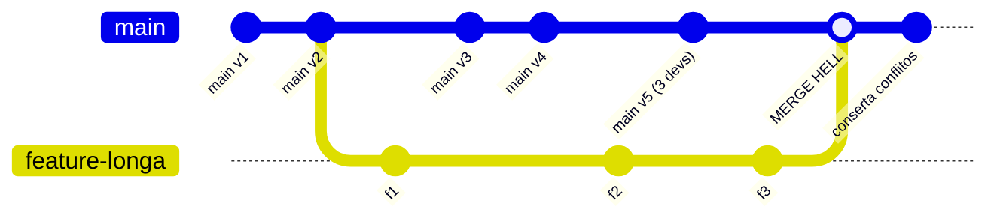
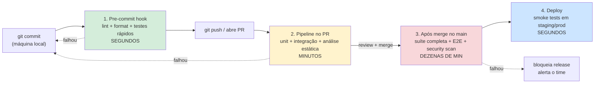
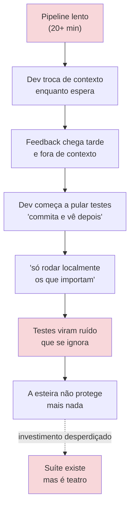
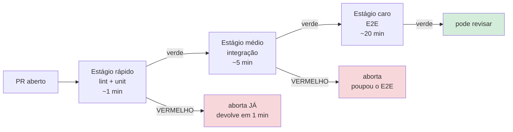
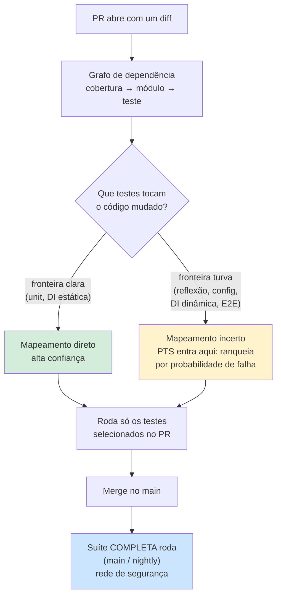
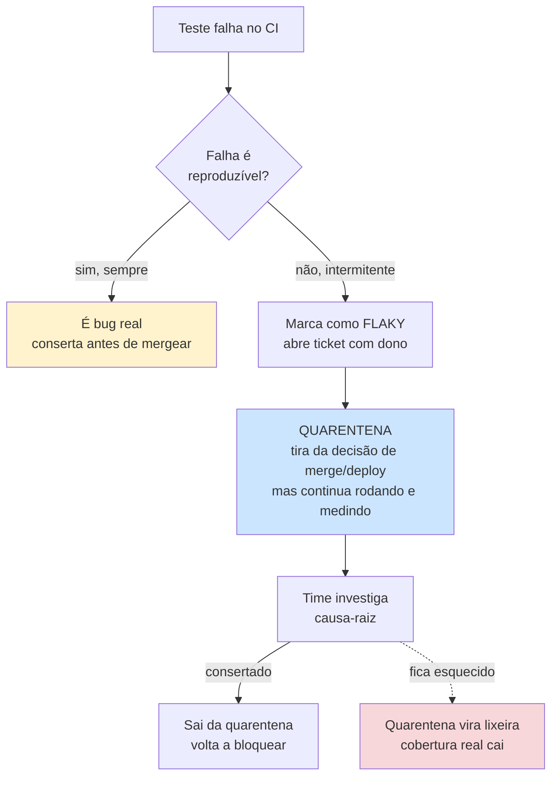
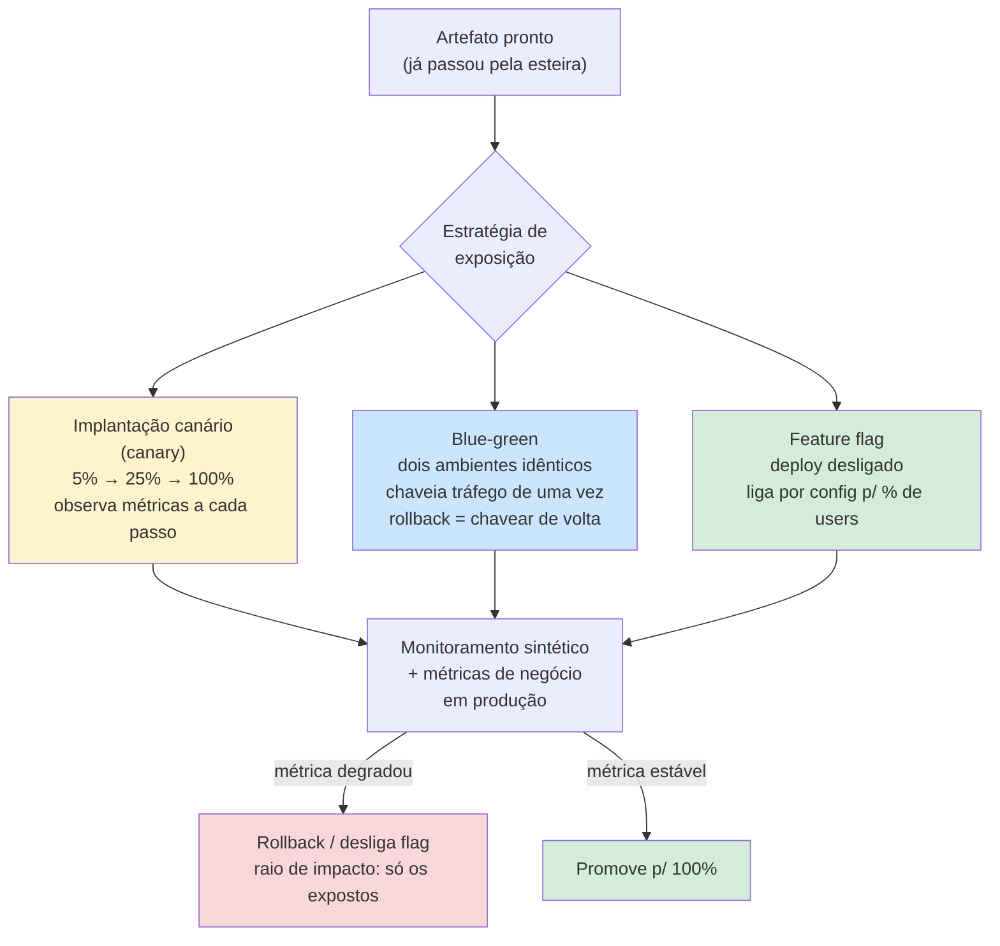
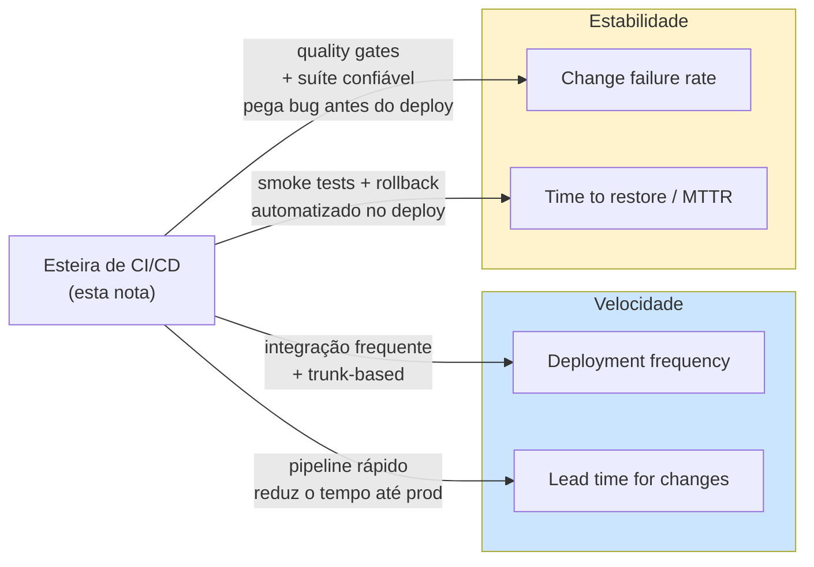

# Testes em CI/CD

> [!abstract] Resumo
> Um teste só vale alguma coisa quando roda sozinho, em todo commit, dentro da esteira — não quando alguém lembra de digitar `mvn test` na própria máquina. A tese desta nota é essa: **teste sem esteira é teatro**, por melhor que a suíte em si seja. CI não é sinônimo de "ter um pipeline no GitHub Actions". Pipeline é a *ferramenta*; integração contínua é a *prática* de integrar na mainline com frequência — idealmente todo dia — e provar, com a suíte verde, que o código convive com o resto do time. Um YAML bonito rodando sobre uma branch de três semanas não é CI; é *CI Theatre*. E isso tudo tem um orçamento: o feedback do PR precisa chegar em menos de dez minutos, o limite empírico abaixo do qual o dev espera em vez de trocar de contexto. Estourar esse orçamento não é só lentidão — é o que transforma a esteira, aos poucos, em decoração que ninguém mais confia.

Imagine uma linha de montagem de carros. A carroceria não vai direto da prensa pro showroom: ela passa por postos de inspeção sucessivos. No primeiro posto, um operário confere a solda à mão em segundos. Mais adiante, uma estação automatizada testa a elétrica em minutos. Lá no fim, antes do carro sair, alguém dá uma volta no quarteirão pra ver se anda. Cada posto pega uma classe de defeito, e quanto mais cedo o defeito aparece, mais barato é consertar.

A esteira de CI/CD é exatamente isso pro código. Você tem uma suíte de testes linda — mas se ela só roda quando alguém lembra de digitar `mvn test` na própria máquina, ela não está protegendo nada. O valor do teste não está no arquivo `.java` que o contém; está em *rodar automaticamente, em todo commit, antes que o defeito chegue em quem não devia*.

Essa é a tese desta nota: **testes só entregam valor quando estão na esteira**. O resto é detalhe de como manter essa esteira rápida, confiável e com dentes.

## O que "CI" realmente significa

Aqui mora o mal-entendido mais comum da indústria. Pergunte a dez devs o que é Continuous Integration e nove vão responder: "é ter um pipeline no GitHub Actions". Errado — ou, no máximo, metade da história. Ter um pipeline é a *ferramenta*; CI é a *prática*. Você pode ter o pipeline mais lindo do mundo rodando em cima de uma branch que ficou três semanas sem ver o `main`, e isso não é integração contínua de jeito nenhum.

Martin Fowler é cirúrgico aqui. Para ele, CI é uma prática em que **cada dev integra seu trabalho na mainline com frequência — idealmente todo dia, no mínimo**. O "integrar" é o verbo que importa: trazer seu código pra linha principal e provar, com a suíte verde, que ele convive com o de todo mundo. O pipeline é só o mecanismo que executa essa prova automaticamente. Sem a frequência de integração, o pipeline está verificando uma ilusão de integração que não aconteceu.

Os três testes que Fowler usa pra saber se um time *de fato* faz CI são reveladores: (1) todo mundo empurra pra `main`/trunk diariamente, **não** pra feature branches de vida longa? (2) todo commit dispara a suíte? (3) quando o build quebra, ele é consertado em ~10 minutos? Repare que dois dos três critérios são sobre *comportamento humano*, não sobre tooling.

### Trunk-based × feature branches de vida longa

A consequência prática disso é a guerra entre dois modelos de branching. No **desenvolvimento baseado em tronco** (*trunk-based development*), todo mundo commita numa única linha principal várias vezes ao dia; branches, quando existem, vivem horas, não semanas. No modelo de **feature branches longas**, cada feature mora isolada por dias ou semanas e só volta pro `main` no fim — o famoso *merge hell*.

A diferença não é estética. Quanto mais tempo um galho fica separado do tronco, mais o tronco anda sem ele, e maior o delta a reconciliar no merge. O esforço de integração não cresce linear com o tempo — cresce com o *quadrado* dele, porque conflitos interagem entre si. Integrar diariamente mantém cada delta pequeno e barato; segurar duas semanas transforma o merge num evento de risco que ninguém quer fazer numa sexta-feira.



**Leitura do diagrama:** enquanto a `feature-longa` evoluiu sozinha em três commits, o `main` avançou cinco vezes com o trabalho de vários devs. O merge no fim (o nó "MERGE HELL") tem que reconciliar todo esse delta de uma vez — e o commit seguinte é só consertar o estrago. No trunk-based, cada um daqueles `f1`, `f2`, `f3` teria ido direto pro `main` no mesmo dia, e nunca existiria um delta grande pra reconciliar. A pesquisa do *State of DevOps* (DORA) associa trunk-based development a maior throughput e mais estabilidade — não é preferência de gosto, é o que os dados de alto desempenho mostram.

> [!tip] Como conciliar trunk-based com features incompletas
> "Mas como faço CI diário se a feature não está pronta?" Com [[13 - Além do básico - property-based, snapshot, contract, smoke|feature flags]]: você integra o código no `main` todo dia, mas mantém a feature *desligada* por configuração até estar pronta. Deploy desacopla de release. Isso é o que permite trunk-based sem expor coisa pela metade.

## A esteira por estágios

Não dá pra rodar tudo o tempo todo. Uma suíte E2E completa pode levar 40 minutos; rodar isso a cada `git commit` local seria insuportável. A solução, como Martin Fowler descreve no [pipeline de implantação](https://martinfowler.com/articles/continuousIntegration.html), é **quebrar a verificação em estágios**: os primeiros são rápidos e pegam a maioria dos problemas; os últimos são lentos mas mais minuciosos.

Essa ideia tem nome e autores: o **pipeline de implantação** (*deployment pipeline*), de Jez Humble e David Farley em *Continuous Delivery*. A metáfora central é elegante: cada estágio é um **portão de confiança crescente**. O artefato entra cru no primeiro portão e, a cada teste de aptidão que passa, a confiança nele sobe — e por isso o time fica disposto a gastar mais recursos e ambientes mais parecidos com produção pra testá-lo. Confiança baixa no começo (ambiente barato, teste rápido); confiança alta no fim (ambiente igual ao de produção, teste minucioso).

Dois princípios de Humble & Farley são fáceis de esquecer e caros de violar. O primeiro: **build uma vez, promova o mesmo artefato**. Você compila e empacota *uma* vez, no início, e é exatamente *aquele binário* que atravessa todos os estágios — staging, homologação, produção. Recompilar por ambiente é convidar o "na minha máquina funciona" pra dentro do pipeline: você estaria testando um artefato em staging e *deployando outro* em prod. O segundo: **fail fast no estágio mais barato**. Se algo vai reprovar, que reprove no commit/unit, que custa segundos, e não no E2E, que custa meia hora.

São quatro postos de inspeção, cada um com um trade-off diferente entre velocidade, profundidade e momento.



**Leitura do diagrama:** quanto mais à esquerda, mais rápido e mais frequente — o pre-commit roda em todo commit e custa segundos. Quanto mais à direita, mais lento, mais caro e mais raro — o E2E completo só roda depois do merge. As setas pontilhadas de volta são o *fail fast*: se um estágio cedo falha, você nem chega a gastar os estágios caros.

> [!note] Estágio 1 — Pre-commit hook (segundos)
> Roda na sua máquina, antes do commit existir. Linter, formatador automático e os testes mais rápidos (uns poucos unit que cobrem o que você acabou de tocar). É a primeira inspeção, à mão. Tem que ser *instantâneo*, senão você desativa o hook na primeira vez que ele te atrasar. Ferramentas: Husky/lint-staged no front, Spotless/pre-commit no back.

> [!note] Estágio 2 — Pipeline no PR (minutos)
> Roda no servidor de CI quando você abre/atualiza o Pull Request. Suíte unit completa, testes de [[07 - Testes de integração]] e análise estática (SonarQube, type-check, security lint). É o posto que decide se o PR pode ser revisado. Tem que caber na regra dos dez minutos do Fowler — passar disso e as pessoas começam a fazer outra coisa enquanto esperam, perdendo o feedback rápido.

> [!note] Estágio 3 — Após merge no main (dezenas de minutos)
> Aqui rodam os testes caros que não cabem no PR: suíte E2E completa, testes de carga, security scan profundo (SCA/DAST). Como já passou pelo PR, a probabilidade de quebrar é baixa — mas se quebrar, o main está vermelho e isso é prioridade número um do time. Muitas equipes empurram a parte mais pesada pra uma execução *nightly*.

> [!note] Estágio 4 — Deploy (segundos)
> Depois que o artefato sobe pra staging ou produção, um punhado de [[13 - Além do básico - property-based, snapshot, contract, smoke|smoke tests]] confere se o sistema *liga*: a home responde 200? o health check passa? o login funciona? Não é cobertura — é detecção de catástrofe. Se o smoke falha em prod, o rollback é automático.

| Estágio | O que roda | Quando | Tempo-alvo |
|---|---|---|---|
| 1. Pre-commit | lint, format, unit rápido | todo commit local | < 10 s |
| 2. PR | unit completo, integração, análise estática | abrir/atualizar PR | < 10 min |
| 3. Pós-merge / nightly | E2E, carga, security scan | merge no main | < 30-40 min |
| 4. Deploy | smoke tests | após deploy | segundos |

> [!tip] A pergunta de calibração
> "Quão caro é esse teste, e quão cedo eu preciso saber que ele falhou?" Teste barato e crítico → o mais cedo possível. Teste caro e raro de quebrar → o mais tarde possível. Essa única pergunta resolve a maioria das decisões de *onde* colocar cada teste na esteira.

## Rapidez é requisito, não luxo

Fowler é direto: *"nada suga mais o sangue da integração contínua do que um build que demora."* Por quê? Porque o ser humano que espera 25 minutos por um pipeline aprende, em poucos dias, a não esperar. Ele abre outra branch, troca de contexto, e quando o build vermelho volta ele já esqueceu o que fez. O feedback rápido — a razão de existir do CI — evaporou.

E tem um efeito pior, quase psicológico:



**Leitura do diagrama:** a lentidão não causa só atraso — causa *abandono*. Um pipeline lento treina o time a contornar os testes, e a partir daí a suíte vira decoração. Velocidade não é uma otimização opcional; é o que mantém a esteira viva.

Como manter rápido? As alavancas, da mais barata pra mais cirúrgica:

- **Paralelização.** Rodar testes em várias threads/máquinas ao mesmo tempo. JUnit 5 tem execução paralela (`junit.jupiter.execution.parallel.enabled`), Jest e Vitest paralelizam por padrão por arquivo. Exige testes independentes — testes que compartilham estado global brigam entre si.
- **Test splitting / sharding.** Dividir a suíte em N pedaços e rodar cada pedaço numa máquina separada do CI. 800 testes em 4 shards ≈ 4× mais rápido (na teoria).
- **Ordenar os rápidos primeiro.** Se um unit de 5 ms vai quebrar, deixe ele quebrar *antes* do E2E de 30 s começar. Falha cedo = ciclo curto.
- **Cache de dependências.** Não baixar o mundo (Maven, npm, Gradle) em todo run. O cache de dependências do CI costuma cortar minutos.
- **Test impact analysis.** Rodar só os testes *afetados* pelo diff. Se você mexeu num módulo de pagamento, por que rodar os testes de relatório? Ferramentas comerciais (e o `--changed` do Vitest) fazem isso. É a alavanca mais poderosa e a mais difícil de acertar.



**Leitura do diagrama:** o pipeline não roda tudo em bloco. Ele encadeia estágios do mais barato pro mais caro, e qualquer reprovação corta a fila ali mesmo. Se o lint reprova, você recebe a notícia em um minuto, não em vinte e seis.

### Quando a suíte fica grande demais: seleção de teste

As alavancas acima escalam até um ponto. Numa suíte com 50 mil testes — pense num monorepo de uma empresa grande — nem paralelizar em 100 máquinas te dá feedback em dez minutos. A pergunta muda de "como rodo tudo mais rápido?" pra "**por que estou rodando tudo?**". Se eu mexi numa linha do módulo de pagamento, qual o sentido de reexecutar os testes do módulo de relatório, que não tocam nada do que mudei?

Essa é a ideia da **análise de impacto de teste** (*test impact analysis*, TIA): a partir do diff, descobrir quais testes são *afetados* pela mudança e rodar só eles. Como Fowler descreve, isso depende de saber o **grafo de dependências** do código — quais testes exercitam quais módulos. A versão determinística mapeia cobertura: "este teste tocou esta linha, logo se a linha mudou o teste é candidato". Em monorepos, ferramentas como o Nx ou o Bazel (Google) constroem um grafo dirigido de pacotes: se você muda o pacote A, e B e C dependem de A, roda-se A, B e C — mas não D, E, F.

Há uma variante mais nova, **seleção preditiva de teste** (*predictive test selection*, PTS), que Meta e Google usam internamente: em vez de mapear cobertura de forma determinística, um modelo de ML treinado no histórico de execuções estima a *probabilidade* de cada teste falhar dado este diff, e roda só os de risco alto. A vantagem é pegar dependências cruzadas que a cobertura pura não enxerga; na prática os dois compõem bem — TIA pra delimitar o conjunto candidato, PTS pra ranquear e cortar.

Repare na conexão com a [[02 - A pirâmide de testes e suas variações|pirâmide]]: TIA brilha na base (unit, com fronteiras de dependência claras) e é traiçoeira no topo (E2E, onde um clique mexe em meio sistema). É mais uma razão pra base ser larga — testes pequenos e isolados são exatamente os que a seleção consegue mapear com confiança.



**Leitura do diagrama:** o diff entra, o grafo de dependência decide quais testes são candidatos, e a confiança nessa decisão varia — alta onde a dependência é estática e explícita, baixa onde é dinâmica (reflexão, injeção de dependência em runtime, configuração externa). É exatamente essa incerteza que a variante preditiva (PTS) tenta compensar com um modelo de risco em vez de um grafo determinístico. Mas repare que o diagrama nunca termina no "roda só o selecionado": depois do merge, a suíte completa roda de qualquer forma, como rede de segurança para o que o mapeamento pulou.

## A pirâmide na esteira

A [[02 - A pirâmide de testes e suas variações|pirâmide de testes]] não é só sobre *quantos* testes de cada tipo escrever — ela mapeia diretamente em *quando* cada tipo roda na esteira.

- **Base (unit):** muitos, rápidos, baratos. Rodam *cedo e sempre* — pre-commit e PR. São o grosso da inspeção.
- **Meio (integração):** menos, mais lentos. Rodam no PR, mas já contam pra o tempo do estágio.
- **Topo (E2E):** poucos, lentos, frágeis. Caros demais pra rodar em todo PR — vão pro main ou pro nightly.

> [!example] O cone de sorvete na esteira
> Quando a pirâmide está invertida (muito E2E, pouco unit), a esteira sofre exatamente onde dói: os testes lentos e frágeis dominam, o pipeline arrasta, e o time começa a contorná-lo. A forma da pirâmide e a saúde da esteira são o mesmo problema visto de dois ângulos.

## Flaky na esteira

Um teste [[11 - Testes flaky|flaky]] é aquele que passa e falha sem nenhuma mudança no código. Na esteira, ele é veneno: corrói a confiança. Quando o build fica vermelho e a primeira reação do time é *"ah, deve ser flaky, manda rodar de novo"*, você perdeu — porque na próxima vez que for um bug *de verdade*, a reação vai ser a mesma. O build verde precisa significar algo.



**Leitura do diagrama:** ao primeiro sinal de intermitência, o teste sai do caminho crítico (quarentena) mas *não* desaparece — ele continua rodando pra você medir a taxa de falha, e ganha um dono e um ticket. A seta pontilhada é a armadilha: se a quarentena não tem prazo, vira uma lixeira onde testes morrem e a cobertura real despenca sem ninguém perceber.

Sobre **retry** — é a estratégia mais tentadora e a mais perigosa; ver [[#Armadilhas comuns|Armadilhas comuns]] adiante.

Os quatro pilares de quem leva flaky a sério: **Detectar** (medir taxa de falha por teste no histórico do CI; investigar acima de ~2%), **Notificar** (cada teste tem dono; alerta quando passa do limite), **Triar** (capturar artefatos em toda falha, reproduzir com retry desligado) e **Quarentenar** enquanto conserta.

A quarentena só funciona se tiver prazo e critério de saída — do contrário ela vira a lixeira do diagrama acima. Na prática, isso costuma tomar forma de **SLA escalonado por severidade**: um teste que bloqueia release e é crítico ganha poucos dias antes de escalar; um teste de baixa severidade e baixa taxa de flake pode esperar semanas. A saída da quarentena, por sua vez, não é "parou de falhar uma vez" — o padrão comum é exigir uma correção de causa-raiz documentada *e* um número mínimo de execuções limpas consecutivas antes de o teste voltar a bloquear merge/deploy. Sem essas duas condições — prazo de entrada e barra de saída —, "quarentena" vira só um eufemismo para "ignorado permanentemente".

## Quality gates — e quando eles mentem

Uma **porta de qualidade** (*quality gate*) é uma condição que o pipeline impõe pra deixar o código passar: cobertura mínima, *mutation score* mínimo, zero vulnerabilidades críticas, zero issues bloqueantes no SonarQube. É o mecanismo que dá *dentes* à esteira — sem gate, os testes rodam mas não impedem nada.

O problema é que gate é uma métrica, e métrica vira alvo (Lei de Goodhart). O exemplo clássico é exigir **cobertura de 100%** — ver *Coverage theater* em [[#Armadilhas comuns|Armadilhas comuns]] adiante.

Gates úteis tendem a ser: **não deixar a cobertura cair** (delta, não absoluto), **mutation score mínimo nos módulos críticos**, **zero CVE crítico** no scan de dependências. Gates contraproducentes: **coverage absoluto alto e uniforme** (vira theater) e **qualquer gate que o time aprendeu a contornar**.

## Não ignore os warnings

Um detalhe que separa esteira séria de esteira decorativa: **warnings de lint e de tipos no CI não são ignoráveis**. Se o build passa com 200 warnings de TypeScript ou de compilador, esses 200 warnings são ruído onde o 201º — que é um bug real — vai se esconder. A regra é tratar warnings novos como falha (ou ao menos travar a contagem pra não crescer). O build verde tem que significar *"está tudo certo"*, não *"está tudo certo, fora aquelas coisas que a gente convencionou ignorar"*.

## O orçamento de tempo do build

Vale tratar isso como o que é: um **orçamento**, com um número. A regra prática que vem do Fowler é que o feedback do PR deve chegar em **menos de dez minutos**. Por que dez? Não é mágico — é o limite empírico abaixo do qual o dev *fica esperando* o resultado em vez de trocar de contexto. Passou disso, ele abre outra branch, e o feedback chega fora de contexto, valendo metade. Dez minutos é o ponto em que o ciclo de CI continua sendo um *ciclo*, e não uma notificação que te interrompe mais tarde.

O orçamento é finito e a suíte só cresce. Então cada minuto novo gasta de um cofre que esvazia. Quando a suíte estoura os dez minutos, a sequência de respostas é mais ou menos esta, da mais barata pra mais estrutural:

1. **Paralelizar e fazer sharding** — primeira alavanca, já discutida. Comprar máquinas é mais barato que reescrever testes.
2. **Mover o caro pra fora do PR** — E2E e carga vão pro nightly ou pro pós-merge; o PR fica só com o que dá feedback rápido (unit, integração leve).
3. **Seleção de teste (TIA/PTS)** — quando nem o sharding salva, rodar só o afetado no PR e a suíte completa no `main`.
4. **Rebalancear a pirâmide** — se o gargalo é E2E demais, o problema não é o CI, é a [[02 - A pirâmide de testes e suas variações|forma da pirâmide]]. Esteira lenta crônica costuma ser um cone de sorvete pedindo socorro: mova cobertura pra baixo, pra unit e integração rápidas.

Repare que (4) fecha o círculo com a pirâmide: o orçamento de tempo do build e o formato da suíte são **a mesma restrição vista de dois ângulos**. Você não consegue manter dez minutos com uma suíte top-heavy, e não consegue ter uma pirâmide saudável sem que ela caiba no orçamento. Otimizar CI sem olhar a pirâmide é enxugar gelo.

## Testar em produção (shift-right)

Há uma verdade incômoda: **nem todo defeito dá pra pegar antes do deploy**. Tráfego real, dados reais em volume real, a combinação específica de configs do ambiente de produção, condições de carga que nenhum teste sintético reproduz fielmente — essas coisas só aparecem *em produção*. Todo o esforço desta nota foi *shift-left*: empurrar a detecção pra mais cedo, pra mais barato. Mas existe o complemento, o *shift-right*: detectar e conter defeitos *depois* do deploy, em produção, com baixo risco. Os dois não competem; se completam. Shift-left pega o que dá pra pegar barato; shift-right cobre o que só a realidade revela.

A chave do shift-right é **limitar o raio de impacto** (*blast radius*) de uma mudança ruim. Em vez de soltar a nova versão pra 100% dos usuários e rezar, você expõe aos poucos e observa. É a ideia da **entrega progressiva** (*progressive delivery*), e ela tem algumas formas:



**Leitura do diagrama:** o artefato que saiu da esteira não vai direto pra todos. A **implantação canário** solta pra uma fração (tipo 5%) e sobe degrau a degrau só se as métricas seguram; o **blue-green** mantém dois ambientes idênticos e chaveia o tráfego de um pro outro (rollback é chavear de volta, instantâneo); a **feature flag** deploya o código desligado e liga por configuração pra uma fatia de usuários. Os três desembocam no mesmo lugar: você **observa produção** — e aqui entram os smoke/[[13 - Além do básico - property-based, snapshot, contract, smoke|synthetic tests]] rodando contra prod de verdade, mais métricas de negócio. Se algo degrada, o rollback atinge só quem foi exposto; se segura, promove pra 100%.

O **monitoramento sintético** (*synthetic monitoring*) é o teste que não para no deploy: scripts que exercitam os caminhos críticos em produção continuamente — faz login, busca um produto, finaliza um pedido — e disparam alerta se algum quebra. É a fronteira onde "teste" e "observabilidade" se encontram: o mesmo smoke test do estágio 4 da esteira, agora rodando em loop contra prod, vira sensor de saúde.

> [!tip] Shift-left e shift-right não são rivais
> Não é "ou testo antes ou testo depois". O time maduro faz os dois: uma esteira rápida e densa que pega o barato cedo (shift-left), *e* entrega progressiva com observabilidade que contém o que escapou (shift-right). Quem só faz shift-left acha que CI verde = produção segura, e toma susto. Quem só faz shift-right transforma os usuários em suíte de teste. O equilíbrio é a esteira filtrar o máximo barato, e a produção ser instrumentada pra que o que passar tenha raio de impacto pequeno e rollback rápido.

## Sharding: dividir sem criar um straggler

"Dividir a suíte em N pedaços e rodar cada um numa máquina" (a alavanca de *test splitting* citada mais acima) parece aritmética simples — 800 testes em 4 shards, 200 por shard, pronto. Mas o tempo total do estágio não é a média dos shards: **é o tempo do shard mais lento**, porque o pipeline só segue depois que todos terminam. Se você divide por *contagem* de teste (200 testes em cada shard) e um shard calha de pegar os 30 testes mais pesados da suíte — os que sobem container, os que fazem I/O — esse shard vira o **straggler** (o retardatário) que segura os outros três, que já terminaram e estão ociosos.

A correção é dividir por **tempo histórico de execução**, não por contagem. Ferramentas como o `circleci tests split --split-by=timings` da CircleCI ou o balanceamento por *timing* do Playwright/Jest usam o histórico de runs anteriores pra estimar quanto cada teste custa, e distribuem os testes entre shards tentando igualar o tempo total de cada um — não o número de arquivos. O resultado típico: em vez de shards de 12, 8, 15 e 5 minutos (o pior caso, onde o straggler de 15 min domina o estágio inteiro), você consegue shards de ~10 minutos cada. A primeira execução de uma suíte nova não tem histórico pra usar — o balanceamento por tempo só fica bom depois de algumas execuções acumulando dados; até lá, divisão por contagem é o ponto de partida honesto.

No GitHub Actions, a forma mecânica de expressar sharding é a **estratégia matrix**: você declara um eixo (`shard: [1, 2, 3, 4]`) e o CI spawna um job paralelo por valor, cada um rodando sua fatia (`--shard=${{ matrix.shard }}/4`, no vocabulário do Playwright). O detalhe que costuma surpreender: contas gratuitas do GitHub Actions têm um teto de jobs concorrentes (20 por padrão, até 40-60 em planos pagos) — sharding demais numa conta com teto baixo faz parte dos shards *esperar* runner livre, e você volta ao mesmo problema do tempo de fila discutido na seção de métricas DORA acima.

```yaml
# .github/workflows/tests.yml — 4 shards em paralelo
jobs:
  test:
    strategy:
      fail-fast: false      # ver seção seguinte
      matrix:
        shard: [1, 2, 3, 4]
    steps:
      - uses: actions/checkout@v4
      - run: npx playwright test --shard=${{ matrix.shard }}/4
```

O `fail-fast: false` nesse trecho não é acidente — a matrix de shard é exatamente o cenário em que cancelar os outros shards no primeiro vermelho jogaria fora resultados que já estavam quase prontos, sem ganhar nada em troca (o custo de CI dos outros shards já foi pago no momento em que o primeiro falha). É o gancho pra próxima seção.

## Fail-fast × run-to-completion

Quando um job de uma matrix falha, o comportamento padrão do GitHub Actions (e da maioria dos CIs com matrix) é `fail-fast: true`: assim que **um** combinação falha, todas as outras em andamento ou na fila são canceladas. A lógica é a mesma do fail fast discutido no resto desta nota — por que gastar minutos de CI testando o resto se você já sabe que vai ter que consertar e rodar tudo de novo?

Mas há um cenário onde isso trabalha contra você: quando o objetivo do job não é "descobrir se algo está quebrado" e sim "descobrir **tudo** que está quebrado de uma vez". Rodando uma matrix de compatibilidade (três versões de Node × dois sistemas operacionais, por exemplo), cancelar no primeiro vermelho significa que você descobre "quebrou em Node 18 no Linux" e só depois de consertar isso descobre que *também* quebrava em Node 20 no macOS — um ciclo de descoberta por vez, quando poderia ser um só. Para esse caso, `fail-fast: false` deixa todas as combinações terminarem, e o relatório final mostra o quadro completo — mais caro em minutos de CI, mais barato em número de ciclos de correção.

A régua prática: no PR, onde o objetivo é feedback rápido pra um dev que está esperando, `fail-fast: true` é quase sempre certo — é o mesmo raciocínio do estágio "aborta JÁ" do diagrama de estágios acima. Em builds noturnos de compatibilidade, ou em qualquer execução cujo consumidor é um relatório (não uma pessoa esperando na tela), `fail-fast: false` costuma valer o custo extra, porque o diagnóstico completo economiza mais tempo humano do que os minutos extras de CI custam.

## O ângulo arquitetural

Vale lembrar que a velocidade da esteira não depende só do CI — depende de quão testável é o código. Um sistema bem desenhado (ver [[Arquitetura de Software]]), com dependências invertidas e camadas isoladas, permite testar a lógica de negócio sem subir banco nem rede, e isso é o que mantém a base da pirâmide rápida. Esteira lenta é, muitas vezes, sintoma de acoplamento — você é *forçado* a integração/E2E porque não consegue testar nada em isolamento.

## Ordem de execução e independência

Uma suíte que só passa numa ordem específica não é uma suíte — é uma sequência de setup disfarçada de testes. O sintoma clássico: o teste B só passa porque o teste A, que rodou antes, deixou uma linha no banco, uma variável estática populada, ou um arquivo temporário no lugar certo. Enquanto ninguém muda a ordem, tudo é verde. No dia em que o CI paraleliza, faz sharding, ou simplesmente atualiza a versão do runner de teste — e a ordem muda —, uma fileira de testes que "sempre passou" começa a falhar sem que uma linha de produção tenha mudado. O bug nunca esteve no código; estava na suposição escondida de que A roda antes de B.

A forma padrão de caçar essa dívida antes que ela cace você é **embaralhar a ordem de propósito**. O `googletest` do Google já randomiza por padrão há anos, justamente para forçar essa classe de acoplamento à superfície cedo. No mundo Python, os plugins `pytest-randomly` e `pytest-random-order` fazem o mesmo: a cada execução (ou via flag `--random-order`), a ordem dos testes é embaralhada e a semente usada é impressa no log — se um embaralhamento específico quebra a suíte, você reproduz exatamente aquela ordem rodando de novo com a mesma semente, em vez de caçar um fantasma.

O motivo disso importar na esteira, e não só no laptop do dev, é que **paralelização e sharding *são* mudanças de ordem**. Dividir 800 testes em 4 shards não preserva a sequência sequencial que passava na máquina de ninguém — cada shard roda um subconjunto, em paralelo, sem garantia de qual termina primeiro. Se a suíte depende de ordem, ela não escala para paralela: shard e ordem-dependência são inimigos estruturais. É por isso que a alavanca de paralelização discutida mais acima (`### Rapidez é requisito, não luxo`) tem um pré-requisito silencioso: os testes precisam ser independentes *antes* de você paralelizar, não depois.

> [!tip] Detectar não é o mesmo que consertar
> Rodar com `--random-order` te diz *que* existe uma dependência oculta — não te diz *qual* estado compartilhado é a causa. O diagnóstico de causa-raiz costuma estar em três lugares: estado estático/global (singleton, variável de classe), fixture com escopo largo demais (`session` quando deveria ser `function`), ou efeito colateral externo não limpo (linha no banco, arquivo, mensagem na fila). Isolar por fixture com escopo correto resolve a maioria dos casos.

## Cache de dependências: o que é seguro cachear

A ideia é simples — não baixar o mundo (Maven, npm, Gradle) em todo run — mas a execução tem uma armadilha que a frase simples esconde: **cache errado não economiza tempo, envenena a esteira**. Um cache que serve dependências desatualizadas, ou que mistura dependências de dois commits diferentes por causa de uma chave frouxa, produz o pior tipo de falha: intermitente, difícil de reproduzir localmente, e que o time confunde com flakiness.

A prática que evita isso é **derivar a chave de cache do arquivo de lock**, não de um valor fixo tipo `cache-v1`. `package-lock.json`, `yarn.lock`, `poetry.lock`, `Gradle.lockfile` — cada um descreve exatamente o grafo de dependências resolvido para aquele commit. Uma chave de cache tipo `hash(package-lock.json)` garante que, se o lockfile não mudou, o cache é válido; se mudou uma vírgula, a chave muda e o cache é invalidado sozinho — sem depender de alguém lembrar de "limpar o cache manualmente". `npm ci` (em vez de `npm install`) reforça essa garantia: ele instala exatamente o que está no lockfile e falha se `package.json` e `package-lock.json` divergirem, em vez de resolver de novo silenciosamente.

| Seguro cachear | Arriscado cachear |
|---|---|
| `node_modules`, chaveado pelo hash de `package-lock.json` | Build incremental que mistura estado de compilação entre branches diferentes |
| `~/.m2/repository`, chaveado por `pom.xml` | Cache de teste (resultado "já passou") sem invalidar por mudança de código |
| `~/.gradle/caches`, chaveado pelos arquivos de build | Artefato final de build, se o pipeline depende de recompilar por ambiente |
| Camadas de imagem Docker, chaveadas pelo `Dockerfile` + lockfile | Cache que sobrevive a uma falha de instalação parcial (dependência "meio baixada") |

A régua por trás da tabela é sempre a mesma: um cache é seguro quando a chave captura *tudo* que determina o conteúdo do cache. Se dois inputs diferentes podem gerar a mesma chave, o cache vai eventualmente servir o conteúdo errado — e como isso só acontece às vezes, o sintoma se disfarça de flakiness, quando na verdade é um bug de invalidação de cache.

## Métricas da esteira: os DORA e onde o teste entra

Tudo que esta nota descreveu — estágios, fail fast, seleção de teste, paralelização — não é exercício de estilo. Existe uma forma de medir se está funcionando, e ela vem da pesquisa do time **DORA** (*DevOps Research and Assessment*, hoje parte do Google Cloud), publicada em *Accelerate* (Forsgren, Humble & Kim). São quatro métricas, divididas em dois eixos que parecem opostos mas que a pesquisa mostra andarem juntos nos times de alto desempenho: velocidade e estabilidade.

- **Deployment frequency** (velocidade) — com que frequência o time consegue liberar pra produção.
- **Lead time for changes** (velocidade) — quanto tempo um commit leva até estar rodando em produção.
- **Change failure rate** (estabilidade) — que fração dos deploys causa uma falha em produção.
- **Time to restore service / MTTR** (estabilidade) — quanto tempo leva pra recuperar de uma falha em produção.



**Leitura do diagrama:** cada peça desta nota empurra uma métrica DORA específica. Uma esteira rápida (o orçamento de dez minutos) reduz o *lead time*; trunk-based e integração diária sustentam a *deployment frequency*; quality gates e uma suíte que de fato pega defeito (não coverage theater) reduzem o *change failure rate*; e smoke tests com rollback automático no estágio 4 encurtam o *MTTR* quando algo escapa. O erro comum é otimizar só velocidade (mais deploys, mais rápido) sem olhar estabilidade — a pesquisa DORA mostra que os times de elite não trocam uma pela outra: eles melhoram as quatro juntas, porque uma esteira bem desenhada é o mecanismo comum às quatro.

Um detalhe prático que se perde ao medir só "quanto tempo o pipeline leva": **tempo de fila não é tempo de execução**. Um estágio de 5 minutos que passa 15 minutos esperando um runner livre custa 20 minutos de lead time, mesmo que o relatório do CI mostre "5 min". Times que monitoram DORA a sério medem os dois separadamente — capacidade de runners é, tantas vezes quanto otimização de teste, a alavanca que falta pra bater o orçamento dos dez minutos.

| Métrica | Elite | Baixo |
|---|---|---|
| Deployment frequency | sob demanda (múltiplas vezes/dia) | menos de 1x/6 meses |
| Lead time for changes | menos de 1 hora | mais de 6 meses |
| Change failure rate | 0-15% | mais de 64% |
| Time to restore service | menos de 1 hora | mais de 6 meses |

Esses números (relatório *Accelerate State of DevOps*, replicado ano a ano pelo time DORA) não são meta pra copiar cegamente — são calibração de escala. O que importa pra esta nota é a direção: cada estágio da esteira, cada gate, cada minuto de fail-fast entra numa dessas quatro colunas, e o *change failure rate* baixo dos times elite não vem de testar mais devagar e com mais cuidado — vem de uma esteira rápida o bastante pra rodar toda vez, sem que ninguém sinta a tentação de pular.

## Pipeline como código e reprodutibilidade

O YAML do pipeline (`.github/workflows/*.yml`, `.gitlab-ci.yml`, `Jenkinsfile`) não é configuração incidental — é **pipeline como código**: versionado no mesmo repositório do que ele testa, revisado em PR como qualquer outra mudança, com histórico e `blame`. Isso importa porque resolve um problema específico: sem isso, a definição de "como testar isto" mora na cabeça de alguém ou num clique de UI que ninguém revisa, e diverge do código sem deixar rastro.

Mas pipeline como código só entrega reprodutibilidade se o *ambiente* também for fixo. Uma execução disparada por um commit em janeiro deveria, em tese, ser reproduzível em julho — mas isso quebra silenciosamente se a imagem do runner usa `latest` em vez de uma tag fixa, se as dependências não estão travadas por lockfile, ou se o build depende de algo baixado da rede sem hash de verificação. É a mesma dor do "funciona na minha máquina" que a nota inteira tenta resolver com *build uma vez, promova o mesmo artefato* — só que agora o problema voltou pela porta do próprio runner: se a imagem-base do CI muda de baixo dos seus pés entre uma execução e outra, dois runs do mesmo commit podem produzir resultados diferentes, e você perdeu justamente a garantia que o pipeline existe pra dar.

A prática mais rigorosa é **fixar por dígest, não por tag**: uma tag como `node:20` pode apontar pra bytes diferentes amanhã (alguém republicou a imagem); um dígest (`node@sha256:...`) é um endereço de conteúdo — muda um byte, muda o endereço, então o mesmo dígest é sempre exatamente a mesma imagem. Isso vale tanto para a imagem do runner quanto para as imagens de dependência usadas em testes de integração (Testcontainers, por exemplo). O nível abaixo disso — aceitável na maioria dos times, mais rigoroso já é overkill pra muitos contextos — é fixar por tag de versão semântica exata (`node:20.11.1`, nunca `node:latest` ou só `node:20`).

> [!warning] `latest` no CI é uma promessa que ninguém segura
> `image: latest` (ou `node:20` sem patch) parece inofensivo até o dia em que uma imagem nova quebra silenciosamente um teste que não tinha nada a ver com sua mudança — e o primeiro instinto é procurar o bug no seu commit, não na imagem que trocou de baixo dos seus pés. Pior: se o rollback depende de "voltar pra tag anterior" e a tag antiga foi sobrescrita, não existe pra onde voltar. Fixar por dígest ou por versão semântica exata custa uma linha de configuração e elimina uma classe inteira de falha que não tem nada a ver com o código sendo testado.

## Armadilhas comuns

> [!warning] O mito do "temos CI porque temos pipeline"
> Ter um YAML de pipeline não é fazer integração contínua. GoCD cunhou o termo *CI Theatre* pra isso: o time roda testes a cada push, sente que "faz CI", mas integra na mainline a cada duas semanas via PRs gigantes. A ferramenta está lá; a prática, não. CI é uma prática de *frequência de integração* — o pipeline só automatiza a verificação dela. Se você integra raramente, você não faz CI, faz teatro de CI.

> [!warning] Fail fast
> A regra é: o pipeline deve te dizer que você errou *o mais rápido possível*. Isso significa colocar os testes rápidos e os que mais quebram na frente, e configurar o CI pra abortar no primeiro estágio que falha — não gastar 30 minutos de E2E quando um lint já reprovou o PR.

> [!warning] O trade-off honesto da seleção de teste
> TIA e PTS são apostas estatísticas, não garantias. Se o grafo de dependências está incompleto (reflexão, injeção dinâmica, config externa, efeitos colaterais via banco), você pode *pular um teste que era relevante* e deixar passar um bug que a suíte completa pegaria. Por isso o padrão maduro é híbrido: seleção no PR, pra feedback rápido; suíte **completa** no `main` ou no nightly, como rede de segurança. Você troca um pouco de garantia por muito tempo de feedback — mas mantém uma execução completa em algum ponto da esteira, justamente pra cobrir o que a heurística pulou.

> [!danger] Retry mascara, não cura
> Reexecutar um teste que falhou *mantém o CI verde, mas esconde o problema*. Times que dependem só de retry veem a flakiness *crescer*, porque ninguém investiga a causa-raiz. A regra de ouro (Harness, GitLab): **use retry pra desbloquear, não pra fechar o ticket**. O retry te tira do bloqueio agora; o ticket de causa-raiz é que resolve. Um estudo industrial estima que flaky tests consomem ~2,5% do tempo produtivo dos devs — não é ruído desprezível.

> [!warning] Coverage theater
> Cobertura mede quais linhas *executaram*, não quais foram *verificadas*. Um gate de coverage cego incentiva testes que chamam o código e não asseguram nada — *theater*. O time bate a meta e a suíte continua deixando bugs passar. Por isso [[12 - Coverage e mutation testing|mutation testing]] é o complemento honesto: ele mede se os testes de fato *pegam* defeitos, não só se tocam as linhas. Um gate de *mutation score* é muito mais difícil de fraudar do que um gate de coverage.

## Casos práticos

> [!example] No MedEspecialista
> No MedEspecialista, o stack padrão de testes é JUnit 5 + AssertJ + Mockito + Testcontainers. O CI/CD roda no GitHub Actions e executa tudo em paralelo — a suíte de ~800 testes leva cerca de 3 minutos. A regra do time é simples e inegociável: **PR sem teste não é revisado**.
>
> Esses 3 minutos não são sorte; são consequência de paralelizar. Sem paralelização, 800 testes (vários subindo containers via Testcontainers) levariam muito mais, e aí a pressão pra "pular o teste nesse PR" cresce. Manter rápido é o que permite manter a regra de PR. As duas coisas se sustentam: a esteira é rápida *porque* paraleliza, e o teste é parte do contrato de PR *porque* a esteira é rápida o bastante pra isso não doer. (Mais sobre o ferramental em [[Testes em Java]].)

Esse é o único caso documentado nesta nota — não é uma comparação entre times, é o único data point real disponível. O padrão que ele ilustra (paralelização como pré-condição pra manter a regra de PR sem gerar atrito) é generalizável; os números (~800 testes, ~3 min) não são — são específicos desse contexto, e não devem ser lidos como benchmark universal.

## Em entrevista

Talk about CI/CD as where testing actually delivers value, not as an afterthought. **"A test only protects you if it runs automatically on every commit — a suite that runs only when someone remembers to run it locally protects nothing."** Be ready to correct the most common misconception: **CI is not "having a pipeline" — it's the practice of integrating into the mainline frequently, ideally daily, with a green suite proving the integration is safe.** That's why I favor **trunk-based development over long-lived feature branches**: small daily merges avoid the merge hell you get when a branch drifts from `main` for weeks. Explain the staged pipeline: fast pre-commit hooks in seconds, unit and integration on the PR in minutes, expensive E2E and security scans after merge or nightly. Stress that **fast feedback is a requirement, not a luxury** — a slow pipeline trains the team to bypass tests, so the suite becomes theater. Mention concrete levers: parallelization, sharding, dependency caching, and running only the impacted tests. **When a suite gets too large to fit the ten-minute budget, I reach for test impact analysis — running only the tests affected by the diff via the dependency graph — while keeping a full run on `main` as the safety net for whatever the heuristic skipped.** Add that not everything can be caught before deploy: **I pair shift-left with shift-right — canary or blue-green rollouts, feature flags, and synthetic monitoring testing in production — so the blast radius of a bad change stays small and rollback is fast.** On flaky tests, say you **quarantine and assign an owner rather than blindly retry**, because retries keep the build green while hiding the rot. On quality gates, note that a blind 100% coverage gate becomes coverage theater, and that **mutation score is a far harder gate to game.** Close with the contract idea: in my current team, a PR without tests isn't reviewed, and the ~800-test suite runs in about three minutes precisely because it runs in parallel.

### Vocabulário

| Português | English |
|---|---|
| integração contínua | continuous integration |
| entrega contínua | continuous delivery |
| esteira / pipeline | pipeline |
| desenvolvimento baseado em tronco | trunk-based development |
| pipeline de implantação | deployment pipeline |
| análise de impacto de teste | test impact analysis |
| seleção preditiva de teste | predictive test selection |
| entrega progressiva | progressive delivery |
| implantação canário | canary deployment |
| implantação azul-verde | blue-green deployment |
| monitoramento sintético | synthetic monitoring |
| deslocar pra esquerda / direita | shift-left / shift-right |
| raio de impacto | blast radius |
| gancho de pré-commit | pre-commit hook |
| porta de qualidade | quality gate |
| falha rápida | fail fast |
| build vermelho | red build / broken build |
| teste instável | flaky test |
| quarentena | quarantine |
| análise estática | static analysis |
| reexecução / nova tentativa | retry |
| divisão em fatias / sharding | sharding |
| retardatário | straggler |
| construção matricial | matrix build |
| falha rápida (cancela o resto) | fail-fast |
| roda até o fim | run-to-completion |
| fixação por dígest | digest pinning |
| pipeline como código | pipeline as code |
| envenenamento de cache | cache poisoning |
| independência de ordem | order independence |
| tempo de fila | queue time |
| frequência de implantação | deployment frequency |
| tempo de restauração | time to restore |
| chave de cache | cache key |
| estratégia matrix | matrix strategy |
| ponto de balanceamento por tempo | timing-based split |
| grafo de dependência | dependency graph |

## Fontes

- Martin Fowler, [*Continuous Integration*](https://martinfowler.com/articles/continuousIntegration.html) — "self-testing code", a regra dos dez minutos, "nada suga mais o sangue do CI do que um build lento", e o pipeline de implantação em estágios (rápido cedo, minucioso depois).
- Martin Fowler, [*Patterns for Managing Source Code Branches*](https://martinfowler.com/articles/branching-patterns.html) — CI como prática de integrar na mainline com frequência (não como ferramenta); trunk-based × feature branches longas e o custo do atraso de integração.
- GoCD, [*It's not CI, it's just CI Theatre*](https://www.gocd.org/2017/05/16/its-not-CI-its-CI-theatre.html) — os três testes do CI de verdade (integra diário na trunk? todo commit roda a suíte? build quebrado conserta em 10 min?) e o mito do "temos pipeline logo fazemos CI".
- Jez Humble & David Farley, *Continuous Delivery* (Addison-Wesley, 2010) — o *deployment pipeline*: estágios como portões de confiança crescente, *build uma vez e promova o mesmo artefato*, *fail fast* no estágio mais barato; ambientes progressivamente mais parecidos com produção.
- Martin Fowler, [*The Rise of Test Impact Analysis*](https://martinfowler.com/articles/rise-test-impact-analysis.html) e CloudBees, [*Predictive Test Selection vs. Test Impact Analysis*](https://www.cloudbees.com/blog/predictive-test-selection-vs-test-impact-analysis) — TIA determinística por grafo de dependência/cobertura, PTS probabilística por ML (Meta/Google), e o trade-off de pular um teste relevante.
- Octopus Deploy, [*Blue/green Versus Canary Deployments*](https://octopus.com/devops/software-deployments/blue-green-vs-canary-deployments/) e Unleash, [*Blue-green deployment vs progressive delivery*](https://www.getunleash.io/blog/blue-green-deployment-vs-progressive-delivery) — entrega progressiva, canário, blue-green, feature flags e raio de impacto como o complemento *shift-right* do *shift-left*.
- Harness, [*Flaky Tests: How to Find, Fix, and Prevent Them*](https://www.harness.io/blog/flaky-tests-the-quiet-killer-of-productivity-in-your-ci-pipeline) e [GitLab Docs — Unhealthy tests](https://docs.gitlab.com/development/testing_guide/unhealthy_tests/) — quarentena, retry que mascara causa-raiz, e o custo de ~2,5% de produtividade dos flaky tests.
- minware, [*Flaky Test Quarantine*](https://www.minware.com/guide/best-practices/flaky-test-quarantine) e Mergify, [*Test Quarantine: Stop Flaky Tests From Blocking Merges*](https://mergify.com/learn/test-quarantine) — SLA escalonado por severidade, dono e ticket obrigatórios, e critério de saída (fix de causa-raiz + execuções limpas consecutivas).
- pytest-randomly ([GitHub](https://github.com/pytest-dev/pytest-randomly)) e pytest-random-order ([PyPI](https://pypi.org/project/pytest-random-order/)) — embaralhar a ordem de execução pra expor dependência oculta entre testes, com semente reproduzível pra depurar a falha encontrada.
- DORA, [*DORA metrics: the four keys*](https://dora.dev/guides/dora-metrics/) e Forsgren, Humble & Kim, *Accelerate* (IT Revolution, 2018) — deployment frequency, lead time for changes, change failure rate e time to restore, e por que velocidade e estabilidade não são um trade-off nos times de alto desempenho.
- MinimumCD, [*Immutable Artifacts*](https://beyond.minimumcd.org/docs/migrate-to-cd/pipeline/immutable-artifacts/) e how2.sh, [*How to Pin Docker Base Images for Reproducible Builds*](https://how2.sh/posts/how-to-devops-pin-docker-base-images/) — build once/promote o mesmo artefato aplicado à imagem do runner, e fixação por dígest de conteúdo em vez de tag mutável.
- Gel, [*How we sharded our test suite for 10x faster runs on GitHub Actions*](https://www.geldata.com/blog/how-we-sharded-our-test-suite-for-10x-faster-runs-on-github-actions) — o problema do straggler e balanceamento de shard por tempo histórico em vez de contagem de teste.
- GitHub Docs, [*Workflow syntax for GitHub Actions — jobs.\<job_id\>.strategy.fail-fast*](https://docs.github.com/en/actions/writing-workflows/choosing-what-your-workflow-does/running-variations-of-jobs-in-a-workflow) — comportamento padrão de cancelamento em matrix e o trade-off de `fail-fast: false` para diagnóstico completo.

> [!tip] Vídeo — Trunk-based Development, com consultores da Thoughtworks
> [TW presents: Trunk-based Development with Michael Lihs, Chris Ford & Kief Morris](https://www.youtube.com/watch?v=gpskEdOildA) (1h21) é um painel da Thoughtworks aprofundando exatamente o modelo de branching que esta nota defende como pré-condição pra CI de verdade — o porquê de trunk-based reduzir o custo de integração, os obstáculos reais que os times encontram ao migrar de feature branches longas, e como isso se conecta com pipelines de implantação. Bom complemento pra quem quer ver o argumento discutido e questionado ao vivo, não só resumido em texto.

## O que vem a seguir

Esta nota ficou no nível de *prática de teste*: o que roda, em que estágio, e por que a velocidade é requisito e não luxo. Mas a esteira de CI/CD é maior que "onde os testes rodam" — ela é o mecanismo central de uma disciplina inteira. **[[03-Dominios/Engenharia/Operação/index|Operação]] é a casa canônica da esteira**: é lá que ficam as decisões de infraestrutura que esta nota deliberadamente não repete — pipeline como código, deployment strategies aprofundadas além do resumo de canário/blue-green/feature flag acima, e GitOps como forma de versionar o próprio estado do sistema.

Duas fronteiras de ferramental fecham o quadro. Se o seu stack é JavaScript, [[03-Dominios/Tecnologia/Testes JS/17 - Testes na CI]] aplica o mesmo raciocínio — estágios, fail fast, paralelização — só que com Vitest/Playwright do lado do front. E se você quer ver a esteira inteira costurada de ponta a ponta, da suíte ao pipeline, num exemplo de código real, [[03-Dominios/Tecnologia/Python/Testes/09 - Capstone — a suíte de testes da API de Tarefas]] é o capstone que aplica tudo isso numa API de tarefas em Python.

## Veja também

- [[02 - A pirâmide de testes e suas variações]] — a forma da pirâmide define *quando* cada teste roda na esteira.
- [[07 - Testes de integração]] — o estágio do PR depende deles; Testcontainers é o ferramental.
- [[11 - Testes flaky]] — o veneno da confiança na esteira; detecção, quarentena e retry.
- [[12 - Coverage e mutation testing]] — as métricas que viram quality gates (e quando viram theater).
- [[13 - Além do básico - property-based, snapshot, contract, smoke]] — smoke tests são o último estágio, no deploy.
- [[16 - Estratégia de testes em entrevista]] — como amarrar tudo isso numa resposta de entrevista.
- [[03-Dominios/Engenharia/Testes/index|Testes]] — índice do galho.
