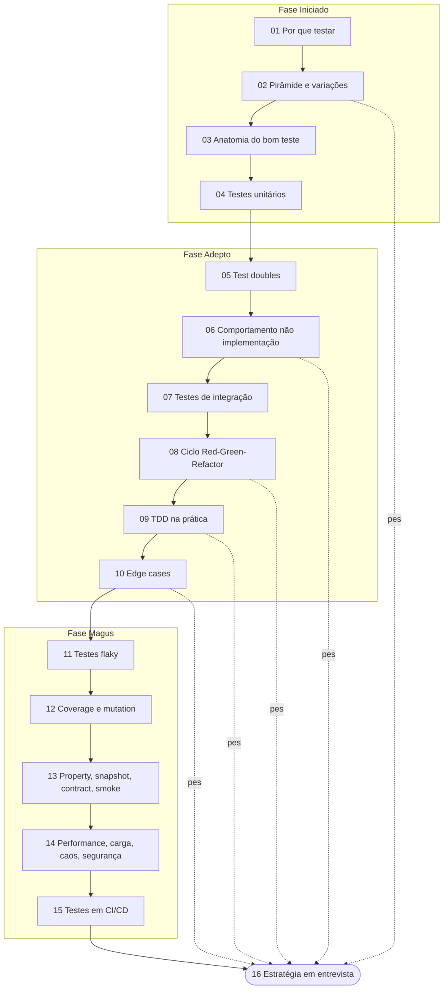

# Estratégia de testes em entrevista

> [!tip] Resumo em uma linha
> O entrevistador senior não quer a lista de frameworks que você decorou — quer ver você raciocinar sobre qual teste pega qual risco, e por quê.

Você passou quinze notas aprendendo a *fazer* testes. Esta nota é sobre algo diferente: *performar* esse conhecimento numa sala de entrevista, sob pressão, sem código rodando, com alguém julgando se você é senior de verdade ou se só repete buzzwords. É a nota de fechamento do galho [[03-Dominios/Engenharia/Testes/index|Testes]] — e o pulo do gato é entender que entrevista não é prova de memória, é demonstração de julgamento.

## 1. A tese: ninguém quer ouvir sua lista de frameworks

Pense no que separa um candidato júnior de um senior numa pergunta sobre testes. O júnior responde: "uso JUnit, Mockito, Testcontainers, escrevo testes unitários e de integração." Tudo certo, tudo verdadeiro — e completamente esquecível. Ele listou ferramentas.

O senior responde a uma pergunta que ninguém fez em voz alta: *por quê*. Por que este teste e não aquele? Que risco ele cobre? Que trade-off você aceitou? O entrevistador não está checando se você conhece o nome da biblioteca — ele descobre isso em trinta segundos olhando seu currículo. Ele está sondando se você sabe *decidir*.

E a decisão tem uma pergunta-âncora, herdada de [[02 - A pirâmide de testes e suas variações]]:

> [!quote] A pergunta que organiza tudo
> "Quando ESTE bug aparecer em produção, que tipo de teste eu quero que tivesse falhado primeiro?"

Essa pergunta é um detector de senioridade. Quem a faz raciocina sobre *risco* — onde o sistema dói, onde quebra, o que custa caro — e deriva a estratégia de teste a partir daí. Quem não a faz aplica a pirâmide como dogma, ou escreve teste pra bater meta de coverage. A tese desta nota inteira: **estratégia de testes é gestão de risco, não cerimônia de ferramentas.**

## 2. Desenhar uma estratégia (o roteiro)

A pergunta clássica de system design tem irmã gêmea menos famosa: "como você testaria este sistema?". Ela parece aberta e assustadora, mas tem um roteiro. Siga-o em voz alta — pensar alto *é* o que estão avaliando.

O roteiro tem sete passos. Antes da prosa, o mapa.

O diagrama abaixo é o roteiro que eu mentalmente percorro quando alguém me joga "como você testaria isto?". Note que ele começa pelo risco, não pela ferramenta — a ferramenta é a última coisa que entra.

Leitura do diagrama: a entrada é a pergunta aberta. O primeiro nó de decisão NÃO é "qual ferramenta" — é "onde mora o risco". Tudo flui a partir dali, converge na decisão de TDD (sim/não conforme a incerteza do design), passa obrigatoriamente pelo filtro "comportamento, não implementação", e só termina depois de edge cases e da esteira. A ferramenta nunca aparece como nó de decisão — ela é detalhe de implementação dos nós Unit/Integ/E2E.

Agora os sete passos em prosa:

**(a) Onde mora o risco.** Antes de qualquer teste, pergunte onde o sistema pode quebrar de forma cara. É lógica complexa (cálculo de imposto, motor de regras, parsing)? É fiação (o controller chama o serviço certo, o repo persiste de verdade, a fila entrega)? É um fluxo crítico de negócio (checkout, login, pagamento)? O risco dita o tipo de teste.

**(b) A forma da suíte.** Escolha a metáfora — pirâmide clássica ou troféu de testes (de [[02 - A pirâmide de testes e suas variações]]). Diga qual e por quê: pirâmide quando há muita lógica de domínio isolada; troféu quando o valor está na integração (microservices, muito I/O). E deixe explícito que é *guia*, não regra.

**(c) Unit para lógica.** Regras de negócio puras, determinísticas, sem I/O — teste unitário rápido e abundante (ver [[04 - Testes unitários]]). É onde a pirâmide tem sua base larga.

**(d) Integração para fiação, com infra real.** Controllers, repositórios, mensageria — teste de integração contra PostgreSQL/Redis/Kafka reais via Testcontainers (ver [[07 - Testes de integração]]). H2 em memória mente: tem dialeto SQL diferente do Postgres de produção.

**(e) E2E só no caminho crítico.** Jornadas ponta a ponta são lentas e frágeis. Um punhado, no caminho que dói (o checkout, não a tela de "sobre"). Nunca E2E pra cobrir lógica que um unit pegaria.

**(f) TDD onde o design é incerto.** Quando você não sabe ainda qual é a API certa, escrever o teste primeiro força o design (ver [[09 - TDD na prática]]). Para CRUD óbvio, código primeiro e teste logo em seguida.

**(g) Testar comportamento, não implementação.** O princípio que atravessa tudo (ver [[06 - Testar comportamento, não implementação]]): se você refatora o interior e o teste quebra sem que o comportamento tenha mudado, o teste estava errado.

**(h) Edge cases sistemáticos** (ver [[10 - Técnicas de teste e edge cases]]) **e a esteira rápida e confiável** (ver [[15 - Testes em CI-CD]]) fecham o roteiro — porque uma suíte que ninguém roda, ou que ninguém confia, não protege ninguém.

## 3. O checklist de edge cases consolidado

Esta é a parte que faz o entrevistador anotar algo. Quando ele pergunta "que casos você testaria?", o candidato fraco lista dois ou três. O senior despeja um checklist sem hesitar, porque ele *internalizou* a taxonomia de [[10 - Técnicas de teste e edge cases]]:

- **Vazio** — coleção/string/payload sem elementos.
- **Null** — referência ausente onde o código presume presença.
- **Limites** — primeiro, último, n-1, n, n+1 (o off-by-one favorito).
- **Overflow** — `Integer.MAX_VALUE`, estouro de soma, contadores que viram negativos.
- **Unicode** — emoji, combining characters, normalização NFC/NFD, strings que não cabem em um byte.
- **Timezone** — UTC vs local, horário de verão, o cliente em outro fuso.
- **Datas** — fim de mês, ano bissexto, 29 de fevereiro, virada de ano.
- **Duplicatas** — o mesmo item duas vezes, idempotência.
- **Concorrência** — duas threads na mesma linha, lost update, race condition.
- **Erro de rede** — timeout, conexão recusada, resposta parcial, retry.
- **Recursos esgotados** — pool de conexões cheio, disco cheio, memória no limite.
- **Caminho de erro** — a exceção é lançada, propagada e tratada como deveria (não só o happy path).

Decorar essa lista não é o ponto. O ponto é tê-la como *reflexo*: quando alguém descreve uma função, esses doze ângulos disparam sozinhos na sua cabeça.

## 4. How to explain in English

Numa entrevista internacional você vai precisar dizer isso em inglês, com fluência e sem gaguejar nos termos. Decore a *estrutura* deste monólogo — não palavra por palavra, mas o esqueleto — e improvise sobre ele:

> "My testing philosophy is pragmatic: I want fast feedback loops and high confidence in production, not coverage theater. In a Spring Boot project, that means JUnit 5 with AssertJ and Mockito for unit tests, and Testcontainers for integration tests that use real PostgreSQL, real Redis, real Kafka — whatever the production stack uses.
>
> I follow the testing pyramid as a guideline, not a rule. The real question I ask is: 'when this bug appears in production, what kind of test do I want to have caught it?' Logic bugs in isolated business rules — unit tests. Wiring bugs in controllers and repositories — integration tests. Critical user flows — a small set of E2E tests. I don't write E2E for everything; they're too slow and too flaky to maintain at scale.
>
> I use TDD when the design is unclear or the logic is complex, because writing the test first forces me to design the API before the implementation. For straightforward CRUD, I write the code first and the tests right after, focusing on edge cases — empty input, nulls, boundary values, unicode, timezones.
>
> One principle I hold strongly: test behavior, not implementation. If I can refactor the internals and the tests break, the tests are wrong. I prefer state-based assertions over interaction verification, and I prefer fakes — small in-memory implementations — over deeply mocked dependencies. A `FakeRepository` with a HashMap is often more robust and more readable than a Mockito mock.
>
> And on flaky tests: zero tolerance. A flaky test destroys confidence in the entire suite. When I find one, it goes to quarantine immediately and gets fixed — not re-run until it happens to pass. I never use `Thread.sleep` in tests; I use `Awaitility` or a controlled Clock."

### A estrutura escondida do monólogo

Esse parágrafo parece conversa fluida, mas é um roteiro disfarçado em cinco blocos — e cada bloco amarra numa nota-dona do galho:

1. **Filosofia pragmática** ("fast feedback, not coverage theater") — abre estabelecendo o critério de valor. Ecoa [[01 - O que são testes e por que testar]] e a crítica a coverage de [[12 - Coverage e mutation testing]].
2. **A pirâmide como guia** ("guideline, not a rule" + a pergunta-âncora) — é o coração estratégico, direto de [[02 - A pirâmide de testes e suas variações]]. Mapeia tipo de bug → tipo de teste em uma frase.
3. **TDD seletivo** ("when the design is unclear") — mostra maturidade: não é TDD-sempre nem TDD-nunca, é TDD-onde-paga. Vem de [[08 - TDD - o ciclo Red-Green-Refactor]] e [[09 - TDD na prática]].
4. **Comportamento, não implementação** (state-based > interaction, fake > mock) — o princípio de [[06 - Testar comportamento, não implementação]], com a preferência por fakes de [[05 - Test doubles - dummy, stub, spy, mock, fake]].
5. **Flaky zero-tolerância** (quarentena, nada de `Thread.sleep`, `Awaitility`/Clock) — fecha com rigor operacional, de [[11 - Testes flaky]].

Quem entende a estrutura nunca trava: se esquecer uma frase, sabe qual *bloco* vem a seguir e improvisa o conteúdo.

## 5. Frases úteis em entrevista

Munição pronta. São frases que sinalizam senioridade porque carregam um trade-off embutido — você não está afirmando, está *escolhendo*:

- "I'd start with the pyramid as a baseline, but adjust based on where the risk actually lives."
- "I prefer state-based testing over interaction-based — it couples less to the implementation."
- "I'd use Testcontainers for this so the test hits a real PostgreSQL instead of an in-memory H2 that drifts from production."
- "This is a good candidate for property-based testing because the invariant is clear."
- "I'd write the test first here — the logic is complex enough that designing the API through the test saves rework."
- "For flaky tests, I quarantine first and investigate. We never ship a suite that's 'usually green'."
- "100% coverage is a false signal — I aim for meaningful coverage of business logic and edge cases."
- "I'd push this assertion down to a unit test — an E2E here would be slow and would test the same logic at a worse layer."
- "Before I add a mock, I ask whether a fake would express the intent more honestly."

## 6. Vocabulário PT→EN consolidado

O galho inteiro em uma tabela. Em entrevista em inglês, errar o termo técnico custa credibilidade — "test double" é "test double", não "test copy"; "flaky" não tem tradução, usa-se o termo em inglês mesmo em conversas em português.

| Português | English |
| --- | --- |
| Teste unitário | Unit test |
| Teste de integração | Integration test |
| Teste de ponta a ponta | End-to-end test (E2E) |
| Teste de contrato | Contract test |
| Teste de fumaça | Smoke test |
| Teste de carga | Load test |
| Teste de estresse | Stress test |
| Teste de mutação | Mutation testing |
| Teste baseado em propriedades | Property-based testing |
| Teste de snapshot | Snapshot test |
| Teste de caos | Chaos testing |
| Cobertura (de código) | (Code) coverage |
| Dublê de teste | Test double |
| Falso (dublê) | Fake |
| Esboço / retorno fixo | Stub |
| Espião | Spy |
| Simulação / objeto simulado | Mock |
| Marionete / objeto inerte | Dummy |
| Teste instável / intermitente | Flaky test |
| Quarentena (de teste) | Quarantine |
| Acessório / dados de preparação | Fixture |
| Arrumar-Agir-Afirmar | Arrange-Act-Assert (AAA) |
| Desenvolvimento guiado por testes | Test-Driven Development (TDD) |
| Vermelho-Verde-Refatorar | Red-Green-Refactor |
| Refatoração | Refactoring |
| Integração / entrega contínua | CI/CD (continuous integration/delivery) |
| Caso de borda / extremo | Edge case (corner case) |
| Caminho feliz | Happy path |
| Caminho de erro | Error path / unhappy path |
| Partição de equivalência | Equivalence partitioning |
| Valor limite | Boundary value |
| Teste de caracterização | Characterization test |
| Asserção | Assertion |
| Afirmação baseada em estado | State-based assertion |
| Verificação de interação | Interaction verification |
| Teatro de cobertura | Coverage theater |
| Espelho de produção (infra real no teste) | Production-like test infra |

## 7. Armadilhas consolidadas

O reverso da medalha: o que o entrevistador (e a produção) punem. Uma linha cada, com a nota-dona pra revisar:

- Testar implementação em vez de comportamento — refator vira campo minado de testes quebrados ([[06 - Testar comportamento, não implementação]]).
- Over/under-mocking — mock demais acopla o teste à estrutura; de menos não isola o que precisa ([[05 - Test doubles - dummy, stub, spy, mock, fake]], [[06 - Testar comportamento, não implementação]]).
- Aceitar flaky como normal — "roda de novo que passa" corrói a confiança na suíte inteira ([[11 - Testes flaky]]).
- Coverage como métrica única — 100% sem assertions significativas é falso conforto ([[12 - Coverage e mutation testing]]).
- Ignorar edge cases — testar só o happy path deixa os bugs reais passarem ([[10 - Técnicas de teste e edge cases]]).
- Setup gigante — fixture de 50 linhas pra um assert esconde o que o teste realmente verifica ([[03 - Anatomia de um bom teste]]).
- Assertions fracas — `assertNotNull` onde devia haver `assertEquals` do valor exato.
- Nomes inúteis — `test1`, `testMethod` não dizem qual comportamento quebrou no relatório vermelho ([[03 - Anatomia de um bom teste]]).
- Um teste com 20 assertions — falha numa e esconde as outras 19; viola o "um motivo pra falhar" ([[03 - Anatomia de um bom teste]]).
- Estado compartilhado entre testes — ordem de execução vira dependência oculta e fonte de flaky ([[11 - Testes flaky]]).
- Não testar concorrência — a race condition só aparece em produção, na sexta à noite ([[10 - Técnicas de teste e edge cases]]).
- Test-after só pra bater coverage — escreve o teste depois moldado ao código, não pega bug nenhum ([[12 - Coverage e mutation testing]]).
- Esquecer o caminho de erro — só o sucesso é testado; o `catch` nunca foi exercitado ([[10 - Técnicas de teste e edge cases]]).
- `@Transactional` em teste de concorrência — o rollback automático mascara o comportamento real de commit/lock que você queria testar ([[07 - Testes de integração]]).

## 8. Recursos

Bibliografia preservada do monólito original — não inventada, lida e endossada:

**Livros:**

- *xUnit Test Patterns* — Gerard Meszaros. O catálogo canônico de padrões e *anti-padrões* de teste; de onde vem boa parte do vocabulário de test doubles.
- *Growing Object-Oriented Software, Guided by Tests* — Steve Freeman & Nat Pryce (GOOS). O livro que define a escola "mockist" e o TDD outside-in.
- *Working Effectively with Legacy Code* — Michael Feathers. Como introduzir testes onde não há nenhum; origem do *characterization test*.
- *Unit Testing: Principles, Practices, and Patterns* — Vladimir Khorikov. A defesa moderna de testar comportamento e preferir fakes; antídoto contra over-mocking.
- *Test-Driven Development: By Example* — Kent Beck. A fonte original do ciclo Red-Green-Refactor.

**Online:**

- Testing Trophy — Kent C. Dodds: kentcdodds.com/blog/the-testing-trophy-and-testing-classifications
- Mocks Aren't Stubs — Martin Fowler: martinfowler.com/articles/mocksArentStubs.html
- Testcontainers docs: testcontainers.com
- Awaitility: github.com/awaitility/awaitility
- Testing Library principles: testing-library.com/docs/guiding-principles

## O mapa do galho

Para fechar, o desenho do território inteiro. Dezesseis notas, três fases de senioridade, reconvergindo aqui no capstone. O diagrama mostra como o conhecimento foi se acumulando — e o tracejado marca as notas de maior peso estratégico, aquelas que você revisita antes de uma entrevista.

Leitura do diagrama: as três caixas são as fases — Iniciado (fundamentos e a base unitária), Adepto (doubles, integração e TDD), Magus (operação: flaky, métricas, tipos avançados, esteira). A linha sólida é a ordem de leitura. As linhas tracejadas "peso" apontam as notas que mais voltam numa entrevista: a pirâmide (02), o princípio de comportamento (06), o ciclo e a prática de TDD (08/09) e os edge cases (10). Se você só tiver vinte minutos pra revisar antes de uma call, são essas cinco.

> [!info] Lastro
> Esta é a nota CAPSTONE do galho — ela sintetiza, não introduz conteúdo técnico novo. O lastro factual mora nas notas 01–15, que carregam as fontes e os detalhes. O monólogo em inglês, as frases de entrevista, o vocabulário PT→EN e a lista de recursos foram PRESERVADOS do monólito original `Testes.md`, agora aposentado em favor deste galho de notas atômicas. As afirmações em primeira pessoa ("eu pergunto", "eu prefiro fakes") refletem a postura técnica do autor — não são experiências fabricadas. Como capstone, não requer novas fontes web: ela reorganiza para *performance* o que as notas anteriores já fundamentaram.

## Veja também

- [[03-Dominios/Engenharia/Testes/index|Testes]] — o índice e MOC do galho
- [[02 - A pirâmide de testes e suas variações]] — a pergunta-âncora e a forma da suíte
- [[06 - Testar comportamento, não implementação]] — o princípio que atravessa toda a estratégia
- [[09 - TDD na prática]] — quando escrever o teste primeiro paga
- [[10 - Técnicas de teste e edge cases]] — o checklist que você enumera sem hesitar
- [[05 - Test doubles - dummy, stub, spy, mock, fake]] — fake vs mock, a escolha que sinaliza maturidade
- [[Testes em Java]] — JUnit 5, AssertJ, Mockito, Testcontainers na prática
- [[Testes em JavaScript]] — o ecossistema equivalente no front
