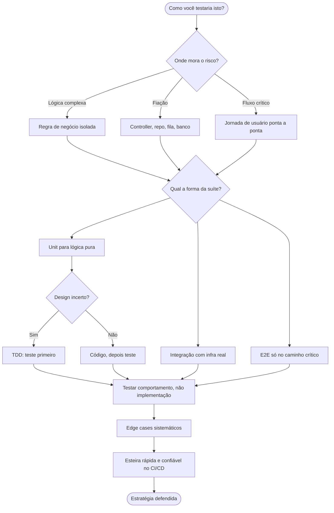
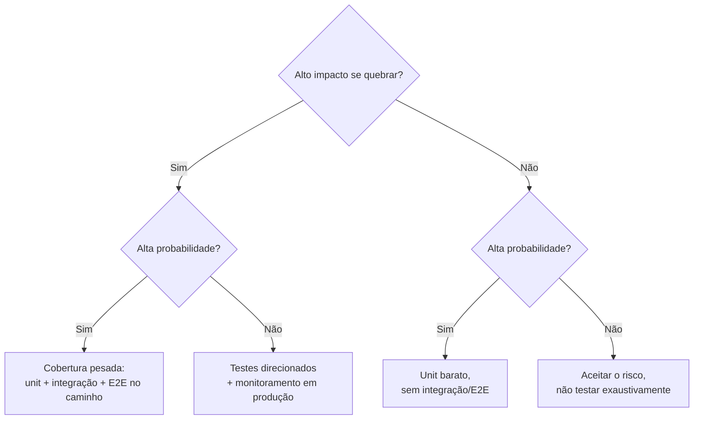

# Estratégia de testes em entrevista

> [!abstract] Resumo em uma linha
> O entrevistador senior não quer a lista de frameworks que você decorou — quer ver você raciocinar sobre qual teste pega qual risco, e por quê. **Estratégia de testes é gestão de risco, não cerimônia de ferramentas**: a pergunta que organiza tudo é "quando ESTE bug aparecer em produção, que tipo de teste eu quero que tivesse falhado primeiro?", e dela deriva um roteiro de sete passos — risco, forma da suíte, unit, integração, E2E, TDD seletivo, comportamento-não-implementação — que você percorre em voz alta, nunca em silêncio.
> Esta é também a nota de fechamento do galho [[03-Dominios/Engenharia/Testes/index|Testes]]: ela não introduz teoria nova, consolida quinze notas em performance — o monólogo em inglês, o vocabulário PT→EN, as armadilhas e, agora, a tabela de ferramentas por stack e a matriz risco×custo que orienta onde investir teste quando o tempo de entrevista (ou de sprint) é curto.

Você passou quinze notas aprendendo a *fazer* testes. Esta nota é sobre algo diferente: *performar* esse conhecimento numa sala de entrevista, sob pressão, sem código rodando, com alguém julgando se você é senior de verdade ou se só repete buzzwords. É a nota de fechamento do galho [[03-Dominios/Engenharia/Testes/index|Testes]] — e o pulo do gato é entender que entrevista não é prova de memória, é demonstração de julgamento.

## 1. A tese: ninguém quer ouvir sua lista de frameworks

Pense no que separa um candidato júnior de um senior numa pergunta sobre testes. O júnior responde: "uso JUnit, Mockito, Testcontainers, escrevo testes unitários e de integração." Tudo certo, tudo verdadeiro — e completamente esquecível. Ele listou ferramentas.

O senior responde a uma pergunta que ninguém fez em voz alta: *por quê*. Por que este teste e não aquele? Que risco ele cobre? Que trade-off você aceitou? O entrevistador não está checando se você conhece o nome da biblioteca — ele descobre isso em trinta segundos olhando seu currículo. Ele está sondando se você sabe *decidir*.

E a decisão tem uma pergunta-âncora, herdada de [[02 - A pirâmide de testes e suas variações]]:

> [!quote] A pergunta que organiza tudo
> "Quando ESTE bug aparecer em produção, que tipo de teste eu quero que tivesse falhado primeiro?"

Essa pergunta é um detector de senioridade. Quem a faz raciocina sobre *risco* — onde o sistema dói, onde quebra, o que custa caro — e deriva a estratégia de teste a partir daí. Quem não a faz aplica a pirâmide como dogma, ou escreve teste pra bater meta de coverage. A tese desta nota inteira: **estratégia de testes é gestão de risco, não cerimônia de ferramentas.**

## 2. Desenhar uma estratégia (o roteiro)

A pergunta clássica de system design tem irmã gêmea menos famosa: "como você testaria este sistema?". Ela parece aberta e assustadora, mas tem um roteiro. Siga-o em voz alta — pensar alto *é* o que estão avaliando.

O roteiro tem sete passos. Antes da prosa, o mapa.

O diagrama abaixo é o roteiro que eu mentalmente percorro quando alguém me joga "como você testaria isto?". Note que ele começa pelo risco, não pela ferramenta — a ferramenta é a última coisa que entra.

Leitura do diagrama: a entrada é a pergunta aberta. O primeiro nó de decisão NÃO é "qual ferramenta" — é "onde mora o risco". Tudo flui a partir dali, converge na decisão de TDD (sim/não conforme a incerteza do design), passa obrigatoriamente pelo filtro "comportamento, não implementação", e só termina depois de edge cases e da esteira. A ferramenta nunca aparece como nó de decisão — ela é detalhe de implementação dos nós Unit/Integ/E2E.

Agora os sete passos em prosa:

**(a) Onde mora o risco.** Antes de qualquer teste, pergunte onde o sistema pode quebrar de forma cara. É lógica complexa (cálculo de imposto, motor de regras, parsing)? É fiação (o controller chama o serviço certo, o repo persiste de verdade, a fila entrega)? É um fluxo crítico de negócio (checkout, login, pagamento)? O risco dita o tipo de teste.

**(b) A forma da suíte.** Escolha a metáfora — pirâmide clássica ou troféu de testes (de [[02 - A pirâmide de testes e suas variações]]). Diga qual e por quê: pirâmide quando há muita lógica de domínio isolada; troféu quando o valor está na integração (microservices, muito I/O). E deixe explícito que é *guia*, não regra.

**(c) Unit para lógica.** Regras de negócio puras, determinísticas, sem I/O — teste unitário rápido e abundante (ver [[04 - Testes unitários]]). É onde a pirâmide tem sua base larga.

**(d) Integração para fiação, com infra real.** Controllers, repositórios, mensageria — teste de integração contra PostgreSQL/Redis/Kafka reais via Testcontainers (ver [[07 - Testes de integração]]). H2 em memória mente: tem dialeto SQL diferente do Postgres de produção.

**(e) E2E só no caminho crítico.** Jornadas ponta a ponta são lentas e frágeis. Um punhado, no caminho que dói (o checkout, não a tela de "sobre"). Nunca E2E pra cobrir lógica que um unit pegaria.

**(f) TDD onde o design é incerto.** Quando você não sabe ainda qual é a API certa, escrever o teste primeiro força o design (ver [[09 - TDD na prática]]). Para CRUD óbvio, código primeiro e teste logo em seguida.

**(g) Testar comportamento, não implementação.** O princípio que atravessa tudo (ver [[06 - Testar comportamento, não implementação]]): se você refatora o interior e o teste quebra sem que o comportamento tenha mudado, o teste estava errado.

**(h) Edge cases sistemáticos** (ver [[10 - Técnicas de teste e edge cases]]) **e a esteira rápida e confiável** (ver [[15 - Testes em CI-CD]]) fecham o roteiro — porque uma suíte que ninguém roda, ou que ninguém confia, não protege ninguém.

## 3. O checklist de edge cases consolidado

Esta é a parte que faz o entrevistador anotar algo. Quando ele pergunta "que casos você testaria?", o candidato fraco lista dois ou três. O senior despeja um checklist sem hesitar, porque ele *internalizou* a taxonomia de [[10 - Técnicas de teste e edge cases]]:

- **Vazio** — coleção/string/payload sem elementos.
- **Null** — referência ausente onde o código presume presença.
- **Limites** — primeiro, último, n-1, n, n+1 (o off-by-one favorito).
- **Overflow** — `Integer.MAX_VALUE`, estouro de soma, contadores que viram negativos.
- **Unicode** — emoji, combining characters, normalização NFC/NFD, strings que não cabem em um byte.
- **Timezone** — UTC vs local, horário de verão, o cliente em outro fuso.
- **Datas** — fim de mês, ano bissexto, 29 de fevereiro, virada de ano.
- **Duplicatas** — o mesmo item duas vezes, idempotência.
- **Concorrência** — duas threads na mesma linha, lost update, race condition.
- **Erro de rede** — timeout, conexão recusada, resposta parcial, retry.
- **Recursos esgotados** — pool de conexões cheio, disco cheio, memória no limite.
- **Caminho de erro** — a exceção é lançada, propagada e tratada como deveria (não só o happy path).

Decorar essa lista não é o ponto. O ponto é tê-la como *reflexo*: quando alguém descreve uma função, esses doze ângulos disparam sozinhos na sua cabeça.

## Casos práticos

> [!missing] Gap declarado
> Esta nota é a capstone de síntese do galho — ela reorganiza para performance o que as notas 01–15 já fundamentaram (ver callout de Lastro, no fim). Um "caso prático" real e distinto exigiria uma experiência nova, não reaproveitada, e inventá-la aqui violaria a regra do vault contra fabricar projetos ou clientes. As notas [[07 - Testes de integração]] e [[15 - Testes em CI-CD]] são as que mais se prestariam a um caso concreto (infra real via Testcontainers, esteira de CI) — se um caso aplicável surgir depois, ele entra lá, na nota de mecanismo, não aqui na nota de estratégia.

## 4. How to explain in English

Numa entrevista internacional você vai precisar dizer isso em inglês, com fluência e sem gaguejar nos termos. Decore a *estrutura* deste monólogo — não palavra por palavra, mas o esqueleto — e improvise sobre ele:

> "My testing philosophy is pragmatic: I want fast feedback loops and high confidence in production, not coverage theater. In a Spring Boot project, that means JUnit 5 with AssertJ and Mockito for unit tests, and Testcontainers for integration tests that use real PostgreSQL, real Redis, real Kafka — whatever the production stack uses.
>
> I follow the testing pyramid as a guideline, not a rule. The real question I ask is: 'when this bug appears in production, what kind of test do I want to have caught it?' Logic bugs in isolated business rules — unit tests. Wiring bugs in controllers and repositories — integration tests. Critical user flows — a small set of E2E tests. I don't write E2E for everything; they're too slow and too flaky to maintain at scale.
>
> I use TDD when the design is unclear or the logic is complex, because writing the test first forces me to design the API before the implementation. For straightforward CRUD, I write the code first and the tests right after, focusing on edge cases — empty input, nulls, boundary values, unicode, timezones.
>
> One principle I hold strongly: test behavior, not implementation. If I can refactor the internals and the tests break, the tests are wrong. I prefer state-based assertions over interaction verification, and I prefer fakes — small in-memory implementations — over deeply mocked dependencies. A `FakeRepository` with a HashMap is often more robust and more readable than a Mockito mock.
>
> And on flaky tests: zero tolerance. A flaky test destroys confidence in the entire suite. When I find one, it goes to quarantine immediately and gets fixed — not re-run until it happens to pass. I never use `Thread.sleep` in tests; I use `Awaitility` or a controlled Clock."

### A estrutura escondida do monólogo

Esse parágrafo parece conversa fluida, mas é um roteiro disfarçado em cinco blocos — e cada bloco amarra numa nota-dona do galho:

1. **Filosofia pragmática** ("fast feedback, not coverage theater") — abre estabelecendo o critério de valor. Ecoa [[01 - O que são testes e por que testar]] e a crítica a coverage de [[12 - Coverage e mutation testing]].
2. **A pirâmide como guia** ("guideline, not a rule" + a pergunta-âncora) — é o coração estratégico, direto de [[02 - A pirâmide de testes e suas variações]]. Mapeia tipo de bug → tipo de teste em uma frase.
3. **TDD seletivo** ("when the design is unclear") — mostra maturidade: não é TDD-sempre nem TDD-nunca, é TDD-onde-paga. Vem de [[08 - TDD - o ciclo Red-Green-Refactor]] e [[09 - TDD na prática]].
4. **Comportamento, não implementação** (state-based > interaction, fake > mock) — o princípio de [[06 - Testar comportamento, não implementação]], com a preferência por fakes de [[05 - Test doubles - dummy, stub, spy, mock, fake]].
5. **Flaky zero-tolerância** (quarentena, nada de `Thread.sleep`, `Awaitility`/Clock) — fecha com rigor operacional, de [[11 - Testes flaky]].

Quem entende a estrutura nunca trava: se esquecer uma frase, sabe qual *bloco* vem a seguir e improvisa o conteúdo.

## 5. Frases úteis em entrevista

Munição pronta. São frases que sinalizam senioridade porque carregam um trade-off embutido — você não está afirmando, está *escolhendo*:

- "I'd start with the pyramid as a baseline, but adjust based on where the risk actually lives."
- "I prefer state-based testing over interaction-based — it couples less to the implementation."
- "I'd use Testcontainers for this so the test hits a real PostgreSQL instead of an in-memory H2 that drifts from production."
- "This is a good candidate for property-based testing because the invariant is clear."
- "I'd write the test first here — the logic is complex enough that designing the API through the test saves rework."
- "For flaky tests, I quarantine first and investigate. We never ship a suite that's 'usually green'."
- "100% coverage is a false signal — I aim for meaningful coverage of business logic and edge cases."
- "I'd push this assertion down to a unit test — an E2E here would be slow and would test the same logic at a worse layer."
- "Before I add a mock, I ask whether a fake would express the intent more honestly."

## 6. Vocabulário PT→EN consolidado

O galho inteiro em uma tabela. Em entrevista em inglês, errar o termo técnico custa credibilidade — "test double" é "test double", não "test copy"; "flaky" não tem tradução, usa-se o termo em inglês mesmo em conversas em português.

| Português | English |
| --- | --- |
| Teste unitário | Unit test |
| Teste de integração | Integration test |
| Teste de ponta a ponta | End-to-end test (E2E) |
| Teste de contrato | Contract test |
| Teste de fumaça | Smoke test |
| Teste de carga | Load test |
| Teste de estresse | Stress test |
| Teste de mutação | Mutation testing |
| Teste baseado em propriedades | Property-based testing |
| Teste de snapshot | Snapshot test |
| Teste de caos | Chaos testing |
| Cobertura (de código) | (Code) coverage |
| Dublê de teste | Test double |
| Falso (dublê) | Fake |
| Esboço / retorno fixo | Stub |
| Espião | Spy |
| Simulação / objeto simulado | Mock |
| Marionete / objeto inerte | Dummy |
| Teste instável / intermitente | Flaky test |
| Quarentena (de teste) | Quarantine |
| Acessório / dados de preparação | Fixture |
| Arrumar-Agir-Afirmar | Arrange-Act-Assert (AAA) |
| Desenvolvimento guiado por testes | Test-Driven Development (TDD) |
| Vermelho-Verde-Refatorar | Red-Green-Refactor |
| Refatoração | Refactoring |
| Integração / entrega contínua | CI/CD (continuous integration/delivery) |
| Caso de borda / extremo | Edge case (corner case) |
| Caminho feliz | Happy path |
| Caminho de erro | Error path / unhappy path |
| Partição de equivalência | Equivalence partitioning |
| Valor limite | Boundary value |
| Teste de caracterização | Characterization test |
| Asserção | Assertion |
| Afirmação baseada em estado | State-based assertion |
| Verificação de interação | Interaction verification |
| Teatro de cobertura | Coverage theater |
| Espelho de produção (infra real no teste) | Production-like test infra |

## 7. Armadilhas consolidadas

O reverso da medalha: o que o entrevistador (e a produção) punem. Uma linha cada, com a nota-dona pra revisar:

- Testar implementação em vez de comportamento — refator vira campo minado de testes quebrados ([[06 - Testar comportamento, não implementação]]).
- Over/under-mocking — mock demais acopla o teste à estrutura; de menos não isola o que precisa ([[05 - Test doubles - dummy, stub, spy, mock, fake]], [[06 - Testar comportamento, não implementação]]).
- Aceitar flaky como normal — "roda de novo que passa" corrói a confiança na suíte inteira ([[11 - Testes flaky]]).
- Coverage como métrica única — 100% sem assertions significativas é falso conforto ([[12 - Coverage e mutation testing]]).
- Ignorar edge cases — testar só o happy path deixa os bugs reais passarem ([[10 - Técnicas de teste e edge cases]]).
- Setup gigante — fixture de 50 linhas pra um assert esconde o que o teste realmente verifica ([[03 - Anatomia de um bom teste]]).
- Assertions fracas — `assertNotNull` onde devia haver `assertEquals` do valor exato.
- Nomes inúteis — `test1`, `testMethod` não dizem qual comportamento quebrou no relatório vermelho ([[03 - Anatomia de um bom teste]]).
- Um teste com 20 assertions — falha numa e esconde as outras 19; viola o "um motivo pra falhar" ([[03 - Anatomia de um bom teste]]).
- Estado compartilhado entre testes — ordem de execução vira dependência oculta e fonte de flaky ([[11 - Testes flaky]]).
- Não testar concorrência — a race condition só aparece em produção, na sexta à noite ([[10 - Técnicas de teste e edge cases]]).
- Test-after só pra bater coverage — escreve o teste depois moldado ao código, não pega bug nenhum ([[12 - Coverage e mutation testing]]).
- Esquecer o caminho de erro — só o sucesso é testado; o `catch` nunca foi exercitado ([[10 - Técnicas de teste e edge cases]]).
- `@Transactional` em teste de concorrência — o rollback automático mascara o comportamento real de commit/lock que você queria testar ([[07 - Testes de integração]]).

## 8. Respondendo "como você testaria X?" ao vivo

Essa é a pergunta que mais separa candidatos em entrevista de sistemas — a irmã gêmea do "desenhe este sistema", mas sobre qualidade em vez de escala. Ela chega assim: o entrevistador descreve um sistema em três frases (um rate limiter, um carrinho de compras, uma fila de processamento de pagamento) e pergunta como você o testaria. Não há código, não há tempo pra pesquisar, e o silêncio pesa.

O erro do candidato nervoso é começar pela ferramenta: "eu usaria JUnit e Testcontainers". Isso responde a pergunta errada. A sequência que sinaliza senioridade é a do roteiro da seção 2, mas comprimida pra caber em dois ou três minutos de fala:

1. **Restabeleça o escopo em voz alta.** "Vou assumir que isso é um serviço stateless por trás de um load balancer, com Redis pro contador" — nomear a suposição mostra que você não está testando um sistema imaginário.
2. **Aponte o risco primeiro, não o teste.** "O risco aqui não é a lógica do contador — é simples. O risco é concorrência: duas requisições simultâneas lendo o mesmo contador antes de qualquer uma escrever."
3. **Derive o tipo de teste do risco, não o contrário.** "Então eu quero um teste de integração que dispare N requisições concorrentes de verdade contra o Redis real, não um mock — porque um mock nunca vai reproduzir a race condition."
4. **Declare o que fica de fora, e por quê.** "Eu não escreveria E2E pra isso além de um smoke test — a lógica de negócio já está coberta em unit, e um E2E aqui só adicionaria latência sem adicionar confiança."

### Erros de execução (não de conteúdo) que derrubam uma boa resposta

Vale separar isso das armadilhas técnicas da seção 7 — essas aqui são erros de *performance*, não de desenho de teste. Você pode saber a teoria inteira e ainda tropeçar na entrega:

- **Ir direto pro código.** Alguns candidatos, desconfortáveis com ambiguidade, tentam escrever um teste de exemplo em vez de responder a pergunta estratégica primeiro. Isso queima o tempo da entrevista respondendo uma pergunta que não foi feita.
- **Silêncio longo demais antes de começar.** Pensar é esperado; pensar em silêncio por um minuto inteiro não é — o entrevistador não consegue avaliar um processo que não ouve. Prefira pensar em voz alta, mesmo que a primeira frase seja "deixa eu organizar o raciocínio".
- **Cobrir todo o roteiro da seção 2 por extenso.** O roteiro completo (sete passos, incluindo TDD e a esteira de CI) é para *desenhar* uma estratégia com tempo; ao vivo, sob os quatro passos comprimidos acima, tentar recitar os sete passos inteiros estoura o tempo e soa decorado.
- **Não perguntar de volta quando a descrição é ambígua.** "Isso precisa ser consistente ou só eventualmente consistente?" é uma pergunta que só um senior faz — ela muda a resposta inteira, e fazer a pergunta é, em si, o sinal que o entrevistador procura.

> [!question]- O que o entrevistador está de fato avaliando?
> Não é se você acertou a resposta "certa" — geralmente não há uma. Ele avalia quatro coisas, na ordem em que aparecem na sua fala: (1) você identifica risco antes de recitar ferramenta; (2) você prioriza sob restrição de tempo, como faria numa sprint real; (3) você defende a escolha quando ele contesta ("e se eu disser que preciso de 100% de cobertura aqui?" — a resposta madura nomeia o custo, não obedece cegamente); (4) você admite o que não testaria e por quê — dizer "eu testaria tudo" é uma bandeira vermelha, porque sinaliza que você nunca operou sob prazo real.

> [!example]- Três walkthroughs completos, palavra por palavra
> **"Como você testaria um encurtador de URL?"**
> "Vou assumir três operações: criar um link curto, redirecionar, e (talvez) contar cliques. O risco não está na lógica de encurtar — é gerar um hash e checar colisão, unit test trivial. O risco real é o redirecionamento sob carga: é o caminho mais quente do sistema, chamado a cada clique, e se ele cair a experiência inteira quebra. Então: unit exaustivo na geração de hash e na detecção de colisão; um teste de integração que sobe o serviço real com o banco/cache real e verifica que um POST seguido de GET redireciona certo; e eu adicionaria um teste de carga leve nesse endpoint de redirecionamento específico — não no resto da API — porque é onde o tráfego se concentra. Eu não testaria contagem de cliques com a mesma rigidez: se um clique for perdido ocasionalmente, o impacto é baixo."
>
> **"Como você testaria um carrinho de compras?"**
> "Aqui o risco não é performance, é correção monetária — o pior bug possível é cobrar o valor errado. Então a lógica de cálculo de total, desconto e imposto vai toda em unit test, com casos de borda pesados: cupom expirado, desconto que zera o preço, item removido durante o cálculo. A parte de persistência — carrinho sobrevive a um reload de página, sincroniza entre abas — é integração, contra um banco ou cache real, porque é exatamente o tipo de bug que um mock esconde. E eu colocaria um único E2E cobrindo o fluxo completo até o checkout, porque é o caminho que gera receita; qualquer outra combinação de produtos no carrinho já está coberta pela lógica unitária."
>
> **"Como você testaria uma fila de processamento de pagamento?"**
> "Aqui o risco tem duas caras: dinheiro errado e dinheiro duplicado. Uma mensagem processada duas vezes — por retry de rede, por reentrega da fila — não pode cobrar o cliente duas vezes; então o primeiro teste que eu escrevo é de idempotência: processar a mesma mensagem duas vezes e verificar que o efeito colateral acontece uma vez só, não em unit isolado, mas em integração contra a fila e o banco reais, porque é exatamente a interação entre os dois que causa o bug. Eu testaria também o caminho de falha explicitamente: o que acontece se o processamento falhar no meio — a mensagem vai pra dead-letter queue, ou fica presa em retry infinito? Eu não colocaria E2E nisso: é um sistema assíncrono, um E2E ficaria lento e frágil esperando efeito colateral aparecer; prefiro um teste de integração que espera pela condição certa — com `Awaitility` ou equivalente, nunca `sleep` fixo."

## 9. A matriz risco × custo: onde investir teste quando o tempo é curto

A pergunta-âncora da seção 1 ("que teste eu quero que tivesse falhado primeiro?") vira ferramenta prática quando você a cruza com uma segunda dimensão: quanto custa testar aquilo. Risk-based testing — a prática de priorizar teste por severidade × probabilidade — não é invenção de entrevista, é como equipes de QA maduras alocam orçamento de teste finito contra um sistema infinito em superfície de risco.

| | **Alta probabilidade de quebrar** | **Baixa probabilidade de quebrar** |
| --- | --- | --- |
| **Alto impacto se quebrar** | Cobertura pesada: unit exaustivo na lógica, integração contra infra real, um E2E no caminho — é aqui que mora o checkout, o cálculo de preço, a autenticação. | Testes direcionados + monitoramento em produção. Não vale escrever dezenas de edge cases pra um cenário raro; vale um teste que documenta o caso e alertas que pegam se ele acontecer mesmo assim (ex: falha de terceiro externo). |
| **Baixo impacto se quebrar** | Unit barato e rápido, sem cerimônia. Cobre o volume (validação de formulário, formatação), mas não justifica integração ou E2E — o custo de manutenção não paga o risco evitado. | Aceitar o risco. Testar isso exaustivamente é o "coverage theater" da seção 6: gasta tempo de CI e de revisão de PR sem mover a agulha de confiança. |

O ponto que um júnior erra: ele testa com a mesma intensidade em todos os quadrantes, porque "testar mais é sempre melhor". O senior aloca esforço de teste como aloca qualquer outro recurso escasso — de forma desigual e deliberada, e sabe *articular* por que um módulo tem 95% de cobertura e outro tem 40% por escolha, não por preguiça.

Aplicando aos três sistemas da seção 8: no encurtador de URL, o redirecionamento é alto-impacto/alta-probabilidade (tráfego constante, quebra é visível na hora) — cobertura pesada; a contagem de cliques é baixo-impacto/alta-probabilidade — unit barato. No carrinho, o cálculo de total é alto-impacto — não importa a probabilidade, cobertura pesada; a persistência entre abas é alto-impacto/baixa-probabilidade — teste direcionado. Na fila de pagamento, a idempotência é alto-impacto/alta-probabilidade (retries acontecem o tempo todo em sistemas distribuídos) — o quadrante mais caro da matriz, e por isso o que mais justifica investimento pesado de teste.

O mesmo raciocínio, como fluxo de decisão — útil quando a matriz 2×2 não cabe na sua cabeça sob pressão:

O caminho **Alto impacto + Alta probabilidade → cobertura pesada** é intuitivo; o que separa a resposta madura é os outros três ramos — em especial admitir, em voz alta, o ramo "aceitar o risco". Um júnior evita essa frase porque soa como confissão de preguiça; um senior a usa porque é o oposto: é declarar que já fez a conta.

## 10. Sinais de senioridade vs. júnior na resposta

A tabela a seguir condensa o que já apareceu espalhado nas seções 1, 2 e 8 — útil como checklist mental de trinta segundos antes de responder:

| Sinal | Resposta júnior | Resposta senior |
| --- | --- | --- |
| Ponto de partida | Nomeia frameworks primeiro | Nomeia o risco primeiro |
| Pirâmide | Trata como regra fixa | Trata como guia, ajusta por onde o risco vive |
| Cobertura | "Eu tento chegar em 100%" | "Eu miro cobertura *significativa* da lógica de negócio e dos edge cases, não um número" |
| E2E | "Eu cobriria tudo com E2E pra ter certeza" | "E2E só no caminho crítico — é lento e frágil pra cobrir lógica que um unit já pega" |
| Mock vs fake | Não sabe articular a diferença | Explica quando prefere fake (estado real, menos acoplamento) a mock (verificação de interação) |
| Quando contestado | Recua ou dobra a aposta sem novo argumento | Nomeia o trade-off explicitamente ("isso custaria X em tempo de CI para reduzir Y de risco — vale a pena aqui porque...") |
| O que fica de fora | Evita admitir que algo ficaria sem teste | Declara o que não testaria, e por quê — sinaliza confiança em priorizar |
| Suíte lenta | Não menciona velocidade da esteira | Trata velocidade do CI como requisito de produto, não luxo (ver seção 11) |

### Follow-ups que testam se a resposta era decorada

O entrevistador sênior sabe que uma resposta bem ensaiada pode ser só isso — ensaiada. Por isso ele empurra com uma pergunta de acompanhamento fora do roteiro. A tabela abaixo antecipa as mais comuns; o ponto não é ter a resposta perfeita, é não travar:

| Follow-up | O que a resposta madura contém |
| --- | --- |
| "E se você só tivesse metade do tempo?" | Corta pelo quadrante de baixo impacto primeiro (matriz da seção 9); nunca corta o teste do caminho crítico. |
| "Como você mede se a suíte é boa, além de coverage?" | Mutation testing como complemento honesto — ver [[12 - Coverage e mutation testing]]; coverage alto com mutantes sobrevivendo é suíte decorativa. |
| "O que você faz quando encontra um teste flaky em produção?" | Quarentena imediata, não "roda de novo até passar" — ver [[11 - Testes flaky]] e a seção 5 desta nota. |
| "Como testar isso sem acesso a um banco real?" | Prefira Testcontainers a H2/mocks em memória; se a infra real for inviável, um fake explícito é mais honesto que um mock profundo. |
| "Onde termina o seu teste e começa o do time de QA?" | Dev garante comportamento unitário e de integração antes do merge; QA/exploratório cobre jornada de usuário e cenários que a spec não previu — não é duplicação, é camada diferente de risco. |
| "Você usaria IA para gerar testes?" | Aceitável para gerar esqueleto e casos óbvios de edge case; todo teste gerado por IA ainda precisa passar pelo mesmo crivo da seção 3 (F.I.R.S.T., um motivo pra falhar) — IA não é desculpa pra baixar a régua de revisão. |
| "Você prioriza corrigir dívida de teste ou entregar a feature nova?" | Depende de onde a dívida vive na matriz da seção 9: dívida no quadrante alto-impacto/alta-probabilidade compete de igual pra igual com feature nova; dívida em código de baixo risco espera. Responder "sempre a feature" ou "sempre a dívida" sem essa distinção é a resposta de quem não pensou no trade-off. |

> [!example]- "Nomear o trade-off" na prática, não só na tabela
> **Entrevistador:** "Você disse que não testaria isso com E2E. E se eu insistir que eu, como stakeholder, quero 100% de confiança nesse fluxo?"
> **Resposta júnior (recua):** "Ah, tudo bem, eu adiciono um E2E então."
> **Resposta senior (nomeia o custo):** "Posso adicionar, mas vale entender o que isso compra: esse fluxo já tem cobertura de unit na lógica e de integração na persistência — o que falta é confiança de que os componentes se encaixam do jeito que o usuário realmente usa. Um E2E cobre isso, mas ele é o teste mais caro de manter da pirâmide: mais lento, mais frágil a mudanças de UI que não mudam o comportamento. Se '100% de confiança' significa esse único caminho crítico, um E2E focado nele é razoável. Se significa E2E pra cada combinação de estado, o custo de manutenção vai superar o valor rapidamente — nesse caso eu prefiro investir em mais casos de integração, que são mais baratos e quase tão confiáveis."
> A diferença entre as duas respostas não é o resultado (as duas podem terminar com "ok, adiciono o E2E") — é que a segunda deixa claro que a decisão foi pesada, não cedida.

## 11. O trade-off de uma suíte lenta

Existe uma armadilha que o candidato entusiasmado cai sozinho: empilhar teste sobre teste até a suíte ficar "completa" — e lenta. Uma suíte que demora quarenta minutos pra rodar não é mais segura que uma de oito; ela só atrasa o feedback até o ponto em que o time para de esperar por ela.

Os números por trás disso são mais duros do que parecem. Um estudo do time de produtividade de engenharia do Google, sobre testes na escala da empresa, mediu que testes *flaky* — o sintoma mais comum de suíte inchada e mal isolada — respondem por cerca de 4,56% de todas as falhas de teste, consumindo algo em torno de 2% do tempo total de codificação da engenharia; numa equipe de cinquenta desenvolvedores isso equivale a perder um ano-pessoa inteiro por ano só triando falhas que não eram bugs reais.[^flaky-cost] O efeito composto é o que interessa em entrevista: dev para de confiar no vermelho, começa a re-rodar "até passar", e a suíte perde a única propriedade que a justifica — ser um sinal confiável.

O trade-off que você articula em voz alta:

- **Suíte de PR (gate) vs. suíte noturna.** Testes rápidos e determinísticos (unit, a maior parte da integração) rodam em todo PR; testes caros ou propensos a flakiness (E2E amplo, carga, alguns testes de contrato) rodam em pipeline noturno ou sob demanda — ver [[15 - Testes em CI-CD]] para a esteira completa.
- **Paralelização paga, até certo ponto.** Dividir a suíte em shards reduz tempo de parede, mas não reduz custo de CI nem esconde um teste fundamentalmente lento — só disfarça o sintoma.
- **Flaky vira dívida, não estatística.** Zero tolerância (seção 5) não é purismo — é economia: cada teste em quarentena é um teste que parou de custar tempo de triagem alheio, mesmo que ainda não tenha sido corrigido.

Dizer isso numa entrevista é dizer, em outras palavras, que você já pagou o preço de uma suíte lenta em produção — e que sua estratégia de teste inclui o orçamento de tempo de CI como restrição de primeira classe, não como reboque.

Em orçamento de tempo, a heurística que vale defender (ajustável ao tamanho do sistema, nunca um número absoluto):

| Camada | Quando roda | Orçamento de tempo típico | O que acontece se estourar |
| --- | --- | --- | --- |
| Unit | A cada `git push`, local e no PR | Segundos a poucos minutos para a suíte inteira | Sinal de que a suíte cresceu sem disciplina de isolamento — hora de checar mocks pesados ou setup lento |
| Integração (PR gate) | A cada PR, antes do merge | Minutos, não dezenas de minutos | Time começa a pular a esteira ("mergeia e vê depois") — a pior consequência possível |
| E2E do caminho crítico | A cada PR ou merge na main | Poucos minutos, porque é um punhado de cenários, não a cobertura inteira | Se está demorando muito, é sinal de que E2E está cobrindo lógica que devia estar em unit |
| Suíte ampliada (carga, contrato, E2E exploratório) | Noturna ou sob demanda, não bloqueia PR | Minutos a poucas horas | Aceitável demorar — o trade-off é feedback atrasado em troca de não bloquear ninguém |

> [!example]- Um contraponto scriptado, pra treinar a resposta sob pressão
> **Entrevistador:** "Mas se você não roda os testes de carga em todo PR, como sabe que não introduziu uma regressão de performance?"
> **Resposta madura:** "Eu não elimino esse risco, eu o desloco pro lugar certo do funil. Testes de carga são caros e ruidosos o suficiente pra não valerem o custo em cada PR — eles rodam à noite, ou sob demanda antes de um release grande. O que roda em todo PR é algo mais barato que aproxima o sinal: um teste de contrato de latência em endpoints críticos, ou um benchmark leve tipo JMH/k6 num subconjunto pequeno. Não é a mesma cobertura, é uma aposta deliberada: feedback rápido no PR, cobertura completa antes do release."

[^flaky-cost]: Google, pesquisa de produtividade de engenharia sobre testes flaky em escala — citada em [The Real Cost of Flaky Tests](https://flakyguard.com/blog/cost-of-flaky-tests) e [Flaky Tests Consume 20% of CI Time](https://getautonoma.com/blog/flaky-tests-ci-cd-engineering-cost), que reportam o dado original de ~4,56% das falhas de teste e ~2% do tempo de codificação.

## 12. Como treinar essa resposta antes do dia da entrevista

Ler esta nota uma vez não fixa o roteiro — falar em voz alta fixa. A diferença entre saber a teoria e conseguir aplicá-la sob o relógio da entrevista é repetição deliberada, não mais leitura.

**O exercício de trinta segundos.** Escolha um sistema qualquer — um dos exemplos abaixo, ou um projeto seu — e cronometre: você tem trinta segundos pra dizer *onde mora o risco* antes de mencionar qualquer ferramenta. Se você chegar em "JUnit" ou "pytest" antes de chegar em "o risco é X", recomece. Esse é o hábito que a seção 8 pede, treinado isoladamente.

**Sistemas pra praticar contra** (nenhum precisa de código de verdade — é treino de raciocínio falado). Resista à tentação de espiar a coluna da direita antes de tentar em voz alta:

| Sistema | Onde provavelmente mora o risco dominante |
| --- | --- |
| Upload de arquivo com limite de tamanho e tipos permitidos | Validação de borda (arquivo vazio, tipo disfarçado por extensão) e o caminho de erro quando o limite estoura |
| Notificação multi-canal (email/push/SMS) conforme preferência do usuário | Fiação: o canal certo é escolhido pra preferência certa — mais integração do que lógica de negócio |
| Cache distribuído com invalidação por TTL | Concorrência e janela de corrida entre expiração e releitura — o clássico "stale read" |
| API de busca com paginação e filtros combináveis | Combinatória de edge cases (filtros vazios, página além do fim, ordenação instável) |
| Webhook receiver que precisa ser idempotente | Idempotência sob reentrega — o mesmo risco da fila de pagamento da seção 8 |
| Fila de tarefas com retry e dead-letter queue | O caminho de falha: quando algo vai pra DLQ, e o que acontece depois disso |

Para cada um, force-se a passar pelos quatro passos da seção 8 em voz alta, cronometrando: escopo, risco, tipo de teste derivado do risco, o que fica de fora. Depois, aplique a matriz da seção 9 — desenhe mentalmente os quatro quadrantes e encaixe as partes do sistema. Só depois de tentar sozinho, confira contra a coluna da direita — se o seu risco dominante bateu com o da tabela, o reflexo já está formado; se não bateu, releia a seção 8 e tente de novo com outro sistema da lista antes de seguir em frente.

> [!tip] O sinal de que você já internalizou o roteiro
> Você para de precisar pensar "agora eu digo a frase sobre risco" — a pergunta "onde mora o risco?" vira reflexo antes mesmo do entrevistador terminar de descrever o sistema. É o mesmo tipo de automatização que a seção 3 descreve para o checklist de edge cases: decorar é frágil, internalizar é robusto.

**Grave-se, ou pratique com outra pessoa.** Ouvir a própria resposta depois — ou ter alguém que interrompe com um follow-up da tabela da seção 10 — expõe dois problemas que o ensaio silencioso esconde: frases longas demais sem pausa (o entrevistador perde o fio) e o hábito de justificar em excesso um ponto óbvio enquanto passa rápido demais pelo ponto que realmente sustenta a resposta. Nenhuma quantidade de leitura desta nota substitui isso — é a mesma lógica de F.I.R.S.T. (seção 3, herdada de [[03 - Anatomia de um bom teste]]): teoria sem repetição não vira reflexo.

## 13. Ferramentas por stack: a tabela consolidada

Todo o galho é deliberadamente stack-agnóstico — a estratégia vem antes da ferramenta. Mas em entrevista alguém eventualmente pergunta "e no seu stack, o que você usa?", e hesitar na resposta mina a credibilidade construída nas onze seções anteriores. Esta tabela é o mapa rápido: mesmo conceito, quatro ecossistemas.

| Conceito | Java | JavaScript/TypeScript | Python | Go |
| --- | --- | --- | --- | --- |
| Test runner | JUnit 5 | Vitest / Jest | pytest | `go test` (stdlib) |
| Asserções fluentes | AssertJ | Testing Library / `expect` | asserções do pytest | testify/`assert` |
| Mock / test double | Mockito | `vi.mock` / `jest.mock` | `unittest.mock`, pytest-mock | testify/mock, `gomock` |
| Property-based testing | jqwik | fast-check | Hypothesis | `rapid`, gopter |
| Integração com infra real | Testcontainers | Testcontainers (Node) | testcontainers-python | testcontainers-go |
| Mock de HTTP/API | WireMock | MSW (Mock Service Worker) | `responses` / `respx` | `httptest` (stdlib) |
| Cliente de teste HTTP | MockMvc / RestAssured | Supertest | `TestClient` (FastAPI/Starlette), `httpx` | `net/http/httptest` |
| E2E de navegador | Selenium / Playwright | Playwright / Cypress | Playwright (Python) | rod, Playwright (via CLI) |
| Cobertura de código | JaCoCo | Istanbul / c8 | `coverage.py` | `go tool cover` (stdlib) |
| Mutation testing | PIT (PITest) | Stryker | mutmut | go-mutesting |
| Teste de contrato | Pact-JVM | Pact-JS | Pact-Python | Pact-go |
| Table-driven / parametrizado | `@ParameterizedTest` | `test.each` (Vitest/Jest) | `@pytest.mark.parametrize` | idiomático: slice de structs + subtestes `t.Run` |
| Snapshot testing | Approval Tests (menos comum) | Vitest/Jest snapshot (nativo) | `syrupy` | não é idiomático; go-snaps existe mas é pouco usado |
| Fuzzing | JQF (menos comum) | fast-check (property-based cobre o caso) | Atheris (libFuzzer) | `go test -fuzz` (nativo desde Go 1.18) |

O ferramental completo de cada stack — com exemplos de código, não só nomes — mora nos galhos dedicados: [[03-Dominios/Tecnologia/Java/Testes/index|Java · Testes]] (21 notas: JUnit 5, Mockito, Testcontainers, PIT, Pact), [[03-Dominios/Tecnologia/Testes JS/index|Testes JS]] (18 notas: Vitest, Testing Library, MSW, Playwright), [[03-Dominios/Tecnologia/Python/Testes/index|Python · Testes]] (9 notas: pytest, fixtures, TestClient) e [[03-Dominios/Tecnologia/Go/15 - Testes/index|Go · Testes]] (8 notas: `go test`, table-driven, fuzzing).

> [!info]- Nuances que valem uma frase a mais, se o entrevistador perguntar "por quê essa ferramenta"
> - **Testcontainers aparece em todas as quatro colunas com o mesmo nome** — não é coincidência, é o mesmo projeto com bindings por linguagem. Isso é, em si, um bom argumento pra entrevista: "eu uso a mesma estratégia de integração real independente do stack, só troca o binding".
> - **Go não tem framework de teste "de verdade" — e isso é proposital.** `testing` é biblioteca padrão; `testify` só adiciona asserções fluentes e mocks por cima. Um candidato que sabe disso demonstra que testou em Go de fato, não só leu sobre — a comunidade Go valoriza explicitamente a ausência de "magia" de framework (sem anotações, sem reflection pesado).
> - **Property-based testing é o item menos maduro na tabela fora de Python/JS.** Hypothesis (Python) e fast-check (JS) têm adoção ampla; jqwik (Java) e `rapid`/gopter (Go) existem mas são bem mais nicho — se o entrevistador perguntar por que você não usaria isso "por padrão", a resposta honesta é que o retorno só compensa quando o invariante é claro (ex: parsing, serialização, matemática), não pra CRUD comum.
> - **`@Transactional` em teste (Spring) e fixtures de banco (pytest, Go) resolvem o mesmo problema por caminhos diferentes** — isolar o efeito colateral de um teste do próximo. A armadilha listada na seção 7 (`@Transactional` mascarando concorrência) tem equivalente em qualquer stack que usa uma transação de teste como atalho de limpeza.
> - **Mutation testing é a ferramenta mais citada e menos usada da tabela.** PIT, Stryker, mutmut e go-mutesting existem há anos, mas raramente rodam em todo PR — o custo de CPU é alto. Mencionar que você sabe *quando* rodar (esporadicamente, ou só nos módulos de maior risco da matriz da seção 9) soa mais senior do que fingir que roda sempre.
> - **A linha "table-driven / parametrizado" é onde as quatro culturas mais divergem.** Java e Python têm anotação declarativa (`@ParameterizedTest`, `@pytest.mark.parametrize`); JS tem `test.each` como API de biblioteca; Go não tem nada disso embutido — o padrão idiomático é escrever a tabela como slice de structs e iterar com `t.Run` manualmente. Um candidato que reconhece essa diferença sem hesitar mostra que já escreveu teste nas quatro linguagens, não só leu a documentação de uma.
> - **Fuzzing nativo no `go test` desde a 1.18 é um diferencial real de Go.** Nenhuma das outras três colunas tem fuzzing como parte da biblioteca padrão do runner de teste — em Java, Python e JS, fuzzing é sempre uma ferramenta externa. Se o entrevistador perguntar sobre fuzzing num contexto Go, mencionar `go test -fuzz` sem hesitar é um sinal forte de proficiência específica da linguagem, não só de testes em geral.

Nenhuma linha desta tabela substitui prática real no ecossistema — ela existe pra você não travar quando o entrevistador perguntar "e nessa stack, especificamente?", não pra ser recitada de cor.

## Fontes

Bibliografia preservada do monólito original — não inventada, lida e endossada — mais as fontes novas incorporadas nas seções 9 e 11 desta revisão (risk-based testing e o custo mensurado de suítes lentas/flaky):

**Livros:**

- *xUnit Test Patterns* — Gerard Meszaros. O catálogo canônico de padrões e *anti-padrões* de teste; de onde vem boa parte do vocabulário de test doubles.
- *Growing Object-Oriented Software, Guided by Tests* — Steve Freeman & Nat Pryce (GOOS). O livro que define a escola "mockist" e o TDD outside-in.
- *Working Effectively with Legacy Code* — Michael Feathers. Como introduzir testes onde não há nenhum; origem do *characterization test*.
- *Unit Testing: Principles, Practices, and Patterns* — Vladimir Khorikov. A defesa moderna de testar comportamento e preferir fakes; antídoto contra over-mocking.
- *Test-Driven Development: By Example* — Kent Beck. A fonte original do ciclo Red-Green-Refactor.

**Online:**

- [Testing Trophy — Kent C. Dodds](https://kentcdodds.com/blog/the-testing-trophy-and-testing-classifications)
- [Mocks Aren't Stubs — Martin Fowler](https://martinfowler.com/articles/mocksArentStubs.html)
- [Testcontainers docs](https://testcontainers.com)
- [Awaitility](https://github.com/awaitility/awaitility)
- [Testing Library — Guiding Principles](https://testing-library.com/docs/guiding-principles)
- [Risk-Based Testing Guide: Strategy, Matrix & Examples — testomat.io](https://testomat.io/blog/risk-based-testing/)
- [The Real Cost of Flaky Tests — FlakyGuard](https://flakyguard.com/blog/cost-of-flaky-tests)

> [!missing] Gap declarado — mídia
> Foi pesquisado vídeo/podcast especificamente sobre estratégia de testes *em contexto de entrevista técnica* (busca via `uvx yt-dlp`, legendas verificadas). O mais próximo encontrado — "5 Types of Testing Software Every Developer Needs to Know!" (Alex Hyett) — cobre tipos de teste em nível introdutório, sobreposto ao que as notas 01–04 já fundamentam, sem o ângulo de performance de entrevista que esta nota exige; embuti-lo aqui seria preencher a lente Mídia sem relevância real. Nenhum vídeo com legenda verificável e foco em "como responder perguntas de teste em entrevista" foi localizado. Fica como buraco declarado, não preenchido.

## Referência rápida das 13 seções

Pra revisar nos cinco minutos antes de entrar na call, sem reler a nota inteira:

| # | Seção | Em uma frase |
| --- | --- | --- |
| 1 | A tese | Estratégia de testes é gestão de risco, não cerimônia de ferramentas |
| 2 | O roteiro (sete passos) | Risco → forma da suíte → unit → integração → E2E → TDD seletivo → comportamento |
| 3 | Checklist de edge cases | Doze ângulos que devem disparar sozinhos ao ouvir qualquer função |
| 4 | Monólogo em inglês | A estrutura de cinco blocos por trás da fala fluida |
| 5 | Frases úteis | Munição pronta que sinaliza trade-off, não afirmação |
| 6 | Vocabulário PT→EN | O galho inteiro numa tabela de termos técnicos |
| 7 | Armadilhas consolidadas | O que o entrevistador (e a produção) punem |
| 8 | Respondendo "como você testaria X?" | Os quatro passos comprimidos, mais os erros de execução |
| 9 | Matriz risco × custo | Onde investir teste quando o tempo é curto |
| 10 | Sinais de senioridade | O checklist de trinta segundos e os follow-ups que testam se decorou |
| 11 | Trade-off de suíte lenta | Orçamento de CI como restrição de primeira classe |
| 12 | Como treinar | Cronometrar, praticar contra sistemas fictícios, gravar-se |
| 13 | Ferramentas por stack | O mapa rápido pra não hesitar quando perguntarem "e no seu stack?" |

## O mapa do galho

Para fechar, o desenho do território inteiro. Dezesseis notas, três fases de senioridade, reconvergindo aqui no capstone. O diagrama mostra como o conhecimento foi se acumulando — e o tracejado marca as notas de maior peso estratégico, aquelas que você revisita antes de uma entrevista.

Leitura do diagrama: as três caixas são as fases — Iniciado (fundamentos e a base unitária), Adepto (doubles, integração e TDD), Magus (operação: flaky, métricas, tipos avançados, esteira). A linha sólida é a ordem de leitura. As linhas tracejadas "peso" apontam as notas que mais voltam numa entrevista: a pirâmide (02), o princípio de comportamento (06), o ciclo e a prática de TDD (08/09) e os edge cases (10). Se você só tiver vinte minutos pra revisar antes de uma call, são essas cinco.

> [!info] Lastro
> Esta é a nota CAPSTONE do galho — ela sintetiza majoritariamente, não introduz uma teoria nova. O lastro factual da estratégia mora nas notas 01–15, que carregam as fontes e os detalhes. O monólogo em inglês, as frases de entrevista, o vocabulário PT→EN e a lista de recursos foram PRESERVADOS do monólito original `Testes.md`, agora aposentado em favor deste galho de notas atômicas. As afirmações em primeira pessoa ("eu pergunto", "eu prefiro fakes") refletem a postura técnica do autor — não são experiências fabricadas. As seções 8–12 (roteiro de resposta ao vivo, matriz risco×custo, sinais de senioridade, custo de suíte lenta, tabela por stack) são elaboração nova desta nota, com fonte externa citada onde o dado não é de domínio geral — o dado de custo de flaky tests (seção 11) vem de pesquisa do Google sobre produtividade de engenharia, não de experiência do autor.

## O que vem a seguir

O galho [[03-Dominios/Engenharia/Testes/index|Testes]] termina aqui — dezesseis notas, estratégia consolidada. O que vem depois não é mais teoria de teste, é aplicação, e ela se ramifica em três direções bem diferentes:

- **Ferramental por stack.** Escolheu Java, JS/TS, Python ou Go? A tabela da seção 13 é o mapa; os galhos dedicados são o território — [[03-Dominios/Tecnologia/Java/Testes/index|Java · Testes]], [[03-Dominios/Tecnologia/Testes JS/index|Testes JS]], [[03-Dominios/Tecnologia/Python/Testes/index|Python · Testes]], [[03-Dominios/Tecnologia/Go/15 - Testes/index|Go · Testes]]. É onde o "por quê" desta nota vira o "como" no editor.
- **A esteira que roda esses testes em produção.** A seção 11 falou de suíte de PR vs. suíte noturna — a casa canônica dessa decisão, junto com observabilidade de deploy, rollback e o resto do ciclo de entrega, é [[03-Dominios/Engenharia/Operação/index|Operação]]. Testar bem e não ter onde rodar o teste de forma confiável é meio caminho perdido.
- **Testar onde não há rede de segurança nenhuma.** Tudo neste galho pressupõe que você pode escrever o teste antes de mexer no código, ou logo depois. Legado sem cobertura inverte a ordem — primeiro o *characterization test* (citado na seção Fontes via Feathers), só depois a mudança seguindo os princípios das notas 04–10. Esse é o território de [[03-Dominios/Engenharia/Arqueologia e Restauração de Software/index|Arqueologia e Restauração de Software]], e é provavelmente o cenário mais comum na carreira real de quem não trabalha em greenfield.

Nenhuma dessas três direções é "próxima nota" no sentido linear das notas 01→15 — são saídas do galho, não continuações dele. A estratégia que você levou dezesseis notas pra construir viaja com você; só o contexto muda.

Se você chegou até aqui vindo de uma entrevista marcada, pare de ler notas e comece a praticar em voz alta — a seção 8 é o roteiro, a seção 12 é o método de treino, e o resto é repetição.

## Veja também

- [[03-Dominios/Engenharia/Testes/index|Testes]] — o índice e MOC do galho
- [[02 - A pirâmide de testes e suas variações]] — a pergunta-âncora e a forma da suíte
- [[06 - Testar comportamento, não implementação]] — o princípio que atravessa toda a estratégia
- [[09 - TDD na prática]] — quando escrever o teste primeiro paga
- [[10 - Técnicas de teste e edge cases]] — o checklist que você enumera sem hesitar
- [[05 - Test doubles - dummy, stub, spy, mock, fake]] — fake vs mock, a escolha que sinaliza maturidade
- [[Testes em Java]] — JUnit 5, AssertJ, Mockito, Testcontainers na prática
- [[Testes em JavaScript]] — o ecossistema equivalente no front
