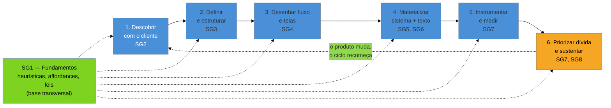

# Capstone: do requisito ao produto validado

> [!abstract] TL;DR
> As 48 notas anteriores estão organizadas por **disciplina** — pesquisa, arquitetura de informação, interação, linguagem visual, texto, métrica, ética — porque é assim que o campo de UX se organiza de verdade, e fidelidade ao mapa da área importa. O risco dessa escolha é o domínio virar **oito prateleiras** sem uma ordem de visita. Este capstone é a mitigação: um projeto genérico e hipotético, percorrido do requisito ao produto medido em produção, mostrando **em que momento cada disciplina entra, que decisão ela resolve, e o que quebra se ela for pulada**. O fio que atravessa o percurso inteiro é a tese que abriu o domínio ([[03-Dominios/Engenharia/UX/Fundamentos e Modelo Mental/01 - UX não é tela - o ofício e seus limites|nota 01]]) e que a nota mais avançada do domínio nomeia sem rodeio ([[03-Dominios/Engenharia/UX/Medir, Validar e Sustentar/42 - Quando A-B não se aplica|nota 42]]): cliente único, B2B com poucos usuários, tráfego baixo e ausência de time **não são exceção, são a condição estrutural** do fractional engineer full-cycle — e cada disciplina deste domínio existe numa versão dimensionada para essa condição, não numa versão de departamento de produto de Big Tech.

Imagine o projeto mais comum de quem trabalha como engenheiro fractional: uma distribuidora B2B de médio porte contrata você para construir um **portal de cadastro de fornecedores** — hoje o processo roda por planilha e e-mail, e o setor de compras quer algo "mais profissional, tipo um sistema de verdade". O contato é sempre com a gerente de compras, que já tem uma ideia clara de como o sistema deveria funcionar e chega à primeira reunião com um wireframe pronto. Você tem seis semanas, nenhum designer, nenhum pesquisador, nenhum analista de dados — só você, o requisito e o prazo. Esse é o cenário que percorre a nota inteira: hipotético do início ao fim, sem dado de projeto ou cliente real, mas fiel ao formato que o restante do domínio descreve.

## O percurso, de ponta a ponta

O SG1 não aparece como uma etapa isolada porque ele não é uma — é o vocabulário que sustenta uma decisão em qualquer um dos seis passos: as [[03-Dominios/Engenharia/UX/Fundamentos e Modelo Mental/03 - As 10 heurísticas de Nielsen|10 heurísticas de Nielsen]] informam tanto a entrevista de descoberta quanto a revisão de tela; as [[03-Dominios/Engenharia/UX/Fundamentos e Modelo Mental/04 - Leis de UX - Fitts, Hick, Jakob, Miller, Peak-End|leis de UX]] explicam por que um formulário de 14 campos assusta antes mesmo de o usuário ler o primeiro; a distinção entre [[03-Dominios/Engenharia/UX/Fundamentos e Modelo Mental/02 - Affordances e signifiers|affordance e signifier]] é o motivo pelo qual um `
` "parece" clicável mas não se comporta como tal. Ele não tem seção própria abaixo porque atravessa todas as outras.

## 1 — Descobrir com o cliente (SG2)

A gerente de compras chega com um wireframe pronto: um formulário de 18 campos numa única tela, "porque é mais rápido cadastrar tudo de uma vez". O primeiro instinto de quem vem de engenharia é aceitar o requisito como está e começar a construir — afinal, o requisito parece completo, tem campo, tem regra de validação implícita, tem prioridade. É exatamente aqui que a [[03-Dominios/Engenharia/UX/Descoberta e Pesquisa/08 - Cliente não é usuário - a armadilha do B2B e consultoria|nota 08]] entra: a gerente de compras **aprova** o sistema, mas não é ela quem vai preenchê-lo — são os próprios fornecedores, gente de fora da empresa, sem vínculo algum com o processo interno, respondendo um formulário de cadastro num contexto que não controlam. Pedir, já no kickoff, 20 minutos com 3-5 fornecedores reais — o item de escopo que a nota 08 descreve como negociação de contrato, não detalhe de execução — é o que separa este passo de aceitar o wireframe como está.

A ferramenta que operacionaliza essa conversa é o [[03-Dominios/Engenharia/UX/Descoberta e Pesquisa/07 - Entrevista de descoberta - as regras do Mom Test|Mom Test]] (nota 07): perguntar sobre o comportamento passado do fornecedor — como ele cadastra dados hoje, quanto tempo leva, onde trava — em vez de perguntar se ele "gostaria" de um portal novo, porque a segunda pergunta sempre recebe uma resposta educada e inútil. E a pergunta que a [[03-Dominios/Engenharia/UX/Descoberta e Pesquisa/06 - Generativa vs avaliativa|nota 06]] força a fazer antes de qualquer coisa: o wireframe da gerente já é uma solução — pesquisa **avaliativa** de uma resposta pronta. Sem antes rodar a fase **generativa** ("por que o fornecedor evita o processo atual? o que ele faz hoje sem o portal?"), o risco é testar bem construída a coisa errada. Se as premissas por trás do wireframe (18 campos numa tela é rápido; fornecedores vão preencher tudo de uma vez; o gargalo é a interface, não o processo) precisam de checagem antes de virar decisão de arquitetura, o [[03-Dominios/Engenharia/UX/Descoberta e Pesquisa/11 - Assumption mapping|assumption mapping]] (nota 11) é o quadro de 30-60 minutos que ordena qual delas testar primeiro — a mais importante e menos comprovada, não a mais fácil.

**O que quebra se este passo for pulado:** o portal nasce moldado à conveniência de quem aprova, não à realidade de quem preenche — o mesmo padrão do Cenário 1 dos Casos práticos abaixo.

## 2 — Definir e estruturar (SG3)

Com o problema real na mão — digamos que a descoberta revelou que fornecedores abandonam formulários longos e preferem retomar de onde pararam —, a próxima decisão não é de tela, é de **estrutura**: como o conteúdo do cadastro se organiza, se rotula e se navega. A [[03-Dominios/Engenharia/UX/Arquitetura de Informação/15 - Os 4 sistemas da AI|nota 15]] nomeia os quatro sistemas — organização, rotulação, navegação e busca — e insiste num ponto que a maioria dos engenheiros pula: eles precisam existir **antes** das rotas do produto, não depois. É tentador, com o schema do banco de fornecedores já desenhado (empresa, contatos, documentos, categorias de produto, endereços), simplesmente espelhar essas tabelas em abas de menu — e é exatamente esse atalho que a [[03-Dominios/Engenharia/UX/Arquitetura de Informação/16 - Schema de banco não é estrutura de navegação|nota 16]], a nota mais forte do sub-galho, nomeia como o erro mais comum de quem vem de engenharia: o fornecedor não pensa em "endereços" e "categorias de produto" como entidades separadas — pensa na tarefa "terminar meu cadastro", e uma navegação que espelha o JOIN do banco em vez da tarefa do usuário passa no code review e falha na tela.

**O que quebra se este passo for pulado:** o portal "tem tudo", mas ninguém encontra nada — o schema relacional está correto e a arquitetura de informação, mesmo assim, é péssima, porque nenhuma das duas falhas aparece no mesmo lugar.

## 3 — Desenhar fluxo e telas (SG4)

Só agora — com o problema validado e a estrutura definida — faz sentido abrir uma ferramenta de design. E mesmo aqui, a primeira decisão não é visual: é o **fluxo**. A [[03-Dominios/Engenharia/UX/Design de Interação/19 - Do fluxo antes da tela - user flow como máquina de estados|nota 19]] traduz isso para quem já programa — um user flow é uma máquina de estados, com gatilho, ramificações, estado de sucesso e pontos de saída; uma tela órfã no fluxo é o mesmo bug de modelagem que um branch faltando numa state machine. Para o cadastro de fornecedores que se estende por várias sessões (a descoberta revelou isso na etapa 1), o fluxo precisa modelar explicitamente "cadastro incompleto, retomado depois" como um estado de primeira classe, não como um acidente.

Cada tela do fluxo, por sua vez, tem no mínimo cinco estados — a [[03-Dominios/Engenharia/UX/Design de Interação/20 - Os 5 estados de tela|nota 20]]: vazio, carregando, erro, parcial e sucesso. Um componente que só verifica `if (loading)` está sub-modelando o mesmo jeito que a nota 19 descreve para o fluxo inteiro — a mesma disciplina, aplicada em outra granularidade. A decisão de **container** — a confirmação de exclusão de um documento cabe num modal; o cadastro completo do fornecedor, que ele pode querer retomar ou compartilhar por link, cabe numa página com URL própria — vem da [[03-Dominios/Engenharia/UX/Design de Interação/22 - Modal vs página vs drawer|nota 22]]. E o próprio formulário de 18 campos que a gerente trouxe pronto no dia 1 é onde a [[03-Dominios/Engenharia/UX/Design de Interação/24 - Design de formulários - defaults|nota 24]] entra com mais força: uma coluna, label acima do campo, validação no blur, campos opcionais marcados — e, principalmente, quebrar 18 campos numa tela só em passos com dependência lógica, porque o abandono que a descoberta revelou na etapa 1 tem, aqui, uma causa mecânica corrigível.

**O que quebra se este passo for pulado:** mesmo com o problema certo identificado, a tela renderiza um caminho feliz sem estado de erro, sem retomada de cadastro parcial, e sem quebra do formulário longo — o produto volta a falhar, agora por uma razão diferente da etapa 1, mas com o mesmo sintoma de abandono.

## 4 — Materializar com sistema e texto (SG5, SG6)

O fluxo e as telas estão desenhados; falta decidir o que o olho vê primeiro e o que a interface diz. A [[03-Dominios/Engenharia/UX/Linguagem Visual e Design System/26 - Hierarquia visual|nota 26]] resolve a primeira pergunta com a regra que mais paga a conta: **uma ação primária por tela**, visualmente dominante — no cadastro de fornecedores, "Salvar e continuar" domina; "Salvar e sair para terminar depois" fica em texto ou outline, nunca dois botões preenchidos competindo pela mesma atenção. Para que essa hierarquia não vire decisão ad hoc tela a tela, a [[03-Dominios/Engenharia/UX/Linguagem Visual e Design System/29 - Design tokens como sistema|nota 29]] entra como o sistema que sustenta a consistência — não "ter tokens", mas a hierarquia primitivo → semântico → componente que evita token soup mesmo num projeto pequeno de seis semanas.

E, em paralelo, o texto: a [[03-Dominios/Engenharia/UX/UX Writing e Content Design/33 - Voz e tom|nota 33]] decide se o portal fala formal ou próximo com um fornecedor que pode estar cadastrando dados pela primeira vez sob pressão de prazo próprio; a [[03-Dominios/Engenharia/UX/UX Writing e Content Design/34 - Microcopy, labels de ação e jargão interno|nota 34]] garante que o botão diga "Enviar documentos" e não "OK", e que nenhum campo do banco (`status_homologacao_fornecedor`) vaze cru para a tela; a [[03-Dominios/Engenharia/UX/UX Writing e Content Design/35 - Erros - fluxo de recuperação e mensagem que não culpa|nota 35]] decide como o portal fala quando o upload de um documento falha — o que aconteceu, por que, o que fazer agora, sem culpar o fornecedor pelo formato de arquivo errado; e a [[03-Dominios/Engenharia/UX/UX Writing e Content Design/36 - Estados vazios como conteúdo|nota 36]] preenche o conteúdo do estado "cadastro ainda não iniciado" que a nota 20 já reservou como espaço — orientando o fornecedor a começar, não apenas informando que não há dados.

**O que quebra se este passo for pulado:** a arquitetura e o fluxo estão certos, mas a tela chega ao fornecedor com dois botões competindo pela mesma atenção, um erro de upload que só diz "Erro" em vermelho, e um estado vazio genérico — os mesmos sintomas de abandono da etapa 1, reintroduzidos por uma causa visual e textual em vez de estrutural.

## 5 — Instrumentar e medir (SG7)

O portal foi ao ar. A pergunta natural de quem vem de engenharia é "como eu sei se funcionou" — e o reflexo mais comum é "rodar um A/B entre a versão antiga (planilha) e a nova". Aqui o cenário do capstone bate de frente com a condição estrutural que a [[03-Dominios/Engenharia/UX/Medir, Validar e Sustentar/42 - Quando A-B não se aplica|nota 42]] nomeia: um único cliente, uma base de dezenas de fornecedores cadastrando esporadicamente — muito abaixo do piso prático de ~50 conversões/semana, e sem amostra i.i.d. (fornecedores da mesma cadeia de fornecimento compartilham instrução de como preencher). A/B formal aqui não é "mais difícil" — é estatisticamente inviável dentro do prazo do projeto. As alternativas da nota 42 — feature flag com rollout progressivo e kill switch, foco em micro-conversões (taxa de conclusão do passo 1 do cadastro, não só o cadastro completo), e pesquisa qualitativa tratada como método de primeira classe — são o desenho experimental que **cabe** neste projeto, não um consolo por não ter conseguido "o teste de verdade".

Nada disso funciona sem antes decidir **o que medir e como nomear o evento**: a [[03-Dominios/Engenharia/UX/Medir, Validar e Sustentar/38 - HEART e Goals-Signals-Metrics|nota 38]] fornece o vocabulário (aqui, Task Success — taxa de conclusão do cadastro — é a categoria que mais importa; Happiness, via um SEQ pós-tarefa, é a segunda) e o processo GSM que traduz o objetivo em prosa ("reduzir abandono de cadastro") numa métrica específica e comparável no tempo. E toda essa métrica depende de eventos nomeados de forma consistente — a [[03-Dominios/Engenharia/UX/Medir, Validar e Sustentar/41 - Instrumentação - event taxonomy e tracking plan|nota 41]] entra antes do lançamento, não depois, porque instrumentar retroativamente um evento como `cadastro_fornecedor_etapa_concluida` depois que o produto já está em produção é reconstruir dado que deveria ter sido capturado desde o dia 1.

**O que quebra se este passo for pulado:** o time descobre, seis meses depois, que não tem como saber se o novo portal reduziu abandono — porque não instrumentou nada, e a pergunta "funcionou?" fica sem resposta verificável, só opinião.

## 6 — Priorizar a dívida e sustentar (SG7, SG8)

O portal está no ar, medido, e imperfeito — como todo produto real. A pergunta final não é "terminamos?", é "o que fazemos com o que sabemos agora que não sabíamos no dia 1?". A [[03-Dominios/Engenharia/UX/Medir, Validar e Sustentar/44 - UX debt e matriz severidade x esforço|nota 44]] trata cada achado pós-lançamento — um ticket de suporte recorrente sobre o campo de CNPJ, uma reclamação sobre o upload de documento — com a mesma disciplina de dívida técnica: severidade × esforço, quick wins primeiro, money pits evitados. Sustentar essa disciplina além do primeiro sprint depende de processo, não de boa vontade — a [[03-Dominios/Engenharia/UX/Ética e Ofício/47 - UX no ciclo de dev|nota 47]] descreve isso como uma Definition of Done que inclui estado de erro e estado vazio, não só o caminho feliz, e um gate de CI que barra regressão visual antes do merge, para que o trabalho das etapas 3 e 4 não se degrade silenciosamente no primeiro deploy seguinte.

E há uma pergunta ética que só aparece depois que o produto está em produção e sob pressão de métrica: se a taxa de conclusão de cadastro estagna, a tentação de "melhorar o número" via fricção deliberada — pré-marcar uma opção, esconder o botão de cancelar cadastro — é exatamente o que a [[03-Dominios/Engenharia/UX/Ética e Ofício/46 - Dark patterns e regulação|nota 46]] nomeia como risco legal e de carreira, não só estético, porque não há um time de design entre o pedido do cliente e o código: quem implementa é quem responde.

**O que quebra se este passo for pulado:** a dívida de UX se acumula silenciosamente até o produto ficar irreconhecível de manter, ou — pior — a pressão por métrica sem um freio ético nomeado empurra uma correção de curto prazo para dentro do território de dark pattern sem que ninguém tenha decidido isso conscientemente.

## Praticável sozinho vs. exige time

Nenhuma das seis etapas acima muda de forma quando é uma pessoa só executando — mas cada uma tem uma versão dimensionada para escala de um, e reconhecer qual versão você está praticando é o que separa UX real de UX fingida. Na descoberta, três a cinco conversas de 20 minutos com fornecedores reais, seguindo o Mom Test, cabem inteiras numa pessoa e num orçamento de horas, não de semanas; o que não cabe é um estudo de adoção com amostra estatisticamente representativa, ou um programa de research ops contínuo — esses exigem uma estrutura que o projeto de seis semanas do capstone nunca teve e não devia fingir ter. Na definição e no fluxo, os quatro sistemas da AI e o desenho de estados de tela são trabalho de raciocínio e papel — Excalidraw, Mermaid, ou um quadro físico bastam, e o card sorting de guerrilha com 5 fornecedores substitui, com rigor suficiente para o risco em jogo, uma pesquisa de arquitetura de informação formal que a maioria dos projetos deste porte jamais teria orçamento para contratar.

Na materialização, um mini design token set de uma dúzia de valores semânticos e um style-guide de voz de meia página são inteiramente solo; o que exige time é a governança formal de design system multi-produto — desnecessária aqui, porque não há um segundo produto para governar em conjunto. Na medição, o ponto mais contra-intuitivo do percurso: o rollout progressivo com feature flag, que parece "coisa de time de plataforma grande", é na verdade a ferramenta certa para quem está sozinho, porque o critério de avanço/recuo é uma decisão que você documenta uma vez, antes de começar, e o kill switch limita o dano de um resultado ruim sem exigir ferramental estatístico sofisticado; o que genuinamente exige apoio externo é a análise bayesiana formal, ou controlar por variável de confusão quando duas mudanças acontecem ao mesmo tempo — matéria que a maioria dos engenheiros fractional não carrega por padrão. Por fim, na sustentação, estender a própria Definition of Done e automatizar um gate de contraste no CI é trabalho de configuração, não de equipe; o que exige gente além de você é decidir se um padrão de interface cruza a linha para dark pattern quando o risco regulatório é real — essa é precisamente a categoria de decisão irreversível e cara que a [[03-Dominios/Engenharia/UX/Fundamentos e Modelo Mental/01 - UX não é tela - o ofício e seus limites|nota 01]] já havia isolado como "chame um especialista", e o capstone confirma que ela reaparece, sem exceção, no fim do ciclo — não só no começo.

## Casos práticos

### Cenário 1: o wireframe que virou requisito sem passar pela descoberta
A gerente de compras chega com um wireframe pronto e pede para "só implementar". O engenheiro, sob pressão de prazo, aceita o requisito como está e constrói exatamente o formulário de 18 campos numa tela só. Três semanas após o lançamento, a taxa de conclusão de cadastro está em 22% — a maioria dos fornecedores abre o link, vê o tamanho do formulário e fecha a aba. Uma rodada de descoberta feita tarde demais (só depois da reclamação da gerente sobre o número baixo) revela o que a etapa 1 deste capstone deveria ter revelado antes: os fornecedores acessam o link do celular, entre uma entrega e outra, e nunca têm 15 minutos contínuos disponíveis. O erro não foi de execução — o formulário funciona, valida, salva. O erro foi pular a etapa 1 (SG2) e tratar o wireframe da gerente como se já fosse o problema resolvido, em vez de uma hipótese a testar.

### Cenário 2: o menu que espelhou o schema e ninguém achou o próprio cadastro
Sem passar pela etapa 2 deste percurso, o engenheiro organiza o menu do portal seguindo as tabelas do banco: "Empresas", "Contatos", "Documentos", "Categorias". Um fornecedor que quer simplesmente "terminar meu cadastro" não sabe em qual dessas quatro abas está o que falta — porque a tarefa dele não mapeia 1:1 para nenhuma tabela isolada, ela atravessa as quatro. O suporte começa a receber a mesma pergunta todo dia: "onde eu termino meu cadastro?". A correção — reorganizar o menu em torno da tarefa ("Meu cadastro", com um indicador de progresso, em vez de uma aba por entidade) — não exigiu nenhuma tabela nova no banco, só uma arquitetura de informação desenhada a partir de como o fornecedor pensa, não de como o schema está normalizado.

### Cenário 3: o A/B forçado que consumiu três semanas sem responder nada
Ao notar que a taxa de conclusão está baixa mesmo após as correções das etapas 3 e 4, a equipe decide "rodar um A/B" entre duas versões do formulário — porque parece o jeito metodologicamente correto de decidir. Depois de três semanas, o teste acumulou 19 conclusões de cadastro ao todo, entre as duas variantes, longe de qualquer significância estatística possível, e concentradas em dois fornecedores que cadastram com mais frequência que os demais — quebrando a premissa de amostra independente antes mesmo de o teste terminar. A correção, alinhada com a etapa 5 deste capstone: abandonar o A/B formal, rodar um teste de usabilidade guerrilha com 5 fornecedores usando as duas versões do fluxo, e aplicar um SEQ pós-tarefa — resposta clara em uma semana, com uma amostra que, numa base pequena de fornecedores ativos, representa uma fração real e substancial do total.

## Armadilhas comuns

> [!warning] Tratar o capstone como um checklist a seguir na ordem exata
> **O que acontece:** o engenheiro trata as seis etapas como um pipeline rígido — descoberta 100% completa antes de tocar em arquitetura, arquitetura 100% fechada antes de abrir uma ferramenta de design — e trava o projeto esperando "terminar" uma etapa que nunca termina de verdade. **Por quê:** o percurso deste capstone é narrado em sequência para ficar didático, mas na prática real as etapas se sobrepõem e retroalimentam — uma descoberta feita durante o desenho de fluxo (um fornecedor comentando algo no teste de usabilidade da etapa 3) pode revisar uma decisão de arquitetura da etapa 2, e isso é saudável, não um sinal de processo quebrado. **Como evitar:** trate a ordem como prioridade de atenção, não como porta fechada — é raro voltar da etapa 5 para redesenhar a etapa 2 do zero, mas é comum e correto ajustar uma etapa anterior quando a seguinte revela algo novo.

> [!warning] Pular direto para a etapa que "parece" mais parecida com programar
> **O que acontece:** sob pressão de prazo, o engenheiro pula a descoberta (etapa 1) e a estruturação (etapa 2) — que parecem "trabalho de outra área" — e começa direto pela etapa 3, desenhando fluxo e tela, porque é a parte que mais se parece com o trabalho de todo dia. **Por quê:** as etapas 1 e 2 exigem conversa e raciocínio sem código na tela, o que gera a sensação de "não estar produzindo" — mas são exatamente as etapas que decidem se o que vai ser construído nas etapas 3-4 resolve o problema certo. **Como evitar:** trate as etapas 1 e 2 como parte do "construir", com o mesmo peso de prioridade que a etapa 3 — a mesma advertência que a [[03-Dominios/Engenharia/UX/Fundamentos e Modelo Mental/01 - UX não é tela - o ofício e seus limites|nota 01]] já fazia na abertura do domínio.

> [!warning] Achar que o ciclo "termina" quando o produto vai ao ar
> **O que acontece:** a etapa 6 (priorizar dívida e sustentar) é tratada como um apêndice opcional, e o time se dispersa para o próximo projeto assim que o lançamento acontece. **Por quê:** o lançamento parece o fim natural de um projeto de consultoria — mas UX debt, igual dívida técnica, continua acumulando a cada mudança seguinte, com ou sem ninguém olhando. **Como evitar:** feche o ciclo explicitamente com o cliente — combine, antes do lançamento, quem revisa a matriz de dívida e com que frequência, mesmo que seja você mesmo, uma vez por mês, com uma hora reservada.

## Como explicar em inglês

> "This capstone doesn't summarize the domain — it sequences it. A generic, hypothetical project — a supplier onboarding portal for a single B2B client — walks through all eight sub-branches in the order a real project actually needs them: discover with the client, define and structure, design flow and screens, materialize with system and text, instrument and measure, then prioritize debt and sustain. Each stage names the decision it resolves and what breaks if you skip it. The thread running through all six stages is the same one that opened the domain: a single client, low traffic, and no team aren't bad luck — they're the structural condition of fractional full-cycle work, and every discipline here has a version sized for exactly that."

| PT | EN |
|----|----|
| percurso executável | executable path |
| requisito ao produto validado | requirement to validated product |
| o que quebra se pular | what breaks if skipped |
| condição estrutural | structural condition |
| praticável sozinho | practicable solo |
| exige time | requires a team |
| ciclo, não pipeline | cycle, not a pipeline |

## O que vem a seguir

Este é o fim do domínio de UX — você percorreu o ofício do modelo mental (SG1) à sustentação em produção (SG8), e agora tem o roteiro mental que aplica a qualquer projeto novo que aterrissar na sua frente. Os caminhos naturais a partir daqui:

- [[03-Dominios/Engenharia/UX/index|Índice do domínio]] — revisitar qualquer sub-galho fora de ordem.
- [[03-Dominios/Engenharia/UX/Ética e Ofício/48 - UX em entrevista sênior e staff|48 — UX em entrevista sênior e staff]] — transformar este percurso inteiro numa história de entrevista estruturada em STAR.
- [[03-Dominios/Tecnologia/Acessibilidade/index|Tecnologia/Acessibilidade]] — a camada técnica que garante que cada decisão tomada neste percurso seja operável por qualquer pessoa, não só bem desenhada.

## Fontes

Esta nota não introduz fonte nova — ela costura as 48 notas do domínio, cada uma já citada com sua fonte original no ponto em que aparece no percurso. As duas fontes estruturais que sustentam a tese central (cliente ≠ usuário; tráfego baixo/B2B como condição, não exceção) estão detalhadas em:

- [[03-Dominios/Engenharia/UX/Descoberta e Pesquisa/08 - Cliente não é usuário - a armadilha do B2B e consultoria|nota 08]] — fontes: Nielsen Norman Group; Teresa Torres, *Continuous Discovery Habits*.
- [[03-Dominios/Engenharia/UX/Medir, Validar e Sustentar/42 - Quando A-B não se aplica|nota 42]] — fontes: literatura de mercado sobre limites práticos de A/B em baixo tráfego; Rosie Hoggmascall (Experiment Nation).

> [!note] Sem mídia embutida nesta nota — pendência em aberto, não conclusão de busca
> Diferente dos outros quatro buracos de mídia do domínio (onde uma busca de fato rodou e não achou material verificável), aqui **a busca não chegou a ocorrer**: a cota de `WebSearch` da sessão já estava esgotada (200/200) antes desta task começar, e uma tentativa via `yt-dlp ytsearch:` foi descartada porque esse método não triangula bem candidatos para um tema tão específico sem busca textual prévia — o risco de embutir um vídeo genérico de "processo de UX", desalinhado com a tese cliente-único/B2B/baixo-tráfego deste domínio, pareceu pior que documentar a lacuna. Isto é **tarefa pendente**, não "não existe material" — quem retomar deve rodar `WebSearch` (ou `yt-dlp ytsearch:` com busca textual prévia) com termos como "B2B UX process discovery to shipped product", "fractional product design end-to-end workflow" ou "UX process from requirement to validated launch", conferir duração via `yt-dlp --print duration_string`, e só então decidir se algum resultado cobre a sequência específica deste capstone.
