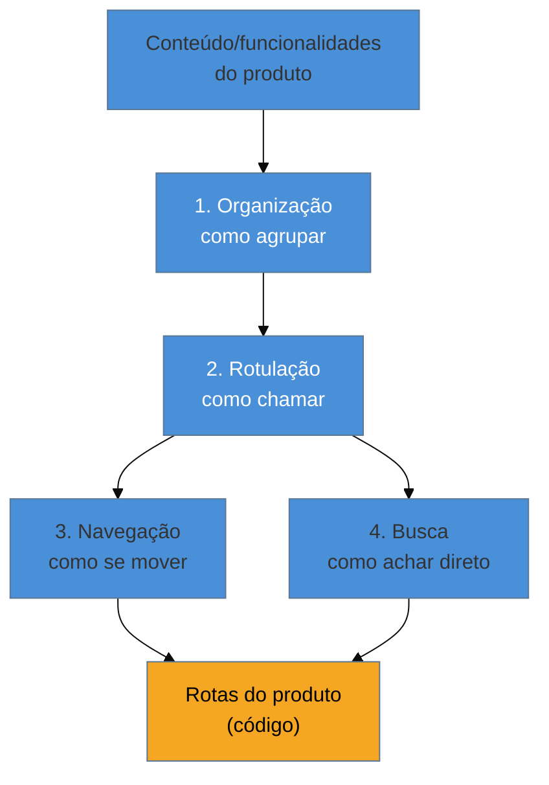

# Os 4 sistemas da AI

> [!abstract] TL;DR
> Toda arquitetura de informação (AI) — do site institucional mais simples ao produto SaaS mais complexo — se decompõe em **quatro sistemas**: **organização** (como agrupar o conteúdo), **rotulação** (como chamar as coisas), **navegação** (como o usuário se move) e **busca** (como ele encontra direto). O texto de referência do campo é **Rosenfeld & Morville, *Information Architecture for the Web and Beyond*** — o "polar bear book" (1ª ed. 1998; 4ª ed. 2015, com Jorge Arango). A ponte prática para quem já programa: os 4 sistemas precisam existir **antes** de você decidir as rotas do produto — a AI precede o roteamento, nunca o contrário. Menu que cresce feature a feature, sem os 4 sistemas desenhados antes, é o motivo mais comum de "o produto tem tudo, mas ninguém acha".

Imagine que você está construindo a versão 2 de um painel administrativo interno. A cada sprint, uma feature nova entra em produção, e a rotina de deploy inclui sempre o mesmo passo final: "adiciona um item no menu lateral apontando pra rota nova". Depois de dez meses, o menu lateral tem 31 itens, listados na ordem em que foram construídos — sem categoria, sem hierarquia, sem nenhuma lógica visível além de "quando isso foi feito". Um usuário novo do time de operações pede ajuda pra achar a tela de "reprocessar pagamento com falha", e ninguém consegue apontar de cabeça — inclusive quem construiu a tela seis meses atrás. A busca do sistema, que só indexa título exato de página, não ajuda: ele não sabe que o nome interno da funcionalidade é "retry de settlement". O produto tem a feature. Ninguém a encontra. Esse é o sintoma clássico de pular os 4 sistemas e ir direto para "adicionar mais um item no menu" — decisão tomada dez vezes, nunca desenhada uma vez só.

## De onde vêm os 4 sistemas

**Louis Rosenfeld e Peter Morville** publicaram em 1998 a primeira edição de *Information Architecture for the Web*, apelidado "polar bear book" pela capa (um urso polar, na tradição de capas de animais da O'Reilly). O livro nomeou e organizou uma prática que já existia de forma dispersa — bibliotecários, arquitetos e designers de interface resolvendo o mesmo problema (como organizar grandes volumes de informação para que alguém encontre o que precisa) sem vocabulário compartilhado. A 4ª edição (2015), com **Jorge Arango** como coautor, atualizou o livro para web responsiva, mobile e "beyond" — produtos físicos, ecossistemas multi-canal — mas a estrutura central de quatro sistemas, definida ainda na edição de 1998, se manteve praticamente intacta. É raro, num campo que muda tão rápido quanto interface digital, um framework de 1998 continuar sendo o texto de referência quase 30 anos depois — isso por si só é um sinal de que o problema que ele resolve é estrutural, não uma moda de época.

Os quatro sistemas:

1. **Organização** — como o conteúdo é agrupado e categorizado. É a decisão mais estrutural: por tópico, por audiência, por tarefa, por formato, cronologicamente. Toda AI ruim tem uma decisão de organização mal pensada na raiz.
2. **Rotulação** (*labeling*) — como cada agrupamento e cada item é chamado. Um rótulo bom comunica o conteúdo antes de o usuário clicar; um rótulo ruim exige que ele clique para descobrir o que há lá dentro (custo de "click cego").
3. **Navegação** — os mecanismos que permitem o usuário se mover entre os agrupamentos: menus, breadcrumbs, links contextuais, filtros. É a *exposição* do sistema de organização — não um sistema independente dele.
4. **Busca** — o mecanismo de encontrar diretamente, sem navegar pela estrutura. Depende de metadado e indexação bem feitos; sem organização e rotulação sólidas por baixo, a busca também falha (ver Armadilha abaixo).

O diagrama mostra a ordem de dependência real, e é essa ordem que o cenário de abertura inverteu: as rotas (o código, a parte que um engenheiro naturalmente projeta primeiro) deveriam ser a **última** coisa decidida, depois que organização e rotulação já existem explicitamente. Quando a ordem se inverte — rota nova, depois item de menu, depois nome do item — cada decisão de AI é tomada isoladamente, sem nenhuma delas conversar com as anteriores. O menu de 31 itens do cenário de abertura é exatamente esse efeito acumulado: 31 decisões de rotulação e navegação, cada uma correta isoladamente no dia em que foi tomada, e coletivamente incompreensíveis.

> [!question]- Isso não é só "desenhar um bom menu"? Por que quatro sistemas separados?
> Porque cada um falha de um jeito diferente, e a correção de um não conserta o outro. Um menu bem desenhado (navegação boa) sobre uma organização ruim ainda confunde — o usuário navega bem por uma estrutura que não faz sentido. Um rótulo claro (rotulação boa) sobre uma organização ruim também não resolve — "Configurações Avançadas de Sistema" pode ser um rótulo perfeitamente claro para uma categoria que, na verdade, deveria ter sido duas categorias separadas. Separar os quatro sistemas obriga a diagnosticar qual deles está realmente quebrado antes de tentar consertar — em vez de reformular o menu (navegação) quando o problema de verdade está na organização por baixo dele.

## Rotulação é onde AI e content design se encontram

O segundo sistema — rotulação — é o ponto de contato mais direto entre arquitetura de informação e o trabalho de escrita de interface. Um rótulo de menu, de categoria ou de item de navegação é, ao mesmo tempo, uma decisão de AI (em que grupo esse item vive) e uma decisão de microcopy (que palavra exata representa esse grupo para quem usa o produto, não para quem o construiu). Um glossário de termos do produto — os nomes que o time interno usa versus os nomes que o usuário reconhece — é insumo direto e obrigatório do sistema de rotulação: sem ele, cada rótulo é decidido isoladamente, com o vocabulário que estiver mais na cabeça de quem está escrevendo o texto naquele dia. Ver [[03-Dominios/Engenharia/UX/UX Writing e Content Design/34 - Microcopy, labels de ação e jargão interno|nota 34]] para o tratamento completo do problema de vocabulário na superfície do texto — aqui o ponto é só a ponte: rotulação de AI e microcopy resolvem, de ângulos diferentes, o mesmo problema de nomeação.

> [!tip] Vídeo — Como desenhar sitemap e hierarquia antes da navegação
> **Donna Spencer**, information architect e autora de referência em card sorting, explica em vídeo curto como desenhar o sitemap e escolher o esquema de classificação (por tópico, por audiência, por tarefa, por geografia, por formato) **antes** de desenhar a navegação — a mesma ordem de dependência que o diagrama acima mostra, com exemplos concretos de hierarquia rasa vs profunda. Ela nomeia explicitamente a armadilha do esquema por audiência (as pessoas não se veem como "audiência B" ou "audiência C") e do esquema por tarefa (a maior parte do que as pessoas fazem num produto não cabe num verbo limpo).
>
> 🎬 [Information architecture and sitemaps: How to design navigation](https://www.youtube.com/watch?v=SjbQ21klQP8) — Donna Spencer, ~9min, EN.

## Praticável sozinho vs exige time

Desenhar os quatro sistemas explicitamente — mesmo que informalmente, num documento de uma página antes de abrir o editor de código — é totalmente praticável por uma pessoa só, e é justamente o que o cenário de abertura pulou. Escrever a lista de todo o conteúdo/funcionalidade existente, decidir um esquema de organização (por tarefa costuma servir melhor para produtos internos e ferramentas do que por audiência ou por formato — ver a armadilha do esquema por audiência no vídeo acima), nomear cada grupo com o vocabulário do usuário e só então desenhar o menu: isso é trabalho de uma tarde, não de uma pesquisa formal. O sistema de busca simples (indexação de título e sinônimos conhecidos) também cabe numa pessoa só, contanto que a lista de sinônimos seja mantida — cada novo termo interno que o time usa deve virar uma entrada no glossário, não ficar preso na cabeça de quem escreveu o código.

O que exige estrutura é a **governança contínua** desse sistema numa organização com múltiplos times publicando conteúdo ou funcionalidade — garantir que um time novo, seis meses depois, não reintroduza o mesmo problema do cenário de abertura porque ninguém revisou a decisão de organização contra o conteúdo novo. Também exige mais que uma pessoa a **reestruturação de AI já em produção**, com milhares de usuários acostumados à estrutura antiga: aqui a decisão de organização já não é livre — ela precisa de um plano de migração de rotas, redirects, comunicação e, em produtos públicos, cuidado com SEO, o que é tratado com mais profundidade na [[03-Dominios/Engenharia/UX/Arquitetura de Informação/17 - Card sorting e tree testing de guerrilha|nota 17]].

## Casos práticos

### Cenário 1: o menu de 31 itens sem hierarquia (revisitado)
O cenário de abertura, com a correção aplicada: antes de adicionar mais nada ao menu, o time para por uma tarde e lista as 31 funcionalidades existentes num documento simples. Aplicando um esquema de organização por tarefa (o que o usuário está tentando fazer: "processar", "consultar", "configurar", "auditar"), as 31 entradas caem em 5 grupos naturais, com no máximo 8 itens cada. A tela de "retry de settlement" — antes invisível na lista plana — vira claramente um item dentro do grupo "processar", com o rótulo revisado para "Reprocessar pagamento com falha" (o vocabulário do usuário, não o nome interno "retry de settlement"). Nenhuma linha de código de rota mudou; só a organização e a rotulação em cima delas.

### Cenário 2: o rótulo "Gerenciamento de Entidades" que ninguém clica
Um engenheiro constrói a tela de administração de um cadastro central do sistema (a tabela `entities` no banco) e nomeia o item de menu exatamente como pensa nela internamente: "Gerenciamento de Entidades". A tela existe, funciona, e o time de operações — que deveria usá-la todo dia para cadastrar novos parceiros comerciais — simplesmente não sabe que ela existe, porque "entidade" não é uma palavra que aparece em nenhuma conversa do time de operações sobre o trabalho deles. A correção não muda nada na estrutura ou no código: troca o rótulo para "Parceiros Comerciais", o termo que o time de operações usa em toda reunião — e a taxa de uso da tela sobe imediatamente, sem nenhuma mudança de organização ou navegação, só de rotulação.

### Cenário 3: a busca que não acha porque ninguém indexou sinônimo
Um produto tem uma busca funcional — encontra qualquer página pelo título exato — mas os tickets de suporte mostram usuários buscando "cancelar assinatura" e não achando nada, porque a página se chama internamente "Gerenciar plano". A busca está tecnicamente correta: ela encontra o que existe com o termo que existe. O problema é de rotulação e de metadado, não de busca: sem um dicionário de sinônimos ("cancelar assinatura" → página "Gerenciar plano"), a busca herda o mesmo vocabulário interno que já confundiu o usuário na navegação. A correção — adicionar 4-5 sinônimos comuns de vocabulário de suporte à indexação da página — resolve em uma tarde, sem reescrever a busca.

## Armadilhas comuns

> [!warning] Rótulo interno virando rótulo de usuário
> **O que acontece:** o nome de uma entidade, tabela ou campo do modelo de dados interno vira, sem tradução, o rótulo que o usuário vê — "Entidade", "Registro", "Cadastro Mestre". **Por quê:** para quem construiu a feature, o nome interno já é intuitivo — foi ele que o escolheu, e é o nome que aparece em toda conversa técnica sobre a feature. Ninguém para para perguntar se esse é o vocabulário de quem usa o produto, não de quem o constrói. **Como evitar:** todo rótulo de navegação passa pelo glossário de termos do produto antes de ir ao ar — ver [[03-Dominios/Engenharia/UX/UX Writing e Content Design/34 - Microcopy, labels de ação e jargão interno|nota 34]]. Se o rótulo não aparece em nenhuma frase que um usuário real diria sobre o produto, ele é candidato a revisão.

> [!warning] Navegação que cresce por acreção
> **O que acontece:** cada feature nova ganha um item de menu no momento em que é construída, sem revisão da estrutura como um todo — como no cenário de abertura, dez meses até virar 31 itens sem hierarquia. **Por quê:** adicionar um item é uma decisão local, rápida e barata no momento; reorganizar a estrutura inteira parece cara e sem dono claro, então nunca é priorizada — até que o custo acumulado (ninguém acha nada) se torna óbvio demais para ignorar. **Como evitar:** trate "esse item de menu se encaixa na organização atual, ou a organização precisa mudar?" como pergunta obrigatória de PR, não como revisão trimestral opcional. Rever a organização a cada 8-10 itens novos custa uma hora; rever depois de 31 custa um projeto inteiro.

> [!warning] Confiar na busca para compensar AI ruim
> **O que acontece:** o time investe em melhorar a busca — mais sinônimos, busca fuzzy, IA generativa por cima — para compensar uma navegação confusa, em vez de consertar a organização e a rotulação por baixo. **Por quê:** busca é um dos quatro sistemas, não um curativo para os outros três. Uma busca ótima sobre uma organização ruim ainda deixa o usuário sem conseguir *navegar* — ele encontra a página que buscou, mas continua sem entender onde ela vive dentro do produto, e perdido na próxima vez que precisar voltar sem lembrar o termo exato de busca. **Como evitar:** trate melhorias de busca como complemento à organização e à rotulação, nunca como substituto delas. Se o usuário só encontra as coisas buscando, e nunca navegando, isso é sinal de que os sistemas 1 e 2 (organização e rotulação) estão quebrados, não que o sistema 4 precisa de mais investimento.

## Como explicar em inglês

> "Information architecture breaks down into four systems: **organization** (how content is grouped), **labeling** (what things are called), **navigation** (how users move around), and **search** (how they find things directly) — the classic framework from Rosenfeld & Morville's *Information Architecture for the Web and Beyond*. The practical translation for an engineer: these four systems need to exist **before** you design your routes, not after. A menu that grows one item per feature, with no organizing scheme behind it, is the single most common reason a product 'has everything but nobody can find anything.'"

| PT | EN |
|----|----|
| arquitetura de informação (AI) | information architecture (IA) |
| organização | organization scheme |
| rotulação | labeling system |
| navegação | navigation system |
| busca | search system |
| navegação por acreção | navigation by accretion |
| rótulo interno vazando | internal label leaking |
| esquema de classificação | classification scheme |

## O que vem a seguir

Os quatro sistemas explicam *o quê* precisa existir. A próxima nota entra no erro mais específico e mais comum deste público — engenheiros que constroem produtos B2B/internos — na hora de decidir o sistema de organização: usar o modelo de dados como se fosse automaticamente o modelo de navegação.

- [[03-Dominios/Engenharia/UX/Arquitetura de Informação/16 - Schema de banco não é estrutura de navegação|16 — Schema de banco não é estrutura de navegação]] — por que um schema relacional ótimo pode produzir uma AI péssima.
- [[03-Dominios/Engenharia/UX/Arquitetura de Informação/17 - Card sorting e tree testing de guerrilha|17 — Card sorting e tree testing de guerrilha]] — como validar organização e navegação antes de comprometer o produto a elas.

## Fontes

- **Louis Rosenfeld e Peter Morville** — *Information Architecture for the Web* (O'Reilly, 1ª ed. 1998) — origem dos quatro sistemas (organização, rotulação, navegação, busca), o "polar bear book".
- **Louis Rosenfeld, Peter Morville e Jorge Arango** — *[Information Architecture: For the Web and Beyond](https://www.oreilly.com/library/view/information-architecture-4th/9781491913529/)* (O'Reilly, 4ª ed. 2015) — atualização do framework para web responsiva, mobile e produtos físicos.
- **Donna Spencer** — [*Information architecture and sitemaps: How to design navigation*](https://www.youtube.com/watch?v=SjbQ21klQP8) (vídeo) — esquemas de classificação e a ordem correta entre sitemap e navegação.
