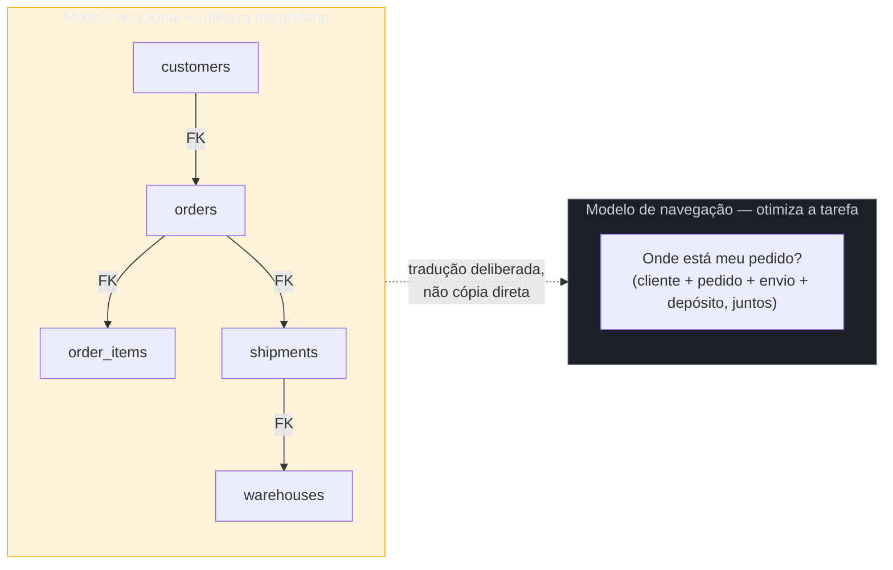

# Schema de banco não é estrutura de navegação

> [!abstract] TL;DR
> **Taxonomia** (o modelo lógico de como as coisas se relacionam entre si, muitas vezes N:N) e **navegação** (a exposição linear/hierárquica desse modelo na tela) são dois modelos diferentes, com propósitos diferentes. O erro mais comum de quem vem de engenharia e não de UX: tratar o schema do banco como se fosse automaticamente a estrutura de navegação — menu que espelha tabelas, hierarquia de menu que espelha chave estrangeira, nome de entidade interna virando item de menu. **O usuário não pensa em JOIN, pensa em tarefa.** Um schema relacional perfeitamente normalizado pode produzir uma arquitetura de informação péssima — e nenhuma das duas falhas aparece no code review, porque o código está certo; o modelo errado é o que fica exposto na tela.

Imagine que você está construindo o painel de um sistema de gestão de pedidos. O banco tem, corretamente modelado, `customers`, `orders`, `order_items`, `products`, `warehouses` e `shipments`, com chaves estrangeiras conectando tudo isso — um schema limpo, normalizado, que qualquer DBA aprovaria sem ressalva. Na hora de desenhar o menu do painel, a decisão mais natural para quem passou a semana modelando esse schema é: um item de menu para cada tabela principal. "Clientes", "Pedidos", "Produtos", "Depósitos", "Envios". Seis cliques depois, um operador do time de logística que só precisa saber "por que o pedido #4471 ainda não saiu do depósito" está clicando entre a tela de Pedidos e a tela de Depósitos, tentando cruzar manualmente informação que, no banco, já está unida numa única query com três `JOIN`s. O schema está certo. A navegação, montada em cima dele sem tradução nenhuma, obriga o usuário a fazer no cérebro o trabalho que o SQL já faz — e faz melhor.

## Dois modelos, dois propósitos

O modelo relacional existe para responder uma pergunta: **como armazenar dado sem duplicação e sem inconsistência, de um jeito que qualquer consulta futura consiga reconstruir a informação de que precisa.** Ele otimiza para integridade e flexibilidade de consulta — por isso a normalização quebra informação em tabelas menores e relacionadas por chave, em vez de guardar tudo junto e redundante. Esse é o trabalho de modelagem de dados propriamente dito, coberto com profundidade em [[03-Dominios/Ciência/Banco de Dados/04 - Modelagem e normalização|Banco de Dados]] e, na camada de construção de plataforma analítica, em [[03-Dominios/Engenharia/Dados/index|Engenharia/Dados]] — esta nota não reexplica nenhum dos dois; o ponto aqui é o contraste com o modelo seguinte, não a modelagem em si.

A arquitetura de informação existe para responder uma pergunta diferente: **como uma pessoa, com uma tarefa concreta na cabeça e nenhum conhecimento do schema, encontra o que precisa no menor número de decisões possível.** Ela otimiza para *findability* e carga cognitiva — não para integridade referencial. Essas duas otimizações não são a mesma coisa, e frequentemente **puxam em direções opostas**: o schema quer as entidades separadas e normalizadas; a navegação, na maior parte das tarefas reais, quer a informação já cruzada e apresentada junto, no contexto da tarefa que o usuário está tentando resolver.

O diagrama mostra o que o cenário de abertura pulou: a seta pontilhada entre os dois modelos precisa ser uma **tradução deliberada** — alguém decide como as cinco tabelas se recombinam em telas organizadas por tarefa — e não uma cópia automática de tabela para item de menu. Quando essa tradução não acontece, cada tabela vira um item de menu, e cada tarefa do usuário que cruza mais de uma tabela (a maioria delas, na prática) vira um exercício manual de `JOIN` feito com o cérebro e várias abas abertas.

> [!question]- Mas às vezes a estrutura do banco *é* a estrutura certa de navegação — como saber a diferença?
> Existe, sim, um subconjunto pequeno de telas onde tabela e menu coincidem razoavelmente bem: telas de administração pura, voltadas a operadores técnicos que já pensam no vocabulário do sistema — um painel de admin de banco de dados, por exemplo, onde "ver a tabela X" é literalmente a tarefa. O teste não é "essa tabela merece uma tela" (quase sempre merece, em algum admin interno) — é "essa tabela merece ser a **unidade de navegação principal** para o usuário-alvo dessa tela". Se o usuário-alvo pensa em termos de tarefa ("processar devolução", "conferir estoque antes de prometer entrega") e não em termos de entidade ("ver a tabela orders"), a tabela não deveria ser o item de menu — a tarefa deveria.

## O sintoma: três formas do mesmo erro

O erro de expor o modelo de dados como navegação aparece em três variações, todas com a mesma raiz:

1. **Menu que espelha tabelas** — um item por entidade principal do banco, na ordem em que as tabelas foram criadas ou em ordem alfabética do nome da tabela, sem agrupamento por tarefa.
2. **Hierarquia de menu que espelha chave estrangeira** — submenu de "Pedidos" dentro de "Clientes" porque `orders.customer_id` referencia `customers.id`, mesmo quando a tarefa real do usuário começa do lado do pedido, não do cliente.
3. **Nome de entidade interna virando item de menu** — o rótulo do menu é literalmente o nome da tabela ou do campo, no vocabulário do modelo de dados (`order_status`, `fulfillment_state`), em vez do vocabulário de quem opera o produto.

As três variações compartilham a mesma causa: a pessoa que desenha a navegação é, na maioria dos projetos deste público, a mesma pessoa que desenhou o schema — e a distância mental entre "eu sei exatamente como isso está guardado" e "eu esqueço como isso está guardado e penso só na minha tarefa" é maior do que parece de dentro da cabeça de quem construiu o banco.

**O mecanismo em uma frase:** o modelo relacional organiza dado para ser consultado com precisão por quem já sabe o schema; a navegação organiza a mesma informação para ser encontrada, sem saber schema nenhum, por quem só quer resolver uma tarefa — e confundir os dois modelos é o motivo mais comum de um produto tecnicamente correto e praticamente inutilizável.

## Praticável sozinho vs exige time

A tradução do modelo de dados para navegação é, quase sempre, trabalho de uma pessoa só — o obstáculo real não é falta de recurso, é lembrar de fazer a pergunta certa. Antes de desenhar o menu, listar as 5-8 tarefas mais comuns que o usuário-alvo vem resolver (não as tabelas que existem) e perguntar, para cada tarefa, quais entidades ela precisa cruzar — essa lista é o material bruto real da navegação, e cabe numa reunião de uma hora ou até numa conversa sozinho com o cliente. Escrever os rótulos no vocabulário do usuário, checando contra o glossário de termos do produto (ver [[03-Dominios/Engenharia/UX/UX Writing e Content Design/34 - Microcopy, labels de ação e jargão interno|nota 34]]), também é trabalho solo — é revisão de texto, não pesquisa de campo. E validar a hierarquia proposta com 3-5 pessoas antes de comprometer o produto a ela — um card sort ou tree test de guerrilha — cabe numa tarde, coberto em detalhe na [[03-Dominios/Engenharia/UX/Arquitetura de Informação/17 - Card sorting e tree testing de guerrilha|nota 17]].

O que exige mais do que uma pessoa é **mudar essa tradução depois que o produto já está em produção com usuários acostumados à navegação antiga** — aí a decisão deixa de ser "como desenho isso" e passa a ser "como migro isso sem quebrar rota, link salvo, analytics histórico e o hábito de quem já usa o produto todo dia". Reestruturar AI de produto grande em produção é decisão de arquitetura com plano de migração, não ajuste de tela — e normalmente envolve mais de uma pessoa decidindo o cronograma e o risco aceitável.

## Casos práticos

### Cenário 1: o painel de pedidos que virou seis cliques (revisitado)
O cenário de abertura, com a correção aplicada: em vez de um item de menu por tabela, o time lista as tarefas reais do time de logística — "acompanhar pedido em trânsito", "resolver pedido travado no depósito", "processar devolução". Cada tarefa vira uma tela que já cruza as tabelas necessárias com uma query com `JOIN` (o mesmo `JOIN` que o operador estava fazendo manualmente com os olhos entre duas abas). O schema do banco não mudou uma linha; só a camada de apresentação passou a agrupar por tarefa em vez de por tabela. A tela "Pedido em trânsito" mostra cliente, status do pedido, itens e localização do depósito juntos, porque essa é a informação que a tarefa "onde está meu pedido" precisa ao mesmo tempo — nunca a tarefa de navegar entre telas separadas de Clientes, Pedidos e Depósitos.

### Cenário 2: o submenu que segue a chave estrangeira, não a tarefa
Um sistema de RH modela `employees` e `performance_reviews` com `performance_reviews.employee_id` como FK. O engenheiro, seguindo o schema, coloca "Avaliações" como submenu dentro de "Colaboradores" — faz sentido no ERD. Só que o gestor que usa o sistema pensa no ciclo de avaliação como unidade própria: ele quer ver "quais avaliações estão pendentes neste ciclo, de todos os times", não "entrar no colaborador X e depois ver a avaliação dele". A navegação atual exige N cliques (um por colaborador) para responder a pergunta real. A correção: promover "Ciclo de Avaliações" a item de navegação de primeiro nível, independente de onde a FK aponta no schema — a tela de ciclo já faz o `JOIN` com colaboradores por baixo, sem expor a hierarquia de tabela na estrutura de menu.

### Cenário 3: o rótulo `fulfillment_state` na tela do operador
Uma tela de acompanhamento de pedido mostra, como rótulo de coluna, exatamente o nome do campo do banco: `fulfillment_state`, com valores como `PENDING_ALLOCATION` e `PARTIALLY_SHIPPED` exibidos crus. O operador de atendimento, sem contexto de engenharia, não sabe o que esses valores significam na prática e precisa perguntar a um dev toda vez que aparece um estado que ele não reconhece — um ciclo de suporte interno recorrente e evitável. A correção não muda o schema nem o enum: mapeia cada valor interno para um rótulo em linguagem de operação ("Aguardando separação", "Enviado parcialmente") numa camada de apresentação simples, com o valor técnico disponível só em modo debug para quem realmente precisa dele.

## Armadilhas comuns

> [!warning] Menu que espelha tabelas
> **O que acontece:** cada tabela principal do banco vira um item de menu de primeiro nível, na ordem de criação ou alfabética, sem nenhum agrupamento por tarefa. **Por quê:** é a decisão de menor esforço para quem já tem o ERD na cabeça — cada tabela já é uma unidade natural de "uma tela", então parece óbvio que também seja uma unidade natural de navegação. As duas coisas não são a mesma decisão. **Como evitar:** liste as tarefas reais do usuário-alvo antes de listar as tabelas; deixe a lista de tarefas guiar o menu, e trate a lista de tabelas só como inventário de dados disponíveis para compor cada tela.

> [!warning] Hierarquia de navegação que espelha chave estrangeira
> **O que acontece:** um item de menu vira submenu de outro só porque existe uma FK entre as tabelas correspondentes, mesmo quando o usuário nunca navega "de dentro" do item pai para o filho na prática. **Por quê:** o ERD já organiza as tabelas em relação pai-filho, e reaproveitar essa relação na navegação parece economizar uma decisão — mas a relação de dado (quem referencia quem) e a relação de tarefa (o que o usuário acessa a partir de onde) frequentemente divergem, como no Cenário 2. **Como evitar:** para cada relação hierárquica proposta no menu, pergunte "o usuário realmente chega no item filho *a partir* do item pai na tarefa real, ou ele chega direto?". Se chega direto na maioria das vezes, o item filho merece ser de primeiro nível.

> [!warning] Nome de entidade interna virando item de menu ou rótulo
> **O que acontece:** o rótulo visível na tela é literalmente o nome da tabela, do campo ou do valor de enum do banco — `fulfillment_state`, `PENDING_ALLOCATION`, `order_type_id = 3`. **Por quê:** o nome técnico já existe, já está no código, e escrever um rótulo novo em linguagem de usuário parece trabalho redundante — "já tem nome, pra quê outro?". O custo dessa economia aparece depois, em ticket de suporte e em confusão silenciosa de quem nunca reclama, só desiste de usar a tela. **Como evitar:** trate todo rótulo visível como texto que passa pelo glossário de termos do produto antes de ir ao ar — nunca um espelho automático do identificador interno. Ver [[03-Dominios/Engenharia/UX/UX Writing e Content Design/34 - Microcopy, labels de ação e jargão interno|nota 34]]: é o mesmo fenômeno de vazamento de jargão interno, visto aqui na superfície da estrutura em vez de na superfície do texto.

## Como explicar em inglês

> "The data model and the navigation model answer different questions: the relational schema optimizes for **data integrity and query flexibility**; navigation optimizes for **findability by someone who doesn't know the schema and only has a task in mind**. The classic mistake engineers make — mirroring tables as menu items, foreign keys as menu hierarchy, internal entity names as menu labels — happens because the same person who modeled the database usually also builds the navigation, and it feels natural to reuse the same structure. It isn't the same structure. **The user doesn't think in JOINs — they think in tasks.**"

| PT | EN |
|----|----|
| taxonomia | taxonomy |
| esquema relacional / schema de banco | relational schema |
| chave estrangeira (FK) | foreign key (FK) |
| navegação por tarefa | task-based navigation |
| vazamento de modelo de dados | data model leaking |
| glossário de termos | product terminology glossary |
| tradução deliberada | deliberate translation |

## O que vem a seguir

Reconhecer o erro é o primeiro passo; validar que a tradução ficou boa é o segundo — e é barato o suficiente para caber numa pessoa só, mesmo sem orçamento de pesquisa formal.

- [[03-Dominios/Engenharia/UX/Arquitetura de Informação/17 - Card sorting e tree testing de guerrilha|17 — Card sorting e tree testing de guerrilha]] — como testar se a navegação por tarefa proposta realmente é achável, antes de comprometer o produto a ela.
- [[03-Dominios/Engenharia/UX/Arquitetura de Informação/18 - Navegação e wayfinding|18 — Navegação e wayfinding]] — depois de organizar por tarefa, como garantir que o usuário sempre saiba onde está dentro dessa estrutura.

## Fontes

- **Louis Rosenfeld, Peter Morville e Jorge Arango** — *[Information Architecture: For the Web and Beyond](https://www.oreilly.com/library/view/information-architecture-4th/9781491913529/)* — a distinção entre esquema de organização (taxonomia) e sistema de navegação como duas camadas separadas da AI, base conceitual desta nota (ver [[03-Dominios/Engenharia/UX/Arquitetura de Informação/15 - Os 4 sistemas da AI|nota 15]]).
- **[[03-Dominios/Ciência/Banco de Dados/04 - Modelagem e normalização|Banco de Dados — Modelagem e normalização]]** — o modelo relacional que esta nota contrasta, não reexplica.
- **[[03-Dominios/Engenharia/Dados/index|Engenharia/Dados]]** — modelagem para analytics e construção de plataforma de dados, camada distinta do modelo transacional citado nesta nota.

> [!info] Sobre a mídia desta nota
> Não foi encontrado um vídeo ou palestra verificável tratando especificamente do contraste "schema de banco vs estrutura de navegação" — o tema é comum na prática, mas raro como conteúdo dedicado e citável em vídeo/podcast com transcrição. Esta nota fica sem mídia embutida por honestidade de verificação, seguindo o mesmo padrão já aceito nas notas 06 e 31 do domínio.
