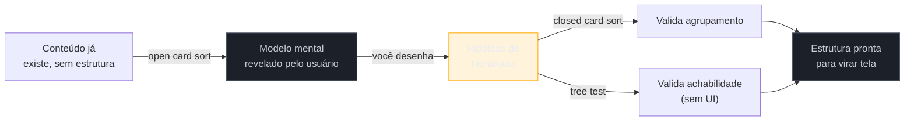

# Card sorting e tree testing de guerrilha

> [!abstract] TL;DR
> **Card sorting** e **tree testing** são os dois métodos clássicos, da mesma tradição de Rosenfeld e Morville, para validar arquitetura de informação com usuários reais em vez de opinião interna — popularizados e ferramentizados por empresas como **Optimal Workshop**. Card sorting descobre ou valida **como agrupar** conteúdo (open: o usuário nomeia as categorias; closed: valida categorias já definidas); tree testing valida se a hierarquia já desenhada é **achável**, dando uma tarefa e medindo se o usuário chega ao item certo vendo só a árvore de texto, sem UI nenhuma. O engenheiro solo raramente vai rodar isso formalmente — mas uma versão de guerrilha com **3-5 pessoas**, antes de comprometer o produto a uma estrutura de menu, é barata e evita o retrabalho mais caro que existe: mexer em navegação depois que rota, link, analytics e hábito do usuário já dependem dela.

Imagine que você acabou de desenhar, sozinho, a nova estrutura de menu de um produto interno — cinco categorias de primeiro nível, cada uma com 3-6 subitens, seguindo a lógica de organização por tarefa da [[03-Dominios/Engenharia/UX/Arquitetura de Informação/16 - Schema de banco não é estrutura de navegação|nota anterior]]. A estrutura faz sentido para você: você conhece cada funcionalidade, sabe por que agrupou do jeito que agrupou, e a lógica interna é sólida. Você implementa, faz o deploy, e duas semanas depois o time de suporte reporta um aumento de tickets do tipo "não estou achando onde fica X" — items que, na sua cabeça, estão exatamente onde deveriam estar. O problema não é que sua lógica esteja errada tecnicamente; é que ela é **a sua** lógica, construída por alguém que já sabe onde cada coisa está. Ninguém testou se a estrutura fazia sentido para quem não tem esse conhecimento prévio — e o primeiro teste real acabou sendo a produção inteira, ao custo de uma rodada de retrabalho estrutural.

## Card sorting: descobrir ou validar o modelo mental

**Card sorting** é o método que responde à pergunta "como as pessoas agrupariam esse conteúdo, se partissem do zero?". Cada item de conteúdo ou funcionalidade vira um "cartão" (físico ou digital), e participantes reais organizam esses cartões em grupos que fazem sentido para eles. Existem duas variantes com propósitos opostos:

- **Open card sort** — os participantes criam e nomeiam as próprias categorias, sem nenhuma estrutura pré-definida. Esse é o método de **descoberta**: revela o modelo mental real do usuário, incluindo os rótulos que ele usaria naturalmente — sem contaminação da estrutura que você já tinha em mente. É o método certo quando a AI ainda não existe ou está sendo redesenhada do zero.
- **Closed card sort** — as categorias já estão definidas (as que você desenhou), e os participantes só decidem em qual delas cada cartão se encaixa. Esse é o método de **validação**: testa se uma estrutura já proposta é intuitiva para quem não a desenhou. É o método certo depois que uma primeira versão da AI já existe e precisa de checagem antes de ir ao ar.

A ordem importa: rodar um closed card sort antes de ter feito um open card sort (ou antes de ter uma hipótese razoável de estrutura) é testar uma estrutura que ninguém validou como ponto de partida — o teste confirma ou refuta uma aposta, sem ter checado se a aposta era razoável para começo de conversa.

## Tree testing: isolar a estrutura da aparência

**Tree testing** responde uma pergunta diferente: "dado que a hierarquia já existe, as pessoas conseguem *achar* o que precisam navegando por ela?". O participante recebe uma tarefa real ("encontre onde você cancelaria uma assinatura") e vê **apenas a árvore de texto** da estrutura de navegação — sem cor, sem layout, sem nenhum elemento visual que possa compensar (ou mascarar) um problema de estrutura. Ele clica pela árvore até chegar (ou desistir) no item que acredita responder à tarefa, e o método registra o caminho, o tempo e se o destino final estava certo.

O motivo de remover toda a interface visual não é economia de esforço — é **controle experimental deliberado**: um bom visual pode disfarçar uma hierarquia ruim (o usuário acha por pistas visuais, não por lógica de estrutura), e um teste com UI completa não separa os dois efeitos. Tree testing isola exatamente a variável que interessa: a estrutura, sozinha, é achável ou não?

> [!tip] Vídeo — Card sorting e tree testing: como os dois se encaixam
> **Optimal Workshop**, a mesma empresa que popularizou e ferramentizou os dois métodos, explica em vídeo curto a ordem correta entre os dois: card sorting para **gerar** ideias de estrutura (quando a AI está sendo desenhada do zero), tree testing para **testar** ideias já formadas — e por que, ao redesenhar um produto já existente, vale rodar um tree test na estrutura **atual** primeiro, para ter um número de referência antes de propor mudanças.
>
> 🎬 [Card sorting and tree testing: how do they work together?](https://www.youtube.com/watch?v=cSHiu_m6vCs) — Optimal Workshop, 2:31, EN.

> [!question]- Card sorting e tree testing testam a mesma coisa? Por que os dois?
> Não — e essa é a razão de precisar dos dois. Card sorting testa **agrupamento** (essas coisas fazem sentido juntas?); tree testing testa **achabilidade** (dado o agrupamento, alguém consegue chegar lá?). Uma estrutura pode ter agrupamento perfeitamente lógico e ainda ser difícil de navegar, se os rótulos dos níveis intermediários não comunicarem bem o caminho — e o oposto também acontece: agrupamento imperfeito, mas achável, porque os rótulos compensam. Rodar só um dos dois deixa a outra metade do problema sem cobertura.

## O recorte de guerrilha: 3-5 pessoas, não amostra formal

Nenhum dos dois métodos, na versão formal descrita em Rosenfeld/Morville e ferramentizada por plataformas como Optimal Workshop, foi desenhado pensando em uma pessoa sozinha, sem orçamento de pesquisa e sem tempo de recrutamento formal. Mas ambos toleram bem uma versão de guerrilha: **3-5 pessoas**, recrutadas informalmente (colegas de outro time, contatos do cliente, alguém disponível na comunidade), rodando o teste em papel, num Excalidraw ou numa planilha simples com a árvore em texto — sem plataforma paga, sem análise estatística de dendrograma. Essa versão reduzida não substitui um estudo formal com amostra representativa, mas captura a maior parte dos problemas estruturais grosseiros (o tipo de problema do cenário de abertura desta nota), que costumam ser óbvios mesmo com poucos participantes — o mesmo princípio de retorno decrescente por participante que sustenta o [[03-Dominios/Engenharia/UX/Descoberta e Pesquisa/13 - Teste de usabilidade guerrilha com 5 usuários|teste de usabilidade guerrilha com 5 usuários]], aplicado aqui à camada de estrutura em vez de à camada de interação.

**O mecanismo em uma frase:** card sorting descobre ou valida como agrupar; tree testing valida se a estrutura resultante é achável sem depender de UI; e a versão de guerrilha dos dois — 3 a 5 pessoas, sem ferramenta paga — já evita a maior parte do retrabalho estrutural, que é o retrabalho mais caro de todos porque mexe em rota, link, analytics e memória muscular do usuário simultaneamente.

## Praticável sozinho vs exige time

Um open card sort de guerrilha cabe inteiramente numa pessoa só: escrever 15-25 cartões com o conteúdo/funcionalidade real do produto, recrutar 3-5 pessoas do público-alvo (ou próximas dele), e observar como agrupam e nomeiam — uma sessão de 20-30 minutos por pessoa, sem ferramenta além de papel ou post-it. Um tree test informal é igualmente acessível: escrever a árvore proposta em texto puro (indentação simples já basta), dar 3-5 tarefas reais a 3-5 pessoas e anotar se e como chegaram ao destino certo — dá para fazer numa chamada de vídeo compartilhando tela com um documento de texto, sem nenhuma ferramenta especializada. Analisar os resultados manualmente (sem dendrograma, só olhando os agrupamentos e caminhos anotados) também é trabalho de uma pessoa, desde que a amostra seja pequena o suficiente para caber na cabeça — 3-5 pessoas cabe; 50 não cabe mais sem ferramenta.

O que exige time e orçamento é a versão **quantitativa**: card sorting com amostra grande o bastante para análise estatística de similaridade entre cartões (dendrograma), tree testing com significância estatística sobre taxa de sucesso, e a análise cruzada entre os dois em ferramentas como Optimal Workshop com dezenas ou centenas de participantes. Também exige mais que uma pessoa **mexer na navegação de um produto já em produção** sem plano de migração — trocar a estrutura de rotas, redirects de link externo, e a documentação e comunicação que dependem da estrutura antiga é decisão de arquitetura com risco real, não ajuste isolado de menu.

## Casos práticos

### Cenário 1: o menu de cinco categorias que "fazia sentido" (revisitado)
O cenário de abertura, com a correção aplicada antes do deploy: em vez de lançar direto, o engenheiro roda um closed card sort de guerrilha com 4 colegas de outro time — mostra os 20 itens de funcionalidade e as 5 categorias propostas, pede para encaixarem cada item numa categoria. Dois dos quatro colocam a mesma funcionalidade ("relatório de pendências") numa categoria diferente da que o engenheiro tinha planejado — não porque estavam errados, mas porque o nome da categoria original ("Auditoria") não comunicava que relatórios também vivem ali. A correção — renomear a categoria para "Auditoria e Relatórios" e mover o item — leva 10 minutos e evita exatamente o ticket de suporte que apareceu na primeira versão do cenário.

### Cenário 2: a estrutura que "passou" no card sort e falhou no tree test
Um time redesenha a AI de um portal interno e roda um open card sort de guerrilha com 5 pessoas — os agrupamentos resultantes parecem consistentes e o time se sente confiante para implementar. O que ninguém testou foi se os **rótulos escolhidos para os níveis intermediários** comunicavam o caminho certo. Um tree test de guerrilha, rodado depois com outras 4 pessoas na mesma árvore, revela que 3 delas não conseguem achar "solicitar reembolso" porque o caminho passa por uma categoria chamada "Financeiro" — e elas procuram primeiro em "Pedidos", onde a tarefa relacionada de fato mora na cabeça delas. O agrupamento estava correto; o rótulo do nível intermediário é que escondia o caminho. Sem o tree test, esse problema só apareceria em produção.

### Cenário 3: mexer na navegação sem plano de migração
Uma consultoria, animada com os resultados de um tree test de guerrilha que mostrou uma estrutura nova claramente superior, implementa a mudança de navegação num produto já em produção há dois anos, com milhares de usuários ativos — trocando URLs e reorganizando o menu de uma vez, sem redirects. Links salvos em favoritos, documentação externa e treinamentos internos do cliente, todos apontando para a estrutura antiga, quebram simultaneamente. O tree test validou corretamente que a estrutura *nova* era melhor — mas validar a estrutura não é o mesmo que ter um plano de **migração** da estrutura antiga para a nova. A correção, tardia: implementar redirects da URL antiga para a nova, e comunicar a mudança aos usuários antes do lançamento, não depois dos tickets de suporte.

## Armadilhas comuns

> [!warning] Rodar closed card sort sem ter validado o ponto de partida
> **O que acontece:** o time testa se uma estrutura já definida "faz sentido", sem antes ter feito um open card sort ou qualquer outra checagem de que essa estrutura de partida era razoável. **Por quê:** um closed card sort só mede o quão bem a estrutura proposta encaixa itens — ele não questiona se a própria estrutura de categorias é a certa. Uma estrutura de categorias ruim pode "passar" num closed card sort simplesmente porque não havia alternativa melhor para os participantes escolherem. **Como evitar:** para AI nova ou redesenho grande, rode um open card sort primeiro, mesmo que informal com 3-5 pessoas, antes de qualquer validação fechada.

> [!warning] Confundir card sort bem-sucedido com navegação achável
> **O que acontece:** um card sort com resultados consistentes é tratado como validação completa da AI, sem tree test — como no Cenário 2 acima. **Por quê:** agrupamento e achabilidade são propriedades diferentes da mesma estrutura, e um card sort não testa a segunda. É fácil assumir que, se o agrupamento faz sentido, a navegação também vai fazer — a lacuna só aparece quando alguém tenta efetivamente navegar pela árvore com uma tarefa real. **Como evitar:** trate os dois métodos como etapas sequenciais e complementares, nunca como alternativas — card sort para desenhar/validar agrupamento, tree test para validar achabilidade da árvore resultante.

> [!warning] Mexer na navegação em produção sem plano de migração
> **O que acontece:** uma estrutura de navegação nova, mesmo bem validada por card sort e tree test, é lançada num produto em produção sem redirect de rota antiga, sem comunicação aos usuários e sem atualização de link externo e documentação — como no Cenário 3. **Por quê:** validar que a estrutura *nova* é melhor não cobre a pergunta de como a base de usuários existente, acostumada à estrutura antiga, faz a transição sem quebrar hábito, link salvo ou material de treinamento já publicado. **Como evitar:** trate mudança de navegação em produção como mudança de contrato de API — com redirect, período de transição e comunicação — nunca como um ajuste de UI isolado. Ver [[03-Dominios/Engenharia/UX/Arquitetura de Informação/15 - Os 4 sistemas da AI|nota 15]] para o custo acumulado de decisões de navegação tomadas sem esse cuidado.

## Como explicar em inglês

> "Card sorting and tree testing are the two classic methods for validating information architecture with real users instead of internal opinion — popularized and tooled by companies like Optimal Workshop. **Card sorting** tests grouping (open: users create their own categories to reveal a mental model; closed: users sort into predefined categories to validate one); **tree testing** tests findability — can people reach the right item navigating a text-only tree, with no UI at all? Neither requires a formal research budget: a **guerrilla version with 3-5 people**, before committing a product to a menu structure, catches most structural problems and avoids the most expensive kind of rework — changing navigation after routes, links, analytics, and user habit already depend on it."

| PT | EN |
|----|----|
| card sorting | card sorting |
| open card sort | open card sort |
| closed card sort | closed card sort |
| tree testing | tree testing |
| achabilidade | findability |
| árvore de navegação | navigation tree |
| retrabalho estrutural | structural rework |
| plano de migração | migration plan |

## O que vem a seguir

Card sorting e tree testing validam a estrutura antes de ela virar produto. A última nota deste sub-galho trata do que garante que o usuário, já dentro da estrutura validada, nunca perca a noção de onde está.

- [[03-Dominios/Engenharia/UX/Arquitetura de Informação/18 - Navegação e wayfinding|18 — Navegação e wayfinding]] — como a interface responde, a cada tela, as três perguntas de orientação: onde estou, de onde vim, para onde posso ir.

## Fontes

- **Louis Rosenfeld e Peter Morville** — *Information Architecture for the Web and Beyond* — origem conceitual dos dois métodos como ferramentas de validação de AI.
- **Optimal Workshop** — [*Card sorting and tree testing: how do they work together?*](https://www.youtube.com/watch?v=cSHiu_m6vCs) (vídeo) — a ordem prática entre os dois métodos e a recomendação de testar a estrutura atual antes de propor mudança.
- **[[03-Dominios/Engenharia/UX/Descoberta e Pesquisa/13 - Teste de usabilidade guerrilha com 5 usuários|Teste de usabilidade guerrilha com 5 usuários]]** — o mesmo espírito de método leve, aplicado à camada de interação em vez de estrutura.
