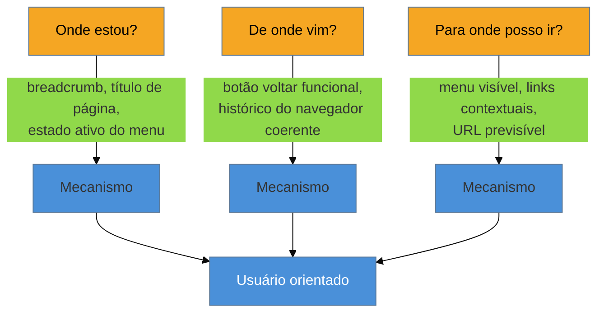

# Navegação e wayfinding

> [!abstract] TL;DR
> **Wayfinding** — termo cunhado por **Kevin Lynch** em *The Image of the City* (1960) para descrever como pessoas se orientam em espaços físicos — se aplica direto a interface digital: o usuário precisa sempre poder responder três perguntas, em qualquer tela: **onde estou · de onde vim · para onde posso ir**. Os mecanismos que respondem a essas perguntas não são decorativos — breadcrumb, estado ativo do item de menu, título de página consistente com o rótulo que levou até ele, e URL legível são a tradução digital dos "distritos, marcos, nós, caminhos e bordas" que Lynch descreveu nas cidades. Quando algum desses mecanismos falta, o usuário não fica "um pouco confuso" — ele perde completamente o modelo mental de onde está dentro do produto, mesmo que a tela em si esteja funcionando perfeitamente.

Imagine um usuário que clica num item de uma lista de pedidos, abre um modal de detalhe, e desse modal clica em "ver histórico do cliente" — que abre um segundo modal, empilhado sobre o primeiro. Ele revisa o histórico, decide que precisa editar um dado do pedido original, e clica no botão de voltar do navegador. Nada acontece — os modais não têm URL própria, então o botão de voltar do navegador não sabe fechar nenhum dos dois; ele sai da página inteira, de volta para a lista de pedidos, perdendo tudo o que tinha aberto. O usuário não estava perdido no sentido de "não sabia o que clicar" — a interface, literalmente, não tinha uma resposta para "onde estou" que qualquer mecanismo de navegação (inclusive o botão nativo do navegador) conseguisse ler. A tela funcionava; o modelo de orientação por baixo dela não existia.

## As três perguntas, herdadas da cidade

Kevin Lynch, urbanista, publicou em 1960 *The Image of the City*, um dos livros mais influentes de planejamento urbano do século 20. Ele estudou como pessoas comuns — não arquitetos, não planejadores — constroem mentalmente um mapa da cidade onde vivem, e identificou cinco elementos que sustentam essa orientação: **distritos** (áreas com identidade própria e reconhecível), **marcos** (pontos de referência visíveis de longe), **nós** (cruzamentos e pontos de decisão), **caminhos** (rotas percorridas com frequência) e **bordas** (limites que separam uma área de outra). O termo que ele cunhou para esse processo — **wayfinding** — descreve a capacidade de responder, em qualquer ponto do trajeto, a três perguntas sem precisar parar e pensar muito: onde estou, de onde vim, para onde posso ir.

O salto de cidade física para interface digital não é uma analogia frouxa — é uma tradução direta, item por item. Um produto digital não tem norte geográfico nem skyline, mas tem exatamente a mesma necessidade de orientação, porque o espaço de informação também é grande demais para caber na cabeça de uma vez:

| Elemento de Lynch (cidade) | Tradução digital |
|---|---|
| Distrito | Área do produto com identidade visual própria (ex: páginas públicas de marketing vs área logada) |
| Marco | Logo e link para home, sempre no mesmo lugar da tela |
| Nó | Menu de navegação — o ponto de decisão de para onde ir |
| Caminho | Fluxo percorrido com frequência (ex: o passo-a-passo de checkout) |
| Borda | Transição clara entre seções (ex: mudança de header ao entrar em configurações) |

> [!tip] Vídeo — Digital Wayfinding, com Kevin Lynch e The Image of the City
> **Kathryn Whitenton**, da Nielsen Norman Group, explica em vídeo curto exatamente essa tradução — de distritos, marcos e nós de Lynch para header consistente, logo/home link e menus digitais — com exemplos concretos de como cada elemento ajuda o usuário a não se perder num produto.
>
> 🎬 [Digital Wayfinding](https://www.youtube.com/watch?v=pXaPeJTit7o) — Kathryn Whitenton, NN/g, ~3min, EN.

> [!question]- Isso não é só ter um bom menu? Por que separar em três perguntas?
> Porque um menu bem desenhado responde só à terceira pergunta ("para onde posso ir"), e as três perguntas falham de formas independentes. O cenário de abertura tinha, provavelmente, um menu de navegação perfeitamente claro — o problema não era "para onde posso ir", era "onde estou" (dentro de um modal empilhado, sem indicação nenhuma) e "de onde vim" (o botão voltar não sabia responder). Um produto pode ter as três respostas ou só uma ou duas — e cada combinação produz um tipo diferente de usuário perdido.

## O antipadrão que mais quebra "onde estou": modal empilhado

O mecanismo mais comum de quebrar a primeira pergunta de wayfinding em interface digital é o **modal sobre modal** — abrir um segundo modal a partir de dentro do primeiro, como no cenário de abertura desta nota. Cada modal, isoladamente, é um padrão legítimo para tarefa curta e contextual. O problema aparece na pilha: nenhum dos dois tem URL própria, então nem o navegador nem o usuário conseguem responder "onde estou" de forma confiável — não há breadcrumb visual, não há histórico de navegação nativo, e fechar o modal errado (ou o botão voltar "errando" o alvo) descarta trabalho sem aviso. Este padrão específico — e por que **nunca mais de um nível de modal empilhado** é a regra prática — é tratado com profundidade em [[03-Dominios/Engenharia/UX/Design de Interação/22 - Modal vs página vs drawer|nota 22]]; aqui o ponto é a conexão: modal empilhado não é só "feio" ou "sem UX polish" — é uma falha estrutural de wayfinding, com consequência mensurável em trabalho perdido.

O outro lado da mesma moeda é desenhar o caminho **antes** de a pessoa entrar nele: a [[03-Dominios/Engenharia/UX/Design de Interação/19 - Do fluxo antes da tela - user flow como máquina de estados|nota 19]] (user flow como máquina de estados) já cobre como mapear cada estado possível de uma tarefa antes de construir a tela — e um user flow bem desenhado já responde "para onde posso ir" em cada estado, porque essa é literalmente a pergunta que uma máquina de estados torna explícita. Wayfinding e user flow resolvem duas metades do mesmo problema: o flow desenha o mapa; wayfinding garante que o usuário, dentro desse mapa, sempre sabe em que ponto dele está.

**O mecanismo em uma frase:** as três perguntas de wayfinding — onde estou, de onde vim, para onde posso ir — precisam de resposta visível em toda tela, e cada mecanismo de navegação (breadcrumb, título, estado ativo, URL) existe para responder uma delas, não para decorar a interface.

## Jakob's Law: não reinvente a resposta

Um segundo princípio, já coberto na fase Iniciado deste domínio, é diretamente relevante aqui: a [[03-Dominios/Engenharia/UX/Fundamentos e Modelo Mental/04 - Leis de UX - Fitts, Hick, Jakob, Miller, Peak-End|Jakob's Law]] diz que o usuário espera que seu produto se comporte como os outros produtos que ele já usa — inclusive na forma como responde às três perguntas de wayfinding. Breadcrumb no topo, menu lateral persistente, botão voltar do navegador funcionando como esperado: são convenções que o usuário já trouxe de outros produtos, e reinventá-las sem motivo forte troca familiaridade grátis por uma curva de aprendizado que ninguém pediu. Esta nota não reexplica a lei — só nomeia a conexão direta: a maneira mais barata de garantir boas respostas de wayfinding é seguir a convenção de mercado para cada mecanismo, e só desviar dela quando o produto tiver uma razão específica e testada para fazê-lo.

## Praticável sozinho vs exige time

Garantir as três respostas de wayfinding em cada tela é, na maior parte, revisão de checklist — trabalho de uma pessoa. Antes de considerar uma tela pronta, checar: existe algum indicador visível de onde essa tela está na estrutura do produto (breadcrumb, título de seção, estado ativo de menu)? O botão voltar do navegador faz o que o usuário esperaria? A URL é legível e reflete a posição na estrutura (ou, no mínimo, não mente sobre ela)? Esse checklist cabe em cinco minutos por tela e não exige pesquisa nenhuma — só disciplina de revisão. Adotar as convenções padrão de mercado (a aplicação prática de Jakob's Law) também é decisão solo: significa **não** inventar um padrão de navegação novo sem motivo, o que é mais barato do que criar algo original.

O que exige mais que uma pessoa é reprojetar wayfinding num produto complexo com múltiplos fluxos entrelaçados — por exemplo, um sistema com navegação contextual que muda de comportamento dependendo de papel do usuário (admin vs operador vs cliente), onde garantir consistência das três respostas em todos os contextos exige mapeamento e revisão cruzada que uma pessoa sozinha tem dificuldade de manter completo. Da mesma forma, testar formalmente se usuários reais conseguem responder "onde estou" em pesquisa moderada, com protocolo e amostra representativa, é trabalho de pesquisa estruturada — a versão de guerrilha (perguntar informalmente a 3-5 pessoas "onde você acha que está agora, e como voltaria?") já cobre a maior parte do sinal, na linha da [[03-Dominios/Engenharia/UX/Arquitetura de Informação/17 - Card sorting e tree testing de guerrilha|nota 17]].

## Casos práticos

### Cenário 1: o modal empilhado que perdeu o trabalho do usuário (revisitado)
O cenário de abertura, com a correção aplicada: em vez do segundo modal, "ver histórico do cliente" abre como um **drawer lateral** com URL própria (`/pedidos/4471/historico-cliente`), mantendo o modal do pedido visível parcialmente atrás. O botão voltar do navegador agora tem uma resposta correta — ele fecha o drawer, não a página inteira — porque existe uma entrada de histórico de navegação real correspondendo a esse estado. O usuário nunca perde o contexto do pedido original, porque ele nunca deixou de estar visível.

### Cenário 2: o título de página que não bate com o rótulo do menu
Um usuário clica em "Configurações de Cobrança" no menu lateral e chega numa tela cujo título, no topo, diz "Preferências Financeiras". Tecnicamente é a página certa — mas o usuário, por um segundo, hesita: será que clicou errado? O nome que ele viu no menu e o nome que a tela mostra de volta não coincidem, quebrando a confirmação implícita de "onde estou" que um título consistente proveria. A correção é trivial — alinhar o título da página ao rótulo exato do menu que leva até ela — mas exige que alguém trate os dois textos como a mesma decisão de rotulação, não como dois textos escritos em momentos e por pessoas diferentes.

### Cenário 3: a URL que não significa nada
Um produto usa IDs internos crus na URL (`/app/view?id=88213&t=2`) em vez de uma estrutura legível (`/pedidos/88213/detalhes`). Isso não quebra a navegação diretamente — o link funciona — mas quebra silenciosamente duas coisas: o usuário não consegue reconhecer, olhando a URL salva num favorito ou compartilhada por e-mail, o que ela representa; e o suporte técnico, ao receber um print de tela com a URL visível, também não consegue diagnosticar o contexto sem clicar. A correção — reestruturar a URL para incluir segmento legível, mesmo mantendo o ID — é uma mudança de rota pequena com ganho real de wayfinding: a URL passa a responder "onde estou" mesmo fora do produto, num link compartilhado.

## Armadilhas comuns

> [!warning] Modal empilhado quebrando "onde estou"
> **O que acontece:** um segundo modal abre a partir de dentro do primeiro, sem URL própria para nenhum dos dois, e o botão voltar do navegador (ou o gesto de fechar) não corresponde ao estado visual que o usuário está vendo — como no Cenário 1. **Por quê:** modal não tem, por padrão, entrada própria no histórico de navegação — ele é um estado de UI, não uma rota. Empilhar modais empilha estados sem que nenhum mecanismo nativo de "onde estou / de onde vim" saiba lidar com a pilha. **Como evitar:** nunca mais de um nível de modal aberto ao mesmo tempo; para o segundo nível de detalhe, usar um padrão com URL própria (página ou drawer roteável). Ver [[03-Dominios/Engenharia/UX/Design de Interação/22 - Modal vs página vs drawer|nota 22]].

> [!warning] Título de página inconsistente com o rótulo que levou até ela
> **O que acontece:** o texto do menu, do link ou do botão que o usuário clicou diz uma coisa; o título da tela que abre diz outra, mesmo referindo-se ao mesmo conteúdo — como no Cenário 2. **Por quê:** rótulo de navegação e título de página costumam ser escritos em momentos diferentes do desenvolvimento, às vezes por pessoas diferentes, sem checagem cruzada — cada um parece correto isoladamente. **Como evitar:** trate rótulo de menu e título de página de destino como a mesma decisão de nomeação, revisados juntos — nunca escritos em paralelo sem comparação final.

> [!warning] Reinventar navegação sem motivo forte
> **O que acontece:** o produto usa um padrão de navegação não-convencional — menu que aparece só em hover num contexto onde usuários esperam clique, breadcrumb com ordem invertida, gestos customizados sem equivalente conhecido — sem que haja um ganho específico e testado que justifique o desvio. **Por quê:** a Jakob's Law prevê exatamente essa falha: o usuário chega com expectativa formada em outros produtos, e todo desvio dessa expectativa tem custo de aprendizado, mesmo que o padrão novo seja, isoladamente, bem desenhado. **Como evitar:** por padrão, seguir a convenção de mercado para cada mecanismo de navegação; reservar inovação de navegação para casos onde há evidência (teste com usuário, não intuição de design) de que o padrão convencional falha especificamente para esse produto. Ver [[03-Dominios/Engenharia/UX/Fundamentos e Modelo Mental/04 - Leis de UX - Fitts, Hick, Jakob, Miller, Peak-End|Jakob's Law]].

## Como explicar em inglês

> "**Wayfinding** — a term coined by urbanist Kevin Lynch in *The Image of the City* (1960) — translates directly to digital interfaces: at any point, a user needs to answer three questions — **where am I, where did I come from, where can I go**. Breadcrumbs, active navigation states, consistent page titles, and readable URLs aren't decoration — they're the concrete mechanisms answering those three questions. The most common way products break 'where am I' is **stacked modals**: neither has its own URL, so neither the browser's back button nor the user has a reliable answer to where they are — and closing the wrong layer silently discards work."

| PT | EN |
|----|----|
| wayfinding | wayfinding |
| onde estou / de onde vim / para onde posso ir | where am I / where did I come from / where can I go |
| breadcrumb | breadcrumb |
| estado ativo (de menu) | active state |
| modal empilhado | stacked modal |
| convenção de plataforma | platform convention |
| URL legível | readable URL |

## O que vem a seguir

Este é o fechamento do sub-galho de arquitetura de informação: os quatro sistemas (nota 15), o erro de expor o schema como navegação (nota 16), a validação leve antes de comprometer o produto (nota 17), e agora a garantia de orientação contínua depois que o produto já está no ar. As próximas peças do domínio — design de interação — se apoiam diretamente nesta base: fluxo e modal, os dois padrões citados aqui, ganham tratamento completo no sub-galho seguinte.

- [[03-Dominios/Engenharia/UX/Design de Interação/19 - Do fluxo antes da tela - user flow como máquina de estados|Design de Interação, nota 19 — Do fluxo antes da tela]] — como mapear "para onde posso ir" antes de construir qualquer tela.
- [[03-Dominios/Engenharia/UX/Design de Interação/22 - Modal vs página vs drawer|Design de Interação, nota 22 — Modal vs página vs drawer]] — o antipadrão do modal empilhado, em profundidade.

## Fontes

- **Kevin Lynch** — *The Image of the City* (MIT Press, 1960) — origem do termo wayfinding e dos cinco elementos de orientação (distritos, marcos, nós, caminhos, bordas), traduzidos nesta nota para interface digital.
- **Kathryn Whitenton (Nielsen Norman Group)** — [*Digital Wayfinding*](https://www.youtube.com/watch?v=pXaPeJTit7o) (vídeo) — a tradução prática dos elementos de Lynch para produto digital.
- **[[03-Dominios/Engenharia/UX/Fundamentos e Modelo Mental/04 - Leis de UX - Fitts, Hick, Jakob, Miller, Peak-End|Leis de UX — Jakob's Law]]** — o princípio de não reinventar convenção de navegação sem motivo forte.
