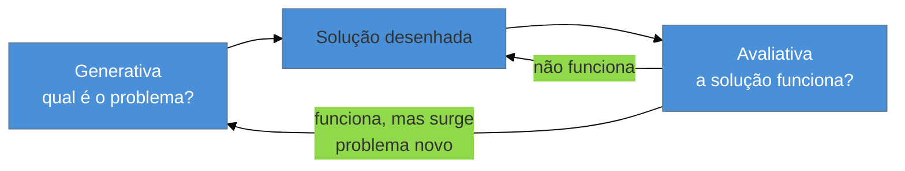

# Generativa vs avaliativa

> [!abstract] TL;DR
> Pesquisa **generativa** descobre qual é o problema certo — acontece antes de existir solução, é qualitativa e exploratória, e pergunta "por quê". Pesquisa **avaliativa** testa se uma solução já desenhada funciona — mede eficácia e satisfação de algo que já existe. São complementares, não alternativas: pular a fase generativa e ir direto para testar uma solução é a causa raiz mais comum de "construímos a coisa errada, e testamos bem construída". Um engenheiro tem viés estrutural para o avaliativo, porque avaliar parece testar código — e testar bem a coisa errada continua sendo a coisa errada.

Imagine que você recebeu, de um cliente, o pedido de um filtro avançado para uma tela de relatórios. O pedido já vem com wireframe: um painel lateral com oito campos de filtro, cada um com dropdown. Você constrói. Antes de entregar, você faz o que parece o certo: mostra o painel para três pessoas do time do cliente, pergunta "dá pra usar?", ajusta o alinhamento de dois botões que confundiram alguém, e entrega. Duas semanas depois, os logs mostram que ninguém usa mais que dois dos oito filtros — e o cliente continua recebendo pedido de suporte perguntando "como eu filtro por período customizado", uma opção que nem está na tela.

Você fez pesquisa. Só que fez o tipo errado de pesquisa, no momento errado do processo. Testar se o painel de oito filtros "funciona" — clareza dos rótulos, alinhamento dos botões — é pesquisa avaliativa: mede se uma solução já decidida é usável. O que faltou foi a pergunta anterior, generativa: *por que* as pessoas filtram relatórios, com que frequência, e o que elas fazem hoje quando o filtro que precisam não existe. Essa pergunta, feita antes do wireframe existir, teria revelado o filtro por período customizado — e provavelmente eliminado metade dos outros sete. O painel foi testado com rigor. O problema é que ele nunca foi validado como o problema certo para resolver.

## As duas fases, lado a lado

A distinção entre pesquisa generativa e avaliativa é terminologia consolidada em UX research — formalizada pela indústria e por organizações como a [Nielsen Norman Group](https://www.nngroup.com/articles/generative-vs-evaluative-research/) ao longo dos anos, sem um autor único a quem atribuir a origem do termo. Isso não a torna menos operacional: é o eixo mais básico para decidir *que tipo* de pergunta fazer numa dada etapa do trabalho.

| | Generativa | Avaliativa |
|---|---|---|
| **Pergunta central** | Por quê? O que está acontecendo? | Isso funciona? |
| **Quando acontece** | Antes de existir uma solução | Depois de existir algo para testar (protótipo, wireframe, produto no ar) |
| **Natureza** | Qualitativa, exploratória, aberta | Pode ser qualitativa (teste de usabilidade) ou quantitativa (A/B test, analytics) |
| **Objetivo** | Descobrir o problema certo | Medir se a solução resolve o problema |
| **Exemplo de método** | Entrevista de descoberta ([[03-Dominios/Engenharia/UX/Descoberta e Pesquisa/07 - Entrevista de descoberta - as regras do Mom Test|nota 07]]) | Teste de usabilidade guerrilha ([[03-Dominios/Engenharia/UX/Descoberta e Pesquisa/13 - Teste de usabilidade guerrilha com 5 usuários|nota 13]]) |
| **Erro típico se pulada** | Constrói a coisa errada, com excelência | Nunca descobre que era a coisa errada — só confirma que ela "funciona" |

O ponto que a tabela não mostra sozinha: as duas fases não competem pelo mesmo orçamento de tempo — elas resolvem problemas diferentes, na ordem certa. Fazer avaliativa sem ter feito generativa antes é como revisar a ortografia de um relatório que responde à pergunta errada. Vai sair bem escrito. Vai continuar errado.

O ciclo não termina numa flecha só. Uma avaliação pode confirmar que a solução funciona *para o problema que ela foi desenhada para resolver* — e, ao mesmo tempo, revelar um problema novo, adjacente, que pede uma rodada generativa de novo. É o que aconteceria no cenário de abertura se, depois de descobrir o filtro por período customizado, o cliente perguntasse "e por que ninguém consegue salvar um filtro para reusar depois?" — pergunta nova, generativa de novo.

## Por que o viés do engenheiro pende para o avaliativo

> [!question]- Se as duas são igualmente necessárias, por que a nota chama atenção especificamente para o viés do lado avaliativo?
> Porque o hábito profissional de quem escreve código puxa para lá sem querer. Testar uma solução já desenhada — "isso funciona? o botão responde? o fluxo completa?" — usa exatamente o mesmo músculo mental de escrever um teste automatizado: você tem um artefato concreto, uma hipótese testável, um resultado binário. Pesquisa generativa é o oposto disso: você não tem nada construído ainda, a pergunta é aberta ("o que essa pessoa faz hoje?"), e a resposta não cabe num assert. É desconfortável para quem está acostumado a validar coisas que já existem.

Esse viés explica por que o cenário de abertura parece, à primeira vista, que "fez a pesquisa certa" — teve usuário, teve feedback, teve ajuste. A armadilha é sutil precisamente porque o passo avaliativo *foi* bem executado. O erro não está na execução; está na ordem. Pular a fase generativa e ir direto para "testar se a solução (que ninguém validou como a solução certa) funciona" é, segundo o próprio enquadramento da indústria de UX research, a causa mais comum de produtos que funcionam tecnicamente e falham no mundo real — o mesmo padrão que aparece no cenário de abertura do domínio inteiro (ver [[03-Dominios/Engenharia/UX/Fundamentos e Modelo Mental/01 - UX não é tela - o ofício e seus limites|nota 01]]).

**O mecanismo em uma frase:** avaliativa mede se você construiu bem uma coisa; generativa decide se essa coisa era a certa para construir — e nenhuma quantidade de rigor na primeira compensa ter pulado a segunda.

## Quando usar cada uma

A regra prática não é "sempre fazer as duas em todo projeto" — é calibrar pelo que você já sabe:

- **Você não sabe qual é o problema, ou está inseguro sobre ele** → generativa primeiro. Entrevista de descoberta (nota 07), observação do fluxo atual, análise de tickets de suporte existentes.
- **Você já tem uma solução construída ou prototipada e quer saber se ela funciona** → avaliativa. Teste de usabilidade (nota 13), analytics de uso, A/B test.
- **Você está no meio de um projeto e recebeu um pedido pronto do cliente** ("preciso de um dashboard") → esse é o momento clássico de armadilha: o pedido já chega travestido de solução. Antes de aceitar como está, uma rodada rápida de generativa — mesmo que seja uma única conversa de 20 minutos perguntando "me conta a última vez que você precisou disso" — evita repetir o cenário de abertura desta nota. Ver [[03-Dominios/Engenharia/UX/Descoberta e Pesquisa/08 - Cliente não é usuário - a armadilha do B2B e consultoria|nota 08]] para por que esse pedido pronto costuma vir de quem paga, não de quem usa.

> [!tip] Erika Hall e a "pesquisa proporcional ao risco"
> Erika Hall, em *Just Enough Research*, defende que o tamanho do esforço de pesquisa — generativa ou avaliativa — deve ser proporcional ao risco da decisão, não a um ritual fixo. Uma mudança de cor de botão não pede a mesma generativa que uma mudança de fluxo de checkout inteiro. Essa calibração volta com força na [[03-Dominios/Engenharia/UX/Descoberta e Pesquisa/13 - Teste de usabilidade guerrilha com 5 usuários|nota 13]].

## O que dá pra fazer sozinho, e o que não dá

| Praticável sozinho | Exige time/orçamento |
|---|---|
| Entrevista generativa curta (20-40 min) com 1 cliente/stakeholder antes de aceitar um pedido pronto | Estudo generativo formal com amostra ampla e síntese cruzada de múltiplos pesquisadores |
| Teste avaliativo guerrilha com 5 usuários (nota 13) | A/B test com significância estatística e volume de tráfego representativo |
| Ler tickets de suporte e mensagens de cliente existentes como pesquisa generativa passiva | *Mental model research* completo (Indi Young) — múltiplas sessões de escuta profunda |
| Analytics leve (funil, eventos-chave) como sinal avaliativo contínuo | Research ops com repositório de pesquisa mantido ao longo do tempo |

A pergunta de segunda-feira aqui é simples: antes de aceitar um pedido como está, você fez ao menos uma pergunta generativa — "por que isso, para quem, com que frequência"? Se a resposta é não, o próximo passo não é abrir o Figma. É agendar 20 minutos de conversa.

## Casos práticos

### Cenário 1: o dashboard de métricas que ninguém pediu certo
Um cliente pede "um dashboard com os KPIs principais". Sem pesquisa generativa, o engenheiro lista o que parece óbvio — receita, usuários ativos, churn — e constrói. Avaliativamente, o dashboard "funciona": carrega rápido, os números batem com o banco. Só depois de entregue um analista revela que o KPI que ele realmente acompanha todo dia — tempo médio de resposta a ticket — nunca fez parte da lista, porque ninguém perguntou a ele antes de decidir o que ia no painel. Uma pergunta generativa de 15 minutos ("quais números você olha hoje, e onde?") teria custado menos que o retrabalho de adicionar o KPI depois.

### Cenário 2: o teste de usabilidade que confirmou o erro
Uma equipe redesenha o fluxo de cadastro de um produto B2B e roda um teste de usabilidade guerrilha antes de lançar — pesquisa avaliativa, bem feita, com 5 usuários reais. O teste aponta que o fluxo é "fácil de completar". Ele é: os 5 usuários terminam o cadastro sem travar. Só que nenhum deles é do público que realmente vai usar o produto no dia a dia — são colegas de outro time, recrutados por conveniência porque estavam disponíveis. O fluxo passou no teste avaliativo e falhou na adoção real, porque a pergunta generativa anterior — "quem realmente vai se cadastrar, e o que essa pessoa já usa hoje" — nunca foi respondida com gente certa. Avaliativa bem executada não conserta uma generativa mal feita ou pulada.

## Armadilhas comuns

> [!warning] Chamar de "pesquisa" só o passo avaliativo
> **O que acontece:** o time diz "já fizemos pesquisa" referindo-se só a um teste de usabilidade num protótipo já pronto — a etapa generativa nunca existiu, mas a palavra "pesquisa" faz parecer que existiu.
> **Por quê:** avaliativa é mais visível e mais fácil de agendar — precisa de um artefato concreto para mostrar. Generativa é mais abstrata e mais fácil de pular sob pressão de prazo.
> **Como evitar:** ao ouvir "já validamos com usuário", pergunte de volta: "validamos que a solução funciona, ou validamos que o problema é esse?". São perguntas diferentes.

> [!warning] Pesquisa teatral — validar depois de já ter decidido
> **O que acontece:** a decisão de o que construir já foi tomada (às vezes por convicção pessoal, às vezes porque o cliente já aprovou o wireframe); a "pesquisa" que acontece depois só busca confirmação, não descoberta.
> **Por quê:** perguntas fechadas feitas depois da decisão ("você gostou do dashboard?") tendem a receber resposta cortês, não informação nova — o mesmo viés de confirmação que a [[03-Dominios/Engenharia/UX/Descoberta e Pesquisa/07 - Entrevista de descoberta - as regras do Mom Test|nota 07]] ataca diretamente.
> **Como evitar:** se a pergunta que você está fazendo só pode confirmar ou negar uma decisão já tomada, ela é avaliativa disfarçada de generativa. Pesquisa generativa de verdade é feita *antes* de haver algo para defender.

> [!warning] Confundir "testar com usuário" com "entender o usuário"
> **O que acontece:** o time trata qualquer sessão com usuário real — seja qual for o objetivo — como intercambiável, achando que "já fizemos pesquisa com gente de verdade" cobre tanto a pergunta "o que fazer" quanto "isso funciona".
> **Por quê:** as duas perguntas exigem roteiros, momentos e tipos de análise diferentes; misturar as duas numa sessão só produz respostas rasas para as duas.
> **Como evitar:** antes de agendar qualquer sessão com usuário, escreva explicitamente se o objetivo é generativo ou avaliativo — isso muda o roteiro inteiro (comparar com o roteiro de entrevista da nota 07 e o de teste guerrilha da nota 13).

## Como explicar em inglês

> "Generative research figures out **what problem to solve** — it's qualitative, exploratory, and happens before any solution exists. Evaluative research checks **whether a solution works** — it measures usability or effectiveness of something already built. They're complementary, not interchangeable: skipping generative and jumping straight to evaluative is the most common reason teams build the wrong thing extremely well. Engineers default to evaluative because testing a built artifact feels like testing code — open-ended discovery doesn't."

| PT | EN |
|----|----|
| pesquisa generativa | generative research |
| pesquisa avaliativa | evaluative research |
| problema certo | the right problem |
| pesquisa teatral | theater research / validation theater |
| viés de confirmação | confirmation bias |
| pergunta fechada | closed-ended question |

## O que vem a seguir

Generativa vs avaliativa é o eixo que organiza todo o resto deste sub-galho: cada método que vem a seguir é claramente um ou outro. A próxima nota entrega o método generativo mais barato e mais mal-executado da área — a entrevista de descoberta — com um conjunto de regras específico para não cair na pesquisa teatral descrita acima.

- [[03-Dominios/Engenharia/UX/Descoberta e Pesquisa/07 - Entrevista de descoberta - as regras do Mom Test|07 — Entrevista de descoberta: as regras do Mom Test]] — como fazer generativa sem que o entrevistado só concorde com você por educação.
- [[03-Dominios/Engenharia/UX/Descoberta e Pesquisa/08 - Cliente não é usuário - a armadilha do B2B e consultoria|08 — Cliente não é usuário]] — por que, em B2B, o pedido pronto quase sempre chega de quem não vai usar o resultado.
- [[03-Dominios/Engenharia/UX/Descoberta e Pesquisa/13 - Teste de usabilidade guerrilha com 5 usuários|13 — Teste de usabilidade guerrilha]] — o método avaliativo mais barato de aplicar sozinho.

## Fontes

- **Nielsen Norman Group** — [*Generative vs. Evaluative Research*](https://www.nngroup.com/articles/generative-vs-evaluative-research/) — a formalização de referência da distinção usada nesta nota; terminologia consolidada pela indústria, sem autor único.
- **Erika Hall** — *Just Enough Research* (2013; 2ª ed. 2024) — base da ideia de calibrar o esforço de pesquisa (generativa ou avaliativa) proporcionalmente ao risco da decisão.
