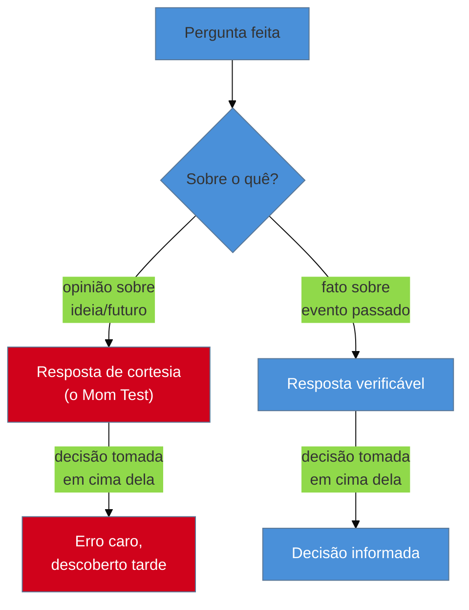

# Entrevista de descoberta: as regras do Mom Test

> [!abstract] TL;DR
> A entrevista de descoberta é o método de pesquisa generativa mais barato e mais mal-executado da área: qualquer pessoa pode agendar uma conversa de 30 minutos, mas a maioria faz perguntas que só produzem cortesia, não fato. **Rob Fitzpatrick**, em *The Mom Test* (2013), resume a regra central numa frase: mesmo sua mãe vai mentir para te agradar se você perguntar sobre o futuro ou sobre uma ideia. O antídoto é falar só do **passado concreto e específico** — o que a pessoa já fez, não o que ela acha que faria. É a nota mais praticável sozinho de todo este sub-galho: dá para rodar sem orçamento, sem ferramenta, numa call de 20 minutos com um cliente.

Imagine que você quer validar uma ideia de feature antes de construir: um botão de "exportar relatório em PDF direto do painel". Você liga para um usuário e pergunta: "você usaria um botão de exportar PDF direto daqui?". A resposta vem rápida: "com certeza, seria ótimo!". Animado, você constrói. Três semanas depois, o botão está lá, ninguém clica nele. Você não fez nada de errado tecnicamente — o botão exporta corretamente. O que você fez de errado foi confiar numa resposta que não custou nada para dar. "Você usaria" é uma pergunta sobre o futuro, hipotética, sem risco para quem responde — e pessoas educadas tendem a responder de forma agradável a perguntas assim, não honesta.

## A regra central: passado, não futuro

O nome do livro de Rob Fitzpatrick vem de uma observação simples: se você perguntar à sua própria mãe "você compraria meu produto?", ela vai dizer que sim — porque ela te ama e quer te apoiar, não porque a resposta reflita o que ela realmente faria com o próprio dinheiro. O mesmo viés, numa versão mais fraca, acontece com qualquer entrevistado educado: perguntas sobre opinião futura convidam a resposta de cortesia, não o fato.

A correção é trocar a pergunta de categoria inteira — de opinião sobre o futuro para relato de um evento passado e específico:

| Categoria ruim (opinião/futuro) | Por que falha | Categoria boa (fato/passado) |
|---|---|---|
| "Você usaria um produto que faz X?" | Hipotético, sem custo para responder "sim" | "Me conta a última vez que você precisou fazer X" |
| "Você gostaria de um botão que fizesse Y?" | Convida cortesia, não avaliação real | "O que você fez da última vez que precisou de Y?" |
| "Quanto você pagaria por Z?" | Número inventado na hora, sem compromisso real | "Quanto isso te custou da última vez — em tempo ou dinheiro?" |
| "Isso resolveria seu problema?" | Pede validação da sua ideia, não fato sobre o problema dela | "O que você já tentou pra resolver isso?" |

O padrão por trás da coluna da esquerda: toda pergunta pede que o entrevistado avalie uma ideia sua. O padrão da coluna da direita: toda pergunta pede que o entrevistado narre algo que já aconteceu, com detalhe concreto suficiente para ser verificável ("quando foi isso?", "o que você fez depois?", "quanto tempo levou?"). Fatos passados não têm incentivo à cortesia — já aconteceram, o entrevistado só está relatando.

**A regra em uma frase:** se a pergunta pede para o entrevistado prever, avaliar ou opinar sobre algo hipotético, ela é uma pergunta ruim disfarçada de pesquisa — troque por uma pergunta que só pede o relato de algo que já aconteceu.

## O roteiro de uma entrevista de descoberta

Uma entrevista de descoberta de 30 minutos, seguindo o espírito do Mom Test, tem uma estrutura simples:

1. **Abra com contexto, não com a sua ideia.** "Me conta como funciona seu dia quando você precisa lidar com [área do problema]" — nunca "estou pensando em construir X, o que você acha?".
2. **Peça o último evento concreto.** "Quando foi a última vez que isso aconteceu?" — ancora a conversa num caso real, não numa generalização vaga ("normalmente eu...").
3. **Siga a trilha do que já foi tentado.** "O que você fez depois?", "o que você usa hoje pra resolver isso?" — revela ferramentas, workarounds e concorrentes informais (a planilha compartilhada, o e-mail manual) que a sua solução vai competir com, não com o vazio.
4. **Pergunte o custo real.** "Quanto tempo isso te tomou?", "isso já te custou dinheiro, prazo, um cliente?" — quantifica a dor sem pedir opinião.
5. **Não apresente sua ideia até o fim, se apresentar.** Uma vez que você mostra a solução, o entrevistado para de falar do problema dele e começa a reagir à sua ideia — e volta ao modo cortesia.

> [!question]- E se o entrevistado insistir em falar da minha ideia antes de eu perguntar?
> Redirecione de volta para o concreto: "antes disso, me ajuda a entender melhor — como você resolve isso hoje?". Não é falta de educação interromper uma opinião hipotética; é a diferença entre coletar dado e coletar validação vazia.

> [!tip] Vídeo — o próprio Rob Fitzpatrick explicando o Mom Test
> [**The Mom Test with Rob Fitzpatrick**](https://www.youtube.com/watch?v=Az-KSGBECH8) (Brian Rhea, 56min) é uma entrevista longa com o autor do livro, cobrindo a "armadilha do elogio" (*compliment trap*), por que perguntas sobre o futuro produzem cortesia em vez de fato, e como reformular perguntas em torno do passado concreto — o mesmo mecanismo central desta nota, direto da fonte.
>
> 🎬 [Assistir no YouTube](https://www.youtube.com/watch?v=Az-KSGBECH8)

## Ensinado, e usado, fora do hype

*The Mom Test* foi publicado em 2013 e segue em uso amplo mais de uma década depois — é o livro mais indicado como ponto de entrada para quem nunca fez entrevista de cliente, precisamente por ser curto e sem jargão de metodologia de pesquisa. É ensinado em programas de empreendedorismo de Harvard e do MIT, e empresas como Shopify e Skyscanner o citam como referência para entrevista de descoberta com cliente. Não é uma técnica de nicho: é o piso mínimo de rigor para qualquer conversa que vai informar uma decisão de produto.

## O que dá pra fazer sozinho, e o que não dá

| Praticável sozinho | Exige time/orçamento |
|---|---|
| 1 entrevista de descoberta de 20-30 min com um cliente ou stakeholder, seguindo o roteiro acima | Programa de entrevistas contínuas com repositório de pesquisa centralizado |
| Entrevistar 5-8 clientes/usuários ao longo de um projeto pequeno | Estudo com amostra estatisticamente representativa e segmentação validada |
| Anotar (ou gravar, com consentimento) e revisar depois em busca de padrões repetidos | Síntese formal cruzada por múltiplos pesquisadores, tipo *mental model research* |

A pergunta de segunda-feira: antes da próxima conversa com um cliente sobre uma feature nova, escreva 3 perguntas no formato "me conta a última vez que..." antes de entrar na call. Isso sozinho já elimina a maior parte do risco de cortesia — e é exatamente o tipo de disciplina que substitui, numa escala de um, a pesquisa que um trio de produto inteiro faria (ver [[03-Dominios/Engenharia/UX/Fundamentos e Modelo Mental/01 - UX não é tela - o ofício e seus limites|nota 01]]).

## Casos práticos

### Cenário 1: a pergunta que revelou o produto errado
Um fractional engineer entrevista o dono de uma pequena agência sobre um sistema de gestão de projetos que ele estava prestes a construir. Em vez de perguntar "você usaria um dashboard de status de projeto?", ele pergunta "me conta como você sabe, hoje, se um projeto está atrasado". A resposta revela que o dono não olha dashboard nenhum — ele liga para cada gerente de projeto toda sexta-feira, porque não confia em número sem contexto. O insight muda o escopo inteiro: o produto certo não é um dashboard, é um lembrete estruturado de "o que perguntar" para a call de sexta. Um dashboard bonito teria sido ignorado, exatamente como o dono ignora os relatórios automáticos que já recebe hoje.

### Cenário 2: a entrevista contaminada pela apresentação prévia
Uma consultora, ansiosa para validar rápido, abre a entrevista mostrando um protótipo em Figma antes de perguntar qualquer coisa sobre o processo atual do cliente. A partir daí, a conversa inteira vira reação ao protótipo — "gostei desse botão", "talvez essa cor" — e nenhuma pergunta sobre o problema real do cliente é respondida. A entrevista termina com feedback de UI superficial e zero informação sobre se o protótipo resolve algo que o cliente de fato precisa. Refazer a entrevista, dessa vez sem mostrar nada até o fim, revela que o fluxo inteiro do protótipo partia de uma suposição errada sobre em que ordem o cliente toma as decisões.

## Armadilhas comuns

> [!warning] Perguntar diretamente "o que você quer?"
> **O que acontece:** o entrevistado responde com uma feature específica ("eu queria um botão que fizesse X"), e o engenheiro constrói exatamente aquilo. **Por quê:** o entrevistado não é designer de produto — ele descreve a primeira solução que imagina para a dor dele, que raramente é a melhor solução possível, e frequentemente nem ataca a causa real. **Como evitar:** trate qualquer resposta em formato de solução como um sintoma a investigar, não como requisito: "por que esse botão te ajudaria — o que você faz hoje sem ele?".

> [!warning] Perguntas fechadas que só confirmam a hipótese de quem pergunta
> **O que acontece:** o entrevistador já tem uma ideia favorita e formula as perguntas de um jeito que só permite confirmar ("você concorda que seria mais rápido com X?"). **Por quê:** é viés de confirmação — a mesma armadilha nomeada na [[03-Dominios/Engenharia/UX/Descoberta e Pesquisa/06 - Generativa vs avaliativa|nota 06]] para pesquisa em geral, só que na forma mais comum: a pergunta capciosa dentro de uma entrevista que parece aberta. **Como evitar:** revise seu roteiro antes da call e risque qualquer pergunta que comece implicando a resposta certa. Se a pergunta permite só "sim, concordo" como resposta plausível, reescreva.

> [!warning] Tratar 1 entrevista como dado suficiente
> **O que acontece:** depois de uma única conversa reveladora, o engenheiro trata o insight como validado e constrói em cima dele sem checar se é padrão ou exceção. **Por quê:** 1 pessoa é uma amostra de tamanho 1 — pode ser um caso extremo, não representativo do resto dos usuários/clientes. **Como evitar:** trate a primeira entrevista como hipótese a confirmar nas próximas 3-4, não como fato estabelecido. Ver a tabela "praticável sozinho" acima — 5-8 entrevistas é o piso recomendável antes de tratar um padrão como confiável.

## Como explicar em inglês

> "The Mom Test, from Rob Fitzpatrick's 2013 book of the same name, is the discipline of asking about **the concrete past, never opinions about the future**. Even your own mother will lie to you to be supportive if you ask her whether she'd use your product — so you ask instead what she actually did the last time she faced that problem. Bad questions invite politeness: 'would you use X?' Good questions demand facts: 'tell me about the last time you needed to do X.'"

| PT | EN |
|----|----|
| entrevista de descoberta | discovery interview |
| resposta de cortesia | courtesy response / compliment |
| pergunta fechada | closed/leading question |
| passado concreto | concrete past event |
| viés de confirmação | confirmation bias |
| roteiro de entrevista | interview script |

## O que vem a seguir

A entrevista de descoberta responde "qual é o problema" quando você já sabe *quem* entrevistar. A próxima nota lida com um obstáculo anterior a esse: em consultoria e B2B, a pessoa disponível para entrevistar quase nunca é a mesma que vai usar o produto — e essa distinção muda o que você faz com as respostas que colher.

- [[03-Dominios/Engenharia/UX/Descoberta e Pesquisa/08 - Cliente não é usuário - a armadilha do B2B e consultoria|08 — Cliente não é usuário]] — por que a pessoa do outro lado da call quase nunca é quem vai operar o sistema.
- [[03-Dominios/Engenharia/UX/Descoberta e Pesquisa/09 - Jobs To Be Done - as duas escolas|09 — Jobs To Be Done]] — como estruturar o que a entrevista revela num vocabulário mais formal de "por que a pessoa contrata isso".

## Fontes

- **Rob Fitzpatrick** — *[The Mom Test](https://www.momtestbook.com/)* (2013) — fonte primária da regra central e do vocabulário de perguntas boas/ruins usado nesta nota.
