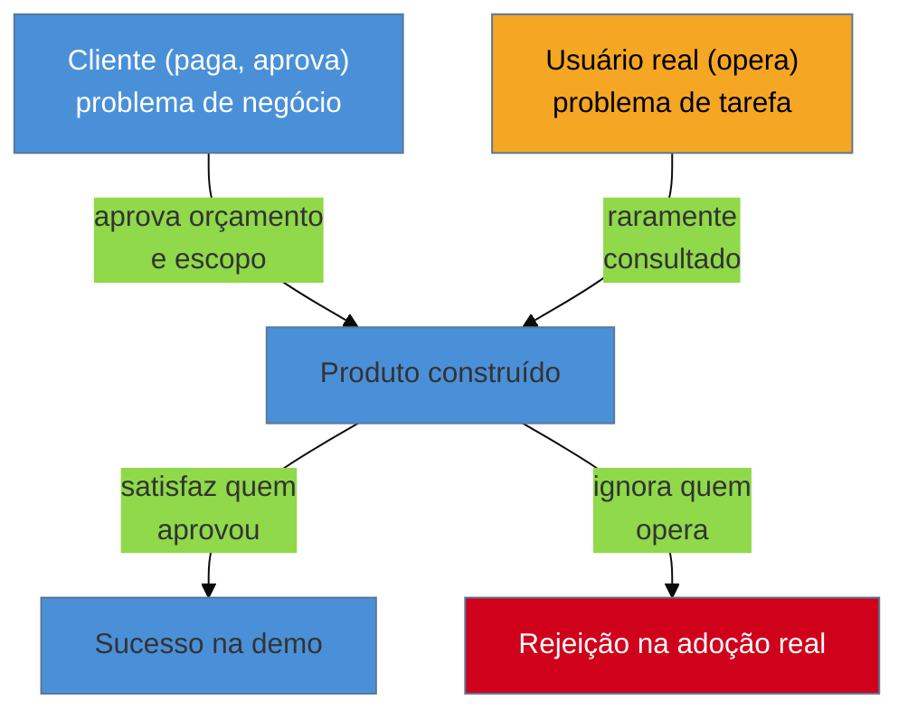

# Cliente não é usuário: a armadilha do B2B e consultoria

> [!abstract] TL;DR
> Em consultoria e produto B2B, quem **paga e aprova** o projeto quase nunca é quem **usa** o sistema no dia a dia. O gestor que assina o contrato quer um painel bonito para mostrar ao próprio chefe; o analista que vai operar o sistema todo dia quer terminar a tarefa rápido e voltar para o resto do trabalho. Otimizar para o primeiro produz exatamente o produto que o segundo rejeita. Para um fractional engineer, isso não é observação abstrata: é problema estrutural, porque ele fala quase exclusivamente com quem paga — o acesso ao usuário real **não é detalhe de execução, é item de negociação de contrato**, e precisa ser pedido antes de o trabalho começar, não descoberto como falta no meio do projeto.

Imagine o roteiro mais comum de um projeto fractional em B2B: você é contratado por um diretor de operações para construir um sistema de aprovação de despesas internas. Todas as reuniões são com o diretor. Ele descreve o fluxo que imagina, aprova o wireframe, aprova o protótipo, aprova a versão final. Você entrega no prazo, o diretor está satisfeito — ele nunca precisou usar o sistema, só precisava que ele existisse e funcionasse na demonstração. Um mês depois, os analistas financeiros que preenchem o formulário de aprovação todo dia continuam mandando planilha por e-mail, porque o fluxo que o diretor desenhou exige seis cliques e três campos que, na prática, ninguém do time preenche do jeito que ele imaginou. O diretor aprovou um sistema que nunca testou operando de verdade. Você construiu exatamente o que foi pedido, e o produto morreu na adoção.

## Quem paga não é quem usa: o mecanismo

O conflito não é um acidente de comunicação corrigível com "perguntar melhor" — é estrutural ao arranjo B2B/consultoria. Quem contrata está resolvendo um problema de **negócio** ("preciso que esse processo pare de ser manual", "preciso mostrar progresso para o meu chefe"); quem usa está resolvendo um problema de **tarefa** ("preciso terminar isso e sair da tela o mais rápido possível"). Os dois problemas são reais, mas nem sempre coincidem — e quando um deles precisa ceder espaço ao outro, o poder de decisão está do lado de quem assina o contrato, não de quem sofre com a interface todo dia.

O diagrama mostra o padrão do cenário de abertura: as duas setas de aprovação e consulta não têm o mesmo peso. Enquanto o acesso ao usuário real for opcional — "se der tempo, eu falo com o time" — ele vai perder para qualquer pressão de prazo, porque falar com o cliente que paga é obrigatório e falar com quem usa não é.

> [!question]- Isso significa que o cliente (quem paga) está "errado" ou é o vilão da história?
> Não — o cliente também é interessado legítimo, com um problema real (o de negócio). O erro não é ouvir o cliente; é tratar a satisfação dele como *proxy* completo da satisfação do usuário real, quando as duas divergem. As duas vozes são necessárias; nenhuma substitui a outra.

## O acesso ao usuário é negociação de contrato, não detalhe de execução

Aqui está o ponto que separa esta nota de uma observação genérica sobre "conheça seu usuário": para um engenheiro fractional, sem trio de produto e sem departamento de pesquisa atrás dele, o acesso ao usuário real não aparece sozinho. Se você não pedir explicitamente, no início do projeto, tempo com quem vai operar o sistema, você vai chegar ao fim do projeto tendo falado só com quem aprovou o orçamento — porque é essa pessoa que está na sala de kickoff, nas reuniões de status, e nas aprovações de entrega.

Isso muda o que "escopo do projeto" significa: acesso a 3-5 conversas com usuários reais, mesmo que curtas (15-20 minutos, seguindo o roteiro da [[03-Dominios/Engenharia/UX/Descoberta e Pesquisa/07 - Entrevista de descoberta - as regras do Mom Test|nota 07]]), deveria ser pedido como item explícito de escopo — junto com prazo e orçamento — não como um "se sobrar tempo eu tento". Frases concretas para essa negociação, feitas no kickoff, não no meio do projeto quando já é tarde:

- "Para o fluxo de aprovação funcionar de verdade, preciso de 20 minutos com 3 pessoas do time que vai usar isso todo dia — posso agendar isso na semana 1?"
- "Vou entregar um protótipo antes da versão final. Preciso mostrá-lo para quem vai operar, não só para você, antes de considerar aprovado."
- "O escopo inclui uma rodada de teste com 5 usuários reais antes do lançamento — isso está no cronograma que combinamos?"

> [!warning] Aceitar "eu represento bem o time" como substituto de acesso real
> **O que acontece:** o cliente diz "pode confiar, eu conheço bem o time, fala comigo que eu te digo o que eles precisam" — e o projeto inteiro roda sem nenhuma conversa direta com quem opera. **Por quê:** mesmo um gestor bem-intencionado e próximo do time reporta a própria interpretação do problema, filtrada pela posição dele — ele não sente a fricção do formulário de seis cliques porque nunca precisou preenchê-lo sob pressão de prazo, igual ao usuário real sente. **Como evitar:** trate "eu represento o time" educadamente como um sinal, não como substituto — "ótimo, isso me dá contexto; ainda assim preciso de 15 minutos diretos com 2-3 pessoas do time para confirmar antes de fechar o fluxo".

> [!tip] Buyer vs. end user não muda o método, muda a negociação de acesso
> Teresa Torres e Petra Wille discutem por que a distinção entre quem compra e quem opera o produto em B2B não exige um método de pesquisa diferente — exige negociar acesso ao usuário real desde o início — [Product Discovery: B2B vs. B2C](https://www.producttalk.org/product-discovery-b2b-vs-b2c-all-things-product-podcast-with-teresa-torres-petra-wille/) (All Things Product Podcast).

## A ligação com pular a fase generativa

O pedido pronto do cliente ("preciso de um dashboard", "quero um formulário de aprovação assim") é, na maioria das vezes, a solução que o próprio cliente já imaginou — não o problema dele descrito em aberto. Aceitar esse pedido sem investigar é pular a fase generativa por procuração (ver [[03-Dominios/Engenharia/UX/Descoberta e Pesquisa/06 - Generativa vs avaliativa|nota 06]]): você está fazendo pesquisa generativa com a pessoa errada — o cliente sabe o problema *dele*, de negócio, mas raramente sabe o problema de tarefa de quem vai operar o sistema, porque não é ele quem opera. A pergunta certa a devolver ao cliente não é "por que você quer isso" (ele vai responder com convicção, mas sobre o próprio problema) — é "quem vai preencher isso todo dia, e posso conversar com essa pessoa antes de desenhar o fluxo?".

**O mecanismo em uma frase:** em B2B/consultoria, o cliente compra a solução para o problema dele; o usuário sofre a solução para o problema dela — e sem acesso negociado ao segundo, você só ouve o primeiro.

## O que dá pra fazer sozinho, e o que não dá

| Praticável sozinho | Exige time/orçamento |
|---|---|
| Pedir, no kickoff, acesso a 3-5 conversas curtas com usuários reais como item de escopo | Programa formal de pesquisa com usuário, com research ops e repositório contínuo |
| Rodar 1 teste de usabilidade guerrilha com quem opera o sistema antes do lançamento (nota 13) | Estudo de adoção pós-lançamento com amostra estatisticamente representativa |
| Perguntar explicitamente "quem vai usar isso todo dia?" antes de aceitar um wireframe pronto | Governança formal de research que garanta acesso a usuário em todo projeto da empresa |
| Negociar, por escrito, o acesso ao usuário como cláusula de escopo (mesmo informal, num e-mail de confirmação) | Contrato com SLA de pesquisa e validação com usuário, revisado por jurídico |

A pergunta de segunda-feira: no próximo kickoff de projeto, antes de aceitar o primeiro wireframe ou pedido do cliente, pergunte em voz alta "quem vai usar isso no dia a dia, e posso falar com essa pessoa antes de fechar o desenho?". Se a resposta for "não precisa, eu já sei o que eles querem", trate isso como sinal de risco a ser nomeado, não como permissão para pular.

## Casos práticos

### Cenário 1: o sistema de aprovação que ninguém usa
Descrito na abertura desta nota: um diretor de operações aprova um sistema de aprovação de despesas sem nenhuma conversa com os analistas que preenchem o formulário. O sistema é tecnicamente correto e vira sombra — os analistas voltam para a planilha e o e-mail. A correção, feita tarde, custou uma segunda rodada de reformulação do fluxo; a mesma correção, feita no kickoff como 20 minutos de conversa com 3 analistas, teria custado quase nada e revelado, antes de desenhar qualquer tela, que o campo obrigatório "centro de custo" não existe no vocabulário mental de quem preenche — eles pensam em "projeto", não em "centro de custo".

### Cenário 2: o dashboard interno aprovado em duas reuniões
Uma consultoria entrega um dashboard de métricas para um cliente B2B. O cliente (um diretor) aprova o design em duas reuniões e elogia o resultado. Três meses depois, os logs de acesso mostram uso quase zero pelos analistas que deveriam usá-lo todo dia — eles já tinham uma planilha compartilhada, atualizada por um script que confiavam, e o dashboard novo não substituía nenhuma dor real deles, só a do diretor ("quero ver isso num painel bonito"). O erro não foi de execução — a tela renderiza bem, os gráficos são corretos. O erro foi tratar a satisfação do cliente (papel de quem paga) como se fosse a mesma coisa que a necessidade do usuário (papel de quem opera).

## Armadilhas comuns

> [!warning] Confundir "cliente satisfeito" com "produto adotado"
> **O que acontece:** o projeto é declarado sucesso internamente — o cliente pagou, aprovou, elogiou — enquanto o uso real do produto pelas pessoas que deveriam usá-lo é baixo ou nulo. **Por quê:** satisfação de quem aprova mede a experiência da reunião de aprovação, não a experiência de uso diário; são métricas diferentes que costumam ser tratadas como a mesma. **Como evitar:** defina, junto com o cliente, uma métrica de adoção real (uso semanal ativo, taxa de conclusão de tarefa) separada da aprovação do contrato — e revise-a depois do lançamento, não só antes.

> [!warning] Não pedir acesso ao usuário por medo de parecer que está "atrasando" o projeto
> **O que acontece:** o engenheiro evita pedir tempo com usuários reais porque teme que o cliente interprete isso como falta de confiança ou atraso desnecessário no cronograma. **Por quê:** o custo de pedir acesso (algumas horas, geralmente no início) parece visível e imediato; o custo de não pedir (retrabalho depois do lançamento) é invisível até acontecer. **Como evitar:** posicione o pedido como parte do processo profissional, não como desconfiança: "isso faz parte de como eu garanto que o que construo vai ser usado — é rápido e evita retrabalho depois."

> [!warning] Tratar o feedback do cliente durante o projeto como "a voz do usuário"
> **O que acontece:** o cliente comenta sobre a interface durante as reuniões de status, e esse feedback é incorporado como se fosse validação de usuário. **Por quê:** o cliente está reagindo como quem aprova um investimento, não como quem vai operar o sistema sob pressão de prazo real — os dois papéis reagem a coisas diferentes. **Como evitar:** trate aprovação do cliente e validação com usuário real como dois checkpoints distintos e nomeados, nunca um substituindo o outro — o mesmo princípio já nomeado na [[03-Dominios/Engenharia/UX/Fundamentos e Modelo Mental/01 - UX não é tela - o ofício e seus limites|nota 01]].

## Como explicar em inglês

> "In B2B and consulting work, the person who **pays and approves** is rarely the person who **uses** the system day to day. Optimizing for the buyer's satisfaction produces a product the real user rejects. For a fractional engineer, this isn't an abstract observation — it's structural: you mostly talk to whoever signs the contract. Access to the real user is a **scope negotiation item**, not an execution detail — ask for it explicitly at kickoff, not after the project already shipped."

| PT | EN |
|----|----|
| quem paga não é quem usa | the buyer isn't the user |
| problema de negócio | business problem |
| problema de tarefa | task-level problem |
| acesso ao usuário | user access |
| item de escopo | scope item |
| adoção real | real-world adoption |

## O que vem a seguir

Depois de garantir acesso ao usuário real, a próxima pergunta é *como* organizar o que ele diz num vocabulário que sobrevive além de uma conversa isolada — e como não confundir a suposição do time com um dado de pesquisa de verdade.

- [[03-Dominios/Engenharia/UX/Descoberta e Pesquisa/09 - Jobs To Be Done - as duas escolas|09 — Jobs To Be Done]] — como nomear o que o usuário real "contrata" o produto para fazer, quando você finalmente consegue falar com ele.
- [[03-Dominios/Engenharia/UX/Descoberta e Pesquisa/12 - Proto-persona vs persona de verdade|12 — Proto-persona vs persona de verdade]] — o risco de tratar a suposição do cliente sobre o usuário como se fosse pesquisa real.

## Fontes

- **Nielsen Norman Group** — [*The Definition of User Experience (UX)*](https://www.nngroup.com/articles/definition-user-experience/) — base da distinção entre quem interage com o produto e quem decide sobre ele, citada também na nota de abertura do domínio.
- **Padrão estrutural de consultoria/B2B** — observação amplamente documentada na literatura de product discovery (ver Teresa Torres, *Continuous Discovery Habits*, citada na [[03-Dominios/Engenharia/UX/Descoberta e Pesquisa/10 - Opportunity Solution Tree de bolso|nota 10]]) sobre a diferença entre stakeholder e usuário final em contextos B2B.
