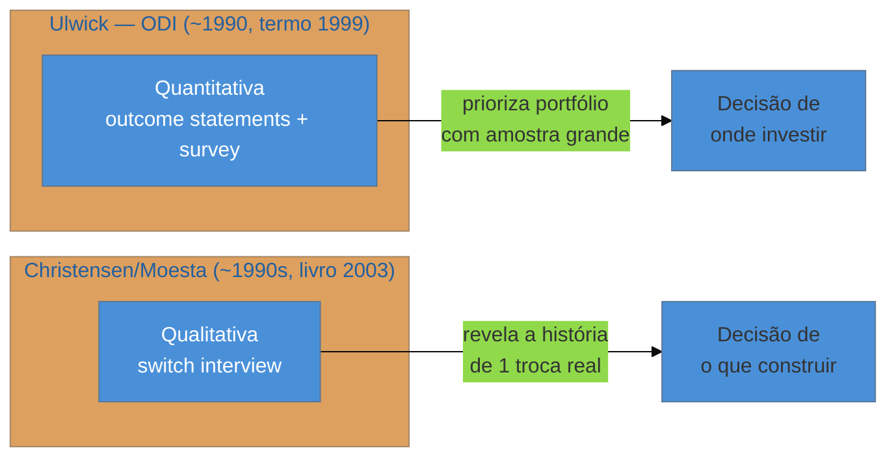

# Jobs To Be Done: as duas escolas

> [!abstract] TL;DR
> **Jobs To Be Done (JTBD)** parte de uma ideia simples: as pessoas não compram produtos, elas os "contratam" para fazer um "job" — resolver algo que precisam resolver. Onde a maioria confunde JTBD com um método único, existem na verdade **duas escolas divergentes**: a de **Tony Ulwick**, quantitativa, focada em *outcome statements* mensuráveis (Outcome-Driven Innovation), e a de **Clayton Christensen/Bob Moesta**, qualitativa e narrativa, baseada na "switch interview" que reconstrói a história de troca de um produto por outro. Saber que existem duas — e não confundi-las — já sinaliza mais profundidade do que citar "JTBD" como se fosse um conceito único. A nota é sobre quando usar cada vertente, e como aplicar a versão qualitativa (mais acessível a quem trabalha sozinho) numa entrevista de descoberta real.

Imagine que você está numa entrevista de descoberta (ver [[03-Dominios/Engenharia/UX/Descoberta e Pesquisa/07 - Entrevista de descoberta - as regras do Mom Test|nota 07]]) e o cliente descreve o produto que quer construir: "um app de lembrete de hidratação". Você pergunta por que alguém precisaria disso, e a resposta padrão é "porque as pessoas esquecem de beber água". Isso é verdade, mas raso — não explica *quando* a pessoa lembra que precisa de ajuda, nem *o que* ela estava tentando alcançar quando percebeu isso. JTBD existe para essa pergunta específica: não "o que a pessoa faz com o produto", mas "que progresso a pessoa está tentando fazer na vida dela, e por que ela contrataria alguma coisa — seu produto, um concorrente, ou nenhum produto — para fazer esse progresso acontecer". A resposta certa pode ser "eu me sinto cansado às 15h e não sei se é desidratação ou só o dia difícil" — um job completamente diferente de "esquecer de beber água", e que sugere um produto diferente.

## O conceito comum: contratar, não comprar

A frase-conceito que une as duas escolas é a mesma: as pessoas "contratam" produtos para fazer "jobs" — um progresso que elas estão tentando alcançar numa circunstância específica. O exemplo clássico da literatura de JTBD é o "milkshake": uma cadeia de fast-food queria vender mais milkshakes e pesquisou o perfil demográfico de quem comprava mais. A pesquisa demográfica não revelou nada acionável. Observar *quando* as pessoas compravam revelou o padrão: metade das vendas acontecia de manhã cedo, para pessoas sozinhas que iam dirigir até o trabalho — elas "contratavam" o milkshake para o job de "me manter ocupado e satisfeito numa viagem longa e chata, com uma mão só, sem sujar o carro". Concorrentes do milkshake, nesse job, não eram outros milkshakes — eram banana (acaba rápido), bagel (esfarela) ou nada (fica com fome no trânsito). O job, não a categoria de produto, define quem compete com quem.

Esse é o ponto comum às duas escolas. Onde elas divergem é em *como* capturar e usar esse conceito.

## Escola 1 — Tony Ulwick: Outcome-Driven Innovation (quantitativa)

Tony Ulwick desenvolveu a abordagem em 1990, e o termo "Jobs To Be Done" foi nomeado formalmente em 1999. A vertente de Ulwick, chamada **Outcome-Driven Innovation (ODI)**, é fundamentalmente **quantitativa**: o método produz *outcome statements* — frases estruturadas no formato "minimizar/maximizar [métrica] ao [fazer uma ação] [sob uma condição]" — e depois **mede**, via survey com amostra grande, o quão importante e o quão satisfeito o cliente está com cada outcome. O cruzamento importância × satisfação (baixa satisfação + alta importância = oportunidade) prioriza onde inovar, de forma numérica e replicável.

Essa vertente é poderosa para decisão de portfólio em empresas com base de clientes grande o suficiente para rodar survey com significância estatística — e é, por natureza, **fora do alcance de uma pessoa trabalhando sozinha em escala de um**: precisa de amostra representativa, ferramenta de survey e análise estatística que não cabem numa tarde.

## Escola 2 — Christensen/Moesta: a switch interview (qualitativa)

Clayton Christensen, professor de Harvard, começou a desenvolver a ideia no início dos anos 1990 e a popularizou no livro ***The Innovator's Solution* (2003)**, escrito com Michael Raynor — com contribuição fundamental de **Bob Moesta**, que desenvolveu o método de entrevista associado. Essa vertente é **qualitativa e narrativa**: em vez de survey, usa a **"switch interview"** — uma entrevista profunda que reconstrói, passo a passo, a história completa de por que uma pessoa específica trocou uma solução antiga por uma nova (ou decidiu, pela primeira vez, buscar uma solução).

A switch interview investiga quatro forças que empurram e puxam a decisão:

- **Push** — o que estava errado na situação antiga que empurrou a pessoa a procurar algo novo.
- **Pull** — o que atraiu na nova solução, especificamente.
- **Ansiedade** — o que quase impediu a troca (medo, incerteza sobre a nova solução).
- **Hábito** — o que puxava de volta para continuar com a solução antiga, mesmo insatisfeito.

Essa vertente é a que se encaixa em escala de um: é uma entrevista, não um survey — dá para conduzir com o mesmo roteiro de uma entrevista de descoberta comum, seguindo as mesmas regras de "passado concreto" do Mom Test.

> [!warning] Tratar as duas escolas como um método único
> **O que acontece:** alguém cita "JTBD" numa reunião ou numa entrevista técnica como se fosse um framework só, misturando vocabulário de outcome statement com o de switch interview sem perceber que vêm de linhagens diferentes.
> **Por quê:** as duas escolas compartilham a frase de efeito ("contratar um produto para um job") mas divergem completamente em metodologia — uma é estatística, a outra é etnográfica. Confundi-las produz um método híbrido mal formado que não segue nenhuma das duas disciplinas direito.
> **Como evitar:** ao mencionar JTBD, nomeie qual vertente está em uso. Numa entrevista sênior, dizer "usei a switch interview do Moesta para entender o job" soa mais sólido do que "usei JTBD", porque mostra que você sabe que há uma escolha metodológica ali, não um bloco monolítico.

## Praticando a switch interview sozinho

Para quem trabalha em escala de um, a vertente aplicável é a de Christensen/Moesta. Uma versão condensada da switch interview, aplicável na mesma call de descoberta da nota 07:

1. **Peça a história completa da troca**: "me conta a história de como você começou a usar [a solução atual, ou como decidiu procurar uma]" — não a opinião sobre o produto, a narrativa do evento.
2. **Ancore no momento do "primeiro pensamento"**: "quando foi a primeira vez que você pensou 'preciso de algo diferente'? O que estava acontecendo naquele dia?" — isso revela o *push*.
3. **Pergunte o que quase impediu**: "o que quase te fez desistir de trocar?" — revela a *ansiedade*.
4. **Pergunte o que te fez continuar com o antigo por mais tempo do que deveria**: revela o *hábito* que qualquer solução nova vai ter que vencer, não só convencer.

O resultado não é uma persona nem um outcome statement — é uma narrativa causal de por que uma decisão real aconteceu, que serve de material bruto tanto para a [[03-Dominios/Engenharia/UX/Descoberta e Pesquisa/10 - Opportunity Solution Tree de bolso|Opportunity Solution Tree]] quanto para histórias concretas de entrevista de carreira.

**O mecanismo em uma frase:** JTBD não pergunta o que a pessoa quer no produto, pergunta que progresso ela estava tentando fazer na vida — e as duas escolas só divergem em como capturar essa resposta: com número (Ulwick) ou com narrativa (Christensen/Moesta).

## O que dá pra fazer sozinho, e o que não dá

| Praticável sozinho | Exige time/orçamento |
|---|---|
| Switch interview (Christensen/Moesta) com 3-5 clientes recentes, dentro de uma entrevista de descoberta comum | Outcome-Driven Innovation (Ulwick) completo: outcome statements + survey com amostra representativa |
| Identificar push/pull/ansiedade/hábito a partir das respostas de uma única conversa | Análise estatística de importância × satisfação através de centenas de respondentes |
| Reformular o pedido do cliente ("quero um dashboard") em termos de job ("que progresso essa pessoa quer fazer?") | Priorização quantitativa de portfólio de produto baseada em outcome statements validados |

## Casos práticos

### Cenário 1: o job por trás do "app de hidratação"
Retomando o cenário de abertura: uma switch interview com 4 pessoas que já tentaram (e abandonaram) apps de lembrete de hidratação revela um padrão de push comum — todas relataram sentir cansaço na metade da tarde e não saber se a causa era desidratação, fome ou sono ruim. O job real não é "lembrar de beber água" — é "diagnosticar por que estou cansado agora, e agir rápido". Um lembrete cronometrado de beber água (a solução óbvia) ataca o sintoma errado; um app que correlaciona cansaço reportado com hidratação, sono e refeições recentes ataca o job de verdade. Nenhuma dessas quatro pessoas teria dito isso se a pergunta fosse "você usaria um lembrete de água?" — só apareceu reconstruindo a história do cansaço.

### Cenário 2: o job que o outcome statement teria perdido
Um fractional engineer, ao entrevistar usuários de uma ferramenta interna de aprovação de contrato, aplica a switch interview em vez de perguntar "o que você quer que a ferramenta faça". A ansiedade revelada por três entrevistados é a mesma: medo de aprovar um contrato com cláusula que eles não entenderam direito, e serem responsabilizados depois. O "job" não é "aprovar contratos mais rápido" (a leitura óbvia, que um outcome statement quantitativo provavelmente teria capturado como métrica de velocidade) — é "aprovar com confiança de que não vou ser pego de surpresa depois". A feature que resolve isso é um resumo de riscos, não um botão de aprovação mais rápido.

## Armadilhas comuns

> [!warning] Usar JTBD como rótulo sem aplicar nenhum dos dois métodos
> **O que acontece:** o time diz "pensamos em jobs to be done" mas na prática segue perguntando feature por feature, sem nunca reconstruir push/pull/ansiedade/hábito nem medir outcome statements.
> **Por quê:** "job to be done" virou vocabulário de produto popular o suficiente para ser citado sem o rigor metodológico que o sustenta — o nome sobrevive, o método desaparece.
> **Como evitar:** se você não consegue nomear o push, o pull, a ansiedade e o hábito da última decisão de troca do seu usuário, você não aplicou a switch interview — só usou o jargão.

> [!warning] Confundir o job com a categoria de produto
> **O que acontece:** o time pensa no job em termos de "o que nosso produto faz", e não em termos do progresso mais amplo que o usuário busca — perdendo os concorrentes reais (banana, bagel, nada, no exemplo do milkshake).
> **Por quê:** é mais fácil pensar dentro da própria categoria de produto do que investigar o job amplo, que pode ser satisfeito por soluções completamente diferentes.
> **Como evitar:** depois de nomear um job, pergunte "que outras coisas — de qualquer categoria — resolveriam esse mesmo progresso?". Se a lista só tem concorrentes diretos, o job provavelmente está definido estreito demais.

> [!warning] Extrapolar 1 switch interview como se fosse dado representativo
> **O que acontece:** uma única história reveladora vira "o job dos nossos usuários", sem checar se é padrão ou exceção de uma pessoa.
> **Por quê:** a mesma armadilha da entrevista de descoberta (nota 07) — narrativa individual é rica, mas não é, sozinha, generalizável.
> **Como evitar:** rode a switch interview com pelo menos 3-5 pessoas antes de tratar um padrão de push/pull como confiável.

## Como explicar em inglês

> "Jobs To Be Done says people don't buy products — they 'hire' them to make progress on something in their life. There are two distinct schools, and knowing the difference signals depth: Tony Ulwick's **Outcome-Driven Innovation** is quantitative — outcome statements measured via survey across a large sample. Clayton Christensen and Bob Moesta's approach is qualitative — the **switch interview**, which reconstructs the push, pull, anxiety, and habit behind one real decision to switch solutions. For someone working solo, the switch interview is the practicable one."

| PT | EN |
|----|----|
| job a ser feito | job to be done |
| contratar um produto | hire a product |
| outcome statement | outcome statement |
| switch interview | switch interview |
| empurrão / puxão | push / pull |
| ansiedade / hábito | anxiety / habit |

## O que vem a seguir

JTBD dá o vocabulário para nomear *por que* uma pessoa quer algo. A próxima nota organiza isso — junto com o resto do que a entrevista revela — numa estrutura visual que ajuda a decidir *o que construir* sem precisar de um trio de produto inteiro para facilitar o processo.

- [[03-Dominios/Engenharia/UX/Descoberta e Pesquisa/10 - Opportunity Solution Tree de bolso|10 — Opportunity Solution Tree de bolso]] — como organizar jobs e oportunidades numa árvore visual, sozinho, em papel ou whiteboard.
- [[03-Dominios/Engenharia/UX/Descoberta e Pesquisa/11 - Assumption mapping|11 — Assumption mapping]] — depois de nomear o job, como priorizar quais suposições sobre ele testar primeiro.

## Fontes

- **Tony Ulwick** — Outcome-Driven Innovation, desenvolvida a partir de 1990; termo "Jobs To Be Done" nomeado em 1999 — vertente quantitativa de outcome statements.
- **Clayton Christensen e Michael Raynor** — *The Innovator's Solution* (2003) — popularização da vertente qualitativa, desenvolvida a partir do início dos anos 1990 em Harvard.
- **Bob Moesta** — desenvolvimento do método de switch interview e das quatro forças (push, pull, ansiedade, hábito) associado à vertente Christensen.
