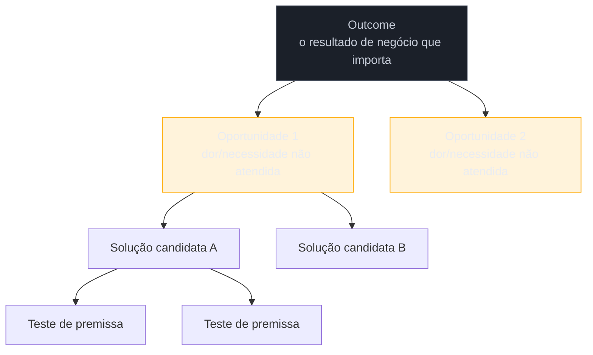

# Opportunity Solution Tree de bolso

> [!abstract] TL;DR
> A **Opportunity Solution Tree (OST)**, de Teresa Torres (*Continuous Discovery Habits*, 2021), é uma árvore visual que organiza descoberta de produto: um **outcome** no topo (o resultado de negócio que importa), **oportunidades** embaixo dele (dores e necessidades não atendidas, coletadas em entrevista), **soluções candidatas** embaixo de cada oportunidade, e **testes de premissa** embaixo de cada solução. O livro pressupõe um trio de produto (PM + design + engenharia) fazendo pelo menos uma entrevista de cliente por semana. Quem trabalha sozinho não tem trio — é o trio inteiro — e não tem cadência de entrevista semanal garantida. Esta nota é sobre a versão de bolso da OST: papel ou whiteboard, para organizar oportunidades antes de se comprometer com um caminho técnico, sem o aparato do livro original.

Imagine que uma entrevista de descoberta (nota 07) e uma switch interview (nota 09) já aconteceram, e você saiu delas com uma lista desorganizada de seis coisas que o cliente e os usuários mencionaram: "o processo de aprovação é lento", "as pessoas esquecem de anexar o documento certo", "ninguém sabe o status até perguntar por e-mail", "ansiedade de aprovar algo errado", "ninguém confia no relatório automático", "ninguém consegue justificar uma rejeição de forma clara para o solicitante". Seis pontos, aparentemente soltos. A tentação comum é escolher o que parece mais fácil de construir — "vou adicionar um status visível" — e seguir direto para a tela. O problema: sem organizar esses seis pontos numa estrutura que mostra qual outcome de negócio cada um serve, você não sabe se está resolvendo o que mais importa ou só o que é mais rápido de codificar.

## A estrutura da árvore

A OST tem quatro níveis, de cima para baixo:

- **Outcome** — o resultado de negócio mensurável que o trabalho deve mover (ex: "reduzir tempo médio de aprovação de contrato de 5 dias para 1"). Não é uma feature, é uma métrica que importa para o cliente/negócio.
- **Oportunidades** — as dores e necessidades reais, coletadas em entrevista, que — se resolvidas — movem o outcome. É aqui que os seis pontos soltos do cenário de abertura entram: cada um vira um nó de oportunidade.
- **Soluções candidatas** — ideias concretas de como atacar uma oportunidade específica. Uma oportunidade pode ter várias soluções candidatas concorrendo entre si.
- **Testes de premissa** — a forma mais barata de checar se uma solução candidata provavelmente funciona, antes de construir a versão completa (ver [[03-Dominios/Engenharia/UX/Descoberta e Pesquisa/11 - Assumption mapping|nota 11]] para como priorizar quais premissas testar primeiro).

O valor estrutural da árvore não é a estética — é forçar a pergunta "essa solução que estou animado para construir está ligada a uma oportunidade real, que está ligada a um outcome que importa?" antes de qualquer linha de código. Uma solução sem oportunidade acima dela na árvore é, por definição, uma aposta sem justificativa rastreável.

## "Eu sou o trio de produto inteiro"

Teresa Torres escreve *Continuous Discovery Habits* pressupondo um **trio de produto**: PM, designer e engenheiro, trabalhando juntos, fazendo **pelo menos uma entrevista de cliente por semana**, continuamente — não um projeto de descoberta pontual, um hábito contínuo. É hoje a referência dominante de product discovery em times ágeis modernos, exatamente porque descreve como esses times de fato trabalham.

O leitor deste domínio não tem esse trio — a mesma constatação que abre o domínio inteiro em [[03-Dominios/Engenharia/UX/Fundamentos e Modelo Mental/01 - UX não é tela - o ofício e seus limites|nota 01]]. Ele **é** o trio inteiro — entrevista (papel do PM), organiza a árvore e decide o fluxo (papel do designer), e constrói (papel do engenheiro), sozinho, dentro do mesmo projeto. E raramente tem cadência de uma entrevista de cliente por semana garantida — entrevistas acontecem quando o escopo do contrato permite, às vezes concentradas no início do projeto, não distribuídas continuamente. Isso não invalida a árvore; muda como ela é usada.

> [!question]- Se eu não tenho entrevista semanal contínua, a OST ainda faz sentido?
> Faz — só que como **ferramenta de organização pontual**, não como hábito contínuo no sentido literal do livro. Você monta a árvore uma vez, no início do projeto, com o que as entrevistas de descoberta já revelaram, e a revisita sempre que uma conversa nova (mesmo isolada) traz uma oportunidade nova. A disciplina que sobrevive à falta de cadência semanal é a de nunca pular direto de "conversa com cliente" para "solução construída" sem passar pelos nós de oportunidade no meio.

> [!tip] Vídeo — Teresa Torres explica a OST em conversa ao vivo
> [**Talking Methods: Driving better outcomes with Teresa Torres' OST**](https://www.youtube.com/watch?v=hHzsau3t_zY) (Mural, 14min52) é uma conversa ao vivo com a própria autora do método, explicando como a Opportunity Solution Tree ajuda times a equilibrar o que é bom para o negócio e o que é bom para o cliente — a origem do conceito de outcome/oportunidade/solução usado nesta nota, contada por quem o criou.
>
> 🎬 [Assistir no YouTube](https://www.youtube.com/watch?v=hHzsau3t_zY)

## A versão de bolso: papel ou whiteboard

A versão de bolso da OST não precisa de ferramenta digital nem de FigJam colaborativo — um papel grande, um whiteboard, ou até um documento de texto com indentação já cumprem a função, porque o valor está na estrutura, não na ferramenta:

1. **Escreva o outcome no topo.** Se você não consegue escrever um outcome mensurável de negócio (não uma feature), volte para a entrevista de descoberta antes de continuar — sinal de que a fase generativa (nota 06) ainda não está madura o suficiente.
2. **Liste as oportunidades abaixo**, uma por dor/necessidade real ouvida em entrevista — não invente oportunidades que ninguém mencionou.
3. **Para cada oportunidade, anote as soluções candidatas** que vêm à mente, sem filtrar ainda — é normal ter 2-3 ideias concorrentes para a mesma oportunidade.
4. **Escolha, por oportunidade, a solução com melhor relação impacto/esforço**, e anote 1 teste de premissa barato antes de comprometer tempo de construção — a ponte natural para o assumption mapping da próxima nota.

O exercício inteiro cabe numa sessão de 30-60 minutos sozinho, revisitada sempre que uma entrevista nova trouxer oportunidade nova. Não é sobre manter uma árvore digital viva e sincronizada — é sobre nunca tomar a decisão de "o que construir" sem visualizar, mesmo informalmente, o caminho de outcome → oportunidade → solução.

**O mecanismo em uma frase:** a OST não decide a solução por você — ela força a pergunta "essa solução resolve qual oportunidade, e essa oportunidade move qual outcome?" antes de você se comprometer com o código.

## O que dá pra fazer sozinho, e o que não dá

| Praticável sozinho | Exige time/orçamento |
|---|---|
| OST de bolso em papel/whiteboard, revisada por sessão de projeto | OST digital viva, sincronizada continuamente pelo trio de produto (o modelo original do livro) |
| Organizar oportunidades a partir de entrevistas pontuais já feitas | Cadência de 1+ entrevista de cliente por semana, contínua, como hábito de time |
| Escolher solução candidata por julgamento próprio de impacto/esforço | Priorização formal com múltiplos stakeholders votando/revisando a árvore |
| 1 teste de premissa barato por solução escolhida | Programa de testes de premissa rodando em paralelo para múltiplas soluções |

## Casos práticos

### Cenário 1: os seis pontos soltos viram árvore
Voltando ao cenário de abertura — os seis pontos soltos da entrevista de aprovação de contrato, organizados numa OST de bolso: o outcome é "reduzir tempo médio de aprovação de 5 dias para 1". "O processo é lento" e "ninguém sabe o status" viram duas oportunidades diferentes, ambas ligadas ao outcome. "Ansiedade de aprovar algo errado" vira uma terceira oportunidade, e ao organizá-la, o engenheiro percebe que ela na verdade *compete* com a solução óbvia de "mais rápido": uma solução que acelera aprovação sem dar mais confiança pode até piorar a ansiedade. A árvore revela essa tensão antes de qualquer tela ser desenhada — algo que a lista solta de seis pontos não deixava visível.

### Cenário 2: a solução favorita sem oportunidade acima
Um engenheiro fractional está animado para construir um chatbot de suporte interno — acha a ideia tecnicamente interessante. Ao tentar encaixá-la na OST, ele percebe que não existe nenhuma oportunidade na árvore (nenhuma dor relatada em entrevista) que o chatbot resolveria diretamente — é uma solução procurando um problema. Isso não significa que a ideia é ruim; significa que, antes de construir, falta uma entrevista específica para checar se essa dor existe de verdade. A árvore não impediu a ideia — impediu que ela pulasse a validação disfarçada de "óbvio que vai ajudar".

## Armadilhas comuns

> [!warning] Pular direto de outcome para solução, sem passar pelas oportunidades
> **O que acontece:** o engenheiro escreve o outcome no topo e já desce direto para "vou construir X", sem nomear qual dor real, ouvida em entrevista, X resolve. **Por quê:** ir direto à solução é mais rápido e mais confortável — parece progresso imediato — enquanto nomear oportunidades exige lembrar e organizar o que a entrevista revelou, trabalho que parece "menos produtivo". **Como evitar:** trate qualquer solução sem oportunidade-mãe na árvore como suspeita — pergunte "que dor real, de qual entrevista, essa solução resolve?" antes de aceitar o nó.

> [!warning] Inventar oportunidades sem base em entrevista real
> **O que acontece:** a árvore é preenchida com oportunidades que "fazem sentido" na cabeça do engenheiro, mas que ninguém de fato mencionou numa conversa real. **Por quê:** é tentador preencher a árvore rápido com suposições plausíveis — parece completa, mas não é rastreável a nenhum dado. **Como evitar:** cada nó de oportunidade deveria ter uma citação ou paráfrase de uma entrevista real ao lado. Se você não consegue apontar de onde veio, é hipótese, não oportunidade — trate como proto-persona (ver [[03-Dominios/Engenharia/UX/Descoberta e Pesquisa/12 - Proto-persona vs persona de verdade|nota 12]]).

> [!warning] Tratar a árvore como documento definitivo, nunca revisitado
> **O que acontece:** a OST é montada uma vez no início do projeto e nunca mais atualizada, mesmo quando entrevistas novas revelam oportunidades diferentes. **Por quê:** sem a cadência semanal do modelo original, é fácil esquecer que a árvore deveria ser um artefato vivo, mesmo que revisado esporadicamente. **Como evitar:** trate cada conversa nova com cliente/usuário como gatilho para reabrir a árvore por 5 minutos e perguntar "isso muda ou adiciona algum nó?".

## Como explicar em inglês

> "The Opportunity Solution Tree, from Teresa Torres's *Continuous Discovery Habits*, maps discovery visually: an **outcome** at the top, **opportunities** — unmet needs surfaced in interviews — beneath it, **candidate solutions** beneath each opportunity, and **assumption tests** beneath each solution. The book assumes a full product trio doing weekly customer interviews. Working solo, you're the whole trio — so the pocket version is the same structure on paper or a whiteboard, revisited whenever a new conversation surfaces something, not maintained as a continuously synced artifact."

| PT | EN |
|----|----|
| árvore de oportunidade e solução | Opportunity Solution Tree |
| outcome | outcome |
| oportunidade | opportunity |
| solução candidata | candidate solution |
| teste de premissa | assumption test |
| trio de produto | product trio |

## O que vem a seguir

A OST organiza as oportunidades e aponta qual solução testar — mas não diz *como* testar barato antes de construir. A próxima nota entrega exatamente esse método: como priorizar e testar as premissas mais arriscadas de uma solução candidata antes de comprometer tempo de engenharia nela.

- [[03-Dominios/Engenharia/UX/Descoberta e Pesquisa/11 - Assumption mapping|11 — Assumption mapping]] — como decidir qual premissa testar primeiro, com um quadrante simples de importância × evidência.
- [[03-Dominios/Engenharia/UX/Descoberta e Pesquisa/13 - Teste de usabilidade guerrilha com 5 usuários|13 — Teste de usabilidade guerrilha]] — um dos testes de premissa mais baratos e mais aplicáveis sozinho.

## Fontes

- **Teresa Torres** — *[Continuous Discovery Habits](https://www.producttalk.org/continuous-discovery-habits-book/)* (2021) — fonte primária da Opportunity Solution Tree e do modelo de trio de produto com entrevista semanal contínua.
