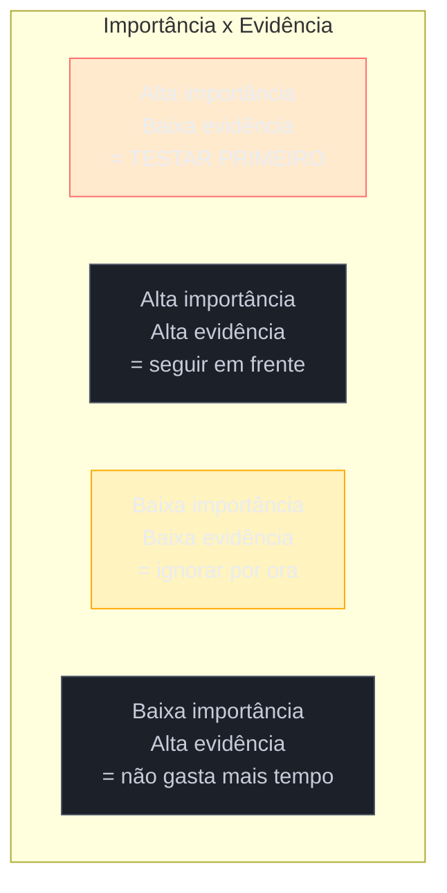

# Assumption mapping

> [!abstract] TL;DR
> **Assumption mapping**, de David J. Bland e Alexander Osterwalder (*Testing Business Ideas*, 2019), mapeia as premissas escondidas atrás de uma solução em três categorias — **desejabilidade** (alguém quer isso?), **viabilidade** (o negócio sustenta isso?) e **factibilidade** (dá pra construir isso?) — e as posiciona num quadrante de **importância × evidência**. A regra é simples e poderosa: teste primeiro o que é mais importante e menos comprovado — não o que é mais fácil de testar. Praticável por uma pessoa só: um quadro simples, facilitado em 30-60 minutos, é o suficiente. É a ponte natural entre a [[03-Dominios/Engenharia/UX/Descoberta e Pesquisa/10 - Opportunity Solution Tree de bolso|Opportunity Solution Tree]] (que termina em "teste de premissa") e a decisão concreta de o que testar primeiro.

Imagine que a Opportunity Solution Tree da nota anterior te deu uma solução candidata clara: "um resumo automático de riscos, gerado antes da aprovação de um contrato". Você está animado e pronto para construir. Mas essa única frase esconde pelo menos cinco apostas diferentes, sem que ninguém tenha dito isso em voz alta: que as pessoas confiam num resumo gerado automaticamente (desejabilidade); que elas realmente vão ler o resumo antes de aprovar, e não pular direto para o botão (desejabilidade); que o cliente vai pagar pela funcionalidade extra ou aceitar o prazo maior que ela exige (viabilidade); que existe dado estruturado suficiente no contrato para gerar um resumo confiável (factibilidade); e que o tempo de geração do resumo não vai tornar o fluxo mais lento do que já é (factibilidade). Construir direto, sem nomear essas apostas, significa descobrir qual delas estava errada só depois de semanas de trabalho — na pior ordem possível, a de "descobrir depois de já ter construído".

## As três categorias de premissa

Toda solução carrega premissas nas três dimensões do *Business Model Canvas*, o framework anterior de Osterwalder que o assumption mapping estende para o terreno de teste:

- **Desejabilidade** — alguém quer isso de verdade? A pessoa vai usar, vai confiar, vai mudar o comportamento atual por causa disso?
- **Viabilidade** — o negócio sustenta isso? Faz sentido financeiro, o cliente paga pelo esforço extra, o retorno justifica o investimento?
- **Factibilidade** — dá pra construir isso, com os dados, o tempo e a tecnologia disponíveis?

Engenheiros tendem a pular direto para factibilidade — é a dimensão mais confortável, porque é a que eles já sabem avaliar. As duas primeiras costumam ficar implícitas, nunca nomeadas, e são justamente as que mais derrubam projetos que "davam pra construir" mas que ninguém queria ou que o negócio não sustentava.

## O quadrante: importância × evidência

Depois de listar as premissas nas três categorias, o passo seguinte é posicioná-las num quadrante de duas dimensões:

- **Importância** — se essa premissa estiver errada, o quanto isso derruba a solução inteira? (não a sua opinião sobre o quanto ela importa — o impacto real se ela falhar)
- **Evidência** — o quanto você já sabe, de dado real (entrevista, uso observado, dado de mercado), que confirma essa premissa? Não confundir com "o quanto eu acredito nela" — convicção pessoal não é evidência.

O quadrante superior-esquerdo — alta importância, baixa evidência — é onde o risco real mora, e é o único quadrante que exige ação imediata. É tentador testar primeiro o que é mais fácil de testar (geralmente factibilidade, porque um engenheiro sabe estimar isso rápido) — mas fácil de testar não é o mesmo que arriscado o suficiente para justificar testar primeiro.

No exemplo de abertura: "as pessoas confiam num resumo gerado automaticamente" tem alta importância (se for falso, a feature inteira não é usada) e provavelmente baixa evidência (ninguém perguntou isso ainda) — vai para o quadrante vermelho, testado antes de qualquer linha de código do resumo automático. "Dá pra gerar o resumo tecnicamente" também é importante, mas se o engenheiro já sabe que sim (alta evidência, por experiência prévia com a mesma stack), não precisa de teste — só de execução.

> [!question]- Como "testar" uma premissa sem construir a solução inteira?
> Com o teste mais barato que ainda produz evidência real — nunca a versão completa. Para "as pessoas confiam num resumo automático", isso pode ser: mostrar um resumo gerado manualmente (fake, mas visualmente idêntico ao que a IA geraria) para 5 pessoas reais antes de aprovar um contrato, e observar se elas de fato leem antes de clicar aprovar, ou pulam direto — o mesmo espírito do teste guerrilha da [[03-Dominios/Engenharia/UX/Descoberta e Pesquisa/13 - Teste de usabilidade guerrilha com 5 usuários|nota 13]], aplicado a uma premissa específica em vez de a um fluxo inteiro.

**O mecanismo em uma frase:** assumption mapping não pergunta "isso funciona?" de forma genérica — pergunta "qual das apostas escondidas nessa solução, se estiver errada, derruba tudo, e o quanto eu já sei sobre ela?", e testa essa primeiro.

> [!tip] Vídeo — David Bland conduzindo um assumption mapping
> [**Testing Business Ideas: Assumptions Mapping Webinar**](https://www.youtube.com/watch?v=Am598Cbq5gU) (David J Bland, 38min) é o próprio coautor de *Testing Business Ideas* explicando e conduzindo o exercício de assumption mapping — desejabilidade, viabilidade, factibilidade, e como posicionar cada premissa no quadrante de importância × evidência, na prática e com exemplos reais de time.
>
> 🎬 [Assistir no YouTube](https://www.youtube.com/watch?v=Am598Cbq5gU)

## Facilitando sozinho

O exercício cabe numa sessão de 30-60 minutos, sozinho ou com o cliente presente (o que ajuda a alinhar expectativa sobre o que ainda é incerto):

1. **Escreva a solução candidata** que veio da OST no topo de um quadro.
2. **Liste premissas nas três categorias** — força-se a listar pelo menos uma de desejabilidade, uma de viabilidade e uma de factibilidade, mesmo que a tentação seja pular direto para a técnica.
3. **Posicione cada premissa no quadrante** importância × evidência, sozinho por julgamento (não precisa de dado formal para isso — é uma estimativa honesta, não uma métrica).
4. **Escolha 1-2 premissas do quadrante vermelho** (alta importância, baixa evidência) e desenhe o teste mais barato que produz evidência real sobre elas, antes de continuar construindo.

Um quadro em papel, FigJam ou Miro serve igualmente — a ferramenta não importa, o exercício de nomear e priorizar é o que evita o erro caro.

## O que dá pra fazer sozinho, e o que não dá

| Praticável sozinho | Exige time/orçamento |
|---|---|
| Assumption mapping facilitado sozinho ou com o cliente, 30-60 minutos, num quadro simples | Programa formal de *discovery* com múltiplos experimentos rodando em paralelo, revisados por time |
| Testes de premissa baratos (protótipo fake, conversa direcionada, landing page simples) | Testes controlados com significância estatística (A/B test com tráfego real, survey validado) |
| Priorizar por julgamento próprio no quadrante importância × evidência | Priorização cruzada, com múltiplos stakeholders calibrando a mesma matriz |

A pergunta de segunda-feira: antes de começar a construir a próxima solução que saiu da sua OST, escreva em voz alta as três-cinco premissas escondidas nela (uma de cada categoria, no mínimo) e pergunte "qual dessas, se estiver errada, mais me custa — e o que eu já sei sobre ela de verdade?". É o mesmo hábito de nomear o limite do que se sabe, em vez de fingir certeza, que a [[03-Dominios/Engenharia/UX/Fundamentos e Modelo Mental/01 - UX não é tela - o ofício e seus limites|nota 01]] recomenda para saber quando chamar um especialista.

## Casos práticos

### Cenário 1: o resumo de riscos do exemplo de abertura
Retomando o exemplo de abertura: o assumption mapping revela que "as pessoas confiam num resumo automático" é alta importância e baixa evidência. Em vez de construir o gerador de resumo (semanas de trabalho, incluindo lidar com a factibilidade de extrair dado estruturado do contrato), o engenheiro cria manualmente três resumos falsos, mostra para 5 aprovadores reais antes de decisões reais de aprovação, e observa. Dois dos cinco ignoram o resumo e vão direto para o botão — sinal de que a premissa de desejabilidade está parcialmente errada, e que o resumo sozinho não muda o comportamento sem um passo intermediário (por exemplo, exigir que o aprovador confirme ter lido). Essa informação, obtida em uma tarde, evita construir uma feature completa que metade dos usuários ignoraria.

### Cenário 2: a premissa de viabilidade que ninguém checou
Um fractional engineer constrói, por conta própria, uma integração cara e complexa com um serviço externo, convencido de que o cliente vai adorar. Ele nunca testou a premissa de viabilidade — "o cliente aceita pagar pela licença extra desse serviço" — porque parecia óbvio que sim. Ao apresentar o resultado pronto, o cliente recusa o custo mensal do serviço externo, que nunca tinha sido discutido. Semanas de trabalho técnico (a parte de factibilidade, que estava correta) foram descartadas porque a premissa de viabilidade, muito mais barata de checar com uma única pergunta direta, nunca foi nomeada nem testada.

## Armadilhas comuns

> [!warning] Testar só factibilidade, porque é a dimensão mais confortável
> **O que acontece:** o engenheiro nomeia e testa exaustivamente se a solução é tecnicamente possível, e nunca chega a nomear premissas de desejabilidade ou viabilidade. **Por quê:** factibilidade é a dimensão em que um engenheiro tem mais confiança de avaliação — parece produtivo testar o que se sabe testar, mesmo que não seja o risco maior. **Como evitar:** force pelo menos uma premissa em cada uma das três categorias antes de escolher o que testar primeiro — se a lista de desejabilidade ou viabilidade está vazia, é sinal de que não foi pensada, não de que não existe.

> [!warning] Confundir convicção pessoal com evidência
> **O que acontece:** uma premissa é marcada como "alta evidência" porque o engenheiro tem certeza pessoal dela, sem nenhum dado de entrevista, uso observado ou mercado por trás. **Por quê:** convicção parece evidência de dentro da própria cabeça — é difícil distinguir "eu sei disso" de "eu acredito muito nisso" sem parar para checar a fonte. **Como evitar:** para cada premissa marcada como alta evidência, pergunte "de onde vem essa evidência — que entrevista, que dado, que observação?". Se a resposta é "eu simplesmente sei", reclassifique como baixa evidência.

> [!warning] Testar o quadrante errado porque é mais fácil
> **O que acontece:** o time testa premissas do quadrante de baixa importância porque o teste é rápido e satisfatório de completar, deixando o quadrante vermelho (alta importância, baixa evidência) para depois. **Por quê:** completar um teste barato dá sensação de progresso, mesmo que o teste não reduza o risco real do projeto. **Como evitar:** ordene explicitamente a lista de testes pelo quadrante, não pela facilidade — o vermelho sempre primeiro, mesmo que pareça mais difícil de desenhar.

## Como explicar em inglês

> "Assumption mapping, from Bland and Osterwalder's *Testing Business Ideas*, breaks a solution down into hidden assumptions across three dimensions — **desirability** (does anyone want this?), **viability** (does the business sustain this?), and **feasibility** (can we actually build it?) — then plots them on an **importance × evidence** grid. The rule: test whatever is most important and least proven first, not whatever's easiest to test. It's a solo-friendly, 30-60 minute facilitated exercise, and it's the natural next step after an Opportunity Solution Tree names a candidate solution."

| PT | EN |
|----|----|
| mapeamento de premissas | assumption mapping |
| desejabilidade | desirability |
| viabilidade | viability |
| factibilidade | feasibility |
| quadrante importância x evidência | importance x evidence grid |
| teste de premissa | assumption test |

## O que vem a seguir

Assumption mapping prioriza *qual* premissa testar primeiro. Um dos tipos de premissa mais recorrentes — e mais fáceis de tratar como fato sem nunca ter sido testada — é a suposição sobre quem é o usuário. A próxima nota nomeia exatamente esse risco.

- [[03-Dominios/Engenharia/UX/Descoberta e Pesquisa/12 - Proto-persona vs persona de verdade|12 — Proto-persona vs persona de verdade]] — por que uma proto-persona é, ela mesma, um conjunto de premissas de desejabilidade não testadas.
- [[03-Dominios/Engenharia/UX/Descoberta e Pesquisa/13 - Teste de usabilidade guerrilha com 5 usuários|13 — Teste de usabilidade guerrilha]] — um dos métodos mais baratos de gerar evidência real para o quadrante vermelho.

## Fontes

- **David J. Bland e Alexander Osterwalder** — *[Testing Business Ideas](https://www.strategyzer.com/library/testing-business-ideas)* (2019) — fonte primária do assumption mapping, das três dimensões de premissa e do quadrante importância × evidência.
