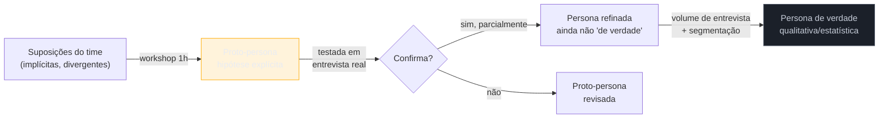

# Proto-persona vs persona de verdade

> [!abstract] TL;DR
> Uma **proto-persona** — termo de Jeff Gothelf e Josh Seiden em *Lean UX* (2013) — é feita em workshop, a partir das **suposições do time**, não de pesquisa. Ela serve para explicitar premissas compartilhadas sobre quem é o usuário. É **hipótese, não dado**. Uma **persona "de verdade"** (qualitativa ou estatística) exige pesquisa prévia real: entrevistas em volume, mais segmentação validada por padrão recorrente, não por suposição. O risco central desta nota não é usar proto-persona — é usá-la e **chamá-la de persona validada**, tratando uma suposição de 20 minutos como se fosse dado de pesquisa. A nota é sobre saber qual das duas você tem nas mãos, e quando um workshop de 1h basta versus quando é hora de pesquisa de verdade.

Imagine o Cenário 3 já mencionado na nota de abertura deste domínio, agora contado em detalhe: um engenheiro solo, sob pressão de prazo, monta uma proto-persona em 20 minutos — sem falar com nenhum usuário real — baseada no que ele e o cliente *acham* que o usuário típico é: "profissional técnico, confortável com jargão, usa o produto no navegador do trabalho". Essa proto-persona vira a base de decisões de arquitetura de informação para o produto inteiro, e passa a ser chamada, nas reuniões seguintes, de "a persona validada". Dois meses depois, uma entrevista de descoberta atrasada — só disparada porque um usuário reclamou publicamente — revela que a suposição central estava errada: o público real não é o profissional técnico da proto-persona, é um usuário administrativo, sem vocabulário técnico algum, que abandona qualquer tela com termo que ele não reconhece. Refazer a arquitetura de informação depois de construída custou semanas. Teria custado horas se a etiqueta "proto-persona, não validada" tivesse sido honesta desde o início.

## O que é uma proto-persona, e o que ela não é

Jeff Gothelf e Josh Seiden, em *Lean UX* (2013), propõem a proto-persona como ferramenta de **alinhamento de time**, não de pesquisa: reunir quem está envolvido no projeto (mesmo que seja só você e o cliente) num workshop curto, e escrever as suposições compartilhadas sobre quem é o usuário — nome fictício, objetivo principal, frustração principal, comportamento típico. O valor não está na precisão da persona resultante; está em **tornar visível** o que cada pessoa da sala estava assumindo sozinha na cabeça, muitas vezes de forma diferente uma da outra.

O diagrama mostra a diferença estrutural: a proto-persona nasce de suposição e *deveria* ser sempre um ponto de partida a testar, nunca um ponto de chegada. O erro do cenário de abertura não foi criar a proto-persona — foi pular a seta "testada em entrevista real" e tratar a hipótese como se já estivesse no final do fluxo.

## O que é uma persona "de verdade"

Uma persona qualitativa ou estatística validada exige o que a proto-persona explicitamente não tem: **pesquisa prévia real**. Isso significa entrevistas em volume suficiente (tipicamente dezenas, não 3-5) para identificar padrões que se repetem — não um comportamento isolado de uma pessoa, mas um agrupamento recorrente de objetivos, frustrações e contexto que aparece de forma consistente entre entrevistados diferentes — seguido de segmentação validada, ou seja, confirmação de que os agrupamentos identificados de fato correspondem a grupos distintos de usuários reais, não a uma divisão arbitrária que o pesquisador imaginou.

Esse processo — entrevista em volume, síntese qualitativa rigorosa, validação de segmento — é trabalho de semanas, tipicamente feito por um pesquisador dedicado ou um time de pesquisa. Está, estruturalmente, fora do alcance de uma pessoa trabalhando sozinha num projeto de escopo pequeno, pelo mesmo motivo que o *mental model research* de Indi Young está fora de alcance (ver [[03-Dominios/Engenharia/UX/Fundamentos e Modelo Mental/01 - UX não é tela - o ofício e seus limites|nota 01]]).

## O teste que separa as duas: "de onde vem cada frase?"

> [!question]- Como saber, na prática, se a persona que estou olhando é proto ou de verdade?
> Pergunte, frase por frase da descrição da persona: "essa afirmação vem de uma entrevista real, ou é a nossa melhor suposição?". Se a resposta para a maioria das frases é "suposição", é uma proto-persona — e deveria estar etiquetada como tal, não apresentada como "a persona do produto" sem qualificação. Uma proto-persona honesta é útil; uma proto-persona disfarçada de persona validada é um risco silencioso, porque decisões inteiras se apoiam nela sem que ninguém questione a base.

**O mecanismo em uma frase:** a diferença entre proto-persona e persona de verdade não é o formato do documento — é se cada afirmação nele tem uma entrevista real por trás, ou só a convicção de quem escreveu.

> [!tip] Vídeo — proto-personas explicadas pela NN/g
> [**Proto Personas**](https://www.nngroup.com/videos/proto-personas/) (Samhita Tankala, NN/g, 3min) explica que proto-personas capturam o conhecimento e as suposições que o time *já tem* sobre os usuários atuais — sem pesquisa nova — e por isso devem ser usadas com cautela. Reforço direto da distinção central desta nota: proto-persona é hipótese de time, não persona validada por pesquisa.
>
> 🎬 [Assistir no NN/g](https://www.nngroup.com/videos/proto-personas/)

## Quando um workshop de 1h basta, e quando não basta

A proto-persona é praticável e legítima — não é "pesquisa de segunda categoria", é a ferramenta certa para o momento certo:

- **Basta um workshop de 1h quando** o objetivo é alinhar o time (mesmo que o time seja você e o cliente) sobre suposições compartilhadas no início de um projeto, antes de qualquer investimento sério de tempo — e quando a decisão em jogo é reversível o suficiente para corrigir depois com pouco custo.
- **Exige pesquisa de verdade quando** a decisão que a persona vai sustentar é cara de reverter (arquitetura de informação de um produto com muitos usuários ativos, como no Cenário 3 da nota 01), ou quando o produto atende públicos claramente diferentes e a decisão depende de segmentá-los corretamente (por exemplo, decidir se o produto precisa de dois fluxos distintos ou de um só).

A regra prática: trate toda proto-persona como um **rascunho a ser testado o quanto antes** com uma entrevista de descoberta real (nota 07) ou uma switch interview (nota 09) — não como um documento final. Se a proto-persona sobrevive a 3-5 entrevistas reais sem contradição relevante, ela ganhou confiança (ainda não é "persona de verdade" no sentido estatístico, mas já não é pura suposição). Se ela é contradita já na primeira ou segunda entrevista, como no cenário de abertura, isso é sinal — e sinal barato, porque veio cedo — de que as suposições do time estavam erradas.

## O que dá pra fazer sozinho, e o que não dá

| Praticável sozinho | Exige time/orçamento |
|---|---|
| Proto-persona em workshop de 1h, com o cliente ou sozinho, explicitamente etiquetada como hipótese | Persona qualitativa validada por dezenas de entrevistas com síntese formal |
| Testar a proto-persona contra 3-5 entrevistas reais de descoberta | Segmentação estatística validada, com múltiplos grupos de usuário confirmados por padrão recorrente |
| Revisar e corrigir a proto-persona sempre que uma entrevista real a contradiz | Programa contínuo de pesquisa de persona, mantido e atualizado por um pesquisador dedicado |

A pergunta de segunda-feira: ao ver (ou escrever) uma persona num projeto, pergunte em voz alta "isso é proto ou de verdade — e se é proto, quando eu testo?". Nomear isso na frente do cliente, mesmo que pareça menos impressionante que "aqui está a persona validada do nosso usuário", é o que evita o custo de retrabalho do Cenário 3.

## Casos práticos

### Cenário 1: a persona que virou verdade absoluta (revisitado em detalhe)
O cenário de abertura desta nota, com o detalhe adicional: quando a entrevista atrasada finalmente acontece, o engenheiro percebe que a proto-persona original não estava completamente errada — o produto de fato tem usuários técnicos, só que eles são uma fração pequena do total, não a maioria. A correção não é descartar a proto-persona inteira, é reconhecer que ela capturou um segmento real, mas tratou-o como se fosse o único, porque nunca foi testada contra volume suficiente de entrevista para revelar o segundo grupo, maior, de usuários administrativos.

### Cenário 2: a proto-persona que sobreviveu ao teste
Um fractional engineer monta uma proto-persona em 45 minutos com o cliente antes de iniciar um projeto de automação de relatórios financeiros: "analista júnior, sobrecarregado, sem tempo para aprender ferramenta nova complexa". Nas primeiras 3 entrevistas de descoberta reais, o padrão se confirma consistentemente — os três entrevistados descrevem exatamente essa pressão de tempo e essa resistência a complexidade. A proto-persona não virou "persona validada" no sentido formal (ainda são só 3 entrevistas, não dezenas), mas ganhou confiança suficiente para orientar decisões de design de interação com risco razoável — e o engenheiro segue nomeando-a como "proto-persona confirmada em 3 entrevistas", não como um dado estatístico que ela não é.

## Armadilhas comuns

> [!warning] Chamar proto-persona de "persona validada" sem qualificação
> **O que acontece:** um documento nascido de suposição de workshop circula nas reuniões seguintes como "a persona do produto", sem menção de que nunca foi testada contra entrevista real. **Por quê:** o formato visual de uma persona (nome, foto, citação, objetivos) é o mesmo esteja ela baseada em suposição ou em pesquisa — o documento não carrega a proveniência da informação por si só. **Como evitar:** etiquete explicitamente, no próprio documento, se é "proto-persona (hipótese, não testada)" ou "persona confirmada em N entrevistas" — a etiqueta é o que preserva a proveniência quando o documento circula sem contexto.

> [!warning] Nunca testar a proto-persona depois de criada
> **O que acontece:** o workshop de 1h acontece, a proto-persona nasce, e nunca mais é confrontada com uma entrevista real ao longo do projeto inteiro. **Por quê:** o workshop parece "trabalho feito" — ele produziu um artefato visível — e não há gatilho natural para revisitar e testar a suposição depois. **Como evitar:** trate a criação da proto-persona como o início de um processo, não o fim — agende explicitamente a primeira entrevista de teste dela como próximo passo, não como "se der tempo".

> [!warning] Tratar 1 usuário atípico como refutação (ou confirmação) definitiva
> **O que acontece:** uma única entrevista que contradiz (ou confirma) a proto-persona é tratada como prova definitiva, na direção que for. **Por quê:** é a mesma armadilha de amostra pequena da [[03-Dominios/Engenharia/UX/Descoberta e Pesquisa/07 - Entrevista de descoberta - as regras do Mom Test|nota 07]] — uma pessoa pode ser exceção legítima, não representativa do padrão. **Como evitar:** trate cada entrevista como um voto, não como veredito — depois de 3-5 entrevistas convergentes (ou divergentes), aí sim é sinal confiável o suficiente para revisar a proto-persona.

## Como explicar em inglês

> "A proto-persona — from Gothelf and Seiden's *Lean UX* — is built in a workshop from the **team's assumptions**, not from research. It's a hypothesis, not data. A real persona requires actual prior research: interviews at volume, plus validated segmentation. The risk isn't using a proto-persona — it's calling it 'validated' and building architecture decisions on top of an assumption nobody ever tested against a real interview."

| PT | EN |
|----|----|
| proto-persona | proto-persona |
| persona validada | validated persona |
| suposição do time | team assumption |
| segmentação validada | validated segmentation |
| hipótese, não dado | hypothesis, not data |
| workshop de alinhamento | alignment workshop |

## O que vem a seguir

Depois de nomear honestamente quem você acha que é o usuário, o próximo passo natural é testar essa suposição contra comportamento real — não mais opinião nem hipótese, mas observação direta de alguém tentando usar o que você construiu.

- [[03-Dominios/Engenharia/UX/Descoberta e Pesquisa/13 - Teste de usabilidade guerrilha com 5 usuários|13 — Teste de usabilidade guerrilha com 5 usuários]] — o teste mais barato e mais acessível para confrontar suposição com comportamento real.
- [[03-Dominios/Engenharia/UX/Descoberta e Pesquisa/14 - Personas sintéticas e síntese por IA|14 — Personas sintéticas e síntese por IA]] — o mesmo risco de "hipótese disfarçada de dado", agora aplicado a personas geradas por IA.

## Fontes

- **Jeff Gothelf e Josh Seiden** — *[Lean UX](https://www.jeffgothelf.com/books/)* (2013) — fonte primária do conceito de proto-persona como ferramenta de alinhamento de time baseada em suposição.
