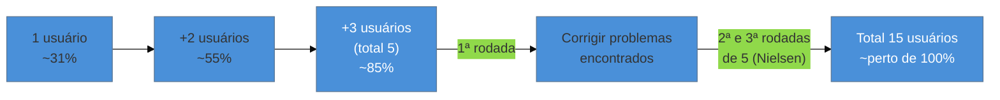

# Teste de usabilidade guerrilha com 5 usuários

> [!abstract] TL;DR
> **Jakob Nielsen**, em "Why You Only Need to Test with 5 Users" (NN/g, 2000), popularizou a ideia de que 5 usuários capturam cerca de **85% dos problemas de usabilidade** num teste qualitativo — baseado em estudo com Thomas Landauer (1993). É o método avaliativo mais barato e mais praticável por uma pessoa só. **Mas o caveat é obrigatório**, e é o erro mais comum da área: o próprio Nielsen recomenda **3 rodadas de 5 (15 usuários no total)** para chegar perto de 100% de cobertura — a citação isolada "só precisa de 5" virou bala de prata mal aplicada. Some a isso o risco de **sample viciado**: 5 usuários errados (colegas, early adopters, quem é fácil de recrutar) não valem 5 usuários certos, por melhor que o roteiro do teste seja.

Imagine que você acabou de terminar o fluxo de checkout de um produto B2B e quer validar antes de lançar. Você recruta 5 pessoas — três colegas de trabalho e dois amigos que também trabalham com tecnologia — e pede para completarem o fluxo enquanto você observa. Todos os cinco completam sem grande dificuldade, com pequenos comentários sobre um botão mal posicionado. Você corrige o botão, lança satisfeito: "testei com 5 usuários, está validado". Duas semanas depois, os usuários reais — administrativos sem familiaridade com jargão de produto digital — travam repetidamente num passo que nenhum dos seus 5 testadores sequer notou, porque para eles (técnicos, acostumados com interfaces parecidas) o passo era óbvio. Você seguiu a regra de 5 usuários corretamente no número, e errou nas duas coisas que fazem o número funcionar: quem eram os 5, e quantas rodadas você fez.

## De onde vem o número 5

Jakob Nielsen — o mesmo autor das [[03-Dominios/Engenharia/UX/Fundamentos e Modelo Mental/03 - As 10 heurísticas de Nielsen|10 heurísticas]] que dão vocabulário para nomear o que um teste guerrilha encontra — com base num estudo anterior com **Thomas Landauer** (Nielsen, J. e Landauer, T.K., *A Mathematical Model of the Finding of Usability Problems*, 1993), publicou em 2000 um artigo que se tornou um dos mais citados (e mal citados) da área: com 5 usuários testando um design, você tipicamente descobre cerca de **85% dos problemas de usabilidade** existentes. O modelo matemático por trás disso: cada usuário adicional revela problemas novos, mas com retorno decrescente — o primeiro usuário revela boa parte dos problemas óbvios, o segundo revela menos problemas novos, e assim por diante, até que testar mais gente custe mais do que revela.

O padrão matemático explica por que 5 é o ponto de maior retorno-por-esforço para uma **primeira rodada** — mas essa é exatamente a parte da recomendação original que se perdeu na repetição popular do "só precisa de 5". A curva não para nos 85%; ela continua subindo com mais usuários, só que mais devagar.

## O caveat que a maioria ignora: 3 rodadas de 5, não uma

> [!warning] "Só precisa de 5" como bala de prata universal
> **O que acontece:** um teste único com 5 usuários é tratado como validação completa e definitiva, encerrando qualquer discussão sobre usabilidade do fluxo testado.
> **Por quê:** a citação "5 usuários bastam" circula isolada do resto da recomendação de Nielsen. O artigo original, e trabalhos posteriores da própria NN/g, deixam claro que a recomendação completa é **3 rodadas de 5 usuários (15 no total)** — testar, corrigir o design com base nos problemas achados, testar de novo com 5 usuários **novos**, corrigir de novo, testar uma terceira vez. Isso aproxima a cobertura de 100%, sem o custo (e o retorno decrescente) de testar 15 pessoas de uma vez só na mesma versão do design.
> **Como evitar:** ao dizer "testei com 5 usuários", nomeie explicitamente que isso é a **primeira rodada** de um processo iterativo, capturando cerca de 85% dos problemas — não a palavra final sobre usabilidade do fluxo. Se o orçamento/tempo permitir só uma rodada, isso é uma limitação real do processo, e vale dizer isso em voz alta ao cliente, não apresentar como cobertura completa.

O motivo estrutural para as 3 rodadas: um teste único revela problemas, mas a correção desses problemas pode introduzir problemas novos que só aparecem depois de corrigidos — e um mesmo grupo de 5 pessoas, testando a versão corrigida, já viu o fluxo antes e não reage mais como um usuário de primeira vez reagiria. Rodadas subsequentes usam usuários **novos**, exatamente para preservar a reação de primeira vez que o teste de usabilidade depende de capturar.

## O risco espelho: sample viciado

O segundo erro, tão comum quanto o primeiro e presente no cenário de abertura desta nota, não é sobre quantidade — é sobre quem são os 5. **Sample viciado** acontece quando os 5 usuários testados não representam o público real: colegas de trabalho (que já conhecem o domínio e a interface), early adopters (naturalmente mais tolerantes a fricção e mais dispostos a explorar), ou qualquer grupo recrutado por conveniência em vez de por representatividade.

**5 usuários errados não valem 5 usuários certos.** O modelo matemático de Nielsen assume que os 5 usuários vêm da população real que vai usar o produto — a cobertura de 85% é sobre problemas que *esse público específico* encontraria. Testar com o público errado produz um número de problemas encontrados, mas não os problemas certos: o teste "passa" e o produto falha na adoção real, exatamente como o Cenário 2 já descrito na nota de abertura do domínio ([[03-Dominios/Engenharia/UX/Fundamentos e Modelo Mental/01 - UX não é tela - o ofício e seus limites|nota 01]]).

**O mecanismo em uma frase:** 5 usuários capturam ~85% dos problemas de um design — mas só se forem 5 usuários reais, e só na primeira de três rodadas; o número por si só não é a garantia, o processo completo é.

> [!tip] Vídeo — Jakob Nielsen sobre teste com 5 usuários
> [**Usability Testing w. 5 Users: Design Process**](https://www.nngroup.com/videos/usability-testing-w-5-users-design-process/) (Jakob Nielsen, NN/g, 4min) é o próprio autor da regra explicando por que o teste formativo com poucos participantes por rodada — em vez de um estudo único e caro — libera orçamento para testar mais iterações de design. Primeiro de uma série de 3 vídeos da NN/g sobre o método.
>
> 🎬 [Assistir no NN/g](https://www.nngroup.com/videos/usability-testing-w-5-users-design-process/)

## Steve Krug: o método DIY que envelheceu bem

**Steve Krug**, em *Don't Make Me Think* (2000) e *Rocket Surgery Made Easy* (2010), desenhou o método de teste guerrilha especificamente para times **sem pesquisador dedicado** — o público exato deste domínio. O roteiro de Krug envelheceu bem apesar dos exemplos de interface datados: observar sem guiar, pedir para o usuário "pensar em voz alta" enquanto tenta completar uma tarefa real, e resistir ao impulso de ajudar quando ele trava — porque o travamento é exatamente o dado que você está coletando. O princípio central de Krug ("um usuário confuso não é seu problema pessoal, é dado") é atemporal porque descreve como observar comportamento humano, não como uma tela específica deveria se parecer.

**Erika Hall**, em *Just Enough Research* (2013; 2ª ed. 2024), complementa com o princípio de proporcionalidade: o tamanho do teste deve ser proporcional ao risco da decisão, e ela é explicitamente crítica a rituais de pesquisa desproporcionais — como *focus groups*, que ataca por produzirem opinião de grupo (sujeita a conformidade social) em vez de comportamento individual observado. Talvez a fonte mais alinhada ao "engenheiro que faz tudo": pesquisa feita por qualquer papel do time, calibrada ao risco.

## Como rodar um teste guerrilha sozinho

1. **Recrute pelo público real**, não pela conveniência — mesmo que sejam 5 pessoas fora da sua rede imediata, recrutadas via cliente, LinkedIn ou comunidade relevante. Se o recrutamento por conveniência for a única opção disponível, nomeie isso explicitamente como limitação do teste, não omita.
2. **Escreva 3-5 tarefas reais** que o usuário tentaria fazer no produto — não perguntas de opinião ("você gosta disso?"), tarefas concretas ("encontre e cancele um pedido feito na semana passada").
3. **Observe sem guiar.** Peça para pensar em voz alta. Quando o usuário travar, resista à vontade de ajudar — anote o travamento, ele é o dado.
4. **Anote cada problema com a tarefa em que ele apareceu**, não uma impressão geral vaga.
5. **Corrija os problemas mais graves, e planeje uma segunda rodada** com 5 usuários novos antes de considerar o fluxo validado — não obrigatório sempre, mas nomear a ausência da 2ª e 3ª rodada como limitação consciente, não esquecida.

## O que dá pra fazer sozinho, e o que não dá

| Praticável sozinho | Exige time/orçamento |
|---|---|
| 1 rodada de teste guerrilha com 5 usuários reais, recrutados com cuidado | 3 rodadas completas de 5 (15 usuários), com recrutamento formal e análise cruzada |
| Roteiro DIY ao estilo Steve Krug — observar sem guiar, tarefas reais | Laboratório de usabilidade com equipamento de rastreamento ocular, gravação profissional |
| Recrutamento via rede do cliente ou comunidade, com filtro básico de perfil | Recrutamento pago com agência especializada, garantindo representatividade estatística |

A pergunta de segunda-feira: antes de lançar qualquer fluxo novo, pergunte "eu testei isso com 5 pessoas do público real, observando sem guiar — ou testei com quem estava disponível?". Se for a segunda opção, nomeie isso ao cliente como limitação, não como validação completa.

## Casos práticos

### Cenário 1: o checkout testado com o público errado (revisitado)
O cenário de abertura desta nota, com a correção aplicada: na rodada seguinte, o engenheiro recruta 5 pessoas via o próprio cliente — administrativos reais, não colegas técnicos. Três delas travam exatamente no mesmo passo que os primeiros 5 nunca notaram: um termo técnico ("SKU") usado sem explicação. A correção (trocar o termo por linguagem comum, com um exemplo ao lado) é trivial de implementar — o difícil não foi corrigir, foi descobrir, e só foi descoberto porque o segundo grupo representava o público real.

### Cenário 2: a "validação completa" que era só a primeira rodada
Uma consultoria testa o fluxo de onboarding de um app com 5 usuários reais, encontra e corrige 4 problemas significativos, e apresenta ao cliente como "usabilidade validada". Um mês depois do lançamento, tickets de suporte revelam um quinto problema, mais sutil, que nenhum dos 5 primeiros testadores encontrou — consistente com a matemática de Nielsen: a primeira rodada captura ~85%, não 100%. A consultoria não errou ao testar com 5; errou ao apresentar isso como cobertura completa em vez de "primeira rodada de um processo iterativo, com aproximadamente 85% de cobertura esperada".

## Armadilhas comuns

> [!warning] Tratar 5 usuários como bala de prata universal
> **O que acontece:** qualquer teste com exatamente 5 pessoas, independente de quem sejam ou de quantas rodadas, é apresentado como "usabilidade testada e aprovada".
> **Por quê:** o número 5 virou atalho mental popular, destacado da recomendação completa de Nielsen (3 rodadas de 5) e do requisito de que sejam usuários reais.
> **Como evitar:** sempre que citar "testei com 5 usuários", complete a frase com "primeira rodada, ~85% de cobertura esperada" — o caveat completo, não a versão resumida que virou mito.

> [!warning] Sample viciado por conveniência de recrutamento
> **O que acontece:** os 5 usuários testados são colegas, amigos ou early adopters — fáceis de recrutar, mas não representativos do público real.
> **Por quê:** recrutar gente real, fora da sua rede imediata, exige esforço e às vezes orçamento; recrutar quem está por perto é grátis e rápido.
> **Como evitar:** peça ao cliente acesso a usuários reais como item de escopo — o mesmo princípio de negociação de contrato da [[03-Dominios/Engenharia/UX/Descoberta e Pesquisa/08 - Cliente não é usuário - a armadilha do B2B e consultoria|nota 08]] — e se não for possível, nomeie o sample como não representativo explicitamente ao apresentar resultados.

> [!warning] Confundir teste guerrilha com pesquisa teatral
> **O que acontece:** o teste é conduzido depois que o design já está "decidido" e vai ao ar de qualquer forma — o objetivo real é confirmar a decisão, não descobrir problema.
> **Por quê:** perguntas guiadas ("está tudo claro, né?") e a tentação de ajudar o usuário que trava transformam o teste de coleta de dado em ritual de validação — a mesma pesquisa teatral já nomeada na [[03-Dominios/Engenharia/UX/Descoberta e Pesquisa/06 - Generativa vs avaliativa|nota 06]].
> **Como evitar:** entre no teste genuinamente disposto a mudar o design se o usuário travar — se a resposta já está decidida de antemão, o teste é decorativo, não avaliativo de verdade.

## Como explicar em inglês

> "Jakob Nielsen's 'test with 5 users' rule — 5 users find about 85% of usability problems — is the most practicable evaluative method for someone working solo. The critical caveat most people drop: Nielsen's full recommendation is **3 rounds of 5 (15 total)**, iterating between rounds, to approach full coverage. And the number only works with **representative users** — 5 colleagues or early adopters isn't the same evidence as 5 real users, no matter how good the test script is."

| PT | EN |
|----|----|
| teste de usabilidade guerrilha | guerrilla usability testing |
| sample viciado | biased sample |
| primeira rodada | first round |
| pensar em voz alta | think aloud |
| recrutamento representativo | representative recruiting |
| pesquisa proporcional ao risco | risk-proportional research |

## O que vem a seguir

O teste guerrilha valida comportamento real com pessoas reais — o padrão-ouro do praticável sozinho. A última nota deste sub-galho examina uma tentação recente e crescente: usar IA para simular esse comportamento em vez de observá-lo de verdade, e por que essa simulação, apesar de sedutora, não substitui o que esta nota acabou de descrever.

- [[03-Dominios/Engenharia/UX/Descoberta e Pesquisa/14 - Personas sintéticas e síntese por IA|14 — Personas sintéticas e síntese por IA]] — por que respostas simuladas de LLM não substituem observar um usuário travar de verdade.

## Fontes

- **Jakob Nielsen** — [*Why You Only Need to Test with 5 Users*](https://www.nngroup.com/articles/why-you-only-need-to-test-with-5-users/), NN/g, 2000 — fonte primária da regra e do caveat das 3 rodadas de 5.
- **Jakob Nielsen e Thomas K. Landauer** — *A Mathematical Model of the Finding of Usability Problems*, Proceedings of ACM INTERCHI'93 (1993) — o estudo matemático subjacente à curva de cobertura por número de usuários.
- **Steve Krug** — *Don't Make Me Think* (2000) e *Rocket Surgery Made Easy* (2010) — o método DIY de teste guerrilha, desenhado para times sem pesquisador dedicado.
- **Erika Hall** — *Just Enough Research* (2013; 2ª ed. 2024) — o princípio de pesquisa proporcional ao risco e a crítica a focus groups.
