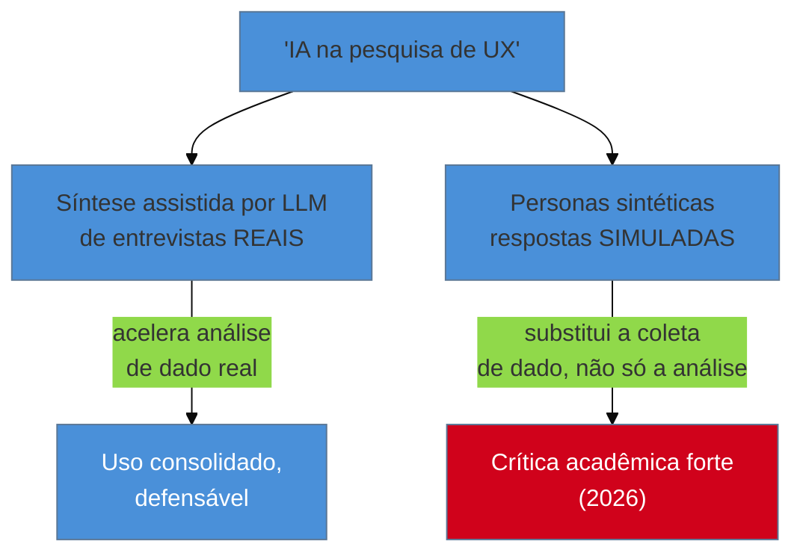

# Personas sintéticas e síntese por IA

> [!abstract] TL;DR
> Duas coisas diferentes andam sob o mesmo rótulo de "IA na pesquisa de UX", e confundi-las é o primeiro erro: **síntese de entrevista assistida por LLM** — extrair temas e citações de transcrições reais — é uso consolidado e defensável, porque ataca um gargalo real (transcrever e codificar entrevista leva horas) sem substituir a entrevista em si. **Personas sintéticas** — ferramentas que geram respostas *simuladas* de usuário via LLM, sem entrevistar ninguém real — carregam uma crítica acadêmica forte: mesmo pedindo diversidade explícita, os modelos colapsam num cluster estreito de respostas estereotipadas, sub-representando minorias e casos extremos. Esta nota é cética por construção: o ponto não é o hype, é onde a ferramenta ajuda de verdade (ideação, pré-triagem) e onde ela é perigosa (decisão fina, substituto de dado primário).

Imagine que você está sob pressão de prazo e alguém te mostra uma ferramenta que promete gerar "personas sintéticas com IA": você descreve o público-alvo em algumas frases, e a ferramenta devolve, em minutos, cinco personas completas — nome, objetivo, frustração, citação verossímil, tudo pronto para colar numa apresentação. Comparado com o custo de recrutar e entrevistar 5 pessoas reais (nota 07), a tentação é óbvia: por que não usar isso em vez de pesquisa de verdade, principalmente quando o orçamento e o prazo de um projeto fractional já estão apertados? A resposta desta nota não é "nunca use IA em pesquisa" — é que a ferramenta que parece substituir a entrevista de descoberta não faz o que ela promete fazer, e o risco de tratá-la como substituto é sistêmico, não só um detalhe técnico a ajustar.

## Duas coisas diferentes, um só rótulo

**Síntese assistida por LLM** entra depois que a entrevista de descoberta (nota 07) ou a switch interview (nota 09) já aconteceu, com gente real. O LLM processa a transcrição e ajuda a extrair temas recorrentes e citações relevantes — o mesmo trabalho que, feito manualmente, consome horas por entrevista. É análise de dado que já existe, não geração de dado novo. Esse uso é o mais consolidado e defensável do momento: acelera um gargalo real sem mudar a natureza do que está sendo analisado.

**Personas sintéticas** entram *antes* de qualquer entrevista real — a ferramenta gera as respostas em vez de coletá-las de alguém. É aqui que a fronteira se rompe: não é mais análise de dado real, é substituição da coleta em si.

> [!info] Sobre como o modelo por trás disso funciona
> Esta nota não reexplica como um LLM gera texto, por que ele "colapsa" para respostas prováveis, ou o que é um transformer — esse território pertence a [[03-Dominios/Tecnologia/IA/index|Tecnologia/IA]], o domínio de IA do vault. Aqui o interesse é só o efeito: o que acontece quando você usa esse tipo de ferramenta *como se fosse* pesquisa de usuário.

## A crítica acadêmica: "the synthetic persona fallacy"

Um estudo de 2026 — Paglieri et al., citado via ACM Interactions — investigou o que acontece quando se pede a um LLM para gerar respostas simuladas de usuários diversos. Mesmo com instrução explícita para produzir diversidade nas respostas, os modelos **colapsam num cluster estreito de respostas estereotipadas**, sub-representando comportamentos de minoria e casos extremos. A ACM Interactions nomeou esse padrão de **"the synthetic persona fallacy"** — a falácia da persona sintética.

O mecanismo do problema, em uma frase: um LLM gera a resposta *estatisticamente mais provável* dado o padrão de texto que já viu — e "mais provável" tende para o centro da distribuição, para o estereótipo mais comum sobre um grupo, não para a variação real que existe dentro dele. Uma pessoa real com uma opinião fora do comum é, por definição, incomum — e é exatamente esse tipo de resposta que o modelo tem menos probabilidade de produzir quando simula "um usuário típico do grupo X".

A correspondência entre resposta sintética e tendência humana real é fraca especificamente na **variância atitudinal mais profunda** — mesmo quando a direção geral da resposta simulada bate com o que pessoas reais tendem a achar, a nuance e os casos extremos (que são frequentemente onde os problemas de usabilidade mais sérios se escondem) desaparecem. Isso torna a ferramenta útil para sinal grosseiro — "provavelmente essa direção está certa" — e perigosa para decisão fina, onde o detalhe é exatamente o que importa.

> [!warning] Confundir "resposta plausível" com "resposta representativa"
> **O que acontece:** uma persona sintética produz uma citação que soa exatamente como algo que um usuário real diria — e essa plausibilidade estilística é confundida com validade de dado.
> **Por quê:** LLMs são otimizados para gerar texto fluente e verossímil, não para representar a distribuição real de opiniões de um grupo humano — as duas coisas parecem a mesma coisa de fora, mas não são.
> **Como evitar:** trate qualquer resposta de persona sintética como hipótese de brainstorming, nunca como evidência — a mesma disciplina que a [[03-Dominios/Engenharia/UX/Descoberta e Pesquisa/12 - Proto-persona vs persona de verdade|nota 12]] já pede para proto-personas humanas, aplicada com ainda mais rigor aqui, porque o risco de confundir "soa real" com "é real" é maior.

## Onde a ferramenta ajuda de verdade: ideação e pré-triagem

A recomendação desta nota não é evitar completamente ferramentas de IA nessa área — é restringir o uso a onde o risco de errar é baixo e reversível: **gerar hipóteses para testar depois com gente real**, nunca como substituto de dado primário.

- **Ideação de roteiro de entrevista** — pedir a um LLM para sugerir perguntas ou ângulos que você não tinha considerado antes de uma entrevista de descoberta real, revisando cada sugestão contra as regras do Mom Test (nota 07) antes de usar.
- **Pré-triagem de hipóteses** — usar uma persona sintética para gerar uma lista ampla de possíveis dores ou objeções, que depois você testa (ou descarta) numa entrevista real ou num assumption mapping (nota 11) — nunca aceitando a hipótese sintética como confirmada.
- **Rascunho inicial de proto-persona** — igual à proto-persona humana da nota 12, uma persona sintética pode servir de ponto de partida para alinhamento de time, desde que etiquetada com o mesmo rigor: "hipótese gerada, não testada" — e, dado o risco adicional do colapso estereotipado, com ainda mais urgência em testá-la logo.

O risco central, mais organizacional do que técnico: **o time se acostuma com o sintético e para de investir em pesquisa real**. Uma vez que gerar "personas" fica barato e instantâneo, a pressão de prazo empurra para nunca mais agendar a entrevista de verdade — e o produto passa a ser decidido com base em respostas estatisticamente prováveis, não em usuários reais.

**O mecanismo em uma frase:** síntese assistida por IA acelera a leitura de dado real que já existe; persona sintética gera dado que parece real mas não é — e a diferença entre as duas não aparece no formato do resultado, só no que está por trás dele.

## Analytics assistido por IA: mesmo limite de sempre

Vale mencionar rapidamente um terceiro uso, adjacente: detecção automática de padrões e anomalias em dado de analytics via IA. Acelera a leitura de volume grande de dado — mas herda a limitação estrutural de qualquer analytics: mostra **o quê** está acontecendo (queda de conversão, pico de erro), não **por quê**. A resposta ao "por quê" continua exigindo pesquisa generativa real (nota 06) — o analytics assistido por IA não fecha esse gargalo, só torna mais rápido perceber que ele existe.

## O que dá pra fazer sozinho, e o que não dá — e o que não deveria fazer de jeito nenhum

| Praticável e defensável sozinho | Exige cautela extra, mesmo sozinho | Nunca substitui pesquisa real |
|---|---|---|
| Síntese assistida por LLM de transcrições de entrevistas reais já feitas | Persona sintética como rascunho de brainstorming, sempre testada depois | Persona sintética apresentada como "usuário validado" ao cliente |
| Analytics assistido por IA para detectar padrão, seguido de investigação humana do "por quê" | Ideação de roteiro de entrevista com apoio de LLM, revisado contra o Mom Test | Decisão de arquitetura de informação baseada só em resposta simulada |

A pergunta de segunda-feira: se uma ferramenta de IA te deu uma resposta sobre o que um usuário "pensaria", pergunte "isso é hipótese para eu testar, ou estou prestes a tratar como se já fosse dado?" — e se for a segunda opção, pare e agende a entrevista real antes de decidir qualquer coisa em cima dela.

## Casos práticos

### Cenário 1: a persona sintética que quase virou decisão de arquitetura
Sob pressão de prazo, um fractional engineer gera cinco personas sintéticas para o público de um app financeiro e está prestes a usar as "frustrações" geradas para priorizar o roadmap. Antes de decidir, ele testa duas das frustrações sintéticas contra 3 entrevistas reais rápidas — e descobre que uma delas (ansiedade com segurança de dados) é real e forte, mas a outra (preferência por interface "gamificada") não aparece em nenhuma das três conversas reais; parece ter sido gerada porque é um tema comum em conteúdo de marketing sobre apps financeiros, não porque reflete o público real desse produto específico. A persona sintética serviu como ponto de partida útil para uma hipótese — e como armadilha evitada só porque foi testada antes de virar decisão.

### Cenário 2: síntese assistida que economizou um dia de trabalho
Uma consultora grava (com consentimento) 6 entrevistas de descoberta reais ao longo de uma semana. Em vez de transcrever e codificar manualmente — trabalho que historicamente consumia um dia inteiro — ela usa uma ferramenta de síntese assistida por LLM para extrair temas recorrentes e citações relevantes das transcrições. O resultado bruto ainda exige revisão humana (a ferramenta agrupa dois temas distintos como se fossem um só, por exemplo), mas o ponto de partida economiza a maior parte do trabalho mecânico, deixando tempo para o que exige julgamento humano: decidir o que os temas significam para o produto.

## Armadilhas comuns

> [!warning] Tratar persona sintética como substituto de entrevista real
> **O que acontece:** sob pressão de prazo ou orçamento, uma persona gerada por IA substitui completamente a entrevista de descoberta que deveria ter acontecido.
> **Por quê:** é rápido, barato e produz um artefato visualmente idêntico ao de pesquisa real — a diferença de proveniência não aparece no documento final.
> **Como evitar:** aplique o mesmo teste da [[03-Dominios/Engenharia/UX/Descoberta e Pesquisa/12 - Proto-persona vs persona de verdade|nota 12]]: "de onde vem cada frase — de uma entrevista real, ou de um modelo generativo?". Se a resposta é "modelo", trate como hipótese não testada, com o mesmo rigor de etiqueta.

> [!warning] Citar percentual de adoção de IA em pesquisa como se fosse dado científico
> **O que acontece:** números como "X% dos pesquisadores já usam respostas sintéticas" ou "Y% citam análise assistida por IA como tendência" circulam em conversas e apresentações como se fossem estudo validado.
> **Por quê:** esses percentuais, quando existem, costumam vir de blogs de fornecedores de ferramentas de pesquisa (material promocional de categoria), não de estudo primário acessível e revisado.
> **Como evitar:** se citar esse tipo de número, marque explicitamente como **sinal de mercado de fonte promocional**, nunca como dado replicável — ou, preferencialmente, cite só a direção da tendência ("o uso de IA em síntese de pesquisa está crescendo") sem o número específico.

> [!warning] Deixar o sintético substituir o investimento em pesquisa real, aos poucos
> **O que acontece:** nenhuma decisão isolada troca pesquisa real por sintética de forma consciente — mas, projeto após projeto, o hábito de "gerar rápido com IA" corrói o tempo e o orçamento reservado para entrevista real, até que ela deixe de acontecer.
> **Por quê:** o custo de cada substituição pontual parece pequeno; o efeito acumulado — um time que nunca mais fala com usuário real — só fica visível depois de meses.
> **Como evitar:** trate qualquer uso de ferramenta sintética como complemento explicitamente temporário a uma entrevista real já agendada ou planejada — nunca como adiamento indefinido dela.

## Como explicar em inglês

> "Two different things hide under 'AI in UX research.' **LLM-assisted synthesis** of real interview transcripts is a defensible, established use — it speeds up analysis of real data. **Synthetic personas** — simulated user responses generated by an LLM instead of collected from real people — carry a strong 2026 academic critique: even when explicitly prompted for diversity, models collapse into a narrow, stereotyped cluster of responses, under-representing minority views and edge cases. Use synthetic tools for ideation and pre-screening hypotheses to test later — never as a substitute for primary research."

| PT | EN |
|----|----|
| persona sintética | synthetic persona |
| síntese assistida por IA | AI-assisted synthesis |
| dado primário | primary data |
| a falácia da persona sintética | the synthetic persona fallacy |
| sinal de mercado | market signal |
| colapso em cluster estereotipado | collapse into a stereotyped cluster |

## O que vem a seguir

Esta é a última nota do sub-galho de Descoberta e Pesquisa. As nove notas juntas entregam o vocabulário completo para descobrir o problema certo antes de desenhar qualquer solução — da distinção generativa/avaliativa (nota 06) até a cautela com IA que fecha o ciclo aqui. O próximo sub-galho do domínio parte do problema já descoberto para a decisão de como organizar a informação da solução.

- [[03-Dominios/Engenharia/UX/Arquitetura de Informação/index|SG3 — Arquitetura de Informação]] — como organizar o que existe e como se navega entre as partes, uma vez que o problema certo já foi validado por pesquisa real.
- [[03-Dominios/Engenharia/UX/Descoberta e Pesquisa/06 - Generativa vs avaliativa|06 — Generativa vs avaliativa]] — vale revisitar: o risco desta nota é, no fundo, o mesmo de pular a fase generativa — só que agora disfarçado de ferramenta moderna.

## Fontes

- **Paglieri et al. (2026)**, citado via [ACM Interactions](https://interactions.acm.org/) — a crítica acadêmica ao colapso de diversidade em respostas geradas por LLM ("the synthetic persona fallacy"); nota: o paper original não foi lido na íntegra, a afirmação vem de resumos e fontes que o citam.
- **Blogs de fornecedores de ferramentas de pesquisa** (Delve.ai, Perspective AI, CleverX, Conveo) — fonte dos percentuais de adoção de IA em pesquisa mencionados na área; material promocional, sem estudo primário acessível — citados aqui só como o que são: sinal de mercado, não dado científico.
