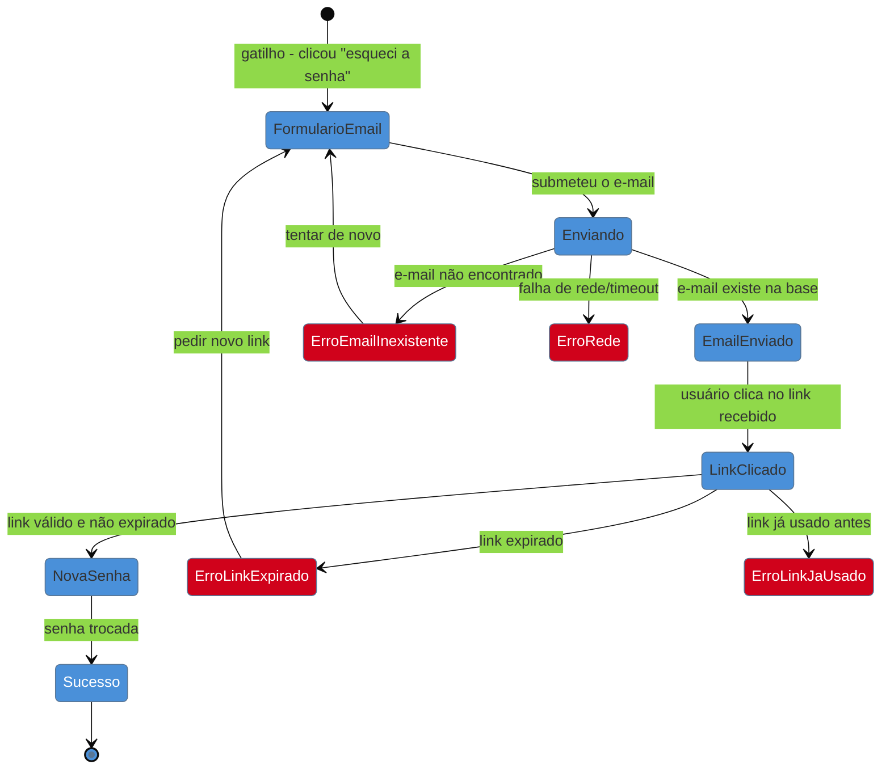

# Do fluxo antes da tela: user flow como máquina de estados

> [!abstract] TL;DR
> Um **user flow** mapeia o caminho que uma pessoa percorre para completar uma tarefa num produto: começa num **gatilho** (por que ela está aqui), passa por decisões e ramificações, e termina num **estado de sucesso** ou num **ponto de saída/erro**. Não tem autor canônico único — é prática consolidada em interaction design, presente em Alan Cooper (*About Face*) e difundida em design de produto. A ponte que importa para quem já programa: desenhar o fluxo antes do wireframe é o **mesmo exercício** de desenhar o diagrama de estados antes de codificar uma state machine — e uma tela órfã ou um estado esquecido é literalmente o mesmo bug de modelagem que um branch faltando. Praticável sozinho com papel, Excalidraw, ou um bloco Mermaid no próprio repositório.

Imagine que você recebe o pedido "adiciona um fluxo de recuperação de senha" e parte direto pro Figma ou pro código: uma tela de "esqueci minha senha", um campo de e-mail, um botão "enviar". Funciona no caminho feliz — a demonstração impressiona. Duas semanas depois em produção aparecem os chamados de suporte: o que acontece se o e-mail digitado não existe na base? Se o link do e-mail expirou? Se o usuário já trocou a senha e clica no link antigo de novo? Se ele fecha a aba no meio do processo e volta depois? Nenhuma dessas perguntas tinha resposta desenhada — porque nunca foram desenhadas, só a tela feliz foi. Esse é o sintoma de pular a etapa que esta nota defende: **desenhar o fluxo antes da tela**.

## O que é um user flow, e por que não tem autor único

Um user flow é um diagrama que representa, passo a passo, o caminho que um usuário percorre desde um **gatilho** — o evento ou necessidade que faz a pessoa começar a tarefa — até um **estado de sucesso**, passando por decisões, ramificações e, criticamente, **pontos de saída e de erro**. Diferente de um wireframe, que mostra a aparência de uma tela específica, o user flow mostra a *topologia* da tarefa: quais telas existem, o que conecta uma à outra, e sob que condição a pessoa segue por um caminho e não por outro.

Não há um único nome associado à origem do user flow como técnica — é prática consolidada dentro de interaction design, presente de forma explícita em Alan Cooper, no livro ***About Face: The Essentials of Interaction Design***, e difundida amplamente em design de produto desde então. Vale resistir à tentação de atribuir a técnica a uma pessoa específica: é mais próxima de um vocabulário comum do ofício do que de uma invenção datada, como as heurísticas de Nielsen (ver [[03-Dominios/Engenharia/UX/Fundamentos e Modelo Mental/03 - As 10 heurísticas de Nielsen|nota 03]]).

## A ponte que importa: fluxo é máquina de estados

Para quem já pensa em software como estados e transições, a analogia é direta e literal, não decorativa. Uma **máquina de estados** define um conjunto de estados possíveis, os eventos que disparam transição entre eles, e o que acontece em cada transição — inclusive as transições que levam a um estado de erro. Um **user flow** faz exatamente isso, só que a unidade não é um objeto de domínio, é uma pessoa navegando um produto: cada tela (ou modal, ou etapa) é um estado; cada ação do usuário (clicar, digitar, esperar uma resposta de rede) é um evento que dispara uma transição; e — este é o ponto que mais se perde — **cada transição precisa de um destino definido para todo evento possível, incluindo os que dão errado**.

Note que o diagrama acima tem **quatro estados de erro** e só **um** caminho feliz completo. Isso não é exagero didático — é o tamanho real do problema de recuperação de senha quando desenhado por completo. Quem parte direto pro código, sem esse mapa, tipicamente implementa o caminho feliz e um `catch` genérico — o equivalente a colapsar quatro branches de uma state machine num `else` só, perdendo a informação de *qual* erro aconteceu e, portanto, a chance de dar uma mensagem específica ao usuário (ver heurística 9 de Nielsen, recuperação de erros, na [[03-Dominios/Engenharia/UX/Fundamentos e Modelo Mental/03 - As 10 heurísticas de Nielsen|nota 03]]).

**O mecanismo em uma frase:** telas órfãs e estados esquecidos num produto são o mesmo bug de modelagem que um branch faltando numa máquina de estados — só que o custo de descobrir o bug em produção é pago pelo usuário, não por um teste automatizado.

> [!question]- Se eu já sei programar máquinas de estado, por que preciso desenhar o fluxo separado do código?
> Porque o fluxo precisa ser validado *antes* de virar código, com quem entende o negócio — um product owner, um cliente, ou você mesmo revisando a tarefa a frio. Um diagrama de estados em Mermaid ou Excalidraw é barato de revisar e mudar; o mesmo fluxo já implementado em componentes React com roteamento é caro de reestruturar. O fluxo é o rascunho de baixo custo antes do commit de alto custo.

## O que dá pra fazer sozinho, e o que não dá

| Praticável sozinho | Exige time/orçamento |
|---|---|
| Desenhar o fluxo de uma feature nova em papel, Excalidraw ou um bloco Mermaid no README antes de abrir o editor | Sessão de fluxo colaborativa com PM, design e stakeholders de negócio validando cada ramificação |
| Listar sistematicamente "o que acontece se isso falhar?" para cada passo do fluxo feliz | Teste de usabilidade observando pessoas reais navegando o fluxo desenhado |
| Versionar o fluxo como Mermaid no próprio repositório, ao lado do código que o implementa | Ferramenta dedicada de fluxo (FigJam, Whimsical) com biblioteca de componentes compartilhada pelo time |

## Casos práticos

### Cenário 1: o checkout que esquece o carrinho vazio no meio do caminho
Um fractional engineer implementa um checkout de e-commerce a partir de um wireframe de três telas: carrinho, endereço, pagamento. O wireframe não previa o caso em que o último item do carrinho é removido por outra aba do mesmo usuário enquanto ele preenche o endereço — um estado real, gerado por concorrência entre abas, que não tinha lugar nenhum no fluxo desenhado. Ao desenhar o user flow como máquina de estados antes de escrever o código da tela de pagamento, esse ramo aparece naturalmente como uma pergunta: "o que acontece se o carrinho ficar vazio depois do passo 1?" — porque toda transição do diagrama exige um destino, inclusive essa.

### Cenário 2: o fluxo de convite que nunca tinha "convite expirado"
Uma feature de "convidar colega para o workspace" foi implementada com só duas telas: "enviar convite" e "aceitar convite". Em produção, usuários reportavam clicar num link de convite de duas semanas atrás e ver uma tela em branco — o componente quebrava silenciosamente porque o convite já tinha expirado e a resposta da API vinha em formato inesperado, não tratado. Redesenhando o fluxo como diagrama de estados, "convite expirado" vira um estado de primeira classe com sua própria tela e mensagem, em vez de um caso não modelado que produz um bug visual.

## Armadilhas comuns

> [!warning] Desenhar só o caminho feliz e chamar de "o fluxo"
> **O que acontece:** o diagrama tem uma sequência linear de telas, sem nenhuma ramificação de erro ou saída antecipada.
> **Por quê:** o caminho feliz é o mais fácil de imaginar e o que a demonstração para o cliente precisa mostrar — os caminhos de erro exigem esforço extra de imaginação que fica fácil de adiar.
> **Como evitar:** para cada seta do diagrama, pergunte "e se isso falhar, ou a pessoa desistir aqui?" antes de considerar o fluxo pronto — o mesmo hábito de cobrir os 5 estados de tela da [[03-Dominios/Engenharia/UX/Design de Interação/20 - Os 5 estados de tela|nota 20]].

> [!warning] Confundir user flow com wireframe
> **O que acontece:** o time desenha uma sequência de telas já com pixels, cores e componentes definidos, achando que isso é o fluxo.
> **Por quê:** é tentador pular direto pro visual porque parece mais "produto acabado" — mas misturar as duas etapas trava a discussão de *topologia* (quantos estados existem, o que conecta a quê) numa discussão prematura de *aparência* (a cor do botão).
> **Como evitar:** desenhe o fluxo com caixas e setas nomeadas, sem nenhum elemento visual de UI — só depois de o fluxo estar validado é hora de decidir a aparência de cada tela.

> [!warning] Não versionar o fluxo, deixando-o só na cabeça de quem desenhou
> **O que acontece:** o fluxo existe só como memória de quem participou da reunião de design, e se perde quando a feature é revisitada meses depois para adicionar um caso novo.
> **Por quê:** sem artefato persistido, o fluxo não pode ser revisado em PR nem consultado por quem entra no projeto depois — o mesmo problema de um design de sistema que só existe na cabeça de quem o desenhou, nunca em ADR.
> **Como evitar:** versione o fluxo como Mermaid dentro do próprio repositório (num `docs/` ou junto do README da feature) — barato de manter, revisável em code review, e sobrevive à saída de quem desenhou.

## Como explicar em inglês

> "A **user flow** maps the path a person takes to complete a task in a product: it starts at a **trigger**, moves through decisions and branches, and ends at a **success state** — or at an **error or exit point**. The bridge that matters for engineers: drawing the flow before the wireframe is the same discipline as drawing a state diagram before coding a state machine. An orphaned screen or a forgotten state is the same modeling bug as a missing branch — the difference is that in software the bug surfaces in a test; in a product, it surfaces as a support ticket."

| PT | EN |
|----|----|
| fluxo do usuário | user flow |
| gatilho | trigger |
| estado de sucesso | success state |
| ponto de saída | exit point |
| máquina de estados | state machine |
| ramificação | branch |
| caminho feliz | happy path |

## O que vem a seguir

O fluxo dá a topologia — quais telas existem e como se conectam. A próxima nota entra dentro de cada tela individual e pergunta: mesmo sem mudar de tela, quantos *estados visuais* essa tela precisa suportar? A resposta — pelo menos cinco — é o complemento direto do que esta nota já ensinou sobre não deixar branch sem destino.

- [[03-Dominios/Engenharia/UX/Design de Interação/20 - Os 5 estados de tela|20 — Os 5 estados de tela]] — o espaço de estados *dentro* de uma única tela do fluxo.
- [[03-Dominios/Engenharia/UX/Design de Interação/22 - Modal vs página vs drawer|22 — Modal vs página vs drawer]] — depois de mapear o fluxo, cada "estado" dele precisa virar um artefato de UI concreto; esta nota ajuda a escolher qual.

## Fontes

- **Alan Cooper** — *About Face: The Essentials of Interaction Design* — origem consolidada do vocabulário de user flow em interaction design; sem atribuição de autoria única do conceito, prática difundida no ofício.
- **Nielsen Norman Group** — [*User Journeys vs. User Flows (And When to Use Each)*](https://www.nngroup.com/articles/user-journeys-vs-user-flows/) — distingue escopo de fluxo (uma tarefa, dentro de um produto) do escopo de jornada (multicanal, ao longo do tempo).

> [!tip] Assista: User Journeys vs. User Flows (And When to Use Each)
> **Canal:** Nielsen Norman Group (NN/g) | **Duração:** ~3min | **Idioma:** EN
>
> O vídeo cobre a distinção entre fluxo e jornada, não a analogia de máquina de estados desta nota — essa ponte é elaboração própria para o público de engenharia. Ainda assim, é a base necessária: entender que o fluxo é o recorte *granular, dentro de um produto* é o que justifica desenhá-lo com o rigor de uma state machine, em vez de misturá-lo com a jornada mais ampla e emocional do usuário.
>
> 🎬 [Assistir no YouTube](https://www.youtube.com/watch?v=dsviXwJwslI)
