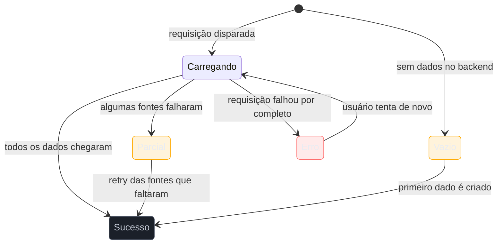

# Os 5 estados de tela

> [!abstract] TL;DR
> Toda tela que depende de dados assíncronos tem, no mínimo, **cinco estados** que precisam ser desenhados — não só o caminho feliz: **vazio** (zero data, primeiro uso), **carregando**, **erro**, **parcial** (parte dos dados chegou, parte falhou) e **sucesso**. Sem autor canônico único — prática difundida via design systems modernos (Material Design) e artigos da Nielsen Norman Group. A regra prática de engenharia: se o componente só tem `if (loading) {...} else {...}`, ele está sub-modelando o espaço de estados — o mesmo erro de esquecer um branch numa máquina de estados (ver [[03-Dominios/Engenharia/UX/Design de Interação/19 - Do fluxo antes da tela - user flow como máquina de estados|nota 19]]). Esta nota cobre o *espaço* de estados de uma tela; o *conteúdo* dentro do estado vazio — o texto, o tom, a chamada para ação — é assunto da nota 36, mais adiante no domínio.

Imagine revisar o componente de uma listagem — pedidos, tickets, o que for — e encontrar este código: `{loading ? <Spinner /> : <Lista items={data} />}`. Funciona perfeitamente na demonstração, porque a demonstração sempre tem dados e sempre carrega rápido. Em produção, esse componente já falhou de quatro formas diferentes antes do fim da primeira semana: um usuário novo, sem nenhum item ainda, viu uma lista vazia sem explicação nenhuma — parecia quebrado. Um usuário com conexão lenta viu o spinner girar por 8 segundos sem indicação de progresso. Um usuário cuja requisição falhou por erro de permissão viu... nada, porque `data` ficou `undefined` e o componente simplesmente não renderizou a lista. E um usuário cujo dashboard tinha três widgets, dos quais um falhou, viu os outros dois travados esperando o terceiro. Nenhum desses quatro casos é exótico — são o comportamento *normal* de qualquer tela que busca dado de rede. O `if/else` de dois ramos nunca teve chance de cobri-los, porque uma tela de dados assíncronos não tem dois estados, tem cinco.

## Os cinco estados, um a um

Prática consolidada em design systems modernos — Material Design a nomeia explicitamente em sua documentação de padrões, e a Nielsen Norman Group publica guias específicos para o estado vazio — sem atribuição a um autor ou data de origem única; é vocabulário que se sedimentou coletivamente à medida que interfaces passaram a depender de dados carregados de forma assíncrona.

1. **Vazio** — zero dados, seja porque é o primeiro uso do usuário, seja porque ele de fato não tem nada ainda (nenhum pedido feito, nenhum item favoritado). É o estado que mais decide se o usuário *entende o produto* — uma lista vazia sem explicação parece produto quebrado; uma lista vazia com contexto ("Você ainda não tem pedidos — faça o primeiro aqui") ensina o produto no momento exato em que o usuário está mais receptivo a aprender.
2. **Carregando** — os dados foram pedidos, ainda não chegaram. A escolha de *como* comunicar isso (skeleton, spinner, nada) é discutida a fundo na [[03-Dominios/Engenharia/UX/Design de Interação/25 - Latência percebida e feedback|nota 25]] — aqui importa só que este estado *existe* e precisa de tela própria.
3. **Erro** — a requisição falhou. E "falhou" não é um estado único: erro de rede, erro de permissão e erro de servidor são três causas diferentes que merecem mensagem e ação diferentes (ver heurística 9 de Nielsen na [[03-Dominios/Engenharia/UX/Fundamentos e Modelo Mental/03 - As 10 heurísticas de Nielsen|nota 03]]) — "tentar de novo" resolve erro de rede, não resolve falta de permissão.
4. **Parcial** — alguns dados chegaram, outros falharam. É o mais esquecido dos cinco, e o mais comum em dashboards com múltiplas fontes: três widgets buscando dado de três serviços diferentes, um deles fora do ar. A tela precisa mostrar os dois que funcionaram e sinalizar claramente que o terceiro falhou — não travar tudo esperando o widget quebrado, nem esconder que ele falhou.
5. **Sucesso/preenchido** — o caminho feliz, com dados completos. É o único dos cinco que a maioria dos times desenha de verdade.

**O mecanismo em uma frase:** um componente que só sabe alternar entre "carregando" e "com dados" está sub-modelando o espaço de estados exatamente como uma máquina de estados que esquece um branch — a diferença é que, numa tela, o "branch esquecido" aparece como um bug visual em produção, não como um teste que falha em CI.

> [!question]- Vale a pena desenhar os cinco estados até para uma tela interna, de baixo tráfego, que "provavelmente" nunca vai dar erro?
> Depende do custo do erro silencioso, não do tráfego. Uma tela interna usada por 3 pessoas do time financeiro que falha silenciosamente pode custar uma decisão errada de negócio tomada sobre dado incompleto — mais caro que um bug visual numa tela pública de alto tráfego. A pergunta certa não é "quantas pessoas usam essa tela", é "o que acontece se essa tela mostrar dado errado ou incompleto sem avisar".

## Fronteira com a nota 36: espaço de estados vs. conteúdo do estado

Esta nota resolve *quantos* estados uma tela precisa e *quando* cada um aparece — o espaço de estados. Ela não entra no *conteúdo* que vai dentro do estado vazio: que texto usar, que tom adotar, se vale ilustração, como escrever a chamada para ação. Isso é conteúdo de UX writing, e vai ser tratado com profundidade na nota 36 do domínio, mais adiante (SG6 — UX Writing e Content Design). A divisão é deliberada: aqui você aprende que o estado vazio *precisa existir como caixa desenhada no fluxo*; lá você aprende a *escrever o texto que vai dentro dela*.

## O que dá pra fazer sozinho, e o que não dá

Praticável sozinho, sem depender de mais ninguém:

- **Para cada tela nova, listar os cinco estados antes de escrever o primeiro componente** — o custo é uma lista de cinco linhas antes de abrir o editor, e o retorno é não descobrir o estado "parcial" só quando um cliente reclamar de dashboard travado.
- **Implementar os cinco estados como branches explícitos** — um `switch` ou union type nomeado, não um `if/else` de dois ramos — porque um tipo explícito obriga o compilador (ou o linter, ou a revisão de código) a lembrar que os cinco casos existem, em vez de depender da memória de quem escreveu o componente.
- **Escrever manualmente o caso de teste "o que a tela mostra se a API retornar 500"** antes de considerar a feature pronta — não exige framework de teste sofisticado, só a disciplina de simular a resposta de erro uma vez e olhar o que aparece na tela.

Exige estrutura de time quando o objetivo passa de "a tela não quebra" para "a tela é a melhor possível para cada estado": uma **pesquisa de usuário validando qual mensagem de estado vazio converte melhor por segmento** depende de tráfego e de instrumentação de analytics que uma pessoa sozinha não tem como rodar de um dia para o outro — sem volume de usuários reais testando variações, a escolha de texto vira palpite, por melhor que seja o palpite. Um **design system compartilhado com componentes de skeleton, empty state e erro já prontos** só compensa o investimento de construção quando várias telas de vários times vão reaproveitar os mesmos componentes — para uma tela isolada, construir os cinco estados à mão é mais barato do que montar um sistema reutilizável para uso único. E um **monitoramento de produção que alerta quando o estado "parcial" acontece com frequência anormal** exige infraestrutura de observabilidade (métricas, alertas, dashboards de operação) que é investimento de plataforma, não de uma tela — sem isso, o estado parcial pode estar acontecendo silenciosamente sem que ninguém do time saiba.

## Casos práticos

### Cenário 1: o dashboard financeiro que trava no widget quebrado
Um dashboard interno mostra três widgets: receita, despesas e projeção. O componente pai só sabia dois estados — "carregando tudo" ou "tudo pronto" — então, quando o serviço de projeção ficava fora do ar, a tela inteira ficava presa em "carregando", escondendo receita e despesas que já tinham chegado havia segundos. Redesenhado com o estado **parcial** como caso de primeira classe, o dashboard passa a mostrar receita e despesas imediatamente, com um aviso pontual só no card de projeção — "não foi possível carregar agora, tentar de novo" — sem penalizar os dois terços da tela que funcionavam.

### Cenário 2: a lista de tickets que parecia quebrada no primeiro dia
Um novo cliente entra no produto e vê a tela "Meus Tickets" completamente vazia, sem nenhum texto — porque o desenvolvedor nunca desenhou o estado vazio, só o `if (tickets.length > 0)`. O cliente presume que o produto está com bug e abre um ticket de suporte perguntando "a lista de tickets não funciona" — ironia à parte, o produto perdeu a chance de ensinar, no exato momento em que o usuário mais precisava, como criar o primeiro ticket. Adicionar o estado vazio como tela própria, com uma frase de contexto e um botão "criar meu primeiro ticket", resolve o problema sem nenhuma mudança de backend.

### Cenário 3: "sem conexão" disfarçado de "vazio de primeiro uso"
Um app mobile de lista de tarefas, ao abrir sem conexão de internet, mostra exatamente a mesma tela de "vazio: você ainda não tem tarefas" que mostraria para um usuário genuinamente novo — porque o componente nunca distinguiu "zero itens de verdade" (empty legítimo) de "não consegui perguntar ao servidor se há itens" (erro de rede). Um usuário com dezenas de tarefas cadastradas, ao abrir o app no metrô sem sinal, vê a mensagem "comece criando sua primeira tarefa" e acha, por um instante de pânico, que perdeu todos os dados. O bug não é de conectividade, é de modelagem: um estado de "sem dados porque a rede falhou" foi colapsado dentro do estado de "vazio de primeiro uso", quando o diagrama desta nota já previa os dois como casos distintos.

## Armadilhas comuns

> [!warning] Modelar a tela como `if (loading) {...} else {...}`
> **O que acontece:** o componente só distingue "carregando" de "com dados", tratando erro, vazio e parcial como casos acidentais que o `else` genérico absorve mal. **Por quê:** o binário loading/pronto é o primeiro modelo mental que ocorre a quem escreve o componente rápido — os outros três estados só aparecem depois, em produção, como bug. **Como evitar:** modele o estado da tela como union type ou enum explícito com os cinco casos nomeados desde o início, mesmo que dois deles renderizem visualmente parecido no dia 1.

> [!warning] Tratar "parcial" como "ainda carregando"
> **O que acontece:** quando uma de várias fontes de dados falha, a tela inteira fica presa no spinner esperando a fonte quebrada, em vez de mostrar o que já chegou. **Por quê:** é mais simples de programar esperar "tudo ou nada" do que orquestrar exibição parcial com sinalização seletiva de erro — mas simples de programar não é o mesmo que correto para o usuário. **Como evitar:** trate cada fonte de dado independentemente, com seu próprio estado de carregando/erro/pronto, e componha a tela a partir do estado de cada uma — não de um estado global único.

> [!warning] Confundir "estado vazio de primeiro uso" com "estado de erro"
> **O que acontece:** a tela mostra a mesma mensagem genérica de "nada aqui" tanto para um usuário legítimo que ainda não tem dados quanto para um usuário cuja requisição falhou de verdade. **Por quê:** os dois casos parecem visualmente iguais (nada na tela), então é tentador tratá-los com o mesmo componente — mas as ações corretas são opostas: no vazio de primeiro uso, a ação é "criar o primeiro item"; no erro, é "tentar de novo". **Como evitar:** trate vazio e erro como dois estados distintos no seu enum, cada um com sua própria mensagem e chamada para ação, mesmo que o layout visual seja parecido.

## Como explicar em inglês

> "Every screen that depends on async data has, at minimum, **five states**: **empty** (zero data, first use), **loading**, **error**, **partial** (some data arrived, some failed), and **success**. If a component only branches on `if (loading) {...} else {...}`, it's under-modeling the state space — the same mistake as a state machine missing a branch. The **partial** state is the most commonly forgotten, and the most common in real dashboards pulling from multiple sources."

| PT | EN |
|----|----|
| estado vazio | empty state |
| estado de carregamento | loading state |
| estado de erro | error state |
| estado parcial | partial state |
| caminho feliz | happy path |
| espaço de estados | state space |

## O que vem a seguir

Cobrir os cinco estados de cada tela ainda deixa uma pergunta aberta: quando é que uma dessas telas deve aparecer como página própria, e quando deve aparecer como sobreposição (modal ou drawer) por cima da tela atual? A próxima nota resolve isso.

- [[03-Dominios/Engenharia/UX/Design de Interação/22 - Modal vs página vs drawer|22 — Modal vs página vs drawer]] — decidir o container certo para cada estado da tela.
- [[03-Dominios/Engenharia/UX/Design de Interação/25 - Latência percebida e feedback|25 — Latência percebida e feedback]] — aprofunda especificamente o estado "carregando", incluindo a disputa entre skeleton e spinner.

## Fontes

- **Material Design** — documentação de padrões de estado (loading, empty, error) nos componentes de listagem e conteúdo assíncrono; vocabulário difundido sem atribuição de autoria única.
- **Nielsen Norman Group** — [*Designing Empty States in Complex Applications: 3 Guidelines*](https://www.nngroup.com/articles/empty-state-interface-design/) — guia sobre o estado vazio especificamente.

> [!tip] Assista: Empty States in Application Design: 3 Guidelines
> **Canal:** Nielsen Norman Group (NN/g) | **Duração:** ~3min | **Idioma:** EN
>
> Cobertura parcial deliberada: o vídeo trata só do estado **vazio** (um dos cinco), com foco no seu papel de comunicar status do sistema, ensinar features não descobertas e apontar o próximo passo — não entra em carregando, erro ou parcial. É a base do argumento desta nota de que o estado vazio não é "tela quebrada, ainda sem conteúdo", é oportunidade de onboarding — mas os outros quatro estados desta nota vêm de outras fontes.
>
> 🎬 [Assistir no YouTube](https://www.youtube.com/watch?v=MUh3xyvEWDE)
