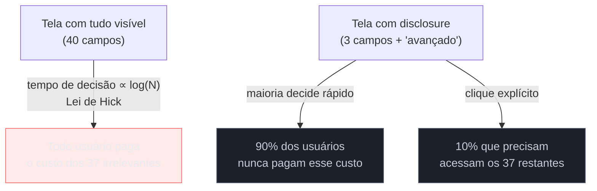

# Progressive disclosure

> [!abstract] TL;DR
> **Progressive disclosure** mostra só o essencial primeiro e revela complexidade sob demanda — via accordion, "opções avançadas", ou steps num fluxo maior. É termo de HCI associado a Jakob Nielsen desde os anos 1990, formalizado na literatura de interaction design. O racional direto é a **Lei de Hick** (ver [[03-Dominios/Engenharia/UX/Fundamentos e Modelo Mental/04 - Leis de UX - Fitts, Hick, Jakob, Miller, Peak-End|nota 04]]): mais opções visíveis significam mais tempo de decisão para todo mundo, mesmo para quem só precisa das três opções comuns. A armadilha documentada: se o "mostrar mais" revela uma tela vazia ou dá erro, o usuário aprende a **nunca mais** clicar em "mostrar mais" — a confiança no padrão de disclosure, uma vez quebrada, não se recupera fácil.

Imagine abrir um formulário de "criar novo servidor" numa ferramenta de infraestrutura e ver, de cara, 40 campos: nome, região, tipo de instância, grupo de segurança, tags, política de backup, criptografia em repouso, VPC customizada, IAM role, monitoramento avançado, e por aí vai. Para 90% dos casos, a pessoa só precisa preencher três desses campos — nome, região, tipo de instância — e aceitar o padrão de tudo o mais. Mas a tela não sabe disso: ela mostra os 40 de uma vez, competindo visualmente entre si, e a pessoa que só queria os três essenciais gasta tempo e atenção procurando quais são os três num mar de campos irrelevantes para o caso dela. **Progressive disclosure** é a resposta a exatamente esse problema: mostrar os três primeiro, com os outros 37 escondidos atrás de um "opções avançadas" — sem remover nenhuma capacidade, só adiando a exposição dela para quem realmente precisa.

## O mecanismo: por que esconder opções ajuda quem as usaria

Progressive disclosure é termo de HCI **associado a Jakob Nielsen desde os anos 1990**, formalizado dentro da literatura de interaction design e documentado extensamente pela Nielsen Norman Group. A técnica consiste em mostrar apenas as opções mais usadas e prováveis de serem relevantes para a maioria dos usuários, escondendo o resto atrás de uma ação explícita — um botão "mais opções", um accordion, uma segunda página, um menu.

O racional não é estético, é cognitivo, e vem direto da **Lei de Hick** (já coberta na [[03-Dominios/Engenharia/UX/Fundamentos e Modelo Mental/04 - Leis de UX - Fitts, Hick, Jakob, Miller, Peak-End|nota 04]]): o tempo de decisão cresce com o número de opções apresentadas simultaneamente, mesmo quando a opção certa já era conhecida de antemão. Isso significa que os 37 campos avançados do exemplo de abertura não são neutros para quem não precisa deles — eles ativamente atrasam a decisão de quem só queria preencher os três campos simples, porque o cérebro precisa varrer e descartar os 37 antes de confirmar que os três certos são os certos. Esconder o que a maioria não usa não é "escondê-lo dela" no sentido de negar acesso — é reduzir o espaço de busca de quem não precisa, sem impedir quem precisa de ir buscar.

**O mecanismo em uma frase:** progressive disclosure não remove capacidade, troca "todo mundo paga o custo cognitivo de todas as opções" por "só quem precisa de uma opção paga o custo de buscá-la" — um trade-off que só vale a pena porque a maioria das opções, na maioria dos casos, é usada por uma minoria de usuários.

## A armadilha documentada: disclosure quebrado destrói confiança de forma persistente

Existe um custo de engenharia embutido em toda decisão de progressive disclosure, e é aqui que o full-cycle enxerga algo que um wireframe estático não mostra: cada "mostrar mais" precisa **funcionar de verdade** quando clicado — e se ele leva a uma tela vazia, a um erro, ou a um estado que parece quebrado, o usuário não trata isso como um bug pontual daquela vez. Ele **aprende que "mostrar mais" nesse produto não vale a pena** e para de tentar — inclusive em telas futuras onde o disclosure funcionaria perfeitamente. É um dano de confiança que se generaliza e persiste, muito mais caro de reverter do que o bug original.

> [!question]- Isso significa que "opções avançadas" precisa estar sempre 100% funcional desde o dia 1?
> Não necessariamente — significa que, se uma seção avançada ainda não está pronta, ela não deveria aparecer atrás de um "mostrar mais" clicável. É melhor omitir a seção inteira do disclosure até que esteja pronta do que expô-la quebrada: um "mostrar mais" que não existe ainda não gera aprendizado negativo; um "mostrar mais" que decepciona, gera.

## O que dá pra fazer sozinho, e o que não dá

Praticável sozinho, sem depender de infraestrutura de medição:

- **Auditar um formulário existente e estimar quais campos são raramente preenchidos** — candidatos naturais a "opções avançadas" — usando só o julgamento de quem conhece o domínio, sem precisar de dado instrumentado para dar o primeiro passo.
- **Implementar um accordion ou toggle "mostrar mais" com CSS/JS simples**, sem framework especial — a técnica em si não exige nenhuma ferramenta sofisticada, só a disciplina de escondê-la atrás de uma ação explícita.
- **Garantir que toda seção atrás de "mostrar mais" funcione de ponta a ponta** antes de publicar o botão que a revela — checar isso manualmente uma vez, mesmo sem suíte de teste automatizado, já evita a armadilha documentada desta nota.

Exige estrutura de time quando a decisão precisa de confirmação além do julgamento pessoal: **instrumentação de analytics para medir de verdade a taxa de uso de cada campo** substitui a estimativa por dado real, mas depende de rastrear eventos em produção e de volume de usuários suficiente para o número significar alguma coisa — sem isso, "candidato a opção avançada" continua sendo palpite educado, não fato. Um **teste A/B comparando conversão com e sem disclosure** exige tráfego dividido em variantes e tempo de coleta suficiente para significância estatística, recurso que só times com escala real de usuários conseguem rodar. E uma **pesquisa qualitativa entrevistando os poucos usuários que de fato usam as opções avançadas** exige recrutamento e roteiro de entrevista — o único jeito confiável de saber se esconder aquelas opções não prejudicou justamente quem mais precisava delas, mas é investimento que uma pessoa sozinha, sem apoio de pesquisa, dificilmente consegue rodar a tempo de decidir sobre a feature em questão.

## Casos práticos

### Cenário 1: o "Substituir" do Microsoft Word
O diálogo de "Localizar e substituir" do Word mostra, por padrão, dois campos: localizar e substituir por. A maioria das tarefas termina ali. Um botão "Mais" revela opções adicionais — respeitar maiúsculas/minúsculas, palavra inteira, usar caracteres curinga — e, indo mais fundo ainda, um botão "Formatar" revela substituição por fonte ou estilo de parágrafo. Cada camada adicional é irrelevante para a maioria absoluta das buscas, mas está a um clique de distância para quem precisa — sem nunca aparecer para quem não precisa.

### Cenário 2: checkout em accordion por etapa
Um checkout de e-commerce, em vez de mostrar endereço, frete e pagamento simultaneamente numa única tela longa, colapsa cada etapa num accordion: só a etapa atual fica expandida, as outras aparecem resumidas e fechadas. Isso é progressive disclosure aplicado a um fluxo de múltiplos passos, não só a um formulário único — o usuário nunca vê os campos de pagamento enquanto ainda está decidindo o endereço, reduzindo a carga visual de cada tela para o subconjunto relevante *daquele momento* da tarefa.

### Cenário 3: a opção "avançada" que virou maioria, mas ninguém revisitou
Uma ferramenta de API management esconde "rate limit customizado" atrás de "opções avançadas" — decisão razoável no lançamento, quando poucos clientes precisavam ajustar isso. Meses depois, o perfil de cliente muda: a maioria dos times que chega agora já sabe, desde o primeiro dia, que vai precisar de rate limit customizado. A disclosure que fazia sentido na origem virou fricção sistemática para a maioria atual dos usuários, mas ninguém revisitou a decisão porque "sempre foi assim" e o botão continuava funcionando. A correção não é técnica, é de acompanhamento: medir com que frequência a seção avançada é aberta, e promovê-la de volta à camada visível quando a maioria passa a precisar dela — a mesma armadilha de decisão nunca revisitada que aparece na escolha de container da [[03-Dominios/Engenharia/UX/Design de Interação/22 - Modal vs página vs drawer|nota 22]].

## Armadilhas comuns

> [!warning] "Mostrar mais" que leva a uma seção vazia ou quebrada
> **O que acontece:** o usuário clica em "opções avançadas" e encontra um placeholder, um erro de carregamento, ou campos que não fazem nada quando preenchidos. **Por quê:** seções avançadas costumam ser as últimas a ganhar atenção de QA, porque a maioria dos usuários (e dos testadores manuais) nunca chega até elas — o bug fica invisível até alguém realmente precisar da funcionalidade escondida. **Como evitar:** trate o conteúdo atrás de qualquer disclosure com o mesmo rigor de teste do caminho principal; se não está pronto, omita o gatilho de disclosure inteiro em vez de publicá-lo quebrado.

> [!warning] Esconder campos obrigatórios atrás do disclosure
> **O que acontece:** um campo que é obrigatório para completar a tarefa fica escondido atrás de "mais opções", e o usuário só descobre isso ao tentar submeter e receber um erro de validação sem contexto. **Por quê:** quem decide o que vai atrás do disclosure às vezes prioriza "o que é raramente preenchido" sem checar separadamente "o que é obrigatório" — as duas coisas não são a mesma pergunta. **Como evitar:** nunca esconda um campo obrigatório atrás de disclosure opcional; se um campo é obrigatório, ele pertence à camada visível, ainda que seja usado por poucos casos de uso distintos.

> [!warning] Usar disclosure como desculpa para não simplificar de verdade
> **O que acontece:** um formulário com 40 campos vira um formulário com 5 visíveis e 35 escondidos, mas os 35 continuam sendo, na prática, tão necessários quanto antes — só adiados, não eliminados. **Por quê:** disclosure é mais fácil de implementar do que repensar se todos os 40 campos realmente precisam existir na feature — vira um jeito de esconder complexidade em vez de reduzi-la de verdade. **Como evitar:** antes de decidir o que vai atrás do "mostrar mais", pergunte se cada campo realmente precisa existir. Disclosure organiza a complexidade que sobrar depois desse corte — não substitui o corte.

## Como explicar em inglês

> "**Progressive disclosure** shows only the essential options first and reveals the rest on demand — via an accordion, an 'advanced options' toggle, or separate steps. It's a Nielsen-associated HCI technique from the 1990s, and its rationale is Hick's Law: decision time grows with the number of visible options, even for users who already know which one they want. The documented trap: if 'show more' ever reveals a broken or empty section, users learn — permanently — not to trust that pattern again in this product."

| PT | EN |
|----|----|
| divulgação progressiva | progressive disclosure |
| opções avançadas | advanced options |
| mostrar mais | show more |
| custo de interação | interaction cost |
| campo obrigatório | required field |

## O que vem a seguir

Progressive disclosure organiza a complexidade *dentro* de uma única tela. A próxima nota resolve uma decisão anterior a essa: quando a complexidade merece sair da tela atual completamente — virando um modal, um drawer, ou uma página nova.

- [[03-Dominios/Engenharia/UX/Design de Interação/22 - Modal vs página vs drawer|22 — Modal vs página vs drawer]] — a decisão de container que vem antes de decidir o que fica visível dentro dele.
- [[03-Dominios/Engenharia/UX/Design de Interação/24 - Design de formulários - defaults|24 — Design de formulários: defaults]] — aplica disclosure especificamente a formulários longos com dependência entre seções.

## Fontes

- **Jakob Nielsen / Nielsen Norman Group** — [*Progressive Disclosure*](https://www.nngroup.com/articles/progressive-disclosure/) — artigo canônico, técnica associada a Nielsen desde os anos 1990.
- **Nielsen Norman Group** — [*3 Strategies for Managing Visual Complexity in Applications and Websites*](https://www.nngroup.com/videos/managing-visual-complexity/) — progressive disclosure como uma de três estratégias de gestão de complexidade visual.

> [!tip] Assista: Progressive Disclosure
> **Canal:** Nielsen Norman Group (NN/g) | **Duração:** ~4min | **Idioma:** EN
>
> Cobertura direta do conceito, com exemplos concretos que a nota reaproveita (o diálogo "Substituir" do Word, formulários de pagamento com Apple Pay vs. cartão) e o ponto explícito de que disclosure tem **custo de interação** — cada camada extra exige uma ação a mais do usuário, o que só compensa quando a maioria realmente não precisa das opções escondidas.
>
> 🎬 [Assistir no YouTube](https://www.youtube.com/watch?v=qlKWPNgPjmw)
