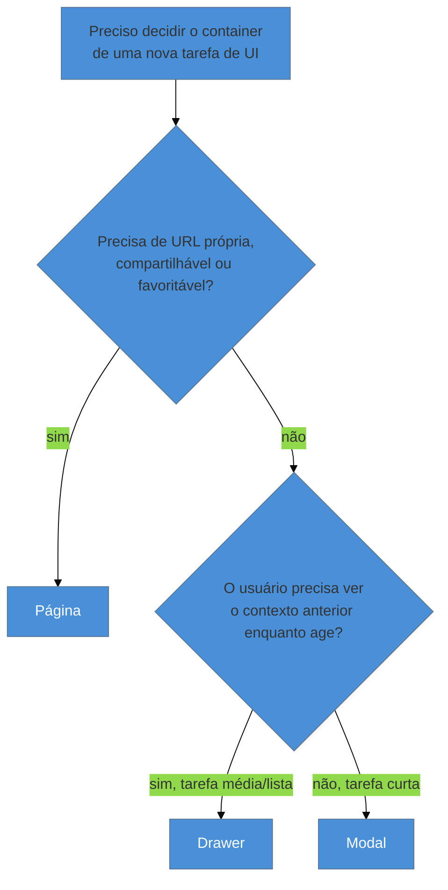

# Modal vs página vs drawer

> [!abstract] TL;DR
> Três containers, três custos diferentes de engenharia e de navegação: **modal** para tarefa curta e contextual, sem URL própria (confirmar, editar um campo); **página** para fluxo de múltiplos passos que o usuário pode querer voltar, compartilhar ou favoritar; **drawer** como meio-termo que mantém o contexto visível atrás, útil para detalhe de um item de lista. Anti-padrão fixo: **modal empilhado** (modal sobre modal) quebra o modelo mental de "onde estou" e o botão de voltar do navegador — nunca mais de um nível. O custo de engenharia que o designer puro não enxerga: modal exige gestão de foco, trap e restauração, e nada disso aparece na URL — o que dificulta deep-link e teste automatizado. Gestão de foco em si é tema de acessibilidade, coberto à parte.

Imagine decidir, num sprint qualquer, como implementar "editar o nome de um projeto". A opção mais rápida de codar é um modal: abre por cima da tela atual, dois campos, um botão salvar, fecha. Funciona bem — até que o produto cresce e alguém pede "editar projeto" com mais dez campos, seções, um upload de imagem e uma prévia ao vivo. O modal que era rápido de implementar para dois campos começa a rachar nas costuras: rolagem interna, campos cortados, e o pior sintoma — não dá para compartilhar um link direto para "editar o projeto X", porque o estado de "modal aberto" nunca existiu na URL. Alguém no time do suporte, tentando ajudar um cliente por chat, não consegue mandar um link que abre exatamente aquela tela de edição — só pode dizer "clique em editar". Esse é o tipo de decisão que parecia neutra no dia 1 e vira dívida de UX (e de engenharia) alguns meses depois: a escolha entre modal, página e drawer não é estética, é uma escolha de **quanto contexto de navegação a tarefa precisa preservar**.

## O critério de decisão

- **Modal** — para uma tarefa curta e contextual, que não precisa de URL própria nem de histórico de navegação. Confirmar uma ação, editar um único campo, mostrar um alerta. A vantagem é velocidade de implementação e o fato de manter o usuário "no mesmo lugar" mentalmente — ele nunca saiu da tela onde estava.
- **Página** — para um fluxo de múltiplos passos, algo que o usuário pode querer voltar depois, compartilhar com outra pessoa, ou marcar como favorito. Uma URL própria dá a essa tarefa tudo o que um modal não dá de graça: deep-link, histórico do navegador funcionando como esperado, e a possibilidade de abrir em nova aba.
- **Drawer** — o meio-termo. Mantém o contexto da tela anterior visível ao fundo (ou parcialmente visível, deslizando por cima), o que é especialmente útil para mostrar o detalhe de um item dentro de uma lista sem perder de vista a lista inteira — o usuário nunca esquece de onde clicou.

**O mecanismo em uma frase:** a pergunta que decide o container certo não é "quanto conteúdo cabe na tela", é "quanto do contexto de navegação — URL, histórico, tela anterior visível — essa tarefa precisa preservar para o usuário não se perder".

## O custo de engenharia que o designer puro não vê

Aqui está a vantagem concreta do full-cycle sobre um designer que nunca implementou nenhum dos três: um modal parece "mais barato" visualmente — é só uma sobreposição — mas carrega um custo de engenharia que não aparece no mockup. Um modal bem implementado precisa de:

- **Gestão de foco** — mover o foco do teclado para dentro do modal ao abrir, e prendê-lo lá (*focus trap*) enquanto estiver aberto, para que Tab não escape silenciosamente para elementos da tela de fundo.
- **Restauração de foco** — devolver o foco ao elemento que abriu o modal quando ele fecha, senão o usuário de teclado ou leitor de tela perde a posição na página.
- **Estado de abertura sincronizado** — decidir se esse estado vive só em memória do componente (mais simples, mas se perde ao recarregar a página) ou também na URL (mais robusto, mas exige mais código de roteamento).

Nada disso aparece numa URL — e é exatamente por isso que um modal é mais difícil de testar de ponta a ponta (não dá para navegar direto para o estado "modal X aberto" numa suíte de teste sem simular o clique que o abre) e mais difícil de dar deep-link. Uma página, em contrapartida, ganha essas capacidades de graça, só por existir como rota — o custo trocado é ter que implementar layout e navegação completos, em vez de uma sobreposição simples.

> [!info] Gestão de foco é tema de acessibilidade — linka, não reexplica
> Como implementar o *focus trap* e a restauração de foco corretamente em modais de SPA — incluindo os detalhes de `aria-modal`, ordem de tabulação e o que fazer quando o modal contém formulário — é assunto tratado a fundo em [[03-Dominios/Tecnologia/Acessibilidade/Construir Acessível/06 - Gestão de foco em SPAs|Gestão de foco em SPAs]]. A fronteira entre os dois domínios: "o modal deve existir aqui, e não uma página" é decisão de design de interação (esta nota); "o foco volta para o botão que abriu o modal" é acessibilidade.

## Anti-padrão fixo: modal empilhado

Nunca mais de um nível de modal aberto ao mesmo tempo. Um modal que abre outro modal por cima — comum quando "editar item" abre um modal e, dentro dele, "escolher categoria" abre outro — quebra duas coisas ao mesmo tempo: o **modelo mental de "onde estou"** (wayfinding), porque agora existem duas camadas de sobreposição e não fica claro qual delas o Escape ou o botão de voltar deveria fechar primeiro; e o **botão de voltar do navegador**, que tipicamente não tem noção nenhuma de que existem dois modais empilhados, então voltar pode fechar os dois de uma vez, ou nenhum, dependendo de como o estado foi implementado.

## O que dá pra fazer sozinho, e o que não dá

Praticável sozinho, com o mesmo raciocínio desta nota:

- **Aplicar a árvore de decisão desta nota a cada tarefa nova de UI** antes de escolher o componente — o custo é só parar por um minuto e responder as duas perguntas do fluxograma, em vez de escolher por hábito ou pela opção mais rápida de implementar.
- **Implementar gestão de foco básica** (foco ao abrir, restauração ao fechar) num modal simples — não exige biblioteca especial, só algumas linhas de JavaScript e a disciplina de testar com o teclado antes de considerar o modal pronto.
- **Refatorar um modal que cresceu demais para virar página**, sincronizando estado com a URL — trabalho de engenharia real, mas que uma pessoa sozinha consegue planejar e executar, especialmente se pegar o problema cedo, como no Cenário 1 abaixo.

Exige estrutura de time quando a consistência precisa valer para o produto inteiro, não só para uma tela: um **design system com componentes de modal/drawer/página já testados e acessíveis por padrão** só compensa o investimento de construção quando várias equipes vão reaproveitar os mesmos componentes — para uma tela isolada, implementar a gestão de foco à mão é mais barato do que montar (ou adotar) um sistema completo. Uma **auditoria de acessibilidade completa cobrindo todos os modais existentes do produto** exige varrer uma base de código inteira e, tipicamente, ferramentas ou especialistas de acessibilidade — uma pessoa sozinha consegue corrigir um modal por vez, mas não tem como garantir cobertura completa sem esse esforço coordenado. E uma **migração de roteamento de larga escala**, quando muitos modais de um produto maduro precisam virar páginas ao mesmo tempo, é projeto de várias sprints com risco de regressão em fluxos existentes — bem diferente de refatorar um único modal, que uma pessoa consegue isolar e testar sozinha.

## Casos práticos

### Cenário 1: o modal de "editar projeto" que devia ter sido página
Retomando o cenário de abertura: o modal de dois campos que virou dez campos, upload de imagem e prévia ao vivo é o sintoma clássico de escolha de container errada desde o início — não porque a escolha inicial estava errada (dois campos cabiam bem num modal), mas porque ninguém revisitou a decisão quando o escopo cresceu. A correção não é só visual: virar página exige criar uma rota nova, mover o estado do formulário para fora do componente de modal, e decidir o que acontece com quem tinha o modal aberto no momento do deploy da mudança.

### Cenário 2: drawer de detalhe numa lista de pedidos
Uma tela de "todos os pedidos" em formato de tabela precisa mostrar o detalhe de um pedido ao clicar numa linha. Um modal esconderia a tabela inteira atrás de uma sobreposição escura — perdendo o contexto de "qual linha eu cliquei" assim que o usuário olha para outro lugar da tela. Uma página nova exigiria um recarregamento completo de navegação para uma tarefa que, na prática, dura poucos segundos (ver o detalhe, fechar, olhar outro pedido). Um drawer lateral resolve os dois problemas: a tabela continua visível e destacada ao fundo, e o usuário pode abrir vários pedidos em sequência sem nunca perder a lista de vista.

### Cenário 3: a suíte de teste que não consegue chegar direto no modal
Um time de QA tenta escrever um teste automatizado para "usuário edita o nome do projeto" e descobre que não existe forma nenhuma de navegar direto para esse estado — porque "modal de edição aberto" só existe depois de simular, em memória de componente, o clique físico no botão que o abre; nunca aparece na URL. Cada teste da suíte precisa repetir a sequência inteira de cliques até chegar no modal, o que torna os testes mais lentos e mais frágeis a qualquer mudança de layout nas telas anteriores ao modal em si. Uma página própria, com sua rota, deixaria o teste navegar direto para o estado que importa — o mesmo custo de engenharia (estado que não mora na URL) que prejudica quem dá suporte tentando compartilhar um link prejudica também quem escreve os testes.

## Armadilhas comuns

> [!warning] Modal empilhado (modal dentro de modal)
> **O que acontece:** uma ação dentro de um modal aberto dispara um segundo modal por cima do primeiro.
> **Por quê:** é a solução mais rápida de implementar quando uma sub-tarefa aparece dentro de uma tarefa já modal — sem repensar se a sub-tarefa merecia seu próprio container.
> **Como evitar:** se uma tarefa dentro de um modal precisa de uma sub-decisão complexa, prefira substituir o conteúdo do mesmo modal (com um "voltar" interno) ou promover a sub-tarefa para um drawer separado — nunca abrir um segundo modal por cima do primeiro.

> [!warning] Escolher modal só porque é mais rápido de implementar, ignorando o crescimento futuro
> **O que acontece:** uma tarefa que hoje é simples (dois campos) vira modal, e cresce em escopo ao longo dos meses sem ninguém revisitar se o container ainda faz sentido.
> **Por quê:** a decisão de container raramente é revisitada depois de tomada — o modal "já está lá", funcionando, então mexer nele parece risco desnecessário até que os sintomas (like o Cenário 1) fiquem grandes demais para ignorar.
> **Como evitar:** trate a escolha de container como decisão que precisa de revisão periódica, não como decisão de uma vez só — especialmente quando um modal ganha novos campos ou seções ao longo do tempo.

> [!warning] Não sincronizar o estado do modal com a URL quando ele deveria ser compartilhável
> **O que acontece:** um usuário quer mandar para um colega o link direto de "ver detalhe do pedido #4521", mas a URL da tela é sempre a mesma lista genérica, porque o modal de detalhe nunca escreveu nada na URL.
> **Por quê:** sincronizar estado de modal com a URL (query param ou rota) dá trabalho extra que parece opcional no momento de implementar — até que alguém realmente precisa do link.
> **Como evitar:** para qualquer modal ou drawer que mostra o detalhe de um item específico, escreva o identificador do item na URL (`?pedido=4521`) desde o início — o custo de adicionar isso depois é maior do que adicionar de saída.

## Como explicar em inglês

> "**Modal, page, and drawer** carry different navigation costs: a modal suits a short, contextual task with no need for its own URL; a page suits a multi-step flow the user might want to bookmark or share; a drawer keeps the background context visible while showing detail. The engineering cost most designers miss: a modal needs focus management, a focus trap, and focus restoration — none of which shows up in the URL, which is exactly why modals are harder to deep-link and harder to test end-to-end than a page."

| PT | EN |
|----|----|
| modal | modal |
| gaveta / painel lateral | drawer |
| gestão de foco | focus management |
| armadilha de foco | focus trap |
| link profundo | deep link |
| modal empilhado | stacked modal |

## O que vem a seguir

Depois de decidir o container certo, a próxima decisão de interação é sobre reversibilidade: quando uma ação dentro desse modal, drawer ou página deveria pedir confirmação antes de executar, e quando deveria simplesmente executar com a opção de desfazer depois.

- [[03-Dominios/Engenharia/UX/Design de Interação/23 - Undo vs confirmação|23 — Undo vs confirmação]] — o que fazer quando a ação dentro do container escolhido pode dar errado ou ser destrutiva.
- [[03-Dominios/Tecnologia/Acessibilidade/Construir Acessível/06 - Gestão de foco em SPAs|Gestão de foco em SPAs]] — a implementação técnica de foco que todo modal desta nota precisa.

## Fontes

- **Nielsen Norman Group** — [*Modal & Nonmodal Dialogs: When (& When Not) to Use Them*](https://www.nngroup.com/articles/modal-nonmodal-dialog/) — critério de quando um modal é apropriado e seus riscos de uso excessivo.
- **Smashing Magazine** — [*Modal Vs. Separate Page: UX Decision Tree*](https://www.smashingmagazine.com/2026/03/modal-separate-page-ux-decision-tree/) — árvore de decisão comparável à desta nota, com foco em conversão e complexidade de tarefa.

> [!tip] Assista: UI Modes and Modals
> **Canal:** Nielsen Norman Group (NN/g) | **Duração:** ~4min | **Idioma:** EN
>
> Cobertura parcial deliberada: o vídeo explica **modos** de interface em geral (a mesma ação produzindo resultados diferentes dependendo do estado do sistema) e usa o modal como o exemplo central de "modo" mais comum em UI — mas não compara modal contra página contra drawer, que é o critério de decisão desta nota, elaboração própria a partir da literatura de UX geral. Vale como aprofundamento em *por que* modais são propensos a erro (o "hidden state problem"), complementando o argumento de custo de engenharia acima.
>
> 🎬 [Assistir no YouTube](https://www.youtube.com/watch?v=W6jLcFoi1mA)
