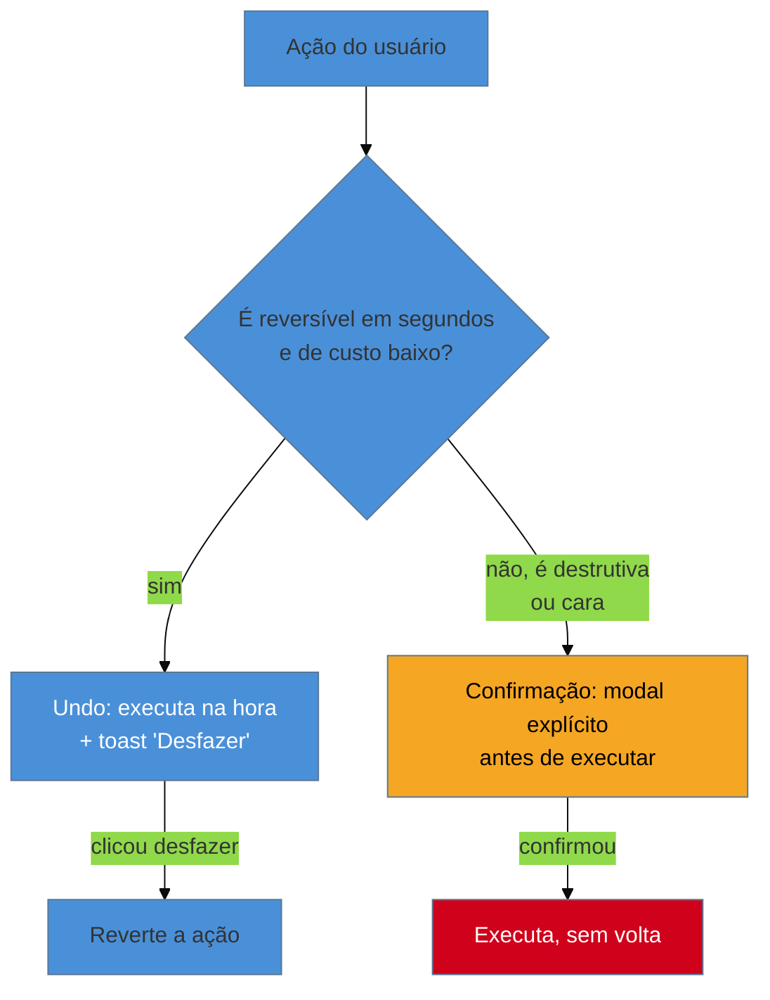

# Undo vs confirmação

> [!abstract] TL;DR
> Prefira **ação reversível com undo** a modal de confirmação sempre que o custo do erro for baixo e recuperável — arquivar um e-mail, remover um item de uma lista, sempre com um toast "Desfazer" logo depois. Reserve **confirmação** para ações destrutivas irreversíveis ou caras: deletar conta, cobrar cartão. É princípio de Norman e reforçado pela heurística 3 de Nielsen (controle e liberdade do usuário — ver [[03-Dominios/Engenharia/UX/Fundamentos e Modelo Mental/03 - As 10 heurísticas de Nielsen|nota 03]]). O erro comum de engenheiro: colocar confirmação em tudo "para ser seguro", o que causa **alert fatigue** — o usuário aprende a clicar "Confirmar" sem ler, anulando o próprio guarda. O custo de engenharia que decide qual dos dois é viável: undo exige soft delete ou fila de operações reversível — decisão de modelagem de dados, não de UI.

Imagine um produto de gestão de tarefas onde toda ação de exclusão — arquivar uma tarefa concluída, remover um comentário, tirar um colaborador de um board — dispara um modal: "Tem certeza que deseja fazer isso?". No começo parece prudente: ninguém quer apagar algo por acidente. Depois de duas semanas de uso real, o padrão que emerge é outro: o usuário clica "Confirmar" reflexamente, sem ler o texto do modal, porque ele já apareceu vinte vezes hoje para ações completamente inofensivas. No dia em que a ação *realmente* é destrutiva de verdade — deletar um board inteiro com semanas de trabalho — o modal aparece exatamente igual aos outros dezenove, e o usuário clica "Confirmar" do mesmo jeito automático. O guarda que devia proteger contra o erro grave foi anulado pelo próprio excesso de uso em erros triviais. Esse é o problema central desta nota: confirmação em excesso não é "mais seguro", é um guarda que aprende a ser ignorado.

## O princípio: reversibilidade decide o mecanismo, não o medo do erro

O princípio vem de **Don Norman** e é reforçado diretamente pela **heurística 3 de Nielsen — controle e liberdade do usuário** (ver [[03-Dominios/Engenharia/UX/Fundamentos e Modelo Mental/03 - As 10 heurísticas de Nielsen|nota 03]]): usuários cometem erros por engano e precisam de uma "saída de emergência" clara, sem precisar passar por um diálogo estendido. A regra prática que decorre disso:

- **Undo** — quando o custo do erro é baixo e a ação é recuperável em segundos. A ação executa imediatamente, sem interromper o fluxo, e um toast breve — "Tarefa arquivada. Desfazer" — fica disponível por alguns segundos depois.
- **Confirmação** — reservada para ações destrutivas irreversíveis (deletar permanentemente, sem lixeira) ou caras (cobrar um cartão, enviar um pagamento). O modal existe justamente porque não há undo possível depois que a ação roda.

O ponto central que a maioria erra: essas duas opções não são intercambiáveis por "prudência" — são a resposta certa a duas situações diferentes de custo de erro. Empilhar confirmação sobre uma ação que já é reversível não adiciona segurança real, porque a segurança já existia na forma de undo; só adiciona fricção, e fricção repetida é exatamente o que causa **alert fatigue**.

**O mecanismo em uma frase:** confirmação e undo são dois mecanismos de segurança para dois tipos de risco diferentes — usar o mecanismo errado, ou os dois ao mesmo tempo, na maioria das vezes só produz fricção sem produzir segurança real.

> [!question]- Por que não usar os dois — confirmação *e* undo — para máxima segurança?
> Porque a soma dos dois custa mais do que a soma das seguranças que eles oferecem. Se a ação já tem undo confiável, a confirmação é redundante — está pedindo permissão para uma ação que, se der errado, se desfaz em um clique. O único cenário em que os dois fazem sentido juntos é quando a ação é cara o suficiente (ex: cobrar um cartão) que mesmo um undo rápido não desfaz o dano real (o cliente já viu a cobrança, o banco já processou) — nesses casos raros, vale confirmação, e não vale undo como substituto sozinho.

## O custo de engenharia que decide o que é viável

Aqui está o par decisão↔custo que separa quem só desenha a interface de quem também vai construí-la: **undo não é feature de UI, é decisão de modelagem de dados**. Implementar undo de verdade exige uma das duas abordagens:

- **Soft delete** — em vez de apagar o registro do banco, marcar um campo `deleted_at` (ou equivalente) e filtrar esses registros das consultas normais. Desfazer é só reverter o campo. O custo: toda query do sistema precisa agora considerar esse filtro, e a limpeza definitiva dos dados marcados precisa de um processo separado (job de expurgo).
- **Fila de operações reversível** — registrar a operação como um evento antes de aplicá-la, permitindo reverter aplicando o evento inverso. Mais flexível para operações complexas (não só exclusão), mas exige desenhar cada operação com seu inverso correspondente desde o início.

Confirmação, em contraste, não exige nenhuma dessas mudanças de modelagem — é puramente uma decisão de UI, um modal antes de uma chamada que já existia. Isso significa que a escolha entre undo e confirmação não é só uma decisão de design: quando o time não tem tempo ou orçamento para implementar soft delete, confirmação pode ser a opção pragmaticamente disponível mesmo quando undo seria a experiência ideal — e essa é exatamente a leitura que um designer puro, sem visibilidade do custo de dados por trás, dificilmente vai fazer sozinho.

## O que dá pra fazer sozinho, e o que não dá

Praticável sozinho, com o código que já existe:

- **Auditar as ações destrutivas do produto** e classificar cada uma como "candidata a undo" ou "precisa de confirmação de verdade" — é trabalho de julgamento, aplicando a regra de reversibilidade desta nota ação por ação, sem depender de nenhuma ferramenta.
- **Implementar um toast simples de "Desfazer"** para uma ação que já é reversível no código existente (por exemplo, um campo `status` que já existe e só precisa ser revertido) — quando a reversibilidade já está lá, o toast é pouco mais que uma chamada extra e um componente de UI.
- **Trocar um modal de confirmação existente por undo**, quando a ação por trás dele já é — ou pode ser barata de tornar — reversível: o ganho de fricção reduzida vem sem precisar esperar por nenhum outro time.

Exige estrutura de time quando a reversibilidade não existe ainda no sistema: uma **migração de schema para adicionar soft delete** em tabelas que hoje fazem exclusão física toca todas as queries existentes daquela tabela, exige plano de migração e, tipicamente, revisão de mais de uma pessoa — não é mudança que se faz isoladamente sem risco. **Construir uma fila de eventos reversível genérica** para operações complexas de múltiplos passos é decisão de arquitetura de dados que afeta o sistema inteiro, não uma ação isolada — o tipo de investimento que só se justifica quando várias features vão precisar de undo, não uma só. E uma **pesquisa medindo a taxa real de erro do usuário antes e depois da mudança** para validar se o ganho existe de verdade exige instrumentação e volume de uso — sem isso, a decisão de trocar confirmação por undo continua sendo bem fundamentada em princípio, mas não confirmada em dado real de produção.

## Casos práticos

### Cenário 1: arquivar e-mail com undo, no estilo Gmail
Arquivar um e-mail no Gmail não pede confirmação — executa na hora, e um toast "Conversa arquivada. Desfazer" aparece por poucos segundos. A ação é barata de reverter (é literalmente mover uma tag), e o custo de errar é baixo (o e-mail não some, só sai da caixa de entrada). Esse é o padrão de referência que popularizou undo-com-toast como alternativa a confirmação para ações de risco baixo, hoje replicado em Google Docs, Trello e Asana.

### Cenário 2: deletar conta, sem substituto de undo
Um fluxo de exclusão de conta legitimamente não tem undo possível — depois de um certo prazo, os dados são apagados de verdade, inclusive de backups. Aqui a confirmação explícita é a escolha certa, não um excesso de zelo: o modal deveria pedir que o usuário digite o nome da conta ou "EXCLUIR" para confirmar, elevando a barreira de erro acidental de forma proporcional à irreversibilidade real da ação — bem diferente do "Tem certeza?" genérico do cenário de abertura desta nota.

### Cenário 3: ação em lote sem undo, forçando confirmação pesada
Uma ferramenta de gestão de tickets permite selecionar 50 tickets de uma vez e "arquivar em lote". Como o time nunca implementou undo para operações em lote — exigiria rastrear as 50 reversões individuais numa fila reversível, o custo de engenharia descrito acima — a única rede de segurança disponível é um modal de confirmação: "Tem certeza que deseja arquivar 50 tickets?". É uma escolha correta dado o custo real de implementar undo em lote, mas incompleta sozinha, porque um clique errado em "confirmar" continua sendo catastrófico sem chance de reverter. A melhoria de baixo custo, sem reescrever a fila de eventos: listar os 50 tickets afetados dentro do próprio modal antes de confirmar, para que o usuário veja de fato o que está prestes a arquivar, em vez de confiar cegamente num número.

## Armadilhas comuns

> [!warning] Confirmação em tudo, gerando alert fatigue
> **O que acontece:** toda ação de exclusão ou edição dispara um modal "Tem certeza?", inclusive ações triviais e facilmente reversíveis. **Por quê:** confirmação parece a escolha "segura por padrão" para quem está com medo de gerar reclamação de erro do usuário — mas o excesso de confirmações treina o usuário a clicar "Confirmar" sem ler, o que anula o propósito do modal justamente quando ele importa de verdade. **Como evitar:** para cada confirmação existente, pergunte "essa ação é reversível em segundos, a custo baixo?" — se sim, substitua por undo. Reserve confirmação para o pequeno subconjunto de ações genuinamente irreversíveis ou caras.

> [!warning] Undo "de mentira" — toast que não reverte de verdade
> **O que acontece:** um botão "Desfazer" aparece no toast, mas ao clicar, nada acontece, ou a ação parcialmente reverte (o item some da lista, mas o efeito colateral — um e-mail de notificação já disparado, por exemplo — já aconteceu e não é desfeito). **Por quê:** implementar undo real exige a modelagem de dados descrita acima; sob pressão de prazo, é tentador adicionar só o botão visual sem a lógica de reversão completa por trás. **Como evitar:** antes de expor undo na interface, valide que a reversão é de fato completa — incluindo efeitos colaterais como notificações, webhooks ou integrações disparadas pela ação original.

> [!warning] Confirmação genérica sem contexto específico da ação
> **O que acontece:** o modal diz apenas "Tem certeza que deseja continuar?" sem nomear o que exatamente vai ser afetado. **Por quê:** um texto genérico é mais rápido de escrever e reutilizar entre diferentes ações — mas obriga o usuário a confiar cegamente, sem informação suficiente para decidir se aquela confirmação específica é a que ele realmente queria dar. **Como evitar:** o texto de confirmação deve restatar o que vai acontecer com especificidade — "Excluir permanentemente o board 'Sprint 12' e suas 34 tarefas?" em vez de "Tem certeza?" — dando ao usuário a informação real para decidir.

## Como explicar em inglês

> "Prefer **reversible actions with undo** over confirmation dialogs whenever the cost of a mistake is low and recoverable — archive an email, remove a list item, always with a brief 'Undo' toast. Reserve **confirmation** for irreversible or expensive destructive actions — deleting an account, charging a card. The common engineering mistake is adding confirmation everywhere 'to be safe,' which causes **alert fatigue**: users learn to click 'Confirm' without reading, defeating the guard exactly when it matters. The deciding engineering cost: undo requires soft delete or a reversible operation queue — a data modeling decision, not a UI one."

| PT | EN |
|----|----|
| desfazer | undo |
| confirmação | confirmation |
| fadiga de alerta | alert fatigue |
| exclusão reversível (soft delete) | soft delete |
| ação destrutiva | destructive action |
| controle e liberdade do usuário | user control and freedom |

## O que vem a seguir

Undo depende de um mecanismo de feedback rápido — o toast que aparece e desaparece — para funcionar bem. A próxima nota generaliza esse problema: como comunicar que uma ação foi registrada, está processando, ou terminou, em qualquer parte da interface, não só nos casos de undo.

- [[03-Dominios/Engenharia/UX/Design de Interação/25 - Latência percebida e feedback|25 — Latência percebida e feedback]] — o vocabulário completo de feedback imediato, do qual o toast de "Desfazer" é um caso específico.
- [[03-Dominios/Engenharia/UX/Design de Interação/24 - Design de formulários - defaults|24 — Design de formulários: defaults]] — outra área onde erro do usuário e recuperação de erro (heurística 9 de Nielsen) precisam de tratamento explícito.

## Fontes

- **Don Norman** — princípio de reversibilidade de ações como redução de ansiedade do usuário, base conceitual da heurística de controle e liberdade.
- **Jakob Nielsen / Nielsen Norman Group** — [*User Control and Freedom (Usability Heuristic #3)*](https://www.nngroup.com/articles/user-control-and-freedom/) — formulação da heurística que sustenta undo como "saída de emergência".
- **Nielsen Norman Group** — [*Confirmation Dialogs Can Prevent User Errors (If Not Overused)*](https://www.nngroup.com/articles/confirmation-dialog/) — critério de quando confirmação vale a pena, e o risco de excesso.

> [!tip] Assista: Usability Heuristic 3: User Control & Freedom
> **Canal:** Nielsen Norman Group (NN/g) | **Duração:** ~2min | **Idioma:** EN
>
> O vídeo cobre o princípio geral (undo/redo e "saída de emergência" clara, com o exemplo dos botões de voltar/avançar do navegador) mas não aprofunda a comparação direta undo-vs-confirmação nem o custo de engenharia de soft delete — essas duas partes são elaboração desta nota a partir da literatura combinada de Norman e da NN/g sobre confirmação.
>
> 🎬 [Assistir no YouTube](https://www.youtube.com/watch?v=MXuk-fdbr0A)
