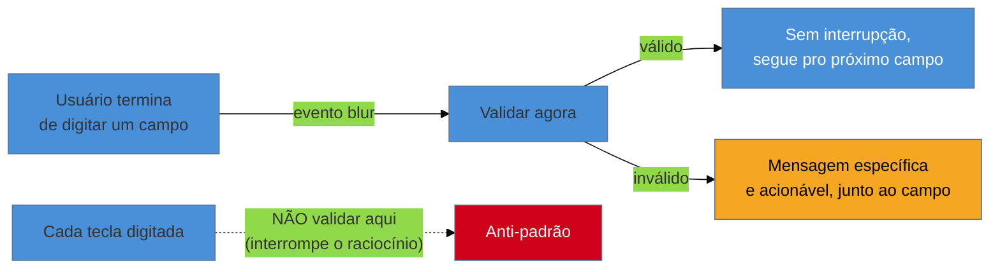

# Design de formulários: defaults

> [!abstract] TL;DR
> Um corpo de pesquisa consolidado pela Nielsen Norman Group (**"Few Guesses, More Success: 4 Principles to Reduce Cognitive Load in Forms"**) resume o que torna um formulário fácil de preencher: **uma coluna** (converte melhor que multi-coluna), **label acima do campo** (não ao lado), **placeholder nunca substitui label** (some quando o usuário digita), **validação inline no blur** (não a cada tecla, não só no submit), **mensagens de erro específicas e acionáveis**, e **marcar os campos opcionais**, não os obrigatórios. Formulário longo: quebre em steps quando há dependência lógica entre seções; mantenha página única com seções colapsáveis quando os campos são independentes. Esta nota cobre **defaults de layout e interação**, não acessibilidade nem validação nativa de HTML — ambas linkadas, não reexplicadas.

Imagine preencher um formulário de cadastro de fornecedor: os campos de nome e sobrenome ficam lado a lado numa mesma linha, o label "CPF" está posicionado exatamente entre dois campos diferentes (ambíguo — é o label de qual dos dois?), o placeholder do campo de e-mail some assim que você começa a digitar (e você esquece, no meio do preenchimento, se aquele campo pedia e-mail pessoal ou corporativo), a validação de CNPJ dispara a cada tecla digitada — piscando vermelho enquanto você ainda está no meio do número — e ao errar o formato, o campo inteiro é limpo, te obrigando a redigitar do zero. Nenhuma dessas decisões parece catastrófica isoladamente. Juntas, elas produzem exatamente o tipo de formulário que os usuários abandonam no meio, e que gera ticket de suporte perguntando "por que não consigo cadastrar". Não é falta de validação — é excesso de decisões de design pequenas, cada uma tomada sem saber que existe pesquisa consolidada dizendo o oposto do que foi implementado.

## Os seis princípios, com o porquê de cada um

O corpo de pesquisa mais citado sobre isso é da **Nielsen Norman Group**, consolidado no artigo *"Few Guesses, More Success: 4 Principles to Reduce Cognitive Load in Forms"* e em pesquisas complementares sobre organização visual de formulários:

1. **Uma coluna** — um formulário de coluna única converte melhor que multi-coluna. O motivo é ocular, não estético: o olho lê de cima para baixo naturalmente; um layout de múltiplas colunas obriga o cérebro a decidir a cada campo se continua descendo a mesma coluna ou pula para o lado, um custo de decisão repetido a cada linha.
2. **Label acima do campo**, não ao lado — reduz o movimento ocular necessário para associar um label ao campo que ele descreve. Label ao lado força o olho a se mover na horizontal antes de voltar pra esquerda no campo seguinte; label acima mantém tudo na mesma coluna vertical de leitura.
3. **Placeholder não substitui label** — o placeholder some assim que o usuário começa a digitar, e o contexto se perde exatamente quando o usuário mais precisa dele: no meio do preenchimento, ao pausar para pensar, ou ao revisar antes de enviar. Placeholder serve para exemplo de formato (`000.000.000-00`), nunca para substituir o nome do campo.
4. **Validação inline no blur**, não a cada tecla e não só no submit — validar a cada tecla interrompe o usuário no meio da digitação, mostrando erro para um valor que ele ainda nem terminou de escrever (hostil); validar só no submit adia o feedback até o fim do formulário inteiro, obrigando a pessoa a rolar de volta e corrigir depois de já ter investido tempo em todo o resto. O ponto de equilíbrio é o evento de **blur** (quando o campo perde o foco): o usuário terminou de digitar aquele campo específico, então é o momento certo para validar e mostrar erro, se houver.
5. **Mensagens de erro específicas e acionáveis** — "CPF inválido, use o formato 000.000.000-00" resolve o problema; "campo inválido" não diz o que está errado nem como corrigir. Essa regra é aplicação direta da heurística 9 de Nielsen (ajudar o usuário a reconhecer, diagnosticar e recuperar de erros — ver [[03-Dominios/Engenharia/UX/Fundamentos e Modelo Mental/03 - As 10 heurísticas de Nielsen|nota 03]]).
6. **Marque os campos opcionais**, não os obrigatórios — na maioria dos formulários reais, a maior parte dos campos é obrigatória. Marcar cada um dos obrigatórios com asterisco produz uma tela poluída de símbolos repetidos; marcar só os poucos campos opcionais como "(opcional)" comunica a mesma informação com menos ruído visual.

**O mecanismo em uma frase:** cada um desses seis princípios existe para reduzir uma decisão ou movimento desnecessário do usuário — coluna única elimina decisão de leitura, label acima elimina movimento ocular, validação no blur elimina interrupção prematura — a soma é o que a pesquisa chama de menor **carga cognitiva**.

## Formulário longo: steps ou seções colapsáveis?

A escolha depende de **dependência lógica** entre as partes do formulário, não do tamanho absoluto:

- **Quebre em steps** (multi-etapa, com barra de progresso) quando existe dependência real entre seções — por exemplo, o endereço precisa ser preenchido antes de o sistema calcular o frete disponível, que por sua vez muda os métodos de pagamento oferecidos. Aqui, mostrar tudo de uma vez seria enganoso, porque parte do formulário depende de dado que ainda não existe.
- **Mantenha página única com seções colapsáveis** (accordion — ver [[03-Dominios/Engenharia/UX/Design de Interação/21 - Progressive disclosure|nota 21]] sobre progressive disclosure) quando os campos são independentes entre si — dados pessoais, endereço de cobrança e preferências de notificação não dependem uns dos outros, então forçar o usuário por um wizard sequencial artificial só adiciona cliques sem necessidade real.

## O que dá pra fazer sozinho, e o que não dá

Praticável sozinho, revisando o que já existe:

- **Auditar formulários existentes contra os seis princípios** e corrigir layout (coluna única, label acima, placeholder correto) — é revisão de código e CSS, sem depender de mais ninguém para decidir ou aprovar.
- **Trocar validação "a cada tecla" por validação no evento `blur`** — mudança pontual de evento no código de validação, que já existe; não exige redesenho nem nova infraestrutura.
- **Reescrever mensagens de erro genéricas para versões específicas e acionáveis** — trabalho de texto, aplicando a heurística 9 de Nielsen mensagem por mensagem, sem esperar por rodada de pesquisa.

Exige estrutura de time quando a mudança depende de medir comportamento real ou de reestruturar o fluxo inteiro: um **teste de usabilidade medindo taxa real de conclusão** antes e depois das mudanças precisa de participantes recrutados e de um roteiro de observação — sem isso, a melhoria de layout continua sendo aposta bem fundamentada, não fato validado com usuário real. Um **redesenho completo de um formulário grande com steps**, incluindo a lógica de dependência real entre etapas (qual campo depende de qual resposta anterior), é projeto de arquitetura de formulário que toca vários componentes ao mesmo tempo — trabalho substancial demais para encaixar como ajuste isolado. E uma **pesquisa qualitativa entrevistando usuários que abandonaram o formulário no meio** exige acesso a esses usuários e tempo de entrevista — o único jeito de saber a causa real do abandono, em vez de inferir a partir de métricas agregadas que mostram *onde* o abandono acontece, mas não *por quê*.

## Casos práticos

### Cenário 1: checkout que perde o carrinho ao errar o CEP
Um checkout de e-commerce valida o CEP a cada tecla digitada e, ao detectar formato inválido no meio da digitação (porque o usuário ainda não terminou de digitar os 8 dígitos), limpa o campo inteiro e mostra "CEP inválido" em vermelho — mesmo que o usuário estivesse no processo normal e correto de digitar um CEP válido. O resultado, medido em analytics, é uma taxa de abandono desproporcional exatamente naquele campo. A correção: validar só no blur (quando o usuário sai do campo), e só limpar/marcar erro se o valor final, completo, for de fato inválido.

### Cenário 2: formulário B2B com 30 campos, todos "obrigatórios" com asterisco
Um formulário de cadastro de fornecedor tem 30 campos, dos quais 27 são obrigatórios. Marcar cada um dos 27 com asterisco (prática comum, mas contraintuitiva) produz uma tela onde quase todo label tem um símbolo repetido, sem ajudar ninguém a distinguir nada. Invertendo a marcação — deixando os 27 obrigatórios sem símbolo e marcando só os 3 opcionais com "(opcional)" — a tela fica visualmente mais limpa e comunica exatamente a mesma informação, com muito menos ruído repetido.

### Cenário 3: formulário partido em steps sem nenhuma dependência real
Um formulário de "criar perfil de fornecedor" foi dividido em quatro etapas sequenciais (dados básicos, endereço, contatos, documentos) sem que nenhuma etapa dependesse do resultado da anterior — nenhum cálculo, nenhuma opção condicional. A divisão em steps foi copiada de outro formulário do mesmo produto que tinha dependência real (endereço afetando frete calculado), sem checar se fazia sentido também aqui. O resultado: usuários que preencheriam tudo de uma vez, sem pausa, são forçados por quatro cliques de "Próximo" que não adicionam clareza nenhuma — só atraso. Reformular como página única com seções organizadas por espaçamento (sem accordion nem step, ver critério da seção anterior) resolve, porque a independência entre as seções nunca justificou o wizard.

## Armadilhas comuns

> [!warning] Validação hostil — a cada tecla, com mensagem genérica
> **O que acontece:** o campo mostra erro em vermelho antes mesmo de o usuário terminar de digitar, com uma mensagem como "campo inválido" que não diz o que está errado.
> **Por quê:** validar a cada tecla é tecnicamente mais simples de implementar (um `onChange` direto) do que orquestrar o evento de blur corretamente — e mensagens genéricas são mais rápidas de escrever do que mensagens específicas por tipo de erro.
> **Como evitar:** valide no blur, não no change; escreva a mensagem de erro nomeando o problema específico e o formato esperado, seguindo o padrão da heurística 9 de Nielsen.

> [!warning] Campo que apaga o que o usuário digitou ao dar erro
> **O que acontece:** ao detectar um valor inválido, o campo é limpo completamente em vez de manter o texto digitado com o erro sinalizado ao lado.
> **Por quê:** é mais simples de programar "resetar o campo em caso de erro" do que preservar o valor inválido para o usuário corrigir a partir dali — mas do ponto de vista do usuário, isso força redigitação completa por um erro pequeno.
> **Como evitar:** nunca limpe um campo automaticamente por causa de validação — mantenha o valor digitado, destaque o campo com erro, e deixe o usuário editar a partir do que já tinha escrito.

> [!warning] Placeholder fazendo o papel de label
> **O que acontece:** um campo não tem label visível, só um placeholder ("Digite seu e-mail") que desaparece assim que o usuário começa a digitar.
> **Por quê:** parece economizar espaço visual, e em formulários curtos o problema passa despercebido — até o usuário pausar no meio do preenchimento e não lembrar mais o que aquele campo pedia.
> **Como evitar:** todo campo tem label visível e permanente, acima do campo; placeholder, quando usado, serve só para mostrar um exemplo de formato esperado, nunca para substituir o nome do campo.

## Como explicar em inglês

> "Research consolidated by the Nielsen Norman Group boils good form design down to a handful of defaults: **single column** layout, **labels above** fields (not beside), **placeholders that never replace labels**, **inline validation on blur** (not on every keystroke), **specific, actionable error messages**, and **marking optional fields**, not required ones, since most fields in a real form are required. Long forms should split into steps only when there's real logical dependency between sections — otherwise, collapsible sections on a single page serve better."

| PT | EN |
|----|----|
| formulário de coluna única | single-column form |
| validação no blur | on-blur validation |
| carga cognitiva | cognitive load |
| campo opcional | optional field |
| validação hostil | hostile validation |
| formulário em etapas | multi-step form |

## O que vem a seguir

Formulários acessíveis de verdade — foco visível, associação correta de `label`/`for`, anúncio de erro por leitor de tela — são tratados a fundo no domínio de Acessibilidade; e a validação nativa do próprio HTML, incluindo os atributos que o navegador já oferece antes de qualquer JavaScript, tem nota própria no domínio de HTML. Esta nota cobriu layout e interação; as duas próximas cobrem a base técnica sobre a qual ela se apoia.

- [[03-Dominios/Tecnologia/Acessibilidade/Construir Acessível/07 - Formulários acessíveis de verdade|Formulários acessíveis de verdade]] — o que os seis princípios desta nota não cobrem: leitura por leitor de tela, foco, e associação semântica entre label e campo.
- [[03-Dominios/Tecnologia/HTML/06 - Formulários II - validação nativa e UX|HTML 06 — Formulários II: validação nativa e UX]] — os atributos HTML nativos (`required`, `pattern`, `type=email`) que fazem parte da validação antes de qualquer JavaScript.
- [[03-Dominios/Engenharia/UX/Design de Interação/25 - Latência percebida e feedback|25 — Latência percebida e feedback]] — o que fazer entre o clique em "enviar" e a resposta do servidor, incluindo o estado de envio de um formulário.

## Fontes

- **Nielsen Norman Group** — [*Few Guesses, More Success: 4 Principles to Reduce Cognitive Load in Forms*](https://www.nngroup.com/articles/4-principles-reduce-cognitive-load/) — corpo de pesquisa central desta nota.
- **Nielsen Norman Group** — [*Website Forms Usability: Top 10 Recommendations*](https://www.nngroup.com/articles/web-form-design/) — recomendações complementares, incluindo marcação de campos obrigatórios/opcionais.
- **Nielsen Norman Group** — [*Group Form Elements Effectively Using White Space*](https://www.nngroup.com/articles/form-design-white-space/) — base de pesquisa para o princípio de espaçamento entre seções.

> [!tip] Assista: Better Forms Through Visual Organization
> **Canal:** Nielsen Norman Group (NN/g), com Kathryn Whitenton | **Duração:** ~3min | **Idioma:** EN
>
> O vídeo cobre diretamente três dos seis princípios desta nota — coluna única, posicionamento de label, e uso de espaçamento para separar seções relacionadas — com exemplos visuais concretos. Não cobre validação inline, mensagens de erro nem a marcação de campos opcionais vs. obrigatórios; essas três partes vêm de outros artigos da mesma organização, citados em Fontes.
>
> 🎬 [Assistir no YouTube](https://www.youtube.com/watch?v=nA7ildepUJU)
