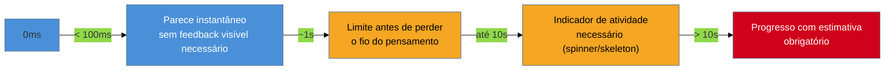

# Latência percebida e feedback

> [!abstract] TL;DR
> Não é sobre performance real, é sobre **percepção**: como o usuário *sente* o tempo de espera, independente do tempo real medido. Base em pesquisa clássica de tempo de resposta humano-computador — **Miller (1968)** e **Card, Moran & Newell, *The Psychology of Human-Computer Interaction* (1983)** — com três limiares: **<100ms** parece instantâneo, **~1s** é o limite antes de o usuário perder o fio do pensamento, **>10s** exige indicador de progresso com estimativa. A **heurística 1 de Nielsen** (visibilidade do status do sistema) é o princípio-mãe. **Ressalva importante:** a superioridade de **skeleton screens sobre spinners** é frequentemente afirmada como consenso — mas não é. Há contestação: em alguns estudos o skeleton gera expectativa maior e frustração se a tela real vier muito diferente do skeleton. Apresente como trade-off, não como regra estabelecida.

Imagine dois botões de "Salvar" em dois produtos diferentes. No primeiro, ao clicar, nada muda visualmente por 1.5 segundos — o botão continua com a mesma aparência, sem spinner, sem mudança de cor — até que, de repente, a tela mostra "Salvo com sucesso". No segundo, o mesmo tempo de resposta de rede (1.5 segundos, idêntico ao primeiro, medido de verdade), mas o botão muda de aparência imediatamente ao clique — texto vira "Salvando...", um pequeno spinner aparece dentro dele — antes da mesma confirmação final aparecer. Objetivamente, os dois produtos são igualmente rápidos: 1.5 segundos de latência real, sem diferença nenhuma no backend. Subjetivamente, o primeiro produto parece quebrado — o usuário clica de novo, gerando um segundo salvamento duplicado — enquanto o segundo parece responsivo, mesmo levando exatamente o mesmo tempo. Essa nota é sobre essa diferença: **a percepção de velocidade não é a mesma coisa que a velocidade real**, e ela é uma variável de design, não só de infraestrutura.

## Os três limiares de tempo de resposta humano-computador

A base de pesquisa é clássica e antecede a web: **Miller (1968)** e, de forma mais completa, **Card, Moran & Newell**, em ***The Psychology of Human-Computer Interaction* (1983)**, estabeleceram limiares de percepção humana ao tempo de resposta de um sistema, ainda hoje citados como referência em UX de performance:

- **Menos de 100ms** — a resposta parece instantânea. O usuário não percebe atraso nenhum entre a ação e a reação do sistema; qualquer feedback visual precisa acontecer dentro dessa janela para não quebrar essa ilusão de causa e efeito direto.
- **Cerca de 1 segundo** — o limite antes de o usuário perder o fio do pensamento. Até esse ponto, o atraso é perceptível, mas o usuário mantém o contexto mental da ação que acabou de fazer sem precisar de indicador explícito de progresso — mesmo assim, algum sinal de que o clique foi registrado já ajuda.
- **Mais de 10 segundos** — exige indicador de progresso com estimativa de tempo. Acima desse ponto, o usuário não consegue mais manter atenção contínua na tarefa; sem uma barra de progresso ou estimativa, ele assume que o sistema travou e abandona a tarefa ou tenta de novo.

O princípio-mãe por trás dos três limiares é a **heurística 1 de Nielsen — visibilidade do status do sistema** (ver [[03-Dominios/Engenharia/UX/Fundamentos e Modelo Mental/03 - As 10 heurísticas de Nielsen|nota 03]]): o sistema deve manter o usuário informado sobre o que está acontecendo, com feedback em tempo razoável. Os limiares desta nota são a versão quantificada dessa heurística — respondem exatamente à pergunta "o que é 'tempo razoável', em milissegundos?".

**O mecanismo em uma frase:** o usuário não está medindo o tempo real de resposta do sistema, está medindo se recebeu confirmação suficiente de que sua ação foi registrada — e essa confirmação, bem desenhada, pode fazer o mesmo tempo real parecer mais curto.

## A ressalva obrigatória: skeleton screens não é consenso sobre spinners

É comum ver a afirmação de que **skeleton screens são sempre superiores a spinners** — a ideia de que mostrar o contorno da página carregando (em vez de um ícone girando genérico) sempre reduz a ansiedade de espera e melhora a experiência percebida. **Essa afirmação não é consenso**, embora seja repetida como se fosse regra estabelecida em boa parte do conteúdo popular sobre o tema.

O argumento a favor do skeleton é real: ele mostra a *forma* do que vem, dando ao usuário uma antecipação da estrutura da página antes do conteúdo chegar, o que tende a reduzir a sensação de espera vazia. Mas há contestação documentada na literatura: em alguns estudos, o skeleton screen gera uma **expectativa** sobre o layout final — e se a tela real, quando carrega, vier estruturalmente muito diferente do que o skeleton sugeriu (mais itens do que os blocos mostravam, um layout que reflui de forma inesperada), a discrepância entre o que foi prometido visualmente e o que chegou de fato gera **mais frustração**, não menos, do que um spinner genérico que nunca prometeu forma nenhuma.

A escolha correta, portanto, não é "sempre skeleton": é uma escolha de contexto —

- **Skeleton** tende a funcionar melhor quando a estrutura final é previsível e estável (um feed de cards sempre do mesmo tamanho, uma tabela de colunas fixas) e o carregamento é de página inteira, tipicamente entre 2 e 10 segundos.
- **Spinner** continua sendo a escolha melhor para elementos isolados (um único botão salvando, um card individual atualizando) e para ações rápidas onde desenhar um esqueleto inteiro seria trabalho desproporcional ao ganho.
- **Progress bar** com estimativa entra quando a espera passa dos 10 segundos, porque nesse ponto o usuário precisa de mais do que "algo está acontecendo" — precisa saber quanto falta.

> [!question]- Então nunca vale a pena investir em skeleton screen?
> Vale, mas com essa ressalva: o investimento em skeleton só compensa se o esqueleto for **fiel** à estrutura real que vai carregar — do contrário, ele cria uma promessa visual que o conteúdo real quebra, e a frustração de "não era isso que eu esperava" pode ser pior do que a espera sem promessa nenhuma de um spinner. Se manter o skeleton sincronizado com mudanças futuras de layout não é uma prioridade real do time, um spinner honesto é a opção mais segura.

## Anti-padrão fixo: spinner infinito

Um spinner sem timeout, sem fallback e sem mensagem é o pior dos três cenários possíveis: o usuário não sabe se o sistema travou, se ainda está processando, ou se algo falhou silenciosamente. Sempre desenhe explicitamente o caminho "e se demorar mais do que o esperado, ou falhar de verdade" — um timeout que troca o spinner por uma mensagem de erro específica depois de um tempo razoável (ver os estados de erro na [[03-Dominios/Engenharia/UX/Design de Interação/20 - Os 5 estados de tela|nota 20]]) é sempre melhor do que um spinner que gira para sempre.

## O que dá pra fazer sozinho, e o que não dá

Praticável sozinho, no código que já existe:

- **Adicionar feedback imediato** (mudança de estado do botão) a qualquer ação que hoje não dá nenhum sinal visual até a resposta do servidor — quase sempre é uma mudança pequena e localizada (desabilitar o botão, trocar o texto), com efeito desproporcional na percepção de responsividade.
- **Trocar um spinner infinito por um spinner com timeout e mensagem de fallback** — adicionar um `setTimeout` ou lógica equivalente que troca o estado depois de um tempo razoável não exige infraestrutura nova, só a disciplina de desenhar esse caminho.
- **Escolher entre skeleton, spinner e progress bar usando os critérios de contexto desta nota**, em vez de copiar o que outro produto faz — decisão de julgamento que qualquer pessoa que já leu esta nota consegue aplicar tela por tela.

Exige estrutura de time quando a decisão precisa se apoiar em medição real, não em julgamento: uma **medição real de performance de rede** (INP, TTFB) para saber em qual dos três limiares uma ação específica realmente cai depende de instrumentação de monitoramento em produção — sem isso, "essa ação demora ~1s" continua sendo estimativa, não fato medido. Uma **pesquisa de usuário comparando percepção de skeleton vs. spinner especificamente no seu produto** exige participantes e metodologia — o único jeito de decidir com dado, em vez de aplicar a heurística geral desta nota, quando a decisão for grande o suficiente para justificar o investimento. E **manter o skeleton sincronizado com mudanças futuras de layout ao longo do tempo** é custo de manutenção contínuo, não de implementação única — cada vez que a tela real muda de estrutura, alguém precisa lembrar de atualizar o esqueleto correspondente, o que só é sustentável com processo de time, não com boa vontade individual.

## Casos práticos

### Cenário 1: o botão que parecia travado
Retomando o cenário de abertura: um botão "Salvar" sem nenhum feedback visual até a resposta do servidor gera cliques duplicados de usuários que, não vendo confirmação nenhuma dentro de ~1 segundo (o limiar de Card, Moran & Newell), presumem que o clique não registrou e clicam de novo — gerando duas requisições e, dependendo do backend, dois registros duplicados. A correção não muda o tempo real de resposta nenhum milissegundo: só desabilita o botão e troca seu texto para "Salvando..." imediatamente ao clique, dentro da janela de <100ms que a heurística 1 de Nielsen exige.

### Cenário 2: dashboard com skeleton que prometeu o que não entregou
Um dashboard usa skeleton screens fiéis ao layout de três cards fixos enquanto carrega. Numa atualização posterior do produto, um quarto card condicional foi adicionado (aparece só para usuários com uma feature habilitada), mas o skeleton nunca foi atualizado para refletir isso — ele continua mostrando três blocos fantasma. Para os usuários com a feature habilitada, a tela real "pula" ao carregar, adicionando um bloco que o skeleton nunca sugeriu, gerando exatamente o tipo de discrepância que a ressalva desta nota descreve: expectativa visual quebrada, mais notada do que se um spinner simples tivesse sido usado.

### Cenário 3: upload longo com spinner genérico, sem noção de progresso
Uma ferramenta de upload de vídeo mostra um spinner simples enquanto o arquivo sobe — para arquivos que podem levar de 30 segundos a 5 minutos, dependendo do tamanho e da conexão do usuário. Como o spinner não comunica progresso nem estimativa nenhuma, usuários com upload mais lento presumem, por volta do primeiro minuto, que o sistema travou, e fecham a aba — cancelando um upload que na verdade estava avançando normalmente. Trocar o spinner por uma barra de progresso real (porcentagem enviada, calculada a partir dos bytes já transmitidos) resolve sem mudar a velocidade real do upload — só torna visível que, passado o limiar de 10 segundos desta nota, o indicador certo é estimativa de progresso, não "algo está acontecendo".

## Armadilhas comuns

> [!warning] Spinner infinito, sem timeout nem fallback
> **O que acontece:** o spinner gira indefinidamente quando a requisição falha silenciosamente ou trava, sem nunca virar uma mensagem de erro.
> **Por quê:** é mais rápido de implementar "mostrar spinner enquanto a promise não resolve" do que desenhar explicitamente o caminho de timeout e erro — o caso feliz (a promise sempre resolve rápido) é o único testado antes de produção.
> **Como evitar:** todo spinner precisa de um timeout definido que, ao ser atingido, troca para um estado de erro explícito com ação de retry — nunca deixe um spinner sem prazo máximo de exibição.

> [!warning] Nenhum feedback antes de ~1 segundo
> **O que acontece:** o usuário clica numa ação e não vê nenhuma mudança visual até a resposta completa do servidor chegar, mesmo quando essa resposta demora perto de 1 segundo ou mais.
> **Por quê:** o feedback imediato (desabilitar botão, mudar texto, mostrar spinner pequeno) é frequentemente tratado como "polimento" opcional, deixado para depois — mas sua ausência é o que causa cliques duplicados e a sensação de sistema travado.
> **Como evitar:** trate o feedback imediato de clique como parte do escopo obrigatório de qualquer ação assíncrona, não como refinamento posterior.

> [!warning] Apresentar skeleton screens como solução universal, sem considerar o spinner
> **O que acontece:** o time adota skeleton screen para toda tela de carregamento, incluindo elementos pequenos ou isolados, seguindo a crença de que skeleton é "sempre melhor" que spinner.
> **Por quê:** essa crença circula amplamente em conteúdo popular de UX sem a ressalva de que a vantagem do skeleton depende da fidelidade ao layout real — para elementos pequenos ou de layout instável, o esforço de manter o skeleton sincronizado supera o ganho de percepção.
> **Como evitar:** escolha skeleton só quando a estrutura for previsível e o esforço de mantê-la sincronizada com mudanças futuras for viável; para o resto, um spinner simples e honesto é uma escolha legítima, não uma escolha inferior por padrão.

## Como explicar em inglês

> "This is about **perceived** latency, not real performance. Classic human-computer response time research — Miller (1968), and Card, Moran & Newell's *The Psychology of Human-Computer Interaction* (1983) — set three thresholds: **under 100ms** feels instant, **around 1 second** is the limit before users lose their train of thought, and **over 10 seconds** requires a progress indicator with an estimate. One caveat worth stating explicitly: the claim that **skeleton screens are always better than spinners** is not settled — some studies show skeletons that don't match the real layout cause more frustration than a plain spinner would have."

| PT | EN |
|----|----|
| latência percebida | perceived latency |
| tela esqueleto | skeleton screen |
| indicador de carregamento | loading indicator |
| barra de progresso | progress bar |
| visibilidade do status do sistema | visibility of system status |
| spinner infinito | infinite spinner |

## O que vem a seguir

Latência percebida encerra o núcleo de decisões que este sub-galho cobre — do fluxo à tela, da tela ao container, do container à reversibilidade, do formulário ao feedback. A performance *real* medida em campo — LCP, INP, CLS, e como diagnosticá-la além da percepção — é assunto do domínio de Web Performance, que trata a mesma experiência de carregamento pelo ângulo de métrica em vez de percepção.

- [[03-Dominios/Tecnologia/Web Performance/index|Web Performance & Core Web Vitals]] — a lente de medição real (INP, LCP, CLS) complementar à percepção tratada aqui.
- [[03-Dominios/Engenharia/UX/Design de Interação/20 - Os 5 estados de tela|20 — Os 5 estados de tela]] — o estado "carregando" desta nota é um dos cinco estados que toda tela assíncrona precisa modelar.

## Fontes

- **Miller, R. B.** (1968) — *Response time in man-computer conversational transactions* — origem dos limiares clássicos de tempo de resposta percebido.
- **Card, S., Moran, T. e Newell, A.** (1983) — *The Psychology of Human-Computer Interaction* — formalização dos limiares de <100ms, ~1s e >10s.
- **Nielsen Norman Group** — [*10 Usability Heuristics for User Interface Design*](https://www.nngroup.com/articles/ten-usability-heuristics/) — heurística 1 (visibilidade do status do sistema) como princípio-mãe.
- **Nielsen Norman Group** — vídeo *Skeleton Screens vs. Progress Bars vs. Spinners* — fonte da comparação de uso por contexto (ver mídia abaixo); a ressalva de não-consenso é elaboração desta nota a partir de contestação documentada na literatura mais ampla sobre o tema, não posição do próprio vídeo.

> [!tip] Assista: Skeleton Screens vs. Progress Bars vs. Spinners
> **Canal:** Nielsen Norman Group (NN/g) | **Duração:** ~3min | **Idioma:** EN
>
> O vídeo é a fonte da tabela de uso por contexto desta nota (skeleton para página inteira entre 2-10s, spinner para elemento isolado, progress bar acima de 10s) — mas apresenta as vantagens do skeleton sem levantar a contestação de que a discrepância entre skeleton e conteúdo real pode gerar frustração. **Essa ressalva é acréscimo desta nota**, não está no vídeo: trate o vídeo como boa fonte de critério de contexto, não como palavra final sobre superioridade do skeleton.
>
> 🎬 [Assistir no YouTube](https://www.youtube.com/watch?v=4GWqJEfzvmg)
