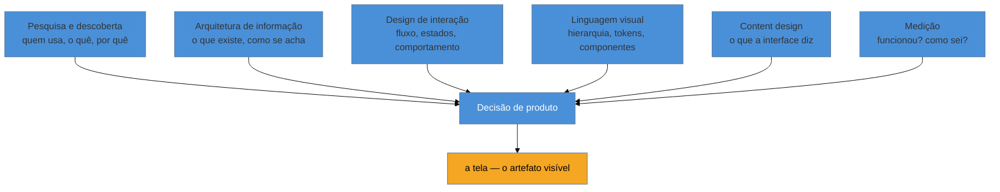

# UX não é tela: o ofício e seus limites

> [!abstract] TL;DR
> UX não é "desenhar a tela" — é a disciplina que decide **o que construir, para quem, e por quê**, e isso abrange pesquisa, arquitetura de informação, design de interação, linguagem visual, content design e medição. Um engenheiro *fractional full-cycle* — que assume o projeto sozinho, do requisito à produção — exerce **todas** essas disciplinas em algum grau, porque não existe trio de produto para dividir o trabalho. Este domínio não forma um especialista de UX; separa, nota a nota, o que dá pra fazer sozinho numa segunda-feira do que exige time, orçamento ou risco demais para uma pessoa decidir sozinha — e nomeia honestamente quando é hora de chamar alguém.

Imagine o cenário mais comum de quem trabalha como engenheiro fractional: um cliente pede um formulário de cadastro para um produto B2B interno. Você recebe o pedido, já com layout de referência anexado — "faz parecido com esse". Você constrói exatamente o que foi pedido: campos, validação, botão de salvar, toast de sucesso. Entrega na sexta. Três semanas depois, o cliente reclama que ninguém está usando o formulário — os times continuam mandando os dados por planilha, por e-mail, do jeito de sempre.

Você não errou nenhuma linha de código. O formulário funciona. E, ainda assim, falhou — porque o pedido "faz parecido com esse" já chegou depois da decisão que importava: *por que esse fluxo existe, quem realmente vai preenchê-lo, e o que ele estava fazendo antes*. Ninguém perguntou isso. A tela ficou boa; o problema continuou sem solução. Esse é o retrato exato do que este domínio existe para corrigir: tratar UX como "a parte visual" é confundir o produto final (a tela) com o processo que decide se ela deveria existir daquela forma.

## As seis disciplinas, não uma

A [Nielsen Norman Group](https://www.nngroup.com/articles/definition-user-experience/) — a mesma organização por trás das heurísticas que você vai ver na próxima nota — define UX como "todos os aspectos da interação do usuário final com a empresa, seus serviços e seus produtos". Repare no que essa definição *não* diz: não diz "a aparência da tela". Diz "todos os aspectos da interação" — e interação inclui o que a pessoa sentiu antes de abrir o app, o que ela conseguiu (ou não) fazer, e o que ela lembra depois.

Para operacionalizar essa definição, Peter Morville propôs em 2004 o que ficou conhecido como o **UX Honeycomb** (favo de UX): sete facetas que um produto precisa satisfazer — útil, usável, desejável, encontrável, acessível, crível e valioso. É um bom lembrete de quantas dimensões cabem debaixo do guarda-chuva "UX", mas para o propósito deste domínio é mais útil agrupar essas facetas em **seis disciplinas de trabalho**, porque são elas que definem o que você efetivamente *faz*:

1. **Pesquisa e descoberta** — entender o problema e o usuário antes de desenhar qualquer coisa. (Sub-galho 2.)
2. **Arquitetura de informação** — organizar o quê existe e como se navega entre as partes. (Sub-galho 3.)
3. **Design de interação** — desenhar o fluxo, os estados e o comportamento da interface. (Sub-galho 4.)
4. **Linguagem visual e design system** — a hierarquia, a tipografia, a cor, os componentes reutilizáveis. (Sub-galho 5.)
5. **Content design / UX writing** — o texto que a interface fala com quem usa. (Sub-galho 6.)
6. **Medição e validação** — saber se a decisão funcionou, com dado, não com opinião. (Sub-galho 7.)

O formulário do cenário acima só recebeu a disciplina 4 (e nem toda ela — só o visual, sem pensar no texto). As disciplinas 1, 2, 3, 5 e 6 nunca entraram na sala. Não é coincidência que o produto tenha "funcionado" tecnicamente e falhado no mundo real: cada disciplina pulada é uma pergunta que ninguém fez, e cada pergunta não feita é uma aposta não verificada.

A tela é o que fica visível no final — mas é a menor fração do trabalho, e a única que o cliente do cenário acima pediu para "fazer parecido com esse". Um bom engenheiro de UX não entrega uma tela bonita; entrega uma decisão bem informada que *se materializa* numa tela.

Traduzindo cada disciplina para uma pergunta que o engenheiro full-cycle faz sozinho, sem precisar de departamento:

- **Pesquisa e descoberta:** "quem vai usar isso, e o que essa pessoa faz hoje sem o meu produto?"
- **Arquitetura de informação:** "se eu apagasse o menu, essa pessoa ainda encontraria o que precisa?"
- **Design de interação:** "o que acontece na tela entre o clique e o resultado — e o que acontece se o resultado demorar ou falhar?"
- **Linguagem visual:** "o que o olho vê primeiro, e é a coisa certa?"
- **Content design:** "se eu ler só o texto da tela, sem nenhum elemento visual, ainda dá pra entender o que fazer?"
- **Medição:** "como eu vou saber, depois de publicado, se essa decisão foi boa?"

Nenhuma dessas perguntas exige um cargo de "UX Designer" para ser feita. Exige lembrar de fazê-la — e é exatamente esse lembrete que este domínio empacota, nota a nota, para as 48 notas seguintes.

> [!question]- Isso não é trabalho de designer? Por que um engenheiro precisaria fazer as seis?
> Numa empresa de produto com time formado, sim — cada disciplina tem dono: pesquisador, arquiteto de informação, product designer, content designer, analista de dados. O leitor deste domínio não está nesse contexto. Ele é o **fractional engineer full-cycle**: contratado para tocar um projeto inteiro sozinho, de ponta a ponta. Não existe "o designer" para chamar — existe você, decidindo com o tempo e a informação que tem. As seis disciplinas não desaparecem só porque não há gente para cada uma; elas passam a caber, em profundidade menor, na mesma pessoa.

## O trio de produto que você não tem

Marty Cagan, em *[INSPIRED](https://www.svpg.com/inspired-how-to-create-products-customers-love/)*, descreve o modelo de **trio de produto** que domina empresas de tecnologia maduras: um product manager (responsável por valor e viabilidade de negócio), um designer (responsável por usabilidade) e um engenheiro (responsável por viabilidade técnica) trabalham juntos, todos os dias, na descoberta contínua do que construir. Cada papel cobre uma fração da decisão; a decisão boa nasce do atrito produtivo entre os três.

O leitor deste domínio **é o trio inteiro**. Ele entrevista o cliente (papel do PM), decide a arquitetura da informação e o fluxo (papel do designer), e constrói e sustenta o sistema (papel do engenheiro) — sozinho, dentro do mesmo projeto, às vezes na mesma tarde. Isso não é um desvio de carreira estranho; é a condição estrutural do trabalho fractional/consultoria de escopo pequeno. Reconhecer isso é o que torna esse domínio necessário: as seis disciplinas da seção anterior não são "aprender design" por curiosidade — são o conteúdo mínimo que preenche os três papéis que, numa Big Tech, seriam três pessoas diferentes.

**A ideia em uma frase:** UX não é a tela porque é o processo — pesquisa, arquitetura, interação, linguagem visual, escrita e medição — que decide o que a tela deveria ser; e o engenheiro full-cycle exerce esse processo inteiro porque não tem quem divida com ele.

## O que dá pra fazer sozinho, e o que não dá

Essa é a promessa central deste domínio, e ela se repete em cada nota das 48 que seguem: nunca fingir que dá pra fazer tudo sozinho só porque você é o trio inteiro. Tem coisa que **exige** estrutura — orçamento, tempo, uma amostra estatisticamente válida, ou um risco alto demais para uma pessoa decidir sem revisão externa. Fingir que dá é o erro mais caro que um engenheiro solo pode cometer nessa área, porque o preço não aparece no código — aparece meses depois, em decisão errada tomada com confiança de sobra.

| Praticável sozinho, com o que você já tem | Exige time, orçamento ou estrutura |
|---|---|
| Entrevista de descoberta com 5-8 clientes/usuários | Estudo quantitativo com amostra estatisticamente representativa |
| Teste de usabilidade guerrilha com 5 usuários | *Mental model research* completo, no método de Indi Young |
| Proto-persona (hipótese, não pesquisa validada) | Persona qualitativa validada por pesquisa própria |
| *Assumption mapping* antes de construir | *Service blueprint* organizacional completo, cross-time |
| Analytics leve (funil, eventos-chave) | *Research ops* e repositório de pesquisa contínuo |
| Design tokens simples, mini style-guide de voz e tom | Governança formal de design system multi-produto |
| Instrumentação de eventos no próprio código | Documentação Storybook com regressão visual mantida |

A coluna da esquerda não é "UX de segunda categoria" — é UX real, dimensionada para uma pessoa e um prazo curto. A coluna da direita não desaparece do domínio: ela aparece nomeada, para que você reconheça o limite em vez de tentar recriar, sozinho e mal, o que uma equipe de pesquisa faria com meses e orçamento.

> [!warning] Confundir "praticável sozinho" com "opcional"
> **O que acontece:** o engenheiro pula a entrevista de descoberta ou o teste com 5 usuários porque "não dá tempo", e parte direto para a tela — exatamente o erro do cenário de abertura.
> **Por quê:** a coluna da esquerda da tabela acima tem custo baixo (horas, não semanas) e não exige ninguém além de você. Pular essas etapas não economiza tempo de verdade — só adia o custo de descobrir que construiu a coisa errada, e esse custo adiado é sempre maior.
> **Como evitar:** trate a entrevista de descoberta e o teste guerrilha como parte do "construir", não como luxo de quem tem tempo sobrando. Ver [[03-Dominios/Engenharia/UX/Descoberta e Pesquisa/index|SG2 — Descoberta e Pesquisa]].

## Cliente ≠ usuário, e a escala de um

Dois recortes atravessam o domínio inteiro e valem a pena fixar já na primeira nota, porque mudam a leitura de tudo que vem depois.

O primeiro: **cliente não é usuário**. Em consultoria e em B2B, quem paga e aprova o projeto quase nunca é quem vai usá-lo no dia a dia. No cenário de abertura, o cliente que pediu "faz parecido com esse" não era quem preenche o formulário — era um gestor aprovando um orçamento. Otimizar para a satisfação de quem assina o contrato produz exatamente o que aconteceu: um produto que agrada quem decidiu construí-lo e é ignorado por quem deveria usá-lo. Esse ponto volta com força no [[03-Dominios/Engenharia/UX/Descoberta e Pesquisa/index|SG2]].

O segundo: **escala de um**. Boa parte do cânone de UX — pesquisa quantitativa, design systems com times de governança, programas de research ops — pressupõe recursos que um engenheiro fractional não tem. A tabela da seção anterior é a tradução prática desse recorte: nunca finge que a coluna da direita cabe numa pessoa só.

## Quando chamar um especialista

Fazer as seis disciplinas sozinho não significa fazer todas elas em todos os contextos. Há sinais concretos de que o problema ultrapassou o que uma pessoa deveria decidir sem apoio externo:

- **O problema é de estratégia de produto, não de execução** — a pergunta não é "como desenho essa tela", é "devíamos construir isso". Isso é decisão de negócio, não de UX solo.
- **O público é vulnerável, ou o domínio é de alto risco** — saúde, jurídico, finanças reguladas, acessibilidade legalmente exigida. Aqui o custo de errar sozinho é desproporcional ao custo de trazer quem entende as regras do jogo. (A camada técnica de acessibilidade já tem domínio dedicado no vault — ver [[03-Dominios/Tecnologia/Acessibilidade/index|Tecnologia/Acessibilidade]] — mas a *decisão de quando o risco pede validação regulatória ou legal* pertence a esse ponto, não ao código.)
- **A decisão é irreversível e cara** — trocar de banco de dados é reversível com dor; trocar a arquitetura de informação de um produto com milhares de usuários ativos não é. Decisões irreversíveis pedem mais de uma cabeça.
- **O volume de pesquisa necessário ultrapassa o que uma pessoa sintetiza sem viés** — se você é ao mesmo tempo quem entrevista, quem interpreta e quem decide, o risco de enxergar só o que quer ver cresce com o volume. Um segundo par de olhos, mesmo que não seja "designer sênior", já reduz esse viés.

Nenhum desses sinais significa "pare de fazer UX sozinho". Significa: nomeie o limite em voz alta, para o cliente e para si mesmo, em vez de improvisar uma decisão que devia ter sido tomada por alguém com mais contexto ou mais gente.

> [!example] Como nomear o limite sem parecer que está fugindo do trabalho
> Um cenário hipotético: o cliente pede para você desenhar o fluxo de coleta de dados de saúde de um app de bem-estar — sintomas, histórico, medicação. Você sabe fazer a interface. O que você não deveria fazer sozinho é decidir, sem apoio jurídico e sem revisão de alguém com histórico em dados sensíveis, quais campos são obrigatórios, como o consentimento é obtido e como o dado é retido. A frase que resolve a conversa com o cliente não é "não sei fazer isso" — é: "eu desenho a interface e o fluxo; a política de retenção e consentimento desses dados precisa de uma revisão jurídica antes de eu implementar, porque o risco de errar aqui não é de UX, é de compliance." Nomear o limite é isso: continuar dono do que é seu, e apontar com precisão o que não é.

## UX em conversa de entrevista sênior

Vale registrar, já nesta nota de abertura, por que esse recorte importa além do dia a dia do projeto: em entrevistas para vagas sênior/staff, a pergunta "me conta sobre uma vez que você tomou uma decisão de produto sozinho" é comum (ver [[03-Dominios/Carreira/Entrevistas/STAR Method|STAR Method]] para a estrutura de resposta), e a resposta que soa júnior é "eu desenhei a tela que o cliente pediu". A resposta que soa sênior nomeia a disciplina que faltava e o motivo de tê-la adicionado — "o cliente pediu X, mas antes de construir eu validei com 5 usuários e descobri Y, então ajustei para Z". Esse é também o motivo de este sub-galho não ser "teoria de design" descolada da prática: o vocabulário das seis disciplinas é o material bruto de boas histórias de entrevista, e volta a aparecer no [[03-Dominios/Engenharia/UX/Ética e Ofício/index|SG8]].

## A fronteira com acessibilidade

Um domínio vizinho já existe no vault e vale linkar explicitamente, porque a confusão entre os dois é comum: [[03-Dominios/Tecnologia/Acessibilidade/index|Tecnologia/Acessibilidade]] cobre a camada técnica — *accessibility tree*, WCAG 2.2, ARIA, gestão de foco, contraste — com 21 notas dedicadas. Este domínio de UX não reexplica nada disso. A distinção prática: **"o botão tem contraste suficiente" é acessibilidade; "por que existe um botão aqui e não um link, e por que ele domina a tela" é design de interação.** A11y garante que a decisão de UX seja operável por qualquer pessoa; UX decide qual é a decisão. São capítulos diferentes do mesmo livro — comece pela [[03-Dominios/Tecnologia/Acessibilidade/Fundamentos e Modelo Mental/01 - A11y é ofício, não checklist|nota de abertura de a11y]] se ainda não a leu; ela usa exatamente o mesmo argumento ("ofício, não checklist") que este domínio usa para UX.

## Casos práticos

### Cenário 1: o dashboard interno que ninguém abre
Uma consultoria entrega um dashboard de métricas para um cliente B2B. O cliente (um diretor) aprovou o design em duas reuniões e elogiou o resultado. Três meses depois, os logs de acesso mostram uso quase zero pelos analistas que deveriam usá-lo todo dia. Uma entrevista rápida — 30 minutos, sem orçamento de pesquisa formal — revela o motivo: os analistas já tinham uma planilha compartilhada com os mesmos números, atualizada por um script que eles confiavam, e o dashboard novo não substituía nenhuma dor real deles, só a do diretor ("quero ver isso num painel bonito"). O erro não foi de execução — a tela renderiza bem, os gráficos são corretos. O erro foi pular a disciplina de pesquisa e tratar a satisfação do cliente (papel do PM) como se fosse a mesma coisa que a necessidade do usuário (papel do designer investigando uso real).

### Cenário 2: o formulário de onboarding com 14 campos
Um engenheiro fractional constrói o onboarding de um SaaS B2B sozinho, seguindo o wireframe que o cliente desenhou no Figma. O wireframe tem 14 campos numa única tela porque "é mais rápido preencher tudo de uma vez". Sem pesquisa e sem teste, o formulário vai para produção. A taxa de conclusão fica em 40%. Um teste de usabilidade guerrilha com 5 pessoas — de graça, feito numa tarde — mostra o problema em minutos: ninguém lê a tela inteira antes de desistir; as pessoas presumem, ao ver 14 campos, que o processo vai ser longo e adiam. A correção não exigiu pesquisa cara: dividir em 3 passos com barra de progresso, usando a mesma lógica de *progressive disclosure* que aparece em [[03-Dominios/Engenharia/UX/Design de Interação/index|SG4]], elevou a conclusão para 74%. O ponto do cenário: o teste com 5 usuários está na coluna "praticável sozinho" da tabela acima — e foi ele, não uma equipe de pesquisa, que evitou o erro.

### Cenário 3: a persona "criada em 20 minutos" que virou verdade absoluta
Um engenheiro solo, sob pressão de prazo, cria uma proto-persona baseada em suposições próprias — sem falar com nenhum usuário real — e a chama de "a persona validada" numa reunião com o cliente. A decisão de arquitetura de informação do produto inteiro é tomada em cima dela. Dois meses depois, uma entrevista de descoberta atrasada (feita só porque um usuário reclamou publicamente) revela que a suposição central estava errada: o público real não era o profissional técnico que a persona descrevia, e sim um usuário administrativo sem vocabulário técnico algum. Refazer a arquitetura de informação depois de construída custou semanas; teria custado horas se a etiqueta "proto-persona, não validada" tivesse sido honesta desde o início, disparando o teste guerrilha da tabela "praticável sozinho" antes — não depois — da decisão estrutural.

## Armadilhas comuns

> [!warning] Tratar "UX" como sinônimo de "UI"
> **O que acontece:** o time (ou o cliente) usa "fazer o UX" para dizer "deixar bonito", e a conversa inteira sobre o produto vira uma conversa sobre cor e layout.
> **Por quê:** a tela é a parte visível do trabalho, então é a que todo mundo enxerga e nomeia primeiro. As outras cinco disciplinas — pesquisa, arquitetura de informação, interação, content design, medição — ficam invisíveis mesmo quando fazem toda a diferença no resultado.
> **Como evitar:** ao ouvir "cuida do UX disso", pergunte de volta "já sabemos quem vai usar e por quê?" antes de abrir o Figma. Isso reposiciona a conversa da tela para a decisão que a antecede.

> [!warning] Otimizar para quem aprova, não para quem usa
> **O que acontece:** o produto agrada nas reuniões de aprovação e falha na adoção real, como no Cenário 1 acima.
> **Por quê:** em B2B/consultoria, quem decide o orçamento raramente é quem opera o sistema todo dia. Feedback do cliente durante o projeto é fácil de coletar e tentador de tratar como "a voz do usuário" — mas é a voz de quem paga, não de quem usa.
> **Como evitar:** trate aprovação do cliente e validação com usuário real como dois checkpoints diferentes, nunca um substituindo o outro. Ver [[03-Dominios/Engenharia/UX/Descoberta e Pesquisa/index|SG2]].

> [!warning] Fingir que a coluna da direita cabe numa pessoa só
> **O que acontece:** o engenheiro tenta reproduzir sozinho, em uma tarde, o que normalmente exige um time de pesquisa com semanas — por exemplo, "validar" uma persona com três conversas informais e tratá-la como pesquisa qualitativa rigorosa.
> **Por quê:** o resultado *parece* pesquisa (tem entrevistado, tem anotação, tem conclusão), mas carrega o viés de amostra pequena e de quem já tinha uma hipótese favorita antes de começar. A falsa confiança é pior do que reconhecer a lacuna.
> **Como evitar:** nomeie o método pelo que ele realmente é — "proto-persona baseada em 3 conversas", não "persona validada" — e reserve a validação formal para quando o risco da decisão justificar buscar apoio externo. Ver a seção "Quando chamar um especialista" acima.

## Como explicar em inglês

> "UX isn't 'the screen' — it's the discipline that decides what to build, for whom, and why, before a single pixel gets drawn. A fractional full-cycle engineer effectively **is the whole product trio**: no separate PM, designer, and engineer to divide the work with. This domain isn't about becoming a UX specialist — it's about being explicit on what's practicable solo versus what genuinely requires a team, a budget, or a bigger sample size, and knowing **when to bring in a specialist** instead of faking depth you don't have."

| PT | EN |
|----|----|
| ofício, não checklist | craft, not a checklist |
| trio de produto | product trio |
| engenheiro *fractional* full-cycle | fractional full-cycle engineer |
| pesquisa e descoberta | research and discovery |
| arquitetura de informação | information architecture |
| design de interação | interaction design |
| content design / UX writing | content design / UX writing |
| cliente ≠ usuário | client ≠ user |
| escala de um | team-of-one scale |
| chamar um especialista | bring in a specialist |

## O que vem a seguir

As seis disciplinas desta nota ficam abstratas sem vocabulário concreto para operá-las. As próximas quatro notas deste sub-galho entregam esse vocabulário — o modelo mental que sustenta toda decisão de design de interação e linguagem visual dos sub-galhos seguintes. Comece pelo par que explica por que uma interface "se explica sozinha" ou não: a diferença entre o que um elemento *permite* fazer e o que ele *comunica* que permite.

- [[03-Dominios/Engenharia/UX/Fundamentos e Modelo Mental/02 - Affordances e signifiers|02 — Affordances e signifiers]] — por que "parece clicável" é uma decisão de design, não um acidente.
- [[03-Dominios/Engenharia/UX/Fundamentos e Modelo Mental/03 - As 10 heurísticas de Nielsen|03 — As 10 heurísticas de Nielsen]] — o vocabulário compartilhado com qualquer designer que você vai trabalhar.
- [[03-Dominios/Engenharia/UX/Fundamentos e Modelo Mental/04 - Leis de UX - Fitts, Hick, Jakob, Miller, Peak-End|04 — Leis de UX]] — os princípios de psicologia cognitiva por trás de decisões de layout e fluxo.
- [[03-Dominios/Engenharia/UX/Fundamentos e Modelo Mental/05 - Gestalt aplicada a UI|05 — Gestalt aplicada a UI]] — por que espaçamento é semântica, não estética.

## Fontes

- **Nielsen Norman Group** — [*The Definition of User Experience (UX)*](https://www.nngroup.com/articles/definition-user-experience/) — a definição canônica de UX como "todos os aspectos da interação do usuário final", base da distinção entre UX e UI usada nesta nota.
- **Peter Morville** — *UX Honeycomb* (2004) — framework das sete facetas (útil, usável, desejável, encontrável, acessível, crível, valioso) que fundamenta o agrupamento em seis disciplinas.
- **Marty Cagan** — *[INSPIRED: How to Create Tech Products Customers Love](https://www.svpg.com/inspired-how-to-create-products-customers-love/)* — origem do modelo de trio de produto (PM, designer, engenheiro) usado para explicar por que o engenheiro fractional acumula os três papéis.
- **Indi Young** — método de *mental model research* — citado como exemplo do que fica na coluna "exige time/orçamento" por exigir síntese qualitativa em profundidade, não praticável em escala de um.
