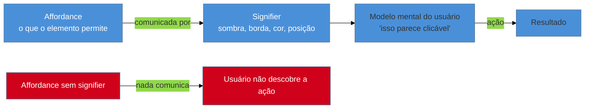

# Affordances e signifiers

> [!abstract] TL;DR
> **Affordance** é a ação que um objeto realmente *permite* — um botão permite clique, um campo de texto permite digitação. **Signifier** é o *sinal* que comunica onde e como agir — a sombra que faz o botão parecer elevado, a borda que delimita o campo. Confundir os dois é o erro mais comum de quem projeta interface: um elemento pode ter a affordance certa (é clicável de verdade) e ainda falhar se não tiver signifier nenhum (nada indica que ele é clicável). Regra prática: se o usuário precisa de um tooltip para saber que algo é clicável, o signifier falhou — e a correção é redesenhar o elemento, não adicionar legenda.

Imagine abrir um app novo e ver, no canto da tela, um retângulo cinza-claro com o texto "Configurações" dentro, sem borda, sem sombra, do mesmo tom de cinza do fundo. Você passa o mouse por cima três vezes antes de perceber, pelo cursor virando uma mãozinha, que aquilo é clicável. Tecnicamente, o elemento *é* um botão — tem um `onClick`, dispara a navegação certa, funciona perfeitamente do ponto de vista do código. E, ainda assim, quase ninguém clica nele, porque nada na aparência dizia "isto pode ser clicado". O elemento tinha a capacidade de ser usado; não tinha o sinal que comunicava essa capacidade. Esse descompasso — entre o que um objeto permite e o que ele *parece* permitir — é o assunto desta nota, e é também o vocabulário mais citado de todo o design de interação.

## Don Norman e a origem do vocabulário

O termo **affordance** entra no design com Don Norman, no livro *[The Design of Everyday Things](https://en.wikipedia.org/wiki/The_Design_of_Everyday_Things)* (1988; edição revista em 2013). Norman emprestou o conceito da psicologia perceptual (originalmente de James J. Gibson, que usava "affordance" para descrever o que um ambiente oferece a um animal — uma superfície plana "afforda" sentar) e o aplicou a objetos do cotidiano: uma cadeira *permite* sentar, uma porta *permite* empurrar ou puxar, um botão *permite* pressionar.

O problema apareceu depois. Ao longo dos anos 1990 e 2000, a comunidade de design passou a usar "affordance" de um jeito frouxo — dizendo "essa sombra dá uma affordance de profundidade" ou "esse ícone tem boa affordance visual" — misturando a capacidade física real do objeto com o sinal visual que comunica essa capacidade. Norman notou o erro se espalhando em conferências e artigos, e resolveu corrigi-lo de forma explícita: na **edição revista de 2013** de *The Design of Everyday Things*, ele cunhou um termo novo, **signifier**, especificamente para separar as duas ideias que estavam sendo tratadas como uma só.

> [!question]- Por que não bastava usar "affordance" com mais cuidado?
> Porque a confusão já estava embutida na palavra. "Affordance" descreve uma *relação* entre o objeto e quem o usa — a affordance de "sentar" existe numa cadeira mesmo que ninguém tenha jamais visto aquela cadeira, porque a relação física (superfície plana, altura, resistência) é real independentemente de comunicação. Um **signifier**, ao contrário, só existe para *comunicar*. Sem um termo separado, era impossível dizer "esse elemento tem a affordance certa mas o signifier errado" — que é exatamente o diagnóstico mais útil quando uma interface falha.

> [!tip] Vídeo — Norman Doors, com o próprio Don Norman
> [**Video: The Norman Door, with Vox**](https://www.youtube.com/watch?v=ABYSYQmEq1Q) (Vox × 99% Invisible, 5min32) mostra o próprio Don Norman explicando, ao vivo diante de portas reais que confundem todo mundo, por que um design precisa de placa "empurre/puxe" quando falha em sinalizar sozinho — o caso concreto que dá nome ao termo *Norman door*. Ele nomeia os dois princípios centrais desta nota em linguagem simples: *discoverability* ("olhando para o objeto, dá pra saber o que fazer com ele?") e *feedback* — a base do vocabulário affordance/signifier.
>
> 🎬 [Assistir no YouTube](https://www.youtube.com/watch?v=ABYSYQmEq1Q)

## As duas perguntas que toda interface responde (ou não)

Separar os dois conceitos dá ao designer — e ao engenheiro que faz esse papel sozinho — duas perguntas distintas para fazer sobre qualquer elemento de interface:

1. **Affordance:** o que este elemento *de fato permite* fazer? (Um `
` com `onClick` tecnicamente permite clique — a affordance existe no código, ainda que escondida.)
2. **Signifier:** o que *comunica* que essa ação é possível, e como fazê-la? (Cor, contraste, sombra, borda, posição, forma do cursor, label.)

O elemento do cenário de abertura tinha affordance (era clicável de verdade) e não tinha signifier (nada sinalizava isso). O erro oposto também existe e é igualmente comum: um elemento com signifier forte de "botão" — sombra, cor de destaque, cantos arredondados — que na verdade não faz nada quando clicado, porque o `onClick` nunca foi implementado ou foi removido num refactor. Os dois erros custam confiança do usuário; o segundo é pior, porque ensina a pessoa a desconfiar de todos os outros signifiers do produto.

## O modelo mental do usuário nasce dos signifiers

Aqui está o mecanismo que conecta este vocabulário ao resto do domínio: o usuário nunca vê o código. Ele constrói, na cabeça, uma **representação interna de como o sistema funciona** — um modelo mental — inteiramente a partir dos signifiers que consegue observar. Se os signifiers comunicam corretamente as affordances reais, o modelo mental do usuário fica alinhado com o **modelo conceitual** que quem construiu o sistema tinha em mente. Se não comunicam, o gap entre os dois modelos produz erro de uso.

Esse é o ponto mais importante da nota inteira, porque muda o vocabulário de quem debuga um problema de interface: quando um usuário "erra" ao usar o produto — clica onde não devia, não encontra o botão certo, ignora uma ação disponível — a causa quase nunca é falta de inteligência ou atenção do usuário. É um gap entre o modelo mental que os signifiers construíram na cabeça dele e o comportamento real do sistema. Tratar isso como "erro do usuário" é abdicar do diagnóstico certo; tratar como "gap de signifier" aponta direto para a correção.

> [!warning] Culpar o usuário por um erro de signifier
> **O que acontece:** um relatório de suporte chega dizendo "o usuário não encontrou o botão de salvar" ou "o usuário clicou no lugar errado", e a resposta do time é um FAQ novo ou um tooltip explicando onde está o botão.
> **Por quê:** o comportamento do usuário é sintoma; a causa é que o signifier do botão de salvar não comunicou affordance suficiente para ser notado ou reconhecido a tempo. Adicionar explicação resolve o sintoma para quem já teve o problema e leu o FAQ — não resolve para o próximo usuário, que também não vai ler.
> **Como evitar:** trate "usuário não encontrou X" como um bug de signifier, não de atenção. A correção é no design do elemento (tamanho, contraste, posição, rótulo), não em documentação adicional.

## A regra prática: se precisa de tooltip, o signifier falhou

Esta é a régua mais acionável da nota, e vale grudar na cabeça: **se um usuário precisa de um tooltip para saber que algo é clicável, o signifier do elemento falhou.** Um tooltip que existe só para dizer "clique aqui" não é uma correção — é um curativo em cima do problema real, que é o elemento não parecer clicável por conta própria. A correção certa é redesenhar o elemento (cor, forma, sombra, cursor, posição) até que a affordance seja óbvia sem explicação — não empilhar uma legenda por cima de um sinal fraco.

Isso não significa que tooltip nunca tem lugar — tooltips são úteis para informação *adicional* ("esse ícone significa X" quando X é uma nuance, não a ação básica) ou para atalhos de teclado avançados. O teste é: remova o tooltip mentalmente. Se a ação básica do elemento deixa de ser descobrível, o problema é do elemento, não da ausência do tooltip.

**Affordances e signifiers em uma frase:** a affordance é o que o elemento de fato permite fazer; o signifier é o sinal que avisa isso a quem olha — e quando um erro de uso acontece, a pergunta certa não é "por que o usuário não viu", é "o que o meu signifier deixou de comunicar".

## Signifiers explícitos vs. signifiers de convenção

Nem todo signifier precisa ser inventado do zero a cada tela. Norman distingue, na prática, dois tipos:

- **Signifiers explícitos** — sinais desenhados de propósito para aquele elemento específico: a sombra de um botão, o sublinhado de um link, a seta de um dropdown.
- **Signifiers de convenção** — sinais que o usuário já aprendeu em outros produtos e transporta para o seu: um ícone de lupa significa busca; um X no canto fecha um modal; um ícone de engrenagem significa configurações.

Signifiers de convenção são, em geral, mais fortes e mais baratos do que signifiers explícitos inventados — porque o usuário não precisa aprender nada novo, só reconhecer um padrão que já viu. Esse é o mesmo raciocínio por trás da **Lei de Jakob** (ver [[03-Dominios/Engenharia/UX/Fundamentos e Modelo Mental/04 - Leis de UX - Fitts, Hick, Jakob, Miller, Peak-End|nota 04]]): antes de desenhar um signifier novo, vale perguntar se já existe uma convenção estabelecida que resolve o mesmo problema sem exigir aprendizado.

> [!question]- E quando o produto precisa de uma ação sem convenção nenhuma — algo genuinamente novo?
> Aí o signifier explícito é inevitável, e o teste muda: em vez de reconhecimento ("já vi isso antes"), você está pedindo descoberta ("o que isso pode ser?"). Descoberta é mais cara cognitivamente — o usuário precisa formar uma hipótese e testá-la. Nesses casos, vale investir mais em pistas redundantes (forma + cor + posição + microcopy junto) em vez de confiar num único sinal fraco.

## O que dá pra fazer sozinho

Aplicar esse vocabulário no dia a dia não exige pesquisa formal nem ferramenta especial — é uma disciplina de revisão que cabe em qualquer code review ou passada final antes de publicar:

- **Auditoria de signifier por elemento interativo:** para cada botão, link e campo, pergunte "sem ler nenhum texto, dá pra saber que isso é interativo?". Um teste rápido: desfoque a tela (ou entrecerre os olhos) e veja se os elementos clicáveis ainda se destacam pela forma/cor.
- **Consistência de signifier dentro do mesmo produto:** se um estilo de botão significa "ação primária" numa tela, o mesmo estilo não pode significar "link secundário" em outra — isso quebra o modelo mental que o usuário construiu na primeira tela.
- **Teste com 5 usuários** (ver [[03-Dominios/Engenharia/UX/Fundamentos e Modelo Mental/01 - UX não é tela - o ofício e seus limites|nota 01]]): peça para alguém "encontrar" uma ação sem dizer onde ela está. Se a pessoa hesita ou erra, o signifier é o suspeito número um.

O que exige mais estrutura é pesquisa formal de percepção visual — eye-tracking, teste A/B de contraste em escala — que fica fora do alcance de uma pessoa só e raramente é necessário: a maioria dos problemas de signifier é visível a olho nu, sem instrumentação nenhuma.

## Casos práticos

### Cenário 1: o card "clicável" que ninguém clica
Um dashboard interno mostra métricas em cards. Um dos cards, na verdade, é clicável — leva para uma página de detalhe — mas visualmente é idêntico aos outros cards que são apenas informativos: mesma cor de fundo, mesma borda, nenhuma sombra, cursor padrão (sem `cursor: pointer`). A taxa de clique nesse card é praticamente zero, embora a funcionalidade exista e funcione perfeitamente quando alguém a descobre por acidente. O diagnóstico correto não é "os usuários não sabem que dá pra clicar" tratado como falha deles — é que o card não tem nenhum signifier que o distinga dos vizinhos não-clicáveis. A correção (sombra sutil no hover, cursor de mão, um ícone de seta) não muda a affordance — ela já existia — muda só o signifier, e a taxa de clique sobe sem nenhuma mudança de lógica.

### Cenário 2: o botão desabilitado que parece quebrado
Um formulário de checkout tem um botão "Finalizar compra" que fica desabilitado até todos os campos obrigatórios serem preenchidos. O botão desabilitado usa a mesma cor do botão habilitado, só um pouco mais claro — uma diferença sutil demais para ser notada rapidamente. Usuários clicam repetidamente no botão "quebrado" e abandonam o checkout achando que há um bug. Aqui o signifier de "desabilitado" é fraco demais para comunicar o estado real (a affordance de clique de fato não existe enquanto desabilitado) — o usuário lê "botão normal" onde deveria ler "ainda não disponível". A correção evidencia o estado: opacidade visivelmente reduzida, cursor `not-allowed`, e — melhor ainda — uma mensagem indicando quais campos faltam, ligando o signifier do estado à causa dele.

### Cenário 3: o menu "hamburguer" reaproveitado errado
Um app decide usar o ícone de três linhas horizontais (o "hamburguer", um signifier de convenção universal para "menu de navegação") para abrir, na verdade, um painel de *filtros* de busca — uma função completamente diferente do que o ícone normalmente sinaliza. Usuários clicam esperando encontrar navegação do produto (Home, Perfil, Configurações) e ficam confusos ao ver campos de filtro. A affordance existe (o painel abre e funciona), mas o signifier escolhido carrega um significado de convenção **incompatível** com a ação real — o pior dos dois mundos, porque o usuário chega com uma expectativa forte e errada, em vez de nenhuma expectativa. A correção troca o ícone por um de funil (convenção já estabelecida para filtro), realinhando signifier e affordance.

## Armadilhas comuns

> [!warning] Usar "affordance" e "signifier" como sinônimos
> **O que acontece:** numa revisão de design, alguém diz "essa sombra dá uma boa affordance" — misturando os dois termos exatamente como a comunidade de design fazia antes de 2013.
> **Por quê:** affordance é a capacidade real (o que o elemento permite); signifier é o sinal que comunica essa capacidade. Uma sombra nunca é uma affordance — ela é, na melhor das hipóteses, um signifier de elevação/interatividade.
> **Como evitar:** ao descrever um elemento, separe as duas perguntas: "o que ele permite fazer?" (affordance) e "o que comunica isso?" (signifier). Fica mais fácil diagnosticar qual das duas está falhando.

> [!warning] Adicionar tooltip em vez de redesenhar o elemento
> **O que acontece:** um elemento pouco óbvio recebe um tooltip explicativo ("clique aqui para editar") em vez de ser redesenhado para parecer editável por conta própria.
> **Por quê:** o tooltip resolve o problema só para quem já pairou o mouse sobre o elemento tempo suficiente para vê-lo — a maioria dos usuários nunca chega lá, e em touch o tooltip nem existe.
> **Como evitar:** aplique a regra prática desta nota — se precisa de tooltip para a ação básica, o signifier falhou. Redesenhe antes de documentar.

> [!warning] Signifier forte demais para uma affordance fraca
> **O que acontece:** um elemento parece um botão de ação primária (cor de destaque, sombra, canto arredondado) mas dispara uma ação secundária ou trivial, ou pior, não dispara ação alguma por um bug.
> **Por quê:** o usuário confia no signifier antes de confirmar a affordance real; um signifier "gritando" importância engana a expectativa e corrói a confiança em todos os outros signifiers do produto quando descoberto.
> **Como evitar:** reserve o vocabulário visual de maior destaque (cor de marca, sombra, tamanho) para as ações que realmente merecem esse destaque — signifier proporcional à affordance.

## Como explicar em inglês

> "An **affordance** is what an object actually lets you do — a button affords clicking. A **signifier** is the signal that communicates where and how to act — a shadow, a border, a cursor change. Don Norman coined 'signifier' in the 2013 edition of *The Design of Everyday Things* specifically because the design community kept conflating the two. The practical rule: if a user needs a tooltip to know something is clickable, the signifier failed — fix the element, not the documentation."

| PT | EN |
|----|----|
| affordance | affordance |
| signifier | signifier |
| modelo mental | mental model |
| modelo conceitual | conceptual model |
| elemento clicável | clickable element |
| gap de percepção | perception gap |
| estado desabilitado | disabled state |

## O que vem a seguir

Affordances e signifiers explicam como um elemento *individual* comunica sua função. A próxima nota dá o vocabulário compartilhado para avaliar a interface *inteira* — o checklist mais usado em UX, e o mesmo que designers citam em qualquer revisão de produto.

- [[03-Dominios/Engenharia/UX/Fundamentos e Modelo Mental/03 - As 10 heurísticas de Nielsen|03 — As 10 heurísticas de Nielsen]] — a segunda delas, "correspondência entre sistema e mundo real", é affordance e signifier aplicados em escala de produto inteiro.
- [[03-Dominios/Engenharia/UX/Fundamentos e Modelo Mental/04 - Leis de UX - Fitts, Hick, Jakob, Miller, Peak-End|04 — Leis de UX]] — a Lei de Jakob explica por que reaproveitar signifiers já conhecidos (o padrão visual que todo produto usa) é quase sempre a escolha certa.

## Fontes

- **Don Norman** — *[The Design of Everyday Things](https://en.wikipedia.org/wiki/The_Design_of_Everyday_Things)*, 1988; edição revista 2013 — origem de "affordance" aplicado a design e cunhagem de "signifier" na edição de 2013, especificamente para corrigir o uso frouxo de "affordance" que a comunidade de design vinha adotando.
