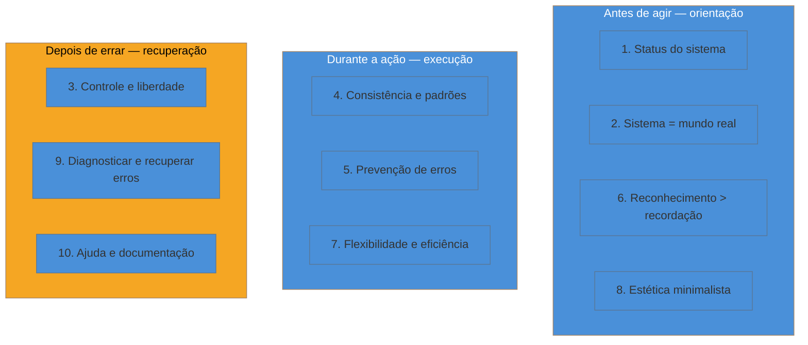

# As 10 heurísticas de Nielsen

> [!abstract] TL;DR
> As **10 heurísticas de usabilidade**, formuladas por Jakob Nielsen com Rolf Molich em 1990 e refinadas por Nielsen em 1994, são o checklist mais usado em UX até hoje — cobrem desde "o sistema mostra o que está fazendo" até "existe ajuda quando o usuário precisa". A Nielsen Norman Group revisou a *linguagem* delas em 2020, mas **o conteúdo é o mesmo desde 1994**. Valem menos como checklist mecânico e mais como **vocabulário compartilhado**: citar "isso viola reconhecimento em vez de recordação" numa reunião de produto sinaliza fluência em UX sem exigir formação de designer — e dá nome preciso a um problema que, sem o vocabulário, ficaria só um "essa tela tá estranha" vago.

Imagine revisar o design de uma tela nova com um designer do time (ou, no caso do engenheiro fractional, revisar sozinho antes de mandar para o cliente). Sem vocabulário compartilhado, o feedback sai genérico: "acho que essa tela tá confusa" ou "não sei, parece que falta alguma coisa". É verdadeiro, mas inútil — ninguém sabe o que consertar. Agora troque para: "essa tela viola *reconhecimento em vez de recordação* — o usuário precisa lembrar o código do produto de uma tela anterior porque aqui ele não aparece de novo". A mesma observação, com nome preciso, vira instrução acionável. As 10 heurísticas de Nielsen existem exatamente para isso: dar nome a padrões de falha que se repetem em praticamente qualquer interface, para que a crítica pare de ser vaga.

## De onde vêm, e por que não mudaram

Jakob Nielsen, com Rolf Molich, publicou as heurísticas originais em 1990, num estudo sobre como especialistas de usabilidade avaliavam interfaces. Nielsen refinou a lista sozinho em 1994, chegando na formulação que se tornou padrão. Décadas depois, em 2020, a [Nielsen Norman Group revisou a redação](https://www.nngroup.com/articles/ten-usability-heuristics/) — deixou a linguagem mais clara e moderna — mas **o conteúdo das dez heurísticas segue inalterado desde 1994**. Isso não é estagnação: é sinal de que os padrões de erro que elas descrevem são estruturais à interação humano-computador, não específicos de uma década de tecnologia. As mesmas dez heurísticas que avaliavam software de desktop em 1994 avaliam apps mobile e agentes conversacionais hoje, porque descrevem como a cognição humana lida com sistemas — não como uma tela específica deve se parecer.

## As dez, agrupadas por quando entram no fluxo

Antes do detalhe de cada uma, vale ver como as dez se agrupam por *quando* na jornada do usuário elas mais pesam — isso ajuda a lembrar qual heurística invocar diante de um problema concreto, em vez de recitar a lista inteira toda vez:

O grupo "depois de errar" (âmbar no diagrama) é o que mais custa confiança quando ausente — é também o que menos recebe atenção de design, porque exige imaginar o caminho infeliz antes que ele aconteça de verdade.

## As dez, com violação e correção

Cada heurística abaixo vem com um exemplo de violação — o tipo de falha que ela existe para nomear — e a correção correspondente, porque uma heurística sem exemplo concreto vira decoreba sem uso prático.

### 1. Visibilidade do status do sistema
O sistema deve manter o usuário informado sobre o que está acontecendo, com feedback em tempo razoável. **Violação:** um botão de "Enviar" que, ao ser clicado, não muda de aparência nem mostra spinner — o usuário clica de novo, e de novo, gerando envios duplicados. **Correção:** desabilitar o botão e mostrar um indicador de carregamento assim que o clique é registrado.

### 2. Correspondência entre sistema e mundo real
A interface deve falar a língua do usuário — palavras, frases e conceitos familiares — em vez do jargão interno do sistema. **Violação:** uma mensagem de erro que diz "Exception: NullPointerException at line 402" para um usuário final. **Correção:** "Não conseguimos salvar seu pedido — tente novamente em alguns minutos", com o detalhe técnico logado, não exibido.

### 3. Controle e liberdade do usuário
O usuário comete erros e precisa de uma "saída de emergência" clara — desfazer, cancelar, voltar — sem precisar passar por um diálogo estendido. **Violação:** um fluxo de exclusão de conta sem confirmação nem desfazer, onde um clique acidental é irreversível. **Correção:** confirmação explícita para ações destrutivas, e undo disponível por um período curto após ações reversíveis.

### 4. Consistência e padrões
O usuário não deveria precisar adivinhar se palavras, situações ou ações diferentes significam a mesma coisa — siga as convenções da plataforma. **Violação:** um app usa "Excluir" numa tela e "Remover" noutra para a mesma ação exata, ou usa cor vermelha ora para erro, ora para uma ação neutra de destaque. **Correção:** um vocabulário e uma paleta semântica únicos no produto inteiro — é literalmente o papel de um design system (ver [[03-Dominios/Engenharia/UX/Linguagem Visual e Design System/index|SG5]]).

### 5. Prevenção de erros
Melhor que uma boa mensagem de erro é um design que impede o erro de acontecer. **Violação:** um campo de data em texto livre que aceita qualquer formato e só valida no envio, depois de o usuário preencher o formulário inteiro. **Correção:** um seletor de data estruturado, ou validação em tempo real que impede formato inválido antes de chegar ao envio.

### 6. Reconhecimento em vez de recordação
Minimize a carga de memória do usuário — deixe opções, ações e informação visíveis, em vez de exigir que ele lembre de uma tela anterior. **Violação:** um checkout que mostra o total a pagar só na tela de confirmação de pagamento, obrigando o usuário a lembrar (ou voltar) para conferir o que estava no carrinho. **Correção:** manter o resumo do pedido visível durante todo o fluxo de checkout.

### 7. Flexibilidade e eficiência de uso
Aceleradores — invisíveis para o novato, úteis para o expert — permitem que usuários experientes sejam mais rápidos sem punir quem está começando. **Violação:** um sistema que só oferece navegação por clique, sem atalho de teclado nenhum, obrigando um usuário avançado que preenche o mesmo formulário 50 vezes por dia a usar o mouse toda vez. **Correção:** atalhos de teclado documentados e opcionais, sem exigir que o novato os aprenda para usar o produto.

### 8. Design estético e minimalista
Diálogos não devem conter informação irrelevante ou raramente necessária — cada unidade extra de informação compete por atenção com a informação relevante. **Violação:** um formulário com 20 campos visíveis simultaneamente, a maioria opcional e raramente preenchida, competindo visualmente com os 3 campos que realmente importam. **Correção:** mostrar só o essencial por padrão, com os campos opcionais atrás de "mostrar mais" — o mesmo princípio de *progressive disclosure* que volta em [[03-Dominios/Engenharia/UX/Design de Interação/index|SG4]].

### 9. Ajudar o usuário a reconhecer, diagnosticar e recuperar de erros
Mensagens de erro devem ser expressas em linguagem simples (sem código), indicar precisamente o problema, e sugerir uma solução construtiva. **Violação:** "Erro 403" sem mais contexto quando o usuário tenta uma ação sem permissão. **Correção:** "Você não tem permissão para editar este item — peça acesso ao administrador do projeto", nomeando o problema e o próximo passo.

### 10. Ajuda e documentação
Idealmente o sistema não precisa de documentação, mas quando precisa, ela deve ser fácil de buscar, focada na tarefa do usuário, com passos concretos, e não excessivamente longa. **Violação:** um link "Ajuda" que leva para um PDF de 80 páginas sem busca nem índice, para uma dúvida pontual sobre um campo específico. **Correção:** ajuda contextual — um texto curto ao lado do próprio campo confuso, com link para mais detalhes só se necessário.

## O valor real: vocabulário, não checklist mecânico

Vale ser honesto sobre o limite das heurísticas: rodar as dez contra uma tela, uma a uma, marcando "passa/não passa", produz uma lista de observações desconectadas — não substitui pesquisa com usuário real nem entender o problema de negócio por trás da tela (ver [[03-Dominios/Engenharia/UX/Fundamentos e Modelo Mental/01 - UX não é tela - o ofício e seus limites|nota 01]]). O valor prático maior é outro: **é vocabulário compartilhado com qualquer designer** que você vai trabalhar. Numa reunião com um cliente, ou numa revisão de PR de UI, nomear a heurística específica que uma decisão viola transforma "acho estranho" em crítica precisa e endereçável — e sinaliza, para quem está do outro lado da mesa, que você entende o ofício mesmo sem ser especialista de UX.

> [!question]- Dez heurísticas dão conta de tudo que pode dar errado numa interface?
> Não — e não deveriam. Elas cobrem os padrões de falha mais **frequentes e estruturais**, mas problemas de arquitetura de informação, de content design ou de fluxo de negócio específico do produto não cabem em nenhuma das dez. As heurísticas são o primeiro filtro, o mais barato de aplicar — não o único.

## O que dá pra fazer sozinho

Uma **avaliação heurística** — passar as dez heurísticas contra as telas do produto, anotando violações — é um dos exercícios de UX mais baratos e mais praticáveis por uma pessoa só:

- Reserve 1-2 horas, tela por tela, perguntando "essa tela viola alguma das dez?".
- Documente cada violação encontrada com o número da heurística, o print da tela e uma sugestão de correção — o mesmo formato usado nos exemplos acima.
- Priorize pela heurística 5 (prevenção de erros) e 9 (recuperação de erros) primeiro: são as que mais custam confiança do usuário quando falham.

O que exige mais estrutura é uma avaliação heurística formal com múltiplos avaliadores independentes — o método original de Nielsen recomenda **3 a 5 avaliadores** cruzando achados, porque uma pessoa só, sozinha, tipicamente encontra apenas ~35% das violações que um grupo encontraria. Sozinho, você não vai atingir essa cobertura — e vale nomear essa lacuna honestamente em vez de apresentar uma avaliação solo como se fosse completa.

> [!tip] Vídeo: Jakob Nielsen explicando a avaliação heurística
> [*Heuristic Evaluation of User Interfaces*](https://www.nngroup.com/videos/heuristic-evaluation/) — o próprio Jakob Nielsen, em 3 minutos, explica o método de avaliação heurística contra as dez heurísticas. Bom ponto de partida antes de rodar a primeira avaliação sozinho.

## Casos práticos

### Cenário 1: o formulário que "trava" sem explicação
Um formulário de cadastro de fornecedor rejeita o envio sem dizer por quê — o botão simplesmente não reage. Uma investigação revela que um campo de CNPJ obrigatório, escondido mais abaixo na página sem indicação visual de erro, estava vazio. A violação é dupla: heurística 1 (visibilidade do status — nada indica que o clique foi rejeitado) e heurística 9 (recuperação de erros — nenhuma mensagem aponta o campo problemático). A correção: ao tentar enviar com campo inválido, rolar a tela até o campo, destacá-lo em vermelho e mostrar a mensagem específica ali mesmo.

### Cenário 2: o menu que muda de nome entre telas
Um produto interno chama a mesma seção de "Relatórios" no menu lateral e de "Analytics" no título da página que ela abre. Usuários relatam "não encontro os relatórios", mesmo estando exatamente na página certa — porque o nome não bate com o que eles procuravam. É uma violação direta da heurística 4 (consistência e padrões). A correção é trivial tecnicamente (trocar uma string) mas exige decidir, de uma vez, um vocabulário único para o produto inteiro — o tipo de decisão que compensa registrar num glossário de produto ou nos tokens de conteúdo do design system.

## Armadilhas comuns

> [!warning] Tratar avaliação heurística solo como pesquisa completa
> **O que acontece:** o engenheiro faz sozinho uma passada pelas dez heurísticas e apresenta o resultado como se fosse uma auditoria de usabilidade completa e confiável.
> **Por quê:** o próprio Nielsen documentou que avaliadores individuais encontram cerca de 35% das violações que um grupo de 3-5 avaliadores encontraria juntos — um único ponto de vista tem pontos cegos estruturais.
> **Como evitar:** apresente a avaliação solo como o que ela é — uma primeira passada barata, não uma auditoria completa — e complemente com teste de usabilidade real sempre que a decisão tiver peso (ver [[03-Dominios/Engenharia/UX/Fundamentos e Modelo Mental/01 - UX não é tela - o ofício e seus limites|nota 01]], "praticável sozinho" vs. "exige estrutura").

> [!warning] Citar heurística sem explicar a violação concreta
> **O que acontece:** o feedback diz apenas "isso viola heurística 6" sem descrever o que exatamente está acontecendo na tela nem por que isso prejudica o usuário.
> **Por quê:** o nome da heurística é vocabulário compartilhado, não um substituto para a explicação — quem não decorou as dez heurísticas de cor (a maioria das pessoas) fica sem entender o problema real.
> **Como evitar:** sempre acompanhe o nome da heurística com a violação concreta e a correção sugerida, no mesmo formato usado nos exemplos desta nota.

> [!warning] Confundir "estético e minimalista" com "sem informação nenhuma"
> **O que acontece:** ao tentar aplicar a heurística 8, um time remove informação que o usuário realmente precisa para completar a tarefa, deixando a tela "limpa" mas incompleta.
> **Por quê:** "minimalista" na formulação de Nielsen significa *sem informação irrelevante*, não *com o mínimo de informação possível*. Remover o essencial em nome da estética cria um problema novo — a heurística 6 (reconhecimento em vez de recordação) sendo violada para servir a heurística 8.
> **Como evitar:** para cada elemento removido, pergunte "essa informação é raramente necessária, ou é só visualmente incômoda?". Só a primeira justifica remoção; a segunda pede reorganização, não exclusão.

## Como explicar em inglês

> "Jakob Nielsen's **10 usability heuristics**, formulated with Rolf Molich in 1990 and refined in 1994, are the most widely used usability checklist in the industry. NN/g refreshed the wording in 2020, but the underlying content hasn't changed — these are structural patterns of human-computer interaction, not decade-specific UI trends. Their real value isn't running them as a mechanical checklist; it's having a **shared vocabulary** with designers — naming a specific violation like 'recognition over recall' turns vague feedback into something actionable."

| PT | EN |
|----|----|
| heurísticas de usabilidade | usability heuristics |
| avaliação heurística | heuristic evaluation |
| visibilidade do status | visibility of system status |
| reconhecimento em vez de recordação | recognition rather than recall |
| prevenção de erros | error prevention |
| consistência e padrões | consistency and standards |
| carga de memória | memory load |

## O que vem a seguir

As heurísticas dão o vocabulário de *avaliação* — o que checar numa tela pronta. A próxima nota dá o vocabulário de *mecanismo* — por que o tempo de decisão cresce com o número de opções, por que um alvo pequeno é mais difícil de atingir. São os princípios de psicologia cognitiva que explicam *por que* várias das heurísticas acima funcionam.

- [[03-Dominios/Engenharia/UX/Fundamentos e Modelo Mental/04 - Leis de UX - Fitts, Hick, Jakob, Miller, Peak-End|04 — Leis de UX]] — a Lei de Hick, por exemplo, é o fundamento cognitivo por trás da heurística 8 (estética minimalista).
- [[03-Dominios/Engenharia/UX/Fundamentos e Modelo Mental/05 - Gestalt aplicada a UI|05 — Gestalt aplicada a UI]] — os princípios de percepção visual que sustentam a heurística 6 na prática de layout.

## Fontes

- **Jakob Nielsen e Rolf Molich** — formulação original das heurísticas, 1990; refinamento por Nielsen em 1994.
- **Nielsen Norman Group** — [*10 Usability Heuristics for User Interface Design*](https://www.nngroup.com/articles/ten-usability-heuristics/) — versão revisada (2020) da redação das dez heurísticas, conteúdo inalterado desde 1994.
- **Nielsen Norman Group** — [*The Theory Behind Heuristic Evaluations*](https://www.nngroup.com/articles/how-to-conduct-a-heuristic-evaluation/theory-heuristic-evaluations/) — fonte da estatística de cobertura de avaliadores individuais vs. grupo (~35% para um único avaliador, média de seis projetos), citando Nielsen, J. e Landauer, T.K. (1993), *A Mathematical Model of the Finding of Usability Problems*, Proceedings of ACM INTERCHI'93.
