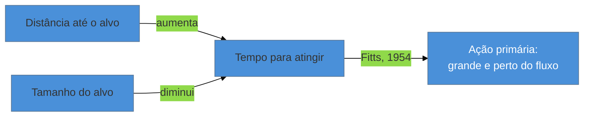

# Leis de UX: Fitts, Hick, Jakob, Miller, Peak-End

> [!abstract] TL;DR
> "Leis de UX" é o nome dado a uma curadoria de princípios de psicologia e cognição — a maioria formulada décadas antes de existir interface digital — organizada por Jon Yablonski no livro *Laws of UX* (2020) e no site [lawsofux.com](https://lawsofux.com). **Não são leis originais de Yablonski**: ele é o curador, não o autor. As cinco mais citáveis para um engenheiro full-cycle: **Fitts** (alvo maior e mais perto é mais rápido de atingir), **Hick** (mais opções, mais tempo de decisão), **Jakob** (o usuário espera que seu produto funcione como os que ele já conhece), **Miller** (~7±2 itens na memória de curto prazo — trate como ordem de grandeza, não regra de layout) e **Peak-End** (o usuário lembra do pico e do final da experiência, não da média). Fitts e Hick são as duas que mais aparecem em entrevista.

Um time discute por que a tela de checkout do produto converte pior que a concorrência. Alguém sugere adicionar mais opções de pagamento — parcelamento, carteiras digitais, boleto, pix, cripto — "para dar liberdade ao cliente". A conversão cai ainda mais depois da mudança. O que ninguém nomeou na reunião é que cada opção adicional tem um custo cognitivo mensurável: o tempo que uma pessoa leva para decidir entre N opções não cresce de forma linear e inofensiva — cresce de um jeito específico e bem documentado, que tem nome desde 1952. Sem esse nome, "mais opção é sempre melhor" parece intuitivo. Com o nome — **Lei de Hick** — a intuição vira previsão testável, e a pergunta muda de "quantas opções cabem" para "quantas opções esse usuário consegue processar antes de desistir".

## Por que "leis" entre aspas, e quem é Yablonski

Vale desfazer uma confusão comum antes de entrar no conteúdo: as "leis de UX" não foram inventadas por design digital, e não têm um único autor. **Jon Yablonski**, no livro *[Laws of UX](https://lawsofux.com)* (O'Reilly, 2020), fez o trabalho de **curadoria** — reuniu 21 princípios de psicologia e ciência cognitiva, alguns formulados nos anos 1950, organizou-os em quatro categorias (heurísticas, princípios da Gestalt, vieses cognitivos, princípios gerais) e os aplicou a exemplos de interface digital. Chamar esses princípios de "leis do Yablonski" seria atribuição errada — o próprio site nomeia cada lei pelo pesquisador original (Fitts, Hick, Miller...), e o mérito de Yablonski está em tê-los tornado acessíveis e aplicados, não em tê-los descoberto.

Essa distinção importa na prática: cada uma dessas "leis" tem raiz num estudo específico de psicologia experimental, com metodologia, amostra e limite de aplicabilidade próprios — nem toda "lei" generaliza igualmente bem para toda situação de interface, e a seção sobre Miller abaixo é o exemplo mais claro disso.

## Fitts's Law — o alvo, a distância, o tempo

Formulada por **Paul Fitts em 1954**, num estudo sobre movimento humano: o tempo para atingir um alvo é função da distância até ele e **inversamente proporcional ao tamanho do alvo**. Um alvo grande e perto é rápido de atingir; um alvo pequeno e distante é lento e propenso a erro.

Em interface, a tradução é direta: a **ação primária de uma tela deve ser grande e estar próxima do fluxo natural do olhar/mão do usuário** — isso é ainda mais crítico em touch, onde o "alvo" é literalmente o dedo tocando a tela, sem a precisão de um cursor de mouse. Um botão de "Confirmar" minúsculo no canto de uma tela mobile não é só uma escolha estética ruim — é uma fricção mensurável, prevista por um estudo de 1954, décadas antes de existir touchscreen.

## Hick's Law — mais opções, mais tempo

Formulada por **Hick e Hyman em 1952**: o tempo que uma pessoa leva para tomar uma decisão cresce **logaritmicamente** com o número de opções disponíveis — não linearmente, mas cresce, e de forma sensível mesmo com poucas opções a mais.

Essa é a base racional de dois padrões que aparecem sistematicamente em design de produto: **progressive disclosure** (mostrar só as opções necessárias agora, revelar mais sob demanda — ver [[03-Dominios/Engenharia/UX/Design de Interação/index|SG4]]) e a recomendação de não "jogar 40 campos na tela" de uma vez, como no cenário de abertura desta nota. Cada opção adicionada a um menu, a um formulário ou a uma tela de configuração tem um custo de decisão real, mensurável desde 1952 — e é esse custo que a heurística 8 de Nielsen ("estética minimalista", ver [[03-Dominios/Engenharia/UX/Fundamentos e Modelo Mental/03 - As 10 heurísticas de Nielsen|nota 03]]) está, na prática, tentando controlar.

> [!question]- Isso significa que interface deveria ter o mínimo de opções possível, sempre?
> Não — significa que cada opção adicionada tem um custo que precisa ser justificado, não que zero opções seja o ideal. Um usuário avançado às vezes *quer* mais controle (ver a heurística 7 de Nielsen, "flexibilidade e eficiência"). A Lei de Hick não recomenda "menos é sempre melhor" — recomenda medir o custo antes de adicionar, e agrupar/faseamento quando o número de opções cresce além do que a tarefa realmente exige.

## Jakob's Law — o produto que já existe na cabeça do usuário

Batizada em homenagem a Jakob Nielsen (o mesmo das dez heurísticas): o usuário passa a maior parte do tempo *em outros produtos*, não no seu. Ele chega ao seu produto já carregando expectativas formadas por tudo que usou antes — e espera que o seu funcione do mesmo jeito.

A implicação prática: **não reinvente um padrão de navegação sem motivo forte**. Um ícone de carrinho no canto superior direito, um menu hamburguer que abre navegação lateral, um botão "Voltar" no canto superior esquerdo — são convenções que custaram zero de aprendizado ao usuário porque ele já as viu em outros lugares. Trocar essas convenções por algo "mais original" impõe um custo de aprendizado que raramente se paga em diferenciação real. Essa lei conecta diretamente com o conceito de **signifiers de convenção** visto na [[03-Dominios/Engenharia/UX/Fundamentos e Modelo Mental/02 - Affordances e signifiers|nota 02]]: um signifier de convenção funciona *porque* a Lei de Jakob é verdadeira.

## Miller's Law — 7±2, e o cuidado com a ressalva

Formulada por **George Miller em 1956**, num artigo célebre sobre os limites da memória de curto prazo: pessoas conseguem reter cerca de **7±2 itens** (entre 5 e 9) na memória de curto prazo simultaneamente.

Aqui a ressalva é mais importante do que o número em si. **Miller's Law é frequentemente citada de forma frouxa como se fosse uma regra de design** — "um menu não deve ter mais que 7 itens", "uma tela não deve ter mais que 9 elementos". Essa aplicação literal não é o que Miller estudou nem o que o número suporta: o estudo original mede memória de curto prazo em tarefas específicas de laboratório, não capacidade de processar um layout visual. **Trate 7±2 como ordem de grandeza — um lembrete de que a memória de curto prazo é limitada — não como uma regra rígida de quantos itens cabem numa tela ou num menu.** Decisões reais de quantos itens mostrar dependem de contexto, agrupamento visual (ver [[03-Dominios/Engenharia/UX/Fundamentos e Modelo Mental/05 - Gestalt aplicada a UI|nota 05]]) e da tarefa — não de uma contagem mágica.

> [!warning] Citar "regra dos 7 itens" como se fosse uma lei de layout
> **O que acontece:** alguém rejeita um menu de 9 itens citando "a regra dos 7±2 de Miller" como justificativa técnica definitiva.
> **Por quê:** Miller mediu memória de curto prazo em condições de laboratório específicas — recall de sequências, não navegação visual com suporte de reconhecimento (que é justamente o que a heurística 6 de Nielsen recomenda usar em vez de recordação). Aplicar o número fora do contexto que ele mede é usar ciência real para justificar uma opinião de design.
> **Como evitar:** use Miller's Law como lembrete qualitativo ("a memória de curto prazo é limitada, agrupe itens relacionados") e decida a contagem real por teste com usuário e por agrupamento Gestalt, não por aritmética.

## Peak-End Rule — o que fica na memória

Formulada a partir do trabalho de Daniel Kahneman sobre julgamento retrospectivo de experiências: as pessoas não avaliam uma experiência pela média de todos os momentos — avaliam principalmente pelo **pico** (o momento mais intenso, positivo ou negativo) e pelo **final**.

A implicação para produto: **a tela de erro e a tela de sucesso merecem atenção desproporcional** ao tempo que o usuário passa nelas, porque são exatamente os pontos que ficam gravados na memória da experiência inteira. Um checkout tecnicamente perfeito em 9 de 10 passos, que termina numa tela de confirmação genérica e sem graça, deixa uma lembrança pior do que um checkout com pequenas fricções ao longo do caminho que termina numa confirmação memorável. O final pesa mais do que a média sugere.

## As cinco, lado a lado

| Lei | Ano / autor | Mecanismo | Aplicação prática |
|---|---|---|---|
| **Fitts** | 1954, Paul Fitts | tempo ∝ distância, ∝ 1/tamanho do alvo | ação primária grande e próxima, sobretudo em touch |
| **Hick** | 1952, Hick & Hyman | tempo de decisão cresce logaritmicamente com opções | progressive disclosure; não sobrecarregar a tela de opções |
| **Jakob** | — | expectativa formada por outros produtos | reutilizar convenção de navegação em vez de reinventar |
| **Miller** | 1956, George Miller | memória de curto prazo limitada (~7±2) | lembrete de agrupar informação — não regra rígida de contagem |
| **Peak-End** | Daniel Kahneman | memória privilegia pico e final, não a média | investir atenção desproporcional em erro e sucesso |

Fitts e Hick são, na prática, as duas mais citadas em conversa de entrevista técnica de nível sênior — são as que têm mecanismo mais direto de explicar e mais fácil de conectar a uma decisão concreta de produto.

## O que dá pra fazer sozinho

Nenhuma dessas cinco leis exige laboratório para ser aplicada — o trabalho é de revisão e julgamento, cabível numa passada de revisão de design:

- **Auditoria de Fitts:** meça (ou estime) o tamanho e a posição da ação primária de cada tela crítica, especialmente em mobile.
- **Contagem de Hick:** para cada tela com múltiplas opções, pergunte se todas são necessárias *agora* ou se algumas podem ficar atrás de "mais opções".
- **Checklist de Jakob:** antes de inventar um padrão de navegação novo, busque como 2-3 produtos conhecidos resolvem o mesmo problema.
- **Revisão de pico e final:** liste os momentos de erro e sucesso do fluxo principal e avalie se recebem cuidado proporcional ao peso que têm na memória do usuário.

O que exige mais estrutura é validar essas leis com dado próprio — medir tempo de decisão real por A/B test, ou rodar eye-tracking para confirmar Fitts empiricamente no seu produto. Isso pertence ao [[03-Dominios/Engenharia/UX/Medir, Validar e Sustentar/index|SG7]] e normalmente não é necessário: as cinco leis já vêm validadas pela literatura original, e reproduzir o experimento raramente compensa o esforço.

## Casos práticos

### Cenário 1: o botão "Comprar" minúsculo no rodapé mobile
Um app de e-commerce mobile posiciona o botão "Comprar agora" no rodapé da tela de produto, mas com padding pequeno e distante do polegar natural de quem segura o celular com uma mão. A taxa de clique no botão é baixa mesmo entre usuários que já demonstraram interesse (rolaram a tela toda, leram a descrição). Aplicando Fitts's Law: o alvo é pequeno e está numa posição de alcance ruim para uso com uma mão — o "alvo" físico do dedo precisa de mais tempo e precisão do que o gesto natural de rolar oferece. A correção (botão fixo, maior, na zona de alcance do polegar) não muda nenhuma lógica de negócio — só o tamanho e a posição de um elemento — e aumenta a taxa de clique mensuravelmente.

### Cenário 2: o formulário de perfil com 22 campos numa tela só
Um SaaS B2B pede que o usuário complete o perfil da empresa num único formulário de 22 campos antes de liberar o produto. A taxa de abandono nesse passo é a maior de todo o onboarding. Aplicando Hick's Law: 22 decisões simultâneas custam tempo de decisão de forma não-linear — o usuário não está apenas preenchendo campos, está *decidindo*, campo a campo, se vale a pena continuar. Dividir o formulário em 4 etapas de ~5 campos cada, com indicação de progresso, não reduz a quantidade total de informação pedida — reduz o número de decisões simultâneas visíveis a cada momento, e a taxa de conclusão sobe.

## Armadilhas comuns

> [!warning] Atribuir as leis a Yablonski
> **O que acontece:** alguém cita "a lei de Fitts do Yablonski" ou trata *Laws of UX* como a fonte original dos princípios.
> **Por quê:** Yablonski é curador — organizou e popularizou 21 princípios de pesquisadores de psicologia e cognição de décadas diferentes. A atribuição correta é ao pesquisador original (Fitts, Hick, Miller, Kahneman), com Yablonski citado como a fonte de curadoria/aplicação a UI.
> **Como evitar:** ao citar uma lei, nomeie o pesquisador original; cite Yablonski/*Laws of UX* quando a referência for especificamente à curadoria e aos exemplos aplicados a interface.

> [!warning] Usar Miller's Law como regra literal de contagem
> **O que acontece:** decisões de quantos itens caber num menu são justificadas citando "7±2" como se fosse uma especificação técnica.
> **Por quê:** como detalhado na seção sobre Miller acima, o estudo original mede memória de curto prazo em condições muito específicas, não capacidade de processar um layout visual com suporte de reconhecimento.
> **Como evitar:** use o número como lembrete qualitativo de que a memória é limitada; decida a contagem real por teste com usuário e por agrupamento visual (Gestalt).

> [!warning] Ignorar Peak-End na tela de erro
> **O que acontece:** o time investe pesado no fluxo feliz e trata a tela de erro como um afterthought — mensagem genérica, sem próximo passo, sem cuidado visual.
> **Por quê:** pela Peak-End Rule, a tela de erro é exatamente o tipo de momento de pico (neste caso, negativo) que fica gravado na memória da experiência inteira — desproporcionalmente ao tempo que o usuário passa nela.
> **Como evitar:** trate telas de erro e de sucesso como superfícies de design de primeira classe, não como "o que sobra depois do fluxo principal estar pronto".

## Como explicar em inglês

> "'Laws of UX' is Jon Yablonski's curation — not his invention — of 21 psychology and cognition principles applied to interface design. The five most citable for an engineer: **Fitts's Law** (bigger, closer targets are faster to hit), **Hick's Law** (decision time grows with the number of choices), **Jakob's Law** (users expect your product to work like the ones they already know), **Miller's Law** (~7±2 items in short-term memory — treat it as an order of magnitude, not a layout rule), and the **Peak-End Rule** (people remember the peak and the ending of an experience, not the average). Fitts and Hick come up most often in senior-level interviews."

| PT | EN |
|----|----|
| leis de UX | laws of UX |
| curadoria | curation |
| alvo (Fitts) | target |
| tempo de decisão (Hick) | decision time |
| memória de curto prazo (Miller) | short-term memory |
| regra do pico e do final | peak-end rule |
| convenção de plataforma (Jakob) | platform convention |

## O que vem a seguir

As leis desta nota explicam mecanismos de tempo, decisão e memória. A última nota do sub-galho fecha o modelo mental com a peça que falta: como o olho *agrupa* elementos visuais antes mesmo de qualquer decisão consciente acontecer — o fundamento perceptivo por trás de layout, espaçamento e hierarquia.

- [[03-Dominios/Engenharia/UX/Fundamentos e Modelo Mental/05 - Gestalt aplicada a UI|05 — Gestalt aplicada a UI]] — os mesmos princípios de Gestalt que Yablonski também cataloga em *Laws of UX*, aqui tratados em profundidade própria.

## Fontes

- **Jon Yablonski** — *[Laws of UX](https://lawsofux.com)* (O'Reilly, 2020) — curadoria dos 21 princípios organizados em heurísticas, Gestalt, vieses cognitivos e princípios gerais; fonte da aplicação de cada lei a interface digital.
- **Paul Fitts** — estudo original de 1954 sobre tempo de movimento em função de distância e tamanho do alvo — origem da Fitts's Law.
- **Hick & Hyman** — estudo de 1952 sobre tempo de decisão em função do número de opções — origem da Hick's Law.
- **George Miller** — *The Magical Number Seven, Plus or Minus Two* (1956) — origem do número de Miller's Law, com a ressalva de escopo discutida nesta nota.
- **Daniel Kahneman** — pesquisa sobre julgamento retrospectivo de experiências — origem da Peak-End Rule.
