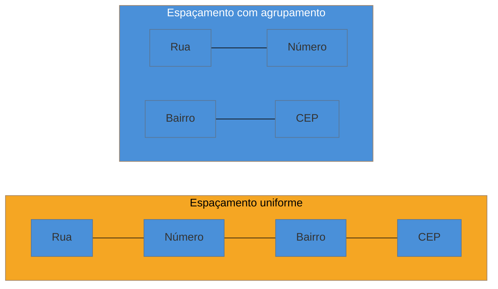

# Gestalt aplicada a UI

> [!abstract] TL;DR
> A Gestalt é a escola de psicologia da percepção — **Wertheimer, Koffka e Köhler, na Alemanha dos anos 1920** — que descreveu como o olho humano agrupa elementos visuais **antes** de qualquer análise consciente. Cinco princípios carregam peso real em layout de interface: **proximidade** (itens próximos são lidos como grupo), **similaridade** (mesma cor/forma comunica mesma função), **fechamento** (o olho completa formas incompletas), **continuidade** (o olho segue linhas e alinhamentos) e **figura-fundo** (hierarquia depende do contraste entre elemento e fundo). A ponte prática para quem constrói: **espaçamento não é enfeite — é o mecanismo pelo qual proximidade comunica agrupamento.** Errar espaçamento é errar semântica visual, não estética.

Um formulário de endereço tem seis campos: rua, número, complemento, bairro, cidade, CEP. O CSS aplica o mesmo `margin` uniforme entre todos os campos — sem nenhum espaço extra entre grupos. Visualmente, os seis campos parecem uma lista única e homogênea, sem indicação de que "rua + número + complemento" formam um bloco (o endereço em si) e "bairro + cidade + CEP" formam outro (a localização). Nenhum texto explica isso — nem precisaria, porque o agrupamento deveria estar *no espaço entre os campos*, não numa legenda. O resultado: usuários preenchem fora de ordem, alguns pulam o CEP achando que já preencheram informação equivalente. O bug não está no código de validação — está no espaçamento entre `<input>`s, e é exatamente o tipo de erro que a Gestalt explica e previne.

## O que a Gestalt descobriu, e por que "antes de pensar" importa

A escola da **Gestalt** — do alemão para "forma" ou "configuração" — nasce nos anos 1920 com **Max Wertheimer, Kurt Koffka e Wolfgang Köhler**, estudando como a percepção visual humana funciona. A descoberta central, resumida numa frase que virou clichê justamente por ser precisa: *o todo é diferente da soma das partes*. O cérebro não processa uma cena visual pixel a pixel, elemento a elemento, para depois "somar" e concluir uma estrutura — ele agrupa e organiza automaticamente, **antes** de qualquer raciocínio consciente entrar em cena.

Essa velocidade é o motivo pelo qual a Gestalt importa tanto para interface: os princípios abaixo não são preferências estéticas que um usuário "escolhe" aplicar ao olhar uma tela — são o jeito como a percepção humana funciona estruturalmente, independente de cultura, idioma ou familiaridade com tecnologia. Um layout que ignora esses princípios não está "feio" — está brigando com um mecanismo perceptivo que o usuário não controla conscientemente.

## Os cinco princípios que pesam em layout

### Proximidade
Elementos próximos entre si são lidos, automaticamente, como pertencentes ao mesmo grupo — mesmo sem nenhuma borda, cor ou rótulo os conectando. É o princípio isolado mais aplicado em interface, porque é **a base literal de todo layout de formulário e de card**: o espaço (ou a falta dele) entre elementos comunica relação antes de qualquer palavra ser lida.

O bug do cenário de abertura desta nota é exatamente a falha de proximidade: espaçamento uniforme apaga o grupo que deveria existir.

### Similaridade
Elementos com a mesma cor, forma ou estilo visual são lidos como tendo a mesma função — mesmo estando distantes uns dos outros na tela. É por isso que um design system reserva uma cor específica para "ação primária" e nunca a reutiliza para texto decorativo: reutilizar a cor quebra a promessa implícita de que "mesma cor = mesma função", confundindo o usuário sobre o que é clicável (conecta diretamente com **signifiers de convenção**, na [[03-Dominios/Engenharia/UX/Fundamentos e Modelo Mental/02 - Affordances e signifiers|nota 02]]).

### Fechamento
O olho **completa formas incompletas** automaticamente, preenchendo a lacuna que falta para reconhecer uma figura conhecida. É o mecanismo por trás de por que um ícone minimalista — poucas linhas, sem detalhe realista — ainda assim é reconhecível: o cérebro fecha o gap entre o esboço e a figura completa que ele já conhece. Um logo com formas parcialmente sobrepostas, ou um ícone de "play" feito só de um triângulo sem contorno, funcionam pelo mesmo motivo.

### Continuidade
O olho tende a **seguir linhas e alinhamentos** continuamente, em vez de saltar entre pontos desconectados. É a justificativa perceptiva, não só estética, para sistemas de grid: quando os elementos de uma página se alinham numa grade consistente, o olho percorre a página de forma previsível; quando o alinhamento quebra sem motivo, o olho perde o fio e o usuário sente — mesmo sem saber nomear — que "algo está desalinhado".

### Figura-fundo
A percepção de hierarquia visual depende do **contraste entre o elemento (figura) e o que está atrás dele (fundo)**. Um elemento só se destaca na medida em que se distingue do fundo — em cor, em tamanho, em nitidez. É o princípio que explica por que um modal precisa de um *overlay* escurecendo o fundo: sem o contraste figura-fundo reforçado, o olho não sabe imediatamente que o modal é a "figura" ativa e o resto da tela é "fundo" temporariamente inativo.

## A ponte para quem constrói: espaçamento é semântica

Esta é a ideia mais acionável da nota inteira, e merece ser dita sem rodeio: **espaçamento não é decoração — é o mecanismo pelo qual a proximidade comunica agrupamento.** Um engenheiro que ajusta `margin` e `gap` "até ficar bonito", sem pensar em quais elementos deveriam parecer relacionados, está tomando uma decisão semântica sem saber que está tomando uma decisão. Errar o espaçamento não é um erro estético secundário — é literalmente comunicar, ao cérebro do usuário, uma estrutura de agrupamento diferente da que o código pretende representar.

> [!question]- Isso significa que todo espaçamento precisa ser calculado manualmente, caso a caso?
> Não — é exatamente o problema que uma **escala de espaçamento consistente** (tokens de espaçamento — ver [[03-Dominios/Engenharia/UX/Linguagem Visual e Design System/index|SG5]]) resolve: definir de antemão que "espaço pequeno = mesmo grupo" e "espaço grande = grupos diferentes", e aplicar essa escala de forma sistemática em vez de decidir pixel a pixel toda vez. O princípio da Gestalt explica *por que* a escala funciona; a escala em si é a ferramenta prática.

## Uma ressalva sobre a fonte

Vale a mesma honestidade da nota anterior: os cinco princípios de Gestalt aplicados a UI, do jeito que aparecem aqui, também são catalogados na curadoria de Jon Yablonski (*[Laws of UX](https://lawsofux.com)*, 2020 — ver [[03-Dominios/Engenharia/UX/Fundamentos e Modelo Mental/04 - Leis de UX - Fitts, Hick, Jakob, Miller, Peak-End|nota 04]]), que dedica uma das quatro categorias do livro exclusivamente a Gestalt. Mas a origem intelectual é a escola alemã de psicologia da percepção dos anos 1920 — Wertheimer, Koffka, Köhler — décadas antes de existir interface digital ou o próprio Yablonski. A aplicação a UI moderna é recente; os princípios não são.

## O que dá pra fazer sozinho

Auditar layout contra os cinco princípios de Gestalt é um exercício visual, rápido, e não exige nenhuma ferramenta além de olhar a tela com atenção:

- **Teste de proximidade:** olhe qualquer formulário ou lista e pergunte "quais elementos deveriam parecer relacionados, e o espaçamento comunica isso?".
- **Teste de similaridade:** confira se cores/estilos reutilizados sempre significam a mesma função — um botão vermelho deveria significar sempre a mesma coisa (geralmente, ação destrutiva) em todo o produto.
- **Teste de continuidade:** entrecerre os olhos e veja se os elementos formam linhas visuais previsíveis, ou se o alinhamento "pula" sem motivo.
- **Teste de figura-fundo:** para cada elemento que deveria chamar atenção (CTA, modal, alerta), confirme que o contraste com o fundo é suficiente para destacá-lo — sem depender só da cor (o que também toca a fronteira de acessibilidade, ver abaixo).

O que exige mais estrutura é pesquisa formal de percepção — eye-tracking para confirmar empiricamente o caminho que o olho percorre numa tela específica. Isso raramente é necessário: os cinco princípios são bem estabelecidos há um século e não precisam ser redescobertos produto a produto.

> [!info] Fronteira com acessibilidade
> O contraste de figura-fundo tem uma camada técnica regulada — critérios WCAG de contraste mínimo — já coberta em profundidade no domínio vizinho. Este domínio não recalcula fórmula de contraste nem cita os números de WCAG: isso pertence a [[03-Dominios/Tecnologia/Acessibilidade/index|Tecnologia/Acessibilidade]]. Aqui o interesse é perceptivo — *por que* contraste comunica hierarquia — não normativo.

## Casos práticos

### Cenário 1: o card de produto ambíguo
Um catálogo de e-commerce mostra cards de produto com imagem, nome, preço e um selo de "Frete grátis" — todos com o mesmo espaçamento vertical entre si. Usuários relatam confusão sobre se o selo "Frete grátis" se aplica ao produto específico do card ou é um banner geral da página. O problema é de proximidade: o selo está espaçado da mesma forma em relação ao card de cima e ao produto do próprio card, então o olho não tem informação suficiente para decidir a qual grupo ele pertence. A correção aproxima o selo do bloco do produto (reduzindo o espaço entre selo e preço) e aumenta o espaço entre cards diferentes — sem mudar nenhum texto, a ambiguidade desaparece porque o agrupamento visual passa a corresponder ao agrupamento lógico.

### Cenário 2: os botões que parecem ter a mesma importância
Uma tela de confirmação de exclusão de conta mostra dois botões lado a lado, do mesmo tamanho, mesma cor de fundo (cinza neutro), diferindo só no texto: "Cancelar" e "Excluir permanentemente". Vários usuários relatam ter clicado no botão errado por engano. O problema é de similaridade: os dois botões, por serem visualmente idênticos em peso, comunicam "mesma importância, mesma reversibilidade" — quando na verdade um é seguro (cancelar) e o outro é destrutivo e irreversível. A correção não muda a lógica: dá ao botão destrutivo uma cor de alerta (vermelho) e ao botão seguro um estilo neutro ou secundário, quebrando a similaridade que estava, sem querer, igualando duas ações com risco completamente diferente.

## Armadilhas comuns

> [!warning] Espaçar tudo igual "para ficar limpo"
> **O que acontece:** um desenvolvedor aplica o mesmo `margin`/`gap` em todos os elementos de uma tela, tratando espaçamento uniforme como sinônimo de organização visual.
> **Por quê:** espaçamento uniforme apaga qualquer sinal de agrupamento — o princípio de proximidade deixa de comunicar estrutura, porque não há diferença entre "espaço dentro do grupo" e "espaço entre grupos". O resultado parece organizado à primeira vista e é confuso na prática, como no formulário do cenário de abertura.
> **Como evitar:** defina pelo menos dois níveis de espaçamento — um pequeno para dentro de um grupo, um maior entre grupos diferentes — e aplique com consistência, idealmente via tokens de espaçamento.

> [!warning] Reaproveitar cor/estilo visual para funções diferentes
> **O que acontece:** um estilo de botão ou de badge, criado para uma função específica, é reutilizado noutro contexto do produto para uma função diferente, só porque "já existia e ficava bonito ali".
> **Por quê:** pelo princípio de similaridade, o usuário associa o mesmo estilo visual à mesma função em qualquer lugar do produto. Reaproveitar sem essa correspondência quebra a confiança que o usuário deposita nos signifiers do produto inteiro.
> **Como evitar:** trate cada estilo visual reutilizável como parte de um vocabulário — documente o que ele significa, não só como ele se parece — e reserve-o exclusivamente para essa função.

> [!warning] Confiar só em cor para comunicar hierarquia
> **O que acontece:** o contraste figura-fundo de um elemento importante depende inteiramente de tonalidade de cor, sem diferença de tamanho, peso ou posição.
> **Por quê:** cor sozinha é o canal mais frágil de contraste — falha para usuários com daltonismo, falha sob luz solar forte, falha em telas mal calibradas. O princípio de figura-fundo funciona melhor quando reforçado por múltiplos canais (tamanho, peso, espaço, não só matiz).
> **Como evitar:** para qualquer elemento que precisa se destacar, combine cor com pelo menos mais um sinal (tamanho, negrito, ícone, posição) — nunca dependa de cor isolada. Ver também a fronteira de contraste WCAG em [[03-Dominios/Tecnologia/Acessibilidade/index|Acessibilidade]].

## Como explicar em inglês

> "Gestalt psychology — Wertheimer, Koffka, and Köhler, 1920s Germany — describes how the eye groups visual elements **before** conscious analysis happens. Five principles matter most for interface layout: **proximity** (nearby items read as a group), **similarity** (same color/shape signals same function), **closure** (the eye completes incomplete shapes), **continuity** (the eye follows lines and alignment), and **figure-ground** (hierarchy depends on contrast against the background). The practical bridge: **spacing isn't decoration — it's the mechanism through which proximity communicates grouping.** Getting spacing wrong is a semantic error, not just an aesthetic one."

| PT | EN |
|----|----|
| Gestalt | Gestalt |
| proximidade | proximity |
| similaridade | similarity |
| fechamento | closure |
| continuidade | continuity |
| figura-fundo | figure-ground |
| agrupamento visual | visual grouping |
| escala de espaçamento | spacing scale |

## O que vem a seguir

Este sub-galho encerra o modelo mental: você já tem o vocabulário de affordance/signifier (nota 02), o checklist de avaliação de Nielsen (nota 03), os mecanismos cognitivos de tempo e memória (nota 04) e agora a percepção visual que organiza tudo isso antes mesmo de uma decisão consciente acontecer. O próximo sub-galho aplica esse vocabulário inteiro ao primeiro passo real de qualquer projeto: entender o problema e o usuário antes de desenhar qualquer coisa.

- [[03-Dominios/Engenharia/UX/Descoberta e Pesquisa/index|SG2 — Descoberta e Pesquisa]] — onde o modelo mental construído aqui encontra a prática de entrevista, teste de usabilidade e definição do problema.
- [[03-Dominios/Engenharia/UX/Linguagem Visual e Design System/index|SG5 — Linguagem Visual e Design System]] — onde a proximidade e a similaridade viram tokens de espaçamento e cor formalizados num sistema.

## Fontes

- **Max Wertheimer, Kurt Koffka, Wolfgang Köhler** — fundadores da escola de psicologia da Gestalt, Alemanha, anos 1920 — origem dos cinco princípios de percepção aplicados nesta nota.
- **Jon Yablonski** — *[Laws of UX](https://lawsofux.com)* (O'Reilly, 2020) — curadoria que aplica os princípios de Gestalt especificamente a interface digital, com exemplos visuais.
