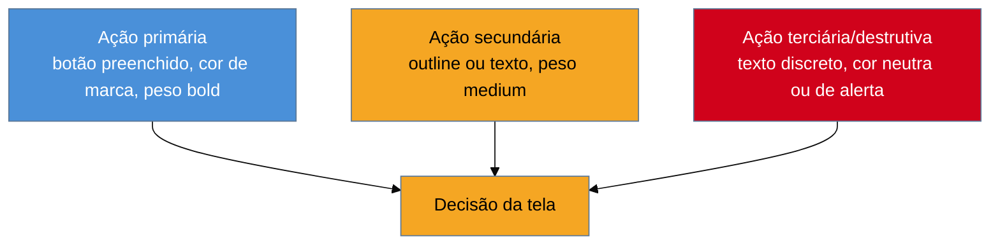

# Hierarquia visual

> [!abstract] TL;DR
> Hierarquia visual é a decisão de **qual elemento o olho encontra primeiro** — e ela se controla por **peso e tamanho**, não por família tipográfica. A regra que mais paga a conta, de *Refactoring UI* (Wathan & Schoger, 2018): **uma ação primária por tela**, visualmente dominante; ações secundárias em texto ou outline; **nunca dois botões preenchidos competindo** pela mesma atenção. Espaço em branco não é sobra — mais espaço ao redor de um elemento aumenta a importância percebida dele. Hierarquia visual é, na raiz, Gestalt aplicada (proximidade, figura-fundo) — este capítulo assume esse vocabulário e o transforma em regra de produção.

Uma tela de checkout tem três botões visíveis ao mesmo tempo: "Aplicar cupom", "Salvar para depois" e "Finalizar compra" — todos preenchidos, mesma cor azul, mesmo tamanho, lado a lado. Nenhum dos três é "errado" isoladamente: o texto é claro, o alvo de toque é grande o suficiente, o contraste passa em qualquer checker. E ainda assim a taxa de conclusão de compra cai, porque o olho do usuário chega na tela e não recebe **nenhum sinal de qual dessas três ações importa mais agora**. Os três botões gritam com o mesmo volume, e quando tudo grita, nada se ouve. O bug não é de acessibilidade nem de copy — é que ninguém decidiu, visualmente, qual é a ação primária da tela.

## O peso resolve o que o texto não resolve

Hierarquia visual é a resposta à pergunta "o que o olho vê primeiro, e é a coisa certa?" — a mesma pergunta que a nota de abertura do domínio já formulou. A resposta prática de *Refactoring UI*, o livro de Adam Wathan e Steve Schoger (2018) escrito especificamente para quem constrói interface sem formação de design, se resume a três regras que carregam peso desproporcional ao esforço de aplicá-las:

**Uma ação primária por tela.** Toda tela tem, no máximo, uma ação que o produto quer que o usuário tome agora. Ela recebe o tratamento visualmente dominante — geralmente um botão preenchido, com a cor de maior saturação da paleta. Todo o resto — ações secundárias, ações destrutivas raras, ações de saída — recebe tratamento visualmente subordinado: texto, outline, ou um botão preenchido menor e de cor neutra. O checkout do cenário de abertura viola essa regra três vezes na mesma tela.

**Nunca dois botões preenchidos competindo.** Esta é a instância mais comum e mais fácil de auditar da regra anterior. Se duas ações estão lado a lado e ambas são botões preenchidos da mesma cor, o layout está dizendo "ambas são igualmente importantes" — o que quase nunca é verdade. A correção não muda a lógica de negócio nem remove nenhuma ação: rebaixa visualmente a que é secundária.

**Espaço em branco comunica importância.** Mais espaço ao redor de um elemento — não menos — aumenta a importância percebida dele. É contraintuitivo para quem vem de código, onde espaço em branco parece "desperdício de tela" a ser comprimido. Em interface, o efeito é o oposto: um título cercado de respiro parece mais importante que o mesmo título espremido entre outros elementos. Comprimir tudo para "caber mais na tela" nivela a importância de tudo — o resultado visual é justamente a ausência de hierarquia.

**Hierarquia se controla por peso e tamanho, não por família tipográfica.** Trocar de fonte para "destacar" um elemento é o instinto mais comum de quem não tem vocabulário de hierarquia — e o menos eficaz. O canal que funciona é variar o **peso** (regular → medium → bold) e o **tamanho** dentro da mesma família, complementado por cor e contraste. Duas ou três famílias tipográficas coexistindo numa tela raramente comunicam hierarquia; comunicam inconsistência.

> [!question]- Isso não é só "deixar bonito"? Por que um engenheiro sem formação de design consegue aplicar isso com confiança?
> Porque as três regras acima não dependem de gosto ou talento estético — são heurísticas mecânicas, auditáveis olhando a tela: conte quantos botões preenchidos aparecem juntos; meça se o espaço ao redor do elemento mais importante é visivelmente maior que o resto; confira se peso e tamanho variam de forma proposital. É por isso que *Refactoring UI* segue sendo a referência mais citada para "dev sem designer" quase uma década depois — o livro foi escrito exatamente para transformar julgamento estético em checklist.

## A base perceptiva: isso já é Gestalt

Hierarquia visual não introduz um mecanismo novo de percepção — ela **aplica** dois princípios de Gestalt que a [[03-Dominios/Engenharia/UX/Fundamentos e Modelo Mental/05 - Gestalt aplicada a UI|nota 05 do SG1]] já cobriu em profundidade: **figura-fundo** (um elemento se destaca na medida em que contrasta com o que está atrás dele) e, em menor grau, **proximidade** (agrupar as ações secundárias visualmente distantes da primária reforça a separação de importância). Este capítulo não reexplica esses princípios — assume que o leitor já tem esse vocabulário e o traduz em regra de produção para botões, títulos e cards. Quem chegou direto neste sub-galho sem passar pelo SG1 deveria voltar à nota 05 antes de seguir: o "porquê" perceptivo mora lá, o "como aplicar" mora aqui.

## Praticável sozinho vs. exige time

Auditar e corrigir hierarquia visual de uma tela existente é, quase sempre, trabalho de uma pessoa e de poucas horas — e é exatamente por isso que este item faz sentido no domínio de um engenheiro fractional. As três regras da seção anterior são checáveis a olho, sem ferramenta além de olhar a própria tela: contar botões preenchidos competindo, medir espaço relativo, confirmar que peso/tamanho variam de forma proposital. Não exige aprovação de designer, não exige pesquisa, não exige orçamento — exige lembrar de fazer a pergunta antes de subir a tela.

O que já não cabe numa pessoa sozinha é diferente em natureza, não em dificuldade técnica: **definir a linguagem visual de uma marca do zero** — a escolha original de quanta ousadia de cor, quanto peso tipográfico, quanto respiro a marca "deveria" ter — é uma decisão de identidade que envolve stakeholders de marketing/produto, não só um julgamento técnico de layout; um engenheiro decidindo isso sozinho está tomando uma decisão de negócio disfarçada de decisão técnica. Da mesma forma, **provar com dado** que uma hierarquia funciona melhor que outra (A/B test de conversão comparando dois layouts de checkout) exige tráfego e método estatístico que uma tela de baixo volume não sustenta — nesses casos, a heurística de *Refactoring UI* é o substituto responsável, não um atalho preguiçoso: ela existe precisamente para os casos em que testar não é viável.

## Casos práticos

### Cenário 1: o modal de confirmação com dois botões preenchidos
Uma tela de exclusão de conta mostra "Cancelar" e "Excluir permanentemente" como dois botões preenchidos, mesma cor cinza-escuro, lado a lado, mesmo tamanho. Métricas de suporte mostram usuários reclamando de ter excluído a conta "sem querer". O que dá errado: os dois botões comunicam peso idêntico — nada na tela sinaliza que uma ação é seguríssima (cancelar) e a outra é irreversível e destrutiva. A correção específica: o botão "Cancelar" vira outline ou texto (ação segura, subordinada visualmente); "Excluir permanentemente" mantém-se preenchido, mas migra para uma cor de alerta (vermelho) reservada exclusivamente para ações destrutivas — nunca reutilizada para outra coisa. A lógica de negócio não muda uma linha; só a hierarquia visual muda, e o erro de clique cai.

### Cenário 2: o dashboard onde tudo é bold
Um painel administrativo tem oito cards de métricas, cada um com título em `font-weight: bold` e valor grande, porque "cada métrica é importante". O usuário relata que não consegue "achar o número que importa" ao abrir a tela — mesmo sabendo, em teoria, qual métrica é crítica naquele momento. O que dá errado: quando tudo é bold, bold deixa de significar "isto é importante" — a hierarquia relativa desaparece porque não existe mais contraste de peso entre os elementos. A correção específica: apenas a métrica crítica do momento (definida pelo dono do produto, não pelo engenheiro sozinho) recebe peso bold e tamanho maior; as demais recaem para regular/medium, menores. O painel não perde informação — ganha um ponto de entrada visual claro.

### Cenário 3: o formulário sem respiro que parece mais denso do que é
Um formulário de cadastro comprime todos os campos com `margin` mínimo "para caber mais coisa acima da dobra", incluindo o botão de submit, que fica espremido logo abaixo do último campo, do mesmo tamanho visual que os campos de texto. Taxa de conclusão está abaixo do esperado, e teste de usabilidade guerrilha (ver [[03-Dominios/Engenharia/UX/Fundamentos e Modelo Mental/01 - UX não é tela - o ofício e seus limites|nota 01]]) mostra usuários hesitando antes de clicar em "Enviar" — alguns nem percebem que aquele é o botão de ação final. O que dá errado: sem espaço extra ao redor do botão de submit e sem diferença de peso em relação aos campos, ele não se lê como "a ação que fecha o formulário" — se lê como mais um elemento no meio da lista. A correção específica: aumenta-se o espaço acima do botão de submit (separando-o visualmente do último campo) e o botão ganha peso visual (preenchido, cor de marca) claramente maior que qualquer campo de input ao redor.

## Armadilhas comuns

> [!warning] Dois botões preenchidos competindo
> **O que acontece:** duas ações lado a lado, ambas em botão preenchido da mesma cor — a UI mais comum em telas de confirmação e formulários com "salvar" e "salvar e continuar".
> **Por quê:** peso visual idêntico comunica importância idêntica; o usuário não recebe nenhum sinal sobre qual ação o produto espera que ele tome primeiro, e decide por hábito ou aleatoriedade — inclusive em ações irreversíveis.
> **Como evitar:** decida qual ação é primária antes de estilizar; a primária fica preenchida, todas as outras ficam em texto ou outline, sem exceção.

> [!warning] Tamanho de fonte como único mecanismo de hierarquia
> **O que acontece:** o desenvolvedor aumenta o `font-size` de um título até "parecer importante" e considera a hierarquia resolvida, sem tocar em peso, cor ou espaçamento.
> **Por quê:** tamanho isolado é um canal fraco — dois elementos do mesmo tamanho mas pesos diferentes ainda comunicam hierarquia; dois elementos do mesmo peso mas tamanhos levemente diferentes, quase não comunicam nada. Peso e contraste fazem o trabalho pesado; tamanho reforça.
> **Como evitar:** trate peso (`font-weight`), tamanho e espaço ao redor como três alavancas que trabalham juntas — nunca dependa de uma sozinha, e nunca troque família tipográfica só para "destacar".

> [!warning] Comprimir espaço em branco para "caber mais na tela"
> **O que acontece:** sob pressão para mostrar mais conteúdo acima da dobra, o time reduz margens e paddings uniformemente até o layout parecer "cheio", tratando espaço vazio como desperdício.
> **Por quê:** menos espaço ao redor de um elemento reduz a importância percebida dele — comprimir tudo igualmente nivela a importância de tudo, produzindo exatamente o efeito oposto ao pretendido (mais conteúdo visível, mas nenhum ponto de entrada visual claro).
> **Como evitar:** reserve espaço extra deliberadamente para o elemento que deveria dominar a tela, mesmo que isso signifique menos itens visíveis por vez — ligue essa decisão à escala de espaçamento formal da [[03-Dominios/Engenharia/UX/Linguagem Visual e Design System/27 - Escalas de tipografia, espaçamento e densidade|próxima nota]].

> [!tip] Vídeo — Visual Hierarchy (NN/g)
> [**Visual Hierarchy**](https://www.nngroup.com/videos/visual-hierarchy/) (Nielsen Norman Group, ~4 min) organiza a hierarquia visual em três alavancas — cor/contraste, escala e agrupamento — a mesma tríade peso/tamanho/espaço explorada nesta nota, mas com exemplos visuais lado a lado que o texto sozinho não reproduz. Trecho de destaque [0:42]: *"There are lots of different ways of creating visual hierarchy, but for now, we'll focus on three key pieces: color and contrast, scale, and grouping."*
>
> 🎬 [Assistir no YouTube](https://www.youtube.com/watch?v=8OTbyWndY9M)

## Como explicar em inglês

> "Visual hierarchy is the decision of what the eye sees first — and it's controlled by weight and size, not typeface family. The rule that pays off the most: **one dominant primary action per screen**, everything else subordinate — text or outline buttons, never two filled buttons competing for the same attention. Whitespace isn't waste; more space around an element increases its perceived importance. At its root, this is Gestalt applied to production UI — figure-ground and proximity turned into a checklist a developer without design training can run."

| PT | EN |
|----|----|
| hierarquia visual | visual hierarchy |
| ação primária | primary action |
| ação secundária/terciária | secondary/tertiary action |
| botão preenchido | filled button |
| peso visual | visual weight |
| espaço em branco | whitespace |
| importância percebida | perceived importance |

## O que vem a seguir

Peso, tamanho e espaço só produzem hierarquia consistente se forem aplicados a partir de uma **escala** — um conjunto pequeno e reutilizável de valores, em vez de decisões pixel a pixel toda vez que uma tela nova é construída. É exatamente isso que a próxima nota formaliza: escalas de tipografia e de espaçamento, e a decisão, frequentemente ignorada, de quanta densidade cada perfil de usuário exige.

- [[03-Dominios/Engenharia/UX/Linguagem Visual e Design System/27 - Escalas de tipografia, espaçamento e densidade|27 — Escalas de tipografia, espaçamento e densidade]] — transforma "mais espaço = mais importante" numa escala sistemática, em vez de um julgamento caso a caso.

## Fontes

- **Adam Wathan & Steve Schoger** — *[Refactoring UI](https://www.refactoringui.com/)* (2018) — origem das regras de hierarquia usadas nesta nota: uma ação primária dominante, nunca dois botões preenchidos competindo, espaço em branco como sinal de importância.
- **Nielsen Norman Group** — [*Visual Hierarchy* (vídeo)](https://www.nngroup.com/videos/visual-hierarchy/) — as três alavancas (cor/contraste, escala, agrupamento) usadas para organizar a hierarquia visual.
