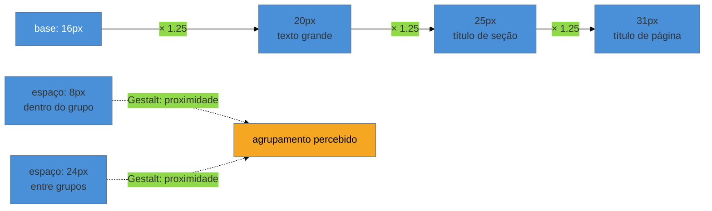

# Escalas de tipografia, espaçamento e densidade

> [!abstract] TL;DR
> Uma escala é um pequeno conjunto de valores — de tamanho de fonte, de espaçamento — usado em toda a interface, em vez de números arbitrários escolhidos tela a tela. **Escala modular de tipografia:** uma razão geométrica (1.25 "major third", 1.618 golden ratio) aplicada a um tamanho-base — prática consolidada, sem autor canônico único, popularizada pela ferramenta Modular Scale de Tim Brown (~2011). **Escala de espaçamento em base 4 ou 8:** convenção de mercado (Material Design, Tailwind, Ant Design) — consenso de indústria, não fonte acadêmica. Duas regras adicionais carregam peso prático: **50-75 caracteres por linha** para legibilidade, e **no máximo 2 famílias tipográficas**. E a decisão que o engenheiro mais erra: **densidade deveria variar por perfil de usuário** — mais densa para quem usa o produto todo dia (admin, dashboard operacional), menos densa para quem usa ocasionalmente — porque quem constrói o produto é, quase sempre, um power user testando como power user.

Um engenheiro cria um design system do zero para um SaaS B2B. Sem escala definida, cada tela nova nasce com valores de `font-size` e `margin` escolhidos ali, "no olho": `13px`, `14px`, `15px` convivem no mesmo produto; `margin: 12px` numa tela e `margin: 14px` na tela vizinha, sem motivo. Três meses depois, o produto parece visualmente inconsistente mesmo que nenhuma tela individual esteja "feia" — o problema é que a variação entre telas não comunica nada; é ruído, não hierarquia. O engenheiro tenta "consertar" ajustando pixel a pixel, tela a tela, e o problema volta na próxima feature. O erro não foi em nenhuma decisão individual — foi não ter uma escala desde o início, que tornaria cada decisão de tamanho uma escolha entre 5-8 valores predefinidos, não um número livre.

## Escala modular de tipografia: uma razão, não uma lista arbitrária

Uma escala tipográfica modular parte de um tamanho-base (geralmente `16px`, o padrão do navegador) e multiplica repetidamente por uma **razão** para gerar os tamanhos maiores, e divide para gerar os menores. Razões comuns:

| Razão | Nome | Uso típico |
|---|---:|---|
| 1.125 | Major second | Escalas discretas, produtos densos |
| 1.25 | Major third | Escala equilibrada, uso geral |
| 1.333 | Perfect fourth | Escala com mais contraste entre níveis |
| 1.618 | Golden ratio | Contraste forte, hero/marketing |

```
base:  16px
× 1.25 → 20px  (texto grande / subtítulo)
× 1.25 → 25px  (título de seção)
× 1.25 → 31px  (título de página)
÷ 1.25 → 12.8px (texto pequeno / legenda)
```

O ponto que vale nomear com honestidade: essa prática **não tem autor acadêmico único a citar**. Ela é consolidada por convenção de mercado, popularizada em especial pela ferramenta "Modular Scale" de Tim Brown, por volta de 2011 — um utilitário web que gera a escala automaticamente a partir da base e da razão escolhidas. Citar essa origem numa conversa técnica é mais preciso do que atribuir a prática a "um padrão de design" vago.

> [!question]- Por que não simplesmente escolher os tamanhos "que ficam bons"?
> Porque sem razão matemática subjacente, cada decisão de tamanho vira uma negociação isolada — e negociações isoladas produzem inconsistência ao longo do tempo, mesmo com boa intenção. A escala não é sobre achar "o tamanho perfeito" (isso não existe) — é sobre ter **poucas opções predefinidas**, de forma que qualquer desenvolvedor, em qualquer tela, escolha entre 5-8 valores já aprovados em vez de inventar um nono valor arbitrário.

## Escala de espaçamento: base 4 ou base 8

O mesmo raciocínio se aplica ao espaçamento — `margin`, `padding`, `gap` — mas aqui a convenção de mercado não é uma razão geométrica, é uma **progressão aritmética em múltiplos de 4 ou 8 pixels**:

```
4, 8, 12, 16, 24, 32, 48, 64, 96
```

Material Design, Tailwind CSS e Ant Design convergem nessa base — é **consenso de indústria, não resultado de pesquisa acadêmica** sobre percepção de espaço. A vantagem prática de qualquer sistema baseado em 4/8 é que os valores dividem e multiplicam de forma limpa entre si, o que facilita alinhamento visual em qualquer grid. A mecânica de implementar essa escala em CSS puro — custom properties, `:root`, `var()` — já está coberta em [[03-Dominios/Tecnologia/CSS/07 - Custom properties e design tokens|CSS/07]]; esta nota não repete essa mecânica, trata da escolha da escala em si.

O espaçamento nesta escala é exatamente o mecanismo pelo qual a **proximidade** — o princípio de Gestalt coberto na [[03-Dominios/Engenharia/UX/Fundamentos e Modelo Mental/05 - Gestalt aplicada a UI|nota 05 do SG1]] — vira sistemática em vez de decidida pixel a pixel: espaço pequeno (`8px`, `12px`) dentro de um grupo; espaço maior (`24px`, `32px`) entre grupos diferentes.



## Largura de linha e restrição tipográfica

Duas regras adicionais, menos discutidas mas igualmente carregadas de consequência prática:

**50 a 75 caracteres por linha** é a faixa de legibilidade confortável para blocos de texto corrido — abaixo disso, o olho quebra linha rápido demais e perde o fio; acima, o olho tem dificuldade de voltar para o início da linha seguinte. Um bloco de texto que ocupa a largura inteira de uma tela wide sem `max-width` viola essa faixa silenciosamente — o texto "cabe" tecnicamente, mas ninguém lê confortavelmente.

**No máximo 2 famílias tipográficas** por produto. Cada família adicional multiplica a superfície de inconsistência — pesos que não combinam, alturas x diferentes, tempos de carregamento de fonte adicionais. A prática de mercado bem-sucedida costuma usar uma família (às vezes com uma variante monoespaçada para código) e resolver toda a hierarquia com peso e tamanho — exatamente a regra da [[03-Dominios/Engenharia/UX/Linguagem Visual e Design System/26 - Hierarquia visual|nota 26]].

## A decisão que o engenheiro mais erra: densidade por perfil de usuário

Densidade é quanto espaço em branco e quantos itens por tela um layout comporta — o oposto direto de "compacto". A decisão raramente discutida, e a que mais custa caro quando errada: **densidade deveria variar por perfil de usuário**, não ser uma constante do design system inteiro.

Um usuário **power/interno frequente** — um analista que abre o dashboard operacional 40 vezes por dia — se beneficia de mais densidade: menos espaçamento, mais linhas visíveis por scroll, menos cliques para navegar entre registros. Um usuário **ocasional/consumer** — alguém que abre o app uma vez por semana, sem memória muscular do layout — precisa do oposto: mais espaço, menos itens simultâneos, mais orientação visual a cada tela.

O erro mais comum, e o motivo pelo qual esta seção existe: **o engenheiro que constrói o produto testa como power user**. Ele abre a tela vinte vezes por dia durante o desenvolvimento, memoriza onde cada coisa está, e naturalmente prefere (e valida) uma densidade alta — porque para ele, que já conhece o produto de cor, densidade alta é conveniente. O usuário real, ocasional, vê a mesma tela pela primeira vez em semanas e se perde. Nenhuma métrica de contraste ou de tamanho de fonte capta esse erro — só perguntar explicitamente "quem usa isso, e com que frequência?" antes de escolher a densidade captura.

## Praticável sozinho vs. exige time

Definir e aplicar uma escala de tipografia e espaçamento é trabalho de uma sessão, sozinho: escolher uma razão (1.25 é um ponto de partida seguro para a maioria dos produtos B2B), gerar os 5-8 valores, e substituir os números arbitrários espalhados pelo código por essa escala via custom properties. É mecânico, não exige aprovação de ninguém, e o ganho de consistência aparece imediatamente. O mesmo vale para a decisão de densidade: perguntar "esse usuário abre isso uma vez por semana ou quarenta vezes por dia?" é uma pergunta que qualquer engenheiro pode — e deveria — fazer sozinho antes de escolher o `padding` de uma tabela.

O que exige mais estrutura é **validar empiricamente** que uma escala específica é a certa para aquele produto — testar com usuários reais se a razão 1.25 "sente" melhor que 1.333, ou medir tempo de leitura/erro de digitação em diferentes densidades com amostra estatística. Isso é pesquisa formal, não uma decisão de design tokens; a maioria dos produtos nunca precisa disso — a convenção de mercado (Material Design, Tailwind) já carrega validação implícita de milhões de produtos rodando com ela. Reserve pesquisa própria para o caso raro em que o produto tem uma população de usuário genuinamente atípica (baixa visão em massa, ambiente industrial com luz ruim) que a convenção padrão não cobre.

## Casos práticos

### Cenário 1: o produto com nove tamanhos de fonte "quase iguais"
Um time herda um produto sem escala tipográfica definida. Uma auditoria do CSS encontra `13px`, `13.5px`, `14px`, `15px`, `16px` convivendo sem lógica aparente — cada um introduzido por um desenvolvedor diferente, em momentos diferentes, "no olho". O que dá errado: nenhum desses valores individualmente é ruim, mas juntos comunicam inconsistência que o usuário sente sem conseguir nomear. A correção específica: mapear cada valor existente para o ponto mais próximo de uma escala modular de 1.25 recém-definida (`12px`, `16px`, `20px`, `25px`, `31px`), substituir progressivamente via find-and-replace guiado por custom properties, e proibir `font-size` livre em code review dali em diante.

### Cenário 2: o dashboard denso demais para o cliente ocasional
Um SaaS de gestão financeira tem um único design system aplicado tanto ao painel do contador (que usa o produto 6 horas por dia) quanto ao portal do cliente final (que acessa uma vez por mês para ver um relatório). Ambos usam a mesma densidade alta, otimizada para o contador. O cliente final reclama que a tela "parece complicada demais" para uma tarefa simples. O que dá errado: a densidade foi escolhida uma vez, para o perfil de usuário mais visível durante o desenvolvimento (o contador, que a equipe testa o tempo todo) — o portal do cliente herdou a mesma densidade por padrão, não por decisão. A correção específica: o portal do cliente final recebe uma variante de baixa densidade — mais espaço, menos itens simultâneos, hierarquia visual mais generosa — usando os mesmos tokens de espaçamento, só que aplicados com multiplicador maior.

### Cenário 3: o texto que ninguém lê porque a linha é longa demais
Uma página de termos de uso renderiza o texto em largura total num monitor wide, sem `max-width`. O texto tecnicamente cabe e passa em qualquer teste de acessibilidade de contraste — mas métricas de scroll mostram usuários abandonando a leitura a poucos parágrafos do início. O que dá errado: linhas com mais de 100 caracteres obrigam o olho a percorrer uma distância horizontal grande antes de voltar para o início da próxima linha, e o esforço cognitivo de manter o lugar aumenta — o usuário sente cansaço de leitura sem saber nomear a causa. A correção específica: aplicar `max-width` de aproximadamente `65ch` (a unidade `ch` mede em caracteres, não pixels) ao bloco de texto corrido, mantendo o restante do layout na largura total da tela.

## Armadilhas comuns

> [!warning] Escala tipográfica "no olho", sem razão definida
> **O que acontece:** cada `font-size` é escolhido isoladamente, tela a tela, sem nenhuma relação matemática entre os valores.
> **Por quê:** sem uma razão comum, cada novo tamanho parece razoável isoladamente, mas o conjunto acumulado produz inconsistência perceptível — o produto "não parece coeso" mesmo que nenhuma tela individual esteja claramente errada.
> **Como evitar:** escolha uma razão (1.25 é seguro para a maioria) e gere a escala inteira de uma vez; qualquer novo tamanho precisa vir dessa lista fechada, nunca de um valor livre.

> [!warning] Densidade única aplicada a todos os perfis de usuário
> **O que acontece:** o design system define um único conjunto de espaçamentos e o aplica igualmente a usuários power e ocasionais, sem diferenciação.
> **Por quê:** o engenheiro que constrói e testa o produto é, estruturalmente, um power user — ele valida a densidade que é confortável para si mesmo, não para o usuário ocasional real, que raramente participa do processo de decisão.
> **Como evitar:** pergunte explicitamente, antes de fixar densidade, "com que frequência esse perfil de usuário abre esta tela?" — e construa (ou pelo menos parametrize) densidade diferente para perfis claramente diferentes.

> [!warning] Mais de duas famílias tipográficas no mesmo produto
> **O que acontece:** uma terceira família entra no produto — geralmente porque um componente de terceiros vem com fonte própria, ou porque um novo designer prefere outra fonte para títulos.
> **Por quê:** cada família adicional multiplica superfícies de inconsistência (peso, altura x, tempo de carregamento) sem ganho perceptível de hierarquia — o mesmo resultado é alcançável variando peso e tamanho dentro de uma família só, como a nota 26 já mostrou.
> **Como evitar:** trate a decisão de adicionar uma terceira família como uma exceção que precisa de justificativa explícita, não como escolha default; na maioria dos casos, o problema que a nova fonte tentaria resolver já tem solução dentro da escala existente.

> [!tip] Vídeo — Criando uma escala tipográfica para um design system
> [**Creating Type Scales for a Design System**](https://www.youtube.com/watch?v=nGv9iDuV09c) (UI Collective, ~7 min) mostra, na prática, como gerar uma escala modular a partir de um tamanho-base usando uma ferramenta dedicada (`typescale.com`) — o mesmo raciocínio de razão geométrica coberto nesta nota, com a mão na ferramenta. **Cobre só a metade tipográfica do tema** — não trata da escala de espaçamento nem da decisão de densidade, que ficam só no texto desta nota. Trecho de destaque [1:25]: *"we like to use a website called typescale.com... you can set your base font... and then there are multiplied by your type scale."*
>
> 🎬 [Assistir no YouTube](https://www.youtube.com/watch?v=nGv9iDuV09c)

## Como explicar em inglês

> "A type scale is a small set of predefined font sizes generated from a base value and a geometric ratio — 1.25 or 1.618 are common — rather than arbitrary numbers chosen screen by screen. A spacing scale does the same for margins and gaps, usually in multiples of 4 or 8, following the convention Material Design and Tailwind popularized. The decision engineers get wrong most often is density: power users who open a screen forty times a day want less whitespace and more items per view; occasional users want the opposite — and since the person building the product is structurally a power user, they tend to validate the density that's comfortable for themselves, not for the real occasional user."

| PT | EN |
|----|----|
| escala modular | modular scale |
| razão (tipográfica) | ratio |
| escala de espaçamento | spacing scale |
| densidade | density |
| usuário power/interno | power user |
| usuário ocasional | casual/occasional user |
| largura de linha | line length / measure |

## O que vem a seguir

Tamanho, peso e espaço formam o esqueleto estrutural da linguagem visual; a próxima camada é a cor — a dimensão que mais rápido vira armadilha, porque envolve não só produto (qual cor comunica "ação primária") mas também um cruzamento direto com acessibilidade e com paleta de dados, duas fronteiras já cobertas em outros domínios do vault.

- [[03-Dominios/Engenharia/UX/Linguagem Visual e Design System/28 - Cor de produto - OKLCH e paleta semântica|28 — Cor de produto: OKLCH e paleta semântica]] — o espaço de cor que virou padrão de mercado em 2026, e a disciplina de reservar cada cor semântica para um único significado.

## Fontes

- **Tim Brown** — [*Modular Scale*](https://www.modularscale.com/) (~2011) — ferramenta que popularizou a prática de escala tipográfica geométrica; não há autor acadêmico canônico único para a técnica.
- **Material Design** — [*Design tokens: sizing and spacing*](https://m3.material.io/) — referência de mercado para escala de espaçamento em base 4/8, junto com Tailwind CSS e Ant Design.
- **UI Collective** — [*Creating Type Scales for a Design System* (vídeo)](https://www.youtube.com/watch?v=nGv9iDuV09c) — demonstração prática de geração de escala tipográfica.
