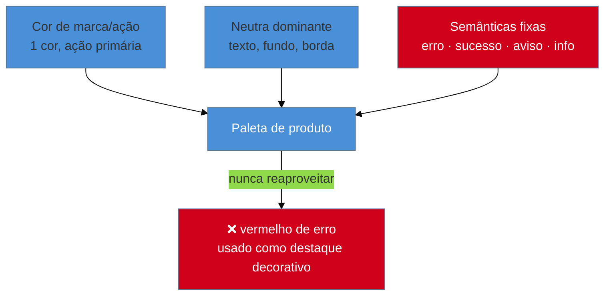

# Cor de produto: OKLCH e paleta semântica

> [!abstract] TL;DR
> **OKLCH** (Björn Ottosson, 2020) é um espaço de cor perceptualmente uniforme — resolve o defeito clássico de HSL, onde a mesma "lightness" numérica produz brilho percebido diferente entre matizes diferentes. Suporte de browser completo desde 2023-2024 (Chrome 111+, Safari 15.4+, Firefox 113+), cobertura global acima de 93% em meados de 2025; Tailwind CSS v4 já gera paleta nativamente em OKLCH. Posição de mercado em 2026: **OKLCH como formato de autoria, HEX como formato de compatibilidade**. Ao lado do espaço de cor, a disciplina que mais evita bug de produto: uma **paleta semântica** — uma cor de marca, uma neutra dominante, e cores semânticas fixas e reservadas para erro/sucesso/aviso, **nunca** reaproveitadas para "destaque" não relacionado. Este capítulo é sobre paleta de **produto**; contraste é acessibilidade, e paleta de dados é outra disciplina — ambas linkadas, nenhuma repetida aqui.

Um design system usa `#EF4444` (vermelho) tanto para o estado de erro de formulário quanto para o selo "Mais vendido" de um card de produto, porque "combinava com a marca" e ninguém pensou nas duas decisões juntas. Meses depois, um teste de usabilidade revela usuários hesitando ao ver o selo "Mais vendido" — alguns relatam, sem conseguir nomear exatamente por quê, uma sensação de "algo está errado com esse produto". A explicação: o vermelho já havia sido condicionado, na mesma interface, a significar "erro" — e o cérebro do usuário generaliza esse significado antes mesmo de ler o texto do selo. O bug não está em nenhuma linha de CSS; está em tratar cor como decisão estética isolada por tela, em vez de como um vocabulário fixo, definido uma única vez para o produto inteiro.

## OKLCH: por que o espaço de cor importa antes da paleta

**OKLCH** — Lightness, Chroma, Hue num modelo perceptualmente uniforme — foi descrito por **Björn Ottosson em 2020**, num artigo técnico sobre espaços de cor para processamento de imagem. A motivação prática, direta para quem constrói paleta: em **HSL**, o modelo de cor mais familiar para quem vem de CSS, o componente "L" (lightness) é uma média matemática simples entre os canais RGB — não corresponde a como o olho humano percebe brilho. O resultado prático: pegar dois matizes diferentes (um azul e um amarelo, por exemplo) com o **mesmo valor numérico** de lightness em HSL produz cores que **parecem** ter brilho visivelmente diferente. Gerar uma escala de tons a partir de HSL — do mais claro ao mais escuro de uma cor — frequentemente produz "saltos" onde um degrau parece desproporcionalmente mais claro ou mais escuro que o vizinho.

OKLCH resolve isso porque o "L" nele **é** calibrado para percepção humana — variar apenas a lightness produz uma progressão que o olho lê como uniforme, independente do matiz de base. Na prática, isso significa que gerar uma escala de 10 tons de uma cor de marca (`brand-50` a `brand-900`) em OKLCH produz uma progressão visualmente suave; a mesma tentativa em HSL exige ajuste manual, tom a tom, para corrigir os saltos perceptuais.

```css
/* HSL: mesma lightness numérica, brilho percebido diferente entre matizes */
--azul-hsl:    hsl(220, 70%, 50%);
--amarelo-hsl: hsl(50, 70%, 50%);  /* parece bem mais claro, mesmo "50%" */

/* OKLCH: mesma lightness numérica, brilho percebido consistente */
--azul-oklch:    oklch(55% 0.18 250);
--amarelo-oklch: oklch(55% 0.18 90);  /* brilho percebido muito mais próximo */
```

O suporte de navegador deixou de ser obstáculo: **Chrome 111+, Safari 15.4+ e Firefox 113+** suportam OKLCH nativamente desde 2023-2024, com cobertura global acima de **93% em meados de 2025**. **Tailwind CSS v4** já gera sua paleta padrão inteiramente em OKLCH; equipes como Linear e o design system "Sail" da Stripe migraram para o formato. A leitura de mercado consolidada em 2026: **OKLCH como formato de autoria** — é nele que o design system pensa e gera a paleta — e **HEX como formato de compatibilidade**, para os poucos contextos legados que ainda exigem.

> [!info] Fronteira: a mecânica de CSS já está coberta em outro lugar
> Como escrever `oklch()` em CSS, como estruturar as variáveis em `:root`, e como usar `@property` para animar cor já é conteúdo de [[03-Dominios/Tecnologia/CSS/07 - Custom properties e design tokens|CSS/07 — Custom properties e design tokens]]. Esta nota não repete essa mecânica — foca na decisão de produto: qual paleta construir e por quê.

## A paleta semântica: um vocabulário, não uma lista de cores bonitas

Uma paleta de produto madura tem uma estrutura pequena e disciplinada:

- **Uma cor de marca/ação** — usada para a ação primária da interface (ver [[03-Dominios/Engenharia/UX/Linguagem Visual e Design System/26 - Hierarquia visual|nota 26]]). Uma só, consistentemente.
- **Uma neutra dominante** — a escala de cinzas (ou cinza com leve tom, "warm gray"/"cool gray") que carrega texto, fundo, borda — a maior parte da interface, na prática.
- **Cores semânticas fixas e reservadas** — erro, sucesso, aviso, informação. Cada uma tem **um único significado**, em todo o produto, sem exceção.

A regra que o cenário de abertura desta nota viola: **nunca reusar o vermelho de erro para "destaque" não relacionado**. Isso vale para qualquer cor semântica — o verde de "sucesso" não deveria aparecer num badge decorativo, o âmbar de "aviso" não deveria virar cor de marketing para uma promoção. O motivo é o mesmo princípio de **similaridade** (Gestalt, [[03-Dominios/Engenharia/UX/Fundamentos e Modelo Mental/05 - Gestalt aplicada a UI|nota 05]]): o usuário aprende, ao longo do uso do produto, que "essa cor = esse significado" — e cada reaproveitamento fora do papel quebra essa promessa implícita, silenciosamente, sem nenhum erro técnico visível.



## As duas fronteiras: contraste e dados

Este é um dos pontos de maior risco de duplicação do sub-galho inteiro, e vale nomear as duas fronteiras com precisão:

**Contraste é acessibilidade, não paleta de produto.** A pergunta "essa cor de texto tem contraste suficiente contra esse fundo" — os números 4.5:1 e 3:1 do WCAG — já está coberta em profundidade em [[03-Dominios/Tecnologia/Acessibilidade/Construir Acessível/11 - Cor, contraste e visual acessível|Acessibilidade/11]]. Esta nota não recalcula essa fórmula; a relação entre as duas é operacional: **a paleta semântica desta nota é o que se testa contra o contraste daquela nota** — a decisão de "qual é o vermelho de erro" é de produto (aqui); a confirmação de que esse vermelho específico passa em 4.5:1 sobre o fundo escolhido é acessibilidade (lá).

**Paleta de dados é outra disciplina, com outra régua.** Escolher cores categóricas, sequenciais ou divergentes para um gráfico — onde o requisito é diferenciação perceptual entre séries, não hierarquia de marca — é o escopo da skill `dataviz` do vault. Uma paleta de produto bem-feita não serve automaticamente como paleta de gráfico: cores de marca costumam ser poucas e hierárquicas (uma domina); um gráfico com 6 séries precisa de 6 cores igualmente distinguíveis entre si, sem hierarquia. São dois problemas diferentes, resolvidos com ferramentas diferentes.

## Praticável sozinho vs. exige time

Definir uma paleta semântica pequena — uma cor de marca, uma neutra, quatro cores de estado — e migrar o CSS existente para usá-la via tokens é trabalho de uma pessoa, tipicamente concluído em um a dois dias incluindo a auditoria do código legado. Gerar a escala de tons em OKLCH (`brand-50` a `brand-900`) também é mecânico: qualquer gerador de paleta OKLCH online produz a progressão perceptualmente uniforme a partir de um único tom-base, sem exigir conhecimento de teoria de cor além do que esta nota já cobriu.

O que exige mais estrutura é **pesquisa de percepção de cor específica de marca** — testar com usuários reais se a cor de marca escolhida comunica os atributos pretendidos (confiança, energia, seriedade) de forma consistente entre culturas e contextos, algo que agências de branding fazem com estudo qualitativo e não com intuição de engenharia. Da mesma forma, **auditoria formal de acessibilidade de cor para daltonismo em escala** (simulação de todos os tipos de deficiência de visão de cor contra toda a paleta, com ferramenta dedicada e revisão humana) é trabalho que se beneficia de quem tem prática específica nisso — embora a checagem básica de contraste, coberta em Acessibilidade/11, seja perfeitamente praticável sozinho.

## Casos práticos

### Cenário 1: o vermelho reaproveitado
Um produto de e-commerce usa `--color-error: oklch(55% 0.22 25)` (vermelho) para mensagens de erro de formulário. Um designer, mais tarde, aplica a mesma cor a um selo "Últimas unidades!" num card de produto, sem consultar o token — só copiando o valor hex que "ficava bom". Um teste de usabilidade revela hesitação inexplicada de usuários ao ver o selo. O que dá errado: o vermelho já carrega significado condicionado de "erro" na mesma interface; reaproveitá-lo para urgência de estoque colide com esse significado, mesmo que a intenção (chamar atenção) pareça compatível. A correção específica: introduz-se uma cor de "urgência/destaque" distinta — âmbar ou laranja, nunca a mesma família do vermelho de erro — documentada como token separado desde o início, com seu próprio significado reservado.

### Cenário 2: a escala de tons gerada em HSL com saltos perceptuais
Um time gera a escala de 9 tons da cor de marca (`brand-100` a `brand-900`) manipulando apenas o parâmetro de lightness em HSL, do mais claro ao mais escuro. Visualmente, dois dos tons do meio da escala (`brand-400` e `brand-500`) parecem quase idênticos, enquanto o salto entre `brand-600` e `brand-700` parece brusco demais. O que dá errado: HSL não é perceptualmente uniforme — variar a lightness numérica de forma linear não produz brilho percebido linear, então a escala "matematicamente uniforme" produz uma progressão visualmente irregular. A correção específica: regenerar a mesma escala em OKLCH, variando apenas o canal L de forma linear — a progressão passa a ser visualmente suave sem nenhum ajuste manual tom a tom.

### Cenário 3: a cor de dado usada como cor de interface
Um dashboard usa as mesmas 6 cores categóricas de um gráfico de pizza (escolhidas para diferenciação perceptual entre séries) também como cores de botões e badges na interface ao redor do gráfico, "para combinar visualmente". O resultado: a interface parece caótica, sem hierarquia, porque as 6 cores foram escolhidas para serem igualmente distinguíveis entre si — nenhuma domina, nenhuma comunica "esta é a ação principal". O que dá errado: paleta de dados otimiza para diferenciação horizontal entre categorias sem hierarquia; paleta de produto precisa do oposto, uma cor dominante que sinalize importância. A correção específica: a paleta de produto (marca, neutra, semânticas) fica isolada das cores do gráfico; o gráfico usa sua própria paleta categórica, dimensionada pela skill `dataviz`, sem vazar para os componentes de interface ao redor.

## Armadilhas comuns

> [!warning] Reusar cor semântica fora do seu significado
> **O que acontece:** uma cor reservada — erro, sucesso, aviso — é reaproveitada para um propósito decorativo ou de destaque não relacionado, porque "combinava" ou "estava disponível na paleta". **Por quê:** pelo princípio de similaridade, o usuário aprende ao longo do uso que aquela cor tem um significado fixo; reaproveitá-la fora do papel quebra essa expectativa de forma silenciosa — não gera erro técnico, gera confusão perceptual difícil de rastrear até a causa. **Como evitar:** trate cada cor semântica como um token de significado único, documentado, e proíba seu uso fora do contexto declarado — se falta uma cor para um novo propósito, crie um token novo, não reaproveite um existente.

> [!warning] Gerar escala de tons em HSL e aceitar os saltos perceptuais
> **O que acontece:** a escala de 9-10 tons de uma cor é gerada variando lightness em HSL, e alguns degraus parecem visualmente desproporcionais aos vizinhos. **Por quê:** HSL não é perceptualmente uniforme — a mesma variação numérica de lightness produz brilho percebido diferente dependendo do matiz e da posição na escala. **Como evitar:** gere (ou regenere) a escala em OKLCH, variando apenas o canal L linearmente; a progressão perceptual sai suave sem ajuste manual.

> [!warning] Confundir paleta de produto com paleta de dados
> **O que acontece:** as cores escolhidas para diferenciar séries num gráfico (skill `dataviz`) são reaproveitadas como cores de componentes de interface, ou vice-versa. **Por quê:** os dois problemas têm requisitos opostos — paleta de produto precisa de hierarquia (uma cor domina); paleta de dados precisa de igualdade perceptual entre categorias (nenhuma domina). Misturar as duas produz interface sem hierarquia clara ou gráfico com séries de peso desigual. **Como evitar:** mantenha os dois sistemas de cor isolados — tokens de produto num namespace, paleta de gráfico noutro — mesmo que compartilhem o mesmo espaço de cor (OKLCH) como formato técnico.

> [!tip] Vídeo — Por que todo mundo está falando de OKLCH
> [**Why everyone is talking about OKLCH**](https://www.youtube.com/watch?v=kVi9Augt7HY) (Coding in Public, ~12 min) percorre os quatro benefícios práticos de OKLCH sobre HSL/RGB, com comparação lado a lado e suporte de browser atualizado — reforça com demonstração visual o mecanismo perceptual que esta nota explica em texto. Trecho de destaque [0:21]: *"this has been supported now for two or even three years in most modern browsers... it gives you a huge range of color options that are far beyond what RGB or hex can give you."*
>
> 🎬 [Assistir no YouTube](https://www.youtube.com/watch?v=kVi9Augt7HY)

## Como explicar em inglês

> "OKLCH is a perceptually uniform color space — Björn Ottosson, 2020 — that fixes HSL's core flaw: the same numeric lightness value produces visibly different perceived brightness across hues. Browser support has been complete since 2023-2024, and by 2026 the market position is settled: OKLCH for authoring, HEX for legacy compatibility. On top of the color space sits a semantic palette discipline — one brand color, one dominant neutral, and fixed semantic colors for error/success/warning that are never reused for unrelated emphasis. That's product color; contrast ratio is accessibility's job, and chart color is a separate discipline with opposite requirements — no hierarchy, just perceptual distinction between categories."

| PT | EN |
|----|----|
| espaço de cor | color space |
| percepção uniforme | perceptual uniformity |
| escala de tons | color scale / tint-shade scale |
| paleta semântica | semantic palette |
| cor de marca/ação | brand/action color |
| neutra dominante | dominant neutral |
| paleta de dados | data/chart palette |

## O que vem a seguir

Com hierarquia, escala e cor definidas, a peça que falta é a que **conecta as três a um sistema formal**: como esses valores viram tokens versionados, com camadas — não uma pilha de variáveis soltas. É o assunto da próxima nota, e é onde o sub-galho passa de "boas práticas visuais" para "arquitetura de sistema".

- [[03-Dominios/Engenharia/UX/Linguagem Visual e Design System/29 - Design tokens como sistema|29 — Design tokens como sistema]] — a hierarquia primitivo → semântico → componente que evita o "token soup".

## Fontes

- **Björn Ottosson** — [*A perceptual color space for image processing*](https://bottosson.github.io/posts/oklab/) (2020) — origem técnica do modelo OKLab/OKLCH.
- **Evil Martians** — [*OKLCH in CSS: why we moved from RGB and HSL*](https://evilmartians.com/chronicles/oklch-in-css-why-quit-rgb-hsl) — motivação prática de migração e comparação lado a lado com HSL.
- **Coding in Public** — [*Why everyone is talking about OKLCH* (vídeo)](https://www.youtube.com/watch?v=kVi9Augt7HY) — os quatro benefícios práticos e suporte de browser.
