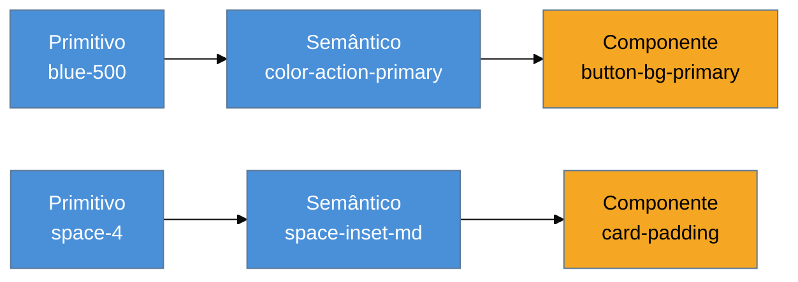

# Design tokens como sistema

> [!abstract] TL;DR
> Um design token é um valor de design nomeado e versionado — mas ter tokens não é ter um **sistema**. O sistema nasce da hierarquia **primitivo → semântico → componente**: `blue-500` (primitivo, valor bruto) alimenta `color-action-primary` (semântico, papel) que alimenta `button-bg-primary` (componente, uso específico). Sem essa hierarquia, o resultado é **token soup** — tokens demais, sem camadas, indireção sem ganho de manutenibilidade. O **W3C Design Tokens Community Group (DTCG)** define um formato JSON (`$value`/`$type`) que atingiu primeira versão estável em outubro de 2025 — mas **segue como Community Group Report, não como padrão W3C oficial nem Standards Track**; afirmar "padrão W3C" é erro factual. Style Dictionary é a ferramenta de build mais citada para consumir esse formato — mencionada aqui, desenvolvida em `Tooling e Build`.

Um design system cresce organicamente ao longo de dois anos: começou com uma dúzia de custom properties (`--color-primary`, `--space-md`) e hoje tem **340 tokens** — cores, espaçamentos, sombras, raios de borda, cada componente com suas próprias variantes. Um novo desenvolvedor precisa mudar a cor de um botão de "sucesso" e encontra três candidatos plausíveis: `--green-600`, `--color-success`, `--button-success-bg`. Ele escolhe um, muda, e o botão de outra tela — que usava um dos outros dois — não muda junto. O sistema não tem bug de código: tem 340 nomes sem relação declarada entre si. Ter uma variável CSS para cada valor não é ter um sistema de tokens — é ter uma planilha disfarçada de CSS.

## O que um token é, e por que "ter tokens" não basta

Um design token é, na definição mais simples, **um valor de design com nome** — `--color-primary: oklch(60% 0.18 250)` é um token. A mecânica de declarar, escopar e consumir esse valor em CSS puro já está coberta em [[03-Dominios/Tecnologia/CSS/07 - Custom properties e design tokens|CSS/07 — Custom properties e design tokens]], e este capítulo não repete essa mecânica. O que falta na maioria dos design systems não é a técnica de declarar variáveis — é a **arquitetura** que organiza centenas delas em camadas com propósito diferente.

**Origem do conceito:** tokens como fonte única de verdade, desacoplada de plataforma, remonta ao **Salesforce Lightning Design System**, atribuído sobretudo a **Jina Anne**, por volta de 2014-2016 — a ideia original era permitir que o mesmo valor de design alimentasse simultaneamente CSS, iOS e Android sem reescrever a paleta três vezes. É essa motivação original — uma fonte, múltiplas plataformas — que explica por que tokens vivem tipicamente em JSON, não direto em CSS: JSON é a camada neutra de onde ferramentas de build geram a saída específica de cada plataforma.

## A hierarquia que é o coração da nota: primitivo → semântico → componente

Um sistema de tokens maduro tem **três camadas**, cada uma com um papel diferente e nenhuma pulável:

**Primitivo** — o valor bruto, sem significado de uso. `blue-500`, `space-4`, `gray-900`. Uma escala inteira de cores e espaçamentos vive aqui, gerada como a [[03-Dominios/Engenharia/UX/Linguagem Visual e Design System/27 - Escalas de tipografia, espaçamento e densidade|nota 27]] descreveu e usando o espaço de cor da [[03-Dominios/Engenharia/UX/Linguagem Visual e Design System/28 - Cor de produto - OKLCH e paleta semântica|nota 28]]. Ninguém consome um primitivo diretamente num componente — ele é matéria-prima.

**Semântico** — o papel que um primitivo desempenha no produto. `color-action-primary` aponta para `blue-500`; `color-danger` aponta para outro primitivo. É aqui que a paleta semântica da nota 28 (marca, neutra, erro/sucesso/aviso) ganha forma de token. A camada semântica é o que muda quando o produto troca de tema (light/dark) ou de marca (white-label) — os primitivos continuam os mesmos, os mapeamentos semânticos mudam.

**Componente** — o uso específico dentro de um componente da interface. `button-bg-primary` aponta para `color-action-primary`; `card-border` aponta para um token semântico de borda. Esta camada existe para permitir que um componente específico se desvie do padrão semântico sem quebrar a cadeia — mas só quando há motivo real, não por padrão.



Sem essa hierarquia, o resultado é **token soup**: tokens demais, sem camada declarada entre eles, indireção que não compra manutenibilidade nenhuma — exatamente o produto do cenário de abertura, com 340 nomes competindo pelo mesmo significado.

> [!question]- Por que não simplificar e usar só primitivos direto nos componentes?
> Porque a camada semântica é o que absorve mudança sem propagar reescrita. Se `button-bg-primary` apontasse direto para `blue-500`, trocar a cor de marca do produto (rebrand, white-label, dark mode) exigiria caçar cada componente que usa `blue-500` e decidir, um por um, se aquele uso específico deveria mudar. Com a camada semântica no meio, muda-se **um** mapeamento (`color-action-primary` passa a apontar para outro primitivo) e toda a cadeia de componentes que dependem dele muda junto, automaticamente. É o mesmo raciocínio de indireção controlada que existe em qualquer arquitetura de software — só que aplicado a valores de design em vez de código.

## DTCG: o formato, com precisão sobre o que ele é

O **W3C Design Tokens Community Group (DTCG)** define um formato de intercâmbio para tokens em **JSON**, com uma sintaxe baseada em `$value` e `$type`:

```json
{
  "color": {
    "brand": {
      "500": { "$value": "oklch(60% 0.18 250)", "$type": "color" }
    },
    "action-primary": {
      "$value": "{color.brand.500}",
      "$type": "color"
    }
  }
}
```

A referência entre chaves (`{color.brand.500}`) é como o token semântico aponta para o primitivo dentro do próprio formato — a hierarquia da seção anterior, expressa em JSON.

> [!warning] Precisão obrigatória: DTCG não é "padrão W3C"
> A especificação de tokens de design **atingiu sua primeira versão estável em outubro de 2025** ("Design Tokens Format Module 2025.10") — um marco real, depois de cinco anos coletando casos de uso da comunidade e três rascunhos iterados. Mas o grupo que a mantém é um **W3C Community Group**, não um Working Group no **W3C Standards Track**. Um Community Group Report não passa pelo processo formal de padronização do W3C — é um consenso de mercado publicado sob o guarda-chuva do W3C, não uma recomendação oficial. Dizer "é padrão W3C" é impreciso; a formulação correta é "é o formato consolidado pelo grupo de trabalho de design tokens hospedado no W3C, sem ainda ser padrão formal". A distinção importa porque aparece em conversa técnica sênior: confundir os dois é o mesmo tipo de erro que confundir um RFC de rascunho com um RFC padronizado.

O formato é implementado por um ecossistema de ferramentas que valeria nomear sem desenvolver: **Style Dictionary**, **Tokens Studio**, **Theo**, **Specify**, **Supernova**, **Penpot**. Entre elas, **Style Dictionary é especificamente a ferramenta de build** — o passo que transforma o JSON de tokens em saída específica de plataforma (CSS custom properties, iOS, Android, Compose). Esta nota não desenvolve o uso de Style Dictionary; ele é candidato natural a uma nota própria em `Tecnologia/Tooling e Build` — aqui, o interesse é a arquitetura de camadas que qualquer ferramenta de build consome, não a ferramenta em si.

## Praticável sozinho vs. exige time

Estruturar a hierarquia primitivo → semântico → componente para um design system pequeno a médio — dezenas a poucas centenas de tokens — é trabalho de arquitetura que uma pessoa consegue projetar e implementar sozinha, com disciplina de nomenclatura e revisão do próprio código. O ganho aparece rápido: a primeira vez que uma mudança de marca ou de tema exige tocar só a camada semântica, em vez de caçar componente por componente, o investimento se paga. Adotar o formato DTCG (JSON com `$value`/`$type`) para armazenar esses tokens, mesmo sem toda a cadeia de build automatizada, também é praticável sozinho — é estrutura de arquivo, não infraestrutura.

O que exige mais estrutura é **operar um pipeline de build de tokens multi-plataforma em produção** — Style Dictionary gerando saída simultânea para CSS, iOS nativo e Android nativo, com testes de regressão garantindo que uma mudança de token não quebra nenhuma plataforma silenciosamente. Isso é investimento de infraestrutura que só se justifica quando o produto realmente tem múltiplas plataformas nativas consumindo o mesmo design system — para um produto web único, a camada de build formal costuma ser complexidade adiantada demais. Da mesma forma, **governar contribuição de tokens em escala** (quem pode propor um novo token, revisão de nomenclatura, processo de depreciação) é trabalho de equipe de design system, não de uma pessoa só — mas isso é o assunto da última nota deste sub-galho, não desta.

## Casos práticos

### Cenário 1: os 340 tokens sem hierarquia
O sistema do cenário de abertura é auditado: 340 custom properties, quase todas no mesmo nível — sem prefixo que distinga primitivo de semântico de componente. Um engenheiro precisa mudar a cor de "sucesso" e encontra três candidatos (`--green-600`, `--color-success`, `--button-success-bg`) sem relação declarada entre eles no código-fonte. O que dá errado: os três provavelmente foram criados em momentos diferentes, por pessoas diferentes, sem que nenhuma delas soubesse que as outras duas já existiam — sintoma clássico de token soup. A correção específica: uma auditoria de uma sessão categoriza os 340 tokens existentes nas três camadas, elimina duplicatas óbvias, e estabelece a convenção de nomenclatura (`{camada}-{papel}-{variante}`) daqui para frente — sem reescrever tudo de uma vez, só parando a sangria.

### Cenário 2: o rebrand que exigiu tocar 60 arquivos
Um produto B2B muda a cor de marca principal, de azul para verde, para acompanhar um reposicionamento de marketing. O design system não tinha camada semântica — os componentes usavam `blue-500` diretamente. A mudança exige localizar e revisar, um por um, 60 arquivos de componente que referenciavam `blue-500`, decidindo caso a caso se aquele uso específico deveria virar verde ou permanecer azul (nem todo uso de azul era "cor de marca" — alguns eram links, outros eram ícones informativos). O que dá errado: sem indireção semântica, a mudança de marca virou uma migração manual, item a item, com risco alto de esquecer algum uso. A correção específica (para a próxima vez): introduzir a camada semântica retroativamente — `color-action-primary` apontando para `blue-500` — antes de qualquer rebranding futuro, de forma que a próxima mudança de marca seja **um único mapeamento**, não sessenta revisões manuais.

### Cenário 3: o token JSON que "parece" padrão mas confunde a conversa técnica
Um engenheiro, preparando uma entrevista técnica sênior, descreve seu design system dizendo "seguimos o padrão W3C de design tokens" — e um entrevistador que acompanha o assunto de perto pergunta, em seguida, se o candidato sabe qual é o status formal dessa especificação no W3C. O candidato não sabe responder com precisão. O que dá errado: a formulação "padrão W3C" é factualmente imprecisa — o DTCG é um Community Group Report, não uma recomendação formal do W3C Standards Track — e a imprecisão vira um ponto negativo justamente no momento em que o candidato tentava demonstrar profundidade. A correção específica: descrever o formato como "o padrão de fato do mercado, mantido pelo Design Tokens Community Group hospedado no W3C, que chegou à primeira versão estável em outubro de 2025 como Community Group Report" — mais longo, mas correto, e demonstra exatamente o tipo de precisão que um entrevistador sênior valoriza.

## Armadilhas comuns

> [!warning] Token soup: tokens demais, sem camada
> **O que acontece:** o número de tokens cresce ao longo do tempo sem nenhuma hierarquia declarada entre eles — cada novo token nasce isolado, resolvendo um problema pontual, sem relação com os tokens já existentes.
> **Por quê:** sem a camada semântica intermediária, cada token vira um valor solto — a indireção não compra nada, porque não existe um ponto único de mudança que propague para múltiplos usos.
> **Como evitar:** ao criar um token novo, pergunte explicitamente em que camada ele vive — primitivo, semântico ou componente — e resista à tentação de pular direto para um token de componente sem passar pelo semântico.

> [!warning] Afirmar que DTCG é "padrão W3C oficial"
> **O que acontece:** a especificação de design tokens é descrita como "padrão W3C", em documentação interna ou em conversa técnica, sem qualificação.
> **Por quê:** o grupo que mantém a especificação é um Community Group, não um Working Group no Standards Track — a diferença de status formal é real e checável, e afirmar o contrário é um erro factual que um interlocutor informado vai notar.
> **Como evitar:** use a formulação precisa — "Community Group Report do W3C, primeira versão estável em outubro de 2025" — especialmente em contexto de entrevista técnica, onde precisão sobre o status de uma especificação sinaliza profundidade real.

> [!warning] Desenvolver o pipeline de build antes de ter a hierarquia certa
> **O que acontece:** o time investe semanas configurando Style Dictionary para gerar saída multi-plataforma antes de decidir a hierarquia primitivo → semântico → componente dos próprios tokens.
> **Por quê:** a ferramenta de build automatiza a **distribuição** de tokens que já têm uma arquitetura correta — automatizar a distribuição de um token soup só produz token soup mais rápido, em mais plataformas.
> **Como evitar:** resolva a hierarquia e a nomenclatura primeiro, com um punhado de tokens bem estruturados; só then vale investir em automação de build — que fica melhor detalhada em `Tecnologia/Tooling e Build`, não aqui.

> [!tip] Vídeo — O lançamento da versão estável do DTCG
> [**DTCG W3C release and adapting design systems for multiple brands**](https://www.youtube.com/watch?v=XI8cjfw8rt8) (Schema by Figma 2025, ~21 min) — Kaelig Deloumeau-Prigent, co-chair do Design Tokens Community Group, anuncia a primeira versão estável da especificação e discute como ela sustenta a hierarquia primitivo → semântico → componente em produtos multi-marca. **Atenção:** o próprio orador se refere ao grupo como "community group" — o vídeo é fonte primária boa para a mecânica e a motivação do formato, mas a precisão sobre o status formal ("Community Group Report, não Standards Track") é acréscimo desta nota, não algo enfatizado no vídeo. Trecho de destaque [1:42]: *"we form the design tokens... community group. Our mission is to standardize how design tokens are defined and exchanged across the industry."*
>
> 🎬 [Assistir no YouTube](https://www.youtube.com/watch?v=XI8cjfw8rt8)

## Como explicar em inglês

> "A design token is a named design value, but having tokens isn't the same as having a token *system*. The system comes from a three-layer hierarchy — primitive (`blue-500`), semantic (`color-action-primary`), and component (`button-bg-primary`) — which is what lets a single semantic remap propagate everywhere instead of requiring a manual find-and-replace across every component. The W3C Design Tokens Community Group format — `$value`/`$type` JSON — reached its first stable version in October 2025, but it's still a Community Group Report, not an official W3C standard on the Standards Track. That distinction matters in a senior interview: it's the difference between 'de facto industry format' and 'formally ratified standard'."

| PT | EN |
|----|----|
| primitivo / semântico / componente | primitive / semantic / component |
| token soup | token soup |
| indireção | indirection |
| formato de intercâmbio | interchange format |
| Community Group Report | Community Group Report |
| padrão / recomendação formal | standard / formal recommendation |
| governança de tokens | token governance |

## O que vem a seguir

Tokens organizam os valores; a próxima decisão é como organizar os **componentes** que consomem esses valores — e aqui o sub-galho entra na crítica mais debatida do momento: o que sobrevive da metáfora do Atomic Design de Brad Frost, dez anos depois, e o que virou debate de nomenclatura improdutivo.

- [[03-Dominios/Engenharia/UX/Linguagem Visual e Design System/30 - Atomic Design - o que ainda vale|30 — Atomic Design: o que ainda vale]] — a metáfora que sobrevive e a taxonomia rígida que envelheceu.

## Fontes

- **Jina Anne** — origem do conceito de design tokens no Salesforce Lightning Design System (~2014-2016) — a motivação de fonte única de verdade multi-plataforma.
- **Design Tokens Community Group (W3C)** — [*Design Tokens Format Module*](https://www.w3.org/community/design-tokens/) — especificação `$value`/`$type`, primeira versão estável publicada em [outubro de 2025](https://www.w3.org/community/design-tokens/2025/10/28/design-tokens-specification-reaches-first-stable-version/); Community Group Report, não Standards Track.
- **Figma (Schema 2025)** — [*DTCG W3C release and adapting design systems for multiple brands* (vídeo)](https://www.youtube.com/watch?v=XI8cjfw8rt8) — anúncio da primeira versão estável, com Kaelig Deloumeau-Prigent.
