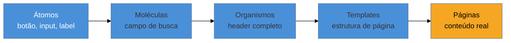

# Atomic Design: o que ainda vale

> [!abstract] TL;DR
> **Brad Frost** publicou o conceito em artigo (2013) e depois em livro auto-publicado (**2016**): interfaces se organizam em **átomos → moléculas → organismos → templates → páginas**, uma metáfora emprestada da química. Mais de dez anos depois, o consenso de 2025-2026 é dividido: sobrevive a **metáfora funcional** — UI é interconectada, composta de partes reutilizáveis, e pensar em camadas de composição continua útil. Envelheceu mal a **taxonomia rígida** — o debate "isto é átomo ou molécula?" virou discussão improdutiva de nomenclatura, e a hierarquia de cinco níveis não escala bem para sistemas multi-marca. O próprio Frost evoluiu o discurso — "não é sobre os rótulos, é sobre o modelo mental" — e hoje discute conceitos "subatômicos" (tokens abaixo dos átomos) e, mais recentemente, design systems operados por agentes de IA.

Um time adota Atomic Design com rigor no início de um design system novo. Toda reunião de revisão de componente inclui a pergunta "isso é um átomo ou uma molécula?" — e a resposta nem sempre é óbvia. Um campo de busca com ícone e placeholder: átomo (é um único controle funcional) ou molécula (é composto de input + ícone + label)? A discussão consome vinte minutos da reunião, recorrente, sem nunca se resolver de forma satisfatória para todo mundo. Seis meses depois, o time tem uma pasta `molecules/` com 40 componentes e uma pasta `atoms/` com 15 — a fronteira entre as duas nunca ficou clara, e novos membros do time perguntam a mesma coisa a cada componente novo. O sistema funciona (os componentes renderizam, o produto está no ar), mas a taxonomia virou um imposto cognitivo recorrente que ninguém sabe mais justificar.

## A metáfora original, e por que ela pegou

**Brad Frost** publicou "Atomic Design" como artigo em 2013 e, três anos depois, como livro auto-publicado (**2016**). A metáfora é emprestada da química: átomos são os blocos indivisíveis (um botão, um label, um input isolado); moléculas combinam átomos em unidades funcionais simples (um campo de busca = input + botão); organismos combinam moléculas em seções complexas e relativamente autônomas (um header completo, com logo, navegação e busca); templates arranjam organismos numa estrutura de página sem conteúdo real; páginas são templates com conteúdo real, o produto final visível.

A força original da metáfora, e o motivo pelo qual ela dominou a conversa de design systems por quase uma década: ela deu um **vocabulário compartilhado** entre design e engenharia para falar sobre composição — antes dela, "componente" era um termo genérico demais, usado indistintamente para um botão isolado e para uma página inteira. Ter cinco níveis nomeados permitiu conversas mais precisas sobre onde uma mudança deveria acontecer.

## O que sobrevive: a metáfora funcional

O consenso que se consolidou entre 2025 e 2026, e que é o ponto real desta nota, separa duas coisas que o Atomic Design original apresentava fundidas: a **ideia** de que interfaces são compostas hierarquicamente de partes reutilizáveis, e a **taxonomia** de cinco rótulos específicos para nomear essas camadas.

A ideia sobrevive bem, e continua sendo o jeito mais produtivo de pensar composição de UI: **um componente complexo é feito de componentes mais simples, que são reutilizados em múltiplos contextos**. Nenhum design system moderno — inclusive os que abandonaram os nomes "átomo/molécula/organismo" — abandonou essa ideia estrutural. Radix, shadcn/ui, Mantine (já cobertos com comparação técnica em [[03-Dominios/Tecnologia/React/Ecossistema/03 - Component libraries e design systems|React/Ecossistema/03]]) organizam seus componentes exatamente nessa lógica de composição, mesmo chamando as camadas de "primitives" e "components" em vez de "átomos" e "moléculas".

## O que envelheceu: a taxonomia rígida

O que não sobreviveu bem ao teste do tempo é a insistência em classificar **cada componente** dentro de um dos cinco rótulos, de forma exaustiva e sem ambiguidade. Três problemas concretos, que apareceram de forma consistente na crítica de mercado dos últimos anos:

**A pergunta "isto é átomo ou molécula?" vira debate improdutivo de nomenclatura**, como no cenário de abertura desta nota — tempo de reunião gasto em classificação, não em decisão de produto. A fronteira entre os níveis é genuinamente ambígua para muitos componentes reais (um input com validação embutida é um átomo "enriquecido" ou já uma molécula?), e insistir numa resposta única raramente agrega valor à decisão real, que é "esse componente deveria ser reutilizável, e onde ele deveria viver no código".

**A hierarquia de cinco níveis não escala bem para sistemas multi-marca.** Quando o mesmo design system alimenta produtos com identidades visuais diferentes (white-label, multi-tenant), a rigidez da taxonomia atômica — pensada originalmente para um produto único — se torna um obstáculo a mais, não uma ajuda; a pergunta relevante deixa de ser "isso é átomo ou organismo" e passa a ser "isso é primitivo compartilhado entre marcas ou específico de uma marca", uma distinção que a taxonomia original não modela diretamente.

**O próprio Frost mudou de posição.** Em talks recentes — incluindo "Is Atomic Design Dead?", apresentada em múltiplas conferências entre 2023 e 2024 — Frost reconhece publicamente que a discussão de rótulos consumiu energia desproporcional ao valor que ela entrega, e reformula o argumento central: "não é sobre os rótulos, é sobre o modelo mental" de composição. Ele passou a explorar conceitos "subatômicos" — tokens de design como a camada **abaixo** dos átomos (conectando diretamente com a hierarquia primitivo → semântico → componente da [[03-Dominios/Engenharia/UX/Linguagem Visual e Design System/29 - Design tokens como sistema|nota 29]]) — e, mais recentemente, discute design systems operados por **agentes de IA**, com cursos específicos sobre o tema ("Agentic Design Systems", "AI and Design Systems", novembro de 2025).

> [!question]- Se a taxonomia envelheceu, vale a pena adotar Atomic Design hoje, do zero?
> Vale adotar a **ideia** — pensar em camadas de composição, do mais simples ao mais complexo — sem se comprometer religiosamente com os cinco rótulos exatos. Muitos design systems bem-sucedidos de 2026 usam nomenclatura própria e mais direta: "primitives" (equivalente a átomos), "components" (moléculas/organismos fundidos), "patterns" ou "templates" (o resto). A postura equilibrada desta nota é: use a metáfora para pensar, não para classificar burocraticamente cada arquivo do repositório.

## Praticável sozinho vs. exige time

Adotar a metáfora de composição — pensar deliberadamente em quais partes de uma interface deveriam ser extraídas como reutilizáveis, e organizar o código-fonte em camadas de complexidade crescente — é decisão de arquitetura que uma pessoa toma sozinha, ao estruturar as pastas do projeto (`primitives/`, `components/`, `patterns/`, sem necessariamente usar os nomes originais). Não exige aprovação de comitê, e o ganho de organização aparece desde o primeiro componente extraído corretamente.

O que não vale a pena investir tempo sozinho — e é o ponto prático mais direto desta nota — é **impor e manter uma taxonomia rígida de cinco níveis com fronteiras exaustivamente documentadas**, revisada em cada pull request. Esse nível de formalismo taxonômico é trabalho que só se paga em times grandes, com múltiplos designers e engenheiros que precisam de vocabulário absolutamente unívoco para se coordenar em escala — e mesmo nesses times, a crítica de mercado sugere que o retorno é questionável. Para uma pessoa ou um time pequeno, a energia gasta debatendo "átomo ou molécula" é melhor investida decidindo se o componente deveria existir como reutilizável ou não.

## Casos práticos

### Cenário 1: os vinte minutos recorrentes de "átomo ou molécula"
O time do cenário de abertura desta nota decide, depois de seis meses, abandonar a classificação estrita e adotar apenas duas pastas: `primitives/` (componentes de baixo nível, sem lógica de negócio) e `components/` (tudo que compõe primitivos com alguma lógica ou contexto específico do produto). O que dava errado antes: a terceira categoria intermediária ("molécula" vs "organismo") exigia uma decisão de nomenclatura que ninguém conseguia justificar de forma consistente, gerando debate recorrente sem valor de produto. A correção específica: reduzir para duas camadas resolveu 90% da ambiguidade, porque a pergunta relevante ("isso é reutilizável genérico ou específico do produto?") tem resposta mais clara que a pergunta original de cinco níveis.

### Cenário 2: o design system multi-marca que travou na taxonomia
Uma agência mantém um único design system para três clientes com identidades visuais completamente diferentes. A taxonomia atômica original — pensada para um produto único — não modela a distinção entre "isto é compartilhado entre as três marcas" e "isto é customização específica de uma marca". O time tenta forçar essa distinção dentro da hierarquia átomo/molécula/organismo e o resultado é confuso: componentes compartilhados e componentes de marca ficam misturados nas mesmas pastas nomeadas por nível atômico. O que dá errado: a taxonomia responde "qual é o nível de composição" mas não responde "qual é o escopo de propriedade" (compartilhado vs. específico de marca) — são duas perguntas diferentes que a metáfora original não separa. A correção específica: introduzir uma segunda dimensão ortogonal — `shared/` vs `brand-x/`, cruzada com o nível de composição — resolvendo o problema real sem descartar a ideia de composição em camadas.

### Cenário 3: o componente "átomo" que na verdade guardava lógica de negócio
Um `Button` é classificado como átomo (por definição, o nível mais simples) mas, ao longo do tempo, acumula lógica específica de domínio — validação de permissão do usuário, tracking de analytics condicional ao tipo de botão. Um novo desenvolvedor, confiando no rótulo "átomo = componente simples e genérico", assume que pode reutilizá-lo livremente em qualquer contexto sem ler o código — e introduz um bug porque a lógica de permissão embutida não fazia sentido no novo contexto. O que dá errado: o rótulo taxonômico ("átomo") criou uma expectativa de simplicidade que o componente real não cumpria mais — a taxonomia mentiu sobre a complexidade real do código. A correção específica: separar a lógica de domínio (permissão, tracking) do componente visual puro, movendo-a para um componente de nível superior que envolve o botão genérico — restaurando a promessa implícita que o rótulo "átomo" deveria carregar, em vez de confiar cegamente no nome da pasta.

## Armadilhas comuns

> [!warning] Debate improdutivo de "isto é átomo ou molécula?"
> **O que acontece:** reuniões de revisão de componente gastam tempo recorrente classificando cada peça nova dentro dos cinco níveis, sem que a classificação mude a decisão de produto ou de arquitetura.
> **Por quê:** a fronteira entre os níveis é genuinamente ambígua para boa parte dos componentes reais — insistir numa resposta exaustiva trata uma metáfora heurística como se fosse uma regra formal com resposta única.
> **Como evitar:** reduza o número de camadas nomeadas (duas ou três costuma bastar) e trate a classificação como ferramenta de comunicação, não como taxonomia a ser defendida com rigor acadêmico.

> [!warning] Taxonomia rígida travando um sistema multi-marca
> **O que acontece:** um design system que serve múltiplas marcas ou produtos tenta se encaixar na hierarquia atômica original, pensada para um produto único, e a distinção entre "compartilhado" e "específico de marca" se perde dentro dos cinco níveis.
> **Por quê:** a metáfora original não modela escopo de propriedade — só nível de composição — então forçar as duas perguntas dentro da mesma taxonomia produz confusão.
> **Como evitar:** trate escopo (compartilhado vs. específico) como uma dimensão separada e ortogonal ao nível de composição, em vez de tentar espremer as duas perguntas na mesma hierarquia de pastas.

> [!warning] Confiar no rótulo "átomo" como garantia de simplicidade
> **O que acontece:** um componente classificado como átomo acumula lógica de negócio ao longo do tempo, mas o rótulo permanece — e desenvolvedores novos confiam no nome em vez de ler o código antes de reutilizar.
> **Por quê:** a taxonomia é uma classificação estática, feita uma vez; o código real evolui e pode deixar de corresponder ao rótulo original, sem que ninguém atualize a classificação junto.
> **Como evitar:** revise periodicamente se componentes de baixo nível ainda são genéricos o suficiente para o rótulo que carregam; se acumularam lógica específica, extraia essa lógica para uma camada superior em vez de deixar o "átomo" mentir sobre sua própria complexidade.

> [!tip] Vídeo — Is Atomic Design Dead?
> [**Is Atomic Design Dead? with Brad Frost — SmashingConf New York 2024**](https://www.youtube.com/watch?v=-3Pji_frbII) (Smashing Magazine, ~49 min) é o próprio Frost, mais de dez anos depois do livro original, revisitando a metáfora que criou — o que ele reconhece que ainda funciona e onde a taxonomia travou. **Cobre a história e a autocrítica do autor com muito mais espaço do que esta nota**; não é necessário assistir inteiro para acompanhar o argumento central. Trecho de destaque [11:59]: *"Is Atomic Design dead? Like this is what Atomic..."* — a pergunta que o próprio autor coloca em jogo, respondida ao longo da talk com a mesma divisão entre metáfora e taxonomia que esta nota apresenta.
>
> 🎬 [Assistir no YouTube](https://www.youtube.com/watch?v=-3Pji_frbII)

## Como explicar em inglês

> "Brad Frost's Atomic Design — article in 2013, self-published book in 2016 — organizes UI into atoms, molecules, organisms, templates, and pages. Ten-plus years later, the consensus is split: the **functional metaphor** survives — UI genuinely is composed hierarchically of reusable parts — but the **rigid five-level taxonomy** aged poorly, because classifying every component into an exact label turns into unproductive naming debates that don't scale well to multi-brand systems. Frost himself has moved the conversation past the labels, toward the underlying mental model — and more recently toward AI-operated design systems."

| PT | EN |
|----|----|
| átomos, moléculas, organismos | atoms, molecules, organisms |
| taxonomia rígida | rigid taxonomy |
| metáfora funcional | functional mental model |
| composição em camadas | layered composition |
| sistema multi-marca | multi-brand system |
| conceito subatômico | sub-atomic concept |

## O que vem a seguir

Composição em camadas responde "como as peças se encaixam"; falta responder "como cada peça se expõe para quem a usa" — a superfície de API de um componente individual, decisão que se parece muito com projetar uma API de backend, só que aplicada à interface.

- [[03-Dominios/Engenharia/UX/Linguagem Visual e Design System/31 - Component API design|31 — Component API design]] — a disciplina de API que o leitor já pratica em backend, agora aplicada ao componente de UI.

## Fontes

- **Brad Frost** — [*Atomic Design*](https://atomicdesign.bradfrost.com/) (artigo, 2013; livro auto-publicado, 2016) — origem da metáfora átomos → moléculas → organismos → templates → páginas.
- **Smashing Magazine** — [*Is Atomic Design Dead? with Brad Frost — SmashingConf New York 2024* (vídeo)](https://www.youtube.com/watch?v=-3Pji_frbII) — o próprio autor revisitando a crítica de taxonomia rígida versus metáfora funcional.
