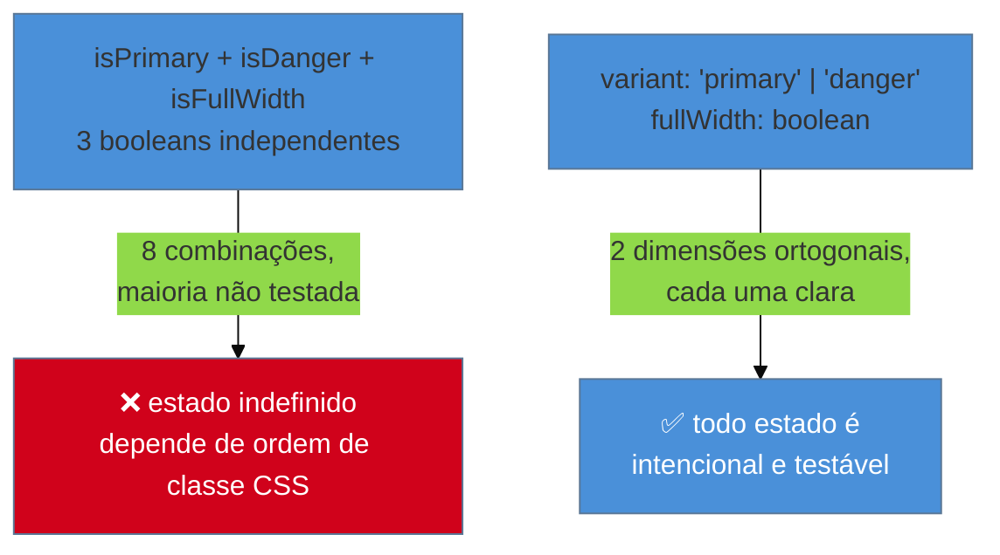

# Component API design

> [!abstract] TL;DR
> Um componente de UI tem uma **API** exatamente como uma função de backend — uma superfície de entrada (props) que promete um comportamento. O erro mais nomeado do mercado é a **"boolean explosion" / "prop explosion"**: cada boolean dobra os estados possíveis do componente, e **6 booleans produzem 64 combinações** não documentadas nem testadas. As duas correções que carregam peso real: trocar múltiplos booleans por um **enum de variant** (`variant: "primary" | "secondary"`), e preferir **composição sobre configuração** — compound components em vez de um "god component" com dezenas de props tentando cobrir todo caso de uso. Não há fonte acadêmica única para esses princípios — é consenso de mercado, com referência prática citável no próprio guia de API da MUI. É a nota deste sub-galho mais próxima do que o leitor já sabe fazer: design de API, só que na superfície de um componente em vez de um endpoint.

Um componente `Button` nasce simples: `<Button label="Salvar" />`. Seis meses depois, ele acumula `isPrimary`, `isSecondary`, `isDisabled`, `isLoading`, `isFullWidth`, `isDanger` — seis props booleanas, cada uma adicionada para resolver um caso de uso pontual, sem que ninguém parasse para pensar no conjunto. Um dia, alguém chama `<Button isPrimary isDanger isFullWidth />` — três booleans simultâneos que, juntos, não têm um comportamento visual claramente definido: o componente é primário **e** de perigo **e** largura total? O CSS resultante depende da ordem em que as classes foram aplicadas internamente, e ninguém no time consegue prever o resultado sem testar. Esse componente tem, matematicamente, **64 combinações possíveis** de estado — e o time testou, na prática, umas seis. O bug não é de CSS: é que a API do componente nunca foi desenhada, só cresceu.

## O componente como API: a mesma disciplina, outra superfície

Projetar a assinatura de uma função de backend — quais parâmetros aceita, em que ordem, com que tipos, o que retorna, o que pode dar errado — é disciplina que o leitor deste domínio já pratica, provavelmente há anos. Um componente de UI tem exatamente a mesma estrutura de decisão: **props são parâmetros**, o componente renderizado é o "retorno", e um estado inconsistente de props (como os três booleans do cenário acima) é o equivalente direto de um estado inválido que uma função bem desenhada deveria impedir de existir, não apenas documentar que "não deveria acontecer".

A ponte é literal, não metafórica: os mesmos critérios que fazem uma API de backend "boa" — previsível, difícil de usar errado, com superfície mínima necessária — se aplicam sem tradução a um componente. A diferença é só de vocabulário: onde backend fala "parâmetro", frontend fala "prop"; onde backend fala "contrato", frontend fala "interface do componente". Um engenheiro sênior que nunca pensou em componente como API está deixando no chão uma disciplina que já domina noutro contexto.

## O problema nomeado: boolean explosion

**"Boolean explosion"** (também chamado "prop explosion") é o nome de mercado para o padrão do cenário de abertura: cada prop booleana adicionada a um componente **dobra** o número de combinações de estado possíveis, porque cada boolean pode estar `true` ou `false` independentemente das demais.

```
1 boolean  →   2 combinações
2 booleans →   4 combinações
3 booleans →   8 combinações
4 booleans →  16 combinações
5 booleans →  32 combinações
6 booleans →  64 combinações  ← o Button do cenário de abertura
```

A maioria dessas combinações nunca é intencional — são efeitos colaterais de props independentes se cruzando sem que ninguém tenha decidido o que deveria acontecer. O componente "funciona" para os casos que alguém testou manualmente e falha silenciosamente (renderiza algo visualmente errado, sem erro de console) para o resto.



## As duas correções que carregam peso real

**Enum de variant em vez de múltiplos booleans mutuamente exclusivos.** Quando um conjunto de props representa opções que se excluem entre si — um botão não deveria ser simultaneamente "primário" e "secundário" — a modelagem correta é um único parâmetro de enum, não dois booleans independentes:

```tsx
// ❌ Booleans mutuamente exclusivos: nada impede os dois juntos
interface ButtonProps {
  isPrimary?: boolean;
  isSecondary?: boolean;
  isDanger?: boolean;
}
// <Button isPrimary isSecondary /> compila sem erro — e não deveria fazer sentido

// ✅ Enum de variant: só um valor é possível por vez
interface ButtonProps {
  variant: "primary" | "secondary" | "danger";
}
// <Button variant="primary" variant="secondary" /> nem compila — TypeScript recusa
```

O ganho não é só de legibilidade — é de **impossibilidade de estado inválido**. Com booleans, o desenvolvedor precisa lembrar, de memória, quais combinações são proibidas; com enum, o compilador recusa a combinação impossível antes mesmo de rodar. Props que **não** se excluem — como `fullWidth` no exemplo do diagrama acima, que é ortogonal a `variant` — continuam sendo booleans legítimos; a regra não é "nunca use boolean", é "não use boolean quando as opções deveriam ser mutuamente exclusivas".

**Composição sobre configuração.** Quando um componente cresce para cobrir cada variação possível de uso através de mais e mais props — um "god component" com vinte, trinta props tentando prever todo caso de uso futuro — a alternativa que envelhece melhor é a **composição**: dividir o componente em peças menores que se combinam livremente, em vez de um componente monolítico configurado por flags.

```tsx
// ❌ God component: uma prop nova para cada variação de uso
<Card
  title="Pedido #123"
  showHeader
  headerActions={[{ label: "Editar", onClick: handleEdit }]}
  showFooter
  footerAlign="right"
  compact
/>

// ✅ Composição: as peças se combinam, sem prop nova para cada arranjo
<Card>
  <Card.Header actions={<Button onClick={handleEdit}>Editar</Button>}>
    Pedido #123
  </Card.Header>
  <Card.Body>...</Card.Body>
  <Card.Footer align="right">...</Card.Footer>
</Card>
```

O padrão de composição descrito acima — "compound components" — não é conceito exclusivo de nenhum framework específico: é o mesmo princípio, em espírito, que `<select>` e `<option>` já usam em HTML puro há décadas, muito antes de qualquer framework de componente existir. A implementação técnica de compound components em React (Context API para estado compartilhado implícito entre as peças) é detalhe de framework — e propositalmente **não** é o assunto desta nota, que trata do princípio, não da implementação; quem quiser a implementação específica em React encontra em [[03-Dominios/Tecnologia/React/Design Patterns/07 - Compound components|React/Design Patterns/07]].

> [!question]- Composição sempre vence sobre configuração? Nunca vale usar props de configuração?
> Não sempre — a composição tem custo próprio: mais peças para o consumidor do componente aprender e montar corretamente, mais superfície de erro se as peças forem combinadas fora de ordem. Um componente pequeno, com poucas variações reais de uso, se beneficia mais de props simples e diretas do que de composição — introduzir compound components para um `Badge` com duas variantes é engenharia excessiva. A régua prática: quando o número de props de configuração começa a crescer para cobrir arranjos estruturais diferentes (não só valores diferentes, mas **layouts** diferentes), é sinal de que composição resolveria melhor do que mais uma prop booleana.

## Praticável sozinho vs. exige time

Auditar um componente existente contra o critério de boolean explosion — contar quantos booleans independentes ele tem, verificar se algum par deveria ser um enum — é exercício de uma tarde, sozinho, sem exigir aprovação de ninguém: o teste é contar props e perguntar "essas opções se excluem mutuamente?". Refatorar de booleans para enum de variant é uma mudança mecânica e localizada, geralmente sem quebrar comportamento externo se feita com cuidado de manter compatibilidade (aceitar o boolean antigo como depreciado, mapeando internamente para o novo enum, até a migração completar).

Decidir **quando** vale investir em composição, em vez de continuar com props simples, é julgamento de arquitetura que uma pessoa também consegue fazer sozinha — mas exige experiência de já ter visto um componente crescer demais para saber reconhecer o sintoma cedo. O que exige mais estrutura é **validar a ergonomia da API com usuários reais do componente** — outros desenvolvedores do próprio time, ou de times consumidores, tentando usar a API sem ajuda e reportando onde travam. Isso é o equivalente, em API de componente, a um teste de usabilidade com usuário final — e como qualquer teste de usabilidade, ganha em rigor quando feito com mais de uma pessoa, mesmo que informalmente.

## Casos práticos

### Cenário 1: os 64 estados do Button
O `Button` do cenário de abertura, com seis props booleanas independentes, chega a produção com o par `isPrimary + isDanger` sendo usado por engano numa tela de confirmação de exclusão — o botão renderiza com a cor de perigo sobrescrevendo a cor primária por acidente de ordem de classe CSS, mas o texto ainda diz "Ação Principal" ao invés de "Excluir". O que dá errado: nenhuma das 64 combinações foi projetada deliberadamente — o componente cresceu prop a prop, sem que ninguém revisasse o conjunto. A correção específica: consolidar `isPrimary`, `isSecondary`, `isDanger` num único `variant: "primary" | "secondary" | "danger"`, deixando `isFullWidth` e `isLoading` como booleans legítimos (porque são genuinamente ortogonais a `variant` — um botão pode ser primário e de largura total ao mesmo tempo, sem ambiguidade).

### Cenário 2: o Card que virou vinte props
Um componente `Card`, ao longo de dois anos, acumula vinte props de configuração — cada uma adicionada para um caso de uso específico que apareceu (`showHeader`, `headerTitle`, `headerActions`, `showFooter`, `footerAlign`, `compact`, `bordered`...). Um novo desenvolvedor, tentando montar um card com um layout ligeiramente diferente dos previstos, não encontra a combinação de props que produz o resultado desejado — porque o arranjo que ele precisa nunca foi antecipado por nenhuma prop existente. O que dá errado: configuração via props tem um teto — ela só cobre os arranjos que o autor original previu; qualquer arranjo novo exige uma prop nova, numa espiral sem fim. A correção específica: refatorar para compound components (`Card.Header`, `Card.Body`, `Card.Footer`), permitindo que qualquer arranjo estrutural seja montado livremente pelo consumidor, sem depender de o autor original ter previsto aquela combinação específica.

### Cenário 3: a mudança que quebrou 40 usos silenciosamente
Um componente muda a prop `size` de string livre (`"small" | "medium" | "large"`, sem validação de tipo) para um enum TypeScript estrito. A mudança parece segura, mas 12 usos no código já passavam valores incorretos (`"Small"` com maiúscula, `"med"` abreviado) que, antes, eram simplesmente ignorados silenciosamente pelo CSS (a classe correspondente não existia, o componente renderizava no tamanho default sem erro nenhum). Depois da mudança para enum estrito, o TypeScript aponta os 12 erros de compilação de uma vez. O que dá errado, na origem: a API original era "fácil de usar incorretamente" — aceitava qualquer string e falhava silenciosamente, sem sinalizar o erro para quem chamou. A correção específica não é reverter a mudança — é reconhecer que os 12 erros expostos pelo TypeScript são bugs reais que já existiam, apenas invisíveis; a API antiga escondia o problema, a nova o expõe onde deveria: em tempo de compilação, não em produção.

## Armadilhas comuns

> [!warning] Boolean explosion: dois ou mais booleans mutuamente exclusivos
> **O que acontece:** um componente ganha múltiplas props booleanas ao longo do tempo, e algumas delas representam, na prática, opções que deveriam se excluir mutuamente — mas nada no código impede combiná-las. **Por quê:** cada boolean adicional dobra o espaço de estados possíveis; a maioria dessas combinações nunca é testada nem intencional, e o comportamento de combinações não previstas fica indefinido, dependente de detalhe de implementação (ordem de classe CSS, ordem de checagem condicional). **Como evitar:** sempre que duas ou mais props booleanas representam opções mutuamente exclusivas, consolide-as num único enum de `variant`; mantenha boolean só para propriedades genuinamente ortogonais entre si.

> [!warning] God component: uma prop nova para cada caso de uso
> **O que acontece:** um componente cresce prop a prop, cada uma resolvendo um caso de uso pontual, até ter dezenas de props de configuração e ainda assim não cobrir o próximo arranjo que aparece. **Por quê:** configuração via props tem teto estrutural — só cobre os arranjos que o autor previu; qualquer variação de layout não antecipada exige prop nova, numa espiral sem fim que nunca converge. **Como evitar:** quando o crescimento de props passa a cobrir arranjos estruturais (não só valores), migre para composição — compound components que o consumidor monta livremente, sem depender de o autor ter previsto aquele arranjo específico.

> [!warning] API "fácil de usar incorretamente" por falta de tipagem estrita
> **O que acontece:** uma prop aceita valor livre (string sem enum, número sem faixa validada) e valores incorretos passam despercebidos, falhando silenciosamente em vez de sinalizar erro. **Por quê:** uma API permissiva demais não impede uso incorreto — ela só adia a descoberta do erro para produção, onde o custo de diagnosticar é maior do que seria em tempo de compilação ou de revisão de código. **Como evitar:** prefira tipos estritos (enums, uniões discriminadas) a strings ou números livres sempre que o conjunto de valores válidos for conhecido e finito — o objetivo de API design não é só "fácil de usar corretamente", é também "difícil de usar incorretamente".

> [!info] Mídia: nenhum vídeo verificado encontrado
> A pesquisa desta nota não encontrou um vídeo ou talk específico, verificado por transcrição, que trate diretamente de API design de componente de UI (boolean explosion, enum de variant, composição vs. configuração) sem ser uma implementação amarrada a um framework específico — o que contrariaria a exigência desta nota de ser neutra de framework. Em vez de forçar um link fraco (uma tutorial de compound components em React, por exemplo, que traria a implementação de volta ao centro da nota), esta nota fica sem mídia embutida. Referência escrita usada como base, com o mesmo rigor de verificação: o guia oficial de API design da MUI, citado em Fontes.

## Como explicar em inglês

> "A component's props are its API, in exactly the same sense as a backend function's parameters — and the same design discipline applies. The most-named failure mode is 'boolean explosion': each independent boolean prop doubles the component's possible states, so six booleans produce 64 combinations, most of them never tested or intended. The two fixes that matter: collapse mutually-exclusive booleans into a single `variant` enum so invalid states can't compile, and favor composition — compound components — over configuration once a component's prop growth starts covering structural layout variations instead of just values."

| PT | EN |
|----|----|
| boolean explosion / prop explosion | boolean explosion / prop explosion |
| enum de variant | variant enum |
| composição sobre configuração | composition over configuration |
| compound components | compound components |
| god component | god component |
| estado inválido | invalid state |
| superfície de API | API surface |

## O que vem a seguir

Uma API de componente bem desenhada ainda deixa em aberto a última decisão do sub-galho: quando construir esse componente do zero e quando adotar algo pronto — e como manter governança mínima sobre esse sistema sem virar um projeto paralelo de tempo integral.

- [[03-Dominios/Engenharia/UX/Linguagem Visual e Design System/32 - Adotar vs construir, e governança mínima|32 — Adotar vs construir, e governança mínima]] — a decisão de produto que fecha o sub-galho: quando vale a pena construir, e o mínimo de disciplina que sustenta isso sozinho.

## Fontes

- **MUI** — [*API design approach*](https://mui.com/material-ui/guides/api/) — referência prática de mercado sobre quando usar boolean vs. enum numa API de componente; não há fonte acadêmica única para o consenso desta nota.
- **Scott Meyers** — princípio "easy to use correctly, hard to use incorrectly" — formulação clássica de API design, aplicada aqui à superfície de componente em vez de biblioteca de sistema.
