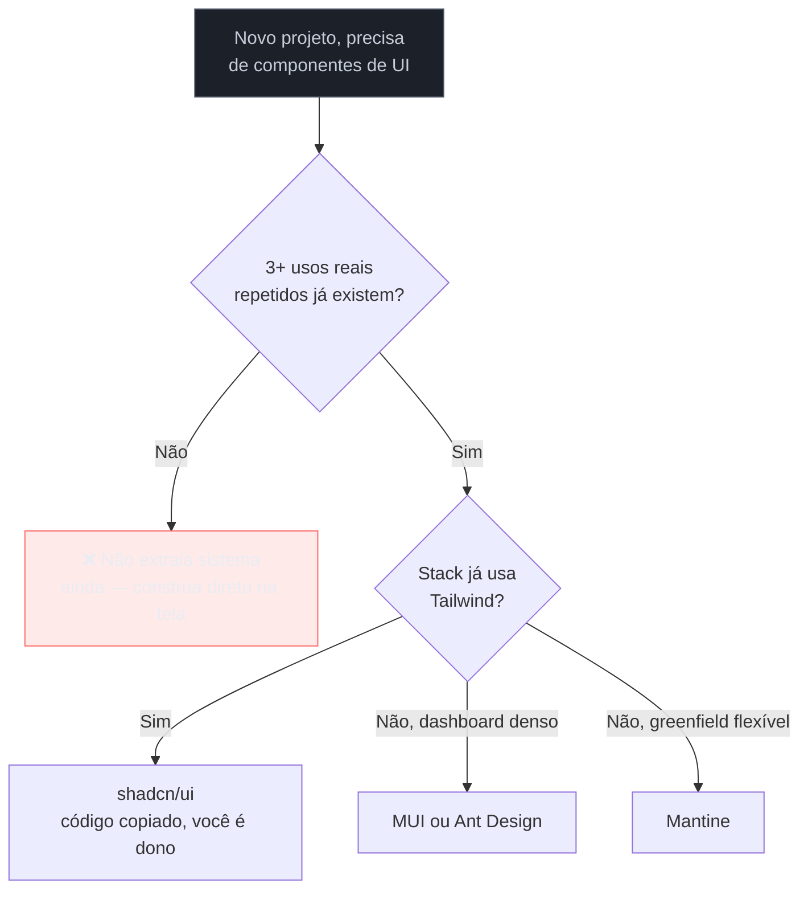

# Adotar vs construir, e governança mínima

> [!abstract] TL;DR
> A pergunta não é "qual biblioteca é melhor" — isso já está comparado com código lado a lado em [[03-Dominios/Tecnologia/React/Ecossistema/03 - Component libraries e design systems|React/Ecossistema/03]]. Aqui é a decisão de **produto**: dado o estágio do projeto e o tamanho do time, vale adotar algo pronto (shadcn/ui, MUI, Mantine, Radix/Base UI, Ant Design) ou construir? A regra prática para uma pessoa: a decisão é por **restrição de projeto** (o stack já tem Tailwind? é dashboard denso? é greenfield?), não por "melhor absoluto". A armadilha central que mata mais tempo do que qualquer escolha errada de biblioteca: o **design system prematuro** — extrair token e componente genérico antes de ter **3+ usos reais repetidos**, otimizando para um futuro hipotético e travando velocidade agora. Governança para um time de um é deliberadamente leve: versionamento e changelog, sem RFC, sem semver rigoroso, sem Storybook com regressão visual — a manutenção não compensa.

Um engenheiro fractional começa um projeto novo e, antes de escrever a primeira tela real, decide "fazer certo desde o início": monta uma pasta `design-system/`, extrai um `Button`, um `Input`, um `Card` genéricos, cada um com props flexíveis o bastante para "qualquer uso futuro", e escreve documentação Storybook para os três. Duas semanas depois, o projeto tem exatamente uma tela funcional e um sistema de design elaborado que ninguém além dele nunca vai consultar — porque o projeto é pequeno, o cliente é um só, e não existe um segundo desenvolvedor para quem a documentação faria diferença. O tempo que foi para o Storybook não construiu nenhuma funcionalidade que o cliente pediu. Esse é o padrão mais caro deste sub-galho inteiro: não é escolher a biblioteca errada — é investir em sistema antes de o produto ter provado que precisa de um.

## A decisão não é "qual é melhor" — é por restrição de projeto

O mercado de bibliotecas de componente para React, em 2026, tem um espectro conhecido — de opinativo e completo (MUI) a headless e minimalista (Radix/Base UI) — já mapeado com comparação técnica e código em [[03-Dominios/Tecnologia/React/Ecossistema/03 - Component libraries e design systems|React/Ecossistema/03]]. Este capítulo não repete essa comparação de API; assume que o leitor já sabe o que cada uma faz e foca na pergunta anterior: **vale adotar alguma delas, ou vale construir do zero?**

> [!info] Sinal direcional de mercado, não fonte de autoridade
> O panorama a seguir descreve tendências observadas em conteúdo de mercado (blogs agregadores, changelogs de projeto, discussão pública) — **não é fonte citável em entrevista técnica formal**, e nenhum preço de nenhuma ferramenta é mencionado, porque nenhum foi verificado com rigor suficiente para esta nota. Trate como contexto para decisão prática, não como dado a repetir com autoridade.

- **shadcn/ui** não é biblioteca — é gerador de código copiável (CLI) sobre Radix + Tailwind; você é dono do código copiado. Virou o default de facto para projetos Next.js/Tailwind novos.
- **Radix UI** — primitivas headless amplamente adotadas; foi **adquirida pela WorkOS** e o ritmo de desenvolvimento desacelerou em componentes complexos. A alternativa headless ativamente mantida que emergiu é a **Base UI**, da própria equipe do MUI.
- **MUI** segue opinativo, com superfície grande — forte para enterprise e dashboards, sobretudo com o pacote MUI X (DataGrid, DatePicker).
- **Ant Design** tem a melhor cobertura para dashboards/admin B2B com fluxos de dados densos.
- **Chakra UI v3** compete via utility-props com Tailwind, e vem perdendo terreno para shadcn/ui quando o stack já é Tailwind.
- **Mantine** segue como escolha "all-around" forte para projeto novo — inclusive destino natural de quem migra de Chakra.

A regra prática para quem decide sozinho: pergunte pelas **restrições do projeto**, não pelo "melhor absoluto" — o stack já usa Tailwind? É um dashboard denso de dados? É greenfield sem legado a respeitar? A resposta a essas perguntas elimina a maioria das opções antes mesmo de comparar API.

## A armadilha central: design system prematuro

O erro mais caro deste sub-galho não é escolher a biblioteca errada — bibliotecas se trocam, com dor, mas se trocam. O erro caro é **extrair token e componente genérico antes de ter 3+ usos reais repetidos** — otimizar para um futuro hipotético que ainda não aconteceu, pagando o custo de abstração agora, com o produto real ainda travado.

O mecanismo por trás do erro é sempre o mesmo: abstrair cedo demais exige **adivinhar** quais variações o componente vai precisar suportar no futuro — e adivinhar erra na maioria das vezes, porque as variações reais só aparecem quando o segundo e o terceiro uso concreto acontecem. Um componente genérico desenhado para "qualquer uso futuro" antes de existir um segundo uso real carrega flexibilidade que ninguém pediu, complexidade que ninguém precisa, e — o custo mais silencioso — atenção do engenheiro desviada do que o cliente efetivamente pediu.

A régua prática, que não é original desta nota mas é consenso amplo de engenharia de software aplicado aqui a design system: **espere o terceiro uso repetido antes de extrair**. No primeiro uso, resolva o problema direto na tela. No segundo, tolere a duplicação — copiar e colar não é pecado nessa fase. Só no terceiro uso real, quando o padrão está confirmado (não hipotetizado), vale o custo de extrair um componente ou token compartilhado.

> [!question]- Isso não contradiz a defesa de design tokens da nota 29?
> Não — a nota 29 defende a **hierarquia** de tokens quando o sistema já existe e está crescendo; esta nota trata do momento **anterior**, de decidir se o sistema deveria existir ainda. Um design system maduro se beneficia de hierarquia primitivo → semântico → componente; um projeto com uma tela e um cliente não tem "sistema" nenhum para hierarquizar — só tem CSS de uma tela só, e tratá-lo como sistema é o próprio erro desta nota. A ordem certa é: construir o suficiente para o padrão aparecer (3+ usos), então sistematizar — nunca o contrário.

## Governança mínima para um time de um

Governança de design system, em times grandes, envolve processo formal: RFC (Request for Comments) antes de mudanças estruturais, semver rigoroso nos pacotes de token e componente, comitê de revisão multi-disciplinar, documentação Storybook completa com testes de regressão visual automatizados. Nenhum desses processos existe por acaso — cada um resolve um problema real de coordenação entre múltiplas pessoas com interesses e contextos diferentes.

Para um time de um, esse mesmo processo é custo puro, sem o problema de coordenação que o justificaria — não existe segunda pessoa para coordenar. A governança que efetivamente vale o investimento, mesmo sozinho, é deliberadamente pequena:

- **Versionamento leve.** Um número de versão simples (mesmo que não seja semver estrito) no arquivo de tokens ou no pacote de componentes, para saber "isso mudou desde a última vez que toquei".
- **Changelog de tokens.** Uma lista curta, em texto simples, do que mudou e por quê — não para uma equipe consumir formalmente, mas para o próprio autor, meses depois, entender por que um token específico tem o valor que tem.

**O que não vale fazer sozinho**, e o motivo de cada item ser dispensável:

- **RFC process** — existe para coletar objeção de múltiplos stakeholders antes de uma mudança estrutural; sem múltiplos stakeholders, não há objeção a coletar.
- **Semver rigoroso** de pacote de tokens — existe para sinalizar breaking changes a consumidores externos do pacote que não controlam o código-fonte; um time de um é, ao mesmo tempo, produtor e único consumidor, então a distinção maior/menor/patch não carrega informação que o próprio autor já não tenha.
- **Comitê de revisão** — não existe comitê possível com uma pessoa.
- **Documentação Storybook completa com regressão visual mantida** — o custo de manter testes de regressão visual (rodar, revisar diffs de screenshot, aprovar ou rejeitar) é recorrente e alto; para uma pessoa, um README com exemplos vivos do componente resolve a mesma necessidade de "lembrar como usar isso" a uma fração do custo de manutenção.

## Praticável sozinho vs. exige time

A decisão de adotar uma biblioteca existente em vez de construir — e qual delas, dadas as restrições do projeto — é decisão que uma pessoa toma sozinha, com a informação já mapeada nesta nota e em [[03-Dominios/Tecnologia/React/Ecossistema/03 - Component libraries e design systems|React/Ecossistema/03]]. Aplicar a régua de "3+ usos antes de extrair" também é disciplina individual — exige só resistir ao impulso de sistematizar cedo, não exige aprovação de ninguém. A governança mínima descrita acima (versionamento leve, changelog simples) é, pela própria definição desta nota, dimensionada exatamente para uma pessoa.

O que genuinamente exige mais estrutura é **governança em escala real** — quando o design system passa a servir múltiplos times ou múltiplos produtos, e a ausência de RFC formal ou de revisão coordenada começa a produzir mudanças que quebram consumidores sem aviso. Esse é o ponto em que os processos "caros" da seção anterior deixam de ser custo puro e passam a resolver um problema de coordenação real — mas esse ponto de virada normalmente coincide com o momento em que o projeto deixou de ser trabalho de uma pessoa só, o que está, por definição, fora do escopo deste domínio.

## Casos práticos

### Cenário 1: o design system de duas semanas para um cliente só
O cenário de abertura desta nota, levado à correção: depois de perceber que o Storybook elaborado não tinha nenhum segundo consumidor além do próprio autor, o engenheiro reverte a decisão — remove a pasta `design-system/` isolada, constrói os componentes diretamente nas telas conforme o projeto avança, e só volta a extrair um componente compartilhado quando o mesmo padrão de botão aparece pela terceira vez, em três telas diferentes, de forma genuinamente repetida. O que dava errado antes: o sistema foi otimizado para um público (outros desenvolvedores consultando a documentação) que não existia no contexto do projeto. A correção específica: adiar a sistematização até o padrão real aparecer, medido em repetição observada, não em previsão.

### Cenário 2: a migração forçada de Radix para Base UI
Um projeto que adotou Radix UI diretamente (não via shadcn/ui) percebe, ao longo de meses, que componentes complexos que precisava (um date picker headless, por exemplo) não recebem atualização havia tempo — sintoma do desaquecimento pós-aquisição pela WorkOS mencionado no panorama de mercado desta nota. O que dá errado: a dependência direta numa biblioteca headless, sem a camada de "você é dono do código" que o shadcn/ui oferece, deixa o projeto exposto ao ritmo de manutenção de um terceiro sobre o qual não há controle. A correção específica: avaliar a migração pontual, componente a componente, para Base UI (a alternativa ativamente mantida) apenas nos componentes que efetivamente pararam de evoluir — sem reescrever o projeto inteiro de uma vez, priorizando pelos componentes de maior risco.

### Cenário 3: o RFC process copiado de uma Big Tech, para um time de um
Um engenheiro fractional lê um artigo sobre governança de design system numa empresa grande e decide implementar o mesmo processo de RFC formal para o próprio projeto — mesmo trabalhando sozinho. Ele passa a escrever documentos de proposta antes de qualquer mudança de token, "esperando" aprovação que nunca chega porque não há ninguém além dele para aprovar. O que dá errado: o processo foi copiado sem entender o problema que ele resolve — coordenar múltiplas pessoas com contextos diferentes — e aplicado a um contexto onde esse problema não existe, virando burocracia auto-imposta sem função. A correção específica: substituir o RFC formal por um changelog de uma linha por mudança, escrito depois (não antes) da decisão — suficiente para o próprio autor rastrear o histórico, sem o teatro de aprovação que ninguém está do outro lado para dar.

## Armadilhas comuns

> [!warning] Design system prematuro: extrair antes de 3+ usos reais
> **O que acontece:** um componente ou token é generalizado e extraído para reutilização antes de existir um terceiro uso real e repetido — a extração acontece por previsão, não por padrão observado. **Por quê:** abstrair cedo exige adivinhar variações futuras, e a maioria das adivinhações erra; o custo de manter uma abstração errada (refatorar, ou pior, deixar acumular exceções) é maior do que o custo de tolerar duplicação por mais um ou dois usos. **Como evitar:** aplique a régua de três — resolva direto na primeira vez, tolere duplicação na segunda, só extraia na terceira, quando o padrão está confirmado por repetição real, não hipotetizado.

> [!warning] Copiar governança de time grande para time de um
> **O que acontece:** processos formais de design system de empresas grandes — RFC, semver rigoroso, comitê de revisão — são adotados por um engenheiro trabalhando sozinho, sem adaptação de escala. **Por quê:** cada um desses processos resolve um problema de coordenação entre múltiplas pessoas; sem múltiplas pessoas, o processo vira burocracia auto-imposta, consumindo tempo sem resolver problema nenhum que exista de fato no contexto. **Como evitar:** antes de adotar qualquer processo de governança, pergunte "que problema de coordenação isso resolve, e existe esse problema aqui?" — se a resposta é "não há segunda pessoa envolvida", o processo é dispensável.

> [!warning] Escolher biblioteca por "qual é melhor" em vez de restrição do projeto
> **O que acontece:** a decisão de adotar shadcn/ui, MUI, Mantine ou outra é tomada com base em preferência pessoal ou popularidade recente, sem checar se ela se encaixa nas restrições reais do projeto (stack existente, tipo de produto, prazo). **Por quê:** "melhor absoluto" não existe fora de contexto — uma biblioteca ótima para dashboard denso enterprise pode ser a escolha errada para um app greenfield simples, e vice-versa; a pergunta certa é sempre relativa às restrições do projeto específico. **Como evitar:** antes de escolher, responda as perguntas de restrição — Tailwind já está no stack? é dashboard denso? é greenfield sem legado? — e deixe a resposta eliminar opções antes de comparar API, em vez de comparar API primeiro e justificar depois.

> [!tip] Vídeo — The WET Codebase (Dan Abramov)
> [**Dan Abramov — The WET Codebase**](https://www.youtube.com/watch?v=17KCHwOwgms) (Deconstruct 2019, ~25 min) não é sobre design system nem sobre React especificamente — é uma talk geral de engenharia de software sobre por que abstrair cedo demais, para eliminar duplicação, costuma custar mais do que tolerar a duplicação por mais tempo. **O que a talk acrescenta:** o raciocínio causal completo por trás da régua "espere 3+ usos antes de extrair" desta nota, vindo de um contexto fora de UI — reforçando que a armadilha do design system prematuro é uma instância específica de um problema de engenharia mais geral, não uma peculiaridade de front-end. Trecho de destaque [7:59]: *"[duplication] creates some duplication... of course duplication isn't perfect [but neither is the wrong abstraction]."*
>
> 🎬 [Assistir no YouTube](https://www.youtube.com/watch?v=17KCHwOwgms)

## Como explicar em inglês

> "The question isn't which component library is objectively best — that's a project-constraint decision: does the stack already use Tailwind, is it a dense data dashboard, is it greenfield? The costlier mistake isn't picking the wrong library — it's building a design system prematurely, extracting shared tokens and components before you have three or more real repeated uses, optimizing for a hypothetical future while the actual product stays stuck. For a team of one, governance stays deliberately light: lightweight versioning and a changelog, no RFC process, no strict semver, no maintained visual-regression Storybook — the maintenance cost doesn't pay off without a second person to coordinate with."

| PT | EN |
|----|----|
| adotar vs construir | adopt vs build |
| design system prematuro | premature design system |
| regra de três | rule of three |
| governança mínima | minimal governance |
| RFC (proposta formal) | RFC (request for comments) |
| regressão visual | visual regression |
| restrição de projeto | project constraint |

## O que vem a seguir

Este sub-galho fecha aqui: hierarquia, escala, cor, tokens, composição, API de componente e a decisão final de adotar ou construir formam o vocabulário completo de linguagem visual e design system para quem trabalha sozinho. O texto que a interface fala já está coberto pelo sub-galho de UX Writing; o próximo passo planejado do domínio muda de eixo — de como a interface se parece e se organiza, para como o **conteúdo** dela se estrutura e se navega.

- [[03-Dominios/Engenharia/UX/UX Writing e Content Design/index|SG6 — UX Writing e Content Design]] — já completo no vault; conecta com esta nota no ponto em que um componente bem desenhado ainda pode falhar se o texto dentro dele não comunicar o que a ação faz.
- [[03-Dominios/Engenharia/UX/Arquitetura de Informação/index|SG3 — Arquitetura de Informação]] — próximo sub-galho na ordem de execução do domínio: como organizar o que existe e como se navega entre as partes.

## Fontes

- **Dan Abramov** — [*The WET Codebase*](https://www.youtube.com/watch?v=17KCHwOwgms) (Deconstruct, 2019) — o raciocínio causal contra abstração prematura, aplicado nesta nota à armadilha do design system prematuro.
- Comparações de mercado entre shadcn/ui, Radix/Base UI, MUI, Ant Design, Chakra e Mantine — tratadas como **sinal direcional**, sem autoria única verificável; não citáveis como fonte de autoridade formal.
