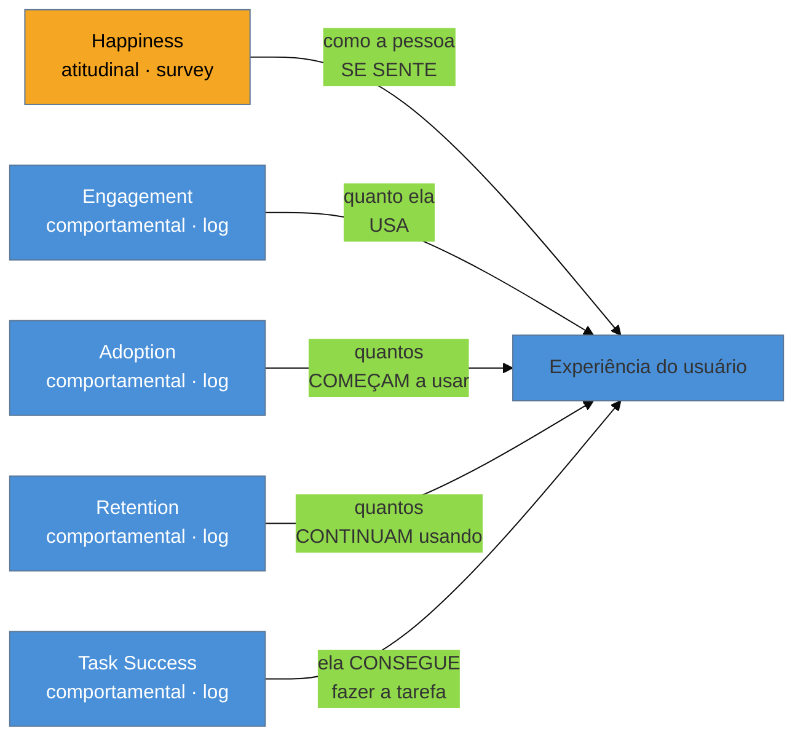
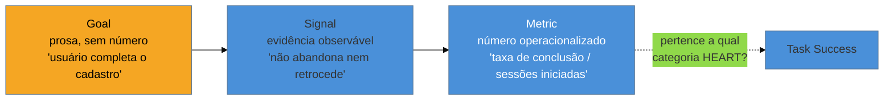

# HEART e Goals-Signals-Metrics

> [!abstract] TL;DR
> **HEART** — Happiness, Engagement, Adoption, Retention, Task Success — é um vocabulário de cinco categorias que Kerry Rodden, Hilary Hutchinson e Xin Fu, do Google Research, publicaram em 2010 para organizar métrica de UX em escala. Só uma das cinco (Happiness) é **atitudinal**, coletada por survey; as outras quatro são **comportamentais**, extraídas de log. Confundir as duas naturezas é o erro mais comum. HEART sozinho é um checklist de categorias vazias — o processo que preenche cada categoria com um número específico do *seu* produto é o **Goals-Signals-Metrics (GSM)**, também do mesmo time: primeiro nomeia o objetivo em prosa, depois a evidência observável que revelaria progresso, só então a métrica que operacionaliza essa evidência de forma comparável no tempo. E performance (INP, LCP, CLS) não entra em nenhuma célula do HEART como métrica própria — ela é **insumo** de Task Success, nunca substituto: mede a causa possível de uma tarefa lenta, não a experiência do usuário em si.

Imagine o cenário mais comum de quem chega sozinho num projeto que já tem alguma instrumentação: o painel de analytics mostra 40 métricas — cliques por botão, tempo de sessão, taxa de rejeição, número de erros de API, page views, scroll depth, uptime — e nenhuma delas está ligada a uma decisão que alguém vai tomar. Você abre o dashboard, vê uma parede de números crescendo e descendo, e nenhum deles responde à pergunta que o cliente fez na última reunião: "essa feature nova está funcionando?". O painel existe, mas não serve. É o retrato exato do problema que HEART e GSM foram desenhados para resolver: não falta dado, falta **estrutura que decide qual dado importa e por quê**.

## HEART: cinco categorias, uma coisa que quase todo mundo erra

Kerry Rodden, Hilary Hutchinson e Xin Fu descreveram HEART no artigo *"Measuring the User Experience on a Large Scale: User-Centered Metrics for Web Applications"* (Google Research, ~2010, CHI). O objetivo original era resolver um problema estrutural do Google: existiam métodos consolidados para medir usabilidade em laboratório com poucos usuários, mas nenhum framework padronizado para medir experiência **automaticamente, em produção, em escala** — bilhões de interações, não cinco sessões de teste.

As cinco categorias, cada uma cobrindo uma fase diferente do ciclo de vida de uso de um produto:

1. **Happiness** — atitude do usuário em relação ao produto: satisfação, facilidade percebida, disposição de recomendar. É a única categoria coletada por **survey/pesquisa direta** — pergunta-se à pessoa o que ela sente.
2. **Engagement** — nível de envolvimento, medido por frequência, intensidade ou profundidade de uso num período: visitas por semana, ações por sessão, tempo em determinada feature.
3. **Adoption** — novos usuários (ou usuários existentes adotando uma feature nova) num período de tempo: contas criadas, primeira vez que alguém usa a funcionalidade X.
4. **Retention** — a fração de usuários de um período que continua ativa num período posterior: quantos dos usuários de janeiro ainda estavam ativos em março.
5. **Task Success** — eficácia, eficiência e taxa de erro na execução de uma tarefa específica: tempo até concluir o checkout, taxa de sucesso na busca, número de tentativas até o formulário validar.

O ponto mais frequentemente perdido, e o motivo do diagrama acima destacar Happiness em cor diferente: **quatro das cinco categorias vêm de log de comportamento (o que a pessoa fez), e só uma vem de pergunta direta (o que a pessoa diz que sentiu)**. É comum ver times tratando as cinco como intercambiáveis — "vamos medir Happiness contando cliques" — o que é um erro de categoria: contar cliques mede Engagement, não Happiness. Se ninguém perguntou nada a ninguém, não existe dado de Happiness no seu painel, por mais que o comportamento pareça "feliz".

> [!question]- Por que não dá pra inferir Happiness só olhando comportamento?
> Porque comportamento e atitude divergem sistematicamente. Um usuário pode usar um produto com frequência alta (Engagement alto) e odiar cada minuto — é o caso clássico de sistema corporativo obrigatório, sem alternativa. Outro usuário pode amar um produto (Happiness alto) e usá-lo pouco, porque a necessidade dele é rara (revisar um contrato uma vez por trimestre). Tratar frequência de uso como proxy de satisfação colapsa duas variáveis que existem para captar coisas diferentes — e um produto B2B com usuário cativo (sem escolha de trocar de fornecedor) é exatamente o cenário onde esse erro mais aparece, porque o comportamento fica "bom" mesmo quando a experiência é ruim.

**HEART não é uma checklist de cinco caixas para preencher em toda nota de produto.** Nem toda categoria se aplica a toda feature — uma tela de configuração usada uma vez no onboarding não tem Retention relevante; um recurso sem concorrência direta não precisa de Happiness constante monitorado. A escolha de quais categorias medir para qual feature é decisão de produto, não obrigação do framework.

## Goals-Signals-Metrics: o processo que preenche o vazio

HEART nomeia *onde* olhar; não diz *o que* medir no seu produto específico. Sem um processo de tradução, HEART vira o mesmo problema do painel de 40 métricas do cenário de abertura — só que organizado em cinco colunas em vez de uma lista solta. **Goals-Signals-Metrics (GSM)**, do mesmo corpo de trabalho do Google, é o processo de três passos que fecha essa lacuna:

1. **Goal** — o objetivo em prosa, na linguagem do produto, sem número. "Quero que usuários novos consigam completar o cadastro sem abandonar no meio."
2. **Signal** — a evidência observável que indicaria progresso ou regressão nesse objetivo, ainda em prosa, mas já apontando para um comportamento ou opinião concreta. "Usuários que começam o cadastro terminam sem fechar a aba ou voltar para uma etapa anterior mais de uma vez."
3. **Metric** — a operacionalização do sinal: um número específico, com definição de cálculo, que se torna comparável ao longo do tempo. "Taxa de conclusão do formulário de cadastro em uma sessão, dividida por sessões que iniciaram o formulário."

**HEART sem GSM é um checklist; HEART com GSM é sistema de medição.** A frase resume o encaixe: HEART te diz em qual das cinco gavetas guardar a métrica; GSM te diz como fabricar a métrica certa para a gaveta certa, partindo do objetivo de negócio em vez de partir do dado que já existe no banco. A ordem importa — GSM começa no Goal, não na Metric. Começar pela métrica ("o que já temos instrumentado?") produz exatamente o painel do cenário de abertura: números fáceis de coletar, difíceis de ligar a uma decisão.

**O mecanismo em uma frase:** GSM força a pergunta "o que eu quero que aconteça" antes da pergunta "o que eu consigo medir" — e é essa ordem, não a existência de mais dashboards, que transforma dado solto em sistema de medição.

## A ponte com Web Performance: insumo, não substituto

Este vault já cobre Core Web Vitals — INP, LCP, CLS, a diferença entre lab e field, e como o CrUX coleta dado real de campo — em profundidade dedicada em [[03-Dominios/Tecnologia/Web Performance/Medição e Core Web Vitals/02 - Os três Core Web Vitals|Tecnologia/Web Performance]]. Esta nota não reexplica nada disso; o ponto aqui é de **fronteira**, não de conteúdo técnico.

Performance não ocupa uma célula própria no HEART. Ela é **insumo** de Task Success, não uma sexta categoria disfarçada: um INP ruim (interação lenta, ver [[03-Dominios/Tecnologia/Web Performance/Performance de Runtime e Rendering/03 - INP a fundo|nota dedicada]]) pode ser a *causa* de uma taxa de conclusão de checkout baixa, mas a métrica de UX é a taxa de conclusão — a métrica de performance explica o *porquê* de um número de UX ter caído, não é ela própria o número de UX. Tratar INP como se fosse "a métrica de UX da tela" é confundir a causa possível com o efeito medido; o efeito é sempre comportamental ou atitudinal (uma das cinco categorias HEART), a performance é uma das explicações candidatas quando esse efeito piora.

Na prática, isso significa: quando Task Success cai numa feature, performance é uma das primeiras hipóteses a checar — junto com clareza de copy, número de passos, e erro de validação — não a única, e não a métrica que substitui a instrumentação de produto.

## O que dá pra fazer sozinho, e o que não dá

Rodar GSM para uma feature nova é, na prática, uma conversa de 20 minutos com você mesmo (ou com o cliente) antes de escrever a primeira linha de tracking: escrever o Goal em prosa, listar 2-3 Signals candidatos, escolher 1 Metric por Signal que já dá pra calcular com o log que o produto vai gerar de qualquer forma. Isso é **praticável sozinho** porque não exige ferramenta nova, orçamento, nem aprovação de mais ninguém — é disciplina de nomear antes de instrumentar, não infraestrutura.

Definir e coletar as métricas comportamentais das quatro categorias não-Happiness (Engagement, Adoption, Retention, Task Success) também é **praticável sozinho**, contanto que o produto já tenha alguma instrumentação de evento — o assunto da [[03-Dominios/Engenharia/UX/Medir, Validar e Sustentar/41 - Instrumentação - event taxonomy e tracking plan|nota 41]], mais adiante neste sub-galho. Um funil de conclusão de tarefa ou uma contagem de contas criadas por semana são cálculos que rodam sobre log que o próprio sistema já produz.

Já rodar Happiness com rigor estatístico — survey padronizado, amostra representativa do público inteiro, tracking de tendência com significância — **exige mais estrutura** do que uma pessoa sozinha tem: validade de survey (linguagem, viés de seleção de quem responde, tamanho de amostra) é um problema metodológico real, não um formulário qualquer no rodapé. A versão praticável sozinho não é abrir mão de Happiness — é usar instrumentos leves e validados como o SEQ pós-tarefa (ver [[03-Dominios/Engenharia/UX/Medir, Validar e Sustentar/39 - SUS, UMUX-Lite, SUPR-Q e SEQ|nota 39]]) em vez de tentar reproduzir um programa de research contínuo com survey de dezenas de perguntas.

E construir um **sistema de dashboards vivo, com alertas automáticos de regressão de métrica por categoria HEART**, cruzando dado comportamental e atitudinal em tempo real, é trabalho de plataforma de dados — exige pipeline de ingestão, ferramenta de BI mantida, e alguém dono da qualidade do dado ao longo do tempo. Para um engenheiro sozinho, a versão que cabe é uma planilha ou nota versionada com os GSMs da feature atual, revisitada manualmente a cada release — não um sistema de observabilidade de métrica de produto.

## Casos práticos

### Cenário 1: o painel de 40 métricas sem decisão nenhuma atrás
Uma consultoria herda um dashboard de analytics com dezenas de métricas — cliques por botão, tempo de sessão, taxa de rejeição, contagem de erros — nenhuma ligada explicitamente a uma pergunta de negócio. O cliente pergunta "essa feature nova está funcionando?" e ninguém no time sabe apontar qual número responde a isso. Rodar GSM para a feature em questão — Goal: "usuários encontram e usam o filtro de busca avançada"; Signal: "usuários que abrem o filtro completam pelo menos uma busca com ele em vez de fechar sem usar"; Metric: "taxa de buscas concluídas por sessão que abriu o filtro, categoria Task Success" — produz uma única métrica nova, calculada sobre log que já existia, que responde diretamente à pergunta do cliente. O painel de 40 métricas continua existindo, mas passa a ter uma âncora clara no meio dele.

### Cenário 2: Happiness medido contando cliques
Um engenheiro fractional, sob pressão para "provar" que uma feature de notificações está sendo bem recebida, monta um relatório dizendo "a Happiness dos usuários aumentou 30%" — baseado no aumento de cliques nas notificações. O cliente usa esse número numa apresentação para investidores. Um mês depois, um usuário importante manda um e-mail de reclamação dizendo que as notificações são "irritantes e constantes demais" — o mesmo comportamento (mais cliques) que tinha sido lido como satisfação era, na verdade, mais interrupções gerando mais interações forçadas, não mais prazer de uso. A correção: separar explicitamente Engagement (cliques, frequência — o que estava sendo medido) de Happiness (que exigiria perguntar diretamente, por exemplo com um SEQ pós-notificação ou uma pergunta simples de opt-in de feedback) — e nunca apresentar um como proxy do outro sem marcar a diferença.

### Cenário 3: INP ruim escondido atrás de "Task Success caiu, não sabemos por quê"
Um dashboard de produto mostra que a taxa de conclusão do checkout (Task Success) caiu 12% depois de um release. O time passa uma semana revisando copy, número de campos e mensagens de erro — as hipóteses de UX "clássicas" — sem achar a causa. Um engenheiro, lembrando da ponte com performance desta nota, roda os dados de campo do CrUX (ver [[03-Dominios/Tecnologia/Web Performance/Medição e Core Web Vitals/05 - CrUX e dados de campo|nota dedicada em Web Performance]]) e encontra que o INP da página de pagamento piorou de 180ms para 520ms no mesmo release, por causa de um script de terceiros adicionado para tracking de conversão. A métrica de UX (Task Success) continua sendo a taxa de conclusão do checkout — o INP não vira a métrica reportada ao cliente — mas vira o item de diagnóstico que resolve o mistério e aponta a correção técnica certa (remover ou adiar o script).

## Armadilhas comuns

> [!warning] Tratar Happiness e Engagement como intercambiáveis
> **O que acontece:** o time reporta "satisfação subiu" citando número de acessos ou cliques, sem nenhuma pergunta feita a ninguém.
> **Por quê:** as duas categorias parecem correlacionadas na intuição ("se usa mais, deve gostar mais"), mas medem coisas estruturalmente diferentes — atitude vs. comportamento — e podem divergir, principalmente em produtos com usuário cativo.
> **Como evitar:** nomeie explicitamente a categoria HEART de cada número no relatório; se não veio de pergunta direta, não é Happiness.

> [!warning] Instrumentar tudo antes de nomear o Goal
> **O que acontece:** o time adiciona tracking de evento em cada botão "por via das dúvidas", sem que nenhum deles esteja ligado a um objetivo declarado — e o painel vira o cenário de abertura desta nota.
> **Por quê:** instrumentar parece produtivo (mais dado é sempre visto como "bom"), mas dado sem Goal declarado não informa decisão nenhuma — só cresce em volume e complexidade de manutenção.
> **Como evitar:** escreva o Goal em prosa antes de abrir o editor de tracking; se não consegue nomear o objetivo em uma frase, ainda não é hora de instrumentar.

> [!warning] Confundir métrica de performance com métrica de UX
> **O que acontece:** o relatório de produto passa a citar INP ou LCP como se fossem, elas mesmas, a métrica de experiência do usuário — "a UX melhorou porque o LCP caiu".
> **Por quê:** performance é fácil de medir automaticamente (RUM, CrUX) e correlaciona com experiência, então é tentador tratá-la como substituto direto — mas ela é insumo causal, não o efeito medido.
> **Como evitar:** sempre reporte a métrica comportamental ou atitudinal (a categoria HEART) como o número principal, e cite a métrica de performance como explicação candidata quando ela mudar — nunca a apresente como a métrica de UX em si.

> [!warning] Aplicar as cinco categorias HEART a toda feature, sem critério
> **O que acontece:** cada relatório de feature vem com as cinco caixas preenchidas, mesmo quando algumas não fazem sentido para aquele contexto específico — Retention forçado numa tela de configuração usada uma vez.
> **Por quê:** o framework parece pedir as cinco categorias porque tem cinco letras, e preencher todas parece mais "completo" — mas força métrica artificial em categorias irrelevantes.
> **Como evitar:** escolha, para cada feature, só as categorias HEART que respondem a uma pergunta real de negócio; uma feature com duas categorias bem escolhidas vale mais que cinco mal encaixadas.

## Como explicar em inglês

> "HEART groups UX metrics into five categories — Happiness, Engagement, Adoption, Retention, Task Success — but only Happiness is attitudinal, collected via survey; the other four are behavioral, pulled from logs. HEART alone is just a checklist of empty categories; **Goals-Signals-Metrics** is the process that fills each category with a number specific to your product: name the goal in plain language, identify the observable signal, then operationalize it as a comparable metric. And performance metrics like INP are an input to Task Success, never a substitute for it — a slow interaction can explain a bad task success rate, but the UX metric being reported is still task success, not the performance number itself."

| PT | EN |
|----|----|
| atitudinal vs. comportamental | attitudinal vs. behavioral |
| taxa de sucesso de tarefa | task success rate |
| objetivo, sinal, métrica | goal, signal, metric |
| insumo, não substituto | input, not a substitute |
| checklist vazio | empty checklist |
| painel sem decisão atrás | dashboard with no decision behind it |

## O que vem a seguir

HEART e GSM resolvem *o que* medir e *por que*, mas ainda deixam em aberto uma pergunta prática: quando a métrica certa é Happiness, com qual instrumento específico você a coleta — e por que existem quatro instrumentos diferentes (SUS, UMUX-Lite, SUPR-Q, SEQ) em vez de um só? A próxima nota resolve isso, junto com a distinção entre o que se mede num teste de laboratório com poucas pessoas e o que se mede com telemetria de todos.

- [[03-Dominios/Engenharia/UX/Medir, Validar e Sustentar/39 - SUS, UMUX-Lite, SUPR-Q e SEQ|39 — SUS, UMUX-Lite, SUPR-Q e SEQ]] — os quatro instrumentos que operacionalizam a categoria Happiness, e quando usar cada um.
- [[03-Dominios/Engenharia/UX/Medir, Validar e Sustentar/41 - Instrumentação - event taxonomy e tracking plan|41 — Instrumentação: event taxonomy e tracking plan]] — como o log que alimenta Engagement, Adoption, Retention e Task Success é nomeado e governado sem apodrecer.

## Fontes

- **Kerry Rodden, Hilary Hutchinson, Xin Fu** — *[Measuring the User Experience on a Large Scale: User-Centered Metrics for Web Applications](https://research.google/pubs/measuring-the-user-experience-on-a-large-scale-user-centered-metrics-for-web-applications/)* (Google Research, CHI 2010) — artigo original que define HEART e o processo Goals-Signals-Metrics.
- **Kerry Rodden** — [página pessoal sobre HEART](https://kerryrodden.com/heart/) — contexto de origem e aplicação do framework contado pela própria autora.
- **Tecnologia/Web Performance** — [[03-Dominios/Tecnologia/Web Performance/Medição e Core Web Vitals/02 - Os três Core Web Vitals|Os três Core Web Vitals]] — cobertura técnica completa de INP/LCP/CLS que esta nota não reexplica, apenas referencia como insumo.

> [!tip] Assista: Heart Framework — UX framework to measure UX impact on large scale
> **Canal:** Ungrammary | **Duração:** ~4min | **Idioma:** EN
>
> Explicação direta das cinco categorias HEART e do problema original que motivou o framework no Google (medir UX automaticamente, em escala, sem repetir teste de laboratório para cada release). Cobertura parcial: o vídeo apresenta bem as cinco categorias, mas não entra no processo GSM nem na distinção atitudinal/comportamental com a profundidade que esta nota exige — os dois pontos vêm do artigo original de Rodden, Hutchinson e Fu.
>
> 🎬 [Assistir no YouTube](https://www.youtube.com/watch?v=NKAg9uM8Z0k)
