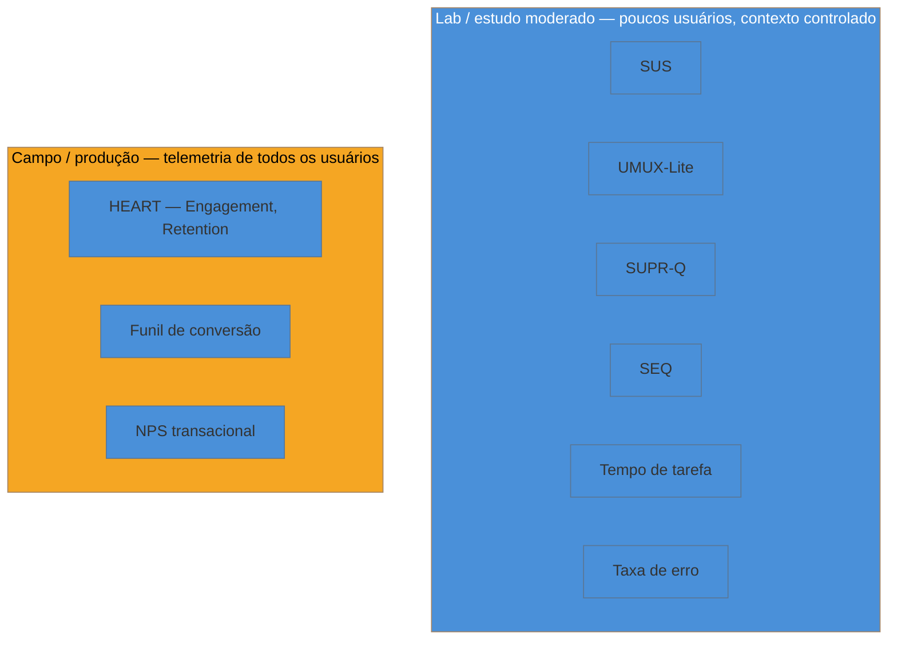

# SUS, UMUX-Lite, SUPR-Q e SEQ

> [!abstract] TL;DR
> Quatro questionários curtos operacionalizam a categoria **Happiness** do HEART (ver [[03-Dominios/Engenharia/UX/Medir, Validar e Sustentar/38 - HEART e Goals-Signals-Metrics|nota 38]]) com trade-offs diferentes: **SUS** (John Brooke, 1986) — 10 itens, score 0-100 **que não é percentual**, com **68 como média empírica de referência de milhares de estudos, não o meio matemático da escala**. **UMUX-Lite** (Lewis, Utesch & Maher, CHI 2013) — só 2 perguntas, correlação .81 com SUS, trade-off deliberado de granularidade por velocidade. **SUPR-Q** (Jeff Sauro, ~2015) — 8 itens que vão além de usabilidade e entram em confiança, aparência e lealdade, com o diferencial de dar ranking percentual contra benchmark de indústria. **SEQ** (Sauro & Dumas, ~2009) — 1 pergunta pós-tarefa, correlação moderada (r≈0.5) com tempo e taxa de sucesso, rápida o bastante para uso de campo. Nenhum dos quatro é redundante com dado comportamental — cada um captura a percepção que o log sozinho não revela.

Imagine terminar um teste de usabilidade com cinco usuários, cronometrar tempo de tarefa, contar erros — e ainda assim não saber responder a pergunta mais simples que o cliente vai fazer: "e aí, gostaram?". Tempo de tarefa e taxa de erro são dados comportamentais, objetivos, replicáveis — e nenhum deles captura a frustração de um usuário que terminou a tarefa rápido, sem erro, e ainda assim saiu da sessão dizendo "nunca mais uso isso, foi horrível". A lacuna entre "ela conseguiu" e "ela gostou" é exatamente o espaço que os quatro instrumentos desta nota preenchem — e escolher o instrumento errado para o contexto errado é o erro mais comum de quem começa a medir Happiness sem saber que existem opções com trade-offs diferentes.

## SUS: o instrumento mais usado, e o erro mais repetido sobre ele

O **System Usability Scale (SUS)**, criado por John Brooke em 1986 no artigo *"SUS: a quick and dirty usability scale"*, é um questionário de 10 itens em escala de 5 pontos (discordo totalmente → concordo totalmente), metade das afirmações redigidas positivamente e metade negativamente, para reduzir o viés de aquiescência (tendência de concordar com tudo sem ler com atenção). A pontuação final é normalizada para uma escala de **0 a 100**.

> [!warning] O erro clássico: tratar 0-100 como percentual, e o meio da escala como "normal"
> **O que acontece:** alguém vê um SUS de 68 e conclui "68% de satisfação, tá razoável, tá um pouco acima da metade". Ou pior: interpreta 50 como "a média esperada", porque é o meio matemático de 0-100. **Por quê:** o score do SUS **não é percentual** — não existe "68% das pessoas satisfeitas" nem "68% de usabilidade atingida". É um score numa escala construída a partir da soma ponderada de 10 respostas Likert, sem relação direta com proporção. E o benchmark empírico — calculado por **Jeff Sauro e James R. Lewis (2016)**, analisando dados agregados de centenas de estudos — mostra que **68 é a média histórica**, não o meio. Um produto com SUS 50 está **abaixo da média** de mercado, não "na média". **Como evitar:** sempre reporte o SUS junto com o benchmark de referência (68 = média; abaixo de ~50 é considerado ruim; acima de ~80 é excepcional) — nunca o número isolado, e nunca convertido para "%".

**Vantagem prática do SUS:** é validado por décadas de uso, tecnologicamente agnóstico (testado em terminal, site, celular, até em páginas amarelas de telefone), e a análise de Sauro/Lewis dá contexto de benchmark que nenhum dos outros três instrumentos oferece com o mesmo volume histórico de dados. **Custo:** 10 perguntas é mais fricção do que muitos testes de campo toleram, e o score sozinho não diz *o quê* está ruim — só quão ruim, de forma agregada.

## UMUX-Lite: o mesmo sinal, com metade do atrito

**Lewis, Utesch e Maher** propuseram o UMUX-Lite em CHI 2013 como resposta direta ao problema de fricção do SUS: duas perguntas — "este produto/sistema atende às minhas necessidades" e "este produto/sistema é fácil de usar" — cada uma numa escala de concordância. A confiabilidade reportada é α .82-.83 (medida de consistência interna do instrumento), e a correlação com o score de SUS no mesmo estudo é **.81** — alta o suficiente para ser usada como substituto rápido na maioria dos contextos.

O trade-off é deliberado e precisa ser dito em voz alta antes de escolher: **menos fricção de resposta, menos granularidade diagnóstica**. Duas perguntas produzem um número, mas não produzem os 10 pontos de dado que permitem, por exemplo, isolar "o usuário achou o sistema inconsistente" (item 6 do SUS) de "o usuário achou que precisava aprender muita coisa antes de usar" (item 10). Se o objetivo é um pulso rápido de satisfação — dentro de uma pesquisa maior, ou repetido a cada release para acompanhar tendência — UMUX-Lite entrega quase o mesmo sinal do SUS por um quarto do custo de resposta. Se o objetivo é diagnóstico — entender *onde* especificamente a usabilidade falha — o SUS completo carrega informação que o UMUX-Lite descarta por design.

## SUPR-Q: usabilidade não é a história inteira

**Jeff Sauro** publicou o SUPR-Q (Standardized User Experience Percentile Rank Questionnaire) no *Journal of Usability Studies*, por volta de 2015, com um objetivo diferente dos dois anteriores: SUS e UMUX-Lite medem usabilidade; SUPR-Q mede **experiência de produto digital de forma mais ampla**, com 8 itens cobrindo quatro dimensões — usabilidade, confiança/credibilidade, aparência visual e lealdade (intenção de retornar/recomendar).

O diferencial prático que separa o SUPR-Q dos outros três: ele dá um **ranking percentual contra um benchmark de indústria** (score 50 = mediana do setor comparável), não só um número absoluto. Isso resolve um problema real de comunicação com stakeholder — "seu SUS é 72" é informação isolada; "seu produto está no percentil 65 entre produtos do seu setor" é informação comparativa, mais fácil de defender numa reunião de prioridade de investimento (ver a discussão mais ampla sobre defender decisão com número na [[03-Dominios/Engenharia/UX/Medir, Validar e Sustentar/45 - Defender decisão de UX com número|nota 45]]). O custo: exige que o produto avaliado tenha uma categoria de benchmark comparável disponível, o que nem sempre é o caso para produto B2B de nicho muito específico.

## SEQ: uma pergunta, pós-tarefa, e por que não é redundante

O **Single Ease Question (SEQ)**, de **Sauro & Dumas, ~2009**, é o mais minimalista dos quatro: uma única pergunta — "quão fácil ou difícil foi completar esta tarefa?" — numa escala de 7 pontos, aplicada **imediatamente depois de cada tarefa** num teste de usabilidade, não ao final da sessão inteira.

> [!question]- Se já estou medindo tempo de tarefa e taxa de sucesso, por que perguntar isso também?
> Porque tempo e sucesso são medidas **objetivas** de desempenho, e o SEQ é uma medida **subjetiva** de esforço percebido — e as duas divergem com frequência suficiente para justificar coletar ambas. A correlação entre SEQ e tempo/taxa de sucesso é **moderada (r≈0.5)**: nem redundante, nem independente. Um usuário pode completar uma tarefa rápido e sem erro técnico e ainda relatar que "foi difícil" — porque teve que ler duas vezes, hesitou antes de clicar, ou ficou inseguro sobre se o clique certo tinha sido dado. Esse esforço percebido não aparece no cronômetro nem no contador de erro, mas prediz se a pessoa volta a usar o produto voluntariamente.

A vantagem prática do SEQ para quem trabalha sozinho: é rápido o suficiente para caber num teste de campo informal — perguntar "de 1 a 7, quão fácil foi isso" depois de cada tarefa de um teste guerrilha com 5 usuários (ver [[03-Dominios/Engenharia/UX/Fundamentos e Modelo Mental/01 - UX não é tela - o ofício e seus limites|nota 01]] sobre o que é praticável sozinho) custa segundos e não quebra o ritmo da sessão, ao contrário de aplicar um SUS de 10 itens depois de cada uma das cinco tarefas do roteiro.

## A distinção que organiza a nota inteira: lab/moderado vs. campo/produção

Os quatro instrumentos desta nota — SUS, UMUX-Lite, SUPR-Q, SEQ — junto com tempo de tarefa, taxa de erro e taxa de sucesso, nascem de **estudo moderado ou em laboratório**: você está na sala (física ou virtual) com o usuário, ou pelo menos sabe exatamente quando a tarefa começou e terminou. HEART (categoria Engagement, funil, retenção/coorte) e NPS transacional (ver [[03-Dominios/Engenharia/UX/Medir, Validar e Sustentar/40 - NPS e North Star - promessa, crítica e Goodhart|nota 40]]) nascem de **campo/produção** — telemetria de todos os usuários, sem sessão moderada, sem saber exatamente o contexto de cada evento.

"O que você mede num teste com 5 usuários" é fundamentalmente diferente de "o que você mede com telemetria de todos" — e é um erro de categoria comparar diretamente um SUS de laboratório com um NPS de produção como se fossem a mesma régua. **Em uma frase: instrumentos de laboratório medem percepção num momento controlado com poucas pessoas; instrumentos de campo medem comportamento agregado de todo mundo, sem controle de contexto** — e nenhum dos dois substitui o outro.

## O que dá pra fazer sozinho, e o que não dá

Aplicar SEQ pós-tarefa num teste guerrilha com 5 usuários é o instrumento mais **praticável sozinho** de toda esta nota — não exige licença de ferramenta, nem amostra grande, nem análise estatística além de calcular a média das respostas; cabe dentro de um teste que você já ia rodar de qualquer forma pela [[03-Dominios/Engenharia/UX/Descoberta e Pesquisa/index|prática de descoberta]] do domínio. Rodar o SUS ou o UMUX-Lite com uma amostra pequena (5-10 pessoas, os mesmos que você já entrevista para teste de usabilidade) também é praticável sozinho, contanto que você trate o resultado como **direcional, não como estatisticamente representativo** — cinco respostas dão um sinal de "algo está muito errado" ou "está razoável", não um número defensável como amostra do mercado inteiro.

Rodar o **SUPR-Q com validade de benchmark de indústria** já exige mais: o instrumento em si é curto e barato de aplicar, mas o valor real dele vem do ranking percentual contra concorrentes do setor — e isso depende de ter (ou comprar) acesso ao banco de benchmark do Sauro/MeasuringU, que é um recurso pago, fora do alcance de um projeto sem orçamento de pesquisa. É possível aplicar as 8 perguntas sozinho; não é possível gerar o ranking percentual sem a licença de comparação.

E rodar qualquer um dos quatro instrumentos com **rigor estatístico de amostra representativa** — poder estatístico calculado, margem de erro reportável, segmentação por perfil de usuário com significância — exige volume de respondentes e ferramental de análise que uma pessoa sozinha, num projeto de escopo pequeno, normalmente não tem prazo nem orçamento para viabilizar. A tradução prática: use os quatro instrumentos com confiança para orientar decisão qualitativa e comparar antes/depois do mesmo produto ao longo do tempo; não os apresente como pesquisa de mercado com validade estatística formal sem a amostra que isso exige.

## Casos práticos

### Cenário 1: SUS de 50 apresentado como "razoável"
Um engenheiro fractional aplica o SUS depois de um teste de usabilidade e reporta ao cliente: "o score foi 50, num total de 100 — tá na média, dá pra melhorar depois". O cliente relaxa a prioridade da correção. Só que 50, no benchmark de Sauro/Lewis, está **bem abaixo** da média de referência (68) — é score de produto com problema sério de usabilidade, próximo do quartil inferior de milhares de estudos comparáveis. A correção: sempre ancorar o número ao benchmark ("50 está abaixo da média histórica de 68 — isso indica fricção real, não um score neutro") antes de apresentar ao cliente, porque "50 de 100" soa neutro para quem não conhece a distribuição real dos scores.

### Cenário 2: UMUX-Lite usado quando o diagnóstico era o objetivo
Uma equipe (o cliente insistiu em rodar o teste com pressa) aplica UMUX-Lite ao final de um teste de usabilidade e recebe um score baixo — mas as duas perguntas não dizem *onde* está o problema, só que existe um. Sem o diagnóstico granular, o time gasta duas semanas debatendo hipóteses sem dado que as resolva. Rodando o SUS completo (10 itens) na rodada seguinte, os itens 4 ("eu precisaria de suporte técnico para usar isso") e 10 ("precisei aprender muita coisa antes de conseguir usar") pontuam muito pior que os outros oito — apontando diretamente para o problema de onboarding, não de interface em si. A lição: UMUX-Lite serve para acompanhar tendência ao longo do tempo; quando o objetivo é diagnosticar a causa, o SUS completo carrega informação que as duas perguntas do UMUX-Lite descartam por design.

### Cenário 3: confundir SEQ com validação de sucesso da tarefa
Num teste de usabilidade, um usuário completa uma tarefa (o sistema registra "sucesso") e dá nota 6 de 7 no SEQ — "fácil". O engenheiro conclui que a tarefa está bem desenhada e não investiga mais. Só que, revendo a gravação da sessão, o usuário hesitou por 40 segundos antes de clicar no botão certo, tentou dois caminhos errados primeiro, e só chegou ao sucesso por tentativa e erro — o SEQ alto refletiu o alívio de ter conseguido no fim, não a fluidez do caminho. A correção: tratar SEQ como complemento de tempo de tarefa e observação direta, nunca como substituto de assistir à sessão — a correlação moderada (r≈0.5) citada nesta nota é exatamente o aviso de que os dois instrumentos capturam coisas parcialmente diferentes, e um sozinho pode esconder o que o outro revelaria.

## Armadilhas comuns

> [!warning] Tratar o score SUS como percentual
> **O que acontece:** alguém lê "SUS 72" e diz "72% de satisfação" numa reunião. **Por quê:** a escala vai de 0 a 100, e o cérebro associa automaticamente esse intervalo a percentual — mas o cálculo do SUS não tem essa propriedade matemática. **Como evitar:** sempre reporte o SUS com a palavra "score" (nunca "%"), e ao lado do benchmark de referência (68 = média empírica).

> [!warning] Rodar SUS completo quando o objetivo era acompanhar tendência rápida
> **O que acontece:** o time aplica os 10 itens do SUS a cada release, gerando fadiga de resposta e queda na taxa de participação do survey. **Por quê:** o SUS foi desenhado para diagnóstico pontual e profundo, não para pulso contínuo de baixa fricção — usar a ferramenta errada para o objetivo errado degrada o próprio dado que se está tentando coletar. **Como evitar:** use UMUX-Lite para acompanhamento de tendência frequente; reserve o SUS completo para avaliações pontuais mais espaçadas, quando o diagnóstico granular importa.

> [!warning] Comparar SUS de laboratório com NPS de produção como se fossem a mesma régua
> **O que acontece:** um relatório apresenta "SUS de 75 e NPS de 40" lado a lado como se fossem duas leituras da mesma coisa em momentos diferentes. **Por quê:** os dois vêm de contextos de coleta completamente diferentes — SUS de uma sessão moderada com 5-8 pessoas, NPS de telemetria de produção com toda a base — e misturar as duas réguas sem nomear a diferença de origem confunde mais do que esclarece. **Como evitar:** sempre rotule a origem do dado (lab/moderado vs. campo/produção) junto com o número, como no diagrama desta nota.

> [!warning] Extrapolar amostra pequena de SUS/SUPR-Q como se fosse representativa do mercado
> **O que acontece:** um SUS aplicado a 5 usuários guerrilha é apresentado como "o SUS do produto", implicitamente comparável ao benchmark de milhares de estudos com o mesmo peso estatístico. **Por quê:** o número sai igual (0-100) independente do tamanho da amostra, então é fácil esquecer que a margem de erro de 5 respostas é enorme comparada a um estudo com centenas. **Como evitar:** trate o resultado de amostra pequena como sinal direcional ("parece baixo, vale investigar") — nunca como conclusão estatística definitiva.

## Como explicar em inglês

> "Four short questionnaires operationalize the Happiness dimension of HEART, each with a different trade-off. **SUS** gives a 0-100 score — not a percentage — with 68 as the empirical benchmark average, not the scale's midpoint. **UMUX-Lite** trades diagnostic granularity for speed: two questions, .81 correlation with SUS. **SUPR-Q** goes beyond usability into trust, appearance, and loyalty, with industry-percentile benchmarking. **SEQ** is a single post-task question — moderate correlation with task time and success rate, meaning it captures perceived effort that behavioral data alone misses."

| PT | EN |
|----|----|
| score, não percentual | score, not a percentage |
| média empírica de referência | empirical benchmark average |
| granularidade diagnóstica | diagnostic granularity |
| ranking percentual | percentile ranking |
| esforço percebido | perceived effort |
| estudo moderado / campo | moderated study / field |

## O que vem a seguir

Os quatro instrumentos desta nota medem percepção em contexto controlado, de poucas pessoas. A próxima nota muda de escala inteiramente: como medir opinião em produção, com toda a base de usuários — e por que o número mais citado desse mundo, o NPS, é também o mais contestado academicamente.

- [[03-Dominios/Engenharia/UX/Medir, Validar e Sustentar/40 - NPS e North Star - promessa, crítica e Goodhart|40 — NPS e North Star]] — o salto de amostra pequena/moderada para telemetria de produção, e as críticas que a maioria dos times nunca ouve.
- [[03-Dominios/Engenharia/UX/Medir, Validar e Sustentar/42 - Quando A-B não se aplica|42 — Quando A/B não se aplica]] — o que fazer quando nem o A/B nem a amostra grande estão disponíveis, o recorte mais comum deste público.

## Fontes

- **John Brooke** — *"SUS: a quick and dirty usability scale"* (1986) — artigo original que define o System Usability Scale.
- **Jeff Sauro & James R. Lewis** — *[Measuring Usability with the System Usability Scale](https://measuringu.com/sus/)* (MeasuringU) — o benchmark empírico de 68 como média, base da distinção entre score e percentual.
- **James R. Lewis, Brian S. Utesch, Deborah E. Maher** — *"UMUX-Lite: When There's No Time for the SUS"* (CHI 2013) — origem do instrumento de duas perguntas e a correlação de .81 com o SUS.
- **Jeff Sauro** — *Standardized User Experience Percentile Rank Questionnaire (SUPR-Q)*, Journal of Usability Studies (~2015) — origem do instrumento de 8 itens com benchmark de indústria.
- **Jeff Sauro & Joseph Dumas** — *"Comparison of Three One-Question, Post-Task Usability Questionnaires"* (~2009) — origem do Single Ease Question (SEQ).

> [!tip] Assista: The System Usability Scale (SUS)
> **Canal:** Nielsen Norman Group (NN/g) | **Duração:** ~6min | **Idioma:** EN
>
> Explicação direta de como aplicar e interpretar o SUS, incluindo a advertência explícita de que o score não é percentual — o mesmo ponto central desta nota. Cobertura parcial: o vídeo trata só do SUS, não aborda UMUX-Lite, SUPR-Q nem SEQ, que vêm das fontes acadêmicas listadas acima.
>
> 🎬 [Assistir no YouTube](https://www.youtube.com/watch?v=UMv_OW9__qY)
