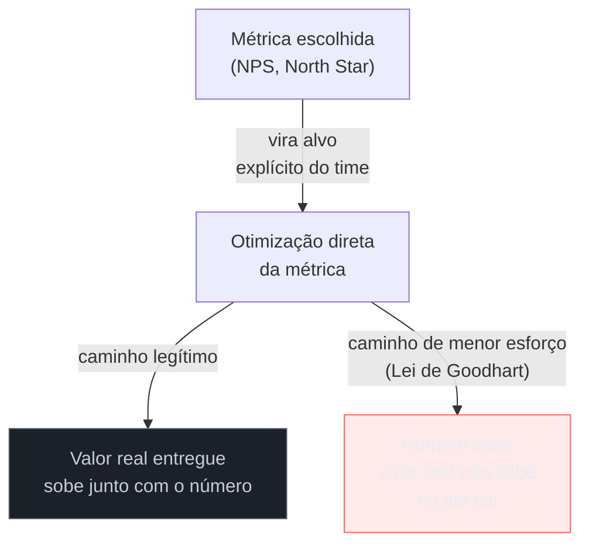

# NPS e North Star: promessa, crítica e Goodhart

> [!abstract] TL;DR
> **NPS (Net Promoter Score)** — Reichheld/Bain, HBR 2003, *"The One Number You Need to Grow"** — promete resumir lealdade de cliente numa pergunta e um número. A literatura acadêmica documenta quatro críticas robustas: validade preditiva fraca com crescimento de receita, perda de informação ao ignorar os neutros e a variação interna dos grupos, uma escala de 11 pontos com validade preditiva inferior a escalas mais simples, e uma segmentação promotor/neutro/detrator arbitrária, não derivada empiricamente. O NPS sobrevive por ser **fácil de comunicar a executivos**, não por robustez estatística. **North Star Metric** carrega um problema irmão: reduzir sucesso de produto a um número convida à **Lei de Goodhart** — quando uma medida vira alvo, ela deixa de ser boa medida, porque as pessoas otimizam o número, não o valor que ele representava. **AARRR (Pirate Metrics)**, de Dave McClure, mede negócio, não experiência — é ponte útil com growth, mas fácil de confundir com métrica de UX. O teste prático que atravessa a nota inteira: "essa métrica controla alguma decisão real, ou é vaidade?"

Imagine a reunião trimestral de resultados de um cliente B2B que você atende como fractional engineer. O NPS caiu de 42 para 31 no último trimestre. A sala inteira entra em modo de crise — "o que aconteceu, o que quebrou, precisamos de um plano de ação até sexta". Ninguém pergunta a pergunta mais básica primeiro: **esse número, isolado, diz o que exatamente mudou no comportamento real dos clientes?** A resposta, quando você olha com cuidado, costuma ser "não sabemos" — porque um NPS agregado de -11 pontos pode significar dez coisas diferentes: alguns clientes específicos ficaram muito mais insatisfeitos (concentração), muitos clientes ficaram um pouco menos satisfeitos (dispersão), a base de respondentes mudou de perfil, ou o texto da pergunta mudou de canal. O número caiu; a causa continua invisível dentro de um único dígito. É o retrato exato do que esta nota discute: a distância entre o que um número promete resumir e o que ele consegue de fato explicar.

## NPS: a promessa de 2003

Fred Reichheld publicou *"The One Number You Need to Grow"* na Harvard Business Review em 2003, em parceria com a Bain & Company (onde a metodologia foi desenvolvida e é registrada). A proposta: uma única pergunta — "em uma escala de 0 a 10, qual a probabilidade de você recomendar [empresa/produto] a um amigo ou colega?" — segmenta respondentes em três grupos: **promotores** (9-10), **neutros/passivos** (7-8) e **detratores** (0-6). O score final é `% promotores − % detratores`, um número entre -100 e +100.

A promessa era grande: substituir pesquisas de satisfação longas e caras por uma pergunta rastreável ao longo do tempo, comparável entre empresas, e — a alegação mais forte do artigo original — preditiva de crescimento de receita.

## As quatro críticas que a maioria dos times nunca ouve

A literatura acadêmica posterior a 2003 examinou a alegação preditiva com mais rigor do que o artigo original, e o resultado é desconfortável para quem usa NPS como métrica-âncora de negócio:

1. **Validade preditiva fraca** — múltiplos estudos, replicando a análise original com dados de mais empresas e períodos mais longos, não encontram associação estatisticamente significativa consistente entre NPS e crescimento de receita ou margem. A correlação forte reportada no artigo de 2003 não se replicou com a robustez que a popularidade do índice sugere.
2. **Perda de informação** — subtrair `% promotores − % detratores` descarta toda a variação **dentro** de cada grupo (um 9 e um 10 são tratados como idênticos; um 0 e um 6 também) e **ignora completamente os neutros** (notas 7-8), que representam uma fração relevante da base em muitas indústrias. Um índice que descarta parte do dado coletado perde precisão estatística em relação a tratar a escala como contínua.
3. **A escala de 11 pontos tem validade preditiva inferior a escalas mais simples** — pesquisas comparando o desempenho preditivo de diferentes formatos de escala mostram que escalas mais curtas (por exemplo, 5 pontos) frequentemente performam igual ou melhor do que a escala 0-10 do NPS na predição de comportamento futuro do cliente, o que enfraquece a justificativa de que a granularidade de 11 pontos agrega precisão real.
4. **A segmentação promotor/neutro/detrator é arbitrária** — os cortes 0-6/7-8/9-10 não vêm de análise empírica que demonstre esses serem os pontos naturais de quebra do comportamento do cliente; são convenção fixada no design original do instrumento, não derivada dos dados.

> [!question]- Se as críticas são tão consistentes, por que o NPS continua sendo o número mais usado em produto e customer success?
> Porque a persistência do NPS não depende de robustez estatística — depende de **facilidade de comunicação executiva**. Um único número, comparável trimestre a trimestre, fácil de colocar num slide de board, é politicamente mais útil do que um conjunto de métricas nuançadas que exigem contexto para interpretar. O NPS sobrevive pela mesma razão que muitas métricas de vaidade sobrevivem: é simples de reportar para cima na cadeia, não porque é o instrumento com melhor validade estatística disponível.

**O teste prático que separa uso legítimo de uso ritualístico:** antes de reportar NPS, pergunte "esse número controla alguma decisão real que vamos tomar?" Se a resposta é "vamos monitorar e conversar sobre ele" sem nenhuma ação concreta amarrada a variações do número, é métrica de vaidade — o mesmo teste vale para qualquer métrica, não só NPS.

Há ainda uma armadilha específica de quem trabalha em B2B/consultoria: o NPS, na prática, é quase sempre coletado de **quem responde ao e-mail de pesquisa** — com frequência o mesmo gestor que aprova o contrato, não necessariamente quem opera o sistema todo dia. A mesma distinção estrutural nomeada na [[03-Dominios/Engenharia/UX/Descoberta e Pesquisa/08 - Cliente não é usuário - a armadilha do B2B e consultoria|nota 08]] — cliente não é usuário — se aplica ao próprio instrumento de coleta: um NPS alto pode refletir a satisfação de quem paga, sem dizer nada sobre a experiência de quem usa.

## North Star Metric e a Lei de Goodhart

**North Star Metric** — a ideia de escolher uma única métrica que resume o valor central que o produto entrega, e alinhar times inteiros em torno dela — foi popularizada por literatura adjacente a Amplitude e ao ecossistema de growth (Sean Ellis e derivados). A promessa é sedutora: em vez de dezenas de métricas competindo por atenção, uma métrica organiza prioridade.

**Brian Balfour** e **Ravi Mehta** publicaram críticas sérias e específicas a essa ideia:

- **A Lei de Goodhart** — formulada originalmente pelo economista Charles Goodhart em contexto de política monetária, resumida na forma popular "quando uma medida vira alvo, ela deixa de ser boa medida" — se aplica com força total à North Star Metric. No momento em que uma organização inteira otimiza para um único número, as pessoas encontram formas de mover esse número que **não** correspondem ao valor real que ele deveria representar. Uma North Star de "minutos assistidos por semana" pode subir porque o produto ficou mais engajante de verdade, ou porque o time adicionou autoplay agressivo e notificação compulsiva — o número sobe do mesmo jeito, mas só o primeiro caso é o resultado desejado.
- **Otimização de curto prazo às custas de estratégia** — uma métrica única cria pressão para mover o número no próximo ciclo, o que empurra decisões para o que é rápido de mexer, não para o que constrói vantagem de longo prazo.
- **Ignorar trade-offs entre métricas correlatas** — produto real quase sempre tem tensão entre dimensões (crescimento de usuário vs. qualidade de experiência, por exemplo); reduzir tudo a um número esconde essa tensão em vez de gerenciá-la explicitamente.
- **Pressupor que uma métrica resume sucesso** — simplista demais para produto multidimensional; a mesma crítica estrutural que atravessa esta nota inteira.

O diagrama mostra a bifurcação que a Lei de Goodhart prevê: uma vez que a métrica vira alvo explícito, existem dois caminhos para movê-la, e o caminho de menor esforço nem sempre é o que gera o valor original que a métrica pretendia representar. Isso não significa "nunca escolha uma métrica principal" — significa **nunca trate a métrica como o objetivo em si**; ela é um proxy, e proxy tem prazo de validade até alguém aprender a jogar contra ele.

## AARRR / Pirate Metrics: mede negócio, não experiência

**Dave McClure** apresentou o framework AARRR — Acquisition, Activation, Retention, Referral, Revenue — na talk *"Startup Metrics for Pirates"* em 2007, virando vocabulário padrão de growth e funil de startup. Existe uma variante posterior, **RARRA** (Retention-Activation-Referral-Revenue-Acquisition), que reordena o funil colocando Retention primeiro, como crítica explícita à ordem original — a observação de que aquisição sem retenção é balde furado, e otimizar aquisição antes de garantir retenção desperdiça esforço.

O ponto de fronteira que importa para este domínio: **AARRR mede negócio (funil de aquisição, conversão, receita), não experiência de uso**. É fácil confundir os dois porque ambos aparecem em conversas de "métrica de produto" — mas Activation e Retention no AARRR respondem "o negócio está crescendo?", enquanto Task Success e Happiness no HEART (ver [[03-Dominios/Engenharia/UX/Medir, Validar e Sustentar/38 - HEART e Goals-Signals-Metrics|nota 38]]) respondem "a experiência de usar está funcionando?". Os dois conjuntos de métrica se cruzam e se influenciam, mas não são intercambiáveis — um funil de aquisição saudável pode coexistir com uma experiência de uso ruim (o produto atrai bem e frustra depois), e o inverso também é possível.

**O mecanismo em uma frase:** NPS e North Star prometem resumir algo complexo num único número fácil de comunicar; a Lei de Goodhart garante que, assim que esse número vira alvo, alguém vai encontrar o caminho mais barato de movê-lo — e o trabalho de quem mede é notar quando isso está acontecendo, não confiar cegamente no número.

## O que dá pra fazer sozinho, e o que não dá

Coletar NPS transacional — perguntado logo depois de uma interação específica, não como pesquisa anual genérica — é **praticável sozinho**: é uma pergunta, um cálculo simples, e o valor de acompanhar tendência ao longo do tempo não exige ferramenta cara. O que não é praticável sozinho, e exige mais rigor do que a maioria dos projetos tem orçamento para bancar, é **validar estatisticamente se o NPS do seu produto correlaciona de fato com retenção ou receita** — isso exigiria dados históricos de múltiplos períodos, análise de regressão controlando por outras variáveis, e volume de resposta suficiente para significância. Sem esse trabalho, tratar NPS como preditor confiável de crescimento (a alegação original de Reichheld) é assumir, sem verificar, exatamente a premissa que a literatura acadêmica mais contesta.

Escolher **uma métrica de acompanhamento simples** para orientar prioridade do próprio trabalho — "esta feature deveria mover a taxa de conclusão do onboarding" — é praticável sozinho e é, na prática, uma versão de escala reduzida de North Star Metric, sem o risco organizacional de Goodhart em larga escala, porque só uma pessoa está otimizando contra ela e pode notar rápido se está "jogando contra o número" sem gerar valor real. Já **implantar uma North Star Metric formal, com alinhamento de múltiplos times em torno dela e sistema de revisão contra Goodhart** — o tipo de governança que Balfour e Mehta descrevem como necessária para mitigar os próprios riscos que eles apontam — é estrutura organizacional que uma pessoa sozinha, num projeto de consultoria de escopo limitado, não tem autoridade nem tempo para instalar; o risco existe em qualquer escala, mas mitigá-lo de verdade exige revisão cruzada entre times, algo que não cabe numa operação de um.

## Casos práticos

### Cenário 1: NPS caiu 11 pontos e ninguém sabe por quê
O cenário de abertura desta nota, na prática: um dashboard trimestral mostra NPS caindo de 42 para 31. A reação imediata é pânico e um plano de ação genérico ("melhorar suporte", "revisar onboarding"). Um engenheiro fractional, em vez de aceitar o número agregado, pede acesso aos comentários abertos que normalmente acompanham a pergunta NPS (a maioria das ferramentas coleta um campo de texto livre junto do score) e descobre que a queda está concentrada em **um segmento específico** — clientes que migraram para um novo plano de preço no trimestre. O NPS agregado escondia um problema pontual e endereçável (comunicação da mudança de preço) atrás de um número que parecia um problema geral de produto. A correção não veio do NPS — veio de olhar o dado que o NPS, por design, descarta.

### Cenário 2: North Star vira alvo, e o time acha o atalho
Um produto de conteúdo escolhe "minutos consumidos por semana" como North Star Metric. Seis meses depois, o número subiu 30% — comemoração no all-hands. Uma investigação mais cuidadosa revela que boa parte do aumento veio de autoplay agressivo entre conteúdos e notificações push mais frequentes, não de conteúdo mais relevante. A métrica subiu; a taxa de cancelamento de assinatura, medida separadamente, subiu junto — exatamente o padrão de Goodhart que Balfour e Mehta descrevem: o time otimizou o número, e o número se descolou do valor (satisfação e retenção real) que deveria representar. A correção exigiu reintroduzir uma métrica de contrapeso (churn) monitorada junto com a North Star, não abandonar a métrica única, mas parar de tratá-la como suficiente sozinha.

### Cenário 3: confundir AARRR com métrica de UX na reunião de produto
Um cliente pede para "melhorar a UX" de um produto e aponta, como evidência do problema, a taxa de conversão de trial para pago (parte do "R" de Revenue no AARRR) caindo. O engenheiro fractional, sem separar os dois mundos, tenta resolver com ajustes de interface — copy, cor de botão, posição de CTA. A conversão continua baixa. Investigando o funil com mais cuidado, o problema real está em Retention (usuários abandonam entre o dia 3 e o dia 7 de trial, antes mesmo de chegar à decisão de compra) — que é, sim, parcialmente uma questão de Task Success (categoria HEART) porque os usuários não estão completando a tarefa central do produto a tempo de perceber valor. A confusão inicial veio de tratar uma métrica de negócio (conversão) como se fosse automaticamente uma métrica de experiência — as duas se relacionam, mas a causa raiz estava na experiência de uso nos primeiros dias, não no botão de "assinar".

## Armadilhas comuns

> [!warning] NPS como religião — reportar o número sem nunca questionar o que ele explica
> **O que acontece:** toda reunião de status inclui o NPS como item fixo de pauta, comemorado ou lamentado, sem nunca se perguntar o que exatamente está por trás da variação. **Por quê:** o número é fácil de acompanhar e virou hábito institucional — parar para questionar sua validade parece "complicar" uma métrica que todo mundo já entende. **Como evitar:** sempre acompanhe variação de NPS com os comentários qualitativos que normalmente vêm junto da coleta, e pergunte "isso controla alguma decisão específica" antes de reagir ao número isolado.

> [!warning] Otimizar o local e perder o global
> **O que acontece:** um time otimiza agressivamente uma métrica de UX isolada (por exemplo, tempo até primeira ação) sem monitorar se isso está degradando outra métrica correlata (qualidade da primeira ação, taxa de erro subsequente). **Por quê:** métricas isoladas são mais fáceis de mover e de reportar como "progresso" do que sistemas de métricas correlacionadas — mas produto real é multidimensional, e otimizar uma dimensão sozinha pode custar outra. **Como evitar:** sempre monitore pelo menos uma métrica de contrapeso junto de qualquer métrica-alvo escolhida, como no Cenário 2 (churn ao lado de minutos consumidos).

> [!warning] Tratar A/B como substituto de pensar sobre a métrica certa
> **O que acontece:** um time roda teste após teste otimizando uma métrica de curto prazo (cliques, conversão imediata) porque é a que está instrumentada e fácil de testar, sem parar para perguntar se é a métrica certa para o objetivo de negócio. **Por quê:** a métrica disponível vira a métrica importante por conveniência de medição, não porque foi escolhida deliberadamente — o mesmo problema estrutural do "instrumentar tudo antes de nomear o Goal" da [[03-Dominios/Engenharia/UX/Medir, Validar e Sustentar/38 - HEART e Goals-Signals-Metrics|nota 38]]. **Como evitar:** nomeie a métrica certa (via GSM) antes de rodar qualquer teste que a otimize — ver também [[03-Dominios/Engenharia/UX/Medir, Validar e Sustentar/42 - Quando A-B não se aplica|nota 42]] para os limites do A/B em si.

> [!warning] Confundir métrica de negócio (AARRR) com métrica de experiência (HEART)
> **O que acontece:** o pedido "melhora a UX" chega apontando uma métrica de funil de negócio (conversão, churn) como se fosse automaticamente sintoma de problema de interface. **Por quê:** as duas famílias de métrica se influenciam e às vezes se movem juntas, então é fácil tratá-las como a mesma coisa — mas a causa raiz de uma queda de conversão pode estar em preço, posicionamento ou timing, não em UX. **Como evitar:** antes de tocar em interface, investigue em qual estágio do funil AARRR o problema está concentrado e se ele de fato corresponde a uma tarefa (Task Success) ou percepção (Happiness) mal resolvida — como no Cenário 3.

## Como explicar em inglês

> "NPS promises to summarize customer loyalty in one number, but the academic literature documents four real problems: weak predictive validity with revenue growth, information loss from discarding passives and within-group variation, an 11-point scale that underperforms simpler scales, and an arbitrary promoter/passive/detractor cutoff. It survives because it's easy to report to executives, not because it's statistically robust. North Star Metric carries a related risk: **Goodhart's Law** — once a measure becomes a target, people find the cheapest way to move it, which isn't always the value it was meant to represent."

| PT | EN |
|----|----|
| promotor / neutro / detrator | promoter / passive / detractor |
| validade preditiva | predictive validity |
| Lei de Goodhart | Goodhart's Law |
| métrica de vaidade | vanity metric |
| métrica de contrapeso | counterbalancing metric |
| funil de aquisição | acquisition funnel |

## O que vem a seguir

NPS e North Star ilustram o risco de confiar cegamente num único número agregado. A próxima nota entra no lado da infraestrutura que produz os números confiáveis em primeiro lugar: como nomear e governar eventos para que a métrica que você reporta hoje ainda faça sentido daqui a seis meses.

- [[03-Dominios/Engenharia/UX/Medir, Validar e Sustentar/41 - Instrumentação - event taxonomy e tracking plan|41 — Instrumentação: event taxonomy e tracking plan]] — a disciplina de nomear evento que sustenta qualquer métrica de campo citada nesta nota.
- [[03-Dominios/Engenharia/UX/Medir, Validar e Sustentar/45 - Defender decisão de UX com número|45 — Defender decisão de UX com número]] — como usar métrica (inclusive as contestadas como NPS) de forma honesta numa conversa de negócio.

## Fontes

- **Fred Reichheld** — *[The One Number You Need to Grow](https://hbr.org/2003/12/the-one-number-you-need-to-grow)*, Harvard Business Review, 2003 — artigo original que introduz o NPS.
- **Nielsen Norman Group** — [*Net Promoter Score: What a Customer-Relations Metric Can Tell You About Your User Experience*](https://www.nngroup.com/articles/nps-ux/) — síntese das limitações do NPS aplicada especificamente a UX.
- **Brian Balfour** — crítica à North Star Metric e à Lei de Goodhart aplicada a produto — referência central da literatura de growth/produto sobre os riscos de métrica única.
- **Ravi Mehta** — crítica complementar à North Star Metric, trade-offs entre métricas correlatas.
- **Dave McClure** — *"Startup Metrics for Pirates"* (2007) — talk original que introduz o framework AARRR.

> [!tip] Assista: Downsides of the Net Promoter Score
> **Canal:** Nielsen Norman Group (NN/g), com Raluca Budiu | **Duração:** ~5min | **Idioma:** EN
>
> Cobre diretamente o argumento central desta nota — NPS perde informação ao tratar respostas dissimilares como iguais e pode ser manipulado — com recomendação explícita de usá-lo ao lado de outras métricas, nunca isolado. Cobertura parcial: o vídeo trata só do NPS; a discussão de North Star Metric, Goodhart e AARRR desta nota vem da literatura de Balfour, Mehta e McClure citada acima.
>
> 🎬 [Assistir no YouTube](https://www.youtube.com/watch?v=YwLAGDlhLM8)
