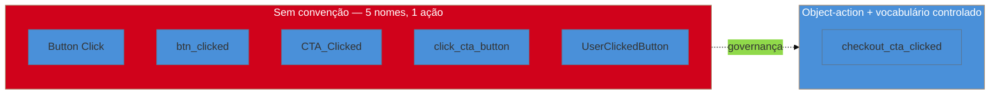

# Instrumentação: event taxonomy e tracking plan

> [!abstract] TL;DR
> Toda métrica de campo desta trilha — HEART, funil, NPS transacional — depende de eventos nomeados de forma consistente. A convenção consolidada é **object-action** (ou verb_noun): `report_exported`, `checkout_completed`, em `snake_case`, com **vocabulário controlado** (não inventar sinônimo novo a cada evento) e um **tracking plan centralizado** que mapeia evento → propriedades → dono. A tese desta nota: **taxonomia de evento sem governança apodrece** — nomes duplicados, granularidade inconsistente entre plataformas, propriedade com o mesmo nome significando coisas diferentes em dois eventos. É o mesmo problema de nomeação e contrato que você já resolve em API todo dia, só que aplicado a log de comportamento em vez de request/response. Praticável sozinho: um tracking plan em planilha ou markdown no próprio repositório já resolve a maior parte do problema.

Imagine herdar, seis meses depois de um projeto começar, um banco de eventos de analytics com os seguintes nomes convivendo lado a lado: `Button Click`, `btn_clicked`, `CTA_Clicked`, `click_cta_button`, `UserClickedButton`. Todos os cinco, ao investigar o código, registram a mesma ação — usuário clica no botão principal de conversão — mas foram adicionados por pessoas diferentes, em momentos diferentes, sem nenhuma referência entre si. Quando você tenta calcular a taxa de conversão do funil (a métrica que o cliente pediu na reunião de ontem), precisa somar cinco eventos diferentes manualmente, torcendo para não ter esquecido um sexto nome que ainda não descobriu. O produto não tem problema de UX nesse momento — tem um problema de **taxonomia**, e é o tipo de problema que cresce silenciosamente até explodir bem no momento em que alguém mais precisa confiar no número.

## Object-action: a convenção que resolve metade do problema

A convenção mais consolidada de nomeação de evento segue o padrão **object-action** (às vezes descrito como verb_noun, mesma ideia com ordem invertida): o nome do evento identifica o **objeto** sobre o qual a ação ocorreu, seguido da **ação** em si — `report_exported`, `checkout_completed`, `video_watched`, `form_submitted`. Sempre em `snake_case`, sempre em tempo passado (a ação já aconteceu quando o evento é disparado), sempre com um **vocabulário controlado** de verbos permitidos (`created`, `completed`, `viewed`, `submitted` — não sinônimos livres como `finished`, `done`, `wrapped_up` para a mesma ideia).

A convenção sozinha resolve o problema de nomeação superficial, mas não resolve o problema estrutural — que é o que realmente importa para esta nota.

## A tese: taxonomia sem governança apodrece

**Nomear bem um evento uma vez não é o problema difícil.** O problema difícil é manter a nomeação consistente ao longo de meses, com múltiplas plataformas (web, mobile, backend) e, eventualmente, mais de uma pessoa contribuindo. Sem um processo que force revisão antes de um evento novo entrar no sistema, três formas de apodrecimento aparecem de forma previsível:

1. **Nomes duplicados** — o cenário de abertura desta nota: a mesma ação ganha um nome novo cada vez que alguém precisa dela e não sabe (ou não checa) que já existe um evento equivalente.
2. **Granularidade inconsistente entre plataformas** — o app mobile dispara `checkout_started` no momento em que a tela abre; o site web dispara o evento de mesmo nome só depois que o primeiro campo é preenchido. Mesmo nome, semântica diferente — qualquer análise que junte as duas fontes está comparando coisas diferentes sem saber.
3. **Propriedades com o mesmo nome significando coisas diferentes** — um evento tem propriedade `value` representando preço em centavos; outro evento, no mesmo sistema, tem `value` representando quantidade de itens. Quem consome os dados sem contexto herdado assume o significado errado silenciosamente.

> [!question]- Isso não é exatamente o mesmo problema de nomear função e definir contrato de API?
> É exatamente o mesmo problema, com uma diferença de consequência: um nome de função ruim quebra em tempo de compilação ou em revisão de código, rápido e visível. Um nome de evento ruim quebra em análise, semanas ou meses depois, quando alguém calcula uma métrica errada sem perceber — porque o "erro" não é um erro de sintaxe, é uma inconsistência silenciosa que só aparece quando dois números que deveriam bater não batem. O custo de detecção tardia é o que torna governança de evento mais urgente do que parece à primeira vista, não menos.

Um **tracking plan centralizado** — uma fonte única de verdade que lista, para cada evento: nome, objeto/ação, propriedades esperadas (com tipo e significado), plataformas onde dispara, e **dono** (quem decide mudanças) — é o mecanismo que resolve isso. Não é ferramenta cara nem processo pesado: é o mesmo princípio de "documentação de contrato" que você já aplica a uma API interna, aplicado ao vocabulário de comportamento do produto.

**O mecanismo em uma frase:** um tracking plan não impede que alguém erre um nome de evento na primeira tentativa — impede que o erro sobreviva sem ser notado, porque existe um lugar único onde checar antes de criar algo novo.

## Fronteira com `Engenharia/Operação`

A instrumentação de evento de produto não é o mesmo assunto que **feature flags e progressive delivery**, cobertos em profundidade em [[03-Dominios/Engenharia/Operação/2 - Entrega e release/03 - Progressive delivery e rollback|Operação/Progressive delivery e rollback]] — mas os dois se cruzam de forma prática que vale nomear. Quando uma feature nova entra em rollout progressivo (1%→5%→25%→100%), a instrumentação de evento é o que permite comparar o comportamento do grupo exposto à flag ligada contra o grupo ainda na versão antiga — e essa comparação é justamente a alternativa que a [[03-Dominios/Engenharia/UX/Medir, Validar e Sustentar/42 - Quando A-B não se aplica|nota 42]], mais adiante, discute como desenho experimental mínimo para quem não tem tráfego suficiente para A/B formal. Esta nota não reexplica o mecanismo de feature flag em si — só nomeia que o evento bem instrumentado é o pré-requisito que faz o rollout progressivo servir também como instrumento de medição, não só de controle de risco de deploy.

## O que dá pra fazer sozinho, e o que não dá

Um **tracking plan em planilha ou arquivo markdown versionado no próprio repositório** — uma tabela com colunas evento/objeto-ação/propriedades/plataforma/dono, atualizada a cada evento novo adicionado ao código — já resolve a maior parte do problema de apodrecimento descrito nesta nota, e é **inteiramente praticável sozinho**: não exige ferramenta paga, não exige aprovação de mais ninguém, só a disciplina de checar o arquivo antes de escrever `track("algum_nome_novo")` no código. Definir o vocabulário controlado de verbos permitidos (uma lista curta: `created`, `completed`, `viewed`, `submitted`, `failed`, `cancelled`) também é decisão que uma pessoa toma sozinha em minutos e documenta no mesmo arquivo.

Uma **ferramenta de validação automática de schema** — que rejeita, no pipeline de CI ou na ingestão, um evento que não bate com o schema declarado no tracking plan (o tipo de garantia que ferramentas como Avo ou Segment Protocols oferecem comercialmente) — já exige mais investimento: integração de ferramenta paga, ou construção de um validador próprio contra o schema declarado. Para um projeto pequeno, a versão praticável é revisão manual do tracking plan a cada pull request que adiciona evento novo — mais barato, mais lento, mas funcional na escala de um projeto.

E **governança formal com dono dedicado de taxonomia de analytics, revisão cross-time obrigatória, e processo de depreciação de evento antigo com plano de migração** — a estrutura que empresas maiores com múltiplos times de produto adotam — é organização que uma pessoa sozinha não tem como replicar nem precisa replicar: essa estrutura existe para coordenar *várias* pessoas adicionando eventos ao mesmo sistema ao mesmo tempo, um problema que simplesmente não existe quando só você instrumenta o produto.

## Casos práticos

### Cenário 1: cinco nomes para a mesma ação, seis meses depois
O cenário de abertura desta nota, na prática: um engenheiro fractional assume um projeto de meio-termo e descobre cinco variações de nome de evento para o clique no botão principal de conversão, espalhadas entre web, mobile e um script de tracking adicionado por uma agência de marketing terceirizada. Calcular a taxa de conversão real exige primeiro reconciliar os cinco nomes manualmente, revisando o código de cada plataforma para confirmar que de fato representam a mesma ação (dois deles, na verificação, disparavam em momentos ligeiramente diferentes do fluxo — um antes da validação do formulário, outro depois). A correção: consolidar num único nome (`checkout_cta_clicked`), documentar num tracking plan markdown no repositório, e migrar os disparos antigos com um período de transição em que os dois nomes coexistem antes de descontinuar os obsoletos.

### Cenário 2: a propriedade `value` que significava duas coisas
Um dashboard de receita mostra um número absurdamente alto num determinado dia — dez vezes o normal. Investigando, o evento `purchase_completed` do checkout web envia `value` em reais (ex: `49.90`), mas um evento com o mesmo nome de propriedade, disparado por um fluxo de upgrade de plano adicionado depois por outro desenvolvedor, envia `value` como a quantidade de meses do plano contratado (ex: `12`), não o valor monetário. O dashboard, ao somar os dois eventos sem diferenciar a origem, misturava reais com contagem de meses. A correção: renomear a propriedade ambígua para algo específico por evento (`amount_brl` vs. `plan_months`) e documentar o tipo e a unidade de cada propriedade no tracking plan — não presumir que o nome de uma propriedade, sozinho, comunica seu significado.

### Cenário 3: granularidade diferente entre plataformas escondendo uma regressão real
Um produto com app mobile e site web dispara `onboarding_started` — mas o mobile dispara na abertura da primeira tela do fluxo, e o web dispara só depois que o primeiro campo é preenchido (decisão tomada por dois desenvolvedores diferentes, em momentos diferentes, sem tracking plan consultado por nenhum dos dois). Um release quebra a primeira tela do fluxo web silenciosamente — usuários abrem a página, veem um erro de carregamento, e saem sem preencher nada. Como o evento web só dispara depois do primeiro campo preenchido, a métrica de "onboarding iniciado" no web simplesmente não registra a visita quebrada — o funil mostra queda de conclusão sem mostrar aumento correspondente de "início", porque o "início" real (abrir a tela) nunca foi contabilizado daquele jeito na plataforma web. Alinhar a semântica de disparo entre as duas plataformas (ambas disparando na abertura da tela, não no primeiro preenchimento) revela o problema imediatamente na métrica seguinte.

## Armadilhas comuns

> [!warning] Adicionar evento novo sem checar se um equivalente já existe
> **O que acontece:** cada desenvolvedor (ou você mesmo, meses depois, esquecendo o que já fez) cria um nome novo para uma ação que já tinha instrumentação, gerando duplicidade silenciosa. **Por quê:** é mais rápido escrever `track("novo_nome")` do que parar para procurar se já existe algo parecido — e sem um tracking plan centralizado, não há onde procurar. **Como evitar:** trate "checar o tracking plan antes de criar evento novo" como parte do processo de escrever a feature, não como etapa opcional — o mesmo hábito de checar se uma função utilitária já existe antes de escrever outra.

> [!warning] Deixar o nome do evento livre de vocabulário controlado
> **O que acontece:** verbos diferentes para a mesma semântica (`completed`, `finished`, `done`) aparecem espalhados pelo código, cada um escolhido pelo gosto de quem escreveu naquele momento. **Por quê:** sem uma lista fixa e documentada de verbos permitidos, cada pessoa (inclusive você mesmo em dias diferentes) escolhe a palavra que "soa certo" no momento, sem lembrar da escolha anterior. **Como evitar:** fixe um vocabulário curto de verbos no tracking plan (5-8 verbos cobrem a maioria dos casos) e trate qualquer verbo fora da lista como sinal para revisar antes de adicionar.

> [!warning] Confiar em propriedade com nome genérico sem documentar tipo e unidade
> **O que acontece:** propriedades como `value`, `amount`, `type` acumulam significados diferentes entre eventos, como no Cenário 2 desta nota. **Por quê:** nomes genéricos parecem reutilizáveis e economizam esforço de nomeação no momento — mas escondem ambiguidade que só aparece quando alguém tenta agregar os dados de dois eventos diferentes. **Como evitar:** documente tipo, unidade e significado de cada propriedade no tracking plan, e prefira nomes específicos (`amount_brl`) a nomes genéricos (`value`) sempre que a mesma propriedade puder existir em mais de um evento com significado diferente.

> [!warning] Instrumentar sem hipótese, esperando que o dado "fale sozinho" depois
> **O que acontece:** eventos são adicionados por precaução ("pode ser útil depois"), sem estarem ligados a um Goal declarado (ver [[03-Dominios/Engenharia/UX/Medir, Validar e Sustentar/38 - HEART e Goals-Signals-Metrics|nota 38]]), inflando o tracking plan com ruído que ninguém nunca consulta. **Por quê:** instrumentar parece de baixo custo e alto potencial futuro — mas cada evento adicionado sem propósito claro é manutenção futura (documentação, revisão de schema, espaço no tracking plan) sem retorno correspondente. **Como evitar:** só adicione evento novo quando conseguir nomear, em uma frase, qual Goal/Signal/Metric ele alimenta — se não consegue, ainda não é hora de instrumentar.

## Como explicar em inglês

> "Every field metric in this domain depends on consistently named events. The consolidated convention is **object-action** naming (`checkout_completed`, `report_exported`) in snake_case, with a **controlled vocabulary** and a **centralized tracking plan** mapping event → properties → owner. The core thesis: an event taxonomy without governance rots — duplicate names, inconsistent granularity across platforms, the same property name meaning different things in different events. It's the same naming-and-contract discipline you already apply to APIs, applied to behavioral logging instead."

| PT | EN |
|----|----|
| taxonomia de evento | event taxonomy |
| vocabulário controlado | controlled vocabulary |
| plano de rastreamento | tracking plan |
| dono do evento | event owner |
| apodrecer (taxonomia) | to rot / decay |
| granularidade inconsistente | inconsistent granularity |

## O que vem a seguir

Com a instrumentação nomeada e governada, a pergunta natural seguinte é como usar esse dado para decidir entre duas versões de uma feature — e por que, para boa parte deste público (cliente único, B2B, tráfego baixo), a resposta clássica "roda um A/B" simplesmente não se aplica.

- [[03-Dominios/Engenharia/UX/Medir, Validar e Sustentar/42 - Quando A-B não se aplica|42 — Quando A/B não se aplica]] — o que fazer quando a instrumentação está pronta mas o tráfego não sustenta teste formal.
- [[03-Dominios/Engenharia/UX/Medir, Validar e Sustentar/44 - UX debt e matriz severidade x esforço|44 — UX debt e matriz severidade × esforço]] — como o mesmo rigor de nomeação e contrato desta nota se aplica a priorizar dívida de UX.

## Fontes

- **Amplitude** — [*The Foundation for Great Analytics is a Great Taxonomy*](https://amplitude.com/blog/event-taxonomy) — referência de mercado para convenção object-action e boas práticas de tracking plan.
- **Amplitude** — [*Best Practices to Follow When Creating or Evolving Your Analytics Tracking*](https://amplitude.com/blog/analytics-tracking-practices) — governança e ownership de taxonomia.
- **Operação** — [[03-Dominios/Engenharia/Operação/2 - Entrega e release/03 - Progressive delivery e rollback|Progressive delivery e rollback]] — cobertura técnica de feature flags que esta nota referencia como fronteira, sem reexplicar.

> [!tip] Assista: Build Your First Tracking Plan | Product Analytics Basics
> **Canal:** Product Analytics Academy | **Duração:** ~16min | **Idioma:** EN
>
> Explica o formato evento/propriedade de um tracking plan com exemplo prático (plataforma de vídeo), incluindo a diferença entre nome do evento (a ação) e propriedades (contexto da ação) — o mesmo par de conceitos centrais desta nota. Cobertura parcial: o vídeo foca na estrutura de um tracking plan para uma ferramenta específica de analytics; a discussão sobre apodrecimento de taxonomia sem governança e a fronteira com feature flags são desenvolvidas nesta nota a partir de outras fontes.
>
> 🎬 [Assistir no YouTube](https://www.youtube.com/watch?v=7Gqy_Kqmg70)
