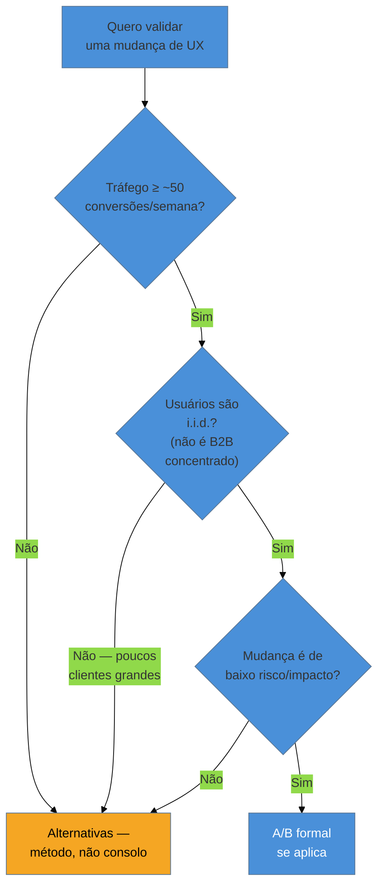
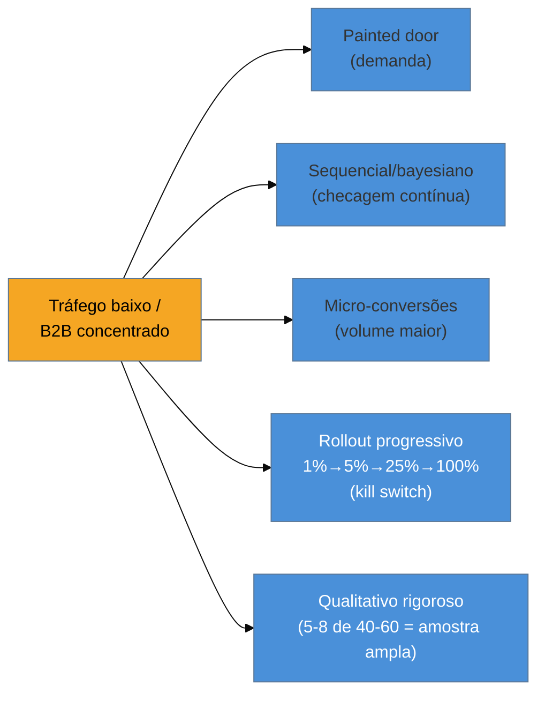

# Quando A/B não se aplica

> [!abstract] TL;DR
> Cliente único, B2B com poucos clientes grandes e tráfego baixo **não são azar — são a condição estrutural** da maioria dos produtos que um fractional engineer constrói. A/B formal exige volume de conversão (regra prática: abaixo de ~50 conversões/semana, o teste é impraticável em prazo razoável) e amostra i.i.d. (independente e identicamente distribuída) — condição que B2B com poucos decisores grandes quebra por definição, porque os decisores de um mesmo cliente não são amostra aleatória entre si. Onde o A/B não cabe, quatro alternativas existem como **método de primeira classe, não consolo**: painted door tests, testes sequenciais/bayesianos (que resolvem o problema de *peeking* — checar resultado antes do N calculado, que infla falso-positivo), foco em micro-conversões em vez do evento terminal, **feature flag com rollout progressivo (1%→5%→25%→100%) como o desenho experimental mínimo** de quem não tem escala, e pesquisa qualitativa tratada com o mesmo rigor metodológico que um teste quantitativo — não como plano B de quem não conseguiu rodar o A/B "de verdade".

Imagine a cena mais comum de quem constrói produto B2B sozinho: você tem uma hipótese de melhoria — trocar o fluxo de um formulário de três passos para um passo único — e o primeiro instinto, formado por anos lendo sobre como Amazon e Booking.com decidem produto, é "vamos rodar um A/B para ver qual converte melhor". Só que o produto tem **12 clientes**, todos empresas, cada uma com 3-8 usuários internos usando o sistema. Não existem milhares de visitantes anônimos passando pelo formulário todo dia — existem os mesmos 40-60 funcionários entrando no sistema, quase sempre, nos mesmos horários, para fazer as mesmas tarefas recorrentes. Rodar um A/B clássico aqui não é "mais difícil" — é estatisticamente inviável dentro de qualquer prazo que um projeto de consultoria sustenta. E a reação mais comum, nesse momento, é errada: tratar isso como uma limitação vergonhosa, uma desculpa para "não fazer ciência de verdade" e recorrer, encabulado, a "só" pesquisa qualitativa. Essa reação é o erro central que esta nota existe para corrigir.

## Onde o A/B quebra, e por quê

O A/B testing clássico depende de premissas estatísticas que a maioria da literatura de growth de Big Tech nunca precisa questionar, porque o tráfego delas as satisfaz automaticamente. Para o público deste domínio, cada uma dessas premissas quebra com frequência:

**Tráfego baixo estrutural.** Não é escolha nem falta de esforço de marketing — é limite físico do produto. Uma regra prática amplamente citada: **abaixo de aproximadamente 50 conversões por semana no evento que você quer testar**, alcançar significância estatística com um efeito detectável razoável se torna impraticável dentro de um prazo de projeto normal — o teste levaria meses ou anos para acumular dado suficiente, tempo que nenhum cliente de consultoria vai esperar.

**B2B com poucos clientes grandes.** Aqui o problema não é só volume — é a premissa estatística de **i.i.d.** (independente e identicamente distribuído) que qualquer teste de hipótese formal assume. Os usuários de uma mesma empresa cliente **não são amostra aleatória independente entre si**: eles compartilham treinamento, cultura interna, decisões de gestão sobre como usar o sistema, e influência mútua direta ("fulano me mostrou como fazer assim"). Dividir aleatoriamente usuários de uma mesma empresa em grupo A e grupo B, e tratar o resultado como se fossem observações independentes, viola a premissa que sustenta o cálculo de significância — o teste "funciona" tecnicamente, mas a matemática por trás dele está sendo aplicada fora das condições em que é válida.

**Ciclo de venda longo.** Em B2B, a conversão que realmente importa (renovação de contrato, expansão de uso, upsell) acontece **meses** depois da interação que você testaria — muito fora da janela de qualquer teste de poucas semanas. Um A/B de curto prazo não tem como capturar o efeito real na métrica de negócio que importa.

**Mudança de alto impacto/risco.** Quando a mudança candidata é grande o suficiente para que metade dos usuários ficar numa variante pior seja inaceitável — um fluxo financeiro crítico, uma mudança regulatória — expor 50% da base a uma variante não testada é um risco que nenhum A/B "vale a pena" absorver, independente do tamanho da amostra disponível.

## Amostra, MDE e peeking: os três conceitos que sustentam a decisão

Antes de qualquer alternativa fazer sentido, três conceitos estatísticos precisam estar claros — porque são eles que explicam *por que* o A/B falha aqui, não só *que* ele falha:

**Tamanho de amostra depende de baseline e de MDE.** O número de observações necessário para um teste alcançar significância não é fixo — depende da taxa de conversão atual (baseline) e do **MDE** (*minimum detectable effect*, o menor tamanho de efeito que você quer conseguir detectar). Detectar uma melhora de 20% numa conversão que já é rara e pequena exige muito mais amostra do que detectar uma melhora de 20% numa conversão comum e alta. Isso significa que produtos de baixo tráfego não estão necessariamente impedidos de testar **qualquer** mudança — mudanças de efeito **grande** (uma reformulação drástica, não um ajuste de cor de botão) podem ser detectáveis com amostra menor, porque o MDE necessário é maior e mais fácil de alcançar.

**Poder estatístico** é a probabilidade de detectar um efeito real quando ele existe (evitar falso-negativo). Baixo tráfego reduz poder estatístico diretamente — mesmo que o efeito real exista, a chance de não conseguir prová-lo estatisticamente sobe.

**Peeking** — checar o resultado do teste antes de atingir o N calculado, e parar assim que uma das variantes "parece" vencedora — **infla a taxa de falso-positivo**. Isso não é falha de disciplina de quem está testando; é uma consequência estatística real de checar um resultado múltiplas vezes ao longo do tempo: cada checagem intermediária é uma nova chance de observar uma flutuação aleatória que parece significativa por acaso. É exatamente essa consequência estatística que motivou o desenvolvimento de **testes sequenciais** e **métodos bayesianos** de teste — desenhados especificamente para permitir checagem contínua sem inflar o falso-positivo, ao custo de exigir ferramental estatístico mais sofisticado do que o teste de hipótese clássico de "checa uma vez, no N calculado".

> [!question]- Se peeking é tão problemático, por que não simplesmente "não checar antes da hora"?
> Porque a pressão para checar cedo é estrutural, não uma fraqueza pessoal de disciplina. Num projeto de baixo tráfego, o N calculado pode levar meses para ser atingido — e um cliente perguntando "e aí, como está indo o teste?" toda semana não vai aceitar "ainda não posso dizer nada" indefinidamente. A resposta metodologicamente correta não é "ter mais disciplina" — é **usar um método desenhado para checagem contínua** (sequencial/bayesiano) quando checagem frequente é uma necessidade real do contexto, em vez de fingir disciplina que a pressão do projeto não permite manter.

## As alternativas — método, não consolo

Este é o ponto que separa esta nota de um lamento sobre limitação: as quatro alternativas abaixo não são "o que fazer enquanto você não tem um A/B de verdade" — são **desenho experimental de primeira classe para o contexto de tráfego baixo/B2B**, com sua própria disciplina e seus próprios critérios de rigor.

**Painted door tests.** Apresentar uma opção (um botão, uma feature, um plano de preço) que ainda não existe de verdade, e medir quantas pessoas tentam clicar/usar antes de construir a coisa real. Não substitui validação de usabilidade da solução final, mas responde uma pergunta anterior e mais barata: "existe demanda suficiente para justificar construir isso?" — sem exigir tráfego de conversão real, porque a métrica é intenção de clique, não conclusão de uma jornada inteira.

**Testes sequenciais e bayesianos.** Já discutidos acima como resposta direta ao problema de peeking — permitem monitorar o resultado continuamente e decidir parar (ou continuar) com controle estatístico apropriado do risco de falso-positivo, em vez de fingir que ninguém vai olhar o painel antes do prazo.

**Foco em micro-conversões, não no evento terminal.** Em vez de esperar pela conversão final (fechamento de contrato, renovação — os eventos raros que definem o ciclo de venda longo), medir eventos intermediários de alta frequência que sejam sinal honesto de progresso: form starts, demo requests, tempo até a primeira ação de valor. Micro-conversões acontecem com frequência muito maior que a conversão terminal, o que dá volume suficiente para comparação estatística mesmo em produto de baixo tráfego — desde que a ligação entre a micro-conversão e o resultado de negócio real seja estabelecida com cuidado, não presumida.

**Feature flag com rollout progressivo como o desenho experimental mínimo.** Este é o ponto mais importante da nota para quem já vem de contexto de engenharia: um rollout de 1%→5%→25%→100%, com **kill switch** se a métrica monitorada degradar em qualquer estágio, **é** um desenho experimental — só que sequencial e de risco decrescente, em vez de um split fixo 50/50 avaliado de uma vez. Você não está "fugindo" de testar; está testando de um jeito que combina com o volume real disponível: cada estágio do rollout é uma checagem, o critério de avanço/recuo é pré-definido (não é peeking arbitrário, porque os pontos de checagem — 1%, 5%, 25% — foram decididos antes de começar), e o custo de um resultado ruim é limitado pela própria progressividade. É a mesma ferramenta discutida em profundidade em [[03-Dominios/Engenharia/Operação/2 - Entrega e release/03 - Progressive delivery e rollback|Operação/Progressive delivery e rollback]], reaproveitada aqui como instrumento de medição, não só de controle de risco de deploy — e depende da instrumentação de evento nomeada de forma consistente na [[03-Dominios/Engenharia/UX/Medir, Validar e Sustentar/41 - Instrumentação - event taxonomy e tracking plan|nota 41]] para que cada estágio produza sinal comparável.

**Pesquisa qualitativa como método de primeira classe.** Não "o que fazer quando não dá para medir" — um instrumento com seu próprio rigor: entrevista estruturada, teste de usabilidade com roteiro consistente, SEQ pós-tarefa (ver [[03-Dominios/Engenharia/UX/Medir, Validar e Sustentar/39 - SUS, UMUX-Lite, SUPR-Q e SEQ|nota 39]]) aplicado a 5-8 usuários reais de um cliente B2B. Numa base de 40-60 usuários totais, entrevistar 5-8 pessoas não é "amostra pequena de um estudo maior que não coube no orçamento" — é uma fração substancial e representativa da população inteira do produto, algo que nenhum A/B de uma empresa com milhões de usuários jamais conseguiria dizer sobre sua própria amostra de teste.

> [!warning] Tratar A/B como substituto de pensar
> **O que acontece:** uma equipe roda um teste sem hipótese clara ("vamos testar cor de botão para ver o que acontece") ou terceiriza para o resultado do teste uma decisão que exigia julgamento — "não sei se essa mudança é boa, mas o A/B vai me dizer".
> **Por quê:** rodar um teste dá a sensação de rigor e neutralidade ("os dados decidiram, não eu"), mesmo quando o teste em si foi mal desenhado, subdimensionado, ou está sendo usado para evitar uma decisão que já tinha evidência suficiente sem ele.
> **Como evitar:** declare a hipótese e o critério de decisão **antes** de rodar qualquer teste (o mesmo princípio do GSM na [[03-Dominios/Engenharia/UX/Medir, Validar e Sustentar/38 - HEART e Goals-Signals-Metrics|nota 38]]) — e reconheça quando uma decisão já tem evidência qualitativa suficiente para ser tomada sem esperar um teste que o tráfego não sustenta de qualquer forma.

## O que dá pra fazer sozinho, e o que não dá

Rodar **testes qualitativos rigorosos com 5-8 usuários** — roteiro de entrevista estruturado, SEQ pós-tarefa, análise sistemática de padrão entre as sessões — é inteiramente **praticável sozinho**: não exige tráfego, não exige ferramenta de experimentação, exige tempo de conversa e disciplina de síntese. Numa base de 40-60 usuários, como no cenário de abertura, essa amostra representa uma fração real e substancial da população, o que muda completamente o peso metodológico dela em comparação com o mesmo tamanho de amostra tirado de uma base de milhões.

Implementar um **rollout progressivo com feature flag e critério de kill switch pré-definido** também é praticável sozinho do ponto de vista técnico — a ferramenta (flag simples, ou biblioteca open-source de feature flag) não exige orçamento de plataforma, e o critério de avanço/recuo é uma decisão que você documenta antes de começar. O que exige mais cuidado, sem ser necessariamente fora de alcance, é garantir que a instrumentação de evento (nota 41) esteja madura o suficiente para que cada estágio do rollout gere sinal confiável — se a instrumentação está apodrecida, o rollout progressivo perde a capacidade de servir como medição, mesmo continuando a servir como controle de risco de deploy.

Já **testes sequenciais/bayesianos com ferramental estatístico formal** e **análise multivariada controlando por variável de confusão** (necessária, por exemplo, para separar o efeito de uma mudança de UX do efeito de uma campanha de marketing simultânea) exigem conhecimento estatístico além do que a maioria dos engenheiros fractional carrega por padrão, ou uma ferramenta comercial (Optimizely, VWO com módulo bayesiano) que tem custo de licença. A versão praticável sozinho, quando o rigor bayesiano completo está fora de alcance, é ser explícito sobre a limitação — "estamos monitorando continuamente e vamos decidir com base em tendência e magnitude do efeito, não com significância formal calculada" — em vez de fingir rigor estatístico que não está sendo aplicado de fato.

## Casos práticos

### Cenário 1: o formulário de três passos que "precisava" de A/B
No cenário de abertura desta nota — 12 clientes B2B, 40-60 usuários totais, mudança de formulário de três passos para um passo único — a primeira reação da equipe é tentar rodar um A/B 50/50 mesmo assim, "porque é o jeito certo de testar". Depois de três semanas, o teste acumulou 34 conversões no total, entre as duas variantes — muito abaixo do N necessário para qualquer significância, e a maioria das conversões vindas de **apenas dois clientes** que usam o formulário com mais frequência, violando i.i.d. na prática. A correção: abandonar o A/B formal e rodar um teste de usabilidade guerrilha com 6 usuários de 4 clientes diferentes, usando SEQ pós-tarefa nas duas versões do formulário — resultado claro e acionável em uma semana, com amostra que representa 10-15% da população total de usuários do produto.

### Cenário 2: o rollout progressivo que revelou o problema sem precisar de significância estatística
Uma feature de nova navegação é lançada via feature flag com rollout de 5% dos usuários na primeira semana. Não há tráfego suficiente para calcular significância formal entre grupo exposto e não-exposto — mas o time monitora a taxa de erro de navegação (evento instrumentado conforme a nota 41) e observa, já nos primeiros dias, um aumento de 3x nos erros de "página não encontrada" reportados pelos usuários no grupo exposto à flag. O kill switch pré-definido ("reverter se erro de navegação subir mais que 2x") é acionado antes mesmo de chegar ao estágio de 25%. Nenhum teste de hipótese formal foi calculado — o desenho progressivo, com critério de decisão pré-definido, funcionou como instrumento de detecção de problema sem depender de volume que o produto não tinha.

### Cenário 3: confundir "pouco tráfego" com "não vale a pena medir nada"
Um engenheiro fractional, ao constatar que o produto não tem tráfego para A/B, conclui — errado — que a alternativa é "confiar no instinto" e para de instrumentar qualquer coisa. Seis meses depois, uma mudança de UX que "parecia certa" é revertida às pressas quando um cliente importante reclama de uma regressão que ninguém tinha percebido, porque nenhuma métrica de acompanhamento (nem micro-conversão, nem qualitativo) estava sendo coletada. A correção: mesmo sem A/B, um mínimo de instrumentação de micro-conversão (por exemplo, taxa de conclusão da primeira tarefa depois da mudança, comparada ao período anterior) e uma rodada leve de SEQ pós-lançamento teriam sinalizado o problema em dias, não meses — a ausência de A/B não é motivo para abandonar toda medição, é motivo para escolher a alternativa certa entre as cinco desta nota.

## Armadilhas comuns

> [!warning] Rodar A/B formal com tráfego insuficiente e tratar o resultado como conclusivo
> **O que acontece:** um teste roda com poucas dezenas de conversões e "declara" uma variante vencedora, que vira decisão de produto permanente.
> **Por quê:** o resultado do teste sai como um número e uma cor (verde = ganhou), dando aparência de rigor mesmo quando a amostra é pequena demais para sustentar aquela confiança.
> **Como evitar:** calcule o N necessário (baseline + MDE) **antes** de rodar o teste, e se o tráfego disponível não alcança esse N num prazo razoável, mude para uma das alternativas desta nota em vez de rodar o teste mesmo assim.

> [!warning] Tratar usuários de um mesmo cliente B2B como amostra i.i.d.
> **O que acontece:** um teste divide aleatoriamente usuários individuais de uma mesma empresa cliente entre grupo A e B, tratando cada usuário como observação independente.
> **Por quê:** a divisão aleatória por usuário *parece* metodologicamente correta, mas ignora que usuários da mesma empresa se influenciam mutuamente e compartilham contexto — violando a premissa estatística de independência sem que isso apareça no resultado.
> **Como evitar:** quando o teste envolve poucos clientes B2B, considere randomizar por **empresa inteira**, não por usuário individual, ou trate o resultado como estudo de caso qualitativo em vez de teste estatístico formal.

> [!warning] Peeking disfarçado de "acompanhamento de progresso"
> **O que acontece:** o time checa o painel do teste todo dia, e assim que uma variante "parece" à frente, encerra o teste e declara vencedor — sem ter calculado ou respeitado o N necessário.
> **Por quê:** a pressão de negócio para responder rápido é real, e checar o painel parece inofensivo — mas cada checagem intermediária infla o risco de falso-positivo de forma cumulativa.
> **Como evitar:** se checagem contínua é uma necessidade real do contexto (cliente pressiona por atualização semanal), use método sequencial/bayesiano desenhado para isso — não um teste de hipótese clássico checado fora do protocolo.

> [!warning] Tratar qualitativo como "plano B" de quem não conseguiu rodar o teste de verdade
> **O que acontece:** a pesquisa qualitativa é apresentada ao cliente com desculpa ("não tivemos tráfego suficiente para um A/B, então fizemos entrevistas") em vez de ser apresentada como o método certo escolhido deliberadamente para o contexto.
> **Por quê:** a cultura de produto, fortemente influenciada por literatura de Big Tech com tráfego alto, trata quantitativo como "ciência de verdade" e qualitativo como substituto de segunda categoria — uma hierarquia que não reflete o rigor metodológico real de cada método aplicado ao contexto certo.
> **Como evitar:** apresente o método qualitativo pelo que ele é — a ferramenta certa para uma população pequena e concentrada, com amostra que representa uma fração real e substancial do total de usuários — nunca como consolo por não ter conseguido "o teste de verdade".

## Como explicar em inglês

> "Single-client, B2B-with-few-large-customers, and low-traffic products aren't bad luck — they're the structural condition for most fractional engineering work. Formal A/B testing requires volume (roughly 50+ conversions/week as a practical floor) and an i.i.d. sample — a premise that concentrated B2B traffic violates by design, since users within the same account aren't independent of each other. Where A/B doesn't fit, painted door tests, sequential/Bayesian testing, micro-conversion tracking, **progressive feature-flag rollout as the minimum viable experimental design**, and rigorous qualitative research are first-class methods — not consolation prizes."

| PT | EN |
|----|----|
| i.i.d. (independente e identicamente distribuído) | i.i.d. (independent and identically distributed) |
| efeito mínimo detectável (MDE) | minimum detectable effect (MDE) |
| espiar o resultado / peeking | peeking |
| micro-conversão | micro-conversion |
| rollout progressivo | progressive rollout |
| desenho experimental mínimo | minimum viable experimental design |

## O que vem a seguir

Rodar o teste certo — formal ou alternativo — ainda deixa uma lacuna: como interpretar o comportamento observado quando você não tem hipótese prévia clara, só uma gravação de sessão ou um mapa de calor. A próxima nota trata exatamente do limite entre "ver o que aconteceu" e "provar por que aconteceu".

- [[03-Dominios/Engenharia/UX/Medir, Validar e Sustentar/43 - Session replay e heatmap - o que provam e o que não|43 — Session replay e heatmap]] — o que esse tipo de dado observacional prova, e o que só parece provar.
- [[03-Dominios/Engenharia/UX/Medir, Validar e Sustentar/45 - Defender decisão de UX com número|45 — Defender decisão de UX com número]] — como comunicar ao cliente uma decisão baseada em método alternativo ao A/B sem parecer que é "menos rigorosa".

## Fontes

- **Convert / VWO / Portent** — literatura consolidada de mercado sobre limites práticos de A/B testing em baixo tráfego (regra prática de conversões/semana necessárias, e recomendação de priorizar mudanças de efeito grande quando o tráfego é baixo).
- **Rosie Hoggmascall** — talk *"Low-traffic testing: How to test with a low sample size"* (Experiment Nation) — discussão de alternativas práticas de teste para produtos sem escala de Big Tech, base do vídeo desta nota.
- **Operação** — [[03-Dominios/Engenharia/Operação/2 - Entrega e release/03 - Progressive delivery e rollback|Progressive delivery e rollback]] — cobertura técnica de feature flags e rollout progressivo, reaproveitada aqui como desenho experimental mínimo.

> [!tip] Assista: Low-traffic testing: How to test with a low sample size
> **Presente:** Rosie Hoggmascall, produção Experiment Nation | **Duração:** ~22min | **Idioma:** EN (legenda automática)
>
> Aborda diretamente o cenário central desta nota: produtos novos, com poucos usuários ou recursos de teste, e como escolher método alternativo em vez de forçar um A/B sem tráfego suficiente — incluindo a observação de que menos de 30 observações por variante já inviabiliza estatística formal, e que mudanças de efeito grande são mais detectáveis com amostra pequena que mudanças de efeito pequeno. Cobertura parcial: o vídeo foca em contexto B2C de app de assinatura; a discussão específica de i.i.d. quebrado por concentração B2B e o uso de feature flag como desenho experimental vêm de síntese própria desta nota.
>
> 🎬 [Assistir no YouTube](https://www.youtube.com/watch?v=BaCLS465BIM)
