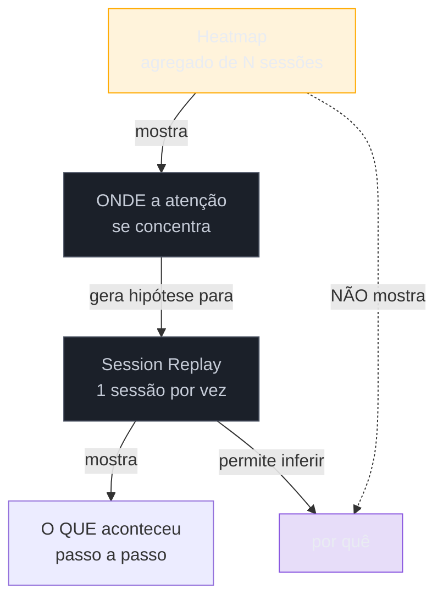

# Session replay e heatmap: o que provam e o que não

> [!abstract] TL;DR
> **Session replay** grava a sessão de um usuário passo a passo e responde "o que aconteceu"; **heatmap** agrega clique/scroll de muitas sessões e responde só "onde" — nunca "por quê". O erro mais caro deste par de ferramentas é tratar o heatmap como prova: ele não distingue usuário engajado de usuário confuso clicando repetidamente no mesmo lugar, é agregado (não isola casos individuais), e não quantifica frequência real sem uma ferramenta de analytics complementar. **Heatmap é gerador de hipótese, nunca prova causal.** Session replay tem risco de privacidade sério e concreto: GDPR/CCPA exigem consentimento e **mascaramento de PII por padrão** (senha, cartão, dado sensível) — a falha mais comum de quem adota a ferramenta é gravar tudo sem anonimizar antes de perguntar se pode.

Imagine revisar um heatmap de uma página de checkout e ver uma mancha vermelha intensa — o ponto mais clicado da tela inteira — bem em cima de um elemento que parece decorativo, um ícone de cadeado ao lado do texto "pagamento seguro". A reação natural é comemorar: "as pessoas estão prestando atenção na garantia de segurança, isso é ótimo para confiança". Um mês depois, ao finalmente assistir a gravações de sessão reais (não só o mapa agregado), a explicação verdadeira aparece: o ícone parece clicável — tem contorno de botão, está alinhado como se fosse interativo — e dezenas de usuários estão clicando nele repetidamente, frustrados, porque **esperam que ele faça algo** (expandir um detalhe de segurança, abrir um selo de certificação) e nada acontece. A mancha vermelha do heatmap não media "atenção positiva" — media confusão registrada como clique repetido, e o mapa de calor, sozinho, não tinha como distinguir as duas coisas. É exatamente esse limite que esta nota nomeia com precisão: heatmap mostra onde, nunca por quê — e confundir os dois custa decisões erradas tomadas com confiança de sobra.

## Heatmap: o que ele mostra, e o que ele não pode mostrar

Um heatmap agrega o comportamento de clique, movimento de mouse (proxy imperfeito de atenção visual) ou profundidade de scroll de **muitas sessões**, sobrepondo uma visualização de cor sobre a tela: vermelho/laranja onde a concentração é alta, azul/frio onde é baixa. É uma ferramenta de agregação por design — e é exatamente esse design que define, ao mesmo tempo, sua utilidade e seu limite.

**O que o heatmap prova, de fato:** onde a atenção (ou pelo menos o clique) se concentra, de forma visual e rápida de comunicar a um stakeholder que não vai ler uma tabela de eventos.

**O que o heatmap não prova — e é o ponto central desta nota:**

- **Não explica *por quê* a concentração acontece ali.** Uma mancha vermelha pode significar "elemento funciona bem e as pessoas o usam com sucesso" ou "elemento confunde e as pessoas clicam tentando entender o que ele faz" — visualmente, as duas hipóteses produzem exatamente a mesma cor no mapa.
- **Não distingue "usuário engajado" de "usuário confuso clicando repetidamente".** Essa é a armadilha do cenário de abertura: um clique repetido no mesmo ponto (às vezes chamado de *rage click* em ferramentas mais avançadas) tem a mesma assinatura visual agregada de um elemento genuinamente popular e bem-sucedido.
- **É agregado — não isola casos individuais.** O heatmap não permite perguntar "e aquele usuário específico que veio do anúncio X, o que ele fez?" — para isso, é preciso voltar a sessões individuais, que é exatamente o papel do session replay.
- **Não quantifica frequência sem uma ferramenta de analytics complementar.** A intensidade da cor comunica concentração relativa dentro daquele mapa, não um número absoluto comparável a outro período — "esse botão recebeu 40% mais cliques que o mês passado" não é uma afirmação que um heatmap sozinho consegue sustentar sem cruzar com dado de evento instrumentado (ver [[03-Dominios/Engenharia/UX/Medir, Validar e Sustentar/41 - Instrumentação - event taxonomy e tracking plan|nota 41]]).

**A frase que resume o limite: heatmap é gerador de hipótese, nunca prova causal.** Ele é excelente para responder "onde devo olhar com mais atenção?" e péssimo para responder "por que isso está acontecendo, e o que eu faço a respeito?".

## Session replay: o que ele responde, e o preço de privacidade que ele cobra

**Session replay** grava a sessão de um usuário específico — mouse, scroll, clique, preenchimento de formulário — e reproduz como um vídeo. Ele responde a pergunta que o heatmap não consegue: "o que exatamente aconteceu, passo a passo, nesta sessão específica?" — incluindo hesitação (mouse parado sobre um elemento por segundos antes de decidir), tentativa e erro (clicar em dois lugares errados antes de achar o certo), e abandono no meio de uma tarefa.

O ganho de granularidade tem um custo real e sério: **session replay grava, por padrão, tudo que aparece na tela** — o que inclui, sem cuidado explícito, senha digitada, número de cartão de crédito, dado de saúde, qualquer campo sensível que o formulário capture. **GDPR e CCPA exigem consentimento explícito para esse tipo de coleta e mascaramento de PII por padrão** — não como boa prática opcional, como obrigação legal em jurisdições que cobrem a maioria dos produtos B2B com clientes internacionais.

> [!warning] Gravar sessão sem mascarar PII por padrão
> **O que acontece:** uma ferramenta de session replay é instalada e configurada com o padrão de fábrica, sem revisar quais campos ficam visíveis na gravação — e senha, dado de cartão ou informação de saúde acabam armazenados em texto reconhecível dentro do vídeo da sessão. **Por quê:** a maioria das ferramentas comerciais de session replay vem com máscaras automáticas para campos de tipo `password`, mas **não** cobre automaticamente campos customizados que carregam dado sensível sem serem marcados como tal — um campo de "CPF" ou "diagnóstico" num formulário próprio pode não ser reconhecido pela heurística padrão da ferramenta. **Como evitar:** audite manualmente, campo por campo, todo formulário que a ferramenta de replay vai gravar, e marque explicitamente qualquer campo sensível para mascaramento — não confie que o padrão de fábrica cobre tudo que o seu formulário específico coleta.

## O que dá pra fazer sozinho, e o que não dá

Assistir a um punhado de gravações de session replay (5-10 sessões, focadas num fluxo específico que gerou uma hipótese via heatmap ou via queda de métrica) é **praticável sozinho**: a maioria das ferramentas comerciais tem camada gratuita ou de baixo custo que cobre esse volume, e a análise é qualitativa — você assiste e anota padrão, não precisa de estatística. Configurar um heatmap básico numa página específica também é praticável sozinho e barato, contanto que o resultado seja tratado com a disciplina desta nota: como ponto de partida para investigação, nunca como conclusão pronta para apresentar ao cliente.

Auditar e configurar corretamente o mascaramento de PII em cada formulário antes de ativar gravação também é trabalho que **uma pessoa consegue fazer sozinha** — é checklist e configuração, não infraestrutura — mas exige disciplina de revisar campo a campo, não confiar no padrão da ferramenta, como o warning acima nomeia.

Já uma **auditoria formal de compliance (DPIA — Data Protection Impact Assessment — completo, revisão jurídica de política de retenção de dado gravado)** exige apoio legal especializado que ultrapassa o que um engenheiro solo deveria decidir sozinho — o mesmo limite nomeado na [[03-Dominios/Engenharia/UX/Fundamentos e Modelo Mental/01 - UX não é tela - o ofício e seus limites|nota 01]] de abertura do domínio, na seção "Quando chamar um especialista": domínio de alto risco (dado sensível, jurisdição regulada) pede revisão além da capacidade e da autoridade de uma pessoa sozinha decidindo por conta própria.

## Casos práticos

### Cenário 1: o ícone de cadeado que "engajava" e na verdade frustrava
O cenário de abertura desta nota: um heatmap mostra concentração alta de clique num ícone decorativo de "pagamento seguro" na página de checkout. A leitura inicial, otimista, é que o elemento reforça confiança e as pessoas "interagem" com ele de forma positiva. Assistir a 8 gravações de session replay muda completamente a leitura: em 6 das 8, o usuário clica no ícone duas ou três vezes seguidas, o cursor parado ali por vários segundos antes de desistir e seguir para o botão de pagamento real — o padrão clássico de elemento que *parece* clicável e não é (ver [[03-Dominios/Engenharia/UX/Fundamentos e Modelo Mental/02 - Affordances e signifiers|nota 02, sobre affordances e signifiers]]). A correção: remover o estilo visual que sugere interatividade do ícone, ou torná-lo de fato interativo (expandir um selo de certificação ao clicar) — decisão que só o session replay, não o heatmap sozinho, tornou possível tomar com confiança.

### Cenário 2: heatmap "provando" sucesso de uma feature que na verdade escondia abandono
Um dashboard de heatmap mostra alta concentração de scroll até o fim de uma página de comparação de planos, apresentada ao cliente como evidência de "os usuários estão lendo tudo, ótimo engajamento". A métrica de conversão da página, medida separadamente por evento instrumentado, continua baixa. Assistindo a gravações de sessão, o padrão real aparece: usuários rolam até o fim rapidamente, sem pausar em nenhum ponto específico, e saem da página sem interagir com nenhum botão de plano — o comportamento de quem está *procurando algo que não encontrou* (um preço, uma comparação clara), não de quem está lendo com atenção. O heatmap de scroll, sozinho, não tinha como diferenciar "leu com atenção" de "rolou rápido procurando algo que não achou" — as duas produzem o mesmo padrão agregado de "chegou até o fim".

### Cenário 3: gravação de sessão capturando dado de cartão sem mascaramento
Uma ferramenta de session replay é instalada às pressas num fluxo de checkout, com configuração padrão, para investigar uma queda de conversão. Duas semanas depois, numa revisão de segurança, descobre-se que o campo customizado de "código promocional + verificação de cartão" (um campo próprio, fora do padrão `type="password"` que a ferramenta reconhece automaticamente) estava sendo gravado sem máscara — número de cartão parcial visível em texto nas gravações armazenadas. A correção imediata: pausar a coleta, purgar as gravações existentes que contêm o campo exposto, configurar mascaramento manual explícito para esse campo específico, e só então reativar a coleta — um custo que a auditoria campo a campo, recomendada nesta nota antes de ativar qualquer ferramenta de replay, teria evitado.

## Armadilhas comuns

> [!warning] Confundir dado agregado com explicação causal
> **O que acontece:** um heatmap é apresentado ao cliente como "prova" de que um elemento funciona bem ou mal, sem nenhuma investigação qualitativa complementar. **Por quê:** o mapa de calor tem aparência visual de evidência forte — cores vívidas, padrão claro — o que engana a percepção de rigor mesmo quando a ferramenta, por design, não consegue responder "por quê". **Como evitar:** trate todo heatmap como gerador de hipótese, nunca como conclusão — e sempre complemente uma leitura de concentração alta ou baixa com algumas sessões de replay ou uma rodada leve de teste de usabilidade antes de agir sobre ela.

> [!warning] Rage click lido como engajamento positivo
> **O que acontece:** um elemento recebe muitos cliques repetidos por estar confuso ou quebrado, e essa concentração de clique é lida (por quem só olha o heatmap) como sinal de popularidade ou sucesso. **Por quê:** a assinatura visual agregada de "clique repetido por frustração" e "clique repetido por popularidade genuína" é idêntica num heatmap simples — a diferença só aparece ao assistir à sessão individual ou usar uma ferramenta que já classifica rage click separadamente. **Como evitar:** sempre que uma concentração alta de clique aparecer num elemento não-óbvio (que não é claramente um botão de ação principal esperado), investigue via session replay antes de comemorar o número.

> [!warning] Gravar sessão sem consentimento nem mascaramento por padrão
> **O que acontece:** uma ferramenta de session replay é ativada em produção sem revisar política de consentimento (banner de cookie/analytics) nem mascaramento de campos sensíveis customizados. **Por quê:** a instalação técnica é rápida (um script, uma linha de configuração), e a pressão de "descobrir rápido o que está quebrado" empurra a ativação antes da revisão de compliance — como no Cenário 3. **Como evitar:** trate a auditoria de campos sensíveis e a checagem de consentimento como parte obrigatória da ativação da ferramenta, não como etapa posterior "se sobrar tempo".

> [!warning] Analisar heatmap sem cruzar com volume real de tráfego
> **O que acontece:** uma área "fria" (azul, sem cor) do heatmap é interpretada como "elemento sem uso", quando na verdade a página inteira recebeu pouquíssimo tráfego naquele período e a amostra é pequena demais para qualquer leitura confiável. **Por quê:** o mapa de cor normaliza a visualização dentro da própria amostra coletada — uma página com 20 visitas no período vai gerar um mapa com a mesma aparência visual de confiança de uma página com 20 mil, mesmo que a base estatística seja completamente diferente. **Como evitar:** sempre reporte o volume de sessões que alimentou o heatmap junto com a visualização — sem esse número, a cor sozinha não comunica confiabilidade nenhuma.

## Como explicar em inglês

> "Session replay records a single user's session step by step, answering 'what happened.' Heatmaps aggregate click and scroll across many sessions, answering only 'where' — never 'why.' The costliest mistake is treating a heatmap as proof: it can't distinguish an engaged user from a confused one rage-clicking the same spot, it's aggregated (never isolates individual cases), and it doesn't quantify frequency without complementary analytics. **A heatmap generates hypotheses; it never proves causation.** Session replay carries a real privacy cost: GDPR/CCPA require consent and **default PII masking** — the most common failure is recording everything before checking whether custom fields expose sensitive data the tool's defaults don't catch."

| PT | EN |
|----|----|
| gerador de hipótese | hypothesis generator |
| prova causal | causal proof |
| clique repetido por frustração | rage click |
| mascaramento de PII | PII masking |
| dado agregado | aggregated data |
| consentimento explícito | explicit consent |

## O que vem a seguir

Ver *onde* e *o que* aconteceu ainda deixa uma lacuna prática: como transformar cada problema descoberto — seja por heatmap, session replay, ou qualquer outro método desta trilha — numa fila priorizada de correção, em vez de uma lista solta de "coisas que encontramos".

- [[03-Dominios/Engenharia/UX/Medir, Validar e Sustentar/44 - UX debt e matriz severidade x esforço|44 — UX debt e matriz severidade × esforço]] — como priorizar o que session replay e heatmap revelam.
- [[03-Dominios/Engenharia/UX/Medir, Validar e Sustentar/42 - Quando A-B não se aplica|42 — Quando A/B não se aplica]] — outro instrumento observacional (rollout progressivo) que, como o session replay, depende de instrumentação de evento bem nomeada para gerar sinal confiável.

## Fontes

- **Mouseflow / FullSession / Lucky Orange** — literatura de mercado consolidada sobre a distinção prática entre heatmap ("o quê" agregado) e session replay ("por quê" individual), e a recomendação padrão de usá-los em conjunto, nunca isolados.
- **Webeyez / Lokker / JustAnalytics** — guias de compliance de session replay sob GDPR/CCPA, base da seção de mascaramento de PII e consentimento desta nota.
- **CXL** — literatura sobre limitações e uso responsável de heatmap em otimização de conversão — a advertência de que heatmap isolado é, na melhor das hipóteses, limitado, e na pior, enganoso.
