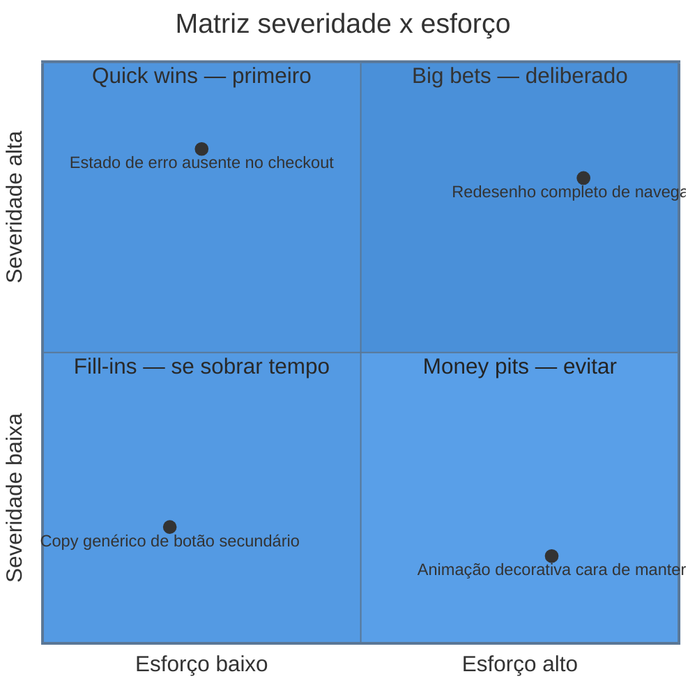
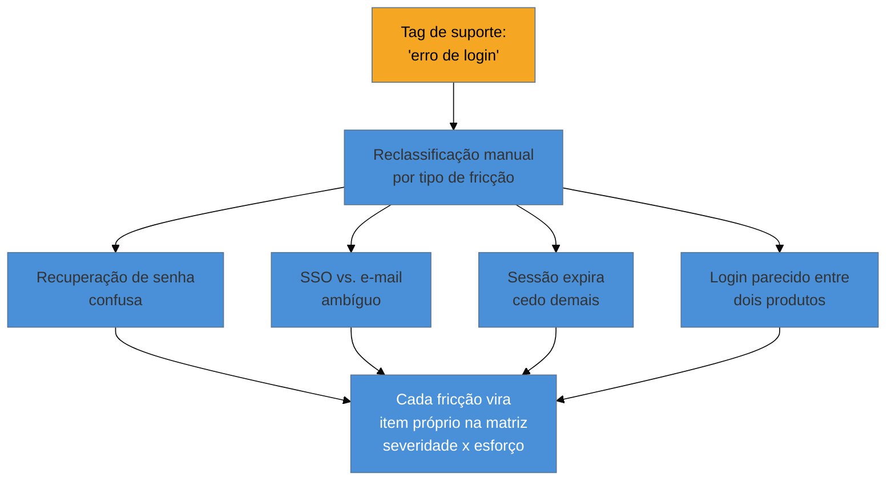

# UX debt e matriz severidade × esforço

> [!abstract] TL;DR
> **UX debt** é a analogia direta de dívida técnica aplicada a decisão de design e interação: decisões que resolveram uma necessidade de curto prazo (um prazo apertado, um pedido do cliente aceito sem revisão) e acumulam custo futuro — retrabalho, confusão de usuário, ticket de suporte. Priorizar essa dívida usa uma **matriz severidade × esforço** de quatro quadrantes: **quick wins** (severidade alta, esforço baixo — resolver primeiro), **big bets** (alto/alto — deliberados, não acidentais), **fill-ins** (baixo/baixo — encaixar quando sobra tempo), **money pits** (severidade baixa, esforço alto — evitar). **Severidade** combina quanto o problema bloqueia/confunde/degrada a conclusão da tarefa **com** o impacto de negócio (conversão, retenção, volume de suporte, compliance). O ticket de suporte é um ativo de pesquisa subutilizado e barato — mas suporte categoriza para **resolução**, não para **pesquisa**: uma mesma tag ("erro de login") pode esconder quatro problemas de UX distintos, e exige reclassificação por tipo de fricção antes de virar dado de priorização confiável.

Imagine herdar um backlog de "melhorias de UX" com 40 itens, sem prioridade nenhuma além da ordem em que foram anotados — alguns vieram de reclamação de cliente, alguns de uma observação sua durante um teste, alguns de um "seria legal se" que ninguém lembra de onde saiu. O cliente pergunta "o que a gente resolve primeiro?" e a resposta honesta, sem nenhum critério aplicado, é "não sei — o que parecer mais urgente hoje". Um mês depois, o time gastou duas semanas inteiras corrigindo um problema visual pequeno que quase ninguém notava (porque alguém do time reclamou dele em voz alta numa reunião) enquanto um fluxo de checkout confuso, gerando dezenas de tickets de suporte por semana, continuou intocado. Não faltou trabalho — faltou um critério que separasse o que realmente dói do que só incomoda quem está olhando de perto.

## UX debt: a mesma dívida, outro balanço

A analogia com **dívida técnica** — o termo cunhado por Ward Cunningham em 1992 para descrever o custo futuro de escolhas técnicas rápidas — é direta e útil precisamente porque o leitor deste domínio já domina o conceito original: assim como código escrito com pressa "funciona hoje e cobra juros depois" (retrabalho, bug, dificuldade de manutenção), **decisões de UX tomadas sob pressão de prazo também acumulam custo futuro** — só que o "juro" é pago pelo usuário (confusão, fricção, tarefa que demora mais do que deveria) antes de ser pago pelo time (retrabalho de redesenho, aumento de ticket de suporte, queda de métrica de Task Success — ver [[03-Dominios/Engenharia/UX/Medir, Validar e Sustentar/38 - HEART e Goals-Signals-Metrics|nota 38]]).

A origem da dívida de UX segue o mesmo padrão da dívida técnica: um formulário de 14 campos numa tela só porque "é mais rápido de construir assim" (o mesmo cenário citado na [[03-Dominios/Engenharia/UX/Fundamentos e Modelo Mental/01 - UX não é tela - o ofício e seus limites|nota 01]] de abertura do domínio), um fluxo copiado de outra tela sem adaptar ao contexto novo, um estado de erro que nunca foi desenhado (ver [[03-Dominios/Engenharia/UX/Design de Interação/20 - Os 5 estados de tela|nota 20]] sobre os cinco estados de tela) porque "provavelmente não vai dar erro". Cada uma dessas decisões resolveu um problema imediato — entregar no prazo — e criou um passivo que continua existindo, silenciosamente, até alguém decidir pagá-lo ou até ele custar caro o suficiente para forçar a mão.

> [!question]- Se UX debt é "igual" dívida técnica, por que precisa de nota própria em vez de reaproveitar o vocabulário de engenharia direto?
> Porque o **sintoma** de UX debt aparece num lugar diferente do sintoma de dívida técnica, e isso muda quem percebe o problema primeiro. Dívida técnica aparece para quem lê o código — outro engenheiro, você mesmo seis meses depois. UX debt aparece para o usuário, silenciosamente, e só chega até você via proxy — reclamação de cliente, ticket de suporte, queda de métrica — o que significa que **UX debt tem mais chance de ficar invisível por mais tempo** antes de alguém do time notar. A analogia é direta na estrutura (custo futuro por decisão de curto prazo), mas o caminho de detecção é mais indireto — e é exatamente esse caminho indireto que a seção sobre ticket de suporte, mais adiante nesta nota, ajuda a encurtar.

## A matriz severidade × esforço

Priorizar UX debt (ou qualquer backlog de melhoria de UX, na verdade) usando **impacto/severidade contra esforço** organiza a decisão em quatro quadrantes:

1. **Quick wins** — severidade alta, esforço baixo. Resolver **primeiro**, sempre — é o quadrante de maior retorno por unidade de trabalho, e ignorá-lo em favor de itens "mais interessantes" é o erro de priorização mais comum e mais caro.
2. **Big bets** — severidade alta, esforço alto. Não são acidentes de escopo que "cresceram" — são investimentos **deliberados**, que exigem decisão explícita de negócio sobre quando vale pagar o custo alto, geralmente reservados para quando o quick win já esgotou o retorno fácil.
3. **Fill-ins** — severidade baixa, esforço baixo. Encaixam quando sobra capacidade entre entregas maiores; não merecem planejamento dedicado, mas também não custam nada resolver quando aparece uma brecha.
4. **Money pits** — severidade baixa, esforço alto. O quadrante a **evitar deliberadamente**: gastar esforço grande num problema que pouca gente sente é o padrão clássico de "retrabalho caro que ninguém pediu", geralmente motivado por preferência pessoal de quem decide, não por evidência de impacto real.

**Severidade**, no eixo vertical, não é só "quão feio parece" — é a combinação de duas coisas: **quanto o problema bloqueia, confunde ou degrada a conclusão da tarefa** (o lado de experiência) **mais** o **impacto de negócio** que ele gera (conversão perdida, retenção afetada, volume de ticket de suporte, risco de compliance). Um problema visual pequeno que ninguém do negócio nota, mas que gera dezenas de tickets de suporte por semana, tem severidade alta mesmo parecendo cosmético à primeira vista — porque o impacto de negócio (custo de suporte) compensa a aparente pequenez do sintoma visual.

## Ticket de suporte como fonte de pesquisa: o ativo que já existe

Para quem trabalha sozinho, sem orçamento de pesquisa dedicada, o **ticket de suporte é um ativo de pesquisa já pago e subutilizado**: o volume de tickets documenta falha real, relatada por usuário real, sem custo adicional de recrutamento ou entrevista. É dado que já existe, esperando ser lido com outro objetivo.

O desafio central, e o motivo de essa fonte não ser trivial de usar direto: **suporte categoriza tickets para resolução, não para pesquisa**. Um agente de suporte, ao fechar um ticket com a tag "erro de login", está registrando o suficiente para saber que o problema foi resolvido — não está registrando *qual tipo de fricção de UX* causou o erro. A mesma tag "erro de login" pode esconder, na prática:

- um usuário que esqueceu a senha (fricção de recuperação de conta);
- um usuário confuso entre login com e-mail vs. login com SSO corporativo (fricção de arquitetura de informação, ver [[03-Dominios/Engenharia/UX/Arquitetura de Informação/index|SG3]]);
- um bug real de sessão expirando cedo demais (fricção técnica, não de design);
- um usuário tentando entrar com a conta errada porque dois produtos da mesma empresa têm login parecido (fricção de nomenclatura entre produtos).

Quatro problemas de UX completamente diferentes, uma única tag de suporte. **Reclassificar por tipo de fricção** — ler uma amostra de tickets com essa tag e categorizar manualmente qual dos quatro (ou mais) padrões cada um representa — é o trabalho que transforma dado de suporte, categorizado para resolução, em dado de pesquisa, categorizado para priorização de UX debt.

**O mecanismo em uma frase:** o volume de ticket já mede severidade de negócio (quanto custa em suporte); a reclassificação por tipo de fricção é o que converte esse volume em item específico e acionável na matriz, em vez de um agregado genérico demais para decidir o que fazer.

## O que dá pra fazer sozinho, e o que não dá

Montar a matriz severidade × esforço para o backlog atual de UX debt é **inteiramente praticável sozinho** — não exige ferramenta além de uma planilha ou um quadro simples, e o julgamento de severidade e esforço, mesmo sem dado quantitativo perfeito, já organiza a decisão muito melhor do que a ausência total de critério do cenário de abertura desta nota. Reclassificar uma amostra de 20-30 tickets de suporte por tipo de fricção também é praticável sozinho: é leitura e categorização manual, trabalho de algumas horas, não infraestrutura.

Construir um **pipeline automatizado que classifica ticket de suporte por tipo de fricção usando NLP ou modelo de linguagem**, escalando a reclassificação manual para milhares de tickets em vez de uma amostra — isso já exige mais investimento técnico (mesmo sendo, hoje, mais acessível que há alguns anos) e vale a pena só quando o volume de ticket justifica automatizar em vez de amostrar manualmente algumas dezenas por trimestre.

E um **programa formal de gestão de UX debt com dashboard vivo, revisão trimestral cross-time e orçamento dedicado de "pagamento de dívida" alocado no roadmap** — a estrutura que times maiores de produto adotam para UX debt da mesma forma que adotam sprint dedicado a dívida técnica — é organização que uma pessoa sozinha não tem autoridade nem necessidade de replicar: a matriz numa planilha, revisitada a cada ciclo de trabalho, cumpre a mesma função na escala de um projeto de consultoria.

## Casos práticos

### Cenário 1: o problema visual pequeno que consumiu duas semanas
O cenário de abertura desta nota, na prática: um item do backlog — "o ícone de notificação pisca de um jeito estranho" — vira prioridade porque alguém do time reclamou em voz alta numa reunião. Duas semanas de trabalho depois, o ícone está corrigido, mas o volume de ticket de suporte sobre "não consigo finalizar o pedido" — que já estava alto antes e continua alto — nunca chegou a ser investigado com o mesmo cuidado, porque nunca foi formalmente comparado ao item do ícone numa matriz. Rodando retroativamente a matriz severidade × esforço: o ícone estaria no quadrante fill-in (severidade baixa — ninguém fora do time notou, esforço baixo); o fluxo de checkout, uma vez que os tickets fossem contados e reclassificados, estaria em quick win ou big bet, dependendo do esforço real de correção — e claramente deveria ter vindo primeiro.

### Cenário 2: "erro de login" escondendo quatro problemas
Um produto B2B acumula 60 tickets de suporte por mês com a tag "erro de login" — volume alto o suficiente para aparecer como prioridade óbvia no backlog. Um engenheiro fractional, em vez de atacar "o problema de login" como um item único, lê uma amostra de 25 tickets e reclassifica por tipo de fricção (usando a categorização da seção anterior desta nota): 40% são confusão entre SSO corporativo e login por e-mail, 30% são recuperação de senha mal desenhada, 20% são sessão expirando cedo, 10% são login cruzado entre dois produtos da mesma empresa. Em vez de um item genérico "melhorar login" no backlog, viram quatro itens específicos, cada um com severidade e esforço próprios — o de SSO/e-mail, sendo o de maior volume e provavelmente o de menor esforço de correção (uma tela de escolha mais clara no início do fluxo), vira o quick win óbvio; sessão expirando cedo, sendo um ajuste técnico de configuração, também é resolvido rápido; os outros dois entram na matriz com prioridade mais baixa.

### Cenário 3: o big bet tratado como acidente de escopo
Um cliente pede uma "pequena melhoria" na navegação principal do produto. Ao investigar, o engenheiro percebe que a estrutura de menu inteira precisa ser repensada — não é um ajuste pequeno, é uma reformulação de arquitetura de informação que vai levar semanas. Sem nomear isso explicitamente como **big bet** (severidade alta, esforço alto — item deliberado, não acidental), o projeto entra em "escopo crescendo silenciosamente", com o cliente achando que ainda está pagando por uma "pequena melhoria". Nomear o item como big bet desde o início — "isso que parece pequeno é, na verdade, um item de alto esforço e alto impacto; recomendo tratá-lo como projeto à parte, com escopo e prazo próprios" — evita a frustração de escopo mal comunicado e transforma uma surpresa desagradável numa decisão de negócio explícita.

## Armadilhas comuns

> [!warning] Priorizar pelo que incomoda quem decide, não pelo que tem maior severidade real
> **O que acontece:** um item do backlog sobe de prioridade porque foi mencionado em voz alta numa reunião, não porque tem o maior impacto de negócio ou experiência medido. **Por quê:** a proximidade emocional de "alguém reclamou na minha frente ontem" pesa mais na percepção do que um número frio de ticket de suporte que ninguém olhou com atenção — vieses de disponibilidade cognitiva competem com dado real. **Como evitar:** sempre passe qualquer item novo de backlog pela matriz severidade × esforço antes de priorizar, mesmo quando a origem foi uma reclamação verbal recente — o critério tem que ser o mesmo para todo item, não só para os que "vieram de fora".

> [!warning] Tratar todo item de tag de suporte como um problema único
> **O que acontece:** um volume alto de tickets sob a mesma tag genérica ("erro de login", "não consigo salvar") é atacado como um item único de correção, sem reclassificação por tipo de fricção. **Por quê:** a tag de suporte já vem pronta, categorizada — parece dado suficiente para agir, e reclassificar manualmente parece trabalho extra evitável. **Como evitar:** antes de priorizar qualquer item vindo de agregação de suporte, leia uma amostra e reclassifique por tipo de fricção, como no Cenário 2 — o esforço de leitura é pequeno comparado ao risco de atacar o problema errado.

> [!warning] Deixar um big bet crescer disfarçado de ajuste pequeno
> **O que acontece:** um pedido descrito como "pequeno ajuste" se revela, na investigação, um item de alto esforço — mas ninguém renomeia formalmente o escopo, e o projeto segue tratando-o como se ainda fosse pequeno. **Por quê:** admitir que um pedido é maior do que parecia parece "atrasar" a conversa com o cliente — mas não nomear o tamanho real do item é o que gera o atraso de verdade, mais tarde, quando o escopo já cresceu sem aviso. **Como evitar:** ao identificar que um item pertence ao quadrante big bet, comunique isso explicitamente ao cliente como decisão de escopo separada, como no Cenário 3 — não deixe o item permanecer disfarçado de quick win só porque começou como um pedido pequeno.

> [!warning] Investir esforço grande num money pit por preferência pessoal
> **O que acontece:** um item de baixo impacto real (poucos usuários afetados, sem correlação com métrica de negócio) recebe esforço desproporcional porque alguém do time (ou o próprio cliente) tem preferência estética ou técnica forte por resolvê-lo. **Por quê:** preferência pessoal de quem decide é um sinal forte de prioridade percebida, mesmo quando o dado de severidade real (volume de ticket, impacto de métrica) não sustenta esse peso. **Como evitar:** exponha explicitamente o item no quadrante money pit da matriz, com os dados de severidade que o colocam ali, antes de aceitar o esforço — nomear o quadrante em voz alta muda a conversa de "gosto/não gosto" para "isso vale o esforço que estamos prestes a gastar?".

## Como explicar em inglês

> "UX debt is the direct analogy of technical debt applied to design decisions: shortcuts that solved a short-term need and accumulate future cost. Prioritizing it uses a **severity × effort matrix** — quick wins first, big bets as deliberate investments, fill-ins when there's spare capacity, and money pits to actively avoid. Severity combines how much a problem blocks task completion with its business impact. Support tickets are an underused, already-paid-for research asset — but support categorizes for *resolution*, not *research*: the same tag can hide several distinct UX frictions, and reclassifying by friction type is what turns ticket volume into an actionable backlog item."

| PT | EN |
|----|----|
| dívida de UX | UX debt |
| matriz severidade x esforço | severity x effort matrix |
| ganho rápido | quick win |
| aposta grande | big bet |
| poço sem fundo | money pit |
| reclassificar por tipo de fricção | reclassify by friction type |

## O que vem a seguir

Priorizar a dívida certa ainda deixa uma última pergunta em aberto, a mais política de todas: como apresentar essa priorização — e qualquer decisão de UX baseada em dado — de um jeito que resista a uma reunião de negócio cética, sem inflar o número nem fingir certeza que os dados não sustentam.

- [[03-Dominios/Engenharia/UX/Medir, Validar e Sustentar/45 - Defender decisão de UX com número|45 — Defender decisão de UX com número]] — como comunicar prioridade e impacto de UX debt (e qualquer outra decisão) de forma honesta.
- [[03-Dominios/Engenharia/UX/Design de Interação/20 - Os 5 estados de tela|20 — Os 5 estados de tela]] — origem comum de UX debt quando estados como erro e vazio nunca são desenhados de propósito.

## Fontes

- **Ward Cunningham** — origem do termo "dívida técnica" (1992), base da analogia estrutural desta nota.
- **Nielsen Norman Group** — [*UX Debt: How to Identify, Prioritize, and Resolve*](https://www.nngroup.com/articles/ux-debt/) — artigo de referência sobre UX debt e as quatro atividades centrais de gestão.
- **Nielsen Norman Group** — [*Using Prioritization Matrices to Inform UX Decisions*](https://www.nngroup.com/articles/prioritization-matrices/) — matriz de priorização severidade/impacto × esforço aplicada a decisão de UX.

> [!tip] Assista: UX Debt
> **Canal:** Nielsen Norman Group (NN/g), com Kara Pernice e Anna Kaley | **Duração:** ~3min | **Idioma:** EN
>
> Explica a analogia entre UX debt e dívida técnica e como times ágeis podem adaptar processo para rastrear e resolver UX debt de forma contínua — o argumento central desta nota. Cobertura parcial: o vídeo trata da definição e do processo de gestão de UX debt em termos gerais; a matriz severidade × esforço com seus quatro quadrantes e a técnica de reclassificação de ticket de suporte por tipo de fricção são desenvolvidas nesta nota a partir de outras fontes.
>
> 🎬 [Assistir no YouTube](https://www.youtube.com/watch?v=4MdJXPVvrts)
